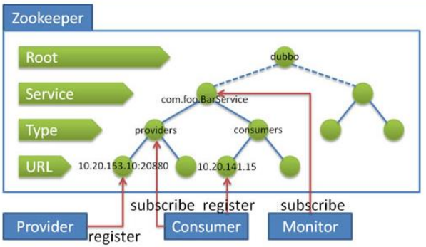
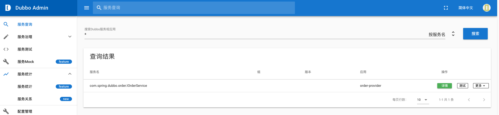

# 1 为什么要用 Dubbo

## 1.1 远程通信背景

和传统的单体架构相比，分布式多了一个`远程服务之间的通信`，不管是 soa 还是微服务，他们本质上都是对于业务服务的提炼和复用。那么远程服务之间的调用才是实现分布式的关键因素。

不用这些开源的 RPC 框架，也可以完成通信的过程。但是为什么要用现成的框架呢？

如果我们自己去开发一个网络通信，需要考虑到 

1. 底层网络通信协议的处理
2. 序列化和反序列化的处理工作 

但是这些工作本身应该是通用的，应该是一个中间件服务。为整个公司提供远程通信的服务。而不应该由业务开发人员来自己去实现，所以才有了这样 的 rpc 框架，使得我们调用远程方法时就像调用本地方法那么简单，不需要关心底层的通信逻辑。

## 1.2 大规模服务化对于服务治理的要求 

是当企业开始大规模 的服务化以后，远程通信带来的弊端就越来越明显了。

1. 服务链路变长了，如何实现对服务链路的跟踪和监控
2. 服务的大规模集群使得服务之间需要依赖第三方注册中心来解决服务的发现和服务的感知问题 
3. 服务通信之间的异常，需要有一种保护机制防止一个节点故障引发大规模的系统故障，所以要有容错机制 
4. 服务大规模集群会是的客户端需要引入负载均衡机制实现请求分发

dubbo 主要是一个分布式服务治理解决方案，那么什么是服务治理？`服务治理`主要是针对大规模服务化以后，服务之间的路由、负载均衡、容错机制、 服务降级这些问题的解决方案，而 Dubbo 实现的不仅仅是远程服务通信， 并且还解决了服务路由、负载、降级、容错等功能。

## 1.3 Dubbo 的发展历史 

Dubbo 是阿里巴巴内部使用的一个分布式服务治理框架，2012 年开源。

在 2014 年 10 月份，Dubbo 停止了维护。后来在 2017 年的 9 月份，阿里宣 布重启 Dubbo，并且对于 Dubbo 做好了长期投入的准备，并且在这段时间 Dubbo 进行了非常多的更新，目前的版本已经到了 2.7。

2018 年 2 月份，Dubbo 捐给了 Apache。另外，阿里巴巴对于 Spring Cloud Alibaba 生态的完善，以及 Spring Cloud 团队对于 alibaba 整个服务治理生 态的支持，所以 Dubbo 未来依然是国内绝大部分公司的首要选择。

# 2 Dubbo 的基本使用

## 2.1 服务端配置

创建 dubbo-server 项目，同时创建 server-api 和 server-provider 模块

```xml
<dependency>
    <groupId>org.apache.dubbo</groupId>
    <artifactId>dubbo</artifactId>
    <version>2.7.2</version>
</dependency>
<dependency>
    <groupId>org.slf4j</groupId>
    <artifactId>slf4j-api</artifactId>
    <version>1.7.26</version>
</dependency>
<dependency>
    <groupId>ch.qos.logback</groupId>
    <artifactId>logback-classic</artifactId>
    <version>1.2.3</version>
</dependency>
```

```java
// server-api 提供接口
public interface LoginService {
    String login(@PathParam("username") String username, String password);
}
// server-provider 负责实现并提供服务
public class LoginServiceImpl implements LoginService {
    public String login(String username, String password) {
        return username + ", LOGIN SUCCESS!!!";
    }
}
```

server-provider 模块下，resources 下添加日志配置文件 logback.xml

```xml
<?xml version="1.0" encoding="UTF-8"?>
<configuration>
    <appender name="STDOUT"
              class="ch.qos.logback.core.ConsoleAppender">
        <layout class="ch.qos.logback.classic.PatternLayout">
            <pattern>%date{ISO8601} %-5level [%thread] %logger{32} - %message%n</pattern>
        </layout>
    </appender>
    <root>
        <level value="DEBUG"/>
        <appender-ref ref="STDOUT"/>
    </root>
</configuration>
```

resources 下添加 /META-INF/spring/application.xml

```xml
<!-- 提供方应用信息，用于计算依赖关系 -->
<dubbo:application name="dubbo-server" />
<!-- 使用 multicast 广播注册中心暴露服务地址 -->
<dubbo:registry address="N/A" />
<!-- 用 dubbo 协议在 20880 端口暴露服务 -->
<dubbo:protocol name="dubbo" port="20880" />
<!-- 声明需要暴露的服务接口 -->
<dubbo:service interface="com.spring.service.LoginService" ref="loginService"/>
<!-- 和本地 bean 一样实现服务 -->
<bean id="loginService" class="com.spring.service.impl.LoginServiceImpl" />
```

启动服务

```java
Main.main(args);
```

## 2.2 客户端配置

```xml
<!-- 提供方应用信息，用于计算依赖关系 -->
<dubbo:application name="dubbo-login " />
<!-- 使用 multicast 广播注册中心暴露服务地址 -->
<dubbo:registry address="N/A" />
<dubbo:reference id="loginService" interface="com.spring.service.LoginService" url="dubbo://localhost:20880/com.spring.service.LoginService" />
```

```java
ClassPathXmlApplicationContext classPathXmlApplicationContext= new ClassPathXmlApplicationContext(new String[]{"application.xml"});
LoginService loginService = (LoginService)classPathXmlApplicationContext.getBean("loginService");
System.out.println(loginService.login("admin","admin"));
```

## 2.3 DubboMain 启动的真相

刚刚使用 `Main.main(args);` 来启动 dubbo 服务，到底是如何实现的呢？ 

正常情况下，我们会认为服务的发布，需要 tomcat、或者 jetty 这类的容器支持，但是只用 Dubbo 以后，我们并不需要这样重的服务器去支持，同时也会增加复杂性，和浪费资源。Dubbo 提供了几种容器让我们去启动和发布服务。

### 2.3.1 容器类型

**Spring Container** 自动加载 META-INF/spring 目录下的所有 Spring 配置

**logback Container** 自动装配 logback 日志 

**Log4j Container** 自动配置 log4j 的配置 

Dubbo 提供了一个 Main.main 快速启动相应的容器，默认情况下，只会启 动 spring 容器。

### 2.3.2 原理分析

默认情况下，spring 容器本质上就是加在 spring ioc 容器，然后启动 一个 `netty 服务`实现服务的发布，所以并没有特别多的黑科技，下面是 spring 容器启动的代码:

```java
public void start() {
    String configPath = ConfigUtils.getProperty("dubbo.spring.config");
    if (StringUtils.isEmpty(configPath)) {
        configPath = "classpath*:META-INF/spring/*.xml";
    }
    context = new ClassPathXmlApplicationContext(configPath.split("[,\\s]+"), false);
    context.refresh();
    context.start();
}
```

# 3 基于注册中心的 Dubbo 服务

作为主流的服务治理组件，Dubbo 提供了很多丰富的功能，那么最根本的就是要解决大规模集群之后的服务注册和发现的问题。而 dubbo 中对于注册中心这块是使用 zookeeper 来支撑的。当然在目前最新的版本中，Dubbo 能够支持的注册中心有：consul、etcd、nacos、sofa、zookeeper、 redis、multicast。

```xml
<dependency>
    <groupId>org.apache.curator</groupId>
    <artifactId>curator-framework</artifactId>
    <version>4.0.0</version>
</dependency>
<dependency>
    <groupId>org.apache.curator</groupId>
    <artifactId>curator-recipes</artifactId>
    <version>4.0.0</version>
</dependency>
```

服务端配置文件

```xml
<dubbo:registry address="zookeeper://localhost:2181" />
<!-- 如果是 zookeeper 集群，则配置的方式是 address=”zookeeper://ip:host?backup=ip:host,ip:host” -->
```

客户端配置文件

```xml
<dubbo:registry address="zookeeper://localhost:2181" />
<dubbo:reference id="loginService" interface="com.spring.service.LoginService" />
```

## 3.1 Dubbo 集成 Zookeeper 的实现原理 



**dubbo 每次都要连 zookeeper？ **

很多同学会有疑问，是不是每次发起一个请求的时候，都需要访问注册中心呢？作为一个设计者，你会怎么去解决这个问题。 

答案很显然是通过缓存实现

```xml
<!-- 在消费端的配置文件中指定如下路径 -->
<dubbo:registry id="zookeeper" address="zookeeper://localhost:2181" file="d:/dubboserver" />
```

## 3.2 多注册中心支持

```xml
<dubbo:registry address="zookeeper://192.168.25.129:2181" id="registryCenter1"/>
<dubbo:registry address="zookeeper://192.168.25.128:2181" id="registryCenter2"/>
<!-- 将服务注册到不同的注册中心,通过 registry 设置注册中心的 ID -->
<dubbo:service interface="com.gupaoedu.practice.LoginService" registry="registryCenter1" ref="loginService" />
<!-- 消费端配置多个注册中心,实现的代码和服务端一样 -->
```

注册中心的其他支持

1. 当设置 `<dubbo:registry check="false" />` 时，记录失败注册和订阅请求， 后台定时重试
2. 可通过 `<dubbo:registry username="admin" password="1234" />` 设置 zookeeper 登录信息 
3. 可通过 `<dubbo:registry group="dubbo" />` 设置 zookeeper 的根节点，默认使用 dubbo 作为 dubbo 服务注册的 namespace

# 4 Dubbo 多协议支持

有了多协议的支持，使得其他 rpc 框架的应用程序可以快速的切入到 dubbo 生态中。 同时对于多协议的支持，使得不同应用场景的服务，可以选择合适的协议来发布服务，并不一定要使用 dubbo 提供的长连接方式。

## 4.1 集成 Webservice 协议

webservice 是一个短链接并且是基于 http 协议的方式来实现的 rpc 框架。

```xml
<dependency>
    <groupId>org.apache.cxf</groupId>
    <artifactId>cxf-rt-frontend-simple</artifactId>
    <version>3.3.2</version>
</dependency>
<dependency>
    <groupId>org.apache.cxf</groupId>
    <artifactId>cxf-rt-transports-http</artifactId>
    <version>3.3.2</version>
</dependency>
<dependency>
    <groupId>org.eclipse.jetty</groupId>
    <artifactId>jetty-server</artifactId>
    <version>9.4.19.v20190610</version>
</dependency>
<dependency>
    <groupId>org.eclipse.jetty</groupId>
    <artifactId>jetty-servlet</artifactId>
    <version>9.4.19.v20190610</version>
</dependency>
```

```xml
<!-- 用 dubbo 协议在 20880 端口暴露服务 -->
<dubbo:protocol name="dubbo" port="20880" />
<dubbo:protocol name="webservice" port="8080" server="jetty" />
<!-- 声明需要暴露的服务接口 -->
<!-- 添加多协议支持，一个服务可以发布多种协议的支持，也可以实现不同服务发布不同的协议 -->
<dubbo:service interface="com.spring.service.LoginService" ref="loginService" protocol="dubbo,webservice" />
```

访问 http://localhost:8080/com.spring.service.LoginService?wsdl 来获得 Webservice 的 wsdl 描述文档。

## 4.2 Dubbo 对于 REST 协议的支持 

Dubbo 中的 REST（表述性资源转移）支持，是基于 `JAX-RS2.0(Java API for RESTful Web Services)` 来实现的。 

REST 是一种架构风格，简单来说就是对于 api 接口的约束，基于 URL 定位资源，使用 http 动词（GET/POST/DELETE）来描述操作。

### 4.2.1 JAX-RS 协议说明

REST 很早就提出来了，在早期开发人员为了实现 REST，会使用各种工具来实现，比如 Servlets 就经常用来开发 RESTful 的程序。随着 REST 被越来越多的开发人员采用，所以 JCP(Java community process) 提出了 JAX-RS 规 范，并且提供了一种新的基于注解的方式来开发 RESTful 服务。有了这样的 一个规范，使得开发人员不需要关心通讯层的东西，只需要关注资源以以及数据对象。 

JAX-RS 规范的实现有：Apache CXF、Jersey(由 Sun 公司提供的 JAX-RS 的 参考实现)、RESTEasy( jboss 实现)等。 而 Dubbo 里面实现的 REST 就是基于 Jboss 提供的 RESTEasy 框架来实现的。SpringMVC 中的 RESTful 实现我们用得比较多，它也是 JAX-RS 规范的一种实现。

```xml
<!--JAX-RS  CXF / Jersey /RESTEasy-->
<dependency>
    <groupId>org.jboss.resteasy</groupId>
    <artifactId>resteasy-jaxrs</artifactId>
    <version>3.8.1.Final</version>
</dependency>
<dependency>
    <groupId>org.jboss.resteasy</groupId>
    <artifactId>resteasy-client</artifactId>
    <version>4.0.0.Final</version>
</dependency>
```

```xml
<!-- 添加新的协议支持 -->
<dubbo:protocol name="rest" port="8888" server="jetty"/>
```

**提供新的服务**

```java
// 指定访问 LoginService 的 URL 相对路径是/login
@Path("/login")
public interface LoginService {
    // 指定访问 login()用 HTTP GET 方法
    @GET
    // 指定访问 login()方法的 URL 相对路径是/XXX， 再结合上一个 @Path 为 LoginService 指定的路径，则调用 LoginService.login()的完整路径为 http://localhost:8080/login/XXX
    @Path("/{username}")
    String login(@PathParam("username") String username, String password);
}
```

http://localhost:8888/login/admin

## 4.3 在服务接口获得上下文的方式

既然是 http 协议的 REST 接口，那么我们想要获得请求的上下文，怎么做呢？ 

第一种

```java
HttpServletRequest request=(HttpServletRequest)RpcContext.getContext().getRequest(); 
```

第二种

通过注解的方式

```java
@GET
@Path("/register/{id}") 
void register(@PathParam("id") int id, @Context HttpServletRequest request); 
```

# 5 多版本支持

服务端：

```xml
<dubbo:service interface="com.spring.dubbo.order.IOrderService" ref="orderService" version="1.0.0"/>
<dubbo:service interface="com.spring.dubbo.order.IOrderService" ref="orderService2" version="2.0.0"/>
```

客户端：

```xml
<dubbo:reference id="orderService" interface="com.spring.dubbo.order.IOrderService" version="2.0.0"/>
<!-- dubbo://192.168.174.1:20880/com.spring.dubbo.order.IOrderService?..&amp;version=1.0.0 -->
<!-- dubbo://192.168.174.1:20880/com.spring.dubbo.order.IOrderService?..&amp;version=2.0.0 -->
```

# 6 Dubbo 监控平台安装

[dubbo-admin github 地址](https://github.com/apache/dubbo-admin.git)

- 运行 dubbo-admin-server 它是一个标准的 spring boot 项目, 可以在任何 java IDE 中运行它，可以在 application.properties 中指定注册中心地址修改(同时可以修改登录的账号密码)

- 运行 dubbo-admin-ui 由npm管理和构建，在开发环境中，可以单独运行

  ```
  npm install
  npm run dev
  ```

- 访问 `http://localhost:8081`, 由于前后端分开部署，前端支持热加载，任何页面的修改都可以实时反馈，不需要重启应用。




# 7 Dubbo 的终端操作方法

Dubbo 里面提供了一种基于终端操作的方法来实现服务治理，使用 `telnet localhost 20880` 连接到服务对应的端口。

**ls**

ls: 显示服务列表 

ls -l: 显示服务详细信息列表 

ls XxxService: 显示服务的方法列表

ls -l XxxService: 显示服务的方法详细信息列表 

**ps**

ps: 显示服务端口列表 

ps -l: 显示服务地址列表 

ps 20880: 显示端口上的连接信息 

ps -l 20880: 显示端口上的连接详细信息 

**cd**

cd XxxService: 改变缺省服务，当设置了缺省服务，凡是需要输入服务名作 为参数的命令，都可以省略服务参数 

cd /: 取消缺省服务 

**pwd**

pwd: 显示当前缺省服务

**count**

count XxxService: 统计 1 次服务任意方法的调用情况 

count XxxService 10: 统计 10 次服务任意方法的调用情况 

count XxxService xxxMethod: 统计 1 次服务方法的调用情况 

count XxxService xxxMethod 10: 统计 10 次服务方法的调用情况

------


