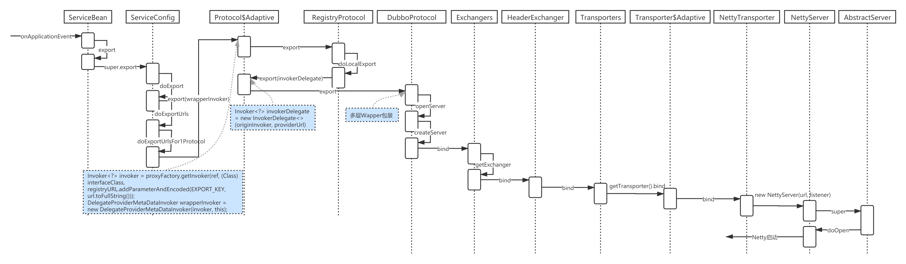

按照前面对于 dubbo 的理解，如果要实现服务发布和注册，需要做哪些事情？ 

1. 配置文件解析或者注解解析 
2. 服务注册 
3. 启动 netty 服务实现远程监听

# 1 Dubbo 对于 sping 的扩展

## 1.1 Spring 的标签扩展

在 spring 中定义了两个接口

`NamespaceHandler` 注册一堆 BeanDefinitionParser，利用它们来解析

`BeanDefinitionParser` 解析配置文件的元素 

Spring 会默认加载jar包下 /META-INF/spring.handlers，找到对应的 NamespaceHandler


## 1.2 Dubbo 的接入实现

Dubbo 中 Spring 扩展就是使用 Spring 的自定义类型，所以同样也有NamespaceHandler、BeanDefinitionParser。而 NamespaceHandler 是DubboNamespaceHandler。

```java
public class DubboNamespaceHandler extends NamespaceHandlerSupport {

    static {
        Version.checkDuplicate(DubboNamespaceHandler.class);
    }

    @Override
    public void init() {
        registerBeanDefinitionParser("application", new DubboBeanDefinitionParser(ApplicationConfig.class, true));
        registerBeanDefinitionParser("module", new DubboBeanDefinitionParser(ModuleConfig.class, true));
        registerBeanDefinitionParser("registry", new DubboBeanDefinitionParser(RegistryConfig.class, true));
        registerBeanDefinitionParser("config-center", new DubboBeanDefinitionParser(ConfigCenterBean.class, true));
        registerBeanDefinitionParser("metadata-report", new DubboBeanDefinitionParser(MetadataReportConfig.class, true));
        registerBeanDefinitionParser("monitor", new DubboBeanDefinitionParser(MonitorConfig.class, true));
        registerBeanDefinitionParser("metrics", new DubboBeanDefinitionParser(MetricsConfig.class, true));
        registerBeanDefinitionParser("provider", new DubboBeanDefinitionParser(ProviderConfig.class, true));
        registerBeanDefinitionParser("consumer", new DubboBeanDefinitionParser(ConsumerConfig.class, true));
        registerBeanDefinitionParser("protocol", new DubboBeanDefinitionParser(ProtocolConfig.class, true));
        registerBeanDefinitionParser("service", new DubboBeanDefinitionParser(ServiceBean.class, true));
        registerBeanDefinitionParser("reference", new DubboBeanDefinitionParser(ReferenceBean.class, false));
        registerBeanDefinitionParser("annotation", new AnnotationBeanDefinitionParser());
    }

}
```

BeanDefinitionParser 全部都使用了 DubboBeanDefinitionParser，如果我们想看 <dubbo:service> 的配置，就直接看 DubboBeanDefinitionParser(ServiceBean.class, true) 中。

这个里面主要做了一件事，把不同的配置分别转化成 Spring 容器中的 bean 对象： 

application 对应 ApplicationConfig 

registry 对应 RegistryConfig 

monitor 对应 MonitorConfig 

provider 对应 ProviderConfig 

consumer 对应 ConsumerConfig

…

我们仔细看，发现涉及到服务发布和服务调用的两个配置的解析，使用的是 ServiceBean 和 ReferenceBean。并不是 config 结尾 的，这两个类稍微特殊些，当然他同时也继承了 ServiceConfig 和 ReferenceConfig。

## 1.3 DubboBeanDefinitionParser

这里面是实现具体配置文件解析的入口，它重写了 parse 方法，对 spring 的配置进行解析。我们关注一下 ServiceBean 的解析。实际就是解析 dubbo:service 这个标签中对应的属性：

```java
else if (ServiceBean.class.equals(beanClass)) {
    String className = element.getAttribute("class");
    if (className != null && className.length() > 0) {
        RootBeanDefinition classDefinition = new RootBeanDefinition();
        classDefinition.setBeanClass(ReflectUtils.forName(className));
        classDefinition.setLazyInit(false);
        parseProperties(element.getChildNodes(), classDefinition);
        beanDefinition.getPropertyValues().addPropertyValue("ref", new BeanDefinitionHolder(classDefinition, id + "Impl"));
    }
}
```

## 1.4 ServiceBean 的实现

ServiceBean 这个类分别实现了InitializingBean、DisposableBean、ApplicationContextAware、ApplicationListener、BeanNameAware、ApplicationEventPublisherAware。

**InitializingBean**

接口为bean提供了初始化方法的方式，它只包括 afterPropertiesSet 方法，凡是继承该接口的类，在初始化bean的时候会执行该方法。 

**DisposableBean**

bean被销毁的时候，spring容器会自动执行 destory 方法，比如释放资源 

**ApplicationContextAware**

实现了这个接口的bean，当spring容器初始化的时候，会自动的将 ApplicationContext 注入进来 

**ApplicationListener**

ApplicationEvent 事件监听，Spring 容器启动后会发一个事件通知。被重写的方法为: onApplicationEvent,onApplicationEvent 方法传入的对象是 ContextRefreshedEvent。这个对象是当 Spring 的上下文被刷新或者加载完毕的时候触发的。因此服务就是在 Spring 的上下文刷新后进行导出操作的

**BeanNameAware**

获得自身初始化时，本身的 bean 的 id 属性，被重写的方法为 setBeanName

**ApplicationEventPublisherAware**

这个是一个异步事件发送器。被重写的方法为 setApplicationEventPublisher,简单来说，在 spring 里面提供了类似于消息队列 的异步事件解耦功能。（典型的观察者模式的应用）

Spring 事件发送监听由 3 个部分组成 

1. ApplicationEvent：表示事件本身，自定义事件需要继承该类 

2. ApplicationEventPublisherAware：事件发送器，需要实现该接口 

3. ApplicationListener：事件监听器接口

# 2 ServiceBean 中服务暴露过程

## 2.1 Spring 容器启动

在 ServiceBean 中，我们暂且只需要关注两个方法，分别是: 

在初始化 bean 的时候会执行该方法 afterPropertiesSet

Spring 容器启动后会发一个事件通知 onApplicationEvent

### 2.1.1 afterPropertiesSet

我们发现这个方法里面，就是把 dubbo 中配置的 application、registry、service、protocol 等信息，加载到对应的 config 实体中，便于后续的使用。

### 2.1.2 onApplicationEvent

spring 容器启动之后，会收到一个这样的事件通知，这里面做了两个事情

* 判断服务是否已经发布过

* 如果没有发布，则调用调用 export 进行服务发布的流程（这里就是入口）

```java
public void onApplicationEvent(ContextRefreshedEvent event) {
    if (!isExported() && !isUnexported()) {
        if (logger.isInfoEnabled()) {
            logger.info("The service ready on spring started. service: " + getInterface());
        }
        export();
    }
}
```

### 2.1.3 export

ServiceBean 中，重写了 export 方法，实现了一个事件的发布。并且调用了 super.export() ，也就是会调用父类的 export 方法：

```java
@Override
public void export() {
    super.export();
    // Publish ServiceBeanExportedEvent
    publishExportEvent();
}
```

## 2.2 ServiceConfig 配置类

先整体来看一下这个类的作用，从名字来看，它应该和其他所有 config 类一样去实现对配置文件中 service 的配置信息的存储。 实际上这个类并不单纯，所有的配置它都放在了一个 AbstractServiceConfig 的抽象类，自己实现了很多对于服务发布之前要做的操作逻辑。

```java
public synchronized void export() {
    // 检查并且更新配置信息
    checkAndUpdateSubConfigs();
    // 当前的服务是否需要发布，通过配置实现：@Service(export = false)
    if (!shouldExport()) {
        return;
    }
    // 检查是否需要延时发布，通过配置@Service(delay = 1000)实现，单位毫秒
    if (shouldDelay()) {
        // 这里的延时是通过定时器实现的
        delayExportExecutor.schedule(this::doExport, getDelay(), TimeUnit.MILLISECONDS);
    } else {
        // 如果没有配置delay，则直接调用 doExport 进行发布
        doExport();
    }
}
```

### 2.2.1 doExport

这里仍然还是在实现发布前的各种判断，比如判断

```java
protected synchronized void doExport() {
    if (unexported) {
        throw new IllegalStateException("The service " + interfaceClass.getName() + " has already unexported!");
    }
     //服务是否已经发布过了
    if (exported) {
        return;
    }
    //设置发布状态
    exported = true;
    //path 表示服务路径，默认使用 interfaceName
    if (StringUtils.isEmpty(path)) {
        path = interfaceName;
    }
    doExportUrls();
}
```

### 2.2.2 doExportUrls

1. 记载所有配置的注册中心地址
2. 遍历所有配置的协议，protocols 
3. 针对每种协议发布一个对应协议的服务

```java
private void doExportUrls() {
    // 加载所有配置的注册中心地址，组装成一个 URL
    // registry://192.168.25.129:2181/org.apache.dubbo.registry.RegistryService?application=server-boot-provider&dubbo=2.0.2&pid=16736&qos-enable=false&registry=zookeeper&release=2.7.2&simplified=true&timestamp=1611644345391
    List<URL> r egistryURLs = loadRegistries(true);
    for (ProtocolConfig protocolConfig : protocols) {
        //group 跟 version 组成一个 pathKey(serviceName)
        String pathKey = URL.buildKey(getContextPath(protocolConfig).map(p -> p + "/" + path).orElse(path), group, version);
        //applicationModel 用来存储 ProviderModel，发布的服务的元数据，后续会用到
        ProviderModel providerModel = new ProviderModel(pathKey, ref, interfaceClass);
        ApplicationModel.initProviderModel(pathKey, providerModel);
        doExportUrlsFor1Protocol(protocolConfig, registryURLs);
    }
}
```

### 2.2.3 doExportUrlsFor1Protocol

发布指定协议的服务，我们以 Dubbo 服务为例，由于代码太多，就不全部贴出来 

1. 前面的一大串 if else 代码，是为了把当前服务下所配置的参数进行解析，保存到 map 集合中 
2. 获得当前服务需要暴露的 ip 和端口 
3. 把解析到的所有数据，组装成一个 URL

```java
private void doExportUrlsFor1Protocol(ProtocolConfig protocolConfig, List<URL> registryURLs) {
	...
    //省略一大串 ifelse 代码，用于解析<dubbo:method> 配置
 	//省略解析<dubbo:service>中配置参数的代码，比如 token、比如 service 中的 method 名称等存储在 map 中
 	//获得当前服务要发布的目标 ip 和 port
    String host = this.findConfigedHosts(protocolConfig, registryURLs, map);
    Integer port = this.findConfigedPorts(protocolConfig, name, map);'
    // 组装 URL
    // dubbo://10.10.41.1:20881/com.spring.service.ISayHelloService?anyhost=true&application=server-boot-provider&bean.name=ServiceBean:com.spring.service.ISayHelloService:v1.0.0&bind.ip=10.10.41.1&bind.port=20881&deprecated=false&dubbo=2.0.2&dynamic=true&generic=false&interface=com.spring.service.ISayHelloService&methods=sayHello&pid=13456&qos-enable=false&register=true&release=2.7.2&revision=v1.0.0&side=provider&timeout=50000&timestamp=1611645156577&version=v1.0.0
    URL url = new URL(name, host, port, getContextPath(protocolConfig).map(p -> p + "/" + path).orElse(path), map);
    //这里是通过 ConfiguratorFactory 去实现动态改变配置的功能，这里暂时不涉及后续再分析
    if (ExtensionLoader.getExtensionLoader(ConfiguratorFactory.class)
            .hasExtension(url.getProtocol())) {
        url = ExtensionLoader.getExtensionLoader(ConfiguratorFactory.class)
                .getExtension(url.getProtocol()).getConfigurator(url).configure(url);
    }
    // 如果 scope!="none"则发布服务，默认 scope 为 null。如果 scope 不为 none，判断是否为 local 或 remote，从而发布 Local 服务 或 Remote 服务，默认两个都会发布
    String scope = url.getParameter(SCOPE_KEY);
    if (!SCOPE_NONE.equalsIgnoreCase(scope)) {
        //injvm 发布到本地
        if (!SCOPE_REMOTE.equalsIgnoreCase(scope)) {
            exportLocal(url);
        }
        //发布远程服务
        if (!SCOPE_LOCAL.equalsIgnoreCase(scope)) {
            for (URL registryURL : registryURLs) {
    		    // ...
               // invoker -> 代理类
               // 此处传递的是 registryURL
    		   Invoker<?> invoker = proxyFactory.getInvoker(ref, (Class) interfaceClass, registryURL.addParameterAndEncoded(EXPORT_KEY, url.toFullString()));
    		   DelegateProviderMetaDataInvoker wrapperInvoker = new DelegateProviderMetaDataInvoker(invoker, this);
               // wrapperInvoker = DelegateProviderMetaDataInvoker(invoker)
    		   Exporter<?> exporter = protocol.export(wrapperInvoker = );
    		   exporters.add(exporter);
		    }
        }
    }
}
```

**Local**

只是 injvm 的服务，提供一种消费者和提供者都在一个 jvm 内的调用方式。使用了 Injvm 协议，是一个伪协议，它不开启端口，不发起远程调用，只在 JVM 内直接关联，(通过集合的方式保存了发布的服务信息)，但执行 Dubbo 的 Filter 链。简单来说，就是你本地的 dubbo 服务调用，都依托于 dubbo 的标准来进行。这样可以享受到 dubbo 的一些配置服务。

**remote**

表示根据根据配置的注册中心进行远程发布。 遍历多个注册中心，进行协议的发布。

1. Invoker 是一个代理类，它是 Dubbo 的核心模型，其它模型都向它靠扰，或转换成它，它代表一个可执行体，可向它发起 invoke 调用，它有可能是一个本地的实现，也可能是一个远程的实现，也可能一个集群实现。（后续单独分析） 
2. DelegateProviderMetaDataInvoker，因为 2.7 引入了元数据，所以这里对 invoker 做了委托，把 invoker 交给 DelegateProviderMetaDataInvoker 来处理 
3. 调用 protocol.export(invoker)来发布这个代理 
4. 添加到 exporters 集合

## 2.3 自适应 Protocol 发布服务

### 2.3.1 protocol.export

这个 protocol 是什么呢？找到定义处发现它是一个自适应扩展点，打开 Protocol 这个扩展点，又可以看到它是一个在方法层面上的自适应扩展，意味着它实现了对于 export 这个方法的适配。也就意味着这个 Protocol 是一个动态代理类， Protocol$Adaptive 

```java
Protocol protocol = ExtensionLoader.getExtensionLoader(Protocol.class).getAdaptiveExtension(); 
```

这个动态代理类，会根据 url 中配置的 protocol name 来实现对应协议的适配。

那么在当前的场景中，protocol 会是调用谁呢？目前发布的 invoker(URL)，实际上是一个 registry://协议，所以 Protocol$Adaptive，会通过 getExtension(extName) 得到一个 RegistryProtocol。

### 2.3.2 Protocol$Adaptive

```java
public org.apache.dubbo.rpc.Exporter export(org.apache.dubbo.rpc.Invoker arg0) throws org.apache.dubbo.rpc.RpcException {
        if (arg0 == null) throw new IllegalArgumentException("org.apache.dubbo.rpc.Invoker argument == null");
        if (arg0.getUrl() == null)
            throw new IllegalArgumentException("org.apache.dubbo.rpc.Invoker argument getUrl() == null");
  			// wrapperInvoker 传递的是 registryURL
        org.apache.dubbo.common.URL url = arg0.getUrl();
  			// extName == Registry
        String extName = (url.getProtocol() == null ? "dubbo" : url.getProtocol());
        if (extName == null)
            throw new IllegalStateException("Failed to get extension (org.apache.dubbo.rpc.Protocol) name from url (" + url.toString() + ") use keys([protocol])");
  			// 生成一个RegistryProtocol静态扩展点
        org.apache.dubbo.rpc.Protocol extension = (org.apache.dubbo.rpc.Protocol) ExtensionLoader.getExtensionLoader(org.apache.dubbo.rpc.Protocol.class).getExtension(extName);
        return extension.export(arg0);
}
```

### 2.3.3 RegistryProtocol

很明显，这个 RegistryProtocol 是用来实现服务注册的，这里面会有很多处理逻辑：

* 实现对应协议的服务发布

* 实现服务注册

* 订阅服务重写

```java
public <T> Exporter<T> export(final Invoker<T> originInvoker) throws RpcException {
    //这里获得的是 zookeeper 注册中心的 url: zookeeper://ip:port
    URL registryUrl = getRegistryUrl(originInvoker);
    //这里是获得服务提供者的 url, dubbo://ip:port...
    URL providerUrl = getProviderUrl(originInvoker);
    /***************************************************************************/
 	//订阅 override 数据。在 admin 控制台可以针对服务进行治理，比如修改权重，修改路由机制等，当注册中心有此服务的覆盖配置注册进来时，推送消息给提供者，重新暴露服务
    final URL overrideSubscribeUrl = getSubscribedOverrideUrl(providerUrl);
    final OverrideListener overrideSubscribeListener = new OverrideListener(overrideSubscribeUrl, originInvoker);
    overrideListeners.put(overrideSubscribeUrl, overrideSubscribeListener);
    providerUrl = overrideUrlWithConfig(providerUrl, overrideSubscribeListener);
    //这里就交给了具体的协议去暴露服务（很重要）
    final ExporterChangeableWrapper<T> exporter = doLocalExport(originInvoker, providerUrl);
    // 根据 invoker 中的 url 获取 Registry 实例: zookeeperRegistry
    final Registry registry = getRegistry(originInvoker);
    //获取要注册到注册中心的 URL: dubbo://ip:port
    final URL registeredProviderUrl = getRegisteredProviderUrl(providerUrl, registryUrl);
    ProviderInvokerWrapper<T> providerInvokerWrapper = ProviderConsumerRegTable.registerProvider(originInvoker,
            registryUrl, registeredProviderUrl);
    //to judge if we need to delay publish
    boolean register = registeredProviderUrl.getParameter("register", true);
    //是否配置了注册中心，如果是， 则需要注册
    if (register) {
        //注册到注册中心的 URL
        register(registryUrl, registeredProviderUrl);
        providerInvokerWrapper.setReg(true);
    }
    //设置注册中心的订阅
    // Deprecated! Subscribe to override rules in 2.6.x or before.
    registry.subscribe(overrideSubscribeUrl, overrideSubscribeListener);
    exporter.setRegisterUrl(registeredProviderUrl);
    exporter.setSubscribeUrl(overrideSubscribeUrl);
    //保证每次 export 都返回一个新的 exporter 实例
    return new DestroyableExporter<>(exporter);
}
```

### 2.3.4 doLocalExport

先通过 doLocalExport 来暴露一个服务，本质上应该是启动一个通信服务，主要的步骤是将本地 ip 和 20880 端口打开，进行监听 originInvoker：应该是 registry://ip:port/com.alibaba.dubbo.registry.RegistryService

key: 从 originInvoker 中获得发布协议的 url: dubbo://ip:port/... 

bounds: 一个 providerUrl 服务 export 之后，缓存到 bounds 中，所以一个 providerUrl 只会对应一个 exporter 

```java
private Protocol protocol;
public void setProtocol(Protocol protocol) {
    this.protocol = protocol;
}

private <T> ExporterChangeableWrapper<T> doLocalExport(final Invoker<T> originInvoker, URL providerUrl) {
    String key = getCacheKey(originInvoker);
    return (ExporterChangeableWrapper<T>) bounds.computeIfAbsent(key, s -> {
        //对原有的 invoker,委托给了 InvokerDelegate
        Invoker<?> invokerDelegate = new InvokerDelegate<>(originInvoker, providerUrl);
        // invokerDelegate = InvokerDelegate(DelegateProviderMetaDataInvoker(invoker))
        //将 invoker 转换为 exporter 并启动 netty 服务
      	// protocol 是通过 set 方法依赖注入进来的
        return new ExporterChangeableWrapper<>((Exporter<T>) protocol.export(invokerDelegate), originInvoker);
    });
}
//java8 的语法 computeIfAbsent 就相当于
if(bounds.get(key)==null){
 	bounds.put(key,s->{})
}
```

`InvokerDelegete` 是 RegistryProtocol 的一个静态内部类，该类是一个 originInvoker 的委托类，该类存储了 originInvoker，其 父类 InvokerWrapper 还会存储 providerUrl，InvokerWrapper 会调用 originInvoker 的 invoke 方法，也会销毁 invoker。可以管理 invoker 的生命周期。

### 2.3.5 DubboProtocol

基于动态代理的适配，很自然的就过渡到了 DubboProtocol 这个协议类中，但是实际上是 DubboProtocol 吗？ 

这里并不是获得一个单纯的 DubboProtocol 扩展点，而是会通过 Wrapper 对 Protocol 进行装饰，装饰器分别为: QosProtocolWrapper/ProtocolListenerWrapper/ProtocolFilterWrapper/DubboProtocol 

```java
// ProtocolFilterWrapper
public <T> Exporter<T> export(Invoker<T> invoker) throws RpcException {
    if (REGISTRY_PROTOCOL.equals(invoker.getUrl().getProtocol())) {
        return protocol.export(invoker);
    }
    return protocol.export(buildInvokerChain(invoker, SERVICE_FILTER_KEY, CommonConstants.PROVIDER));
    // buildInvokerChain 返回
    // invoker = ProtocolFilterWrapper$CallbackRegistrationInvoker(ProtocolFilterWrapper$1(InvokerDelegate(DelegateProviderMetaDataInvoker(invoker))))
}
private static <T> Invoker<T> buildInvokerChain(final Invoker<T> invoker, String key, String group) {
    Invoker<T> last = invoker;
    List<Filter> filters = ExtensionLoader.getExtensionLoader(Filter.class).getActivateExtension(invoker.getUrl(), key, group);
    if (!filters.isEmpty()) {
        for (int i = filters.size() - 1; i >= 0; i--) {
            final Filter filter = filters.get(i);
            final Invoker<T> next = last;
            // last = ProtocolFilterWrapper$1(InvokerDelegate(DelegateProviderMetaDataInvoker(invoker)))
            last = new Invoker<T>() {
                @Override
                public Class<T> getInterface() {
                    return invoker.getInterface();
                }
                @Override
                public URL getUrl() {
                    return invoker.getUrl();
                }
                @Override
                public boolean isAvailable() {
                    return invoker.isAvailable();
                }
                @Override
                public Result invoke(Invocation invocation) throws RpcException {
                    Result asyncResult;
                    try {
                        asyncResult = filter.invoke(next, invocation);
                    } catch (Exception e) {
                        // onError callback
                        if (filter instanceof ListenableFilter) {
                            Filter.Listener listener = ((ListenableFilter) filter).listener();
                            if (listener != null) {
                                listener.onError(e, invoker, invocation);
                            }
                        }
                        throw e;
                    }
                    return asyncResult;
                }
                @Override
                public void destroy() {
                    invoker.destroy();
                }
                @Override
                public String toString() {
                    return invoker.toString();
                }
            };
        }
    }
    return new CallbackRegistrationInvoker<>(last, filters);
}
```

为什么是这样？我们再来看看 spi 的代码

## 2.4 Wrapper 包装

在 ExtensionLoader.loadClass 这个方法中，有一段这样的判断，如果当前这个类是一个 wrapper 包装类，也就是这个 wrapper 中有构造方法，参数是当前被加载的扩展点的类型，则把这个 wrapper 类加入到 cacheWrapperClass 缓存中。

```java
private Set<Class<?>> cachedWrapperClasses;

else if (isWrapperClass(clazz)) {
    cacheWrapperClass(clazz);
}
private boolean isWrapperClass(Class<?> clazz) {
    try {
        clazz.getConstructor(type);
        return true;
    } catch (NoSuchMethodException e) {
        return false;
    }
}
private void cacheWrapperClass(Class<?> clazz) {
    if (cachedWrapperClasses == null) {
        cachedWrapperClasses = new ConcurrentHashSet<>();
    }
    cachedWrapperClasses.add(clazz);
}
```

我们可以在 dubbo 的配置文件中找到三个 Wrapper 

`QosprotocolWrapper` 如果当前配置了注册中心，则会启动一个 Qos server.qos 是 dubbo 的在线运维命令，dubbo2.5.8 新版本重构了 telnet 模块，提供了新的 telnet 命令支持，新版本的 telnet 端口与 dubbo 协议的端口是不同的端口，默认为 22222 

`ProtocolFilterWrapper` 对 invoker 进行 filter 的包装，实现请求的过滤 

`ProtocolListenerWrapper` 用于服务 export 时候插入监听机制，暂未实现

```
qos=org.apache.dubbo.qos.protocol.QosProtocolWrapper
filter=org.apache.dubbo.rpc.protocol.ProtocolFilterWrapper
listener=org.apache.dubbo.rpc.protocol.ProtocolListenerWrapper
```

接着，在 getExtension -> createExtension 方法中，会对 cacheWrapperClass 集合进行判断，如果集合不为空，则进行包装：

```java
Set<Class<?>> wrapperClasses = cachedWrapperClasses;
if (CollectionUtils.isNotEmpty(wrapperClasses)) {
    for (Class<?> wrapperClass : wrapperClasses) {
        instance = injectExtension((T) wrapperClass.getConstructor(type).newInstance(instance));
    }
}
```

### 2.4.1 ProtocolFilterWrapper

这个是一个过滤器的包装，使用责任链模式，对 invoker 进行了包装

```java
public <T> Exporter<T> export(Invoker<T> invoker) throws RpcException {
    if (REGISTRY_PROTOCOL.equals(invoker.getUrl().getProtocol())) {
        return protocol.export(invoker);
    }
    return protocol.export(buildInvokerChain(invoker, SERVICE_FILTER_KEY, CommonConstants.PROVIDER));
}
//构建责任链，基于激活扩展点
private static <T> Invoker<T> buildInvokerChain(final Invoker<T> invoker, String key, String group) {
    Invoker<T> last = invoker;
    List<Filter> filters = ExtensionLoader.getExtensionLoader(Filter.class).getActivateExtension(invoker.getUrl(), key, group);
    ...
}
```

我们看如下文件：

/dubbo-rpc-api/src/main/resources/META-INF/dubbo/internal/org.apache.dubbo.rpc.Filter 

默认提供了非常多的过滤器。 然后基于条件激活扩展点，来对 invoker 进行包装，从而在实现远程调用的时候，会经过这些 filter 进行过滤。

## 2.5 DubboProtocol

```java
// 经历过一系列处理的 invoker（各种包装），在 DubboProtocol 中保存到 exporterMap 中
protected final Map<String, Exporter<?>> exporterMap = new ConcurrentHashMap<String, Exporter<?>>();

public <T> Exporter<T> export(Invoker<T> invoker) throws RpcException {
    URL url = invoker.getUrl();
    //获取服务标识，理解成服务坐标也行。由服务组名，服务名，服务版本号以及端口组成。比如
 	//${group}/com.spring.service.ISayHelloService:${version}:20881
    String key = serviceKey(url);
    //创建 DubboExporter
    DubboExporter<T> exporter = new DubboExporter<T>(invoker, key, exporterMap);
    // 将 <key, exporter> 键值对放入缓存中
    exporterMap.put(key, exporter);
    //export an stub service for dispatching event
    Boolean isStubSupportEvent = url.getParameter(STUB_EVENT_KEY, DEFAULT_STUB_EVENT);
    Boolean isCallbackservice = url.getParameter(IS_CALLBACK_SERVICE, false);
    if (isStubSupportEvent && !isCallbackservice) {
        String stubServiceMethods = url.getParameter(STUB_EVENT_METHODS_KEY);
        if (stubServiceMethods == null || stubServiceMethods.length() == 0) {
            if (logger.isWarnEnabled()) {
                logger.warn(new IllegalStateException("consumer [" + url.getParameter(INTERFACE_KEY) +
                        "], has set stubproxy support event ,but no stub methods founded."));
            }
        } else {
            stubServiceMethodsMap.put(url.getServiceKey(), stubServiceMethods);
        }
    }
    // 启动服务
    openServer(url);
    // 优化序列化
    optimizeSerialization(url);
    return exporter;
}
```

### 2.5.1 openServer

去开启一个服务，并且放入到缓存中 -> 在同一台机器上（单网卡），同一个端口上仅允许启动一个服务器实例

```java
private void openServer(URL url) {
    // 获取 host:port，并将其作为服务器实例的 key，用于标识当前的服务器实例
    String key = url.getAddress();
    // client 也可以暴露一个只有 server 可以调用的服务
    boolean isServer = url.getParameter(IS_SERVER_KEY, true);
    if (isServer) {
        // 是否在 serverMap 中缓存了
        ExchangeServer server = serverMap.get(key);
        if (server == null) {
            synchronized (this) {
                server = serverMap.get(key);
                if (server == null) {
                    // 创建服务器实例
                    serverMap.put(key, createServer(url));
                }
            }
        } else {
            // 服务器已创建，则根据 url 中的配置重置服务器
            server.reset(url);
        }
    }
}
```

### 2.5.2 createServer

创建服务，开启心跳检测，默认使用 netty。组装 url

```java
private ExchangeServer createServer(URL url) {
    //组装 url，在 url 中添加心跳时间、编解码参数
    url = URLBuilder.from(url)
            // 当服务关闭以后，发送一个只读的事件，默认是开启状态
            .addParameterIfAbsent(CHANNEL_READONLYEVENT_SENT_KEY, Boolean.TRUE.toString())
            // 启动心跳配置
            .addParameterIfAbsent(HEARTBEAT_KEY, String.valueOf(DEFAULT_HEARTBEAT))
            .addParameter(CODEC_KEY, DubboCodec.NAME)
            .build();
  	// 获取采用什么样的方式来发布服务
    String str = url.getParameter(SERVER_KEY, DEFAULT_REMOTING_SERVER);
    //通过 SPI 检测是否存在 server 参数所代表的 Transporter 拓展，不存在则抛出异常
    if (str != null && str.length() > 0 && !ExtensionLoader.getExtensionLoader(Transporter.class).hasExtension(str)) {
        throw new RpcException("Unsupported server type: " + str + ", url: " + url);
    }
    //创建 ExchangeServer
    ExchangeServer server;
    try {
        server = Exchangers.bind(url, requestHandler);
    } catch (RemotingException e) {
        throw new RpcException("Fail to start server(url: " + url + ") " + e.getMessage(), e);
    }
    str = url.getParameter(CLIENT_KEY);
    if (str != null && str.length() > 0) {
        Set<String> supportedTypes = ExtensionLoader.getExtensionLoader(Transporter.class).getSupportedExtensions();
        if (!supportedTypes.contains(str)) {
            throw new RpcException("Unsupported client type: " + str);
        }
    }
    return server;
}
```

## 2.6 Exchangers

**Exchangers.bind**

```java
public static ExchangeServer bind(URL url, ExchangeHandler handler) throws RemotingException {
    if (url == null) {
        throw new IllegalArgumentException("url == null");
    }
    if (handler == null) {
        throw new IllegalArgumentException("handler == null");
    }
    // 获取 Exchanger，默认为 HeaderExchanger。
 	// 调用 HeaderExchanger 的 bind 方法创建 ExchangeServer 实例
    url = url.addParameterIfAbsent(Constants.CODEC_KEY, "exchange");
    // handler = DubboProtocol$requestHandler
    return getExchanger(url).bind(url, handler);
}
public static Exchanger getExchanger(URL url) {
    String type = url.getParameter(Constants.EXCHANGER_KEY, Constants.DEFAULT_EXCHANGER);
    return getExchanger(type);
}
public static Exchanger getExchanger(String type) {
  	// 扩展点 exchange 只有一个实现 HeaderExchanger
    return ExtensionLoader.getExtensionLoader(Exchanger.class).getExtension(type);
}
// /META-INF/dubbo/internal/org.apache.dubbo.remoting.exchange.Exchanger
// header=org.apache.dubbo.remoting.exchange.support.header.HeaderExchanger
```

**headerExchanger.bind**

```java
public ExchangeServer bind(URL url, ExchangeHandler handler) throws RemotingException {
    return new HeaderExchangeServer(Transporters.bind(url, new DecodeHandler(new HeaderExchangeHandler(handler))));
    // handler = DecodeHandler(HeaderExchangeHandler(DubboProtocol$requestHandler))
}
```

这里面包含多个逻辑

* new DecodeHandler(new HeaderExchangeHandler(handler)) 

* Transporters.bind

* new HeaderExchangeServer

目前我们只需要关心 transporters.bind 方法即可

```java
public static Server bind(URL url, ChannelHandler... handlers) throws RemotingException {
    if (url == null) {
        throw new IllegalArgumentException("url == null");
    }
    if (handlers == null || handlers.length == 0) {
        throw new IllegalArgumentException("handlers == null");
    }
    ChannelHandler handler;
    if (handlers.length == 1) {
        handler = handlers[0];
    } else {
    	// 如果 handlers 元素数量大于 1，则创建 ChannelHandler 分发器
        handler = new ChannelHandlerDispatcher(handlers);
    }
    // 获取自适应 Transporter 实例，并调用实例方法
    return getTransporter().bind(url, handler);
}
```

## 2.7 Transporter

**getTransporter**

getTransporter 是一个自适应扩展点，它针对 bind 方法添加了自适应注解，意味着，bing 方法的具体实现，会基于 `Transporter$Adaptive` 方法进行适配。

```java
package org.apache.dubbo.remoting;
import org.apache.dubbo.common.extension.ExtensionLoader;

public class Transporter$Adaptive implements org.apache.dubbo.remoting.Transporter {
    public org.apache.dubbo.remoting.Client connect(org.apache.dubbo.common.URL arg0, org.apache.dubbo.remoting.ChannelHandler arg1) throws org.apache.dubbo.remoting.RemotingException {
        if (arg0 == null) throw new IllegalArgumentException("url == null");
        org.apache.dubbo.common.URL url = arg0;
        String extName = url.getParameter("client", url.getParameter("transporter", "netty"));
        if (extName == null)
            throw new IllegalStateException("Failed to get extension (org.apache.dubbo.remoting.Transporter) name from url (" + url.toString() + ") use keys([client, transporter])");
        org.apache.dubbo.remoting.Transporter extension = (org.apache.dubbo.remoting.Transporter) ExtensionLoader.getExtensionLoader(org.apache.dubbo.remoting.Transporter.class).getExtension(extName);
        return extension.connect(arg0, arg1);
    }

    public org.apache.dubbo.remoting.Server bind(org.apache.dubbo.common.URL arg0, org.apache.dubbo.remoting.ChannelHandler arg1) throws org.apache.dubbo.remoting.RemotingException {
        if (arg0 == null) throw new IllegalArgumentException("url == null");
        org.apache.dubbo.common.URL url = arg0;
        String extName = url.getParameter("server", url.getParameter("transporter", "netty"));
        if (extName == null)
            throw new IllegalStateException("Failed to get extension (org.apache.dubbo.remoting.Transporter) name from url (" + url.toString() + ") use keys([server, transporter])");
        // extName == netty
        org.apache.dubbo.remoting.Transporter extension = (org.apache.dubbo.remoting.Transporter) ExtensionLoader.getExtensionLoader(org.apache.dubbo.remoting.Transporter.class).getExtension(extName);
        return extension.bind(arg0, arg1);
    }
}
```

那么在这里面默认的通信协议是 netty，所以它会采用 netty4 的实现，也就是 org.apache.dubbo.remoting.transport.netty4.NettyTransporter

```java
public static Transporter getTransporter() {
    return ExtensionLoader.getExtensionLoader(Transporter.class).getAdaptiveExtension();
}
```

**NettyTransporter.bind**

创建一个 nettyserver

```java
public Server bind(URL url, ChannelHandler listener) throws RemotingException {
    return new NettyServer(url, listener);
}
```

## 2.8 NettyServer

初始化一个 nettyserver，并且从 url 中获得相应的 ip/ port，然后调用 doOpen()。

```java
public NettyServer(URL url, ChannelHandler handler) throws RemotingException {
    // handler 经过 ChannelHandlers.wrap 处理后
    // handler = new MultiMessageHandler(new HeartbeatHandler(new DecodeHandler(new HeaderExchangeHandler(DubboProtocol$requestHandler))))
    super(url, ChannelHandlers.wrap(handler, ExecutorUtil.setThreadName(url, SERVER_THREAD_POOL_NAME)));
}
public AbstractServer(URL url, ChannelHandler handler) throws RemotingException {
    super(url, handler);
    localAddress = getUrl().toInetSocketAddress();
    // 获取 ip 和端口
    String bindIp = getUrl().getParameter(Constants.BIND_IP_KEY, getUrl().getHost());
    int bindPort = getUrl().getParameter(Constants.BIND_PORT_KEY, getUrl().getPort());
    if (url.getParameter(ANYHOST_KEY, false) || NetUtils.isInvalidLocalHost(bindIp)) {
        bindIp = ANYHOST_VALUE;
    }
    bindAddress = new InetSocketAddress(bindIp, bindPort);
    this.accepts = url.getParameter(ACCEPTS_KEY, DEFAULT_ACCEPTS);
    this.idleTimeout = url.getParameter(IDLE_TIMEOUT_KEY, DEFAULT_IDLE_TIMEOUT);
    try {
        // 调用模板方法 doOpen 启动服务器
        doOpen();
        if (logger.isInfoEnabled()) {
            logger.info("Start " + getClass().getSimpleName() + " bind " + getBindAddress() + ", export " + getLocalAddress());
        }
    } catch (Throwable t) {
        throw new RemotingException(url.toInetSocketAddress(), null, "Failed to bind " + getClass().getSimpleName()
                + " on " + getLocalAddress() + ", cause: " + t.getMessage(), t);
    }
    //fixme replace this with better method
    DataStore dataStore = ExtensionLoader.getExtensionLoader(DataStore.class).getDefaultExtension();
    executor = (ExecutorService) dataStore.get(Constants.EXECUTOR_SERVICE_COMPONENT_KEY, Integer.toString(url.getPort()));
}
```

### 2.8.1 doOpen

开启 netty 服务，这个又是大家熟悉的内容了

```java
protected void doOpen() throws Throwable {
    bootstrap = new ServerBootstrap();
    bossGroup = new NioEventLoopGroup(1, new DefaultThreadFactory("NettyServerBoss", true));
    workerGroup = new NioEventLoopGroup(getUrl().getPositiveParameter(IO_THREADS_KEY, Constants.DEFAULT_IO_THREADS),
            new DefaultThreadFactory("NettyServerWorker", true));
    final NettyServerHandler nettyServerHandler = new NettyServerHandler(getUrl(), this);
    channels = nettyServerHandler.getChannels();
    bootstrap.group(bossGroup, workerGroup)
            .channel(NioServerSocketChannel.class)
            .childOption(ChannelOption.TCP_NODELAY, Boolean.TRUE)
            .childOption(ChannelOption.SO_REUSEADDR, Boolean.TRUE)
            .childOption(ChannelOption.ALLOCATOR, PooledByteBufAllocator.DEFAULT)
            .childHandler(new ChannelInitializer<NioSocketChannel>() {
                @Override
                protected void initChannel(NioSocketChannel ch) throws Exception {
                    // FIXME: should we use getTimeout()?
                    int idleTimeout = UrlUtils.getIdleTimeout(getUrl());
                    NettyCodecAdapter adapter = new NettyCodecAdapter(getCodec(), getUrl(), NettyServer.this);
                    ch.pipeline()//.addLast("logging",new LoggingHandler(LogLevel.INFO))//for debug
                            .addLast("decoder", adapter.getDecoder())
                            .addLast("encoder", adapter.getEncoder())
                            .addLast("server-idle-handler", new IdleStateHandler(0, 0, idleTimeout, MILLISECONDS))
                            .addLast("handler", nettyServerHandler);
                }
            });
    // bind
    ChannelFuture channelFuture = bootstrap.bind(getBindAddress());
    channelFuture.syncUninterruptibly();
    channel = channelFuture.channel();
}
```

然后大家要注意的是，它这里用到了一个 handler 来处理客户端传递过来的请求: nettyServerHandler 

```java
NettyServerHandler nettyServerHandler = new NettyServerHandler(getUrl(), this); 
```

这个 handler 是一个链路，它的正确组成应该是 MultiMessageHandler(heartbeatHandler(AllChannelHandler(DecodeHandler(HeaderExchangeHeadler(dubboProtocol 后续接收到的请求，会一层一层的处理，比较繁琐。



# 3 Invoker 是什么

从前面的分析来看，服务的发布分三个阶段

第一个阶段会创造一个 invoker

第二个阶段会把经历过一系列处理的 invoker（各种包装），在 DubboProtocol 中保存到 exporterMap 中

第三个阶段把 dubbo 协议的 url 地址注册到注册中心上

前面没有分析 Invoker，我们来简单看看 Invoker 到底是一个啥东西。 Invoker 是 Dubbo 领域模型中非常重要的一个概念，和 ExtensionLoader 的重要性是一样的，如果 Invoker 没有搞懂，那么不算是看懂了 Dubbo 的源码。我们继续回到 ServiceConfig 中 export 的代码，这段代码是还没有分析过的。以这个作为入口来分析我们前面 export 出去的 invoker 到底是啥东西。

```java
Invoker<?> invoker = proxyFactory.getInvoker(ref, (Class) interfaceClass, registryURL.addParameterAndEncoded(EXPORT_KEY, url.toFullString()));
```

**ProxyFacotory.getInvoker**

这个是一个代理工程，用来生成 invoker，从它的定义来看，它是一个自适应扩展点，看到这样的扩展点，我们几乎可以不假思索的想到它会存在一个动态适配器类

```java
ProxyFactory proxyFactory = ExtensionLoader.getExtensionLoader(ProxyFactory.class).getAdaptiveExtension();
```

**ProxyFactory**

这个方法的简单解读为： 它是一个 spi 扩展点，并且默认的扩展实现是 javassit，这个接口中有三个方法，并且都是加了 @Adaptive 的自适应扩展点。所以如果调用 getInvoker 方法，应该会返回一个 ProxyFactory$Adaptive。

```java
@SPI("javassist")
public interface ProxyFactory {
    @Adaptive({PROXY_KEY})
    <T> T getProxy(Invoker<T> invoker) throws RpcException;

    @Adaptive({PROXY_KEY})
    <T> T getProxy(Invoker<T> invoker, boolean generic) throws RpcException;

    @Adaptive({PROXY_KEY})
    <T> Invoker<T> getInvoker(T proxy, Class<T> type, URL url) throws RpcException;
}
```

ProxyFactory$Adaptive

这个自适应扩展点，做了两件事情

* 通过 ExtensionLoader.getExtensionLoader(ProxyFactory.class).getExtension(extName) 获取了一个指定名称的扩展点，在 dubbo-rpc-api/resources/META-INF/com.alibaba.dubbo.rpc.ProxyFactory 中，定义了 javassis=JavassisProxyFactory 

* 调用 JavassisProxyFactory 的 getInvoker 方法

```java
package org.apache.dubbo.rpc;

import org.apache.dubbo.common.extension.ExtensionLoader;

public class ProxyFactory$Adaptive implements org.apache.dubbo.rpc.ProxyFactory {
    public java.lang.Object getProxy(org.apache.dubbo.rpc.Invoker arg0) throws org.apache.dubbo.rpc.RpcException {
        if (arg0 == null) throw new IllegalArgumentException("org.apache.dubbo.rpc.Invoker argument == null");
        if (arg0.getUrl() == null)
            throw new IllegalArgumentException("org.apache.dubbo.rpc.Invoker argument getUrl() == null");
        org.apache.dubbo.common.URL url = arg0.getUrl();
        String extName = url.getParameter("proxy", "javassist");
        if (extName == null)
            throw new IllegalStateException("Failed to get extension (org.apache.dubbo.rpc.ProxyFactory) name from url (" + url.toString() + ") use keys([proxy])");
        org.apache.dubbo.rpc.ProxyFactory extension = (org.apache.dubbo.rpc.ProxyFactory) ExtensionLoader.getExtensionLoader(org.apache.dubbo.rpc.ProxyFactory.class).getExtension(extName);
        return extension.getProxy(arg0);
    }

    public java.lang.Object getProxy(org.apache.dubbo.rpc.Invoker arg0, boolean arg1) throws org.apache.dubbo.rpc.RpcException {
        if (arg0 == null) throw new IllegalArgumentException("org.apache.dubbo.rpc.Invoker argument == null");
        if (arg0.getUrl() == null)
            throw new IllegalArgumentException("org.apache.dubbo.rpc.Invoker argument getUrl() == null");
        org.apache.dubbo.common.URL url = arg0.getUrl();
        String extName = url.getParameter("proxy", "javassist");
        if (extName == null)
            throw new IllegalStateException("Failed to get extension (org.apache.dubbo.rpc.ProxyFactory) name from url (" + url.toString() + ") use keys([proxy])");
        org.apache.dubbo.rpc.ProxyFactory extension = (org.apache.dubbo.rpc.ProxyFactory) ExtensionLoader.getExtensionLoader(org.apache.dubbo.rpc.ProxyFactory.class).getExtension(extName);
        return extension.getProxy(arg0, arg1);
    }

    public org.apache.dubbo.rpc.Invoker (java.lang.Object arg0, java.lang.Class arg1, org.apache.dubbo.common.URL arg2) throws org.apache.dubbo.rpc.RpcException {
        if (arg2 == null) throw new IllegalArgumentException("url == null");
        org.apache.dubbo.common.URL url = arg2;
        String extName = url.getParameter("proxy", "javassist");
        if (extName == null)
            throw new IllegalStateException("Failed to get extension (org.apache.dubbo.rpc.ProxyFactory) name from url (" + url.toString() + ") use keys([proxy])");
        org.apache.dubbo.rpc.ProxyFactory extension = (org.apache.dubbo.rpc.ProxyFactory) ExtensionLoader.getExtensionLoader(org.apache.dubbo.rpc.ProxyFactory.class).getExtension(extName);
        return extension.getInvoker(arg0, arg1, arg2);
    }
}
```

**JavassistProxyFactory.getInvoker**

javassist 是一个动态类库，用来实现动态代理的。

proxy: 接口的实现 com.spring.service.ISayHelloServiceImpl

type: 接口全称 com.spring.service.ISayHelloService

url: 协议地址 registry://192.168.25.129:2181/org.apache.dubbo.registry.RegistryService...

```java
public <T> Invoker<T> getInvoker(T proxy, Class<T> type, URL url) {
    // TODO Wrapper cannot handle this scenario correctly: the classname contains '$'
    // Wrapper.getWrapper(interface com.spring.service.ISayHelloService)
    final Wrapper wrapper = Wrapper.getWrapper(proxy.getClass().getName().indexOf('$') < 0 ? proxy.getClass() : type);
    return new AbstractProxyInvoker<T>(proxy, type, url) {
        @Override
        protected Object doInvoke(T proxy, String methodName,
                                  Class<?>[] parameterTypes,
                                  Object[] arguments) throws Throwable {
            return wrapper.invokeMethod(proxy, methodName, parameterTypes, arguments);
        }
    };
}
```

**javassist 生成的动态代理代码**

通过断点的方式（Wrapper258 行 `cc.addMethod(c3.toString());`），在 Wrapper.getWrapper 中的 makeWrapper，会创建一个动态代理，核心的方法 invokeMethod 代码如下

```java
public Object invokeMethod(Object o, String n, Class[] p, Object[] v) throws java.lang.reflect.InvocationTargetException{ 
    com.spring.service.ISayHelloService w; 
    try{ 
        w = ((com.spring.service.ISayHelloService)$1); 
    }catch(Throwable e){ 
        throw new IllegalArgumentException(e); 
    } 
    try{ 
        if( "sayHello".equals( $2 )  &&  $3.length == 0 ) {  
            return ($w)w.sayHello(); 
        }
        // 如果有多个方法
        /*if ("sayBey".equals($2) && $3.length == 0) {
                return ($w) w.sayBey();
        }*/
    } catch(Throwable e) {      
        throw new java.lang.reflect.InvocationTargetException(e);  
    } 
    throw new org.apache.dubbo.common.bytecode.NoSuchMethodException("Not found method \""+$2+"\" in class com.spring.service.ISayHelloService."); 
}
```

构建好了代理类之后，返回一个 AbstractProxyInvoker，并且它实现了 doInvoke 方法，这个地方似乎看到了 dubbo 消费者调用过来的时候触发的影子，因为 wrapper.invokeMethod 本质上就是触发上面动态代理类的方法 invokeMethod。

```java
return new AbstractProxyInvoker<T>(proxy, type, url) {
    @Override
    protected Object doInvoke(T proxy, String methodName,
                              Class<?>[] parameterTypes,
                              Object[] arguments) throws Throwable {
        return wrapper.invokeMethod(proxy, methodName, parameterTypes, arguments);
    }
};
```

所以，简单总结一下 Invoke 本质上应该是一个代理，经过层层包装最终进行了发布。当消费者发起请求的时候，会获得这个 invoker 进行调用。

最终发布出去的 invoker，也不是单纯的一个代理，也是经过多层包装

```java
InvokerDelegate(DelegateProviderMetaDataInvoker(AbstractProxyInvoker()))
```

# 4 服务注册

关于服务发布这一条线分析完成之后，再来了解一下服务注册的过程，希望大家还记得我们之所以走到这一步，是因为我们在 RegistryProtocol 这个类中，看到了服务发布的流程。

**服务注册核心代码**

从 export 方法中抽离出来的部分代码，就是服务注册的流程

```java
// url to registry
final Registry registry = getRegistry(originInvoker);
final URL registeredProviderUrl = getRegisteredProviderUrl(providerUrl, registryUrl);
ProviderInvokerWrapper<T> providerInvokerWrapper = ProviderConsumerRegTable.registerProvider(originInvoker,
        registryUrl, registeredProviderUrl);
//to judge if we need to delay publish
boolean register = registeredProviderUrl.getParameter("register", true);
if (register) {
    register(registryUrl, registeredProviderUrl);
    providerInvokerWrapper.setReg(true);
}
```

**getRegistry**

1. 把 url 转化为对应配置的注册中心的具体协议 
2. 根据具体协议，从 registryFactory 中获得指定的注册中心实现

那么这个 registryFactory 具体是怎么赋值的呢？

```java
private Registry getRegistry(final Invoker<?> originInvoker) {
    //把 url 转化为配置的具体协议，比如 zookeeper://ip:port. 这样后续获得的注册中心就会是基于 zk 的实现
    // zookeeper://192.168.25.129:2181/org.apache.dubbo.registry.RegistryService...
    URL registryUrl = getRegistryUrl(originInvoker);
    return registryFactory.getRegistry(registryUrl);
}
```

在 RegistryProtocol 中存在一段这样的代码，很明显这是通过依赖注入来实现的扩展点。

```java
private RegistryFactory registryFactory;
public void setRegistryFactory(RegistryFactory registryFactory) {
    this.registryFactory = registryFactory;
}
```

按照扩展点的加载规则，我们可以先看看 /META-INF/dubbo/internal 路径下找到 RegistryFactory 的配置文件，这个 factory 有多个扩展点的实现。

```
dubbo=org.apache.dubbo.registry.dubbo.DubboRegistryFactory
multicast=org.apache.dubbo.registry.multicast.MulticastRegistryFactory
zookeeper=org.apache.dubbo.registry.zookeeper.ZookeeperRegistryFactory
redis=org.apache.dubbo.registry.redis.RedisRegistryFactory
consul=org.apache.dubbo.registry.consul.ConsulRegistryFactory

etcd3=org.apache.dubbo.registry.etcd.EtcdRegistryFactory
nacos=org.apache.dubbo.registry.nacos.NacosRegistryFactory
sofa=org.apache.dubbo.registry.sofa.SofaRegistryFactory
multiple=org.apache.dubbo.registry.multiple.MultipleRegistryFactory
```

接着，找到 RegistryFactory 的实现, 发现它里面有一个自适应的方法，根据 url 中 protocol 传入的值进行适配

```java
@SPI("dubbo")
public interface RegistryFactory {
    @Adaptive({"protocol"})
    egistry getRegistry(URL url);
}
```

**RegistryFactory$Adaptive**

由于在前面的代码中，url 中的 protocol 已经改成了 zookeeper，那么这个时候根据 zookeeper 获得的 spi 扩展点应该是 ZookeeperRegistryFactory。

```java
package org.apache.dubbo.registry;
import org.apache.dubbo.common.extension.ExtensionLoader;

public class RegistryFactory$Adaptive implements org.apache.dubbo.registry.RegistryFactory {
    public org.apache.dubbo.registry.Registry getRegistry(org.apache.dubbo.common.URL arg0) {
        if (arg0 == null) throw new IllegalArgumentException("url == null");
        org.apache.dubbo.common.URL url = arg0;
        String extName = (url.getProtocol() == null ? "dubbo" : url.getProtocol());
        if (extName == null)
            throw new IllegalStateException("Failed to get extension (org.apache.dubbo.registry.RegistryFactory) name from url (" + url.toString() + ") use keys([protocol])");
        org.apache.dubbo.registry.RegistryFactory extension = (org.apache.dubbo.registry.RegistryFactory) ExtensionLoader.getExtensionLoader(org.apache.dubbo.registry.RegistryFactory.class).getExtension(extName);
        return extension.getRegistry(arg0);
    }
}
```

**ZookeeperRegistryFactory**

这个方法中并没有 getRegistry 方法，而是在父类 AbstractRegistryFactory

* 从缓存 REGISTRIES 中，根据 key 获得对应的 Registry

* 如果不存在，则创建 Registry

```java
public Registry getRegistry(URL url) {
    url = URLBuilder.from(url)
            .setPath(RegistryService.class.getName())
            .addParameter(INTERFACE_KEY, RegistryService.class.getName())
            .removeParameters(EXPORT_KEY, REFER_KEY)
            .build();
    String key = url.toServiceStringWithoutResolving();
    // Lock the registry access process to ensure a single instance of the registry
    LOCK.lock();
    try {
        Registry registry = REGISTRIES.get(key);
        if (registry != null) {
            return registry;
        }
        // 创建注册中心
        registry = createRegistry(url);
        if (registry == null) {
            throw new IllegalStateException("Can not create registry " + url);
        }
        REGISTRIES.put(key, registry);
        return registry;
    } finally {
        // Release the lock
        LOCK.unlock();
    }
}
```

**createRegistry**

创建一个 zookeeperRegistry，把 url 和 zookeepertransporter 作为参数传入。

zookeeperTransporter 这个属性也是基于依赖注入来赋值的，具体的流程就不再分析了，这个的值应该是 CuratorZookeeperTransporter 表示具体使用什么框架来和 zk 产生连接。

```java
public Registry createRegistry(URL url) {
    return new ZookeeperRegistry(url, zookeeperTransporter);
}
```

**ZookeeperRegistry**

这个方法中使用了 CuratorZookeeperTransport 来实现 zk 的连接

```java
public ZookeeperRegistry(URL url, ZookeeperTransporter zookeeperTransporter) {
    super(url);
    if (url.isAnyHost()) {
        throw new IllegalStateException("registry address == null");
    }
    //获得 group 名称
    String group = url.getParameter(GROUP_KEY, DEFAULT_ROOT);
    if (!group.startsWith(PATH_SEPARATOR)) {
        group = PATH_SEPARATOR + group;
    }
    this.root = group;
    //产生一个 zookeeper 连接
    zkClient = zookeeperTransporter.connect(url);
    //添加 zookeeper 状态变化事件
    zkClient.addStateListener(state -> {
        if (state == StateListener.RECONNECTED) {
            try {
                recover();
            } catch (Exception e) {
                logger.error(e.getMessage(), e);
            }
        }
    });
}
```

**registry.register(registedProviderUrl)**

继续往下分析，会调用 registry.register 去将 dubbo://... 的协议地址注册到 zookeeper 上

这个方法会调用 FailbackRegistry 类中的 register，为什么呢？

因为 ZookeeperRegistry 这个类中并没有 register 这个方法，但是它的父类 FailbackRegistry 中存在 register 方法，而这个类又重写了 AbstractRegistry 类中的 register 方法。所以我们可以直接定位到 FailbackRegistry 这个类中的 register 方法中。

```java
public void register(URL registryUrl, URL registeredProviderUrl) {
    Registry registry = registryFactory.getRegistry(registryUrl);
    registry.register(registeredProviderUrl);
}
```

**FailbackRegistry.register**

* FailbackRegistry，从名字上来看，是一个失败重试机制

* 调用父类的 register 方法，讲当前 url 添加到缓存集合中

调用 doRegister 方法，这个方法很明显，是一个抽象方法，会由 ZookeeperRegistry 子类实现。

```java
public void register(URL url) {
    super.register(url);
    removeFailedRegistered(url);
    removeFailedUnregistered(url);
    try {
        // 调用子类实现真正的服务注册，把 url 注册到 zk 上
        doRegister(url);
    } catch (Exception e) {
        Throwable t = e;
        // 如果开启了启动时检测，则直接抛出异常
        boolean check = getUrl().getParameter(Constants.CHECK_KEY, true)
                && url.getParameter(Constants.CHECK_KEY, true)
                && !CONSUMER_PROTOCOL.equals(url.getProtocol());
        boolean skipFailback = t instanceof SkipFailbackWrapperException;
        if (check || skipFailback) {
            if (skipFailback) {
                t = t.getCause();
            }
            throw new IllegalStateException("Failed to register " + url + " to registry " + getUrl().getAddress() + ", cause: " + t.getMessage(), t);
        } else {
            logger.error("Failed to register " + url + ", waiting for retry, cause: " + t.getMessage(), t);
        }
        // 将失败的注册请求记录到失败列表，定时重试
        addFailedRegistered(url);
    }
}
```

**ZookeeperRegistry.doRegister**

最终调用 curator 的客户端把服务地址注册到 zk

```java
public void doRegister(URL url) {
    try {
        zkClient.create(toUrlPath(url), url.getParameter(DYNAMIC_KEY, true));
    } catch (Throwable e) {
        throw new RpcException("Failed to register " + url + " to zookeeper " + getUrl() + ", cause: " + e.getMessage(), e);
    }
}
```

------

