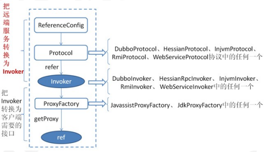
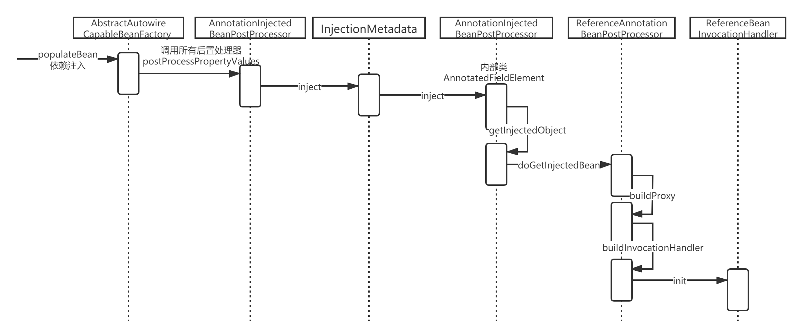
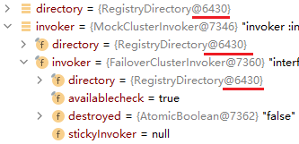
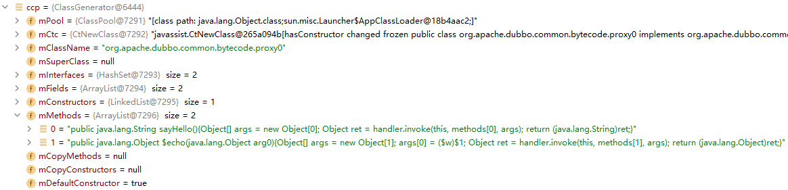

如果要实现服务的消费，大家可以结合之前手写 rpc 来思考一下

1. 生成远程服务的代理 
2. 获得目标服务的 url 地址 
3. 实现远程网络通信 
4. 实现负载均衡 
5. 实现集群容错



# 1 服务的消费

消费端的代码解析是从下面这段代码开始的

```xml
<dubbo:reference id="xxxService" interface="xxx.xxx.xxxService" />
```

注解的方式的初始化入口是在 Spring 进行依赖注入调用后置处理器的过程中：



```
ReferenceAnnotationBeanPostProcessor -> ReferenceBeanInvocationHandler.init -> ReferenceConfig.get() 获得一个远程代理类
```

**ReferenceConfig.get**

```java
public synchronized T get() {
    // 检查和修改配置
    checkAndUpdateSubConfigs();
    if (destroyed) {
        throw new IllegalStateException("The invoker of ReferenceConfig(" + url + ") has already destroyed!");
    }
    // 如果当前接口的远程代理引用为空，则进行初始化
    if (ref == null) {
        init();
    }
    return ref;
}
```

**init**

初始化的过程，和服务发布的过程类似，会有特别多的判断以及参数的组装. 我们只需要关注 createProxy，创建代理类的方法。

```java
private void init() { 
    //省略... 
    ref = createProxy(map); 
    //省略... 
}
```

**createProxy**

代码比较长，但是逻辑相对比较清晰

1. 判断是否为本地调用，如果是则使用 injvm 协议进行调用 
2. 判断是否为点对点调用，如果是则 把url 保存到 urls 集合中，如果 url 为 1，进入步骤 4，如果 urls > 1 ，则执行 5 
3. 如果是配置了注册中心，遍历注册中心，把 url 添加到 urls 集合，url 为 1，进入步骤 4，如果urls > 1 ，则执行 5 
4. 直连构建invoker 
5. 构建 invokers 集合，通过 cluster 合并多个 invoker 
6. 最后调用 ProxyFactory 生成代理类

```java
private T createProxy(Map<String, String> map) {
    // 判断是否是在同一个 jvm 进程中调用
    if (shouldJvmRefer(map)) {
        URL url = new URL(LOCAL_PROTOCOL, LOCALHOST_VALUE, 0, interfaceClass.getName()).addParameters(map);
        invoker = REF_PROTOCOL.refer(interfaceClass, url);
        if (logger.isInfoEnabled()) {
            logger.info("Using injvm service " + interfaceClass.getName());
        }
    } else {
        urls.clear(); // reference retry init will add url to urls, lead to OOM
        // url 如果不为空，说明是点对点通信
        if (url != null && url.length() > 0) { // user specified URL, could be peer-to-peer address, or register center's address.
            String[] us = SEMICOLON_SPLIT_PATTERN.split(url);
            if (us != null && us.length > 0) {
                for (String u : us) {
                    URL url = URL.valueOf(u);
                    if (StringUtils.isEmpty(url.getPath())) {
                        url = url.setPath(interfaceName);
                    }
                    // 检测 url 协议是否为 registry，若是，表明用户想使用指定的注册中心
                    if (REGISTRY_PROTOCOL.equals(url.getProtocol())) {
                        // 将 map 转换为查询字符串，并作为 refer 参数的值添加到 url 中
                        urls.add(url.addParameterAndEncoded(REFER_KEY, StringUtils.toQueryString(map)));
                    } else {
                        // 合并 url，移除服务提供者的一些配置（这些配置来源于用户配置的 url 属性），比如线程池相关配置。并保留服务提供者的部分配置，比如版本，group，时间戳等
						// 最后将合并后的配置设置为 url 查询字符串中。
                        urls.add(ClusterUtils.mergeUrl(url, map));
                    }
                }
            }
        } else { // assemble URL from register center's configuration
            // if protocols not injvm checkRegistry
            if (!LOCAL_PROTOCOL.equalsIgnoreCase(getProtocol())){
                 //校验注册中心的配置以及是否有必要从配置中心组装url
                checkRegistry();
                //这里的代码实现和服务端类似，也是根据注册中心配置进行解析得到URL
				//这里的URL肯定也是：registry://ip:port/org.apache.dubbo.service.RegsitryService
                List<URL> us = loadRegistries(false);
                if (CollectionUtils.isNotEmpty(us)) {
                    for (URL u : us) {
                        URL monitorUrl = loadMonitor(u);
                        if (monitorUrl != null) {
                            map.put(MONITOR_KEY, URL.encode(monitorUrl.toFullString()));
                        }
                        urls.add(u.addParameterAndEncoded(REFER_KEY, StringUtils.toQueryString(map)));
                    }
                }
                //如果没有配置注册中心，则报错
                if (urls.isEmpty()) {
                    throw new IllegalStateException("...");
                }
            }
        }
        //如果只配置了一个注册中心或者一个服务提供者，直接使用refprotocol.refer
        if (urls.size() == 1) {
            invoker = REF_PROTOCOL.refer(interfaceClass, urls.get(0));
        } else {
            List<Invoker<?>> invokers = new ArrayList<Invoker<?>>();
            URL registryURL = null;
            for (URL url : urls) {
                //遍历urls生成多个invoker
                invokers.add(REF_PROTOCOL.refer(interfaceClass, url));
                if (REGISTRY_PROTOCOL.equals(url.getProtocol())) {
                    registryURL = url; // use last registry url
                }
            }
            //如果registryUrl不为空，构建静态 directory
            if (registryURL != null) { // registry url is available
                // 使用RegistryAwareCluster
                URL u = registryURL.addParameter(CLUSTER_KEY, RegistryAwareCluster.NAME);
                // 通过Cluster将多个invoker合并RegistryAwareClusterInvoker(StaticDirectory) ->FailoverClusterInvoker(RegistryDirectory, will execute route) -> Invoker
                invoker = CLUSTER.join(new StaticDirectory(u, invokers));
            } else { // not a registry url, must be direct invoke.
                invoker = CLUSTER.join(new StaticDirectory(invokers));
            }
        }
    }
    //检查invoker的有效性
    if (shouldCheck() && !invoker.isAvailable()) {
        throw new IllegalStateException("...");
    }
    if (logger.isInfoEnabled()) {
        logger.info("Refer dubbo service " + interfaceClass.getName() + " from url " + invoker.getUrl());
    }
    /**
     * @since 2.7.0
     * ServiceData Store
     */
    MetadataReportService metadataReportService = null;
    if ((metadataReportService = getMetadataReportService()) != null) {
        URL consumerURL = new URL(CONSUMER_PROTOCOL, map.remove(REGISTER_IP_KEY), 0, map.get(INTERFACE_KEY), map);
        metadataReportService.publishConsumer(consumerURL);
    }
    // create service proxy
    return (T) PROXY_FACTORY.getProxy(invoker);
}
```

**protocol.refer**

这里通过指定的协议来调用 refer 生成一个invoker对象，invoker前面讲过，它是一个代理对象。那么在当前的消费端而言，invoker 主要用于执行远程调用。 这个protocol，又是一个自适应扩展点，它得到的是一个Protocol$Adaptive。

```java
private static final Protocol REF_PROTOCOL = ExtensionLoader.getExtensionLoader(Protocol.class).getAdaptiveExtension();
```

这段代码中，根据当前的协议 url，得到一个指定的扩展点，传递进来的参数中，协议地址为 registry://...，所以，我们可以直接定位到 RegistryProtocol.refer。

**RegistryProtocol.refer**

这里面的代码逻辑比较简单

* 组装注册中心协议的url

* 判断是否配置legroup，如果有，则cluster=getMergeableCluster()，构建invoker

* doRefer构建invoke

```java
public <T> Invoker<T> refer(Class<T> type, URL url) throws RpcException {
    // 这段代码也很熟悉，就是根据配置的协议，生成注册中心的url: zookeeper://...
    url = URLBuilder.from(url)
            .setProtocol(url.getParameter(REGISTRY_KEY, DEFAULT_REGISTRY))
            .removeParameter(REGISTRY_KEY)
            .build();
    Registry registry = registryFactory.getRegistry(url);
    if (RegistryService.class.equals(type)) {
        return proxyFactory.getInvoker((T) registry, type, url);
    }
    // 解析group参数，根据group决定cluster的类型
    // group="a,b" or group="*"
    Map<String, String> qs = StringUtils.parseQueryString(url.getParameterAndDecoded(REFER_KEY));
    String group = qs.get(GROUP_KEY);
    if (group != null && group.length() > 0) {
        if ((COMMA_SPLIT_PATTERN.split(group)).length > 1 || "*".equals(group)) {
            return doRefer(getMergeableCluster(), registry, type, url);
        }
    }
    return doRefer(cluster, registry, type, url);
}
```

**doRefer**

doRefer 里面就稍微复杂一些，涉及到比较多的东西，我们先关注主线

* 构建一个 RegistryDirectory

* 构建一个 consumer://... 协议的地址注册到注册中心

* 订阅 zookeeper 中节点的变化

* 调用 cluster.join 方法

```java
private <T> Invoker<T> doRefer(Cluster cluster, Registry registry, Class<T> type, URL url) {
    //RegistryDirectory初始化
    RegistryDirectory<T> directory = new RegistryDirectory<T>(type, url);
    directory.setRegistry(registry);
    directory.setProtocol(protocol);
    // all attributes of REFER_KEY
    Map<String, String> parameters = new HashMap<String, String>(directory.getUrl().getParameters());
    //注册consumer://协议的url
    URL subscribeUrl = new URL(CONSUMER_PROTOCOL, parameters.remove(REGISTER_IP_KEY), 0, type.getName(), parameters);
    if (!ANY_VALUE.equals(url.getServiceInterface()) && url.getParameter(REGISTER_KEY, true)) {
        directory.setRegisteredConsumerUrl(getRegisteredConsumerUrl(subscribeUrl, url));
        registry.register(directory.getRegisteredConsumerUrl());
    }
    directory.buildRouterChain(subscribeUrl);
    // 订阅事件监听
    // 产生与实际代理 service 的 invoker
    directory.subscribe(subscribeUrl.addParameter(CATEGORY_KEY,
            PROVIDERS_CATEGORY + "," + CONFIGURATORS_CATEGORY + "," + ROUTERS_CATEGORY));
    //构建 invoker(非实际代理 service 的 invoker，实际代理 service 的 invoker 封装在了directory 的 map 中)
    Invoker invoker = cluster.join(directory);
    ProviderConsumerRegTable.registerConsumer(invoker, url, subscribeUrl, directory);
    return invoker;
}
```

# 2 Cluster是什么

我们只关注一下 Invoker 这个代理类的创建过程，其他的暂且不关心

```java
Invoker invoker = cluster.join(directory);
```

cluster 其实是在 RegistryProtocol 中通过 set 方法完成依赖注入的，并且它还是一个被包装的：

```java
public void setCluster(Cluster cluster) {
    this.cluster = cluster;
}
```

Cluster 扩展点的定义, 由于它是一个自适应扩展点，那么会动态生成一个 Cluster$Adaptive 的动态代理类：

```java
@SPI(FailoverCluster.NAME)
public interface Cluster {
    @Adaptive
    <T> Invoker<T> join(Directory<T> directory) throws RpcException;
}
```

**Cluster$Adaptive**

在动态适配的类中会基于 extName，选择一个合适的扩展点进行适配，由于默认情况下 `cluster:failover`，所以 getExtension("failover") 理论上应该返回 FailOverCluster。但实际上，这里做了包装 MockClusterWrapper（FailOverCluster）。

```java
package org.apache.dubbo.rpc.cluster;
import org.apache.dubbo.common.extension.ExtensionLoader;
public class Cluster$Adaptive implements org.apache.dubbo.rpc.cluster.Cluster {
    public org.apache.dubbo.rpc.Invoker join(org.apache.dubbo.rpc.cluster.Directory arg0) throws org.apache.dubbo.rpc.RpcException {
        if (arg0 == null) throw new IllegalArgumentException("org.apache.dubbo.rpc.cluster.Directory argument == null");
        if (arg0.getUrl() == null)
            throw new IllegalArgumentException("org.apache.dubbo.rpc.cluster.Directory argument getUrl() == null");
        org.apache.dubbo.common.URL url = arg0.getUrl();
        String extName = url.getParameter("cluster", "failover");
        if (extName == null)
            throw new IllegalStateException("Failed to get extension (org.apache.dubbo.rpc.cluster.Cluster) name from url (" + url.toString() + ") use keys([cluster])");
        // getExtension 中会进行 wrapper 包装
        org.apache.dubbo.rpc.cluster.Cluster extension = (org.apache.dubbo.rpc.cluster.Cluster) ExtensionLoader.getExtensionLoader(org.apache.dubbo.rpc.cluster.Cluster.class).getExtension(extName);
        return extension.join(arg0);
    }
}
```

**cluster.join**

所以再回到 doRefer 方法，下面这段代码, 实际是调用 MockClusterWrapper.join。

所以这里返回的invoker，应该是 MockClusterInvoker(directory, FailoverClusterInvoker(directory))

```java
// MockClusterWrapper
public <T> Invoker<T> join(Directory<T> directory) throws RpcException {
    return new MockClusterInvoker<T>(directory,
            this.cluster.join(directory));
}
// FailoverCluster
public <T> Invoker<T> join(Directory<T> directory) throws RpcException {
    return new FailoverClusterInvoker<T>(directory);
}
```



接着回到 ReferenceConfig.createProxy 方法中的最后一行。

**proxyFactory.getProxy**

拿到invoker之后，会调用获得一个动态代理类：

```java
return (T) proxyFactory.getProxy(invoker);
```

而这里的proxyFactory又是一个自适应扩展点，所以会进入下面的方法。

**JavassistProxyFactory.getProxy**

通过这个方法生成了一个动态代理类，并且对invoker再做了一层处理，InvokerInvocationHandler。 意味着后续发起服务调用的时候，会由 InvokerInvocationHandler 来进行处理。

```java
// InvokerInvocationHandler(MockClusterInvoker(FailoverClusterInvoker(directory)))
public <T> T getProxy(Invoker<T> invoker, Class<?>[] interfaces) {
    return (T) Proxy.getProxy(interfaces).newInstance(new InvokerInvocationHandler(invoker));
}
```

**proxy.getProxy**

在 proxy.getProxy 这个方法中会生成一个动态代理类，通过 debug 的形式可以看到动态代理类的原貌在 getProxy 这个方法位置加一个断点。

```java
public static Proxy getProxy(Class<?>... ics) {
    return getProxy(ClassUtils.getClassLoader(Proxy.class), ics);
}
public static Proxy getProxy(ClassLoader cl, Class<?>... ics) {
	...
	proxy = (Proxy) pc.newInstance();
}
```



```java
// 调下格式
public java.lang.String sayHello() {
    Object[] args = new Object[0];
    Object ret = handler.invoke(this, methods[0], args);
    return (java.lang.String) ret;
}
```

从这个 sayHello 方法可以看出，我们通过 @Reference 注入的一个对象实例本质上就是一个动态代理类，通过调用这个类中的方法，会触发 handler.invoke()，而这个handler就是 InvokerInvocationHandler。

# 3 网络连接的建立

前面分析的逻辑中，只讲到了动态代理类的生成，那么目标服务地址信息以及网络通信的建立在哪里实现的呢？我们继续回到 RegistryProtocol.doRefer 这个方法中。

这里我们暂且关注 directory.subscribe 这个方法，它是实现服务目标服务订阅的。

**RegistryDirectory.subscribe**

订阅注册中心指定节点的变化，如果发生变化，则通知到 RegistryDirectory。Directory 其实和服务的注册以及服务的发现有非常大的关联。

```java
public void subscribe(URL url) {
    //设置consumerUrl
    setConsumerUrl(url);
    //把当前RegistryDirectory作为listener，去监听zk上节点的变化
    CONSUMER_CONFIGURATION_LISTENER.addNotifyListener(this);
    serviceConfigurationListener = new ReferenceConfigurationListener(this, url);
    //订阅 -> 这里的registry是ZookeeperRegistry
    registry.subscribe(url, this);
}
```

这里的 registry 是 ZookeeperRegistry ，会去监听并获取路径下面的节点。监听的路径是：

/dubbo/org.apache.dubbo.demo.DemoService/providers、/dubbo/org.apache.dubbo.demo.DemoService/configurators、/dubbo/org.apache.dubbo.de mo.DemoService/routers 节点下面的子节点变动。

**FailbackRegistry.subscribe**

ZookeeperRegistry 没有实现 subscribe 方法，所以找到它的父类 FailbackRegistry。

listener 为 RegistryDirectory，后续要用到。

移除失效的listener，调用doSubscribe进行订阅。

```java
public void subscribe(URL url, NotifyListener listener) {
    super.subscribe(url, listener);
    removeFailedSubscribed(url, listener);
    try {
        // Sending a subscription request to the server side
        doSubscribe(url, listener);
    } catch (Exception e) {
        Throwable t = e;
        List<URL> urls = getCacheUrls(url);
        if (CollectionUtils.isNotEmpty(urls)) {
            notify(url, listener, urls);
            logger.error("...");
        } else {
            // If the startup detection is opened, the Exception is thrown directly.
            boolean check = getUrl().getParameter(Constants.CHECK_KEY, true)
                    && url.getParameter(Constants.CHECK_KEY, true);
            boolean skipFailback = t instanceof SkipFailbackWrapperException;
            if (check || skipFailback) {
                if (skipFailback) {
                    t = t.getCause();
                }
                throw new IllegalStateException("Failed to subscribe " + url + ", cause: " + t.getMessage(), t);
            } else {
                logger.error("Failed to subscribe " + url + ", waiting for retry, cause: " + t.getMessage(), t);
            }
        }
        // Record a failed registration request to a failed list, retry regularly
        addFailedSubscribed(url, listener);
    }
}
```

**ZookeeperRegistry.doSubscribe**

这个方法是订阅，逻辑实现比较多，可以分两段来看，这里的实现把所有Service层发起的订阅以及指定的Service层发起的订阅分开处理：

* 所有Service层类似于监控中心发起的订阅

* 指定的Service层发起的订阅可以看作是服务消费者的订阅

我们只需要关心指定 Service 层发起的订阅即可：

```java
public void doSubscribe(final URL url, final NotifyListener listener) {
    try {
        if (ANY_VALUE.equals(url.getServiceInterface())) {
        	// ...
        } else {
            List<URL> urls = new ArrayList<>();
            // toCategoriesPath(url) 返回
            // /dubbo/com.spring.service.ISayHelloService/providers
            // /dubbo/com.spring.service.ISayHelloService/configurators
            // /dubbo/com.spring.service.ISayHelloService/routers
            for (String path : toCategoriesPath(url)) {
                ConcurrentMap<NotifyListener, ChildListener> listeners = zkListeners.get(url);
                if (listeners == null) {
                    // 如果之前该路径没有添加过listener，则创建一个map来放置listener
                    zkListeners.putIfAbsent(url, new ConcurrentHashMap<>());
                    listeners = zkListeners.get(url);
                }
                ChildListener zkListener = listeners.get(listener);
                if (zkListener == null) {
                    // 如果没有添加过对于子节点的listener，则创建,通知服务变化 回调NotifyListener
                    listeners.putIfAbsent(listener, (parentPath, currentChilds) -> ZookeeperRegistry.this.notify(url, listener, toUrlsWithEmpty(url, parentPath, currentChilds)));
                    zkListener = listeners.get(listener);
                }
                zkClient.create(path, false);
                //添加path节点的当前节点及子节点监听，并且获取子节点信息
				//也就是dubbo://ip:port/...
                List<String> children = zkClient.addChildListener(path, zkListener);
                if (children != null) {
                    urls.addAll(toUrlsWithEmpty(url, path, children));
                }
            }
            //调用notify进行通知，对已经可用的列表进行通知
            notify(url, listener, urls);
        }
    } catch (Throwable e) {
        throw new RpcException("Failed to subscribe " + url + " to zookeeper " + getUrl() + ", cause: " + e.getMessage(), e);
    }
}
```

**FailbackRegistry.notify**

调用 FailbackRegistry.notify， 对参数进行判断。 然后调用 AbstractRegistry.notify 方法：

```java
protected void notify(URL url, NotifyListener listener, List<URL> urls) {
    if (url == null) {
        throw new IllegalArgumentException("notify url == null");
    }
    if (listener == null) {
        throw new IllegalArgumentException("notify listener == null");
    }
    try {
        doNotify(url, listener, urls);
    } catch (Exception t) {
        // Record a failed registration request to a failed list, retry regularly
        addFailedNotified(url, listener, urls);
        logger.error("Failed to notify for subscribe " + url + ", waiting for retry, cause: " + t.getMessage(), t);
    }
}
```

**AbstractRegistry.notify**

这里面会针对每一个 category，调用 listener.notify 进行通知，然后更新本地的缓存文件：

```java
protected void notify(URL url, NotifyListener listener, List<URL> urls) {
    // ...
    // keep every provider's category.
    Map<String, List<URL>> result = new HashMap<>();
    for (URL u : urls) {
        if (UrlUtils.isMatch(url, u)) {
            String category = u.getParameter(CATEGORY_KEY, DEFAULT_CATEGORY);
            List<URL> categoryList = result.computeIfAbsent(category, k -> new ArrayList<>());
            categoryList.add(u);
        }
    }
    if (result.size() == 0) {
        return;
    }
    Map<String, List<URL>> categoryNotified = notified.computeIfAbsent(url, u -> new ConcurrentHashMap<>());
    for (Map.Entry<String, List<URL>> entry : result.entrySet()) {
        String category = entry.getKey();
        List<URL> categoryList = entry.getValue();
        categoryNotified.put(category, categoryList);
        listener.notify(categoryList);
        // We will update our cache file after each notification.
        // When our Registry has a subscribe failure due to network jitter, we can return at least the existing cache URL.
        saveProperties(url);
    }
}
```

消费端的 listener 是最开始传递过来的 RegistryDirectory，所以这里会触发 RegistryDirectory.notify。

**RegistryDirectory.notify**

Invoker 的网络连接以及后续的配置变更，都会调用这个notify方法。

urls: zk 的 path 数据，这里表示的是 dubbo://...

```java
public synchronized void notify(List<URL> urls) {
    //对url列表进行校验、过滤，然后分成 config、router、provider 3个分组map
    Map<String, List<URL>> categoryUrls = urls.stream()
            .filter(Objects::nonNull)
            .filter(this::isValidCategory)
            .filter(this::isNotCompatibleFor26x)
            .collect(Collectors.groupingBy(url -> {
                if (UrlUtils.isConfigurator(url)) {
                    return CONFIGURATORS_CATEGORY;
                } else if (UrlUtils.isRoute(url)) {
                    return ROUTERS_CATEGORY;
                } else if (UrlUtils.isProvider(url)) {
                    return PROVIDERS_CATEGORY;
                }
                return "";
            }));
    List<URL> configuratorURLs = categoryUrls.getOrDefault(CONFIGURATORS_CATEGORY, Collections.emptyList());
    this.configurators = Configurator.toConfigurators(configuratorURLs).orElse(this.configurators);
    // 如果router 路由节点有变化，则从新将router 下的数据生成router
    List<URL> routerURLs = categoryUrls.getOrDefault(ROUTERS_CATEGORY, Collections.emptyList());
    toRouters(routerURLs).ifPresent(this::addRouters);
    // 获得provider URL，然后调用refreshOverrideAndInvoker进行刷新
    List<URL> providerURLs = categoryUrls.getOrDefault(PROVIDERS_CATEGORY, Collections.emptyList());
    refreshOverrideAndInvoker(providerURLs);
}
```

**refreshOverrideAndInvoker**

* 逐个调用注册中心里面的配置，覆盖原来的 url，组成最新的 url 放入 overrideDirectoryUrl 存储

* 根据 provider urls，重新刷新 Invoker

```java
private void refreshOverrideAndInvoker(List<URL> urls) {
    // mock zookeeper://xxx?mock=return null
    // 服务启动时，不会出现覆盖url，如果后续发生变化触发notify才会发生覆盖
    overrideDirectoryUrl();
    refreshInvoker(urls);
}
```

**refreshInvoker**

```java
private void refreshInvoker(List<URL> invokerUrls) {
    Assert.notNull(invokerUrls, "invokerUrls should not be null");
    if (invokerUrls.size() == 1
            && invokerUrls.get(0) != null
            && EMPTY_PROTOCOL.equals(invokerUrls.get(0).getProtocol())) {
        //...
    } else {
        this.forbidden = false; // Allow to access
        Map<String, Invoker<T>> oldUrlInvokerMap = this.urlInvokerMap; // local reference
        if (invokerUrls == Collections.<URL>emptyList()) {
            invokerUrls = new ArrayList<>();
        }
        if (invokerUrls.isEmpty() && this.cachedInvokerUrls != null) {
            invokerUrls.addAll(this.cachedInvokerUrls);
        } else {
            this.cachedInvokerUrls = new HashSet<>();
            this.cachedInvokerUrls.addAll(invokerUrls);//Cached invoker urls, convenient for comparison
        }
        //如果url为空，则直接返回
        if (invokerUrls.isEmpty()) {
            return;
        }
        // 根据provider url，生成新的invoker
        Map<String, Invoker<T>> newUrlInvokerMap = toInvokers(invokerUrls);// Translate url list to Invoker map
        //转化为list
        List<Invoker<T>> newInvokers = Collections.unmodifiableList(new ArrayList<>(newUrlInvokerMap.values()));
        routerChain.setInvokers(newInvokers);
        // 如果服务配置了分组，则把分组下的provider包装成StaticDirectory,组成一个 invoker
		// 实际上就是按照group进行合并
        this.invokers = multiGroup ? toMergeInvokerList(newInvokers) : newInvokers;
        this.urlInvokerMap = newUrlInvokerMap;
        try {
            //旧的url 是否在新map里面存在，不存在，就是销毁url对应的Invoker
            destroyUnusedInvokers(oldUrlInvokerMap, newUrlInvokerMap); // Close the unused Invoker
        } catch (Exception e) {
            logger.warn("destroyUnusedInvokers error. ", e);
        }
    }
}
```

**toInvokers**

这个方法中有比较长的判断和处理逻辑，我们只需要关心 invoker 是什么时候初始化的就行。 这里用到了protocol.refer 来构建了一个

```java
invoker invoker = new InvokerDelegate<>(protocol.refer(serviceType, url), url, providerUrl); 
```

构建完成之后，会保存在 `Map<String, Invoker<T>> newUrlInvokerMap` 这个集合中

```java
private Map<String, Invoker<T>> toInvokers(List<URL> urls) {
    Map<String, Invoker<T>> newUrlInvokerMap = new HashMap<>();
   	//...
        Map<String, Invoker<T>> localUrlInvokerMap = this.urlInvokerMap; // local reference
        Invoker<T> invoker = localUrlInvokerMap == null ? null : localUrlInvokerMap.get(key);
        if (invoker == null) { // Not in the cache, refer again
            try {
                boolean enabled = true;
                if (url.hasParameter(DISABLED_KEY)) {
                    enabled = !url.getParameter(DISABLED_KEY, false);
                } else {
                    enabled = url.getParameter(ENABLED_KEY, true);
                }
                if (enabled) {
                    // 初始化 invoker
                    // 此处 invoker 非项目开发中注入的 invoker，此 invoker 会放入到 RegistryDirectory 的 Map 中，实际注入的 invoker 是包含 RegistryDirectory 对象再次封装的 invoker
                    // 调用过程 ProtocolListenerWrapper -> ProtocolFilterWrapper -> QosProtocolWrapper -> AbstractProtocol -> DubboProtocol
                    // 返回 invoker = new InvokerDelegate(new ListenerExporterWrapper(new ProtocolFilterWrapper$CallbackRegistrationInvoker(3 层 filter, next = new AsyncToSyncInvoker(new DubboInvoker()))))
                    // ProtocolFilterWrapper$CallbackRegistrationInvoker 内部类
                    invoker = new InvokerDelegate<>(protocol.refer(serviceType, url), url, providerUrl);
                }
            } catch (Throwable t) {
                logger.error("Failed to refer invoker for interface:" + serviceType + ",url:(" + url + ")" + t.getMessage(), t);
            }
            if (invoker != null) { // Put new invoker in cache
                newUrlInvokerMap.put(key, invoker);
            }
        } else {
            newUrlInvokerMap.put(key, invoker);
        }
    }
    keys.clear();
    return newUrlInvokerMap;
}
```

**protocol.refer**

调用指定的协议来进行远程引用。protocol 是一个Protocol$Adaptive 类，而真正的实现应该是： ProtocolListenerWrapper(ProtocolFilterWrapper(QosProtocolWrapper(DubboProtocol.refer) 。

前面的包装过程，在服务发布的时候已经分析过了，我们直接进入DubboProtocol.refer 方法。

**DubboProtocol.refer**

* 优化序列化

* 构建DubboInvoker

在构建DubboInvoker时，会构建一个ExchangeClient，通过getClients(url)方法，这里基本可以猜到到是服务的通信建立。

```java
// ProtocolListenerWrapper
public <T> Invoker<T> refer(Class<T> type, URL url) throws RpcException {
    if (REGISTRY_PROTOCOL.equals(url.getProtocol())) {
        return protocol.refer(type, url);
    }
    return new ListenerInvokerWrapper<T>(protocol.refer(type, url),
            Collections.unmodifiableList(
                    ExtensionLoader.getExtensionLoader(InvokerListener.class)
                            .getActivateExtension(url, INVOKER_LISTENER_KEY)));
}
// 父类 AbstractProtocol
public <T> Invoker<T> refer(Class<T> type, URL url) throws RpcException {
    return new AsyncToSyncInvoker<>(protocolBindingRefer(type, url));
}
// DubboProtocol
public <T> Invoker<T> protocolBindingRefer(Class<T> serviceType, URL url) throws RpcException {
    optimizeSerialization(url);
    // create rpc invoker.
    DubboInvoker<T> invoker = new DubboInvoker<T>(serviceType, url, getClients(url), invokers);
    invokers.add(invoker);
    return invoker;
}
```

**getClients**

这里面是获得客户端连接的方法：

* 判断是否为共享连接，默认是共享同一个连接进行通信 

* 是否配置了多个连接通道 connections，默认只有一个

```java
private ExchangeClient[] getClients(URL url) {
    // whether to share connection
    boolean useShareConnect = false;
    int connections = url.getParameter(CONNECTIONS_KEY, 0);
    List<ReferenceCountExchangeClient> shareClients = null;
    // if not configured, connection is shared, otherwise, one connection for one service
    //如果没有配置连接数，则默认为共享连接
    if (connections == 0) {
        useShareConnect = true;
        /**
         * The xml configuration should have a higher priority than properties.
         */
        String shareConnectionsStr = url.getParameter(SHARE_CONNECTIONS_KEY, (String) null);
        connections = Integer.parseInt(StringUtils.isBlank(shareConnectionsStr) ? ConfigUtils.getProperty(SHARE_CONNECTIONS_KEY,
                DEFAULT_SHARE_CONNECTIONS) : shareConnectionsStr);
        shareClients = getSharedClient(url, connections);
    }
    ExchangeClient[] clients = new ExchangeClient[connections];
    for (int i = 0; i < clients.length; i++) {
        if (useShareConnect) {
            clients[i] = shareClients.get(i);
        } else {
            clients[i] = initClient(url);
        }
    }
    return clients;
}
```

**getSharedClient**

获得一个共享连接

```java
private List<ReferenceCountExchangeClient> getSharedClient(URL url, int connectNum) {
    String key = url.getAddress();
    List<ReferenceCountExchangeClient> clients = referenceClientMap.get(key);
    //检查当前的key检查连接是否已经创建过并且可用，如果是，则直接返回并且增加连接的个数的统计
    if (checkClientCanUse(clients)) {
        batchClientRefIncr(clients);
        return clients;
    }
    //如果连接已经关闭或者连接没有创建过
    locks.putIfAbsent(key, new Object());
    synchronized (locks.get(key)) {
        clients = referenceClientMap.get(key);
        // 在创建连接之前，在做一次检查，防止连接并发创建
        // dubbo check
        if (checkClientCanUse(clients)) {
            batchClientRefIncr(clients);
            return clients;
        }
        // 连接数必须大于等于1
        connectNum = Math.max(connectNum, 1);
        //如果当前消费者还没有和服务端产生连接，则初始化
        if (CollectionUtils.isEmpty(clients)) {
            clients = buildReferenceCountExchangeClientList(url, connectNum);
            //创建clients之后，保存到map中
            referenceClientMap.put(key, clients);
        } else {//如果clients不为空，则从clients数组中进行遍历
            for (int i = 0; i < clients.size(); i++) {
                ReferenceCountExchangeClient referenceCountExchangeClient = clients.get(i);
                // 如果在集合中存在一个连接但是这个连接处于closed状态，则重新构建一个进行替换
                if (referenceCountExchangeClient == null || referenceCountExchangeClient.isClosed()) {
                    clients.set(i, buildReferenceCountExchangeClient(url));
                    continue;
                }
                //增加个数
                referenceCountExchangeClient.incrementAndGetCount();
            }
        }
        /**
         * I understand that the purpose of the remove operation here is to avoid the expired url key
         * always occupying this memory space.
         */
        locks.remove(key);
        return clients;
    }
}
```

**buildReferenceCountExchangeClientList**

根据连接数配置，来构建指定个数的链接。默认为 1

```java
private List<ReferenceCountExchangeClient> buildReferenceCountExchangeClientList(URL url, int connectNum) {
    List<ReferenceCountExchangeClient> clients = new ArrayList<>();
    for (int i = 0; i < connectNum; i++) {
        clients.add(buildReferenceCountExchangeClient(url));
    }
    return clients;
}
private ReferenceCountExchangeClient buildReferenceCountExchangeClient(URL url) {
    ExchangeClient exchangeClient = initClient(url);
    return new ReferenceCountExchangeClient(exchangeClient);
    // client = ReferenceCountExchangeClient(HeaderExchangeClient(NettyClient))
}
```

**initClient**

终于进入到初始化客户端连接的方法了，猜测应该是根据 url 中配置的参数进行远程通信的构建

```java
private ExchangeClient initClient(URL url) {
    // client type setting.
    String str = url.getParameter(CLIENT_KEY, url.getParameter(SERVER_KEY, DEFAULT_REMOTING_CLIENT));
    url = url.addParameter(CODEC_KEY, DubboCodec.NAME);
    // enable heartbeat by default
    url = url.addParameterIfAbsent(HEARTBEAT_KEY, String.valueOf(DEFAULT_HEARTBEAT));
    // BIO is not allowed since it has severe performance issue.
    if (str != null && str.length() > 0 && !ExtensionLoader.getExtensionLoader(Transporter.class).hasExtension(str)) {
        throw new RpcException("Unsupported client type: " + str + "," +
                " supported client type is " + StringUtils.join(ExtensionLoader.getExtensionLoader(Transporter.class).getSupportedExtensions(), " "));
    }
    ExchangeClient client;
    try {
        // connection should be lazy
        if (url.getParameter(LAZY_CONNECT_KEY, false)) {
            client = new LazyConnectExchangeClient(url, requestHandler);
        } else {
            client = Exchangers.connect(url, requestHandler);
        }
    } catch (RemotingException e) {
        throw new RpcException("Fail to create remoting client for service(" + url + "): " + e.getMessage(), e);
    }
    return client;
}
```

**Exchangers.connect**

创建一个客户端连接

```java
public static ExchangeClient connect(URL url, ExchangeHandler handler) throws RemotingException {
    if (url == null) {
        throw new IllegalArgumentException("url == null");
    }
    if (handler == null) {
        throw new IllegalArgumentException("handler == null");
    }
    url = url.addParameterIfAbsent(Constants.CODEC_KEY, "exchange");
    return getExchanger(url).connect(url, handler);
}
```

**HeaderExchange.connect**

主要关注 transporters.connect

```java
public ExchangeClient connect(URL url, ExchangeHandler handler) throws RemotingException {
    return new HeaderExchangeClient(Transporters.connect(url, new DecodeHandler(new HeaderExchangeHandler(handler))), true);
    // client = HeaderExchangeClient(NettyClient)
}
```

**NettyTransport.connect**

使用 netty 构建了一个客户端连接

```java
public Client connect(URL url, ChannelHandler listener) throws RemotingException {
    return new NettyClient(url, listener);
}
// NettyClient.java
// handler 处理和服务端一样，wrapChannelHandler 方法会调用 ChannelHandlers.wrap(handler, url)
public NettyClient(final URL url, final ChannelHandler handler) throws RemotingException {
    super(url, wrapChannelHandler(url, handler));
}
```

# 4 总结

我们讲到了 `RegistryProtocol.refer` 过程中有一个关键步骤，即在监听到服务提供者 url 时触发 `RegistryDirectory.notify()` 方法。

`RegistryDirectory.notify()` 方法调用 `refreshInvoker()` 方法将服务提供者urls转换为对应的`远程 invoker` ，最终调用到 `DubboProtocol.refer()` 方法生成对应的 `DubboInvoker` 。 

`DubboInvoker` 的构造方法中有一项入参 `ExchangeClient[] clients` ，即对应本文要讲的网络客户端 `Client`。DubboInvoker 就是通过调用 `client.request()` 方法完成网络通信的请求发送和响应接收功能。

`Client` 的具体生成过程就是通过 `DubboProtocol` 的 `initClient(URL url)` 方法创建了一个 `HeaderExchangeClient`。

------

