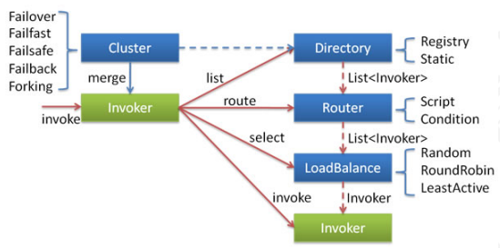
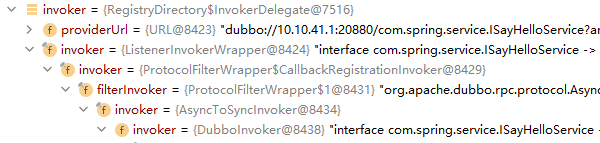
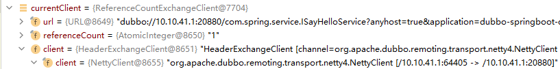
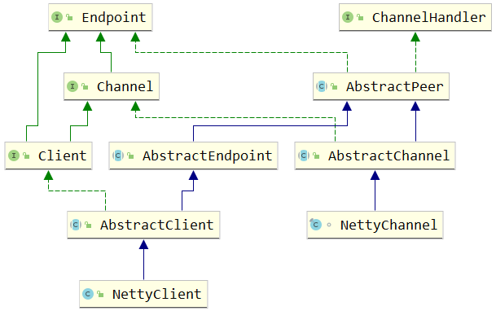
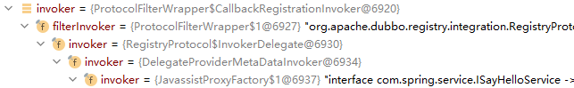
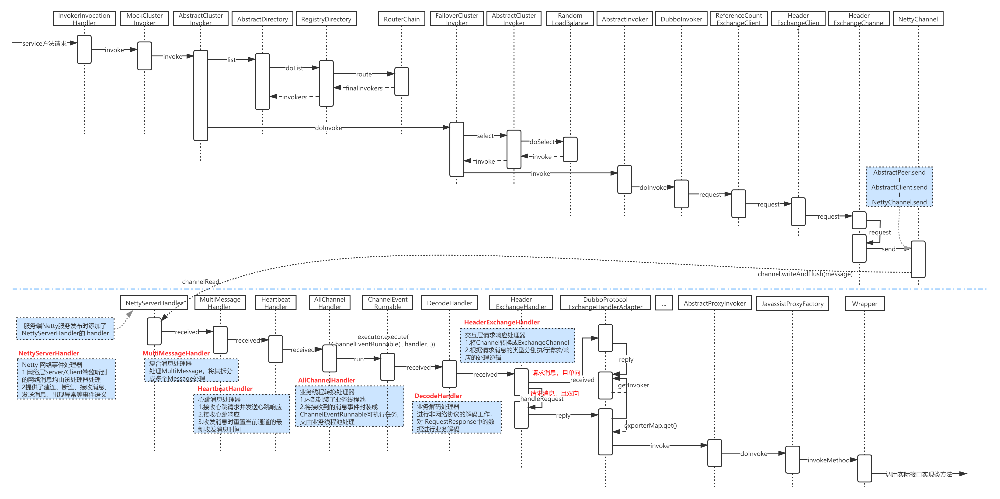
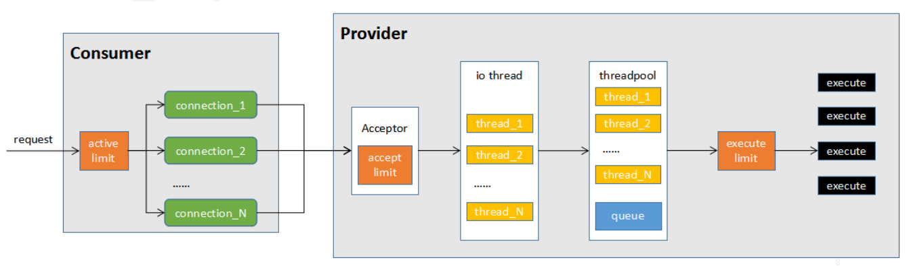

# 1 消费端调用过程

**InvokerInvocationHandler.invoke**

这个方法主要判断当前调用的远程方法，如果是 tostring、hashcode、equals，就直接返回否则，调用 invoker.invoke，进入到 MockClusterInvoker.invoke 方法。

```java
public Object invoke(Object proxy, Method method, Object[] args) throws Throwable {
    String methodName = method.getName();
    Class<?>[] parameterTypes = method.getParameterTypes();
    if (method.getDeclaringClass() == Object.class) {
        return method.invoke(invoker, args);
    }
    if ("toString".equals(methodName) && parameterTypes.length == 0) {
        return invoker.toString();
    }
    if ("hashCode".equals(methodName) && parameterTypes.length == 0) {
        return invoker.hashCode();
    }
    if ("equals".equals(methodName) && parameterTypes.length == 1) {
        return invoker.equals(args[0]);
    }
    //RpcInvocation 参数为目标方法名称和目标方法的参数，看起来似乎是组装一个传输的对象
    return invoker.invoke(new RpcInvocation(method, args)).recreate();
}
```

**MockClusterInvoker.invoke**

Mock，在这里面有两个逻辑

1. 是否客户端强制配置了 mock 调用，那么在这种场景中主要可以用来解决服务端还没开发好的时候直接使用本地数据进行测试 
2. 是否出现了异常，如果出现异常则使用配置好的 Mock 类来实现服务的降级

```java
public Result invoke(Invocation invocation) throws RpcException {
    Result result = null;
    // 从url中获得MOCK_KEY对应的value
    String value = directory.getUrl().getMethodParameter(invocation.getMethodName(), MOCK_KEY, Boolean.FALSE.toString()).trim();
    // 如果没有配置mock，则直接传递给下个invoker调用
    if (value.length() == 0 || value.equalsIgnoreCase("false")) {
        //no mock
        result = this.invoker.invoke(invocation);
    } else if (value.startsWith("force")) {{//如果强制为本地调用，则执行 mockInvoke
        if (logger.isWarnEnabled()) {
            logger.warn("force-mock: " + invocation.getMethodName() + " force-mock enabled , url : " + directory.getUrl());
        }
        //force:direct mock
        result = doMockInvoke(invocation, null);
    } else {
        //fail-mock
        try {
            result = this.invoker.invoke(invocation);
        } catch (RpcException e) {
            if (e.isBiz()) {
                throw e;
            }
            // 如果远程调用出现异常，则使用Mock进行处理
            if (logger.isWarnEnabled()) {
                logger.warn("fail-mock: " + invocation.getMethodName() + " fail-mock enabled , url : " + directory.getUrl(), e);
            }
            result = doMockInvoke(invocation, e);
        }
    }
    return result;
}
```

**AbstractClusterInvoker.invoke**

下一个invoke，应该进入 FailoverClusterInvoke，但是在这里它又用到了模版方法，所以直接进入到父类的invoke方法中 

1. 绑定 attachments，Dubbo 中，可以通过 RpcContext 上的 setAttachment 和 getAttachment 在 服务消费方和提供方之间进行参数的隐式传递，所以这段代码中会去绑定 attachments

2. 通过 list 获得 invoker 列表，这个列表基本可以猜测到是从 directory 里面获得的。但是这里面还实现了服务路由的逻辑，简单来说就是先拿到 invoker 列表，然后通过 router 进行服务路由，筛选出符合路由规则的服务提供者（暂时不细讲，属于另外一个逻辑） 
3. initLoadBalance 初始化负载均衡机制
4. 执行 doInvoke

```java
public Result invoke(final Invocation invocation) throws RpcException {
    checkWhetherDestroyed();
    // binding attachments into invocation. 隐式传参
    // RpcContext.getContext().setAttachments(key, value)
    Map<String, String> contextAttachments = RpcContext.getContext().getAttachments();
    if (contextAttachments != null && contextAttachments.size() != 0) {
        ((RpcInvocation) invocation).addAttachments(contextAttachments);
    }
    List<Invoker<T>> invokers = list(invocation);
    LoadBalance loadbalance = initLoadBalance(invokers, invocation);
    RpcUtils.attachInvocationIdIfAsync(getUrl(), invocation);
    return doInvoke(invocation, invokers, loadbalance);
}
```

**initLoadBalance**

从 url 中获得当前的负载均衡算法，然后使用 spi 机制来获得负载均衡的扩展点，然后返回一个具体的实现。

```java
protected LoadBalance initLoadBalance(List<Invoker<T>> invokers, Invocation invocation) {
    if (CollectionUtils.isNotEmpty(invokers)) {
        return ExtensionLoader.getExtensionLoader(LoadBalance.class).getExtension(invokers.get(0).getUrl()
                .getMethodParameter(RpcUtils.getMethodName(invocation), LOADBALANCE_KEY, DEFAULT_LOADBALANCE));
    } else {
        return ExtensionLoader.getExtensionLoader(LoadBalance.class).getExtension(DEFAULT_LOADBALANCE);
    }
}
```

**FailoverClusterInvoker.doInvoke**

这段代码逻辑也很好理解，因为我们之前在讲 Dubbo 的时候说过容错机制，而 failover 是失败重试，所以这里面应该会实现容错的逻辑：

* 获得重试的次数，并且进行循环

* 获得目标服务，并且记录当前已经调用过的目标服务防止下次继续将请求发送过去

* 如果执行成功，则返回结果

* 如果出现异常，判断是否为业务异常，如果是则抛出，否则，进行下一次重试



* 这里的 Invoker 是 Provider 的一个可调用 Service 的抽象， Invoker 封装了 Provider 地址及 Service 接口信息
* Directory 代表多个 Invoker ，可以把它看成 `List<Invoker>` ，但与 List 不同的是，它的值可能是动态变化的，比如注册中心推送变更
* Cluster 将 Directory 中的多个 Invoker 伪装成一个 Invoker ，对上层透明，伪装过程包含了容错逻辑，调用失败后，重试另一个
* Router 负责从多个 Invoker 中按路由规则选出子集，比如读写分离，应用隔离等
* LoadBalance 负责从多个 Invoker 中选出具体的一个用于本次调用，选的过程包含了负载均衡算法，调用失败后，需要重选

```java
public Result doInvoke(Invocation invocation, final List<Invoker<T>> invokers, LoadBalance loadbalance) throws RpcException {
    List<Invoker<T>> copyInvokers = invokers;
    checkInvokers(copyInvokers, invocation);
    String methodName = RpcUtils.getMethodName(invocation);
    int len = getUrl().getMethodParameter(methodName, RETRIES_KEY, DEFAULT_RETRIES) + 1;
    if (len <= 0) {
        len = 1;
    }
    // retry loop.
    RpcException le = null; // last exception.
    List<Invoker<T>> invoked = new ArrayList<Invoker<T>>(copyInvokers.size()); // invoked invokers.
    Set<String> providers = new HashSet<String>(len);
    for (int i = 0; i < len; i++) {
        //Reselect before retry to avoid a change of candidate `invokers`.
        //NOTE: if `invokers` changed, then `invoked` also lose accuracy.
        if (i > 0) {
            checkWhetherDestroyed();
            copyInvokers = list(invocation);
            // check again
            checkInvokers(copyInvokers, invocation);
        }
        // 通过负载均衡获得目标 invoker
        Invoker<T> invoker = select(loadbalance, invocation, copyInvokers, invoked);
        // 记录已经调用过的服务，下次调用会进行过滤
        invoked.add(invoker);
        RpcContext.getContext().setInvokers((List) invoked);
        try {
            // 服务调用成功，直接返回结果
            Result result = invoker.invoke(invocation);
            if (le != null && logger.isWarnEnabled()) {
                logger.warn("...");
            }
            return result;
        } catch (RpcException e) {
             // 如果是业务异常，直接抛出不进行重试
            if (e.isBiz()) { // biz exception.
                throw e;
            }
            le = e;//记录异常信息，进行下一次循环
        } catch (Throwable e) {
            le = new RpcException(e.getMessage(), e);
        } finally {
            providers.add(invoker.getUrl().getAddress());
        }
    }
    throw new RpcException("...");
}
```

# 2 负载均衡

**select**

在调用 invoker.invoke 之前，会需要通过 select 选择一个合适的服务进行调用，而这个选择的过程其实就是负载均衡的实现。

所有负载均衡实现类均继承自 AbstractLoadBalance，该类实现了 LoadBalance 接口，并封装了一些公共的逻辑。所以在分析负载均衡实现之前，先来看一下 AbstractLoadBalance 的逻辑。首先来看一下负载均衡的入口方法 select，如下：

```java
// AbstractClusterInvoker
protected Invoker<T> select(LoadBalance loadbalance, Invocation invocation,
                            List<Invoker<T>> invokers, List<Invoker<T>> selected) throws RpcException {
    ...
	Invoker<T> invoker = doSelect(loadbalance, invocation, invokers, selected);
}
private Invoker<T> doSelect(LoadBalance loadbalance, Invocation invocation,
                                List<Invoker<T>> invokers, List<Invoker<T>> selected) throws RpcException {
	...
    Invoker<T> invoker = loadbalance.select(invokers, getUrl(), invocation);
}
// AbstractLoadBalance
public <T> Invoker<T> select(List<Invoker<T>> invokers, URL url, Invocation invocation) {
    if (CollectionUtils.isEmpty(invokers)) {
        return null;
    }
    // 如果 invokers 列表中仅有一个 Invoker，直接返回即可，无需进行负载均衡
    if (invokers.size() == 1) {
        return invokers.get(0);
    }
    //调用 doSelect 方法进行负载均衡，该方法为抽象方法，由子类实现
    return doSelect(invokers, url, invocation);
}
```

负载均衡的子类实现有四个，默认情况下是 RandomLoadBalance。

**RandomLoadBalance**

```java
protected <T> Invoker<T> doSelect(List<Invoker<T>> invokers, URL url, Invocation invocation) {
    // Number of invokers
    int length = invokers.size();
    // Every invoker has the same weight?
    boolean sameWeight = true;
    // the weight of every invokers
    int[] weights = new int[length];
    // the first invoker's weight
    int firstWeight = getWeight(invokers.get(0), invocation);
    weights[0] = firstWeight;
    // The sum of weights
    int totalWeight = firstWeight;
    for (int i = 1; i < length; i++) {
        int weight = getWeight(invokers.get(i), invocation);
        // save for later use
        weights[i] = weight;
        // Sum
        totalWeight += weight;
        if (sameWeight && weight != firstWeight) {
            sameWeight = false;
        }
    }
    if (totalWeight > 0 && !sameWeight) {
        // If (not every invoker has the same weight & at least one invoker's weight>0), select randomly based on totalWeight.
        int offset = ThreadLocalRandom.current().nextInt(totalWeight);
        // Return a invoker based on the random value.
        for (int i = 0; i < length; i++) {
            offset -= weights[i];
            if (offset < 0) {
                return invokers.get(i);
            }
        }
    }
    // If all invokers have the same weight value or totalWeight=0, return evenly.
    return invokers.get(ThreadLocalRandom.current().nextInt(length));
}
```

通过从 RegistryDirectory 中获得的invoker是什么呢？这个很重要，因为它决定了接下来的调用过程。 这个时候我们需要去了解这个 invoker 是在哪里初始化的？

在 《Dubbo 服务消费源码解析》中 toInvokers 方法中得知，这个 invoker 应该是：



# 3 DubboInvoker

**AbstractInvoker.invoke**

这里面也是对 Invocation 的 attachments 进行处理，把 attachment 加入到 Invocation 中 这里的 attachment，实际上是目标服务的接口信息以及版本信息。

**DubboInvoker.doInvoker**

这里面看到一个很熟悉的东西，就是ExchangeClient，这个是客户端和服务端之间的连接。

然后如果当前方法有返回值，也就是 isOneway=false，则执行else逻辑，然后通过异步的形式进行通信：

```java
protected Result doInvoke(final Invocation invocation) throws Throwable {
    RpcInvocation inv = (RpcInvocation) invocation;
    final String methodName = RpcUtils.getMethodName(invocation);
    // 将目标方法以及版本号作为参数放入到Invocation中
    inv.setAttachment(PATH_KEY, getUrl().getPath());
    inv.setAttachment(VERSION_KEY, version);
    // 获得客户端连接
    ExchangeClient currentClient;
    if (clients.length == 1) {
        currentClient = clients[0];
    } else {
        currentClient = clients[index.getAndIncrement() % clients.length];
    }
    try {
        // 判断方法是否有返回值
        boolean isOneway = RpcUtils.isOneway(getUrl(), invocation);
        // 获得超时时间， 默认是1s
        int timeout = getUrl().getMethodParameter(methodName, TIMEOUT_KEY, DEFAULT_TIMEOUT);
        if (isOneway) {//如果没有返回值
            boolean isSent = getUrl().getMethodParameter(methodName, Constants.SENT_KEY, false);
            currentClient.send(inv, isSent);
            RpcContext.getContext().setFuture(null);
            return AsyncRpcResult.newDefaultAsyncResult(invocation);
        } else {
            AsyncRpcResult asyncRpcResult = new AsyncRpcResult(inv);
            CompletableFuture<Object> responseFuture = currentClient.request(inv, timeout);
            responseFuture.whenComplete((obj, t) -> {
                if (t != null) {
                    asyncRpcResult.completeExceptionally(t);
                } else {
                    asyncRpcResult.complete((AppResponse) obj);
                }
            });
            RpcContext.getContext().setFuture(new FutureAdapter(asyncRpcResult));
            return asyncRpcResult;
        }
    } catch (TimeoutException e) {
        throw new RpcException(RpcException.TIMEOUT_EXCEPTION, "Invoke remote method timeout. method: " + invocation.getMethodName() + ", provider: " + getUrl() + ", cause: " + e.getMessage(), e);
    } catch (RemotingException e) {
        throw new RpcException(RpcException.NETWORK_EXCEPTION, "Failed to invoke remote method: " + invocation.getMethodName() + ", provider: " + getUrl() + ", cause: " + e.getMessage(), e);
    }
}
```

**currentClient.request**

currentClient 还记得是一个什么对象吗？

从 《Dubbo 服务消费源码解析》 getSharedClient 得知：

 

它实际是一个 ReferenceCountExchangeClient(HeaderExchangeClient()) 。

所以它的调用链路是 ReferenceCountExchangeClient -> HeaderExchangeClient -> HeaderExchangeChannel -> (request方法) 。

最终，把构建好的 RpcInvocation，组装到一个 Request 对象中进行传递。

```java
public CompletableFuture<Object> request(Object request, int timeout) throws RemotingException {
    if (closed) {
        throw new RemotingException(this.getLocalAddress(), null, "Failed to send request " + request + ", cause: The channel " + this + " is closed!");
    }
    // 创建请求对象
    Request req = new Request();
    req.setVersion(Version.getProtocolVersion());
    req.setTwoWay(true);
    req.setData(request);
    DefaultFuture future = DefaultFuture.newFuture(channel, req, timeout);
    try {
        // NettyClient
        channel.send(req);
    } catch (RemotingException e) {
        future.cancel();
        throw e;
    }
    return future;
}
```



channel.send 的调用链路 AbstractPeer.send -> AbstractClient.send -> NettyChannel.send，通过NioSocketChannel 把消息发送出去。

```java
// NettyClient extends AbstractClient extends AbstractPeer
// NettyClient 未实现任何 send 方法

// client.send(Object message) 只有 AbstractPeer 实现了 send(Object message)方法
public void send(Object message) throws RemotingException {
    send(message, url.getParameter(Constants.SENT_KEY, false));
}

// AbstractClient 实现了 send(Object message, boolean sent)方法
public void send(Object message, boolean sent) throws RemotingException {
    if (needReconnect && !isConnected()) {
        connect();
    }
    // 返回值 NettyChannel
    Channel channel = getChannel();
    //TODO Can the value returned by getChannel() be null? need improvement.
    if (channel == null || !channel.isConnected()) {
        throw new RemotingException(this, "message can not send, because channel is closed . url:" + getUrl());
    }
    channel.send(message, sent);
}

// NettyChannel
ChannelFuture future = channel.writeAndFlush(message);
```

# 4 服务端接收消息的处理流程

客户端把消息发送出去之后，服务端会收到消息，然后把执行的结果返回到客户端。

**服务端接收到消息**

服务端这边接收消息的处理链路，也比较复杂，我们回到 NettServer 中创建 IO 的过程。

```java
// this == NettyServer(URL url, ChannelHandler handler)
final NettyServerHandler nettyServerHandler = new NettyServerHandler(getUrl(), this);
bootstrap.group(bossGroup, workerGroup)
        .channel(NioServerSocketChannel.class)
        .childOption(ChannelOption.TCP_NODELAY, Boolean.TRUE)
        .childOption(ChannelOption.SO_REUSEADDR, Boolean.TRUE)
        .childOption(ChannelOption.ALLOCATOR, PooledByteBufAllocator.DEFAULT)
        .childHandler(new ChannelInitializer<NioSocketChannel>() {
            @Override
            protected void initChannel(NioSocketChannel ch) throws Exception {
                // FIXME: should we use getTimeout()?
                int idleTimeout = UrlUtils.getIdleTimeout(getUrl());
                NettyCodecAdapter adapter = new NettyCodecAdapter(getCodec(), getUrl(), NettyServer.this);
                ch.pipeline()//.addLast("logging",new LoggingHandler(LogLevel.INFO))//for debug
                        .addLast("decoder", adapter.getDecoder())
                        .addLast("encoder", adapter.getEncoder())
                    // server-idle-handler 表示心跳处理的机制
                        .addLast("server-idle-handler", new IdleStateHandler(0, 0, idleTimeout, MILLISECONDS))
                    // handler配置的是nettyServerHandler
                        .addLast("handler", nettyServerHandler);
            }
        });
```

Handler 与 Servlet 中的 filter 很像，通过 Handler 可以完成通讯报文的解码编码、拦截指定的报文、统一 对日志错误进行处理、统一对请求进行计数、控制 Handler 执行与否。

**handler.channelRead()**

服务端收到读的请求是，会进入这个方法。 接着通过 handler.received 来处理 msg，这个 handle 的链路很长，比较复杂，我们需要逐步剖析。

```java
public void channelRead(ChannelHandlerContext ctx, Object msg) throws Exception {
    NettyChannel channel = NettyChannel.getOrAddChannel(ctx.channel(), url, handler);
    try {
        handler.received(channel, msg);
    } finally {java
        NettyChannel.removeChannelIfDisconnected(ctx.channel());
    }
}

// NettyServer
public NettyServer(URL url, ChannelHandler handler) throws RemotingException {
    // 从 《Dubbo 服务发布注册源码解析》 2.5 DubboProtocol 可知
    // 此处的 handler = DecodeHandler(HeaderExchangeHandler(DubboProtocol$requestHandler))
    super(url, ChannelHandlers.wrap(handler, ExecutorUtil.setThreadName(url, SERVER_THREAD_POOL_NAME)));
}
// ChannelHandlers
public static ChannelHandler wrap(ChannelHandler handler, URL url) {
    return ChannelHandlers.getInstance().wrapInternal(handler, url);
}
protected ChannelHandler wrapInternal(ChannelHandler handler, URL url) {
    return new MultiMessageHandler(new HeartbeatHandler(ExtensionLoader.getExtensionLoader(Dispatcher.class)
            .getAdaptiveExtension().dispatch(handler, url)));
    // handler = MultiMessageHandler(HeartbeatHandler(AllChannelHandler(DecodeHandler(HeaderExchangeHandler(DubboProtocol$requestHandler)))))
}
@SPI(AllDispatcher.NAME)
public interface Dispatcher {
    @Adaptive({Constants.DISPATCHER_KEY, "dispather", "channel.handler"})
    ChannelHandler dispatch(ChannelHandler handler, URL url);
}
public class AllDispatcher implements Dispatcher {
    public static final String NAME = "all";
    @Override
    public ChannelHandler dispatch(ChannelHandler handler, URL url) {
        return new AllChannelHandler(handler, url);
        // handler = AllChannelHandler(DecodeHandler(HeaderExchangeHandler(DubboProtocol$requestHandler)))
    }
}
```

handler -> MultiMessageHandler -> HeartbeatHandler -> AllChannelHandler -> DecodeHandler -> HeaderExchangeHandler -> 最后进入这个方法 DubboProtocol$requestHandler(receive) 

`MultiMessageHandler` 复合消息处理

`HeartbeatHandler` 心跳消息处理，接收心跳并发送心跳响应

`AllChannelHandler` 业务线程转化处理器，把接收到的消息封装成 ChannelEventRunnable 可执行任 务给线程池处理 

`DecodeHandler` 业务解码处理器

**HeaderExchangeHandler.received**

交互层请求响应处理，有三种处理方式

1. handlerRequest 双向请求 
2. handler.received 单向请求 
3. handleResponse 响应消息

```java
private final ExchangeHandler handler;

public HeaderExchangeHandler(ExchangeHandler handler) {
    if (handler == null) {
        throw new IllegalArgumentException("handler == null");
    }
    this.handler = handler;
}

public void received(Channel channel, Object message) throws RemotingException {
    channel.setAttribute(KEY_READ_TIMESTAMP, System.currentTimeMillis());
    final ExchangeChannel exchangeChannel = HeaderExchangeChannel.getOrAddChannel(channel);
    try {
        if (message instanceof Request) {
            // handle request.
            Request request = (Request) message;
            if (request.isEvent()) {
                handlerEvent(channel, request);
            } else {
                if (request.isTwoWay()) {
                    handleRequest(exchangeChannel, request);
                } else {
                    handler.received(exchangeChannel, request.getData());
                }
            }
        } else if (message instanceof Response) {
            handleResponse(channel, (Response) message);
        } else if (message instanceof String) {
            if (isClientSide(channel)) {
                Exception e = new Exception("Dubbo client can not supported string message: " + message + " in channel: " + channel + ", url: " + channel.getUrl());
                logger.error(e.getMessage(), e);
            } else {
                String echo = handler.telnet(channel, (String) message);
                if (echo != null && echo.length() > 0) {
                    channel.send(echo);
                }
            }
        } else {
            handler.received(exchangeChannel, message);
        }
    } finally {
        HeaderExchangeChannel.removeChannelIfDisconnected(channel);
    }
}
void handleRequest(final ExchangeChannel channel, Request req) throws RemotingException {
    ...
    CompletionStage<Object> future = handler.reply(channel, msg);
 	...
}
```

**ExchangeHandler.reply**

接着进入到ExchangeHandler.reply这个方法中

* 把 message 转化为 Invocation

* 调用 getInvoker 获得一个 Invoker 对象

* 然后通过 `Result result = invoker.invoke(inv);` 进行调用

```java
public CompletableFuture<Object> reply(ExchangeChannel channel, Object message) throws RemotingException {
    if (!(message instanceof Invocation)) {
        throw new RemotingException(channel, "...");
    }
    Invocation inv = (Invocation) message;
    Invoker<?> invoker = getInvoker(channel, inv);
    // need to consider backward-compatibility if it's a callback
    // 需要考虑到回调的问题
    if (Boolean.TRUE.toString().equals(inv.getAttachments().get(IS_CALLBACK_SERVICE_INVOKE))) {
        String methodsStr = invoker.getUrl().getParameters().get("methods");
        boolean hasMethod = false;
        if (methodsStr == null || !methodsStr.contains(",")) {
            hasMethod = inv.getMethodName().equals(methodsStr);
        } else {
            String[] methods = methodsStr.split(",");
            for (String method : methods) {
                if (inv.getMethodName().equals(method)) {
                    hasMethod = true;
                    break;
                }
            }
        }
        if (!hasMethod) {
            logger.warn("...");
            return null;
        }
    }
    RpcContext.getContext().setRemoteAddress(channel.getRemoteAddress());
    Result result = invoker.invoke(inv);
    return result.completionFuture().thenApply(Function.identity());
}
```

**getInvoker**

这里面是获得一个 invoker 的实现

```java
DubboExporter exporter = (DubboExporter) exporterMap.get(serviceKey);
```

这段代码非常熟悉，exporterMap 不就是我们之前在分析服务发布的过程中，保存的Invoker吗？ 而 key，就是对应的 interface:port 。

```java
Invoker<?> getInvoker(Channel channel, Invocation inv) throws RemotingException {
    boolean isCallBackServiceInvoke = false;
    boolean isStubServiceInvoke = false;
    int port = channel.getLocalAddress().getPort();
    String path = inv.getAttachments().get(PATH_KEY);
    // if it's callback service on client side
    isStubServiceInvoke = Boolean.TRUE.toString().equals(inv.getAttachments().get(STUB_EVENT_KEY));
    if (isStubServiceInvoke) {
        port = channel.getRemoteAddress().getPort();
    }
    //callback
    isCallBackServiceInvoke = isClientSide(channel) && !isStubServiceInvoke;
    if (isCallBackServiceInvoke) {
        path += "." + inv.getAttachments().get(CALLBACK_SERVICE_KEY);
        inv.getAttachments().put(IS_CALLBACK_SERVICE_INVOKE, Boolean.TRUE.toString());
    }
    String serviceKey = serviceKey(port, path, inv.getAttachments().get(VERSION_KEY), inv.getAttachments().get(GROUP_KEY));
    DubboExporter<?> exporter = (DubboExporter<?>) exporterMap.get(serviceKey);
    if (exporter == null) {
        throw new RemotingException(channel, "...");
    }
    return exporter.getInvoker();
}
```

**exporterMap**

在服务发布时，实际上是把invoker包装成了DubboExpoter，然后放入到 exporterMap 中。

```java
protected final Map<String, Exporter<?>> exporterMap = new ConcurrentHashMap<String, Exporter<?>>();
public <T> Exporter<T> export(Invoker<T> invoker) throws RpcException {
    URL url = invoker.getUrl();
    String key = serviceKey(url);
	DubboExporter<T> exporter = new DubboExporter<T>(invoker, key, exporterMap);
	exporterMap.put(key, exporter);
    ...
}
```

**invoker.invoke(inv)**

接着调用 invoker.invoke 那么再回忆一下，此时的invoker是一个什么呢？ 

从 《Dubbo 服务发布注册源码解析》 2.3.5 DubboProtocol 可知：



最后一定会进入到这个代码里面。

**AbstractProxyInvoker**

在 AbstractProxyInvoker 里面，doInvoker 本质上调用的是 wrapper.invokeMethod()：

```java
// JavassistProxyFactory extends AbstractProxyFactory
// JavassistProxyFactory 未实现 invoke 方法
// AbstractProxyFactory
public Result invoke(Invocation invocation) throws RpcException {
    Object value = doInvoke(proxy, invocation.getMethodName(), invocation.getParameterTypes(), invocation.getArguments());
    //...
}
// JavassistProxyFactory
return new AbstractProxyInvoker<T>(proxy, type, url) {
    protected Object doInvoke(T proxy, String methodName, Class<?>[] parameterTypes, Object[] arguments) throws Throwable {
        return wrapper.invokeMethod(proxy, methodName, parameterTypes, arguments);
    }
};
```

而 Wrapper 是一个动态代理类，它的定义是这样的， 最终调用 w.sayHello() 方法进行处理。



# 5 性能调优相关参数

**常用的性能调优参数**

| 参数名    | 作用范围 | 默认值    | 说明                                                         | 备注                        |
| --------- | -------- | --------- | ------------------------------------------------------------ | --------------------------- |
| threads   | provider | 200       | 业务处理线程池大小                                           |                             |
| iothreads | provider | cpu个数+1 | io 线程池大小                                                |                             |
| queues    | provider | 0         | 线程池队列大小，当线程池满时，排队等待执行的队列大小，建议不要设置，当线程池满时应立即失败，重试其他服务提供机器，而不是排队，除非有特殊需求 |                             |
| connect   | consumer | 0         | 对每个提供者的最大连接数，rmi、http、hessian等短链接协议表示限制连接数，Dubbo 等长连接协议表示建立的长连接个数 | Dubbo协议默认共享一个长连接 |
| actives   | consumer | 0         | 每服务消费者每服务每方法最大并发调用数                       | 0表示不限制                 |
| accepts   | provider | 0         | 服务提供方最大可接受连接数                                   | 0表示不限制                 |
| executes  | provider | 0         | 服务提供者每服务每方法最大可并行执行请求数                   | 0表示不限制                 |

**各个参数的作用**



1. 当consumer发起一个请求时，首先经过active limit(参数actives）进行方法级别的限制，其实现方 式为CHM中存放计数器(AtomicInteger)，请求时加1，请求完成（包括异常）减1,如果超过actives则等 待有其他请求完成后重试或者超时后失败； 
2. 从多个连接(connections）中选择一个连接发送数据，对于默认的netty实现来说，由于可以复用连 接，默认一个连接就可以。不过如果你在压测，且只有一个consumer,一个provider，此时适当的加大 connections确实能够增强网络传输能力。但线上业务由于有多个consumer多个provider，因此不建议 增加connections参数；
3. 连接到达provider时（如dubbo的初次连接），首先会判断总连接数是否超限（acceps），超过限 制连接将被拒绝； 
4. 连接成功后，具体的请求交给io thread处理。io threads虽然是处理数据的读写，但io部分为异步， 更多的消耗的是cpu，因此iothreads默认cpu个数+1是比较合理的设置，不建议调整此参数; 
5. 数据读取并反序列化以后，交给业务线程池处理，默认情况下线程池为fixed，且排队队列为 0(queues)，这种情况下，最大并发等于业务线程池大小(threads)，如果希望有请求的堆积能力，可以 调整queues参数。如果希望快速失败由其他节点处理（官方推荐方式），则不修改queues，只调整 threads; 
6. execute limit（参数executes）是方法级别的并发限制，原理与actives类似，只是少了等待的过 程，即受限后立即失败

------

