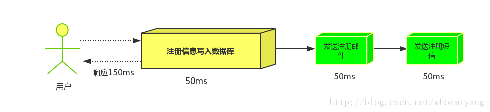
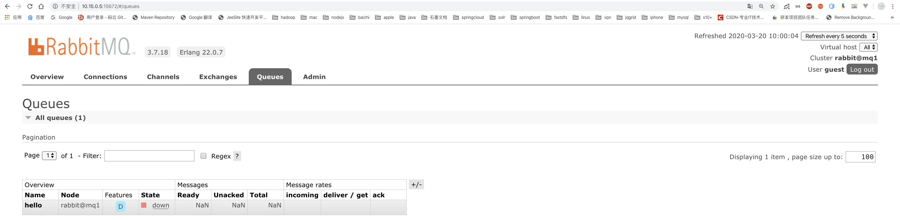

# RabbitMQ

## 1.MQ

### 1.1 什么是MQ

`MQ`(Message Quene) :  翻译为 `消息队列`,通过典型的 `生产者`和`消费者`模型,生产者不断向消息队列中生产消息，消费者不断的从队列中获取消息。因为消息的生产和消费都是异步的，而且只关心消息的发送和接收，没有业务逻辑的侵入,轻松的实现系统间解耦。别名为 `消息中间件`	<font color=red>通过利用高效可靠的消息传递机制进行平台无关的数据交流，并基于数据通信来进行分布式系统的集成。</font>

### 1.2 不同MQ特点

```markdown
# 1.ActiveMQ
	ActiveMQ 是Apache出品，最流行的，能力强劲的开源消息总线。它是一个完全支持JMS规范的的消息中间件。丰富的API,多种集群架构模式让ActiveMQ在业界成为老牌的消息中间件,在中小型企业颇受欢迎!

# 2.Kafka
	Kafka 是LinkedIn开源的分布式发布-订阅消息系统，目前归属于Apache顶级项目。Kafka主要特点是基于Pull的模式来处理消息消费，追求高吞吐量，一开始的目的就是用于日志收集和传输。0.8版本开始支持复制，不支持事务，对消息的重复、丢失、错误没有严格要求，适合产生大量数据的互联网服务的数据收集业务。

# 3.RocketMQ
	RocketMQ 是阿里开源的消息中间件，它是纯Java开发，具有高吞吐量、高可用性、适合大规模分布式系统应用的特点。RocketMQ思路起源于Kafka，但并不是Kafka的一个Copy，它对消息的可靠传输及事务性做了优化，目前在阿里集团被广泛应用于交易、充值、流计算、消息推送、日志流式处理、binglog分发等场景。

# 4.RabbitMQ
	RabbitMQ 是使用Erlang语言开发的开源消息队列系统，基于AMQP协议来实现。AMQP的主要特征是面向消息、队列、路由（包括点对点和发布/订阅）、可靠性、安全。AMQP协议更多用在企业系统内对数据一致性、稳定性和可靠性要求很高的场景，对性能和吞吐量的要求还在其次。
```

> RabbitMQ 比 Kafka 可靠，Kafka 更适合 IO 高吞吐的处理，一般应用在大数据日志处理或对实时性（少量延迟），可靠性（少量丢数据）要求稍低的场景使用，比如ELK日志收集。

如果仅仅是解决消息消费的问题，Java 里面有这么多的队列的实现，为什么不用他们呢？这个问题的答案，就跟有了 HashMap 之后，为什么还要 Redis 做缓存是一样的。

<font color=red>Queue 不能跨进程，不能在分布式系统中使用，并且没有持久化机制等等。 </font>

## 2.RabbitMQ

> 基于`AMQP`协议，erlang语言开发，是部署最广泛的开源消息中间件,是最受欢迎的开源消息中间件之一。


`官网` https://www.rabbitmq.com/

`官方教程` https://www.rabbitmq.com/#getstarted

高可靠：RabbitMQ 提供了多种多样的特性让你在可靠性和性能之间做出权衡，包括持久化、发送应答、发布确认以及高可用性。 

灵活的路由：通过交换机（Exchange）实现消息的灵活路由。 

支持多客户端：对主流开发语言（Python、Java、Ruby、PHP、C#、JavaScript、 Go、Elixir、Objective-C、Swift 等）都有客户端实现。 

集群与扩展性：多个节点组成一个逻辑的服务器，支持负载。 

高可用队列：通过镜像队列实现队列中数据的复制。 

权限管理：通过用户与虚拟机实现权限管理。 

插件系统：支持各种丰富的插件扩展，同时也支持自定义插件。 

与 Spring 集成：Spring 对 AMQP 进行了封装。

### 2.1 AMQP

```markdown
 # AMQP 协议
	AMQP（advanced message queuing protocol）在2003年时被提出，最早用于解决金融领不同平台之间的消息传递交互问题。顾名思义，AMQP是一种协议，更准确的说是一种binary wire-level protocol（链接协议）。这是其和JMS的本质差别，AMQP不从API层进行限定，而是直接定义网络交换的数据格式。这使得实现了AMQP的provider天然性就是跨平台的。以下是AMQP协议模型:
```


#### Broker

要是用RabbitMQ来收发消息，就必须要安装一个RabbitMQ的服务，可以安装在Windows或者Linux上，默认端口是5672。这台RabbitMQ的服务器我们叫它``Broker，中文翻译是代理/中介``，因为MQ服务器帮助我们做的事情就是存储、转发消息。

#### Connection

无论是生产者发生消息，还是消费者接收消息，都需要和Broker之间建立一个连接，这个连接是一个TCP的长连接。

#### Channel

如果生产者发送消息和消费者接收消息都直接创建和释放TCP长连接的话，对于Broker来说会造成很大的消耗，因为TCP连接是非常宝贵的资源，创建和释放也需要消耗时间。

所以在AMQP中引入了Channel的概念，它是一个虚拟连接。把它翻译成通道，或者消息信道。我们可以在创建的TCP长连接中创建和释放Channel，``大大减少了资源消耗``。

Channel是RabbitMQ原生API中最重要的编程接口，我们定义交换机、队列、绑定关系，发送消费消息，调用的都是Channel接口上的方法。

#### Queue

队列是``真正用来存储消息的``，是一个独立运行的进程，有自己的数据库（Mnesia）。

消费者获取消息有两种模式，一种是push模式，只要生产者发到服务器，就马上推送给消费者。另一种是pull模式，消息存放在服务器，主要消费者主动去拿到消息（消费者对队列监听）。

由于队列有FIFO的特性，只要确定前一条消息被消费者接受之后，才会把这条消息从数据库删除，继续投递下一条消息。

#### Exchange

在RabbitMQ里面永远不会出现消息直接发送给队列的情况。因为AMQP里面引入了交换机（Exchange）的概念，`用来实现消息的灵活路由`。

交换机是一个绑定列表，用来查找匹配的绑定关系。

队列使用绑定键（Binding Key）跟交换机建立绑定关系。

生产者发送消息需要携带路由键（Routing Key），交换机收到消息时会根据它保存的绑定列表，决定将消息路由到哪些与它绑定的队列上。

注意：交换机与队列、队列与消费者都是多对多的关系。

#### Vhost

我们每个需要实现基于 RabbitMQ 的异步通信的系统，都需要在服务器上创建自己要用到的交换机、队列和它们的绑定关系。如果某个业务系统不想跟别人混用一个系统，怎么办？再采购一台硬件服务器单独安装一个 RabbitMQ 服务？这种方式成本太高了。 

在同一个硬件服务器上安装多个 RabbitMQ 的服务呢？比如再运行一个 5673 的端口？ 没有必要，因为 RabbitMQ 提供了虚拟主机 VHOST。 

VHOST 除了`可以提高硬件资源的利用率之外，还可以实现资源的隔离和权限的控制`。它的作用类似于编程语言中的 namespace 和 package，不同的 VHOST 中可以有同名的 Exchange 和 Queue，它们是完全透明的。 

这个时候，我们可以为不同的业务系统创建不同的用户（User），然后给这些用户分配 VHOST 的权限。比如给风控系统的用户分配风控系统的 VHOST 的权限，这个用户可以访问里面的交换机和队列。给超级管理员分配所有 VHOST 的权限。

### 2.2 RabbitMQ 安装

官网下载地址： https://www.rabbitmq.com/download.html 


#### 2.1.1 下载安装包

> RabbitMQ 需要引入 Erlang / OTP 依赖。这里安装的是最新版本3.8.5

##### centos7

esl-erlang_23.0.2-2_centos_7_amd64.rpm

rabbitmq-server-3.8.5-1.el7.noarch.rpm

##### windows

otp_win64_23.0.3.exe

rabbitmq-server-3.8.5.exe

##### mac

```
brew update
brew install rabbitmq
```

#### 2.1.2 安装步骤

```markdown
# 1.安装Erlang依赖包
rpm -ivh esl-erlang_23.0.2-2_centos_7_amd64.rpm
	安装 Erlang 时，出现以下错误：
	error: Failed dependencies:    
	libGL.so.1()(64bit) is needed by esl-erlang-19.3-1.x86_64......
	执行以下命令：
	yum install epel-release        
	yum install unixODBC unixODBC-devel wxBase wxGTK SDL wxGTK-gl
# 2.安装RabbitMQ安装包
## 可能需要先安装！！
yum install socat
rpm -ivh rabbitmq-server-3.7.17-1.el7.noarch.rpm

# 3.执行如下命令,启动rabbitmq中的插件管理
rabbitmq-plugins enable rabbitmq_management
	出现如下说明:
		Enabling plugins on node rabbit@localhost:
    rabbitmq_management
    The following plugins have been configured:
      rabbitmq_management
      rabbitmq_management_agent
      rabbitmq_web_dispatch
    Applying plugin configuration to rabbit@localhost...
    The following plugins have been enabled:
      rabbitmq_management
      rabbitmq_management_agent
      rabbitmq_web_dispatch

    set 3 plugins.
    Offline change; changes will take effect at broker restart.
## 插件管理命令行
rabbitmq-plugins enable|list|disable 
	
# 4.添加非guest管理员，3.8.5版本已经无法通过修改配置文件开放guest帐号
rabbitmqctl add_user admin  123456
rabbitmqctl set_user_tags admin administrator
rabbitmqctl set_permissions -p / admin ".*" ".*" ".*"
rabbitmqctl list_user_permissions admin

# 5.启动RabbitMQ的服务
systemctl start rabbitmq-server
systemctl restart rabbitmq-server
systemctl stop rabbitmq-server
	
# 6.查看服务状态(见下图:)
systemctl status rabbitmq-server

# 7.关闭防火墙服务
systemctl disable firewalld
systemctl stop firewalld

# 8.访问web管理界面
http://localhost:15672/

# 9.登录管理界面
username:  admin
password:  123456
```

# 3.RabbitMQ 配置

## 3.1 web 管理界面介绍

### 3.1.1 overview 概览


``connections`` 无论生产者还是消费者，都需要与RabbitMQ建立连接后才可以完成消息的生产和消费，在这里可以查看连接情况。
``channels`` 通道，建立连接后，会形成通道，消息的投递获取依赖通道。
``Exchanges`` 交换机，用来实现消息的路由。
``Queues`` 队列，即消息队列，消息存放在队列中，等待消费，消费后被移除队列。

### 3.1.2 Admin 用户和虚拟主机管理

**1.添加用户**


上面的Tags选项，其实是指定用户的角色，可选的有以下几个：
``超级管理员(administrator)`` 可登陆管理控制台，可查看所有的信息，并且可以对用户，策略(policy)进行操作。
``监控者(monitoring)`` 可登陆管理控制台，同时可以查看rabbitmq节点的相关信息(进程数，内存使用情况，磁盘使用情况等)
``策略制定者(policymaker)`` 可登陆管理控制台, 同时可以对policy进行管理。但无法查看节点的相关信息(上图红框标识的部分)。
``普通管理者(management)`` 仅可登陆管理控制台，无法看到节点信息，也无法对策略进行管理。
``其他`` 无法登陆管理控制台，通常就是普通的生产者和消费者。

**2.创建虚拟主机**

> 虚拟主机：为了让各个用户可以互不干扰的工作，RabbitMQ添加了虚拟主机（Virtual Hosts）的概念。其实就是一个独立的访问路径，不同用户使用不同路径，各自有自己的队列、交换机，互相不会影响。


**3.绑定虚拟主机和用户**


# 4.RabbitMQ 第一个程序

## 4.1 RabbitMQ 支持的消息模型


## 4.2 引入依赖

```xml
<dependency>
    <groupId>com.rabbitmq</groupId>
    <artifactId>amqp-client</artifactId>
    <version>5.9.0</version>
</dependency>
```

## 4.3 直连模式(Hello World)


在上图的模型中，有以下概念：

- P：生产者，也就是要发送消息的程序
- C：消费者：消息的接受者，会一直等待消息到来。
- queue：消息队列，图中红色部分。类似一个邮箱，可以缓存消息；生产者向其中投递消息，消费者从其中取出消息。

**生产者**

```java
public class Producer {
    // 生产消息
    @Test
    public void testSendMessage() throws IOException, TimeoutException {
        // 获取连接对象
        Connection connection = RabbitMQUtils.getConnection();

        // 获取连接中通道
        Channel channel = connection.createChannel();

        // 通道绑定对应的消息队列
        // 参数1，队列名称，如果不存在自动创建
        // 参数2，队列特性是否持久化
        // 参数3，是否独占队列
        // 参数4，是否在消费完成后自动删除队列
        // 参数5，额外附加参数
        channel.queueDeclare("hello", false, false, false, null);

        // 发布消息
        // 参数1，交换机名称
        // 参数2，队列名称
        // 参数3，传递消息额外设置，MessageProperties.PERSISTENT_TEXT_PLAIN，RabbitMQ重启后消息依然有效
        // 参数4，消息的具体内容
        channel.basicPublish("", "hello", MessageProperties.PERSISTENT_TEXT_PLAIN, "Hello RabbitMQ".getBytes());

        //channel.close();
        //connection.close();
        RabbitMQUtils.closeConnectAndChanel(channel, connection);
    }
}
```

> queueDeclare声明队列的参数5：Map<String, Object> arguments
>
> 
>
> x-message-ttl 队列中消息的存活时间，单位毫秒 
>
> x-expires 队列在多久没有消费者访问以后会被删除 
>
> x-max-length 队列的最大消息数 
>
> x-max-length-bytes 队列的最大容量，单位 Byte 
>
> x-dead-letter-exchange 队列的死信交换机 
>
> x-dead-letter-routing-key 死信交换机的路由键 
>
> x-max-priority 队列中消息的最大优先级，消息的优先级不能超过它 

**消费者**

```java
public class Consumer {

    public static void main(String[] args) throws IOException, TimeoutException {
        // 获取连接对象
        Connection connection = RabbitMQUtils.getConnection();

        Channel channel = connection.createChannel();

        // 参数2，是否是持久化消息，要与生产者保持一致
        channel.queueDeclare("hello", true, false, false, null);

        // 消费消息
        // 参数1，队列名称
        // 参数2，开启消息的自动确认机制
        // 参数3，消费消息时的回调接口
        channel.basicConsume("hello", true, new DefaultConsumer(channel){

            // 最后一个参数，消息队列中取出的消息
            @Override
            public void handleDelivery(String consumerTag, Envelope envelope, AMQP.BasicProperties properties, byte[] body) throws IOException {
                System.out.println("new String(body) = " + new String(body));
            }
        });

        // 如果不关闭，consumer会一直监听队列
        channel.close();
        connection.close();
    }

}
```

## 4.4 Work Queues 模型

``Work queues``，也被称为（``Task queues``），任务模型。当消息处理比较耗时的时候，可能生产消息的速度会远远大于消息的消费速度。长此以往，消息就会堆积越来越多，无法及时处理。此时就可以使用work 模型：<font color="red">让多个消费者绑定到一个队列，共同消费队列中的消息。</font>队列中的消息一旦消费，就会消失，因此任务是不会被重复执行的。


角色：

- P：生产者：任务的发布者
- C1：消费者-1，领取任务并且完成任务，假设完成速度较慢
- C2：消费者-2：领取任务并完成任务，假设完成速度快

**工具类**

```java
public class RabbitMQUtils {

    private static ConnectionFactory connectionFactory;

    static {
        // 创建连接mq的连接工厂对象
        connectionFactory = new ConnectionFactory();
        // 设置连接rabbitmq主机
        connectionFactory.setHost("localhost");
        // 设置端口号
        connectionFactory.setPort(5672);
        // 设置连接那个虚拟主机
        connectionFactory.setVirtualHost("/ems");
        // 设置访问虚拟主机的用户名和密码
        connectionFactory.setUsername("guest");
        connectionFactory.setPassword("guest");
    }

    // 定义提供连接对象的方法
    public static Connection getConnection() {
        try {
            // 获取连接对象
            return connectionFactory.newConnection();
        } catch (Exception e) {
            e.printStackTrace();
        }
        return null;
    }

    // 关闭通道和关闭连接工具方法
    public static  void closeConnectAndChanel(Channel channel, Connection connection) {
        try {
            if (channel != null) {
                channel.close();
            }
            if (connection != null) {
                connection.close();
            }
        } catch (Exception e) {
            e.printStackTrace();
        }
    }

}
```

**生产者**

```java
// 获取连接对象
Connection connection = RabbitMQUtils.getConnection();
// 获取通道对象
Channel channel = connection.createChannel();
// 通过通道声明队列
channel.queueDeclare("work", true, false, false, null);
// 生产消息
for (int i = 0; i < 10; i++) {
    channel.basicPublish("", "work", null, ("Hello Work Queue" + i).getBytes());
}
RabbitMQUtils.closeConnectAndChanel(channel, connection);
```

**消费者1、2**

```java
// 获取连接对象
Connection connection = RabbitMQUtils.getConnection();
final Channel channel = connection.createChannel();

// 参数2，是否是持久化队列，要与生产者保持一致
channel.queueDeclare("work", true, false, false, null);
// 消费消息
// 参数1，队列名称
// 参数2，开启消息的自动确认机制，消费者自动向rabbitmq确认消息消费
// 参数3，消费消息时的回调接口
channel.basicConsume("work", true, new DefaultConsumer(channel){
    // 最后一个参数，消息队列中取出的消息
    @Override
    public void handleDelivery(String consumerTag, Envelope envelope, AMQP.BasicProperties properties, byte[] body) throws IOException {
        try {
            // 消费者2，无需睡眠，表示消费者2执行速度较快
            Thread.sleep(2000);
        } catch (InterruptedException e) {
            e.printStackTrace();
        }
        System.out.println("消费者-1：" + new String(body));
    }
});
```

### 测试结果


> 总结:默认情况下，RabbitMQ 将按顺序将每个消息发送给下一个使用者。平均而言，每个消费者都会收到相同数量的消息。这种分发消息的方式称为循环。

### 消息自动确认机制

> Doing a task can take a few seconds. You may wonder what happens if one of the consumers starts a long task and dies with it only partly done. With our current code once RabbitMQ delivers message to the consumer it immediately marks it for deletion. In this case, if you kill a worker we will lose the message it was just processing. We'll also lose all the messages that were dispatched to this particular worker but were not yet handled.
>
> But we don't want to lose any tasks. If a worker dies, we'd like the task to be delivered to another worker.
>
> 完成一项任务可能需要几秒钟。您可能想知道，如果一个消费者开始了一项很长的任务，但只完成了一部分就挂掉，会发生什么。在我们当前的代码中，一旦 RabbitMQ 将消息传递给消费者，它就会立即将其标记为删除。在这种情况下，如果你杀死一个worker，我们就会丢失它正在处理的信息。我们还将丢失所有发送给这个特定worker但尚未处理的消息。
>
> 但我们不想失去任何任务。如果一个worker挂掉，我们希望任务被交付给另一个worker。

```java
channel.basicQos(1);//一次只接受一条未确认的消息
//参数2:关闭自动确认消息
channel.basicConsume("work",false,new DefaultConsumer(channel){
  @Override
  public void handleDelivery(String consumerTag, Envelope envelope, AMQP.BasicProperties properties, byte[] body) throws IOException {
   try {
        Thread.sleep(2000);
    } catch (InterruptedException e) {
        e.printStackTrace();
    }
    System.out.println("消费者-1：" + new String(body));
    //手动确认消息
    channel.basicAck(envelope.getDeliveryTag(),false);
  }
});
```

1.设置通道一次只能消费一个消息

2.关闭消息的自动确认,开启手动确认消息


以下为常用模型：

## 4.5 fanout 模型

``fanout 扇出`` 也称为广播


在广播模式下，消息发送流程是这样的：

-  可以有多个消费者
-  每个<font color="red">消费者有自己的queue</font>（队列）
-  每个<font color="red">队列都要绑定到Exchange</font>（交换机）
-  <font color="red">生产者发送的消息，只能发送到交换机</font>，交换机来决定要发给哪个队列，生产者无法决定。
-  交换机把消息发送给绑定过的所有队列
-  队列的消费者都能拿到消息。实现一条消息被多个消费者消费

**生产者**

```java
// 将通道声明指定的交换机
// 参数1，交换机名称
// 参数2，交换机类型，fanout为广播类型
channel.exchangeDeclare("logs", "fanout");
// 发送消息
channel.basicPublish("logs", "", null, "fanout type message".getBytes());
RabbitMQUtils.closeConnectAndChanel(channel, connection);
```

**消费者1、2、3**

```java
// 通道绑定交换机
channel.exchangeDeclare("logs", "fanout");
// 临时队列
String queueName = channel.queueDeclare().getQueue();
channel.queueBind(queueName, "logs",  "");
// 消费消息
channel.basicConsume(queueName, true, new DefaultConsumer(channel){
    @Override
    public void handleDelivery(String consumerTag, Envelope envelope, AMQP.BasicProperties properties, byte[] body) throws IOException {
        System.out.println("消费者1：" + new String(body));
    }
});
```

## 4.6 Routing 模型

### 4.6.1 Routing 之订阅模型 - Direct (直连)

在 Fanout 模式中，一条消息，会被所有订阅的队列都消费。但是，在某些场景下，我们希望不同的消息被不同的队列消费。这时就要用到 Direct 类型的 Exchange。
在Direct模型下：

* 队列与交换机的绑定，不能是任意绑定了，而是要指定一个RoutingKey（路由key）
* 消息的发送方在 向 Exchange发送消息时，也必须指定消息的 RoutingKey。
* Exchange不再把消息交给每一个绑定的队列，而是根据消息的Routing Key进行判断，只有队列的Routingkey与消息的 Routing key完全一致，才会接收到消息


图解：

- P：生产者，向Exchange发送消息，发送消息时，会指定一个routing key。
- X：Exchange（交换机），接收生产者的消息，然后把消息递交给 与routing key完全匹配的队列
- C1：消费者，其所在队列指定了需要routing key 为 error 的消息
- C2：消费者，其所在队列指定了需要routing key 为 info、error、warning 的消息

**生产者**

```java
// 将通道声明指定的交换机
// 参数1，交换机名称
// 参数2，交换机类型，direct 路由模式
channel.exchangeDeclare("logs_direct", "direct");
String routingKey = "error";
// 发送消息
channel.basicPublish("logs_direct", routingKey, null, ("direct type message, key: " + routingKey).getBytes());
```

**消费者1、2**

```java
// 通道绑定交换机
channel.exchangeDeclare("logs_direct", "direct");
// 临时队列
String queueName = channel.queueDeclare().getQueue();
channel.queueBind(queueName, "logs_direct",  "error");
// 其他消费者可以不写一下两个
channel.queueBind(queueName, "logs_direct",  "info");
channel.queueBind(queueName, "logs_direct",  "waring");
// 消费消息
channel.basicConsume(queueName, true, new DefaultConsumer(channel){
    @Override
    public void handleDelivery(String consumerTag, Envelope envelope, AMQP.BasicProperties properties, byte[] body) throws IOException {
        System.out.println("消费者2：" + new String(body));
    }
});
```

### 4.6.2 Routing 之订阅模型 - Topic

`Topic`类型的`Exchange`与`Direct`相比，都是可以根据`RoutingKey`把消息路由到不同的队列。只不过`Topic`类型`Exchange`可以让队列在绑定`Routing key` 的时候使用通配符！这种模型`Routingkey` 一般都是由一个或多个单词组成，多个单词之间以”.”分割，例如： `item.insert`


```markdown
# 统配符
	* (star) can substitute for exactly one word.    匹配不多不少恰好1个词
	# (hash) can substitute for zero or more words.  匹配一个或多个词
# 如:
	audit.#    匹配audit.irs.corporate或者 audit.irs 等
    audit.*   只能匹配 audit.irs
```

**生产者**

```java
// 将通道声明指定的交换机
// 参数1，交换机名称
// 参数2，交换机类型，topic 路由模式
channel.exchangeDeclare("topics", "topic");
String routingKey = "user.save";
// 发送消息
channel.basicPublish("topics", routingKey, null, ("topic type message, key: " + routingKey).getBytes());
```

**消费者1、2**

```java
// 通道绑定交换机
channel.exchangeDeclare("topics", "topic");
// 临时队列
String queueName = channel.queueDeclare().getQueue();
// 绑定队列和交换机，动态通配符形式route key
// 消费者1使用*通配符方式
channel.queueBind(queueName, "topics", "user.*");
// 消费者2使用#通配符方式
// channel.queueBind(queueName, "topics", "user.#");
// 消费消息
channel.basicConsume(queueName, true, new DefaultConsumer(channel){
    @Override
    public void handleDelivery(String consumerTag, Envelope envelope, AMQP.BasicProperties properties, byte[] body) throws IOException {
        System.out.println("消费者1：" + new String(body));
    }
});
```

# 5.MQ的应用场景

### 5.1 异步通信

场景说明：用户注册后，需要发注册邮件和注册短信，传统的做法有两种 ：

1.串行的方式

2.并行的方式

- `串行方式` 将注册信息写入数据库后,发送注册邮件,再发送注册短信,以上三个任务全部完成后才返回给客户端。 这有一个问题是,邮件,短信并不是必须的,它只是一个通知,而这种做法让客户端等待没有必要等待的东西. 

 

- `并行方式` 将注册信息写入数据库后,发送邮件的同时,发送短信,以上三个任务完成后,返回给客户端,并行的方式能提高处理的时间。 

 

- `消息队列` 假设三个业务节点分别使用50ms,串行方式使用时间150ms,并行使用时间100ms。虽然并行已经提高的处理时间,但是,前面说过,邮件和短信对我正常的使用网站没有任何影响，客户端没有必要等着其发送完成才显示注册成功,应该是写入数据库后就返回.  `消息队列`: 引入消息队列后，把发送邮件,短信不是必须的业务逻辑异步处理 

  

由此可以看出,引入消息队列后，用户的响应时间就等于写入数据库的时间+写入消息队列的时间(可以忽略不计),引入消息队列后处理后,响应时间是串行的3倍,是并行的2倍。


### 5.2 应用解耦

> 耦合是系统内部或者系统之间存在相互作用，相互影响和相互依赖。 

场景：双11是购物狂节，用户下单后，订单系统需要通知库存系统,传统的做法就是订单系统调用库存系统的接口。 

 

这种做法有一个缺点:

当库存系统出现故障时,订单就会失败。 订单系统和库存系统高耦合.  引入消息队列 

 

- `订单系统` 用户下单后,订单系统完成持久化处理,将消息写入消息队列,返回用户订单下单成功。

- `库存系统` 订阅下单的消息,获取下单消息,进行库操作。  就算库存系统出现故障,消息队列也能保证消息的可靠投递,不会导致消息丢失.

  

### 5.3 流量削峰

场景：秒杀活动，一般会因为流量过大，导致应用挂掉,为了解决这个问题，一般在应用前端加入消息队列。  

作用：

​			1.可以控制活动人数，超过此一定阀值的订单直接丢弃(我为什么秒杀一次都没有成功过呢^^) 

​			2.可以缓解短时间的高流量压垮应用(应用程序按自己的最大处理能力获取订单) 

 

1.用户的请求，服务器收到之后，首先写入消息队列，加入消息队列长度超过最大值，则直接抛弃用户请求或跳转到错误页面。

2.秒杀业务根据消息队列中的请求信息，再做后续处理。

# 6. RabbitMQ的集群

## 6.1 集群架构

### 6.1.1 普通集群(副本集群)

> All data/state required for the operation of a RabbitMQ broker is replicated across all nodes. An exception to this are message queues, which by default reside on one node, though they are visible and reachable from all nodes. To replicate queues across nodes in a cluster, use a queue type that supports replication. This topic is covered in the Quorum Queues and Classic Mirrored Queues guides. --摘自官网

默认情况下：RabbitMQ 代理操作所需的所有数据/状态都将跨所有节点复制。这方面的一个例外是消息队列，默认情况下，消息队列位于一个节点上，尽管它们可以从所有节点看到和访问

**1.架构图**


​	核心解决问题：<font color="red">当集群中某一时刻 master 节点宕机，可以对 Quene 中信息，进行备份</font>

**2.集群搭建**

```markdown
# 0.集群规划
	node1: 10.15.0.3  mq1  master 主节点
	node2: 10.15.0.4  mq2  repl1  副本节点
	node3: 10.15.0.5  mq3  repl2  副本节点

# 1.克隆三台机器主机名和ip映射
	node1: vim /etc/hostname 加入:  mq1
	node2: vim /etc/hostname 加入:  mq2
	node3: vim /etc/hostname 加入:  mq3
	vim /etc/hosts加入:
		10.15.0.3 mq1
    	10.15.0.4 mq2
    	10.15.0.5 mq3

# 2.三个机器安装rabbitmq,并同步cookie文件,在node1上执行:
	scp /var/lib/rabbitmq/.erlang.cookie root@mq2:/var/lib/rabbitmq/
	scp /var/lib/rabbitmq/.erlang.cookie root@mq3:/var/lib/rabbitmq/

# 3.查看cookie是否一致:
	node1: cat /var/lib/rabbitmq/.erlang.cookie 
	node2: cat /var/lib/rabbitmq/.erlang.cookie 
	node3: cat /var/lib/rabbitmq/.erlang.cookie 

# 4.后台启动rabbitmq所有节点执行如下命令,该种方式无法访问 web 管理界面:
	rabbitmq-server -detached 

# 5.在node2和node3执行加入集群命令:
	1.关闭       rabbitmqctl stop_app
	2.加入集群    rabbitmqctl join_cluster rabbit@mq1
	3.启动服务    rabbitmqctl start_app
		集群启动完成之后，可以通过web管理界面访问

# 6.查看集群状态,任意节点执行:
	rabbitmqctl cluster_status

# 7.如果出现如下显示,集群搭建成功:
	Cluster status of node rabbit@mq3 ...
	[{nodes,[{disc,[rabbit@mq1,rabbit@mq2,rabbit@mq3]}]},
	{running_nodes,[rabbit@mq1,rabbit@mq2,rabbit@mq3]},
	{cluster_name,<<"rabbit@mq1">>},
	{partitions,[]},
	{alarms,[{rabbit@mq1,[]},{rabbit@mq2,[]},{rabbit@mq3,[]}]}]
```

**3.登录管理界面,展示如下状态**


**4.测试集群在node1上,创建队列**


```markdown

```


**5.关闭 node1 节点**

执行如下命令，查看 node2 和 node3

```markdown
rabbitmqctl stop_app
```




---

### 6.1.2 镜像集群

> This guide covers mirroring (queue contents replication) of classic queues  --摘自官网
>
> By default, contents of a queue within a RabbitMQ cluster are located on a single node (the node on which the queue was declared). This is in contrast to exchanges and bindings, which can always be considered to be on all nodes. Queues can optionally be made *mirrored* across multiple nodes. --摘自官网

镜像队列机制就是将队列在三个节点之间设置主从关系，消息会在三个节点之间进行自动同步，且如果其中一个节点不可用，并不会导致消息丢失或服务不可用的情况，提升 MQ 集群的整体高可用性。

**1.集群架构图**


**2.配置集群架构**

```markdown
# 0.策略说明
	rabbitmqctl set_policy [-p <vhost>] [--priority <priority>] [--apply-to <apply-to>] <name> <pattern>  <definition>
	-p Vhost： 可选参数，针对指定vhost下的queue进行设置
	Name:     policy的名称
	Pattern: queue的匹配模式(正则表达式)
	Definition：镜像定义，包括三个部分ha-mode, ha-params, ha-sync-mode
           		ha-mode:指明镜像队列的模式，有效值为 all/exactly/nodes
                        all：表示在集群中所有的节点上进行镜像
                        exactly：表示在指定个数的节点上进行镜像，节点的个数由ha-params指定
                        nodes：表示在指定的节点上进行镜像，节点名称通过ha-params指定
            	 ha-params：ha-mode模式需要用到的参数
                ha-sync-mode：进行队列中消息的同步方式，有效值为automatic和manual
                priority：可选参数，policy的优先级
                
                 
# 1.查看当前策略
	rabbitmqctl list_policies

# 2.添加策略
	rabbitmqctl set_policy ha-all '^hello' '{"ha-mode":"all","ha-sync-mode":"automatic"}' 
	说明:策略正则表达式为 “^” 表示所有匹配所有队列名称  ^hello:匹配hello开头队列

# 3.删除策略
	rabbitmqctl clear_policy ha-all

# 4.测试集群
```

------

