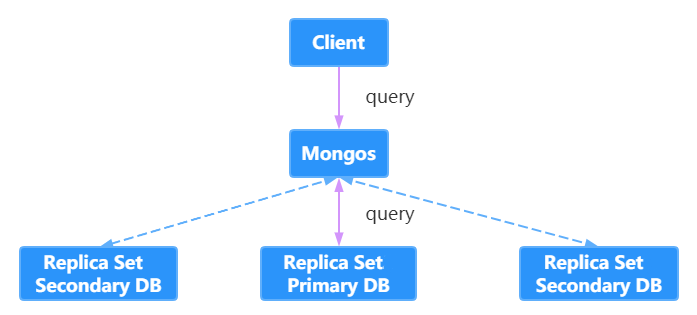

# MongoDB

## 1.MongoDB 中的应用场景及设计原理

`MongoDB` 是一个基于分布式文件存储的数据库。由 `C++` 语言编写。旨在为 WEB 应用提供可扩展的高性能 

数据存储解决方案。 MongoDB 是一个介于关系数据库和非关系数据库之间的产品，是非关系数据库当 

中功能最丰富，最像关系数据库的。

### 1.1 什么是 NoSQL 

`NoSQL` 指的是非关系型的数据库。NoSQL 有时也称作 Not Only SQL 的缩写，是对不同于传统的关系 

型数据库的数据库管理系统的统称。NoSQL 用于超大规模数据的存储。（例如谷歌或 Facebook 每天为 

他们的用户收集万亿比特的数据）。这些类型的数据存储不需要固定的模式，无需多余操作就可以横向 

扩展。 

### 1.2 关系型数据库 PK 非关系型数据库

| 关系型数据库                 | NoSQL 数据库                              |
| ---------------------------- | ----------------------------------------- |
| 高度组织化结构化数据         | 代表着不仅仅是SQL                         |
| 结构化查询语言SQL            | 没有声明性查询语言                        |
| 数据和关系都存储在单独的表中 | 没有预定义的模式                          |
| 数据操作语言，数据定义语言   | 键-值对存储，列存储，文档存储，图形数据库 |
| 严格的一致性                 | 最终一致性，而非 ACID 属性                |
| 基础事务                     | 非结构化和不可预知的数据                  |
|                              | CAP 定理                                  |
|                              | 高性能，高可用性和可伸缩性                |

在计算机科学中，`CAP定理(CAP theorem)` 又被称作`布鲁尔定理( Brewer's theorem)`，它指出对于一个分布式计算系统来说，不可能同时满足以下三点：

`一致性(Consistency)` 所有节点在同一时间具有相同的数据

`可用性(Avaibility)` 保证每个请求不管成功或者失败都有响应

`分区容错性(Partition tolerance)` 系统中任意信息的丢失或失败不影响系统的继续运行

CAP理论的核心是<font color="red">一个分布式系统不可能同时很好的满足一致性、可用性和分区容错性这三个需求，最多只能同时较好的满足两个。</font>

因此，根据 CAP 原理将 NoSQL 数据库分成了满足CA原则、满足CP原则和满足AP原则三大类：

`CA` 单点集群，满足一致性、可用性的系统，通常在可扩展性上不太强大

`CP` 满足一致性、分区容错性的系统，通常性能不是特别高

`AP` 满足可用性、分区容错性的系统，通常可能对一致性要求低一些

### 1.3 NoSQL 数据库分类

| <span style="white-space:nowrap;">硬件&emsp;&emsp;&emsp;&emsp;&emsp;</span> | <span style="white-space:nowrap;">典型代表&emsp;&emsp;&emsp;&emsp;&emsp;&emsp;&emsp;</span> | 特点                                                         |
| ------------------------------------------------------------ | ------------------------------------------------------------ | ------------------------------------------------------------ |
| 列存储                                                       | Hbase <br/>Cassandra<br/>Hypertable                          | 顾名思义，是按照列存储数据的。 最大的特点是方便存储结构化和半结构化的数据，方便做数据压缩，对针对某一列或者某几列的查询有非常大的 IO 优势 |
| 文档存储                                                     | MongoDB <br/>CounchDB                                        | 文档存储一般用类似 json 的格式存储，存储的内容是文档型的。这样也就有机会对某些字段建立索引，实现关系数据库的某些功能 |
| Key-value 存储                                               | Tokyo Cabinet/Tyrant<br/>Berkelery DB<br />Memcache<br />Redis | 可以通过key快速查询到其 value 。 一 般来 说 ， 存储不管 value 的格式，照单全收。(Redis 包含了其他功能) |
| 图存储                                                       | Neo4J<br />FlockDB                                           | 图形关系的最佳存储。使用传统关系数据库来解决的话性能低 下，而且设计使用不方便。 |
| 对象存储                                                     | Db4o<br />Versant                                            | 通过类似面向对象语言的语法操作数据库，通过对象的方式存储数据。 |
| XML 数据库                                                   | Berkeley DB XML<br/>BaseX                                    | 高效的存储 XML 数据，并存储 XML 的内部查询语法， 比如 XQuery、Xpath。 |

### 1.4 MongoDB 的数据结构与关系型数据库对比

| 关系型数据库术语/概念 | MongoDB 术语/概念 | 解释/说明                     |
| --------------------- | ----------------- | ----------------------------- |
| Database              | Database          | 数据库                        |
| Table                 | Collection        | 数据库表/集合                 |
| Row                   | Document          | 数据记录行/文档               |
| Column                | Field             | 数据列/数据字段               |
| Index                 | Index             | 索引                          |
| Table joins           |                   | 表关联/MongoDB 不支持         |
| Primary Key           | Object ID         | 主键/MongoDB 自动将_id 设置为 |

### 1.5 MongoDB 中的数据类型

| 数据类型     | 说明       | 解释                                                         | 举例                   |
| ------------ | ---------- | ------------------------------------------------------------ | ---------------------- |
| Null         | 空值       | 表示控制或未指定的对象                                       | {"x":null}             |
| Boolean      | 布尔值     | 真或假，true或false                                          | {"x":true}             |
| Integer      | 整数       | 整型数值，用于存储数值。根据所采用的服务器，分为32位或64位   |                        |
| Double       | 浮点数     | 双精度浮点值                                                 | {"x":3.14}             |
| String       | 字符串     | UTF-8字符串                                                  |                        |
| Symbol       | 符号       | 符号。该数据类型基本上等同于字符串类型，但不同的是，它一般用于采用特殊符号类型的语言。 |                        |
| ObjectID     | 对象ID     | 用于创建文档的 ID                                            | {"id": ObjectId()}     |
| Date         | 日期       | 日期时间，用 UNIX 时间格式来存储当前日期或者时间             | {"date": new Date()}   |
| Timestamp    | 时间戳     | 从标准纪元开始的毫秒数                                       |                        |
| Regular      | 正则表达式 | 文档中可以包含正则表达式，遵循 JavaScript 的语法             | {"foo" : /testdb/i}    |
| Code         | 代码       | 可包含 JavaScript 代码                                       | {"code": function(){}} |
| Undefined    | 未定义     | 已废弃                                                       |                        |
| Array        | 数组       | 值的集合或列表                                               | {"arr":["a","b"]}      |
| Binary Data  | 二进制     | 用于存储二进制数据                                           |                        |
| Object       | 内嵌文档   | 文档可以作为文档中某个 key 的 value                          | {"x":{"foo":"bar"}}    |
| Min/Max keys | 最小/大值  | 将一个值与 BSON（二进制的 JSON）元素的最低值和最高值相对比。 |                        |

### 1.6 图解 MongoDB 底层原理

MongoDB 的集群部署方案中有三类角色：实际数据存储结点、配置文件存储结点和路由接入结点。 

连接的客户端直接与路由结点相连，从配置结点上查询数据，根据查询结果到实际的存储结点上查询和存储数据。MongoDB 的部署方案有单机部署、复本集（主备）部署、分片部署、复本集与分片混合部署。 

混合的部署方式如图：


混合部署方式下向 MongoDB 写数据的流程如图：


混合部署方式下读 MongoDB 里的数据流程如图：


对于复本集，又有主和从两种角色，写数据和读数据也是不同，写数据的过程是只写到主结点中，由主结点以异步的方式同步到从结点中：


而读数据则只要从任一结点中读取，具体到哪个结点读取是可以指定的：



对于 MongoDB 的`分片`，假设我们以某一索引键（ID）为`片键`，ID 的区间[0,50]，划分成 5 个 `chunk`， 分别存储到 3 个片服务器中，如图所示： 


假如数据量很大，需要增加片服务器时可以只要移动 chunk 来均分数据即可。 

**配置结点**

存储配置文件的服务器其实存储的是片键与 chunk 以及 chunk 与 server 的映射关系，用上面的数据表示的配置结点存储的数据模型如下表： 

Map1

| Key range | chunk  |
| --------- | ------ |
| [0,10)    | chunk1 |
| [10,20)   | chunk2 |
| [20,30)   | chunk3 |
| [30,40)   | chunk4 |
| [40,50)   | chunk5 |

Map2

| chunk  | shard  |
| ------ | ------ |
| chunk1 | shard1 |
| chunk2 | shard1 |
| chunk3 | shard2 |
| chunk4 | shard2 |
| chunk5 | shard3 |

**路由结点** 

路由角色的结点在分片的情况下起到负载均衡的作用。 

### 1.7 MongoDB 的应用场景和不适用场景

**适用场景** 

对于 MongoDB 实际应用来讲，是否使用 MongoDB 需要根据项目的特定特点进行一一甄别，这就要求我们对 MongoDB 适用和不适用的场景有一定的了解。

根据 MongoDB 官网的说明，MongoDB 的适用场景如下: 

- `网站实时数据` MongoDB 非常适合实时的插入，更新与查询，并具备网站实时数据存储所需的复制及高度伸缩性

- `数据缓存` 由于性能很高，MongoDB 也适合作为信息基础设施的缓存层。在系统重启之后，由 MongoDB 搭建的持久化缓存层可以避免下层的数据源过载

- `大尺寸、低价值数据存储` 使用传统的关系型数据库存储一些数据时可能会比较昂贵，在此之前，很多时候程序员往往会选择传统的文件进行存储

- `高伸缩性场景` MongoDB 非常适合由数十或数百台服务器组成的数据库。MongoDB 的路线图中已经包含对 MapReduce 引擎的内置支持

- `对象或 JSON 数据存储` MongoDB 的 BSON 数据格式非常适合文档化格式的存储及查询

**不适用场景 **

了解了 MongoDB 适用场景之后，还需要了解哪些场景下不适合使用 MongoDB，具体如下: 

- `高度事务性系统` 例如银行或会计系统。传统的关系型数据库目前还是更适用于需要大量原子性复杂事务的应用程序

- `传统的商业智能应用` 针对特定问题的 BI 数据库会对产生高度优化的查询方式。对于此类应用，数据仓库可能是更合适的选择

- `需要复杂 SQL 查询的问题`


相信通过上面的说明，你已经大致了解了 MongoDB 的使用规则，需要说明一点的是，MongoDB 不仅仅是数据库，更多的使用是将 MongoDB 作为一个数据库中间件在实际应用中合理划分使用细节，这一点对于 MongoDB 应用来讲至关重要！


## 2.MongoDB 基本配置及常用命令

### 2.1 安装 MongoDB 数据库

`官网`  https://www.mongodb.com/try/download/community 

#### Windows


**安装与启动** 

1.在 D 盘创建安装目录，D:\MongoDB，将解压后的文件拷入新建的文件。 

2.在 D 盘创建一个目录，D:\MongoDB\data，用于存放 MongoDB 的数据。 

3.执行安装，使用命令行，进入 MongDB 的安装目录，执行安装命令，并指明存放 MongoDB 的路径。


4.安装完成后配置环境变量


5.启动数据库

```markdown
# 需要指定数据存储路径
mongod --dbpath="D:\MongoDB\data"
```

最后一行显示我们的 MongoDB 已经连接到 27017,它是默认的数据库的端口；它建立完数据库之后，会在我们的 MongoDB\data 文件夹下，生成一些文件夹和文件：在 `journal` 文件夹中会存储相应的数据文件，NoSQL 的 MongoDB，它以文件的形式，也就是说被二进制码转换过的 json 形式来存储所有的数据模型。 

启动 MongoDB 数据库，也可以根据自己配置 mongodb.bat 文件，在 D:\MongoDB\bin 中创建一个 mongodb.bat 文件，然后我们来编写这个可执行文件如下： 

mongod --dbpath=D:\MongoDB\data 

运行 mongodb.bat 文件，MongoDB 便启动成功！

#### Linux

1.下载 mongodb-linux-x86_64-rhel70-4.2.8.tgz

2.解压，创建 /usr/local/mongodb/data/db 数据存储文件夹和/usr/local/mongodb/logs 日志存储文件夹

3.修改环境变量，启动数据库

```markdown
# 修改环境变量
	vim /etc/profile
	修改 PATH
		export PATH=/usr/local/mongodb/bin:$PATH

# 启动数据库
	# logappend 附加到日志路径而不是覆盖
	# fork 服务后台运行
	mongod --dbpath=/usr/local/mongodb/data/db/ --bind_ip=192.168.174.128 --logpath=/usr/local/mongodb/logs/mongodb.log --logappend --fork

# 以配置文件形式启动
	# 创建 /usr/local/mongodb/mongodb.cfg
		dbpath=/usr/local/mongodb/data/db
		logpath=/usr/local/mongodb/logs/mongodb.log
		logappend=true
		fork=true
		bind_ip=192.168.174.128
		port=27017
	# 运行以下命令
		mongod -f mongodb.cfg

# 连接数据库
	mongo --host=192.168.174.128 --port=27017
```


### 2.2 安装 Studio 3T 客户端

`下载地址`  https://studio3t.com/download/ 


### 2.3 MongoDB 常用命令

```markdown
# 1.创建数据库
	use testdb

# 2.创建集合
	db.t_member.insert({name:"spring",age:24})

# 3.查询
	db.t_member.find()
	db.t_member.findOne()

# 4.修改
	# 不会影响其他属性列 ，主键冲突会报错 
	db.t_member.update({name:"spring"},{$set:{age:18}}) 

	# 第三个参数为 true 则执行 insertOrUpdate 操作，查询出则更新，没查出则插入
	db.t_member.update({name:"zhaomin"},{$set:{age:18}},true)

# 5.删除
	# 删除满足条件的第一条，只删除数据，不删除索引 
	db.t_member.remove({age:1})
	# 删除集合 
	db.t_member.drop()
	# 删除数据库 
	db.dropDatabase()

# 6.查看集合
	show collections

# 7.查看数据库
	show dbs

# 8.插入数据
	# 不允许键值重复
	db.t_member.insert()
	# 键值重复，可改为插入操作
	db.t_member.save()

# 9.批量更新
	# 批量操作需要和选择器同时使用，第一个 false 表示不执行 insertOrUpdate 操作，第二个 true 表示执行批量 
	db.t_member.update({name:"zhaomin"},{$set:{name:"zhanmin11"}},false,true); 

# 10.更新器使用$set : 指定一个键值对，若存在就进行修改，不存在则添加 
	10.1 $inc ：只使用于数字类型，可以为指定键值对的数字类型进行加减操作，执行结果是名字叫“spring”的年龄加了2 
		db.t_member.update({name:"spring"},{$inc:{age:2}}) 

	10.2 $unset : 删除指定的键 
		db.t_member.update({name:"zhaomin"},{$unset:{age:1}}) 

	10.3 $push : 数组键操作：
		1、如果存在指定的数组，则为其添加值；
		2、如果不存在指定的数组，则创建数组键，并添加值；
		3、如果指定的键不为数组类型，则报错； 

	10.4 $addToSet : 当指定的数组中有这个值时，不插入，反之插入
		db.t_member.update({name:"zhaomin"},{$addToSet:{classes:"English"}})

	10.5 $pop：删除指定数组的值，当 value=1 删除最后一个值，当 value=-1 删除第一个值
		db.t_member.update({name:"zhaomin"},{$pop:{classes:1}})

	10.6 $pull : 删除指定数组指定的值，$pullAll : 批量删除指定数组
		# 若数组中有多个 Chinese，则全删除
		db.t_member.update({name:"zhaomin"},{$pull:{classes:"Chinese"}})

	10.7 $ : 修改指定数组时，若数组有多个对象，但只想修改其中一些，则需要定位器
		db.t_member.update({"classes.type":"AA"},{$set:{"classes.$.sex":"male"}})
	10.8 $addToSet 与 $each 结合完成批量数组更新操作
		db.t_member.update({name:"zhangsan"},{$set:{classes:{$each:["chinese" ,"art"]}}})

# 11.runCommand 函数和 findAndModify 函数
	runCommand({ 
		findAndModify:"persons", 
		query:{查询器}, 
		sort:{排序}, 
		update:{修改器}, 
		new:true 是否返回修改后的数据 	
	});
	runCommand 函数可执行 mongdb 中的特殊函数 
	findAndModify 就是特殊函数之一，用于返回执行返回 update 或 remove 后的文档 
	例如：
		db.runCommand({ 
			findAndModify:"persons", 
			query:{name:"zhangsan"}, 
			update:{$set:{name:"lisi"}}, 
			new:true 
		})

# 12.高级查询详解 
	# 第一个空括号表示查询全部数据，第二个括号中值为0表示不返回，值为1表示返回，默认情况下若不指定主键，主键总是会被返回 
	# db.persons.find({条件},{指定键}); 
	# 比较操作符：$lt: < $lte: <= $gt: > $gte: >= $ne: != 
	db.t_member.find({},{_id:0,name:1}) 

	12.1 查询条件 
		# 查询年龄大于等于 25 小于等于 27 的人 
		db.t_member.find({age:{$gte:25,$lte:27}},{_id:0,name:1,age:1}) 

		# 查询出所有国籍不是韩国的人的数学成绩
		db.t_member.find({country:{$ne:"韩国"}},{_id:0,name:1,country:1}) 

	12.2 包含与不包含（仅针对于数组）,$in 或 $nin 
		# 查询国籍是中国或美国的学生信息 
		db.t_member.find({country:{$in:["China","USA"]}},{_id:0,name:1:country:1}) 

	12.3 $or 查询 
		# 查询语文成绩大于 85 或者英语大于 90 的学生信息 
		db.t_member.find({$or:[{c:{$gt:85}},{e:{$gt:90}}]},{_id:0,name:1,c:1,e:1}) 
		# 把中国国籍的学生上增加新的键 sex 
		db.t_member.update({country:"China"},{$set:{sex:"m"}},false,true) 
		# 查询出 sex 为 null 的人 
		db.t_member.find({sex:{$in:[null]}},{_id:0,name:1,sex:1}) 

	12.4 正则表达式 
		# 查询出名字中存在”li”的学生的信息 
		db.t_member.find({name:/li/i},{_id:0,name:1}) 

	12.5 $not 的使用 
		# $not 和$nin 的区别是$not 可以用在任何地方儿$nin 是用到集合上的
		# 查询出名字中不存在”li”的学生的信息 
		db.t_member.find({name:{$not:/li/i}},{_id:0,name:1}) 

	12.6 $all 与 index 的使用 
		# 查询喜欢看 MONGOD 和 JS 的学生 
		db.t_member.find({books:{$all:["JS","MONGODB"]}},{_id:0,name:1}) 
		# 查询第二本书是 JAVA 的学习信息 
		db.t_member.find({"books.1":"JAVA"},{_id:0,name:1,books:1}) 

	12.7 $size 的使用，不能与比较查询符同时使用 
		# 查询出喜欢的书籍数量是 4 本的学生 
		db.t_member.find({books:{$size:4}},{_id:0,name:1}) 

	12.8 查询出喜欢的书籍数量大于 4 本的学生本的学生 
		1）增加 size 键 
			db.t_member.update({},{$set:{size:4}},false,true) 
		2）添加书籍,同时更新 size 
			db.t_member.update({name:"jim"},{$push:{books:"ORACL"},$inc:{size:1}})
		3）查询大于 3 本的 
			db.t_member.find({size:{$gt:4}},{_id:0,name:1,size:1}) 

	12.9 $slice 操作符返回文档中指定数组的内部值 
		# 查询出 Jim 书架中第 2~4 本书 
		db.t_member.find({name:"jim"},{_id:0,name:1,books:{$slice:[1,3]}}) 
		# 查询出最后一本书 
		db.t_member.find({name:"jim"},{_id:0,name:1,books:{$slice:-1}}) 

	12.10 文档查询 
		# 查询出在 K 上过学且成绩为 A 的学生 
		1）绝对查询，顺序和键个数要完全符合 
			db.t_member.find({school:{school:"K","score":"A"}},{_id:0,name:1}) 
		2）对象方式,但是会出错，多个条件可能会去多个对象查询 
			db.t_member.find({"school.school":"K","school.score":"A"},{_id:0,name:1}) 

		# 正确做法单条条件组查询$elemMatch 
		db.t_member.find({school:{$elemMatch:{school:"K",score:"A"}},{_id:0,name:1}) 				         db.t_member.find({age:{$gt:22},books:"C++",school:"K"},{_id:0,name:1,age:1,books:1,school:1}) 

	12.11 分页与排序 
		1）limit 返回指定条数 查询出 persons 文档中前 5 条数据： 
			db.t_member.find({},{_id:0,name:1}).limit(5) 
		2）指定数据跨度 查询出 persons 文档中第 3 条数据后的 5 条数据 
			db.t_member.find({},{_id:0,name:1}).limit(5).skip(3) 
		3）sort 排序 1 为正序，-1 为倒序 
			db.t_member.find({},{_id:0,name:1,age:1}).limit(5).skip(3).sort({age:1}) 

		注意:mongodb 的 key 可以存不同类型的数据排序就也有优先级 
		最小值->null->数字->字符串->对象/文档->数组->二进制->对象 ID->布尔->日期->时间戳->正则->最大值 

	12.12 游标 
		# 利用游标遍历查询数据 
			var persons = db.persons.find(); 
				while(persons.hasNext()){ 
				obj = persons.next(); 
				print(obj.name) 
			}

		# 游标几个销毁条件 
			1).客户端发来信息叫他销毁 
			2).游标迭代完毕 
			3).默认游标超过 10 分钟没用也会别清除 

	12.13 查询快照 
		# 快照后就会针对不变的集合进行游标运动了,看看使用方法. 
		# 用快照则需要用高级查询 
		db.persons.find({$query:{name:”Jim”},$snapshot:true}) 

		# 高级查询选项 
			1)$query 
			2)$orderby 
			3)$maxsan：integer 最多扫描的文档数 
			4)$min：doc 查询开始 
			5)$max：doc 查询结束 
			6)$hint：doc 使用哪个索引 
			7)$explain:boolean 统计 
			8)$snapshot:boolean 一致快照 

# 13.1 查询点(70,180)最近的 3 个点 
	db.map.find({gis:{$near:[70,180]}},{_id:0,gis:1}).limit(3) 

# 13.2 查询以点(50,50)和点(190,190)为对角线的正方形中的所有的点 
	db.map.find({gis:{$within:{$box:[[50,50],[190,190]]}}},{_id:0,gis:1}) 

# 13.3 查询出以圆心为(56,80)半径为 50 规则下的圆心面积中的点 
	db.map.find({gis:{$with:{$center:[[56,80],50]}}},{_id:0,gis:1}) 

# 14.Count+Distinct+Group 
	14.1 count 查询结果条数 
		db.persons.find({country:"USA"}).count() 

	14.2 Distinct 去重 
		# key 表示去重的键，请查询出 persons 中一共有多少个国家分别是什么   
		db.runCommand({distinct:"persons",key:"country"}).values 

	14.3 group 分组
		db.runCommand({ group:{ 
			ns:"集合的名字", 
			key:"分组键对象", 
			initial:"初始化累加器", 
			$reduce:"分解器", 
			condition:"条件", 
			finalize:"组完成器" 
		}}) 
		# 分组首先会按照 key 进行分组,每组的 每一个文档全要执行$reduce 的方法,他接收 2 个参数一个是组内本条记录,一个是累加器数据 
		# 请查出 persons 中每个国家学生数学成绩最好的学生信息(必须在 90 以上) 
			db.runommand({ 
				group:{ 
					ns:"persons", 
					key:{"country":true}, 
					initial:{m:0}, 
					$reduce:function(doc,prev){ 
						if(doc.m>prev.m){ 
							prev.m = doc.m; 
							prev.name = doc.m; 
							prev.country = doc.country; 
						} 
					},
					condition:{m:{$gt:90}}, 
					finalize:function(prev){ 
						prev.m = prev.name+" comes from "+prev.country+" ,Math score is "+prev.m; 
					} 
				} 
			})

	14.4 函数格式化分组键 
		如果集合中出现键 Counrty 和 counTry 同时存在 
			$keyf:function(doc){ 
				if(doc.country){ 
					return {country:doc.country} 
				}
				return {country:doc.counTry} 
			}

# 15.常用命令举例 
	15.1 查询服务器版本号和主机操作系统 
		db.runCommand({buildInfo:1}) 

	15.2 查询执行集合的详细信息,大小,空间,索引等 
		db.runCommand({collStats:"persons"}) 

	15.3 查看操作本集合最后一次错误信息 
		db.runCommand({getLastError:"persons"}) 

# 16.固定集合 
	16.1 特性 
		固定集合默认是没有索引的就算是_id 也是没有索引的
		由于不需分配新的空间他的插入速度是非常快的 
		固定集合的顺是确定的导致查询速度是非常快的 
		最适合就是日志管理 

	16.2 创建固定集合 
		# 创建一个新的固定集合要求大小是 100 个字节,可以存储文档 10 个 
		db.createCollection("mycoll",{size:100,capped:true,max:10}) 

		# 把一个普通集合转换成固定集合 
		db.runCommand({convertToCapped:"persons",size:1000}) 

	16.3 对固定集合反向排序，默认情况是插入的顺序排序 
		db.mycoll.find().sort({$natural:-1})
```

## 3.MongoDB 高级应用

### 3.1 MongoDB 用户管理

```markdown
# 添加用户 
	# 为 testdb 添加 spring 用户 
	use testdb 
	db.createUser({user:"spring",pwd:"123",roles:[{ role:"dbAdmin",db:"testdb"}]}) 

	具体角色有 
		read：允许用户读取指定数据库 
		readWrite：允许用户读写指定数据库 
		dbAdmin：允许用户在指定数据库中执行管理函数，如索引创建、删除，查看统计或访问 system.profile 
		userAdmin：允许用户向 system.users 集合写入，可以找指定数据库里创建、删除和管理用户 
		clusterAdmin：只在 admin 数据库中可用，赋予用户所有分片和复制集相关函数的管理权限。 
		readAnyDatabase：只在 admin 数据库中可用，赋予用户所有数据库的读权限 
		readWriteAnyDatabase：只在 admin 数据库中可用，赋予用户所有数据库的读写权限 
		userAdminAnyDatabase：只在 admin 数据库中可用，赋予用户所有数据库的 userAdmin 权限 
		dbAdminAnyDatabase：只在 admin 数据库中可用，赋予用户所有数据库的 dbAdmin 权限。
        root：只在 admin 数据库中可用。超级账号，超级权限 

# 查看所有用户 
	# 和用户管理相关的操作基本都要在 admin 数据库下运行，要先 use admin; 
	# 如果在某个单一的数据库下，那只能对当前数据库的权限进行操作; 
	db.system.users.find()

# 用户删除操作 
	db.system.users.remove({user:"spring"});

# 查看当前用户权限 
	db.runCommand({usersInfo:"spring",showPrivileges:true}) 

# 修改密码 
	use testdb 
	db.changeUserPassword("spring", "123456")

# 启用用户 
	db.auth("spring","123")

# 安全检查 --auth 
	非 testdb 是不能操作数据库的,启用自己的用户才能访问 
	非 admin 数据库的用户不能使用数据库命令，admin 数据库中的数据经过认证为管理员用户
```

### 3.2 MongoDB 高可用方案实战

RouteServer（路由服务器）

ConfigServer（配置服务器）

Replica Set（副本集）

Shard（切片）

Chunk（分块）

Mongodb 的三种集群方式的搭建：Master-Slaver/Replica Set / Sharding。

#### 3.2.1 MongoDB 主从搭建

这个是最简单的集群搭建，不过准确说也不能算是集群，只能说是主备。并且官方已经不推荐这种方式， 所以在这里只是简单的介绍下吧，搭建方式也相对简单。 

```markdown
# 主机配置 /opt/mongodb/master-slave/master/mongodb.cfg 
	dbpath=/opt/mongodb/master-slave/master/data 
	logpath=/opt/mongodb/master-slave/master/logs/mongodb.log 
	logappend=true 
	fork=true 
	bind_ip=192.168.209.128 
	port=27001 
	master=true 
	source=192.168.209.128:27002

# 从机配置 /opt/mongodb/master-slave/slave/mongodb.cfg
	dbpath=/opt/mongodb/master-slave/slave/data 
	logpath=/opt/mongodb/master-slave/slave/logs/mongodb.log 
	logappend=true 
	fork=true 
	bind_ip=192.168.209.128 
	port=27002 
	slave=true 
	source=192.168.209.128:27001

# 验证主从
	db.isMaster()
	
# 从机，默认是既不可读也不可写，仅仅只是备份
	# 修改从机为可读
	rs.slaveOK()
```

基本上只要在主节点和备节点上分别执行启动命令，Master-Slaver 就算搭建完成了。我没有试过主节点挂掉后备节点是否能变成主节点，不过既然已经不推荐了，大家就没必要去使用了

#### 3.2.2 MongoDB 副本集

中文翻译叫做副本集，其实简单来说就是集群当中包含了多份数据，保证主节点挂掉了，备节点能继续提供数据服务，提供的前提就是数据需要和主节点一致。如下图： 


Master 表示主节点，Slave 表示备节点，Arbiter 表示仲裁节点。主备节点存储数据，仲裁节点不存储数据。客户端同时连接主节点与备节点，不连接仲裁节点。 

默认设置下，主节点提供所有增删查改服务，备节点不提供任何服务。但是可以通过设置使备节点提供查询服务，这样就可以减少主节点的压力，当客户端进行数据查询时，请求自动转到备节点上。这个设置叫做 Read Preference Modes，同时 Java 客户端提供了简单的配置方式，可以不必直接对数据库进行操作。 

仲裁节点是一种特殊的节点，它本身并不存储数据，主要的作用是决定哪一个备节点在主节点挂掉之后提升为主节点，所以客户端不需要连接此节点。这里虽然只有一个备节点，但是仍然需要一个仲裁节点 来提升备节点级别。我开始也不相信必须要有仲裁节点，但是自己也试过没仲裁节点的话，主节点挂了备节点还是备节点，所以咱们还是需要它的。 

介绍完了集群方案，那么现在就开始搭建了。 

```markdown
# 1.建立数据文件夹 
	mkdir -p /opt/mongodb/replset/master
    mkdir -p /opt/mongodb/replset/slaver
    mkdir -p /opt/mongodb/replset/arbiter

# 2.建立配置文件 
	# 由于配置比较多，所以我们将配置写到文件里。 
	vi /opt/mongodb/replset/master/mongodb.cfg
		dbpath=/opt/mongodb/replset/master/data 
		logpath=/opt/mongodb/replset/master/logs/mongodb.log 
		logappend=true 
		replSet=shard002 
		bind_ip=192.168.209.128 
		port=27017 
		fork=true
	vi /opt/mongodb/replset/slave/mongodb.cfg 
		dbpath=/opt/mongodb/replset/slave/data 
		logpath=/opt/mongodb/replset/slave/logs/mongodb.log 
		logappend=true 
		replSet=shard002 
		bind_ip=192.168.209.129 
		port=27017 
		fork=true
	vi /opt/mongodb/replset/arbiter/mongodb.cfg
		dbpath=/opt/mongodb/replset/arbiter/data 
		logpath=/opt/mongodb/replset/arbiter/logs/mongodb.log 
		logappend=true 
		replSet=shard002 
		bind_ip=192.168.209.130 
		port=27017 
		fork=true
		
	参数解释： 
		dbpath：数据存放目录 
		logpath：日志存放路径 
		logappend：以追加的方式记录日志 
		replSet：replica set 的名字 
		bind_ip：mongodb 所绑定的 ip 地址 
		port：mongodb 进程所使用的端口号，默认为 27017 
		fork：以后台方式运行进程

# 3.分发到集群下的其他机器 
	# 将从节点配置发送到 192.168.209.129 
	scp -r /opt/mongodb/replset/slave root@192.168.209.129:/opt/mongodb/replset 
	# 将仲裁节点配置发送到 192.168.209.130 
	scp -r /opt/mongodb/replset/arbiter root@192.168.209.130:/opt/mongodb/replset

# 4.启动主从以及仲裁节点

# 5.配置主，备，仲裁节点
	# 可以通过客户端连接 mongodb，也可以直接在三个节点中选择一个连接 mongodb
	#ip 和 port 是某个节点的地址 
	mongo 192.168.209.128:27017 
	use admin 
	cfg={_id:"shard002",members:[{_id:0,host:'192.168.209.128:27017',priority:9}{_id:1,host:'192.168.209.129:27017',priority:1},{_id:2,host:'192.168.209.130:27017',arbiterOnly:true}]}; 
	#使配置生效 
	rs.initiate(cfg)
```

注意：cfg 是相当于设置一个变量，可以是任意的名字，当然最好不要是 mongodb 的关键字，conf， config 都可以。最外层的_id 表示 `replicaset` 的名字，members 里包含的是所有节点的地址以及优先级。优先级最高的即成为主节点，即这里的 192.168.209.128:27017。特别注意的是，对于仲裁节点，需要有个特别的配置——`arbiterOnly:true`。这个千万不能少了，不然主备模式就不能生效。 

配置的生效时间根据不同的机器配置会有长有短，配置不错的话基本上十几秒内就能生效，有的配置需要一两分钟。如果生效了，执行 rs.status()命令会看到如下信息：

```markdown
	{
		"set" : "testrs",
		"date" : ISODate("2013-01-05T02:44:43Z"), 
		"myState" : 1, 
		"members" : [ 
			{ 
				"_id" : 0, 
				"name" : "192.168.209.128:27004", 
				"health" : 1, 
				"state" : 1, 
				"stateStr" : "PRIMARY", 
				"uptime" : 200, 
				"optime" : Timestamp(1357285565000, 1), 
				"optimeDate" : ISODate("2017-12-22T07:46:05Z"), 
				"self" : true 
			},{ 
				"_id" : 1, 
				"name" : 
				"192.168.209.128:27003", 
				"health" : 1, 
				"state" : 2, 
				"stateStr" : "SECONDARY", 
				"uptime" : 200,
				"optime" : Timestamp(1357285565000, 1), 
				"optimeDate" : ISODate("2017-12-22T07:46:05Z"), 
				"lastHeartbeat" : ISODate("2017-12-22T02:44:42Z"), 
				"pingMs" : 0 
			},{ 
				"_id" : 2, 
				"name" : "192.168.209.128:27005", 
				"health" : 1, 
				"state" : 7, 
				"stateStr" : "ARBITER", 
				"uptime" : 200, 
				"lastHeartbeat" : ISODate("2017-12-22T02:44:42Z"), 
				"pingMs" : 0 
			}
		],
		"ok" : 1 
	}
```

同时可以查看对应节点的日志，发现正在等待别的节点生效或者正在分配数据文件。 

现在基本上已经完成了集群的所有搭建工作。一个是往主节点插入数据，能从备节点查到之前插入的数据（查询备节点可能会遇到某个问题，可以自己去网上查看）。二是停掉主节点，备节点能变成主节点提供服务。三是恢复主节点，备节点也能恢复其备的角色，而不是继续充当主的角色。二和三都可以通过 rs.status()命令实时查看集群的变化。

#### 3.2.3 MongoDB 数据分片

和 Replica Set 类似，都需要一个仲裁节点，但是 Sharding 还需要配置节点和路由节点。就三种集群搭建方式来说，这种是最复杂的。 

```markdown
# 配置数据节点 
	mkdir -p /opt/mongodb/shard/replset/replica1/data 
	mkdir -p /opt/mongodb/shard/replset/replica1/logs 
	mkdir -p /opt/mongodb/shard/replset/replica2/data 
	mkdir -p /opt/mongodb/shard/replset/replica2/logs 
	mkdir -p /opt/mongodb/shard/replset/replica3/data 
	mkdir -p /opt/mongodb/shard/replset/replica3/logs
	
	vi /opt/mongodb/shard/replset/replica1/mongodb.cfg 					
		dbpath=/opt/mongodb/shard/replset/replica1/data 
		logpath=/opt/mongodb/shard/replset/replica1/logs/mongodb.log 
		logappend=true 
		fork=true 
		bind_ip=192.168.209.128 
		port=27001 
		replSet=shard001 
		shardsvr=true 
		
	vi /opt/mongodb/shard/replset/replica2/mongodb.cfg
		dbpath=/opt/mongodb/shard/replset/replica2/data 
		logpath=/opt/mongodb/shard/replset/replica2/logs/mongodb.log 
		logappend=true 
		fork=true 
		bind_ip=192.168.209.128 
		port=27002 
		replSet=shard001 
		shardsvr=true 
		
	vi /opt/mongodb/shard/replset/replica3/mongodb.cfg 	
		dbpath=/opt/mongodb/shard/replset/replica3/data 
		logpath=/opt/mongodb/shard/replset/replica3/logs/mongodb.log 
		logappend=true 
		fork=true 
		bind_ip=192.168.209.128 
		port=27003 
		replSet=shard001 
		shardsvr=true

# 启动数据节点
	# 192.168.209.128:27001 
	mongod -f /opt/mongodb/shard/replset/replica1/mongodb.cfg 
	# 192.168.209.128:27002
	mongod -f /opt/mongodb/shard/replset/replica2/mongodb.cfg 
	# 192.168.209.128:27003 
	mongod -f /opt/mongodb/shard/replset/replica3/mongodb.cfg 

# 使数据节点集群生效 
	#ip 和 port 是某个节点的地址 
	mongo 192.168.209.128:27001 
	cfg={_id:"shard001",members:[{_id:0,host:'192.168.209.128:27001'},{_id:1,host:'192.168.209.128:27002'},{_id:2,host:'192.168.209.128:27003'}]}; 
	#使配置生效
	rs.initiate(cfg) 

# 配置 configsvr 
	mkdir -p /opt/mongodb/shard/configsvr/config1/data 
	mkdir -p /opt/mongodb/shard/configsvr/config1/logs 
	mkdir -p /opt/mongodb/shard/configsvr/config2/data 
	mkdir -p /opt/mongodb/shard/configsvr/config2/logs 
	mkdir -p /opt/mongodb/shard/configsvr/config3/data 
	mkdir -p /opt/mongodb/shard/configsvr/config3/logs 
	
	/opt/mongodb/shard/configsvr/config1/mongodb.cfg 	
		dbpath=/opt/mongodb/shard/configsvr/config1/data 
		configsvr=true 
		port=28001 
		fork=true 
		logpath=/opt/mongodb/shard/configsvr/config1/logs/mongodb.log
		replSet=configrs 
		logappend=true 
		bind_ip=192.168.209.128 
		
	/opt/mongodb/shard/configsvr/config2/mongodb.cfg 
		dbpath=/opt/mongodb/shard/configsvr/config2/data 
		configsvr=true 
		port=28002 
		fork=true 
		logpath=/opt/mongodb/shard/configsvr/config2/logs/mongodb.log 
		replSet=configrs 
		logappend=true 
		bind_ip=192.168.209.128 
		
	/opt/mongodb/shard/configsvr/config3/mongodb.cfg 
		dbpath=/opt/mongodb/shard/configsvr/config3/data 
		configsvr=true 
		port=28003 
		fork=true 
		logpath=/opt/mongodb/shard/configsvr/config3/logs/mongodb.log 
		replSet=configrs 
		logappend=true 
		bind_ip=192.168.209.128

# 启动 configsvr 节点 
	#192.168.209.128:28001
	mongod -f /opt/mongodb/shard/configsvr/config1/mongodb.cfg
	#192.168.209.128:28002 
	mongod -f /opt/mongodb/shard/configsvr/config2/mongodb.cfg 
	#192.168.209.128:28003
	mongod -f /opt/mongodb/shard/configsvr/config3/mongodb.cfg 

# 使 configsvr 节点集群生效 
	#ip 和 port 是某个节点的地址
	mongo 192.168.209.128:28001
	#先切换到 admin
	use admin 
	cfg={_id:"configrs",members:[{_id:0,host:'192.168.209.128:28001'},{_id:1,host:'192.168.209.128:28002'},{_id:2,host:'192.168.209.128:28003' }]}; 
    #使配置生效
	rs.initiate(cfg) 

# 配置路由节点
	#注意:路由节点没有 data 文件夹
	mkdir -p /opt/mongodb/shard/routesvr/logs  
	
	vi /opt/mongodb/shard/routesvr/mongodb.cfg 	
		configdb=configrs/192.168.209.128:28001,192.168.209.128:28002,192.168.209.128:28003 
		port=30000 
		fork=true 
		logpath=/opt/mongodb/shard/routesvr/logs/mongodb.log 
		logappend=true
		bind_ip=192.168.209.128 

# 启动路由节点 
	# 192.168.209.128:30000
	mongos -f /opt/mongodb/shard/routesvr/mongodb.cfg
```

这里我们没有用配置文件的方式启动，其中的参数意义大家应该都明白。一般来说一个数据节点对应一个配置节点，仲裁节点则不需要对应的配置节点。注意在启动路由节点时，要将配置节点地址写入到启动命令里。

##### 配置 Replica Set 

这里可能会有点奇怪为什么 Sharding 会需要配置 Replica Set。其实想想也能明白，多个节点的数据 肯定是相关联的，如果不配一个 Replica Set，怎么标识是同一个集群的呢。

```markdown
# 配置 Sharding 
	mongo 192.168.209.128:30000 

# 这里必须连接路由节点 
	sh.addShard("shard001/192.168.209.128:27001"); 
	sh.addShard("shard002/192.168.209.128:27017"); 

	# shard001、shard002 表示 replica set 的名字 当把主节点添加到 shard 以后，会 自动找到 set 里的主，备，决策节点 
	use testdb
	#testdb is database name
	sh.enableSharding("testdb") 
	sh.shardCollection("testdb.testcon",{"name":”hashed”}) 
	db.collection.status() 
```

第一个命令很容易理解，第二个命令是对需要进行 Sharding 的数据库进行配置，第三个命令是对需要进行 Sharding 的 Collection 进行配置，这里的 testcon 即为 Collection 的名字。另外还有个 key， 这个是比较关键的东西，对于查询效率会有很大的影响。 

到这里 Sharding 也已经搭建完成了，以上只是最简单的搭建方式，其中某些配置仍然使用的是默 认配置。如果设置不当，会导致效率异常低下，所以建议大家多看看官方文档再进行默认配置的修改。

以上三种集群搭建方式首选 Replica Set，只有真的是大数据，Sharding 才能显现威力，毕竟备 节点同步数据是需要时间的。Sharding 可以将多片数据集中到路由节点上进行一些对比，然后将数据 返回给客户端，但是效率还是比较低的说。 

Replica Set 的 ips 在数据达到 1400W 条时基 本能达到 1000 左右，而 Sharding 在 300W 时已经下降到 500 IPS，两者的单位数据大小大概是 10kb。 大家在应用的时候还是多多做下性能测试，毕竟不像 Redis 有 benchmark。

```markdown
# 查看切片数据
	db.shards.find()
		{
			"_id" : "shard001",
			"host" : "shard001/192.168.209.128:27001,192.168.209.128:27002,192.168.209.128:27003",
			"state" : 1
		}
		{
			"_id" : "shard002",
			"host" : "shard002/192.168.209.128:27017,192.168.209.129:27017",
			"state" : 1
		}
# 查看分块数据
 	db.chunks.find()
		{ 
			"_id" : "config.system.sessions-_id_MinKey", 
			"ns" : "config. system. sessions",
			"min":{"_id":{"SminKey":1}},
			"max":{"_id":{"SmaxKey":1}},
			"shard" : "shard001", 
			"lastmod" : Timestamp(1, 0)， 
			"lastmodEpoch" : objectId ("5a40f57742150a35d9501ac4") 
		}
		{ 
			"_id":"testdb.testcon-name_MinKey", 
			"lastmod" : Timestamp(2, 2)， 
			"lastmodEpoch" : objectId ("5a40f57e42150a35d9501b86"), 
			"ns" : "testab. testcon", 
			"min" : { "name" : { "$minKey" : 1 } },
			"max" : { "name" : NumberLong ("-4611686018427387902") },
			"shard" : "shard001" 
		}
		{
			"_id" : "testdb.testcon-name_0",
			"lastmod" : Timestamp(2， 4), 
			"las tmodEpoch" : objectId ("5a40f57e42150a35d9501b86"),
			"ns" : "testdb. testcon", 
			"min" : { "name" : NumberLong(0) },
            "max" : { "name" : NumberLong ("4611686018427387902") }， 
            "shard" : "shard002" 
        }
		{
			"_id" : "testdb.testcon-name_-4611686018427387902",
			"lastmod" : Timestamp (2， 3),
			"lastmodEpoch" : objectId ("5a40f57e42150a35d9501b86"),
			"ns" : "testdb.testcon",
			"min" : { "name" : NumberLong ("-4611686018427387902") },
			"max" : { "name" : NumberLong(0) }，
			"shard" : "shard001" 
		}
		{
			"_id": "testdb.testcon-name_4611686018427387902",
            "lastmod" : Timestamp(2， 5),
            "lastmodEpoch" : objectId ("5a40f57e42150a35d9501b86"),
            "ns" : "testdb.testcon",
            "min" : { "name" : NumberLong ("4611686018427387902") }， 
            "max" : { "name" : { "$maxKey" : 1 } }，
            "shard" : "shard002" 
         }
```


如果不通过 `Hashed Sharding`，chunk的数量是可配置的（``Ranged Sharding`），可以自己指定 chunk 规则。

### 3.3 MongoDB **索引**

#### 3.3.1 创建索引 

```markdown
# 创建索引
	db.books.ensureIndex{{number:1}} 

# 创建索引同时指定索引的名字 
	db.books.ensureIndex({number:1},{name:"book_"}) 
```

#### 3.3.2 索引使用需要注意的地方 

1.创建索引的时候注意 1 是正序创建索引-1 是倒序创建索引 

2.索引的创建在提高查询性能的同事会影响插入的性能 对于经常查询少插入的文档可以考虑用索引 

3.符合索引要注意索引的先后顺序 

4.每个键全建立索引不一定就能提高性能呢 索引不是万能的 

5.在做排序工作的时候如果是超大数据量也可以考虑加上索引 用来提高排序的性能 

```markdown
# 唯一索引 
	解决文档 books 不能插入重复的数值 

# 剔除重复值 
	# 插入相同的 name 值会报错 
	db.books.ensureIndex({name:-1},{unique:true}) 

	# 如果建议唯一索引之前已经有重复数值如何处理 
	# 剔除重复数值 
	db.books.ensureIndex({name:1},{name:"book_",unique:true,dropDups:true})

# 后台执行创建索引 
	# 为了解决创建索引锁表的问题，在不影响查询功能，可以在后台运行 
	db.books.ensureIndex({name:1},{background:true}) 

# 强制查询已经建立好的索引 
	# 后一个 name 为索引名，正序倒序依据建立索引的规则，否则会报错 
	db.books.find({name:"323book"}).hint({name:1}) 

# 在 shell 查看数据库已经建立的索引 
	db.system.indexes.find() 
	db.system.namespaces.find() 

# 查询索引信息和查询状态信息 
	db.books.find({name:"123book"}).explain() 

# 批量和精确删除索引 
	db.runCommand({dropIndexes : "books" , index:"name_-1"}) 
	db.runCommand({dropIndexes : "books" , index:"*"}) 
```

#### 3.3.3 二维索引 

```markdown
 # 建立二维索引，默认会建一个[-108,108]的范围 
	db.map.ensureIndex({gis:"2d"},{min:-1,max:201}) 
```

#### 3.4 MongoDB 数据转存及恢复

```markdown
# 导出数据(中断其他操作)，使用 mongoexport 命令行 
	-d 指明使用的库 
	-c 指明要导出的表 
	-o 指明要导出的文件名 
	-csv 指定导出的 csv 格式 
	-q 过滤导出 
	--type<json|csv|tsv> 

	# 把数据好 testdb 中的 persons 导出 
		mongoexport -d testdb -c persons -o D:/persons.json 

# 导出其他主机数据库的文档 
	mongoexport --host 192.168.0.16 --port 37017 

# 导入数据(中断其他操作) 
	mongoimport --db testdb --collections persons --file d:/persons.json 

# 运行时备份 mongodump.exe 
	API: http://cn.docs.mongodb.org/manual/reference/mongodump 
	mongodump --host 127.0.0.1:27017 -d testdb -o d:/testdb 

# 运行时恢复 mongorestore.exe 
	API:http://cn.docs.mongodb.org/manual/reference/mongorestore 

	# 恢复数据库 
	db.dropDatabase() 
	mongorestore --host 127.0.0.1:27017 -d testdb -directoryperdb 
	d:/testdb/testdb 

# mongoDB 是文件数据库这其实就可以用拷贝文件的方式进行备份 

# 上锁和解锁 
	#上锁
	db.runCommand({fsync:1,lock:1})
	# 解锁 
	db.currentOp()

# 数据修复 
	# 当停电等不可逆转灾难来临的时候,由于 mongodb 的存储结构导致会产生垃圾数据,在数据恢复以后这垃圾数据依然存在,这是数据库提供一个自我修复的能力.使用起来很简单 
	db.repairDatabase()
```

------

