# 1 Java IO 演进之路

## 1.1 必须明白的几个概念

### 1.1.1 阻塞(Block)和非阻塞(Non-Block)

阻塞和非阻塞是进程在访问数据的时候，数据是否准备就绪的一种处理方式。

当数据没有准备的时候： 

`阻塞`：往往需要等待缓冲区中的数据准备好过后才处理其他的事情，否则一直等待在那里。

`非阻塞`：当进程访问数据缓冲区的时候，如果数据没有准备好则直接返回，不会等待。如果已经准备好，也直接返回。

### 1.1.2 同步(Synchronization)和异步(Asynchronous)

同步和异步都是基于应用程序和操作系统处理IO事件所采用的方式。

`同步`：是应用程序要直接参与IO读写的操作。 

`异步`：所有的IO读写交给操作系统去处理，应用程序只需要等待通知。 

同步方式在处理IO事件的时候，必须阻塞在某个方法上面等待IO事件完成（阻塞IO事件或者通过轮询IO事件的方式），对于异步来说，所以的IO读写都交给了操作系统。这个时候，我们可以去做其他的事情，并不需要去完成真正的IO操作，当操作系统IO后，会给应用程序一个通知。 

同步：阻塞到IO事件，阻塞到read或者write。这个时候我们就完全不能去做自己的事情。让读写加入到线程里面，然后阻塞线程来实现，对线程的性能开销比较大。

## 1.2 BIO 与 NIO 对比

| IO模型 | BIO              | NIO                              |
| ------ | ---------------- | -------------------------------- |
| 通信   | 面向流(乡村公路) | 面向缓冲(高速公路，多路复用技术) |
| 处理   | 阻塞 IO(多线程)  | 非阻塞 IO(反应堆 Reactor)        |
| 触发   | 无               | 选择器(轮询机制)                 |


### 1.2.1 面向流与面向缓冲

Java NIO 和 BIO 之间第一个最大区别是，BIO是面向流的，NIO 是面向缓冲区的。Java IO 面向流意味着每次从流中读一个或多个字节，直至读取所有字节，它们没有被缓存在任何地方。此外，它不能前后移动流中数据，需要先将它缓存到一个缓冲区。Java NIO的缓冲导向方法略有不同。数据读取到一个它稍后处理的缓冲区，需要时刻在缓冲区中前后移动。这就增加了处理过程中的灵活性。但是，还需要检查是否该缓冲区中包含所有需要处理的数据。而且，需确保当更多的数据读入缓冲区时，不要覆盖缓冲区里尚未处理的数据。

### 1.2.2 阻塞与非阻塞 IO

Java IO的各种流是阻塞的。这意味着，当一个线程调用read()或write()时，该线程被阻塞,直到有一些数据被读取,或数据完全写入。该线程在此期间不能再干任何事情了。Java NIO的`非阻塞模式(默认为阻塞模式，并非所有 Channel 可以设置非阻塞模式)`，使一个线程从某通道发送请求读取数据，但是它仅能得到目前可用的数据，如果目前没有数据可用时，就什么都不会获取。而不是保持线程阻塞，所以直至数据变的可以读取之前，该线程可以继续做其他的事情。非阻塞写也是如此。 一个线程请求写入一些数据到某通道，但不需要等待它完全写入，这个线程同时可以去做别的事情。线程通常将非阻塞IO的空闲时间用于在其它通道上执行IO操作,所以一个单独的线程现在可以管理多个输入和输出通道(channel) 。

### 1.2.3 选择器(Selector)

Java NIO的选择器允许一个单独的线程来监视多个输入通道，你可以注册多个通道使用一个选择器，然后使用一个单独的线程来“选择”通道:这些通道里已经有可以处理的输入,或者选择已准备写入的通道。这种选择机制，使得一个单独的线程很容易来管理多个通道。

### 1.2.4 NIO 和 BIO 如何影响应用程序的设计


无论选择 BIO 或 NIO 工具箱，可能会影响程序设计的以下几个方面：

1. 对 NIO 或 BIO 类的 API 调用 
2. 数据处理 
3. 用来处理数据的线程数

**API 调用**

API 调用，使用 NIO 的 API 调用时看起来与使用 IO 时有所不同，但并不意外，因为并不是仅从一个InputStream逐字节读取，而是数据必须先读入缓冲区再处理。

**数据处理**

使用纯粹的NIO设计相较IO设计，数据处理也受到影响。 

在IO设计中，我们从InputStream或 Reader逐字节读取数据。假设你正在处理一基于行的文本数据流，例如：

```markdown
Name:Spring
Age:18
Email:457540867@qq.com 
Phone:12345
```

该文本行的流可以这样处理：

```java
FileInputStream input = new FileInputStream("/Users/spring_zhang/Documents/info.txt");
BufferedReader reader = new BufferedReader(new InputStreamReader(input));
String nameLine = reader.readLine();
String ageLine = reader.readLine();
String emailLine = reader.readLine();
String phoneLine = reader.readLine();
String lastLine = reader.readLine();
System.out.println(nameLine);
System.out.println(ageLine);
System.out.println(emailLine);
System.out.println(phoneLine);
System.out.println(lastLine);
input.close();
```

请注意处理状态由程序执行多久决定。换句话说，一旦reader.readLine()方法返回，你就知道肯定文本行就已读完， readline()阻塞直到整行读完，这就是原因。你也知道此行包含名称；同样，第二个readline()调用返回的时候，你知道这行包含年龄等。 正如你可以看到，该处理程序仅在有新数据读入时运行，并知道每步的数据是什么。一旦正在运行的线程已处理过读入的某些数据，该线程不会再回退数据（大多如此）。下图也说明了这条原则： 

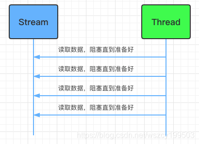

而一个NIO的实现会有所不同，下面是一个简单的例子：

```java
ByteBuffer buffer = ByteBuffer.allocate(48); 
int bytesRead = inChannel.read(buffer);
```

注意第二行，从通道读取字节到ByteBuffer。当这个方法调用返回时，你不知道你所需的所有数据是否在缓冲区内。你所知道的是，该缓冲区包含一些字节，这使得处理有点困难。

假设第一次 `read(buffer)` 调用后，读入缓冲区的数据只有半行，例如，“Name:An”，你能处理数据吗？显然不能，需要等待，直到整行数据读入缓存，在此之前，对数据的任何处理毫无意义。 

所以，你怎么知道是否该缓冲区包含足够的数据可以处理呢？好了，你不知道。发现的方法只能查看缓冲区中的数据。其结果是，在你知道所有数据都在缓冲区里之前，你必须检查几次缓冲区的数据。这不仅效率低下，而且可以使程序设计方案杂乱不堪。例如：

```java
ByteBuffer buffer = ByteBuffer.allocate(48);   
int bytesRead = inChannel.read(buffer);   
while(!bufferFull(bytesRead) ) {   
       bytesRead = inChannel.read(buffer);   
}
```

`bufferFull()` 方法必须跟踪有多少数据读入缓冲区，并返回真或假，这取决于缓冲区是否已满。换句话说，如果缓冲区准备好被处理，那么表示缓冲区满了。 

bufferFull() 方法扫描缓冲区，但必须保持在 bufferFull() 方法被调用之前状态相同。如果没有，下一个读入缓冲区的数据可能无法读到正确的位置。这是不可能的，但却是需要注意的又一问题。 如果缓冲区已满，它可以被处理。如果它不满，并且在你的实际案例中有意义，你或许能处理其中的部分数据。但是许多情况下并非如此。下图展示了“缓冲区数据循环就绪”： 

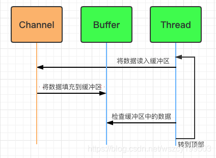

**设置处理线程数**

NIO 可只使用一个（或几个）单线程管理多个通道（网络连接或文件），但付出的代价是解析数据可能会比从一个阻塞流中读取数据更复杂。 

如果需要管理同时打开的成千上万个连接，这些连接每次只是发送少量的数据，例如聊天服务器，实现 NIO 的服务器可能是一个优势。同样，如果你需要维持许多打开的连接到其他计算机上，如P2P网络中，使用一个单独的线程来管理你所有出站连接，可能是一个优势。一个线程多个连接的设计方案如下图所示： 


 如果你有少量的连接使用非常高的带宽，一次发送大量的数据，也许典型的IO服务器实现可能非常契合。下图说明了一个典型的IO服务器设计： 


在Java1.4之前的I/O系统中，提供的都是面向流的I/O系统,系统一次一个字节地处理数据，一个输入流产生一个字节的数据，一个输出流消费一个字节的数据，面向流的I/O速度非常慢，而在Java 1.4中推出了NIO, 这是一个面向块的I/O系统，系统以块的方式处理处理,每一个操作在一步中产生或者消费一个数据库,按块处理要比按字节处理数据快的多。

# 2 Netty 与 NIO 之前世今生

## 2.1 Java NIO 三件套

在NIO中有几个核心对象需要掌握:缓冲区(Buffer)、通道(Channel) 、选择器(Selector)。

### 2.1.1 缓冲区 Buffer

#### Buffer 操作基本 API

缓冲区实际上是一个容器对象，更直接的说，其实就是一个数组，在NIO库中，所有数据都是用缓冲区处理的。在读取数据时，它是直接读到缓冲区中的;在写入数据时，它也是写入到缓冲区中的;任何时候访问NIO中的数据，都是将它放到缓冲区中。而在面向流I/O系统中，所有数据都是直接写入或者直接将数据读取到Stream对象中。 在NIO中,所有的缓冲区类型都继承于抽象类Buffer,最常用的就是ByteBuffer,对于Java 中的基本类型，基本都有一个具体Buffer类型与之相对应，它们之间的继承关系如下图所示: 

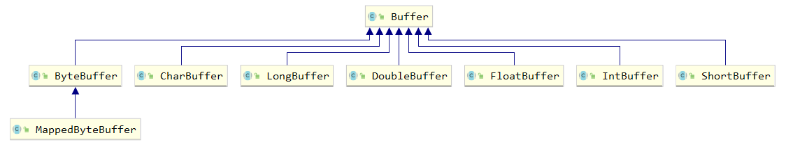

下面是一个简单的使用 IntBuffer 的例子：

```java
public class TestIntBuffer {
	public static void main(String[] args) {  
        // 分配新的int缓冲区，参数为缓冲区容量  
        // 新缓冲区的当前位置将为零，其界限(限制位置)将为其容量。它将具有一个底层实现数组，其数组偏移量将为零。  
        
		//分配了8个长度的int数组
		IntBuffer buffer = IntBuffer.allocate(8);  

        //capacity //数组的长度，容量
		
        for (int i = 0; i < buffer.capacity(); ++i) {  
            int j = 2 * (i + 1);
            // 将给定整数写入此缓冲区的当前位置，当前位置递增  
            buffer.put(j);  
        }  
  
        // 重设此缓冲区，将限制设置为当前位置，然后将当前位置设置为0
        //固定缓冲区中的某些值，告诉缓冲区，
        //我要开始操作了，如果你再往缓冲区写数据的话
        //不要再覆盖我固定状态以前的数据了
        buffer.flip();
  
        // 查看在当前位置和限制位置之间是否有元素  
        while (buffer.hasRemaining()) {  
            // 读取此缓冲区当前位置的整数，然后当前位置递增  
            int j = buffer.get();  
            System.out.print(j + "  ");  
        }
	}  
}
//2  4  6  8  10  12  14  16 
```

#### 深入剖析 Buffer

缓冲区对象本质上是一个数组，但它其实是一个特殊的数组，缓冲区对象内置了一些机制，能够跟踪和记录缓冲区的状态变化情况，如果使用 get() 方法从缓冲区获取数据或者使用 put() 方法把数据写入缓冲区，都会引起缓冲区状态的变化。 

在缓冲区中，最重要的三个属性，它们一起合作完成对缓冲区内部状态的变化跟踪： 

`position` 指定了下一个将要被写入或者读取的元素索引，它的值有get()/put()方法自动更新，在新创建一个Buffer对象时，position被初始化为0 

`limit` 指定还有多少数据需要取出（在从缓冲区写入通道时），或者还有多少空间可以放入数据（在从通道读入缓冲区时） 

`capacity` 指定了可以存储在缓冲区中的最大数据容量，实际上，它指定了底层数组的大小，或者至少是指定了准许我们使用的底层数组的容量

以上三个属性值之间有一些相对大小的关系: 0 &lt;= position &lt;= limit &lt;= capacity。 如果我们创建一个新的容量大小为10 的ByteBuffer对象,在初始化的时候,position设置为0,limit和capacity被设置为10，在以后使用ByteBuffer对象过程中，capacity 的值不会再发生变化，而其它两个个将会随着使用而变化。

下面我们用一段代码来验证 position、limit 和 capacity 这几个值的变化过程，代码如下：

```java
// test.txt
// Tom.
public class BufferProgram {
    public static void main(String[] args) throws IOException {
        // 文件IO处理
        FileInputStream fin = new FileInputStream("E:/test.txt");
        // 创建文件的操作管道
        // FileChannel无法设置为非阻塞模式，它总是运行在阻塞模式下
        FileChannel fc = fin.getChannel();

        // 分配一个10个大小缓冲区，就是分配一个10个大小的byte数组
        ByteBuffer buffer = ByteBuffer.allocate(10);
        output("初始化", buffer);

        // 先读一下
        fc.read(buffer);
        output("调用read()", buffer);

        // 准备操作之前，先锁定操作范围
        buffer.flip();
        output("调用flip()", buffer);

        //判断有没有可读数据
        while (buffer.remaining() > 0) {
            byte b = buffer.get();
            // System.out.print(((char)b));
        }
        output("调用get()", buffer);

        //可以理解为解锁
        buffer.clear();
        output("调用clear()", buffer);

        //最后把管道关闭
        fin.close();
    }

    //把这个缓冲里面实时状态给答应出来
    public static void output(String step, Buffer buffer) {
        System.out.println(step + " : ");
        //容量，数组大小
        System.out.print("capacity: " + buffer.capacity() + ", ");
        //当前操作数据所在的位置，也可以叫做游标
        System.out.print("position: " + buffer.position() + ", ");
        //锁定值，flip，数据操作范围索引只能在position - limit 之间
        System.out.println("limit: " + buffer.limit());
        System.out.println();
    }
}
```

四个属性值分别如图所示：

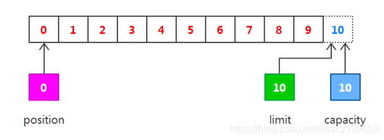

现在可以从通道中读取一些数据到缓冲区中，注意从通道读取数据，相当于往缓冲区中写入数据。如果读取4个自已的数据，则此时position的值为4,即下一个将要被写入的字节索引为4,而limit仍然是10,如下图所示： 

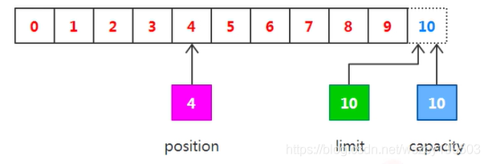

下一步把读取的数据写入到输出通道中，相当于从缓冲区中读取数据，在此之前，必须调用 flip() 方法，该方法完成两件事：

1. 把 limit 设置为当前的 position 值 
2. 把 position 设置为0

由于 position 被设置为0,所以可以保证在下一步输出时读取到的是缓冲区中的第一个字节,而 limit 被设置为当前的 position ,可以保证读取的数据正好是之前写入到缓冲区中的数据，如下图所示： 

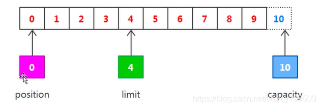

现在调用 get() 方法从缓冲区中读取数据写入到输出通道，这会导致 position 的增加而 limit 保持不变，但position 不会超过limit 的值，所以在读取我们之前写入到缓冲区中的4个自己之后，position和limit 的值都为4,如下图所示： 

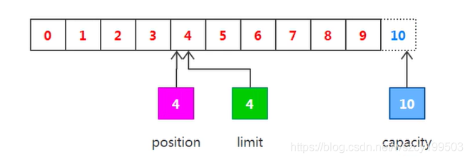

在从缓冲区读取数据完毕后，limit 的值仍然保持在调用flip()方法时的值，调用 clear()方法能够把所有的状态变化设置为初始化时的值，如图： 

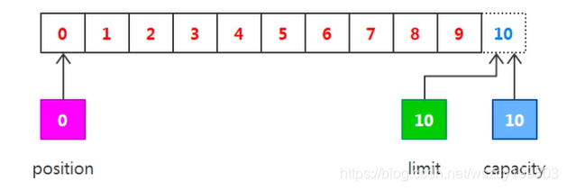

#### 缓冲区的分配

在创建一个缓冲区对象时，会调用静态方法 allocate() 来指定缓冲区的容量，其实调用 allocate() 相当于创建了一个指定大小的数组，并把它包装为缓冲区对象。或者也可以直接将一个现有的数组，包装为缓冲区对象，如下示例代码所示：

```java
public class BufferWrap {
    public void myMethod() {
        // 分配指定大小的缓冲区
        ByteBuffer buffer1 = ByteBuffer.allocate(10);

        // 包装一个现有数组
        byte array[] = new byte[10];
        ByteBuffer buffer2 = ByteBuffer.wrap(array);
    }
}
```

#### 缓冲区分片

在NIO中，除了可以分配或者包装一个缓冲区对象外，还可以根据现有的缓冲区对象来创建一个子缓冲区，即在现有缓冲区上切出一片来作为一个新的缓冲区，但现有的缓冲区与创建的子缓冲区在底层数组层面上是数据共享的，也就是说，`子缓冲区相当于是现有缓冲区的一个视图窗口`。调用 slice() 方法可以创建一个子缓冲区，让通过例子来看一下：

```java
public class BufferSlice {
    public static void main(String[] args) {
        ByteBuffer buffer = ByteBuffer.allocate(10);

        // 缓冲区的数据
        for (int i = 0; i < buffer.capacity(); ++i) {
            buffer.put((byte) i);
        }

        // 创建子缓冲区
        buffer.position(3);
        buffer.limit(7);
        ByteBuffer slice = buffer.slice();

        // 改变子缓冲区的内容
        for (int i = 0; i < slice.capacity(); ++i) {
            byte b = slice.get(i);
            b *= 10;
            slice.put(i, b);
        }

        buffer.position(0);
        buffer.limit(buffer.capacity());

        while (buffer.remaining() > 0) {
            System.out.println(buffer.get());
        }
    }
}
```

在该示例中，分配了一个容量大小为10的缓冲区，并在其中放入了数据0-9，而在该缓冲区基础之上又创建了一个子缓冲区，并改变子缓冲区中的内容，从最后输出的结果来看，只有子缓冲区“可见的”那部分数据发生了变化，并且说明子缓冲区与原缓冲区是数据共享的。

#### 只读缓冲区

只读缓冲区非常简单，可以读取它们，但是不能向它们写入数据。可以通过调用缓冲区的 asReadOnlyBuffer() 方法，将任何常规缓冲区转换为只读缓冲区，这个方法返回一个与原缓冲区完全相同的缓冲区，并与原缓冲区共享数据，只不过它是只读的。如果原缓冲区的内容发生了变化，只读缓冲区的内容也随之发生变化：

```java
public class ReadAbleBuffer {
    public static void main(String[] args) {
        ByteBuffer buffer = ByteBuffer.allocate(10);
        for (int i = 0; i < buffer.capacity(); ++i) {
            buffer.put((byte) i);
        }
        // 创建只读缓冲区
        ByteBuffer readonly = buffer.asReadOnlyBuffer();

        // 改变子缓冲区的内容
        for (int i = 0; i < buffer.capacity(); ++i) {
            byte b = buffer.get(i);
            b *= 10;
            buffer.put(i, b);
        }

        readonly.position(0);
        readonly.limit(buffer.capacity());

        while (readonly.remaining() > 0) {
            System.out.println(readonly.get());
        }
    }
}
```

如果尝试修改只读缓冲区的内容，则会报ReadOnlyBufferException异常。只读缓冲区对于保护数据很有用。在将缓冲区传递给某个对象的方法时，无法知道这个方法是否会修改缓冲区中的数据。创建一个只读的缓冲区可以保证该缓冲区不会被修改。只可以把常规缓冲区转换为只读缓冲区，而不能将只读的缓冲区转换为可写的缓冲区。

#### 直接缓冲区

直接缓冲区是为加快I/O速度，使用一种特殊方式为其分配内存的缓冲区，JDK 文档中的描述为:给定一个直接字节缓冲区，Java虚取机将尽最大努力直接对它执行本机I/O操作。也就是说，它会在每一次调用底层操作系统的本机I/O操作之前(或之后),尝试避免将缓冲区的内容拷贝到一个中间缓冲区中或者从一个中间缓冲区中拷贝数据。要分配直接缓冲区，需要调用allocateDirect()方法，而不是allocate()方法，使用方式与普通缓冲区并无区别，如下面的拷贝文件示例：

```java
public class DirectBuffer {  
    static public void main( String args[] ) throws Exception {
        String infile = "E:/info.txt";
        FileInputStream fin = new FileInputStream( infile );  
        FileChannel fcin = fin.getChannel();  
          
        //把刚刚读取的内容写入到一个新的文件中
        String outfile = String.format("E:/infocopy.txt");
        FileOutputStream fout = new FileOutputStream( outfile );      
        FileChannel fcout = fout.getChannel();  
          
        // 使用allocateDirect，而不是allocate
        ByteBuffer buffer = ByteBuffer.allocateDirect(1024);  
          
        while (true) {  
            buffer.clear();  
              
            int r = fcin.read(buffer);  
              
            if (r==-1) {  
                break;  
            }  
              
            buffer.flip();  
              
            fcout.write(buffer);  
        }
	}  
}
```

#### 内存映射

内存映射是一个读和写文件数据的方法，它可以比常规的基于流或者基于通道的 I/O 快的多。内存映射文件 I/O 是通过使文件中的数据出现为内存数组的内容来完成的，这起初听起来似乎不过就是将整个文件读到内存中，但事实上并不是这样。一般来说，只有文件中实际读取或者写入的部分才会映射到内存中：

```java
public class MapperBuffer {
    public static void main(String[] args) throws IOException {
        RandomAccessFile raf = new RandomAccessFile("E:\\info.txt", "rw");
        FileChannel fc = raf.getChannel();

        MappedByteBuffer mbb = fc.map(FileChannel.MapMode.READ_WRITE, 0, 1024);
        // 在内存的修改，会直接持久到硬盘文件中
        mbb.put(0, (byte)97);
        mbb.put(1023, (byte)122);

        raf.close();
    }
}
```

### 2.1.2 选择器 Selector

传统的Server/Client模式会基于TPR (Thread per Request) , 服务器会为每个客户端请求建立一个线程，由该线程单独负责处理一个客户请求。这种模式带来的一个问题就是线程数量的剧增，大量的线程会增大服务器的开销。大多数的实现为了避免这个问题，都采用了线程池模型，并设置线程池线程的最大数量，这又带来了新的问题，如果线程池中有200个线程，而有200个用户都在进行大文件下载，会导致第201个用户的请求无法及时处理，即便第201个用户只想请求一个几KB大小的页面。传统的Server/Client模式如下图所示： 

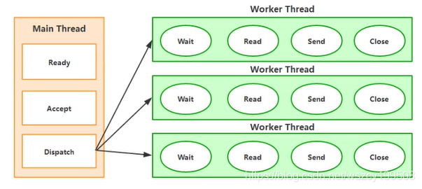

NIO中非阻塞I/O采用了基于Reactor模式的工作方式，I/O调用不会被阻塞，相反是注册感兴趣的特定I/O事件，如可读数据到达，新的套接字连接等等，在发生特定事件时，系统再通知我们。NIO 中实现非阻塞I/O的核心对象就是Selector, Selector就是注册各种I/O事件地方，而且当那些事件发生时，就是这个对象告诉我们所发生的事件，如下图所示：

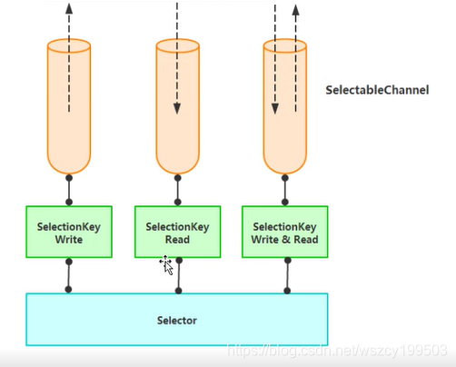

从图中可以看出，当有读或写等任何注册的事件发生时，可以从Selector中获得相应的 `SelectionKey`，同时从SelectionKey 中可以找到发生的事件和该事件所发生的具体的 SelectableChannel,以获得客户端发送过来的数据。 使用NIO中非阻塞I/O编写服务器处理程序，大体上可以分为下面三个步骤：

1. 向Selector对象注册感兴趣的事件 
2. 从Selector中获取感兴趣的事件 
3. 根据不同的事件进行相应的处理

首先是向Selector对象注册感兴趣的事件：

```java
/**
 * 注册事件
 */
private Selector getSelector() throws IOException {
    // 创建 Selector 对象
    Selector sel = Selector.open();
    // 创建可选择通道，并配置为非阻塞模式
    ServerSocketChannel server = ServerSocketChannel.open();
    server.configureBlocking(false);
    // 绑定通道到指定端口
    ServerSocket socket = server.socket();
    InetSocketAddress address = new InetSocketAddress(8080);
    socket.bind(address);
    // 向 Selector 中注册感兴趣事件
    server.register(sel, SelectionKey.OP_ACCEPT);
    return sel;
}
```

创建了ServerSocketChannel对象，并调用configureBlocking()方法，配置为非阻塞模式，接下来的三行代码把该通道绑定到指定端口,最后向Selector中注册事件,此处指定的是参数是`OP_ACCEPT`,即指定我们想要监听accept事件,也就是新的连接发生时所产生的事件,对于ServerSocketChannel通道来说，我们唯一可以指定的参数就是OP_ACCEPT。

从Selector中获取感兴趣的事件，即开始监听，进入内部循环：

```java
public void listener() throws IOException{
	while(true) {
		// 该调用会阻塞，直到至少有一个事件发生
		selector.select();
        Set<SelectionKey> keys = selector.selectedKeys();
        Iterator<SelectionKey> iterator = keys.iterator();
        while(iterator.hasNext()) {
			SelectionKey key = (SelectionKey) iterator.next();
			iterator.remove();
			process(key);
        }
    }
}
```

在非阻塞I/O中，内部循环模式基本都是遵循这种方式。首先调用select()方法，该方法会阻塞，直到至少有一个事件发生，然后再使用selectedKeys()方法获取发生事件的SelectionKey,再使用迭代器进行循环。

最后一步就是根据不同的事件，编写相应的处理代码：

```java
/**
* 根据不同的事件做处理
**/
public void process(SelectionKey key) throws IOException {
		// 接受请求
        if(key.isAcceptable()){
        	ServerSocketChannel server = (ServerSocketChannel)key.channel();
            SocketChannel client = server.accept();
            client.configureBlocking(false);
            client.register(selector, SelectionKey.OP_READ);
        }
        // 读信息
        if(key.isReadable()){
            //返回该SelectionKey对应的 Channel，其中有数据需要读取
            SocketChannel channel= (SocketChannel)key.channel(); 
            int len = channel.read(buffer);
            if (len > 0) {
            	buffer.flip();
            	name = new String(buffer.array(), 0 ,len);
            	SelectionKey sKey = channel.register(selector, SelectionKey.OP_WRITE);
            	sKey.attach(name);
            } else {
				channel.close();
			}
			buffer.clear();
        }
        // 写事件
        if (key.isWritable()) {
			SocketChannel channel= (SocketChannel)key.channel(); 
			String name = (String) key.attachment()l
			ByteBuffer block = ByteBuffer.wrap(("Hello " + name).getBytes());
			if (block != null) {
				channel.write(block);
			} else {
				channle.close();
			}
		}
    }
```

此处分别判断是接受请求、读数据还是写事件，分别作不同的处理。在 Java1.4 之前的 I/O 系统中，提供的都是面向流的 I/O 系统，系统一次一个字节地处理数据，一个输入流产生一个字节的数据，一个输出流消费一个字节的数据，面向流的 I/O 速度非常慢，而在 Java 1.4 中推出了 NIO，这是一个面向块的 I/O 系统，系统以块的方式处理处理，每一个操作在 一步中产生或者消费一个数据库，按块处理要比按字节处理数据快的多。

### 2.2.3 通道 Channel

通道是一个对象，通过它可以读取和写入数据，当然了所有数据都通过Buffer对象来处理。永远不会将字节直接写入通道中，相反是将数据写入包含一个或多个字节的缓冲区。同样不会直接从通道中读取字节，而是将数据从通道读入缓冲区，再从缓冲区获取这个字节。

在 NIO 中，提供了多种通道对象，而所有的通道对象都实现了 Channel 接口。继承关系如下： 

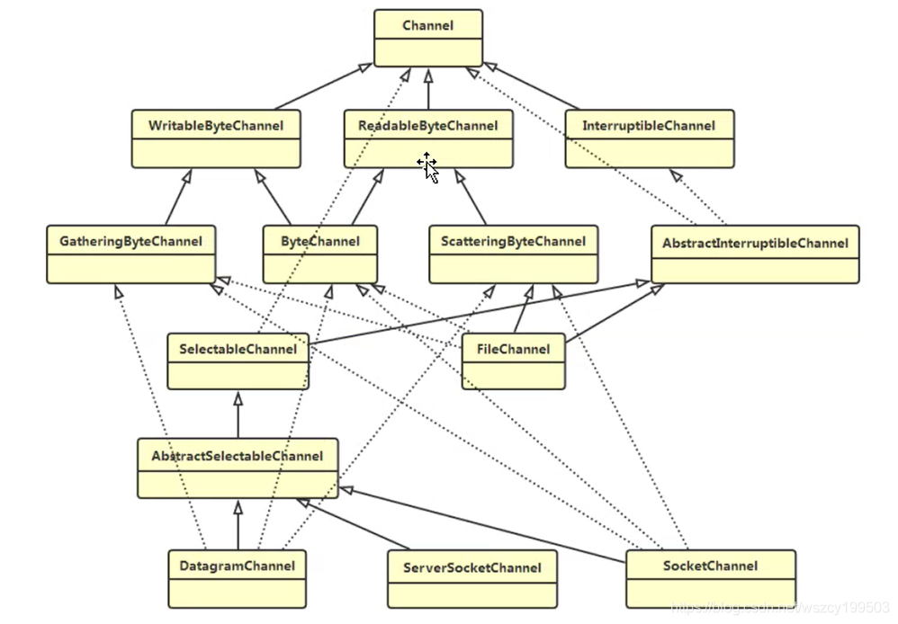

#### 使用 NIO 读取数据

使用NIO任何时候读取数据，都不是直接从通道读取，而是从通道读取到缓冲区。.所以使用NI0读取数据可以分为下面三个步骤：

1. 从FileInputStream获取Channel 
2. 创建Buffer 
3. 将数据从Channel读取到Buffer中 

下面是一个简单的使用 NIO 从文件中读取数据的例子：

```java
public class FileInputProgram {
    public static void main(String[] args) throws IOException {
        FileInputStream fin = new FileInputStream("E:\\info.txt");

        // 获取通道
        FileChannel fc = fin.getChannel();
        // 创建缓冲区
        ByteBuffer buffer = ByteBuffer.allocate(1024);
        // 读取数据到缓冲区
        fc.read(buffer);

        buffer.flip();

        while (buffer.remaining() > 0) {
            byte b = buffer.get();
            System.out.println((char) b);
        }

        fin.close();
    }
}
```

#### 使用 NIO 写入数据

使用NIO写入数据与读取数据的过程类似，同样数据不是直接写入通道，而是写入缓冲区，可以分为下面三个步骤:

1. 从FileInputStream获取Channel 
2. 创建Buffer 
3. 将数据从Channel写入到Buffer中 下面是一个简单的使用NIO向文件中写入数据的例子：

```java
public class FileOutputProgram {
    static private final byte message[] = {83, 111, 109, 101, 32, 98, 121, 116, 101, 115, 46};
    public static void main(String[] args) throws IOException {
        FileOutputStream fout = new FileOutputStream("E:\\info.txt");
        FileChannel fc = fout.getChannel();
        ByteBuffer buffer = ByteBuffer.allocate(1024);
        for (int i = 0; i < message.length; ++i) {
            buffer.put(message[i]);
        }
        buffer.flip();
        fc.write(buffer);
        fout.close();
    }
}
```

#### IO 多路复用

我们试想一下这样的现实场景：

一个餐厅同时有 100 位客人到店，当然到店后第一件要做的事情就是点菜。但是问题来了，餐厅老板为了节约人 力成本目前只有一位大堂服务员拿着唯一的一本菜单等待客人进行服务。

那么最笨（但是最简单）的方法是（方法 A），无论有多少客人等待点餐，服务员都把仅有的一份菜单递给其中 一位客人，然后站在客人身旁等待这个客人完成点菜过程。在记录客人点菜内容后，把点菜记录交给后堂厨师。然后 是第二位客人。。。。然后是第三位客人。很明显，只有脑袋被门夹过的老板，才会这样设置服务流程。因为随后的 80 位客人，再等待超时后就会离店（还会给差评）。

于是还有一种办法（方法 B），老板马上新雇佣 99 名服务员，同时印制 99 本新的菜单。每一名服务员手持一本 菜单负责一位客人（关键不只在于服务员，还在于菜单。因为没有菜单客人也无法点菜）。在客人点完菜后，记录点菜内容交给后堂厨师（当然为了更高效，后堂厨师最好也有 100 名）。这样每一位客人享受的就是 VIP 服务咯，当然客人不会走，但是人力成本可是一个大头哦（亏死你）。

另外一种办法（方法 C），就是改进点菜的方式，当客人到店后，自己申请一本菜单。想好自己要点的才后，就 呼叫服务员。服务员站在自己身边后记录客人的菜单内容。将菜单递给厨师的过程也要进行改进，并不是每一份菜单记录好以后，都要交给后堂厨师。服务员可以记录好多份菜单后，同时交给厨师就行了。那么这种方式，对于老板来说人力成本是最低的；对于客人来说，虽然不再享受 VIP 服务并且要进行一定的等待，但是这些都是可接受的；对于服务员来说，基本上她的时间都没有浪费，基本上被老板压杆了最后一滴油水。

到店情况：并发量。到店情况不理想时，一个服务员一本菜单，当然是足够了。所以不同的老板在不同的场合下， 将会灵活选择服务员和菜单的配置。 

客人：客户端请求 

点餐内容：客户端发送的实际数据 

老板：操作系统 

人力成本：系统资源 

菜单：文件状态描述符（FD）。操作系统对于一个进程能够同时持有的文件状态描述符的个数是有限制的，在 linux 系统中$ulimit -n 查看这个限制值，当然也是可以（并且应该）进行内核参数调整的。

服务员：操作系统内核用于 IO 操作的线程（内核线程） 

厨师：应用程序线程（当然厨房就是应用程序进程咯） 

方法 A：同步 IO 

方法 B：同步 IO 

方法 C：多路复用 IO 

目前流行的多路复用 IO 实现主要包括四种：select、poll、epoll、kqueue。下表是他们的一些重要特性的比较：

| IO模型 | 相对性能 | 关键思路         | 操作系统      | JAVA支持                                                     |
| ------ | -------- | ---------------- | ------------- | ------------------------------------------------------------ |
| select | 较高     | Reactor          | windows/Linux | 支持,Reactor 模式(反应器设计模式)。Linux 操作 系统的 kernels 2.4 内核版本之前，默认使用 select；而目前 windows 下对同步 IO 的支持，都 是 select 模型。 |
| poll   | 较高     | Reactor          | Linux         | Linux 下的 JAVA NIO 框架，Linux kernels 2.6 内 核版本之前使用 poll 进行支持。也是使用的 Reactor 模式。 |
| epoll  | 高       | Reactor/Proactor | Linux         | Linux kernels 2.6 内核版本及以后使用 epoll 进行 支持；Linux kernels 2.6 内核版本之前使用 poll 进行支持；另外一定注意，由于 Linux 下没有 Windows 下的 IOCP 技术提供真正的 异步 IO 支 持，所以 Linux 下使用 epoll 模拟异步 IO。 |
| kqueue | 高       | Proactor         | Linux         | 目前 JAVA 的版本不支持。                                     |

多路复用 IO 技术最适用的是“高并发”场景，所谓高并发是指 1 毫秒内至少同时有上千个连接请求准备好。其他情 况下多路复用 IO 技术发挥不出来它的优势。另一方面，使用 JAVA NIO 进行功能实现，相对于传统的 Socket 套接字实现要复杂一些，所以实际应用中，需要根据自己的业务需求进行技术选择。     

## 2.2 NIO 源码初探

说到源码先得从 Selector 的 open 方法开始看起 `java.nio.channels.Selector`：

```java
public static Selector open() throws IOException {
    return SelectorProvider.provider().openSelector();
}
```

看看 SelectorProvider.provider()做了什么：

```java
public static SelectorProvider provider() {
    synchronized (lock) {
        if (provider != null)
            return provider;
        return AccessController.doPrivileged(
            new PrivilegedAction<SelectorProvider>() {
                public SelectorProvider run() {
                        if (loadProviderFromProperty())
                            return provider;
                        if (loadProviderAsService())
                            return provider;
                        provider = sun.nio.ch.DefaultSelectorProvider.create();
                        return provider;
                    }
                });
    }
}
```

其中 `provider = sun.nio.ch.DefaultSelectorProvider.create();` 会根据操作系统来返回不同的实现类，windows 平台就返回 `WindowsSelectorProvider`；

而 if (provider != null) return provider; 保证了整个 server 程序中只有一个 WindowsSelectorProvider 对象； 

再看看 WindowsSelectorProvider. openSelector():

```java
public AbstractSelector openSelector() throws IOException {
    return new WindowsSelectorImpl(this);
}
```

new WindowsSelectorImpl(SelectorProvider) 代码：

```java
WindowsSelectorImpl(SelectorProvider sp) throws IOException {
    super(sp);
    pollWrapper = new PollArrayWrapper(INIT_CAP);
    wakeupPipe = Pipe.open();
    wakeupSourceFd = ((SelChImpl)wakeupPipe.source()).getFDVal();
    // Disable the Nagle algorithm so that the wakeup is more immediate
    SinkChannelImpl sink = (SinkChannelImpl)wakeupPipe.sink();
    (sink.sc).socket().setTcpNoDelay(true);
    wakeupSinkFd = ((SelChImpl)sink).getFDVal();
    pollWrapper.addWakeupSocket(wakeupSourceFd, 0);
}
```

其中 Pipe.open()是关键，这个方法的调用过程是： 

```java
public static Pipe open() throws IOException {
    return SelectorProvider.provider().openPipe();
}
```

SelectorProvider 中： 

```java
public Pipe openPipe() throws IOException { 
    return new PipeImpl(this); 
}
```

再看看怎么 new PipeImpl()的： 

```java
PipeImpl(SelectorProvider sp) {
    long pipeFds = IOUtil.makePipe(true);
    int readFd = (int) (pipeFds >>> 32);
    int writeFd = (int) pipeFds;
    FileDescriptor sourcefd = new FileDescriptor();
    IOUtil.setfdVal(sourcefd, readFd);
    source = new SourceChannelImpl(sp, sourcefd);
    FileDescriptor sinkfd = new FileDescriptor();
    IOUtil.setfdVal(sinkfd, writeFd);
    sink = new SinkChannelImpl(sp, sinkfd);
}
```

其中 IOUtil.makePipe(true)是个 native 方法： 

```java
/** 
* Returns two file descriptors for a pipe encoded in a long. 
* The read end of the pipe is returned in the high 32 bits, 
* while the write end is returned in the low 32 bits. 
*/ 
staticnativelong makePipe(boolean blocking);
```

High32 位存放的是通道 read 端的文件描述符 FD（file descriptor），low 32 bits 存放的是 write 端的文件描述符。所以取到 makepipe() 返回值后要做移位处理。

```java
pollWrapper.addWakeupSocket(wakeupSourceFd, 0); 
```

这行代码把返回的 pipe 的 write 端的 FD 放在了 pollWrapper 中（后面会发现，这么做是为了实现 selector 的 wakeup()） 

ServerSocketChannel.open()的实现：

```java
public static ServerSocketChannel open() throws IOException {
    return SelectorProvider.provider().openServerSocketChannel();
}
```

SelectorProvider：

```java
public ServerSocketChannel openServerSocketChannel() throws IOException {
    return new ServerSocketChannelImpl(this);
}
```

可见创建的 ServerSocketChannelImpl 也有 WindowsSelectorImpl 的引用。

```java
public ServerSocketChannelImpl(SelectorProvider sp) throws IOException {
	super(sp);
	this.fd = Net.serverSocket(true);
	this.fdVal = IOUtil.fdVal(fd);
	this.state = ST_INUSE;
}
```

然后通过 `server.register(selector, SelectionKey.OP_ACCEPT);` 把 selector 和 channel 绑定在一起，也就是把 new ServerSocketChannel 时创建的 FD 与 selector 绑定在了一起。 

到此，server 端已启动完成了，主要创建了以下对象： 

WindowsSelectorProvider：单例 

WindowsSelectorImpl 中包含： 

​	pollWrapper：保存 selector 上注册的 FD，包括 pipe 的 write 端 FD 和 ServerSocketChannel 所用的 FD 

​	wakeupPipe：通道（其实就是两个 FD，一个 read，一个 write） 

再到 Server 中的 run(): 

​	selector.select(); 主要调用了 WindowsSelectorImpl 中的这个方法：

```java
protected int doSelect(long timeout) throws IOException {
	if (channelArray == null)
		throw new ClosedSelectorException();
	this.timeout = timeout; // set selector timeout
	processDeregisterQueue();
	if (interruptTriggered) {
		resetWakeupSocket();
		return 0;
	}
	// Calculate number of helper threads needed for poll. If necessary
	// threads are created here and start waiting on startLock
	adjustThreadsCount();
	finishLock.reset(); // reset finishLock
	// Wakeup helper threads, waiting on startLock, so they start polling.
	// Redundant threads will exit here after wakeup.
	startLock.startThreads();
	// do polling in the main thread. Main thread is responsible for
	// first MAX_SELECTABLE_FDS entries in pollArray.
	try {
		begin();
		try {
			subSelector.poll();
		} catch (IOException e) {
			finishLock.setException(e); // Save this exception
		}
		// Main thread is out of poll(). Wakeup others and wait for them
		if (threads.size() > 0)
			finishLock.waitForHelperThreads();
	} finally {
		end();
	}
	// Done with poll(). Set wakeupSocket to nonsignaled for the next run.
	finishLock.checkForException();
	processDeregisterQueue();
	int updated = updateSelectedKeys();
	// Done with poll(). Set wakeupSocket to nonsignaled for the next run.
	resetWakeupSocket();
	return updated;
}
```

其中 subSelector.poll()是核心，也就是轮训 pollWrapper 中保存的 FD；具体实现是调用 native 方法 poll0：

```java
private int poll() throws IOException{ // poll for the main thread
	return poll0(pollWrapper.pollArrayAddress,
		Math.min(totalChannels, MAX_SELECTABLE_FDS),
		readFds, writeFds, exceptFds, timeout);
}
private native int poll0(long pollAddress, int numfds, int[] readFds, int[] writeFds, int[] exceptFds, long timeout);
// These arrays will hold result of native select().
// The first element of each array is the number of selected sockets.
// Other elements are file descriptors of selected sockets.
private final int[] readFds = new int [MAX_SELECTABLE_FDS + 1];//保存发生 read 的 FD
private final int[] writeFds = new int [MAX_SELECTABLE_FDS + 1]; //保存发生 write 的 FD
private final int[] exceptFds = new int [MAX_SELECTABLE_FDS + 1]; //保存发生 except 的 FD
```

这个 poll0() 会监听 pollWrapper 中的 FD 有没有数据进出，这会造成 IO 阻塞，直到有数据读写事件发生。比如，由于 pollWrapper 中保存的也有 ServerSocketChannel 的 FD，所以只要 ClientSocket 发一份数据到 ServerSocket,那么 poll0() 就会返回；又由于 pollWrapper 中保存的也有 pipe 的 write 端的 FD，所以只要 pipe 的 write 端向 FD 发一份数据，也会造成 poll0() 返回；如果这两种情况都没有发生，那么 poll0() 就一直阻塞，也就是 selector.select()会一直阻塞；如果有任何一种情况发生，那么 selector.select()就会返回，所有在 OperationServer 的 run()里要用 while (true) {，这样就可以保证在 selector 接收到数据并处理完后继续监听 poll(); 

这时再来看看 WindowsSelectorImpl. Wakeup():

```java
public Selector wakeup() {
	synchronized (interruptLock) {
		if (!interruptTriggered) {
			setWakeupSocket();
			interruptTriggered = true;
		}
	}
	return this;
}
// Sets Windows wakeup socket to a signaled state.
private void setWakeupSocket() {
	setWakeupSocket0(wakeupSinkFd);
}
private native void setWakeupSocket0(int wakeupSinkFd);
	JNIEXPORT void JNICALL
	Java_sun_nio_ch_WindowsSelectorImpl_setWakeupSocket0(JNIEnv *env, jclass this, jint scoutFd)
	{
		/* Write one byte into the pipe */
		const char byte = 1;
		send(scoutFd, &byte, 1, 0);
	}
```

可见 wakeup()是通过 pipe 的 write 端 send(scoutFd, &byte, 1, 0)，发送一个字节 1，来唤醒 poll()。所以在需要的时候就可以调用 selector.wakeup()来唤醒 selector。

## 2.3 反应堆 Reactor

现在对阻塞 I/O 已有了一定了解，我们知道阻塞 I/O 在调用InputStream. read()方法时是阻塞的，它会一直等到数据到来时(或超时)才会返回;同样，在调用ServerSocket. accept()方法时，也会一直阻塞到有客户端连接才会返回，每个客户端连接过来后,服务端都会启动一个线程去处理该客户端的请求。阻塞 I/O 的通信模型示意图如下： 

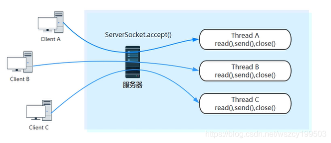

根据阻塞 I/O 通信模型，总结了阻塞 I/O 的两点缺点：

1. 当客户端多时，会创建大量的处理线程。且每个线程都要占用栈空间和一些CPU时间 
2. 阻塞可能带来频繁的上下文切换，且大部分上下文切换可能是无意义的。这种情况下非阻塞式 I/O 就有了应用前景。

Java NIO是在jdk1.4开始使用的(JAVA NIO就是采用多路复用IO模式)，它既可以说成“新 I/O ”，也可以说成非阻塞式 I/O。 下面是Java NIO 的工作原理：


1. 由一个专门的线程来处理所有的IO事件，并负责分发。 
2. 事件驱动机制：事件到的时候触发，而不是同步的去监视事件。 
3. 线程通讯：线程之间通过wait,notify 等方式通讯。保证每次上下文切换都是有意义的。减少无谓的线程切换。 

下面贴出我理解的Java NIO 的工作原理图： 

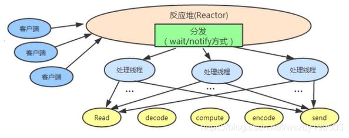

（注：每个线程的处理流程大概都是读取数据、解码、计算处理、编码、发送响应。）

## 2.4 Netty 与 NIO 

### 2.4.1 Netty 支持的功能与特性

按照定义来说，Netty 是一个异步、事件驱动的用来做高性能、高可靠性的网络应用框架。主要的优点有： 

1. 框架设计优雅，底层模型随意切换适应不同的网络协议要求。 
2. 提供很多标准的协议、安全、编码解码的支持。 
3. 解决了很多 NIO 不易用的问题。 
4. 社区更为活跃，在很多开源框架中使用，如 Dubbo、RocketMQ、Spark 等。 

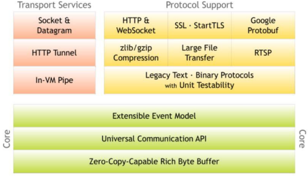

上图体现的主要是 Netty 支持的功能或者特性： 

1. 底层核心有：Zero-Copy-Capable Buffer，非常易用的灵拷贝 Buffer（这个内容很有意思，稍后专门来说）；统一的 API；标准可扩展的时间模型 

2. 传输方面的支持有：管道通信（具体不知道干啥的，还请老司机指教）；Http 隧道；TCP 与 UDP 

3. 协议方面的支持有：基于原始文本和二进制的协议；解压缩；大文件传输；流媒体传输；protobuf 编解码；安全认 证；http 和 websocket

### 2.4.2 Netty 采用 NIO 而非 AIO 的理由 

1. Netty 不看重 Windows 上的使用，在 Linux 系统上，AIO 的底层实现仍使用 EPOLL，没有很好实现 AIO，因此在性能上没有明显的优势，而且被 JDK 封装了一层不容易深度优化 

2. Netty 整体架构是 reactor 模型, 而 AIO 是 proactor 模型, 混合在一起会非常混乱,把 AIO 也改造成 reactor 模型看起来是把 epoll 绕个弯又绕回来 

3. AIO还有个缺点是接收数据需要预先分配缓存, 而不是NIO那种需要接收时才需要分配缓存, 所以对连接数量非常大但流量小的情况, 内存浪费很多 

4. Linux 上 AIO 不够成熟，处理回调结果速度跟不到处理需求，比如外卖员太少，顾客太多，供不应求，造成处理速度有瓶颈（待验证）

------

