1 背景介绍

1.1 Netty 惊人的性能数据

Netty是一个高性能、异步事件驱动的 NIO 框架，它提供了对 TCP、UDP 和文件传输的支持，`作为一个异步 NIO框架，Netty 的所有 IO 操作都是异步非阻塞的`，通过Future-Listener机制，用户可以方便的主动获取或者通过通知机制获得IO操作结果。 作为当前最流行的NIO框架，Netty 在互联网领域、大数据分布式计算领域、游戏行业、通信行业等获得了广泛的应用，一些业界著名的开源组件也基于Netty的NIO框架构建。

通过使用 Netty（NIO 框架）相比于传统基于 Java 序列化+BIO（同步阻塞 IO）的通信框架，性能提升了 8 倍多。事实上，通过选择合适的 NIO 框架，精心的设计 Reactor 线程模型，达到上述性能指标是完全有可能的。

1.2 传统 RPC 调用性能差的三宗罪

**网络传输方式问题**

传统的 RPC 框架或者基于 RMI 等方式的远程服务(过程)调用采用了同步阻塞IO，当客户端的并发压力或者网络时延增大之后，同步阻塞 IO 会由于频繁的 wait 导致 IO 线程经常性的阻塞，由于线程无法高效的工作，IO 处理能力自然下降。 下面，我们通过BIO通信模型图看下BIO通信的弊端：

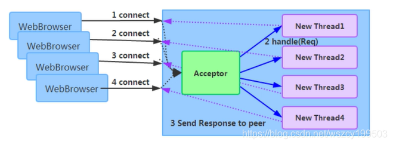

采用 BIO 通信模型的服务端，通常由一个独立的Acceptor线程负责监听客户端的连接，接收到客户端连接之后为客户端连接创建一个新的线程处理请求消息，处理完成之后，返回应答消息给客户端，线程销毁，这就是典型的`一请求一应答模型`。该架构最大的问题就是不具备弹性伸缩能力，当并发访问量增加后，服务端的线程个数和并发访问数成线性正比，由于线程是JAVA虚拟机非常宝贵的系统资源，当线程数膨胀之后，系统的性能急剧下降，随着并发量的继续增加，可能会发生句柄溢出、线程堆栈溢出等问题，并导致服务器最终宕机。 

**序列化方式问题**

Java 序列化存在如下几个典型问题：

1. Java 序列化机制是Java内部的一种对象编解码技术，无法跨语言使用;例如对于异构系统之间的对接，Java序列化后的码流需要能够通过其它语言反序列化成原始对象(副本),目前很难支持; 
2. 相比于其它开源的序列化框架，Java序列化后的码流太大，无论是网络传输还是持久化到磁盘，都会导致额外的资源占用; 
3. 序列化性能差(CPU资源占用高)。

**线程模型问题**

由于采用同步阻塞IO，这会导致每个TCP连接都占用1个线程，由于线程资源是JVM虚拟机非常宝贵的资源，当IO读写阻塞导致线程无法及时释放时，会导致系统性能急剧下降，严重的甚至会导致虚拟机无法创建新的线程。

1.3 高性能的三个主题

`传输` 用什么样的通道将数据发送给对方, BIO、NIO或者AIO, IO模型在很大程度上决定了框架的性能。 

`协议` 采用什么样的通信协议，HTTP或者内部私有协议。协议的选择不同，性能模型也不同。相比于公有协议，内部私有协议的性能通常可以被设计的更优。 

`线程` 数据报如何读取？读取之后的编解码在哪个线程进行，编解码后的消息如何派发，Reactor 线程模型的不同，对性能的影响也非常大。

2 Netty 高性能之道

2.1 异步非阻塞通信

在IO编程过程中，当需要同时处理多个客户端接入请求时，可以利用多线程或者IO多路复用技术进行处理。IO多路复用技术通过把多个IO的阻塞复用到同一个select的阻塞上，从而使得系统在单线程的情况下可以同时处理多个客户端请求。与传统的多线程/多进程模型比，I/O多路复用的最大优势是系统开销小，系统不需要创建新的额外进程或者线程，也不需要维护这些进程和线程的运行，降低了系统的维护工作量，节省了系统资源。 JDK1.4提供了对非阻塞IO (NIO)的支持，JDK1.5_update10版本使用epoll替代了传统的select/poll，极大的提升了NIO通信的性能。 JDK NIO通信模型如下所示：

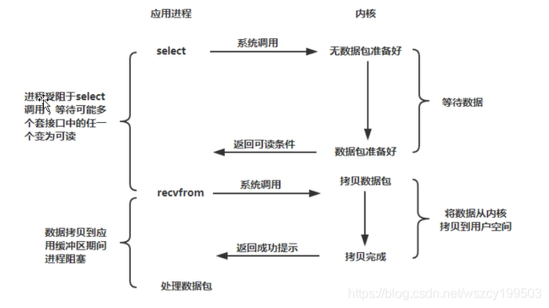

与 Socket 类和 ServerSocket 类相对应，NIO 也提供了 SocketChannel 和 ServerSocketChannel 两种不同的套接字通道实现。这两种新增的通道都支持阻塞和非阻塞两种模式。阻塞模式使用非常简单，但是性能和可靠性都不好，非阻塞模式正好相反。开发人员一般可以根据自己的需要来选择合适的模式，一般来说，低负载、低并发的应用程序可以选择同步阻塞IO以降低编程复杂度。但是对于高负载、高并发的网络应用，需要使用NIO的非阻塞模式进行开发。 Netty架构按照Reactor模式设计和实现，它的服务端通信序列图如下：

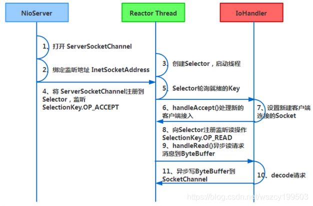

客户端通信序列图如下：

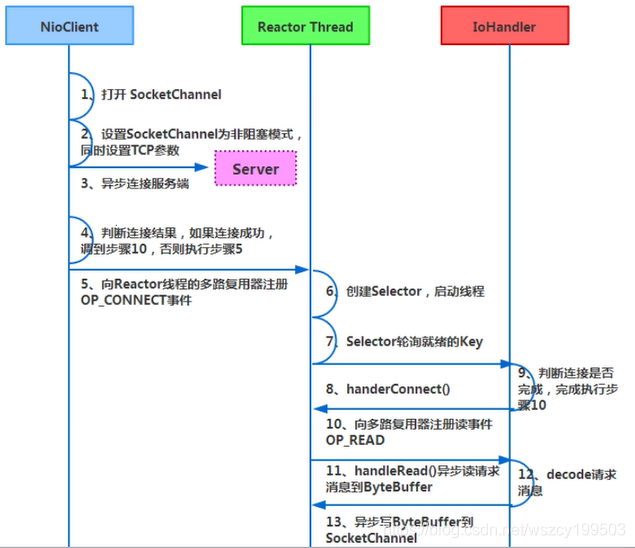

Netty的IO线程 NioEventLoop 由于聚合了多路复用器Selector，可以同时并发处理成百上千个客户端Channel，由于读写操作都是非阻塞的，这就可以充分提升IO线程的运行效率，避免由于频繁IO阻塞导致的线程挂起。另外，由于Netty采用了异步通信模式，一个IO线程可以并发处理N个客户端连接和读写操作，这从根本上解决了传统同步阻塞IO一连接一线程模型，架构的性能、弹性伸缩能力和可靠性都得到了极大的提升。

2.2 零拷贝

Netty的零拷贝主要体现在如下三个方面：

1. Netty 的接收和发送 ByteBuffer 采用DIRECT BUFFERS， 使用堆外直接内存进行Socket读写，不需要进行字节缓冲区的二次拷贝。如果使用传统的堆内存(HEAP BUFFERS) 进行Socket读写，JVM 会将堆内存Buffer拷贝一份到直接内存中，然后才写入Socket中。相比于堆外直接内存，消息在发送过程中多了一次缓冲区的内存拷贝。 
2. Netty 提供了组合Buffer对象，可以聚合多个ByteBuffer对象，用户可以像操作一个Buffer那样方便的对组合Buffer进行操作，避免了传统通过内存拷贝的方式将几个小Buffer合并成一个大的Buffer。 
3. Netty的文件传输采用了transferTo方法，它可以直接将文件缓冲区的数据发送到目标Channel，避免了传统通过循环write方式导致的内存拷贝问题。

下面，我们对上述三种“零拷贝”进行说明，先看 Netty 接收 Buffer 的创建：

打开 `AbstractNioByteChannel$NioByteUnsafe`

```java
public final void read() {
    final ChannelConfig config = config();
    final ChannelPipeline pipeline = pipeline();
    final ByteBufAllocator allocator = config.getAllocator();
    final RecvByteBufAllocator.Handle allocHandle = recvBufAllocHandle();
    allocHandle.reset(config);
    ByteBuf byteBuf = null;
    boolean close = false;
    try {
        do {
            byteBuf = allocHandle.allocate(allocator);
            allocHandle.lastBytesRead(doReadBytes(byteBuf));
            if (allocHandle.lastBytesRead() <= 0) {
                // nothing was read. release the buffer.
                byteBuf.release();
                byteBuf = null;
                close = allocHandle.lastBytesRead() < 0;
                break;
            }
            allocHandle.incMessagesRead(1);
            readPending = false;
            pipeline.fireChannelRead(byteBuf);
            byteBuf = null;
        } while (allocHandle.continueReading());
        allocHandle.readComplete();
        pipeline.fireChannelReadComplete();
        if (close) {
            closeOnRead(pipeline);
        }
    } catch (Throwable t) {
        handleReadException(pipeline, byteBuf, t, close, allocHandle);
    } finally {
        // Check if there is a readPending which was not processed yet.
        // This could be for two reasons:
        // * The user called Channel.read() or ChannelHandlerContext.read() in channelRead(...) method
        // * The user called Channel.read() or ChannelHandlerContext.read() in channelReadComplete(...) method
        //
        // See https://github.com/netty/netty/issues/2254
        if (!readPending && !config.isAutoRead()) {
            removeReadOp();
        }
    }
}
```

再找到 do while 中的 allocHandle.allocate(allocator) 方法，实际上调用的是 DefaultMaxMessageRecvByteBufAllocator$MaxMessageHandle 的 allocate 方法：

```java
public ByteBuf allocate(ByteBufAllocator alloc) {
    return alloc.ioBuffer(guess());
}
```

相当于是每次循环读取一次消息，就通过 ByteBufferAllocator 的 ioBuffer 方法获取 ByteBuf 对象，下面继续看它的接口定义：

```java
public abstract class ByteBuf implements ReferenceCounted, Comparable<ByteBuf> {...}
```

当进行 Socket IO 读写的时候，为了避免从堆内存拷贝一份副本到直接内存，Netty 的 ByteBuf 分配器直接创建非堆内存避免缓冲区的二次拷贝，通过“零拷贝”来提升读写性能。

下面我们继续看``第二种“零拷贝”的实现 CompositeByteBuf``，它对外将多个 ByteBuf 封装成一个 ByteBuf，对外提供统一封装后的 ByteBuf 接口，它的类定义如下：

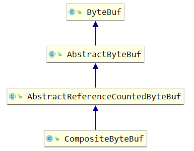

通过继承关系我们可以看出 CompositeByteBuf 实际就是个 ByteBuf 的包装器，它将多个 ByteBuf 组合成一个集合，然后对外提供统一的 ByteBuf 接口，相关定义如下：

```java
private static final ByteBuffer EMPTY_NIO_BUFFER = Unpooled.EMPTY_BUFFER.nioBuffer();
private static final Iterator<ByteBuf> EMPTY_ITERATOR = Collections.<ByteBuf>emptyList().iterator(); 
private final ByteBufAllocator alloc; 
private final boolean direct; 
private final List<Component> components;
private final int maxNumComponents;
private boolean freed;
```

添加 ByteBuf，不需要做内存拷贝，相关代码如下：

```java
private int addComponents0(boolean increaseWriterIndex, int cIndex, ByteBuf[] buffers, int offset, int len) {
    checkNotNull(buffers, "buffers");
    int i = offset;
    try {
        checkComponentIndex(cIndex);
        // No need for consolidation
        while (i < len) {
            // Increment i now to prepare for the next iteration and prevent a duplicate release (addComponent0
            // will release if an exception occurs, and we also release in the finally block here).
            ByteBuf b = buffers[i++];
            if (b == null) {
                break;
            }
            cIndex = addComponent0(increaseWriterIndex, cIndex, b) + 1;
            int size = components.size();
            if (cIndex > size) {
                cIndex = size;
            }
        }
        return cIndex;
    } finally {
        for (; i < len; ++i) {
            ByteBuf b = buffers[i];
            if (b != null) {
                try {
                    b.release();
                } catch (Throwable ignored) {
                    // ignore
                }
            }
        }
    }
}
```

最后，我们看下文件传输的“零拷贝”：

```java
public long transferTo(WritableByteChannel target, long position) throws IOException {
    long count = this.count - position;
    if (count < 0 || position < 0) {
        throw new IllegalArgumentException(
                "position out of range: " + position +
                " (expected: 0 - " + (this.count - 1) + ')');
    }
    if (count == 0) {
        return 0L;
    }
    if (refCnt() == 0) {
        throw new IllegalReferenceCountException(0);
    }
    // Call open to make sure fc is initialized. This is a no-oop if we called it before.
    open();
    long written = file.transferTo(this.position + position, count, target);
    if (written > 0) {
        transferred += written;
    }
    return written;
}
```

Netty 文件传输 DefaultFileRegion 通过 transferTo()方法将文件发送到目标 Channel 中，下面重点看 FileChannel 的 transferTo()方法，它的 API DOC 说明如下：

```java
/**
     * Transfers bytes from this channel's file to the given writable byte
     * channel.
     *
     * <p> An attempt is made to read up to <tt>count</tt> bytes starting at
     * the given <tt>position</tt> in this channel's file and write them to the
     * target channel.  An invocation of this method may or may not transfer
     * all of the requested bytes; whether or not it does so depends upon the
     * natures and states of the channels.  Fewer than the requested number of
     * bytes are transferred if this channel's file contains fewer than
     * <tt>count</tt> bytes starting at the given <tt>position</tt>, or if the
     * target channel is non-blocking and it has fewer than <tt>count</tt>
     * bytes free in its output buffer.
     *
     * <p> This method does not modify this channel's position.  If the given
     * position is greater than the file's current size then no bytes are
     * transferred.  If the target channel has a position then bytes are
     * written starting at that position and then the position is incremented
     * by the number of bytes written.
     *
     * <p> This method is potentially much more efficient than a simple loop
     * that reads from this channel and writes to the target channel.  Many
     * operating systems can transfer bytes directly from the filesystem cache
     * to the target channel without actually copying them.  </p>
     *
     */
    public abstract long transferTo(long position, long count,
                                    WritableByteChannel target)
        throws IOException;
```

对于很多操作系统它直接将文件缓冲区的内容发送到目标 Channel 中，而不需要通过拷贝的方式，这是一种更加高效的传输方式，它实现了文件传输的“`零拷贝`”。

2.3 内存池

随着 JVM 虚拟机和 JIT 即时编译技术的发展，对象的分配和回收是个非常轻量级的工作。但是对于缓冲区 Buffer，情况却稍有不同，特别是对于堆外直接内存的分配和回收，是一件耗时的操作。为了尽量重用缓冲区，Netty 提供了基于内存池的缓冲区重用机制。下面我们一起看下 Netty ByteBuf 的实现：

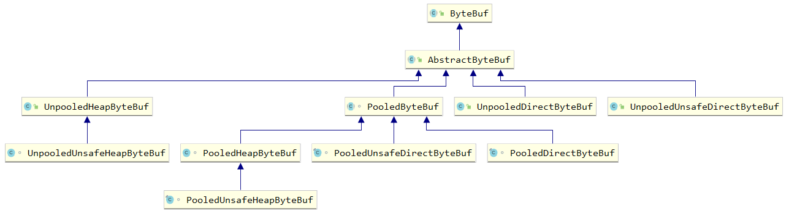

Netty 提供了多种内存管理策略，通过在启动辅助类中配置相关参数，可以实现差异化的定制。下面通过性能测试，我们看下基于内存池循环利用的 ByteBuf 和普通 ByteBuf 的性能差异。

```java
public class BufTest {
    public static void main(String[] args) {
        directBuf();
    }
    public static void directBuf() {
        final byte[] CONTENT = new byte[1024];
        int loop = 1800000;
        long startTime = System.currentTimeMillis();
        ByteBuf poolBuffer = null;
        for (int i = 0; i < loop; i++) {
            poolBuffer = PooledByteBufAllocator.DEFAULT.directBuffer(1024);
            poolBuffer.writeBytes(CONTENT);
            poolBuffer.release();
        }

        long endTime = System.currentTimeMillis();
        System.out.println("内存池分配缓冲区耗时" + (endTime - startTime) + "ms.");

        long startTime2 = System.currentTimeMillis();
        ByteBuf buffer = null;
        for (int i = 0; i < loop; i++) {
            buffer = Unpooled.directBuffer(1024);
            buffer.writeBytes(CONTENT);
        }
        endTime = System.currentTimeMillis();
        System.out.println("非内存池分配缓冲区耗时" + (endTime - startTime2) + "ms.");
    }
}
```

各执行 180 万次，性能对比结果如下所示：

性能测试经验表明，采用内存池的 ByteBuf 相比于朝生夕灭的 ByteBuf，性能高 23 倍左右（性能数据与使用场景强相关）。下面我们一起简单分析下 Netty 内存池的内存分配：

```java
public ByteBuf directBuffer(int initialCapacity, int maxCapacity) {
    if (initialCapacity == 0 && maxCapacity == 0) {
        return emptyBuf;
    }
    validate(initialCapacity, maxCapacity);
    return newDirectBuffer(initialCapacity, maxCapacity);
}
```

继续看 newDirectBuffer 方法，我们发现它是一个抽象方法，由 AbstractByteBufAllocator 的子类负责具体实现。

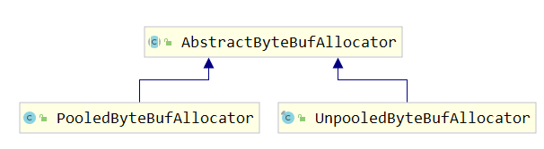

代码跳转到 PooledByteBufAllocator 的 newDirectBuffer 方法，从 Cache 中获取内存区域 PoolArena，调用它的 allocate 方法进行内存分配：

```java
protected ByteBuf newDirectBuffer(int initialCapacity, int maxCapacity) {
    PoolThreadCache cache = threadCache.get();
    PoolArena<ByteBuffer> directArena = cache.directArena;
    final ByteBuf buf;
    if (directArena != null) {
        buf = directArena.allocate(cache, initialCapacity, maxCapacity);
    } else {
        buf = PlatformDependent.hasUnsafe() ?
                UnsafeByteBufUtil.newUnsafeDirectByteBuf(this, initialCapacity, maxCapacity) :
                new UnpooledDirectByteBuf(this, initialCapacity, maxCapacity);
    }
    return toLeakAwareBuffer(buf);
}
```

PoolArena 的 allocate 方法如下：

```java
PooledByteBuf<T> allocate(PoolThreadCache cache, int reqCapacity, int maxCapacity) {
    PooledByteBuf<T> buf = newByteBuf(maxCapacity);
    allocate(cache, buf, reqCapacity);
    return buf;
}
```

我们重点分析 newByteBuf 的实现，它同样是个抽象方法，由子类 DirectArena 和 HeapArena 来实现不同类型的缓冲区分配。

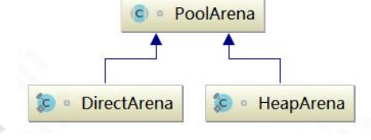

 

由于测试用例使用的是堆外内存，因此重点分析 DirectArena 的实现：

```java
protected PooledByteBuf<ByteBuffer> newByteBuf(int maxCapacity) {
    if (HAS_UNSAFE) {
        return PooledUnsafeDirectByteBuf.newInstance(maxCapacity);
    } else {
        // 如果没有开启使用 sun 的 unsafe，则执行 PooledDirectByteBuf 的 newInstance 方法
        return PooledDirectByteBuf.newInstance(maxCapacity);
    }
}
static PooledDirectByteBuf newInstance(int maxCapacity) {
    PooledDirectByteBuf buf = RECYCLER.get();
    buf.reuse(maxCapacity);
    return buf;
}
```

通过 ``RECYCLER`` 的 get 方法循环使用 ByteBuf 对象，如果是非内存池实现，则直接创建一个新的 **ByteBuf** 对象。从缓冲池中获取 ByteBuf 之后，调用 AbstractReferenceCountedByteBuf 的 setRefCnt 方法设置引用计数器，用于对象的引用计数和内存回收（类似 JVM 垃圾回收机制）。

2.4 高效的 Reactor 线程模型

常用的Reactor线程模型有三种，分别如下：

1. Reactor 单线程模型
2. Reactor 多线程模型
3. 主从Reactor多线程模型

Reactor单线程模型指的是所有的IO操作都在同一个NIO线程上面完成，NIO线程的职责如下：

1. 作为NIO服务端，接收客户端的TCP连接
2. 作为NIO客户端，向服务端发起TCP连接
3. 读取通信对端的请求或者应答消息
4. 向通信对端发送消息请求或者应答消息

Reactor单线程模型示意图如下所示：

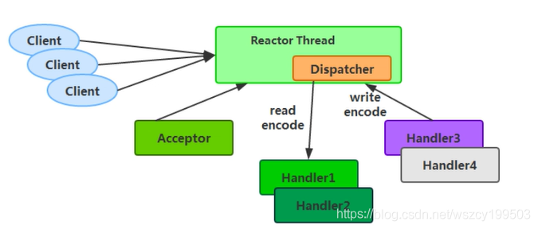

由于Reactor 模式使用的是异步非阻塞IO，所有的IO操作都不会导致阻塞，理论上一个线程可以独立处理所有IO相关的操作。从架构层面看，一个NIO线程确实可以完成其承担的职责。例如，通过Acceptor接收客户端的TCP连接请求消息，链路建立成功之后，通过Dispatch将对应的ByteBuffer派发到指定的Handler上进行消息解码。用户Handler可以通过NIO线程将消息发送给客户端。 对于一些小容量应用场景,可以使用单线程模型。但是对于高负载、大并发的应用却不合适，主要原因如下:

1. 一个NIO线程同时处理成百上千的链路，性能上无法支撑，即便NIO线程的CPU负荷达到100%，也无法满足海量消息的编码、解码、读取和发送
2. 当NIO线程负载过重之后，处理速度将变慢，这会导致大量客户端连接超时，超时之后往往会进行重发，这更加重了NIO线程的负载，最终会导致大量消息积压和处理超时，NIO线程会成为系统的性能瓶颈
3. 可靠性问题:一旦NIO线程意外跑飞，或者进入死循环，会导致整个系统通信模块不可用，不能接收和处理外部消息，造成节点故障

为了解决这些问题，演进出了Reactor多线程模型，下面我们一起学习下Reactor多线程模型。 Reactor 多线程模型与单线程模型最大区别就是有一组NIO线程处理IO操作，原理图如下：

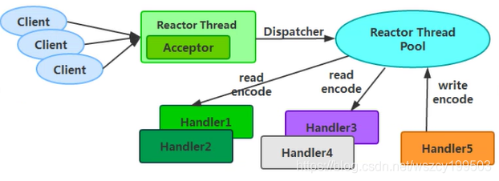

Reactor多线程模型的特点：

1. 有专门一个NIO线程Acceptor线程用于监听服务端，接收客户端的TCP连接请求
2. 网络IO操作读、写等由一个NIO线程池负责,线程池可以采用标准的JDK线程池实现,它包含一个任务队列和N个可用的线程，由这些NIO线程负责消息的读取、解码、编码和发送
3. 1个NIO线程可以同时处理N条链路，但是1个链路只对应1个NIO线程，防止发生并发操作问题

在绝大多数场景下，Reactor多线程模型都可以满足性能需求;但是，在极特殊应用场景中，一个NIO线程负责监听和处理所有的客户端连接可能会存在性能问题。例如百万客户端并发连接，或者服务端需要对客户端的握手消息进行安全认证，认证本身非常损耗性能。在这类场景下，单独一个Acceptor线程可能会存在性能不足问题，为了解决性能问题，产生了第三种Reactor线程模型——主从Reactor多线程模型。

主从Reactor线程模型的特点是:服务端用于接收客户端连接的不再是个1个单独的NIO线程，而是一个独立的NIO线程池。Acceptor接收到客户端TCP连接请求处理完成后(可能包含接入认证等)，将新创建的SocketChannel注册到IO线程池(sub reactor线程池)的某个IO线程上，由它负责SocketChannel的读写和编解码工作。Acceptor 线程池仅仅只用于客户端的登陆、握手和安全认证，一旦链路建立成功，就将链路注册到后端subReactor线程池的IO线程上，由IO线程负责后续的IO操作。

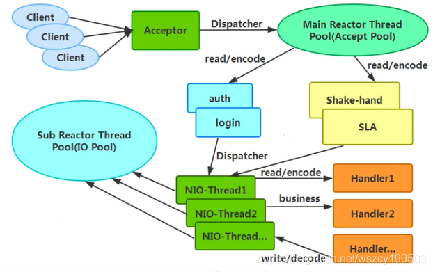

利用主从NIO线程模型,可以解决1个服务端监听线程无法有效处理所有客户端连接的性能不足问题。因此，在Netty的官方demo中，推荐使用该线程模型。 事实上，Netty 的线程模型并非固定不变,通过在启动辅助类中创建不同的EventLoopGroup实例并通过适当的参数配置，就可以支持上述三种Reactor线程模型。正是因为Netty对Reactor线程模型的支持提供了灵活的定制能力，所以可以满足不同业务场景的性能诉求。

2.5 无锁化的串行设计理念

在大多数场景下，并行多线程处理可以提升系统的并发性能。但是，如果对于共享资源的并发访问处理不当，会带来严重的锁竞争，这最终会导致性能的下降。为了尽可能的避免锁竞争带来的性能损耗，可以通过串行化设计，即消息的处理尽可能在同一个线程内完成，期间不进行线程切换，这样就避免了多线程竞争和同步锁。 为了尽可能提升性能，Netty采用了串行无锁化设计，在IO线程内部进行串行操作，避免多线程竞争导致的性能下降。表面上看，串行化设计似乎CPU利用率不高，并发程度不够。但是，通过调整NIO线程池的线程参数，可以同时启动多个串行化的线程并行运行，这种局部无锁化的串行线程设计相比一个队列-多个工作线程模型性能更优。 Netty的串行化设计工作原理图如下：

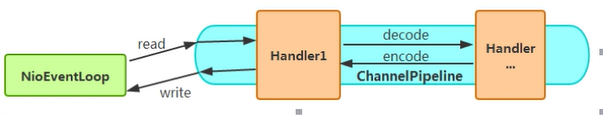

Netty的NioEventLoop读取到消息之后，直接调用ChannelPipeline的fireChannelRead(object msg)，只要用户不主动切换线程，一直会由NioEventLoop调用到用户的Handler,期间不进行线程切换，这种串行化处理方式避免了多线程操作导致的锁的 竞争，从性能角度看是最优的。

2.6 高效的并发编程.

Netty的高效并发编程主要体现在如下几点：

1. volatile的大量、正确使用; 
2. CAS和原子类的广泛使用; 
3. 线程安全容器的使用; 
4. 通过读写锁提升并发性能。

2.7 高性能的序列化框架

影响序列化性能的关键因素总结如下：

1. 序列化后的码流大小(网络带宽的占用) ; 
2. 序列化&amp;反序列化的性能(CPU资源占用) ; 
3. 是否支持跨语言(异构系统的对接和开发语言切换)。

Netty默认提供了对Google Protobuf的支持，通过扩展Netty的编解码接口，用户可以实现其它的高性能序列化框架，例如Thrift的压缩二进制编解码框架。 下面我们一起看下不同序列化&amp;反序列化框架序列化后的字节数组对比：


从上图可以看出，Protobuf 序列化后的码流只有Java序列化的1/4左右。正是由于Java原生序列化性能表现大差，才催生出了各种高性能的开源序列化技术和框架(性能差只是其中的一个原因，还有跨语言、IDL 定义等其它因素)。

2.8 灵活的 TCP 参数配置能力

合理设置TCP参数在某些场景下对于性能的提升可以起到显著的效果，例如SO_RCVBUF和SO_SNDBUF。 如果设置不当，对性能的影响是非常大的。下面我们总结下对性能影响比较大的几个配置项：

1. SO_RCVBU和SO_SNDBUF: 通常建议值为128K或者256K; 
2. SO_TCPNODELAY: NAGLE 算法通过将缓冲区内的小封包自动相连，组成较大的封包，阻止大量小封包的发送阻塞网络，从而提高网络应用效率。但是对于时延敏感的应用场景需要关闭该优化算法; 
3. 软中断:如果Linux内核版本支持RPS (2.6.35以上版本)，开启RPS后可以实现软中断，提升网络吞吐量。RPS 根据数据包的源地址，目的地址以及目的和源端口，计算出一个hash值，然后根据这个hash值来选择软中断运行的cpu，从上层来看，也就是说将每个连接和cpu绑定，并通过这个hash值，来均衡软中断在多个cpu上，提升网络并行处理性能。

Netty在启动辅助类中可以灵活的配置TCP参数，满足不同的用户场景。相关配置接口定义如下：

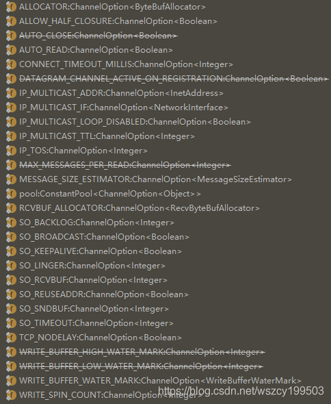

通过对Netty的架构和性能模型进行分析,我们发现Netty架构的高性能是被精心设计和实现的，得益于高质量的架构和代码，Netty 支持10W TPS的跨节点服务调用并不是件十分困难的事情。

------

