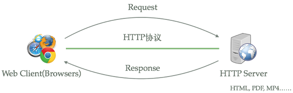
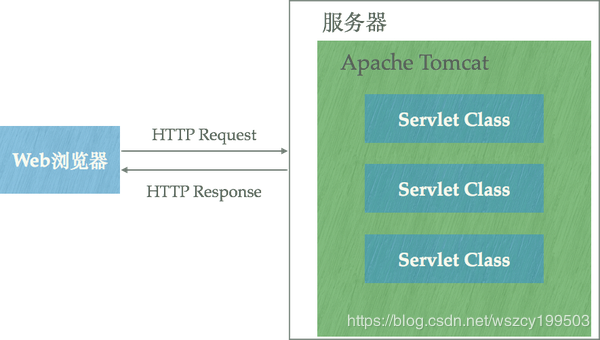

# Nginx 简介

## 什么是Nginx

Nginx 是高性能的 HTTP 和反向代理的服务器，处理高并发能力是十分强大的，能经受高负载的考验,有报告表明能支持高达 50,000 个并发连接数。

``正向代理`` 对象是客户端 

``反向代理`` 代理的是服务端，隐藏了真实服务端 IP 地址 

``负载均衡`` 增加服务器的数量，然后将请求分发到各个服务器上，将原先请求集中到单个服务器上的情况改为将请求分发到多个服务器上，将负载分发到不同的服务器 

``动静分离``

## 常用Web服务器介绍

apache、Nginx、tomcat、weblogic、iis、jboss、websphere、jetty、netty、lighttpd、glassfish、resin

### Apache

Apache仍然是时长占用量最高的web服务器，据最新数据统计，市场占有率目前是50%左右。主要优势在于一个是比较早出现的一个Http静态资源服务器，同时又是开源的。所以在技术上的支持以及市面上的各种解决方案都比较成熟。Apache支持的模块非常丰富。

### Lighttpd

Lighttpd其设计目标是提供一个专门针对高性能网站、安全、快速、兼容性好并且灵活的web server环境。特点是：内存开销低、CPU占用率低、性能好、模块丰富。Lighttpd跟Nginx一样，是一款轻量级的Web服务器，跟Nginx的定位类似。

### Tomcat

Tomcat大家都比较熟悉，是一个开源的JSP Servlet容器。

### Nginx

Nginx是俄罗斯人编写的一款高性能的HTTP和反向代理服务器，在高连接并发的情况下，它能够支持高达50000个并发连接数的响应，但是内存、CPU等系统资源消耗却很低，运行很稳定。目前Nginx在国内很多大型企业都有应用，据最新统计，Nginx的市场占有率已经到33%左右了。而Apache的市场占有率虽然仍然是最高的，但是是呈下降趋势。而Nginx的势头很明显。选择Nginx的理由也很简单：

1. 它可以支持5W高并发连接； 
2. 内存消耗少； 
3. 成本低，如果采用F5、NetScaler等硬件负载均衡设备的话，需要大几十万。

而且Nginx是开源的，可以免费使用并且能用于商业用途。

#### Nginx服务器、Apache Http Server、Tomcat之间的关系

HTTP服务器本质上也是一种应用程序——它通常运行在服务器之上，绑定服务器的IP地址并监听某一个tcp端口来接收并处理HTTP请求，这样客户端（一般来说是IE, Firefox，Chrome这样的浏览器）就能够通过HTTP协议来获取服务器上的网页（HTML格式）、文档（PDF格式）、音频（MP4格式）、视频（MOV格式）等等资源。  

Apache Tomcat是Apache基金会下的一款开源项目，Tomcat能够动态的生成资源并返回到客户端。

Apache HTTP server 和Nginx都能够将某一个文本文件的内容通过HTTP协议返回到客户端，但是这些文本文件的内容是固定的，也就是说什么情况下访问该文本的内容都是完全一样的，这样的资源我们称之为静态资源。动态资源则相反，不同时间、不同客户端所得到的内容是不同的 ； （虽然apache和nginx本身不支持动态页面，但是他们可以集成模块来支持，比如PHP、Python）。 如果想要使用java程序来动态生成资源内容，使用apache server和nginx这一类的http服务器是基本做不到。而Java Servlet技术以及衍生出来的（jsp）Java Server Pages技术可以让Java程序也具有处理HTTP请求并且返回内容的能力，而Apache Tomcat正是支持运行Servlet/JSP应用程序的容器。  

Tomcat运行在JVM之上，它和HTTP服务器一样，绑定IP地址并监听TCP端口，同时还包含以下职责：

1. 管理Servlet程序的生命周期 
2. 将URL映射到指定的Servlet进行处理 
3. 与Servlet程序合作处理HTTP请求——根据HTTP请求生成HttpServletResponse对象并传递给Servlet进行处理，将Servlet中的HttpServletResponse对象生成的内容返回给浏览器

虽然Tomcat也可以认为是HTTP服务器，但通常它仍然会和Nginx配合在一起使用： 

• ``动静态资源分离`` 运用Nginx的反向代理功能分发请求：所有动态资源的请求交给Tomcat，而静态资源的请求（例如图片、视频、CSS、JavaScript文件等）则直接由Nginx返回到浏览器，这样能大大减轻Tomcat的压力。

 • ``负载均衡`` 当业务压力增大时，可能一个Tomcat的实例不足以处理，那么这时可以启动多个Tomcat实例进行水平扩展，而Nginx的负载均衡功能可以把请求通过算法分发到各个不同的实例进行处理。

Apache HTTP Server和Nginx的关系 

Apache Http Server是使用比较广泛也是资格最老的web服务器，是Apache基金会下第一个开源的WEB服务器。在Nginx出现之前，大部分企业使用的都是Apache。 在互联网发展初期，流量不是特别大的时候，使用Apache完全满足需求。但是随着互联网的飞速发展，网站的流量以指数及增长，这个时候除了提升硬件性能以外，Apache Http server也开始遇到瓶颈了，于是这个时候Nginx的出现，就是为了解决大型网站高并发设计的，所以对于高并发来说，Nginx有先天的优势。因此Nginx也在慢慢取代Apache Http server。 而Nginx另一个强大的功能就是反向代理，现在大型网站分工详细，哪些服务器处理数据流，哪些处理静态文件，这些谁指挥，一般都是用nginx反向代理到内网服务器，这样就起到了负载均衡分流的作用。再次nginx高度模块化的设计，编写模块相对简单。

# Nginx 安装


在 nginx 安装之前需要安装 nginx 的三个依赖包pcre，openssl，zlib。安装步骤很简单，与nginx的安装步骤一致：

1. tar -xvf 安装包 
2. ./configure 可使用--prefix指定安装目录，默认安装到/usr/local/nginx 
3. make &amp; make install

这里使用 nginx-1.16.1.tar.gz，对应的依赖软件版本为： 

openssl-1.1.1g.tar.gz 

pcre-8.44.tar.gz 

zlib-1.2.11.tar.gz

# Nginx 简单命令

```java
# 查看 nginx 版本号
./nginx -v
# 启动nginx -c表示指定nginx.conf的文件。如果不指定，默认为NGINX_HOME/conf/nginx.conf
./nginx -c /usr/local/nginx/conf/nginx.conf
# 停止
./nginx -s stop
# 退出
./nginx -s quit
# 重新加载nginx.conf
./nginx -s reload
# 检测nginx配置文件是否合法
./nginx -t
```

# Nginx 核心配置分析

nginx的核心配置文件,主要包括三个段：Main、 Event 、 Http

## 虚拟主机配置

### 基于域名的虚拟主机

修改windows/system32/drivers/etc/hosts

```java
192.168.174.128 www.spring.com
```

修改nginx.conf文件，在http段中增加如下内容

```java
server {
    listen       80;
    server_name  www.spring.com;
    location / {
        root   html/domain;
        index  index.html index.htm;
    }
}
```

### 基于端口的虚拟主机

```java
server {
    listen       8080;
    server_name  localhost;
    location / {
        root html/port;
        index index.html index.htm;
    }
}
```

### 基于ip的虚拟主机

## Nginx的日志配置

### 通过access_log进行日志记录

nginx中有两条是配置日志的：一条是log_format 来设置日志格式 ； 另外一条是access_log

```java
log_format  main  '$remote_addr - $remote_user [$time_local] "$request" '
                  '$status $body_bytes_sent "$http_referer" '
                  '"$http_user_agent" "$http_x_forwarded_for"';

# access_log  格式
# logo声明   路径及文件名 日志标识
error_log  logs/error.log  notice;
```

### nginx日志切割

crontab

## location的语法和匹配规则

```java
location [~|=|^~|~*] /uri {}
```

### 精准匹配

location =/uri{} 

优先级最高的匹配规则

### 一般匹配

location /uri{} 普通匹配的优先级要高于正则匹配，如果存在多个相同的前缀的一般匹配，那么最终会按照最大长度来做匹配

### 正则匹配


## rewrite的使用

Rewrite通过ngx_http_rewrite_module模块支持url重写、支持if判断，但不支持else。 

``rewrite`` 功能就是，使用nginx提供的全局变量或自己设置的变量，结合正则表达式和标志位实现url重写以及重定向。 

rewrite只能放在server{},location{},if{}中，并且只能对域名后边的除去传递的参数外的字符串起作用常用指令。 

If 空格 (条件) {设定条件进行重写} 条件的语法：

1. = 来判断相等，用于字符比较 
2. ~ 用正则来匹配（表示区分大小写），“~*” 不区分大小写 
3. -f -d -e 来判断是否为文件、目录、是否存在

### return 指令

语法：return code; 停止处理并返回指定状态码给客户端。

```java
if ($request_uri ~ *\.sh ){
  return 403
}
```

### set指令

set variable value; 定义一个变量并复制，值可以是文本、变量或者文本变量混合体

### rewrite指令

语法：

```java
rewrite regex replacement [flag]{
	last / break/ redirect 返回临时302 / permant  返回永久302
}
```

last 停止处理后续的rewrite指令集、 然后对当前重写的uri在rewrite指令集上重新查找 break 停止处理后续的rewrite指令集 ,并不会重新查找

### 综合实例

```java
location / {
	rewrite '^/images/([a-z]{3})/(.*)\.(png|jpg)$' /spring?file=$2.$3;
	set $image_file $2;
	set $image_type $3;
}
location /spring {
	root html;
	try_files /$arg_file /image404.html;
}
location /image404.html {
	root 404 "image not found exception";
}
```

如上配置对于：/images/ttt/test.png 会重写到/spring?file=test.png，于是匹配到 location /spring；通过try_files获取存在的文件进行返回。最后由于文件不存在所以直接返回404错误。

### rewrite匹配规则

表面看rewrite和location功能有点像，都能实现跳转，主要区别在于rewrite是在同一域名内更改获取资源的路径，而location是对一类路径做控制访问或反向代理，可以proxy_pass到其他机器。很多情况下rewrite也会写在location里，它们的执行顺序是： • 执行server块的rewrite指令 • 执行location匹配 • 执行选定的location中的rewrite指令 如果其中某步URI被重写，则重新循环执行1-3，直到找到真实存在的文件；循环超过10次，则返回500 Internal Server Error错误

## 浏览器本地缓存配置及动静分离

语法：

```java
expires 60s|m|h|d
```

操作步骤： • 在html目录下创建一个images文件，在该文件中放一张图片 • 修改index.html, 增加 • 修改nginx.conf配置。配置两个location实现动静分离，并且在静态文件中增加expires的缓存期限

```java
server {
    listen       80;
    server_name  localhost;

	gzip on;
    gzip_buffers 4 16k;
    gzip_comp_level 7;
    gzip_min_length 20k;
    gzip_types text/css text/xml application/javascript;
    gzip_vary on;

    location / {
        root   html;
        index  index.html index.htm;
    }
  
    location ~ .*\.(js|css|png|jpg|gif) {
        root html/static;
        expires 5m;
    }
}
```

### Gzip压缩策略

浏览器请求 -&gt; 告诉服务端当前浏览器可以支持压缩类型-&gt;服务端会把内容根据浏览器所支持的压缩策略去进行压缩返回 -&gt;浏览器拿到数据以后解码 常见的压缩方式：gzip、deflate 、sdch 

gzip on|off 是否开启gzip压缩 

gzip_buffers 4 16k 设置系统获取几个单位的缓存用于存储gzip的压缩结果数据流。4 16k代表以16k为单位，安装原始数据大小以16k为单位的4倍申请内存。 

gzip_comp_level[1-9] 压缩级别， 级别越高，压缩越小，但是会占用CPU资源 

gzip_disable 正则匹配UA 表示什么样的浏览器不进行gzip 

gzip_min_length 开始压缩的最小长度（小于多少就不做压缩） 

gzip_http_version 1.0|1.1 表示开始压缩的http协议版本 

gzip_proxied （nginx 做前端代理时启用该选项，表示无论后端服务器的headers头返回什么信息，都无条件启用压缩） 

gzip_type text/pliain,application/xml 对那些类型的文件做压缩 （conf/mime.conf） 

gzip_vary on|off 是否传输gzip压缩标识

注意：

1. 图片、mp3这样的二进制文件，没必要做压缩处理，因为这类文件压缩比很小，压缩过程会耗费CPU资源 
2. 太小的文件没必要压缩，因为压缩以后会增加一些头信息，反而导致文件变大 
3. Nginx默认只对text/html进行压缩 ，如果要对html之外的内容进行压缩传输，我们需要手动来配置

# Nginx 反向代理

## proxy_pass

通过反向代理把请求转发到百度

```java
server {
	listen 80;
	server_name www.spring.com;
	
	location =/s {
		proxy_pass http://www.baidu.com;
	}
}
```

proxy_pass 既可以是ip地址，也可以是域名，同时还可以指定端口，proxy_pass指定的地址携带了URI，看我们前面的配置【/s】，那么这里的URI将会替换请求URI中匹配location参数部分；如上代码将会访问到http://www.baidu.com/s interface_version

## 负载均衡

upstream是Nginx的HTTP Upstream模块，这个模块通过一个简单的调度算法来实现客户端IP到后端服务器的负载均衡。 

常用参数介绍语法：server address [parameters] 

server 必选。 

address 也必选，可以是主机名、域名、ip或unix socket，也可以指定端口号。 

parameters 是可选参数，可以是如下参数：

- down表示当前server已停用 
- backup表示当前server是备用服务器，只有其它非backup后端服务器都挂掉了或者很忙才会分配到请求 
- weight表示当前server负载权重，权重越大被请求几率越大。默认是1 
- max_fails和fail_timeout一般会关联使用，如果某台server在fail_timeout时间内出现了max_fails次连接失败，那么Nginx会认为其已经挂掉了，从而在fail_timeout时间内不再去请求它，fail_timeout默认是10s，max_fails默认是1，即默认情况是只要发生错误就认为服务器挂掉了，如果将max_fails设置为0，则表示取消这项检查。

```java
upstream tomcatserver {
	# 负载均衡机制，默认轮询
    ip_hash;
    server 192.168.174.128:8888;
    server 192.168.174.129:8888 weight=4;
}
```

### ups支持的调度算法

ip_hash 根据ip的hash值来做转发 

默认是轮询机制

# Nginx 的进程模型


## Master进程

充当整个进程组与用户的交互接口，同时对进程进行监护。它不需要处理网络事件，不负责业务的执行，只会通过管理work进程来实现重启服务、平滑升级、更换日志文件、配置文件实时生效等功能。 主要是用来管理worker进程：

1. 接收来自外界的信号 （前面提到的 kill -HUP 信号等） 我们要控制nginx，只需要通过kill向master进程发送信号就行了。比如kill -HUP pid，则是告诉nginx，从容地重启nginx，我们一般用这个信号来重启nginx，或重新加载配置，因为是从容地重启，因此服务是不中断的。master进程在接收到HUP信号后是怎么做的呢？首先master进程在接到信号后，会先重新加载配置文件，然后再启动新的worker进程，并向所有老的worker进程发送信号，告诉他们可以光荣退休了。新的worker在启动后，就开始接收新的请求，而老的worker在收到来自master的信号后，就不再接收新的请求，并且在当前进程中的所有未处理完的请求处理完成后，再退出 
2. 向各个worker进程发送信号 
3. 监控worker进程的运行状态 
4. 当worker进程退出后（异常情况下），会自动重新启动新的worker进程

## Work进程

主要是完成具体的任务逻辑。它的主要关注点是客户端和后端真实服务器之间的数据可读、可写等I/O交互事件。 

各个worker进程之间是对等且相互独立的，他们同等竞争来自客户端的请求，一个请求只可能在一个worker进程中处理，worker进程个数一般设置为cpu核数。 

master进程先建好需要listen的socket后，然后再fork出多个woker进程，这样每个work进程都可以去accept这个socket。当一个client连接到来时，所有accept的work进程都会受到通知，但只有一个进程可以accept成功，其它的则会accept失败。

```java
# 用户和用户组
#user  nobody;
# 工作线程(cpu总的核心数)
worker_processes  1;
# cpu多核配置
worker_cpu_affinity 01 10;
# 更改worker进程的文件最大打开数
worker_rlimit_nofile 10240; # too many open fies
# 日志
#error_log  logs/error.log;
#error_log  logs/error.log  notice;
#error_log  logs/error.log  info;
#error_log  logs/error.log  warn;

#pid        logs/nginx.pid;

events {
    # io 网络模型(epoll,select,poll,kqueue...)
    #use epoll
    # 允许连接数
    worker_connections  1024;
    # worker 进程锁
    accept_mutex off;
}

http {
    # 包含一个文件，mime.types:表示浏览器所支持的一些后缀名称
    include       mime.types;
    default_type  application/octet-stream;
    # 配置编码
    charset utf-8;

    #log_format  main  '$remote_addr - $remote_user [$time_local] "$request" '
    #                  '$status $body_bytes_sent "$http_referer" '
    #                  '"$http_user_agent" "$http_x_forwarded_for"';

    #access_log  logs/access.log  main;
    #access_log off;
    sendfile        on;
    #tcp_nopush     on;

    #keepalive_timeout  0;
    keepalive_timeout  65;
	...
}
```

