# 1 redis 基础

## 1.1 Redis 定位与特性

### 1.1.1 SQL 与 NoSQL

绝大多数情况下，我们首先考虑使用关系型数据库存储我们的数据。比如Mysql，Oracle，SQLServer等。

#### 关系型数据库

关系型数据库的特点：

1. 以表格形式基于行存储数据，是一个二维模式
2. 存储的是结构化数据，数据存储有固定的模式（schema），数据需要适应表结构
3. 表与表之间存在关联
4. 大部分关系型数据库都支持结构化查询语言SQL的操作，支持复杂的关联查询
5. 通过支持事务（ACID酸）来提供严格的或者实时的数据一致性

使用关系型数据库也存在一定的限制：

1. 需要扩容只能通过向上（垂直）扩展，比如磁盘限制了数据的存储，就要扩大磁盘的容量，通过对硬件的方式，不支持动态扩容。水平扩容需要通过复杂的方式来实现（分库分表）
2. 表结构修改困难，因此存储的数据格式也受到限制
3. 在高并发和高数据量的情况下，关系型数据库通常会把数据持久化到磁盘，基于磁盘的读写压力比较大

#### 非关系型数据库

为了规避关系型数据库的一系列问题，我们就有了非关系型的数据库。

`NoSQL（non-relational 或者 Not Only SQL）` 指的是非关系型的数据库，是对不同于传统的关系型数据库的数据库管理系统的统称。NoSQL 用于超大规模数据的存储。（例如谷歌或 Facebook 每天为他们的用户收集万亿比特的数据）。这些类型的数据存储不需要固定的模式，无需多余操作就可以横向扩展。 

非关系型数据库的特点：

1. 存储非结构化的数据，比如文本、图片、视频、音频等
2. 表与表之间没有关联，可扩展性强
3. 保证数据的最终一致性。遵循 BASE（碱）理论。 
4. 支持海量数据存储和高并发的高效读写
5. 支持分布式，能够对数据进行分片存储，扩缩容简单

#### CAP原理

在计算机科学中，`CAP定理(CAP theorem)` 又被称作`布鲁尔定理( Brewer's theorem)`，它指出对于一个分布式计算系统来说，不可能同时满足以下三点：

`一致性(Consistency)` 所有节点在同一时间具有相同的数据，一致性分为三种：

* 强一致性：要么一起成功，要么一起失败
* 弱一致性：最终一致性
* 顺序一致性

`可用性(Avaibility)` 保证每个请求不管成功或者失败都有响应

`分区容错性(Partition tolerance)` 系统中任意信息的丢失或失败不影响系统的继续运行

CAP理论的核心是<font color="red">一个分布式系统不可能同时很好的满足一致性、可用性和分区容错性这三个需求，最多只能同时较好的满足两个。</font>

因此，根据 CAP 原理将 NoSQL 数据库分成了满足CA原则、满足CP原则和满足AP原则三大类：

`CA` 单点集群，满足一致性、可用性的系统，通常在可扩展性上不太强大

`CP` 满足一致性、分区容错性的系统，通常性能不是特别高

`AP` 满足可用性、分区容错性的系统，通常可能对一致性要求低一些

#### BASE理论

BASS理论是对CAP定理的延伸，核心思想是即使无法做到强一致性(CAP定理中的一致性就是强一致性)，但应用可以采用适合的方式达到最终一致性。BASE是NoSQL数据库通常对可用性及一致性的弱要求原则：

``基本可用(Basicall Available)`` 基本可用是指分布式系统在出现故障的时候，允许损失部分可用性，既保证核心模块可用即可。电商大促时，为了应对访问量激增，部分用户可能会被引导到降级页面，服务层也可能只提供将及服务。这就损失部分可用性的体现。

``软状态(Soft state)`` 软状态是指允许系统有中间状态，而该中间状态不会影响系统整体可用性。分布式存储中一般一份数据至少会有三个副本，允许不同节点间副本同步的延时就是软状态的表现。MySQL Replication的异步复制也是一种体现。

``最终一致性(Eventual Consistency)`` 最终一致性是指系统中的所有数据副本经过一定时间后，最终能达到一致的状态 。弱一致性和强一致性相反,最终一致性是弱一致性的一种特殊状态。

#### NoSQL 数据库分类

| <span style="white-space:nowrap;">硬件&emsp;&emsp;&emsp;&emsp;&emsp;</span> | <span style="white-space:nowrap;">典型代表&emsp;&emsp;&emsp;&emsp;&emsp;&emsp;&emsp;</span> | 特点                                                         |
| ------------------------------------------------------------ | ------------------------------------------------------------ | ------------------------------------------------------------ |
| 列存储                                                       | Hbase <br/>Cassandra<br/>Hypertable                          | 顾名思义，是按照列存储数据的。 最大的特点是方便存储结构化和半结构化的数据，方便做数据压缩，对针对某一列或者某几列的查询有非常大的 IO 优势 |
| 文档存储                                                     | MongoDB <br/>CounchDB                                        | 文档存储一般用类似 json 的格式存储，存储的内容是文档型的。这样也就有机会对某些字段建立索引，实现关系数据库的某些功能 |
| Key-value 存储                                               | Tokyo Cabinet/Tyrant<br/>Berkelery DB<br />Memcache<br />Redis | 可以通过key快速查询到其 value 。 一 般来 说 ， 存储不管 value 的格式，照单全收。(Redis 包含了其他功能) |
| 图存储                                                       | Neo4J<br />FlockDB                                           | 图形关系的最佳存储。使用传统关系数据库来解决的话性能低 下，而且设计使用不方便。 |
| 对象存储                                                     | Db4o<br />Versant                                            | 通过类似面向对象语言的语法操作数据库，通过对象的方式存储数据。 |
| XML 数据库                                                   | Berkeley DB XML<br/>BaseX                                    | 高效的存储 XML 数据，并存储 XML 的内部查询语法， 比如 XQuery、Xpath。 |

### 1.1.2 Redis 特性

硬件层面有 CPU 的缓存，浏览器也有缓存，手机的应用也有缓存。我们把数据缓存起来的原因就是从原始位置取数据的代价太大了，放在一个临时位置存储起来，取回就可以快一些。 

Redis 的特性：

1. 更丰富的数据类型 

2. 进程内与跨进程；单机与分布式 

3. 功能丰富：持久化机制、过期策略 

4. 支持多种编程语言 

5. 高可用，集群

## 1.2 redis 安装启动

### 1.2.1 redis 安装

由于 redis 是用 C 语言开发，安装之前必先确认是否安装 gcc 环境（gcc -v），如果没有安装，执行以下命令进行安装：

```markdown
# 安装gcc套装
	yum install gcc
	# yum install cpp
	yum install binutils
	yum install glibc
	# yum install glibc-kernheaders
	# yum install glibc-common
	# yum install glibc-devel
    yum install make
# 升级gcc
	yum -y install centos-release-scl
	yum -y install devtoolset-9-gcc devtoolset-9-gcc-c++ devtoolset-9-binutils
	scl enable devtoolset-9 bash
# 当上面这几步完成后，再执行make命令即可
```

1. 下载redis安装包 
2. tar -zxvf 安装包 
3. 在redis目录下 执行 make 
4. 可以通过make test测试编译状态 
5. make install [prefix=/path]完成安装

### 1.2.2 启停 redis

```shell
# 启动
./redis-server ../redis.conf
# 关闭 
./redis-cli
shutdown
```

以后台进程的方式启动，修改redis.conf daemonize =yes

#### 连接到redis的命令

```java
./redis-cli
 ./redis-cli -h 127.0.0.1 -p 6379
```

#### 配置开机自启

```markdown
# 前提需要配置redis.conf
	daemonize yes # 后台运行
# 添加开机启动服务
	vim /etc/systemd/system/redis-server.service
	# 服务文件内容
	[Unit]
	Description=The redis-server Process Manager
	After=syslog.target network.target

	[Service]
	Type=forking
	PIDFile=/var/run/redis_6379.pid
	ExecStart=/usr/local/redis-6.0.5/src/redis-server /usr/local/redis-6.0.5/redis.conf
	PrivateTmp=true

	[Install]
	WantedBy=multi-user.target
# 设置开机启动
	# 新服务的服务程序配置文件生效，需重新加载
	systemctl daemon-reload
	# 前提先关闭运行中的redis，测试使用服务启动
	systemctl start redis-server.service
	# 开启成功，将服务加入开机自启
	systemctl enable redis-server.service
	# 查看服务自启状态
	systemctl list-unit-files | grep redis
```

#### 其他命令说明

redis-server 启动服务 

redis-cli 访问到redis的控制台 

redis-benchmark 性能测试的工具 

redis-check-aof aof文件进行检测的工具 

redis-check-dump rdb文件检查工具 

redis-sentinel sentinel 服务器配置

### 1.2.3 基本操作

redis 默认支持16个数据库，可以理解为一个命名空间。 可以在配置文件中修改，默认使用第一个 db0。

```yml
# redis.conf
databases 16
```

因为没有完全隔离，不像数据库的 database，不适合把不同的库分配给不同的业务使用。

```markdown
# 切换数据库
	select 0
# 清空当前数据库
	flushdb
# 清空所有数据库
	flushall
```

Redis 是字典结构的存储方式，采用 key-value 存储。key 和 value 的最大长度限制是 512M（来自官网 https://redis.io/topics/data-types-intro/）。 

键的基本操作。 命令参考：http://redisdoc.com/index.html

```markdown
# 存值
	set name spring
# 取值
	get name
# 查看所有键
	keys *
# 获取键总数
	dbsize
# 查看键是否存在
	exists name
# 删除键
	del name age
# 重命名键
	rename name login
# 查看类型
	type name
```

## 1.3 Redis 基本操作类型

### 1.3.1 String 字符

set 和 get 命令就是 `String（ Binary-safe strings）` 的操作命令。

#### 存储类型

可以用来存储字符串、整数、浮点数。

#### 操作命令

```markdown
# 设置多个值（批量操作，原子性）
	mset spring 2673 jack 666
# 设置值，如果 key 存在，则不成功。基于此可实现分布式锁。用 del key 释放锁。
	setnx spring 2674
# 但如果释放锁的操作失败了，导致其他节点永远获取不到锁，怎么办？
# 加过期时间。单独用 expire 加过期，也失败了，无法保证原子性，怎么办？多参数
	set key value [expiration EX seconds|PX milliseconds][NX|XX]
		EX second ：设置键的过期时间为 second 秒
			SET key value EX second 效果等同于 SETEX key second value 
		PX millisecond ：设置键的过期时间为 millisecond 毫秒
			SET key value PX millisecond 效果等同于 PSETEX key millisecond value 。
		NX ：只在键不存在时，才对键进行设置操作
			SET key value NX 效果等同于 SETNX key value
		XX ：只在键已经存在时，才对键进行设置操作
# 使用参数的方式
	set lock1 1 EX 10 NX
# （整数）值递增
	incr spring
	incrby spring 100
# （整数）值递减
	decr spring
	decrby spring 100
# 浮点数增量
	set f 2.6
	incrbyfloat f 7.3
# 获取多个值
	mget spring jack
# 获取值长度
	strlen spring
# 字符串追加内容
	append spring good
# 获取指定范围的字符
	getrange spring 0 3
```

#### 存储（实现）原理

**数据模型**

因为 Redis 是 KV 的数据库，它是通过 hashtable 实现的（我们把这个叫做外层的哈希）。所以每个键值对都会有一个 dictEntry（源码位置：dict.h）， 里面指向了 key 和 value 的指针。next 指向下一个 dictEntry。

```c
typedef struct dictEntry {
	void *key; /* key 关键字定义 */
	union {
		void *val; /* value 定义 */
		uint64_t u64;
		int64_t s64;
		double d;
	} v;
	struct dictEntry *next; /* 指向下一个键值对节点 */
} dictEntry;
```

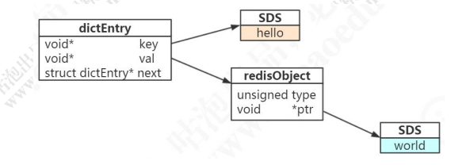

key 是字符串，但是 Redis 没有直接使用 C 的字符数组，而是存储在自定义的 SDS 中。

value 既不是直接作为字符串存储，也不是直接存储在 SDS 中，而是存储在 redisObject 中。实际上五种常用的数据类型的任何一种，都是通过 redisObject 来存储的。

**redisObject**

```c
typedef struct redisObject {
	unsigned type:4; /* 对象的类型，包括：OBJ_STRING、OBJ_LIST、OBJ_HASH、OBJ_SET、OBJ_ZSET */
	unsigned encoding:4; /* 具体的数据结构 */
	unsigned lru:LRU_BITS; /* 24 位，对象最后一次被命令程序访问的时间，与内存回收有关 */
	int refcount; /* 引用计数。当 refcount 为 0 的时候，表示该对象已经不被任何对象引用，则可以进行垃圾回收了*/
	void *ptr; /* 指向对象实际的数据结构 */
} robj;
```

**内部编码**

字符串类型的内部编码有三种： 

* int，存储 8 个字节的长整型（long，2^63-1）

* embstr, 代表 embstr 格式的 `SDS（Simple Dynamic String 简单动态字符串）`，<font color=red>存储小于 44 个字节的字符串</font>

* raw，存储大于 44 个字节的字符串

```shell
127.0.0.1:6379> set number 1
OK
127.0.0.1:6379> set qs "My name is spring,i'm a java development enginner.I'm 25 years old."
OK
127.0.0.1:6379> set jack "bighead"
OK
127.0.0.1:6379> object encoding number
"int"
127.0.0.1:6379> object encoding qs
"raw"
127.0.0.1:6379> object encoding jack
"embstr"
```

在 3.2 以后的版本中，SDS 又有多种结构（sds.h）：sdshdr5、sdshdr8、sdshdr16、sdshdr32、sdshdr64，用于存储不同的长度的字符串，分别代表2^5=32byte， 2^8=256byte，2^16=65536byte=64KB，2^32byte=4GB。

```c
/* sds.h */
struct __attribute__ ((__packed__)) sdshdr8 {
	uint8_t len; /* 当前字符数组的长度 */
	uint8_t alloc; /*当前字符数组总共分配的内存大小 */
	unsigned char flags; /* 当前字符数组的属性、用来标识到底是 sdshdr8 还是 sdshdr16 等 */
	char buf[]; /* 字符串真正的值 */
};
```

**为什么 Redis 要用 SDS 实现字符串？ **

我们知道，C 语言本身没有字符串类型（只能用字符数组 char[] 实现）。 

1. 使用字符数组必须先给目标变量分配足够的空间，否则可能会溢出

2. 如果要获取字符长度，必须遍历字符数组，时间复杂度是 O(n)

   ```c
   // string.h 获取字符长度函数
   int strlen(const char *StrDest)
   {
   	int i;
   	i=0;
   	while((*StrDest++)!='\0')
   	{ 
   		i++;c
   	}//这个循环体意思是从字符串第一个字符起计数，只遇到字符串结束标志'\0’才停止计数
   	return i;
   }
   ```

3. C 字符串长度的变更会对字符数组做内存重分配

4. 通过从字符串开始到结尾碰到的第一个 `'\0'` 来标记字符串的结束，因此不能保存图片、音频、视频、压缩文件等二进制(bytes)保存的内容，二进制不安全

SDS 的特点：

1. 不用担心内存溢出问题，如果需要会对 SDS 进行扩容

2. 获取字符串长度时间复杂度为 O(1)，因为定义了 len 属性

3. 通过“空间预分配”（ sdsMakeRoomFor）和“惰性空间释放”，防止多次重分配内存

4. 判断是否结束的标志是 len 属性（它同样以 '\0' 结尾是因为这样就可以使用 C 语言中函数库操作字符串的函数了），可以包含 '\0'

| C 字符串                                       | SDS                                            |
| ---------------------------------------------- | ---------------------------------------------- |
| 获取字符串长度的复杂度为 O(N)                  | 获取字符串长度的复杂度为 O(1)                  |
| API 是不安全的，可能会造成缓冲区溢出           | API 是安全的，不会早晨个缓冲区溢出             |
| 修改字符串长度 N 次必然需要执行 N 次内存重分配 | 修改字符串长度 N 次最多需要执行 N 次内存重分配 |
| 只能保存文本数据                               | 可以保存文本或者二进制数据                     |
| 可以使用所有库中的函数                         | 可以使用一部分库中的函数问题                   |

**embstr 和 raw 的区别？ **

embstr 的使用只分配一次内存空间（因为 RedisObject 和 SDS 是连续的），而 raw 需要分配两次内存空间（分别为 RedisObject 和 SDS 分配空间）。 

因此与 raw 相比，embstr 的好处在于创建时少分配一次空间，删除时少释放一次空间，以及对象的所有数据连在一起，寻找方便。 

而 embstr 的坏处也很明显，如果字符串的长度增加需要重新分配内存时，整个 RedisObject 和 SDS 都需要重新分配空间，<font color=red>因此 Redis 中的 embstr 实现为只读。</font> 

**int 和 embstr 什么时候转化为 raw？ **

当 int 数据大小超过了 long 的范围 （2^63-1=9223372036854775807）时，自动转化为 embstr。

当 int 数据不再是整数时自动转化为 raw。

当 embstr 数据`发生修改`时自动转化为 raw（只有`初始化`(非 apend 操作)非 int 数据或 int 数据大于 2^63-1(长度小于44)，才是 embstr 数据）。

```shell
127.0.0.1:6379> set k2 9223372036854775808
OK
127.0.0.1:6379> object encoding k2
"embstr"
127.0.0.1:6379> set k1 1
OK
127.0.0.1:6379> append k1 a
(integer) 2
127.0.0.1:6379> object encoding k1
"raw"
127.0.0.1:6379> set kk aa
OK
127.0.0.1:6379> object encoding kk
"embstr"
127.0.0.1:6379> append kk aa
(integer) 4
127.0.0.1:6379> object encoding kk
"raw"
```

**明明没有超过阈值，为什么变成 raw 了？ **

```shell
127.0.0.1:6379> set k2 a
OK
127.0.0.1:6379> object encoding k2
"embstr"
127.0.0.1:6379> append k2 b
(integer) 2
127.0.0.1:6379> object encoding k2
"raw"
```

对于 embstr，由于其实现是只读的，因此在对 embstr 对象进行修改时，都会先转化为 raw 再进行修改。 

因此，只要是修改 embstr 对象，修改后的对象一定是 raw 的，无论是否达到了 44 个字节。 

**当长度小于阈值时，会还原吗？ **

关于 Redis 内部编码的转换，都符合以下规律：编码转换在 Redis 写入数据时完成，且转换过程不可逆，只能从小内存编码向大内存编码转换（但是不包括重新set）。 

**为什么要对底层的数据结构进行一层包装呢？ **

通过封装，可以根据对象的类型动态地选择存储结构和可以使用的命令，实现节省空间和优化查询速度

#### 应用场景

**缓存**

STRING 类型

例如：热点数据缓存（例如报表，明星出轨），对象缓存，全页缓存。 

可以提升热点数据的访问速度。

**数据共享分布式**

STRING 类型

因为 Redis 是分布式的独立服务，可以在多个应用之间共享 

例如：分布式 Session

**分布式锁**
STRING 类型，setnx 方法，只有不存在时才能添加成功，返回 true。

```java
public Boolean getLock(Object lockObject){
	jedisUtil = getJedisConnetion();
	boolean flag = jedisUtil.setNX(lockObj, 1);
	if(flag){
		expire(locakObj,10);
	}
	return flag;
}
public void releaseLock(Object lockObject){
	del(lockObj);
}
```

**全局 ID**

INT 类型，INCRBY，利用原子性 

```markdown
# （分库分表的场景，一次性拿一段）
	incrby userid 1000 
```

**计数器**

INT 类型，INCR 方法

例如：文章的阅读量，微博点赞数，允许一定的延迟，先写入 Redis 再定时同步到数据库。

**限流**

INT 类型，INCR 方法

以访问者的 IP 和其他信息作为 key，访问一次增加一次计数，超过次数则返回 false。

### 1.3.2 Hash 哈希


#### 存储类型

包含键值对的无序散列表。value 只能是字符串，不能嵌套其他类型。 

同样是存储字符串，Hash 与 String 的主要区别？ 

1. 把所有相关的值聚集到一个 key 中，节省内存空间 

2. 只使用一个 key，减少 key 冲突 

3. 当需要批量获取值的时候，只需要使用一个命令，减少内存/IO/CPU 的消耗 

Hash 不适合的场景： 

1. Field 不能单独设置过期时间 

2. 没有 bit 操作 

3. 需要考虑数据量分布的问题（value 值非常大的时候，无法分布到多个节点）

#### 操作命令

```markdown
	hset h1 f 6
	hset h1 e 5
	hmset h1 a 1 b 2 c 3 d 4
	hget h1 a
	hmget h1 a b c d
	hkeys h1
	hvals h1
	hgetall h1
# key 操作
	hget exists h1
	hdel h1 a
	hlen h1
```

#### 存储（实现）原理

Redis 的 Hash 本身也是一个 KV 的结构，类似于 Java 中的 HashMap。 

外层的哈希（Redis KV 的实现）只用到了 hashtable。当存储 hash 数据类型时， 我们把它叫做内层的哈希。内层的哈希底层可以使用两种数据结构实现： 

ziplist：OBJ_ENCODING_ZIPLIST（压缩列表） 

hashtable：OBJ_ENCODING_HT（哈希表）

```bash
127.0.0.1:6379> hset h2 f aaaaaaaaaaaaaaaaaaaaaaaaaaaaaaaaaaaaaaaaaaaaaaaaaaaaaaaaaaaaaaaa
(integer) 1
127.0.0.1:6379> hset h3 f aaaaaaaaaaaaaaaaaaaaaaaaaaaaaaaaaaaaaaaaaaaaaaaaaaaaaaaaaaaaaaaaa
(integer) 1
127.0.0.1:6379> object encoding h2
"ziplist"
127.0.0.1:6379> object encoding h3
"hashtable"
```

##### ziplist 压缩列表

> /* ziplist.c 源码头部注释 */ 
>
> The ziplist is a specially encoded dually linked list that is designed to be very memory efficient. It stores both strings and integer values, where integers are encoded as actual integers instead of a series of characters. It allows push and pop operations on either side of the list in O(1) time. However, because every operation requires a reallocation of the memory used by the ziplist, the actual complexity is related to the amount of memory used by the ziplist.

ziplist 是一个经过特殊编码的双向链表，它不存储指向上一个链表节点和指向下一 个链表节点的指针，而是存储上一个节点长度和当前节点长度，通过牺牲部分读写性能， 来换取高效的内存空间利用率，是一种时间换空间的思想。只用在字段个数少，字段值小的场景里面。

**ziplist 的内部结构**

```
                                     ziplist内存布局
|-----------|-----------|----------|---------------------------------------------------|---|
    bytes      offset      length  content         {zlentry, zlentry ... ...}           end
```

```c
typedef struct ziplist{
     /*ziplist分配的内存大小*/
     uint32_t bytes;
     /*达到尾部的偏移量*/
     uint32_t tail_offset;
     /*存储元素实体个数*/
     uint16_t length;
     /*存储内容实体元素*/
     unsigned char* content[];
     /*尾部标识*/
     unsigned char end;
} ziplist;
typedef struct zlentry {
	unsigned int prevrawlensize; /* 上一个链表节点占用的长度 */
	unsigned int prevrawlen; /* 存储上一个链表节点的长度数值所需要的字节数 */
	unsigned int lensize; /* 存储当前链表节点长度数值所需要的字节数 */
	unsigned int len; /* 当前链表节点占用的长度 */
	unsigned int headersize; /* 当前链表节点的头部大小（prevrawlensize + lensize），即非数据域的大小 */
	unsigned char encoding; /* 编码方式 */
	unsigned char *p; /* 压缩链表以字符串的形式保存，该指针指向当前节点起始位置 */
} zlentry;
```

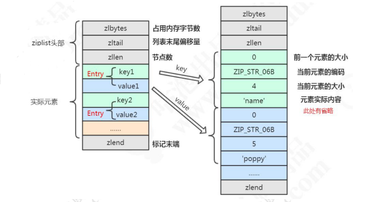

**什么时候使用 ziplist 存储**

当 hash 对象同时满足以下两个条件的时候，使用 ziplist 编码：

1. <font color=red>哈希对象保存的键值对数量小于 512 个</font>

2. <font color=red>所有的键值对的健和值的字符串长度都小于等于 64 byte（一个英文字母 一个字节）</font>

```yml
# src/redis.conf 配置
hash-max-ziplist-value 64 # ziplist 中最大能存放的值长度
hash-max-ziplist-entries 512 # ziplist 中最多能存放的 entry 节点数量
```

```c
/* 源码位置：t_hash.c ，当达字段个数超过阈值，使用 HT 作为编码 */
if (hashTypeLength(o) > server.hash_max_ziplist_entries)
	hashTypeConvert(o, OBJ_ENCODING_HT);
}
/*源码位置： t_hash.c，当字段值长度过大，转为 HT */
for (i = start; i <= end; i++) {
	if (sdsEncodedObject(argv[i]) &&
		sdslen(argv[i]->ptr) > server.hash_max_ziplist_value){
		hashTypeConvert(o, OBJ_ENCODING_HT);
		break;
	}
}
```

一个哈希对象超过配置的阈值（键值对个数>512 个，键和值的长度有>64byte）时， 会转换成哈希表（hashtable）。

##### hashtable（dict）

在 Redis 中，hashtable 被称为字典（dictionary），它是一个数组+链表的结构。 

前面我们知道了，Redis 的 KV 结构是通过一个 dictEntry 来实现的。 Redis 又对 dictEntry 进行了多层的封装。

```c
typedef struct dictEntry {
	void *key; /* key 关键字定义 */
	union {
		void *val; uint64_t u64; /* value 定义 */
		int64_t s64; double d;
	} v;
	struct dictEntry *next; /* 指向下一个键值对节点 */
} dictEntry;
```

dictEntry 放到了 dictht（hashtable 里面）：

```c
/* This is our hash table structure. Every dictionary has two of this as we
* implement incremental rehashing, for the old to the new table. */
typedef struct dictht {
	dictEntry **table; /* 哈希表数组 */
	unsigned long size; /* 哈希表大小 */
	unsigned long sizemask; /* 掩码大小，用于计算索引值。总是等于 size-1 */
	unsigned long used; /* 已有节点数 */
} dictht;
```

dictht 放到了 dict 里面：

```c
typedef struct dict {
	dictType *type; /* 字典类型 */
	void *privdata; /* 私有数据 */
	dictht ht[2]; /* 一个字典有两个哈希表 */
	long rehashidx; /* rehash 索引 */
	unsigned long iterators; /* 当前正在使用的迭代器数量 */
} dict;
```

从最底层到最高层 dictEntry —> dictht —> dict —> OBJ_ENCODING_HT 

哈希的存储结构：

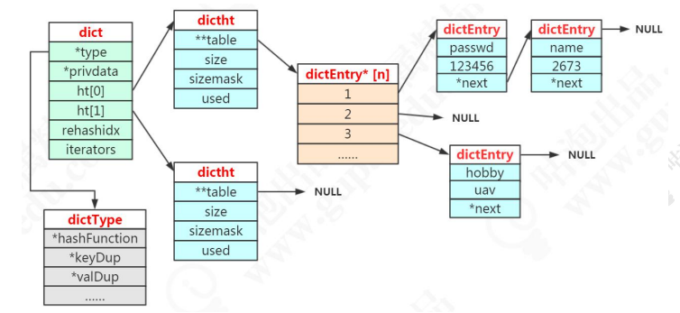

注意：dictht 后面是 NULL 说明第二个 dictht 还没用到。dictEntry*后面是 NULL 说明没有 hash 到这个地址。dictEntry 后面是 NULL 说明没有发生哈希冲突。

**为什么要定义两个哈希表呢？**

redis 的 hash 默认使用的是 ht[0]，ht[1]不会初始化和分配空间。

哈希表 dictht 是用链地址法来解决碰撞问题的。在这种情况下，哈希表的性能取决于它的大小（size 属性）和它所保存的节点的数量（used 属性）之间的比率： 

* 比率在 1:1 时（一个哈希表 ht 只存储一个节点 entry），哈希表的性能最好
* 如果节点数量比哈希表的大小要大很多的话（这个比例用 ratio 表示，5 表示平均一个 ht 存储 5 个 entry），那么哈希表就会退化成多个链表，哈希表本身的性能优势就不再存在

在这种情况下需要扩容。Redis 里面的这种操作叫做 rehash。 

rehash 的步骤： 

1. 为字符 ht[1]哈希表分配空间，这个哈希表的空间大小取决于要执行的操作，以及 ht[0]当前包含的键值对的数量。 扩展：ht[1]的大小为第一个大于等于 ht[0].used*2

2. 将所有的 ht[0]上的节点 rehash 到 ht[1]上，重新计算 hash 值和索引，然后放入指定的位置

3. 当 ht[0]全部迁移到了 ht[1]之后，释放 ht[0]的空间，将 ht[1]设置为 ht[0]表， 并创建新的 ht[1]，为下次 rehash 做准备

**什么时候触发扩容？**

负载因子（源码位置：dict.c）： 

```c
static int dict_can_resize = 1; 
static unsigned int dict_force_resize_ratio = 5; 
```

扩容判断 _dictExpandIfNeeded（源码 dict.c）:

```c
// dict_can_resize = true，Redis服务器目前没有在执行 BGSAVE 命令或 BGREWRITEAOF 命令
if (d->ht[0].used >= d->ht[0].size && (dict_can_resize || d->ht[0].used/d->ht[0].size > dict_force_resize_ratio)) {
	return dictExpand(d, d->ht[0].used*2);
}
return DICT_OK;
```

当 hash 表中元素满足如下其一条件就会开始扩容，扩容的新数组是原数组大小的 2 倍：

* Redis 服务器目前没有在执行 BGSAVE 命令或 BGREWRITEAOF 命令，并且哈希表的负载因子大于等于 1

* Redis 服务器目前在执行 BGSAVE 命令或 BGREWRITEAOF 命令，并且哈希表的负载因子大于等于 5

> 负载因子 = 哈希表已保存节点数量 / 哈希表大小  load_factor = ht[0].used / ht[0].size

当哈希表的负载因子小于 0.1 时，对哈希表执行收缩操作。

#### 应用场景

**String**

String 可以做的事情，Hash 都可以做。

**存储对象类型的数据** 

比如对象或者一张表的数据，比 String 节省了更多 key 的空间，也更加便于集中管理。 

**购物车** 

key：用户 id；field：商品 id；value：商品数量。 

+1：hincrby 1。-1：hincrby -1。删除：hdel。全选：hgetall。商品数：hlen。

### 1.3.3 List 列表

#### 存储类型 

存储有序的字符串（从左到右），元素可以重复。可以充当队列和栈的角色。

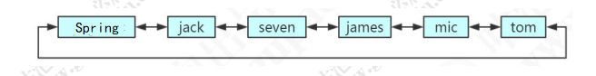

#### 操作命令

```markdown
# 元素增减
	lpush queue a
	lpush queue b c
	rpush queue d e
#  c b a d e
	lpop queue
	rpop queue
	blpop queue
	brpop queue
# 取值
	lindex queue 0
	lrange queue 0 -1
```

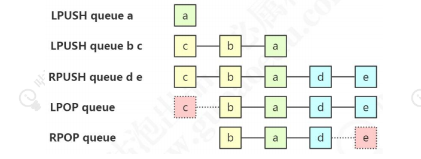

#### 存储（实现）原理 

在早期版本中，数据量较小时用 ziplist 存储，达到临界值时转换为 linkedlist 进行存储，分别对应 OBJ_ENCODING_ZIPLIST 和 OBJ_ENCODING_LINKEDLIST 。 

3.2 版本之后，统一用 quicklist 来存储。quicklist 存储了一个双向链表，每个节点都是一个 ziplist。

```shell
127.0.0.1:6379> object encoding queue
"quicklist"
```

**quicklist** 

`quicklist（快速列表）`是 ziplist 和 linkedlist 的结合体，它将 linkedList 按段切分，每一段使用 zipList 来紧凑存储，多个 zipList 之间使用双向指针串接起来。 

quicklist.h，head 和 tail 指向双向列表的表头和表尾：

```c
typedef struct quicklist {
	quicklistNode *head; /* 指向双向列表的表头 */
	quicklistNode *tail; /* 指向双向列表的表尾 */
	unsigned long count; /* 所有的 ziplist 中一共存了多少个元素 */
	unsigned long len; /* 双向链表的长度，node 的数量 */
	int fill : 16; /* fill factor for individual nodes */
	unsigned int compress : 16; /* 压缩深度，0：不压缩； */
} quicklist;
```

```yml
# redis.conf
list-max-ziplist-size（fill）
# 正数表示单个 ziplist 最多所包含的 entry 个数。
# 负数代表单个 ziplist 的大小，默认 8k。
# -1：4KB；-2：8KB；-3：16KB；-4：32KB；-5：64KB
list-compress-depth（compress）
# 压缩深度，默认是 0。
# 1：首尾的 ziplist 不压缩；2：首尾第一第二个 ziplist 不压缩，以此类推
```

quicklistNode 中的*zl 指向一个 ziplist，一个 ziplist 可以存放多个元素。

```c
typedef struct quicklistNode {
	struct quicklistNode *prev; /* 前一个节点 */
	struct quicklistNode *next; /* 后一个节点 */
	unsigned char *zl; /* 指向实际的 ziplist */
	unsigned int sz; /* 当前 ziplist 占用多少字节 */
	unsigned int count : 16; /* 当前 ziplist 中存储了多少个元素，占 16bit（下同），最大 65536 个 */
	unsigned int encoding : 2; /* 是否采用了 LZF 压缩算法压缩节点，1：RAW 2：LZF */
	unsigned int container : 2; /* 2：ziplist，未来可能支持其他结构存储 */
	unsigned int recompress : 1; /* 当前 ziplist 是不是已经被解压出来作临时使用 */
	unsigned int attempted_compress : 1; /* 测试用 */
	unsigned int extra : 10; /* 预留给未来使用 */
} quicklistNode;
```

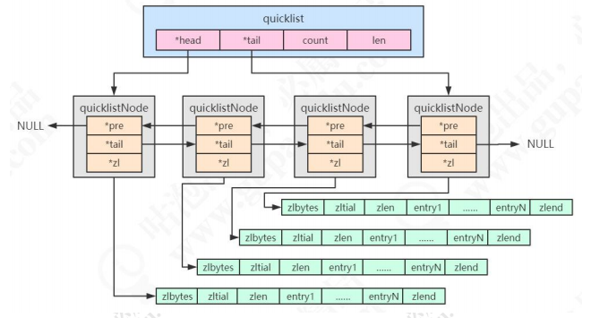

#### 应用场景 

**用户消息时间线 timeline**

因为 List 是有序的，可以用来做用户时间线

**消息队列**

List 提供了两个阻塞的弹出操作：BLPOP/BRPOP，可以设置超时时间。 

`BLPOP：BLPOP key1 timeout` 移出并获取列表的第一个元素， 如果列表没有元素 会阻塞列表直到等待超时或发现可弹出元素为止。 

`BRPOP：BRPOP key1 timeout` 移出并获取列表的最后一个元素， 如果列表没有元 素会阻塞列表直到等待超时或发现可弹出元素为止。 

队列：先进先出：rpush blpop，左头右尾，右边进入队列，左边出队列。 

栈：先进后出：rpush brpop

### 1.3.4 Set 集合

#### 存储类型

String 类型的无序集合，最大存储数量 2^32-1（40 亿左右）。


#### 操作命令

```markdown
# 添加一个或者多个元素
	sadd myset a b c d e f g
# 获取所有元素
	smembers myset
# 统计元素个数
	scard myset
# 随机获取一个元素
	srandmember myset
# 随机弹出一个元素
	spop myset
# 移除一个或者多个元素
	srem myset d e f
# 查看元素是否存在
	sismember myset a
```

#### 存储（实现）原理

Redis 用 intset 或 hashtable 存储 set。如果元素都是整数类型，就用 inset 存储。 如果不是整数类型，就用 hashtable（数组+链表的存来储结构）。 

问题：KV 怎么存储 set 的元素？key 就是元素的值，value 为 null。 

<font color=red>如果整数类型 intset 元素个数超过 512 个，也会用 hashtable 存储。</font>

```yml
# 配置文件 redis.conf
set-max-intset-entries 512
```

```shell
127.0.0.1:6379> sadd iset 1 2 3 4 5 6 7
(integer) 7
127.0.0.1:6379> object encoding iset
"intset"
127.0.0.1:6379> sadd myset a b c d e f
(integer) 4
127.0.0.1:6379> object encoding myset
"hashtable"
```

#### 应用场景

**抽奖** 

随机获取元素 spop myset 

**点赞、签到、打卡**

微博的 ID 是 t1001，用户 ID 是 u3001。 

用 like:t1001 来维护 t1001 这条微博的所有点赞用户。 

点赞了这条微博：sadd like:t1001 u3001 

取消点赞：srem like:t1001 u3001 

是否点赞：sismember like:t1001 u3001 

点赞的所有用户：smembers like:t1001 

点赞数：scard like:t1001 

比关系型数据库简单许多。

**商品标签**

用 tags:i5001 来维护商品所有的标签。

sadd tags:i5001 画面清晰细腻 

sadd tags:i5001 真彩清晰显示屏 

sadd tags:i5001 流畅至极

**商品筛选**

```markdown
# 获取差集 
	sdiff set1 set2 
# 获取交集（intersection ） 
	sinter set1 set2 
# 获取并集 
	sunion set1 set2

# iPhone12 上市了。 
	sadd brand:apple iPhone11 
	sadd brand:ios iPhone11 
	sad screensize:6.0-6.24 iPhone11 
	sad screentype:lcd iPhone11 

# 筛选商品，苹果的，iOS 的，屏幕在 6.0-6.24 之间的，屏幕材质是 LCD 屏幕 
	sinter brand:apple brand:ios screensize:6.0-6.24 screentype:lcd
```

**用户关注、推荐模型**

相互关注

我关注的人也关注了他

可能认识的人

### 1.3.5 ZSet 有序集合

#### 存储类型


sorted set，有序的 set，每个元素有个 score。 

score 相同时，按照 key 的 ASCII 码排序。

#### 操作命令

```markdown
# 添加元素
	zadd myzset 10 java 20 php 30 ruby 40 cpp 50 python
# 获取全部元素，也有倒序的 rev 操作（reverse）
	zrange myzset 0 -1 withscores
	zrevrange myzset 0 -1 withscores
# 根据分值区间获取元素
	zrangebyscore myzset 20 30
# 移除元素，也可以根据 score rank 删除
	zrem myzset php cpp
# 统计元素个数
	zcard myzset
# 分值递增
	zincrby myzset 5 python
# 根据分值统计个数
	zcount myzset 20 60
# 获取元素 rank
	zrank myzset java
# 获取元素 score
	zsocre myzset java
```

#### 存储（实现）原理

同时满足以下条件时使用 ziplist 编码： 

* 元素数量小于 128 个 

* 所有 member 的长度都小于 64 字节 

在 ziplist 的内部，按照 score 排序递增来存储。插入的时候要移动之后的数据。

```yml
# 对应 redis.conf 参数
zset-max-ziplist-entries 128
zset-max-ziplist-value 64
```

超过阈值之后，使用 skiplist+dict 存储。 

**skiplist**

我们先来看一下有序链表：

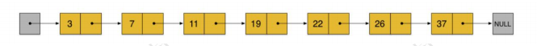

在这样一个链表中，如果我们要查找某个数据，那么需要从头开始逐个进行比较， 直到找到包含数据的那个节点，或者找到第一个比给定数据大的节点为止（没找到）。 也就是说，时间复杂度为 O(n)。同样，当我们要插入新数据的时候，也要经历同样的查 找过程，从而确定插入位置。 

而二分查找法只适用于有序数组，不适用于链表。 

假如我们每相邻两个节点增加一个指针（或者理解为有三个元素进入了第二层）， 让指针指向下下个节点。

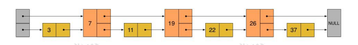

这样所有新增加的指针连成了一个新的链表，但它包含的节点个数只有原来的一半 （上图中是 7, 19, 26）。在插入一个数据的时候，决定要放到那一层，取决于一个算法 （在 redis 中 t_zset.c 有一个 zslRandomLevel 这个方法）。 

现在当我们想查找数据的时候，可以先沿着这个新链表进行查找。当碰到比待查数 据大的节点时，再回到原来的链表中的下一层进行查找。比如，我们想查找 23，查找的路径是沿着下图中标红的指针所指向的方向进行的：

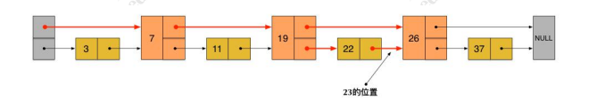

1. 23 首先和 7 比较，再和 19 比较，比它们都大，继续向后比较。 
2. 但 23 和 26 比较的时候，比 26 要小，因此回到下面的链表（原链表），与 22 比较。
3. 23 比 22 要大，沿下面的指针继续向后和 26 比较。23 比 26 小，说明待查数 据 23 在原链表中不存在 

在这个查找过程中，由于新增加的指针，我们不再需要与链表中每个节点逐个进行 比较了。需要比较的节点数大概只有原来的一半。这就是跳跃表。

#### 应用场景

**排行榜**

```markdown
# id 为 6001 的新闻点击数加 1
	zincrby hotNews:20190926 1 n6001 
# 获取今天点击最多的 15 条
	zrevrange hotNews:20190926 0 15 withscores
```

### 1.3.6 总结

**数据结构总结**

| 对象         | 对象 type 属性值 | type 命令输出 | 底层可能的存储结构                                          | object encoding                |
| ------------ | ---------------- | ------------- | ----------------------------------------------------------- | ------------------------------ |
| 字符串对象   | OBJ_STRING       | string        | OBJ_ENCODING_INT<br>OBJ_ENCODING_EMBSTR<br>OBJ_ENCODING_RAW | int 2^63-1<br>embstr 44<br>raw |
| 哈希对象     | OBJ_HASH         | hash          | OBJ_ENCODING_ZIPLIST<br/>OBJ_ENCODING_HT                    | ziplist 64 512<br/>hashtable   |
| 列表类型     | OBJ_LIST         | list          | OBJ_ENCODING_QUICKLIST                                      | quicklist                      |
| 集合对象     | OBJ_SET          | set           | OBJ_ENCODING_INTSET<br>OBJ_ENCODING_HT                      | intset 512<br>hashtable        |
| 有序集合对象 | OBJ_ZSET         | zset          | OBJ_ENCODING_ZIPLIST<br/>OBJ_ENCODING_SKIPLIST              | ziplist<br>skiplist            |

**编码转换总结**

| 对象         | 原始编码                                        | 升级编码           |      |
| ------------ | ----------------------------------------------- | ------------------ | ---- |
| 字符串对象   | INT                                             | embstr             | raw  |
|              | 整数并且小于long   2^63-1                       | 超过44字节或被修改 |      |
| 哈希对象     | ziplist                                         | hashtable          |      |
|              | 键和值长度都小于64字节并且键值个数不超过512     |                    |      |
| 列表对象     | quicklist                                       |                    |      |
| 集合对象     | intset                                          | hashtable          |      |
|              | 元素都是整数类型且元素个数小于512               |                    |      |
| 有序集合对象 | ziplist                                         | skiplist           |      |
|              | 任何一个member长度小于64字节且元素个数不超过128 |                    |      |

# 2 发布订阅模式

## 2.1 列表的局限

前面我们说通过队列的 rpush 和 lpop 可以实现消息队列（队尾进队头出），但是消费者需要不停地调用 lpop 查看 List 中是否有等待处理的消息（比如写一个 while 循环）。为了减少通信的消耗，可以 sleep()一段时间再消费，但是会有两个问题： 

1、如果生产者生产消息的速度远大于消费者消费消息的速度，List 会占用大量的内存。

2、消息的实时性降低。 

list 还提供了一个阻塞的命令：blpop，没有任何元素可以弹出的时候，连接会被阻塞。

```shell
blpop queue 5 
```

基于 list 实现的消息队列，不支持一对多的消息分发。

## 2.2 发布订阅模式

除了通过 list 实现消息队列之外，Redis 还提供了一组命令实现发布/订阅模式。这种方式，发送者和接收者没有直接关联（实现了解耦），接收者也不需要持续尝 试获取消息。 

### 2.2.1 订阅频道

首先，我们有很多的频道（channel），我们也可以把这个频道理解成 queue。订阅者可以订阅一个或者多个频道。消息的发布者（生产者）可以给指定的频道发布消息。只要有消息到达了频道，所有订阅了这个频道的订阅者都会收到这条消息。 

需要注意的注意是，发出去的消息不会被持久化，因为它已经从队列里面移除了，所以消费者只能收到它开始订阅这个频道之后发布的消息。 

下面我们来看一下发布订阅命令的使用方法。 

```markdown
# 订阅者订阅频道：可以一次订阅多个，比如这个客户端订阅了 3 个频道。 
	subscribe channel-1 channel-2 channel-3 
# 发布者可以向指定频道发布消息（并不支持一次向多个频道发送消息）： 
	publish channel-1 2673 
# 取消订阅（不能在订阅状态下使用）： 
	unsubscribe channel-1 
```

### 2.2.2 按规则（Pattern）订阅频道 

支持`?`和`*`占位符，`?`代表一个字符，`*`代表 0 个或者多个字符。 

```markdown
# 消费端 1，关注运动信息: 
	psubscribe *sport 
# 消费端 2，关注所有新闻： 
	psubscribe news* 
# 消费端 3，关注天气新闻： 
	psubscribe news-weather 
# 生产者，发布 3 条信息 
	publish news-sport yaoming 
	publish news-music jaychou 
	publish news-weather rain
```

**如何在代码中取消订阅？**

```java
// 独立线程执行
listener.punsubscribe(new String[] { "spring-*" });
```

# 3 redis 事务

## 3.1 为什么要用事务

我们知道 Redis 的单个命令是原子性的（比如 get set mget mset），如果涉及到多个命令的时候，需要把多个命令作为一个不可分割的处理序列，就需要用到事务。 

例如我们之前说的用 setnx 实现分布式锁，我们先 set，然后设置对 key 设置 expire， 防止 del 发生异常的时候锁不会被释放，业务处理完了以后再 del，这三个动作我们就希 望它们作为一组命令执行。 

Redis 的事务有两个特点： 

1. 按进入队列的顺序执行。 

2. 不会受到其他客户端的请求的影响。 

Redis 的事务涉及到四个命令：multi（开启事务），exec（执行事务），discard（取消事务），watch（监视） 

## 3.2 事务的用法

案例场景：tom 和 mic 各有 1000 元，tom 需要向 mic 转账 100 元。 

tom 的账户余额减少 100 元，mic 的账户余额增加 100 元。

```shell
127.0.0.1:6379> set tom 1000
OK
127.0.0.1:6379> set mic 1000
OK
127.0.0.1:6379> multi
OK
127.0.0.1:6379> decrby tom 100
QUEUED
127.0.0.1:6379> incrby mic 100
QUEUED
127.0.0.1:6379> exec
1) (integer) 900
2) (integer) 1100
```

通过 multi 的命令开启事务。事务不能嵌套，多个 multi 命令效果一样。 

multi 执行后，客户端可以继续向服务器发送任意多条命令， 这些命令不会立即被执行， 而是被放到一个队列中， 当 exec 命令被调用时， 所有队列中的命令才会被执 行。

通过 exec 的命令执行事务。如果没有执行 exec，所有的命令都不会被执行。 

如果中途不想执行事务了，怎么办？ 

可以调用 discard 可以清空事务队列，放弃执行。

```shell
127.0.0.1:6379> multi
OK
127.0.0.1:6379> set k1 1
QUEUED
127.0.0.1:6379> set k2 2
QUEUED
127.0.0.1:6379> set k3 3
QUEUED
127.0.0.1:6379> discard
OK
```

## 3.3 watch 命令

在 Redis 中还提供了一个 watch 命令。 

它可以为 Redis 事务提供 CAS 乐观锁行为（Check and Set / Compare and Swap），也就是多个线程更新变量的时候，会跟原值做比较，只有它没有被其他线程修改的情况下，才更新成新的值。 

我们可以用 watch 监视一个或者多个 key，如果开启事务之后，至少有一个被监视 key 键在 exec 执行之前被修改了， 那么整个事务都会被取消（key 提前过期除外）。可以用 unwatch 取消。 

```shell
127.0.0.1:6379> set balance 1000
OK
127.0.0.1:6379> watch balance
OK
127.0.0.1:6379> multi
OK
127.0.0.1:6379> incrby balance 100
QUEUED
# 此时另一个客户端对 balance 进行修改 decrby balance 100
127.0.0.1:6379> exec
(nil)
127.0.0.1:6379> get balance
"900"
```

## 3.4 事务可能遇到的问题

我们把事务执行遇到的问题分成两种，一种是在执行 exec 之前发生错误，一种是在 

执行 exec 之后发生错误。 

**在执行 exec 之前发生错误** 

比如：入队的命令存在语法错误，包括参数数量，参数名等等（编译器错误）。 

```shell
127.0.0.1:6379> multi
OK
127.0.0.1:6379> set spring 666
QUEUED
127.0.0.1:6379> hset spring 777
(error) ERR wrong number of arguments for 'hset' command
127.0.0.1:6379> exec
(error) EXECABORT Transaction discarded because of previous errors.
```

在这种情况下事务会被拒绝执行，也就是队列中所有的命令都不会得到执行。 

**在执行 exec 之后发生错误**

比如，类型错误，比如对 String 使用了 Hash 的命令，这是一种运行时错误。

```shell
127.0.0.1:6379> multi
OK
127.0.0.1:6379> set k1 1
QUEUED
127.0.0.1:6379> hset k1 a b
QUEUED
127.0.0.1:6379> exec
1) OK
2) (error) WRONGTYPE Operation against a key holding the wrong kind of value
127.0.0.1:6379> get k1
"1"
```

最后我们发现 set k1 1 的命令是成功的，也就是在这种发生了运行时异常的情况下，只有错误的命令没有被执行，但是其他命令没有受到影响。 

这个显然不符合我们对原子性的定义，也就是我们没办法用 Redis 的这种事务机制来实现原子性，保证数据的一致。

# 4 Lua 脚本

`Lua(/ˈluə/)`是一种轻量级脚本语言，它是用 C 语言编写的，跟数据的存储过程有点类似。 使用 Lua 脚本来执行 Redis 命令的好处： 

1. 一次发送多个命令，`减少网络开销`

2. Redis 会将整个脚本作为一个整体执行，不会被其他请求打断，`保持原子性`

3. 对于复杂的组合命令，我们可以放在文件中，可以实现程序之间的`命令集复用`

## 4.1 Lua 在 linux中的安装

到官网下载lua的tar.gz的源码包

```java
tar -zxvf lua-5.3.0.tar.gz
# 进入解压的目录
cd lua-5.2.0
# linux环境下编译
make linux  
make install
```

如果报错：lua.c:80:10: fatal error: readline/readline.h: 没有那个文件或目录

```java
yum -y install readline-devel ncurses-devel
# 安装完以后
make linux
make install
```

最后，直接输入 lua 命令即可进入lua的控制台

## 4.2 在Redis中调用 Lua 脚本

使用 `eval(/ɪ'væl/) `方法，语法格式： 

```shell
redis> eval lua-script key-num [key1 key2 key3 ....] [value1 value2 value3 ....] 
```

* eval 代表执行 Lua 语言的命令。 

* lua-script 代表 Lua 语言脚本内容。 

* key-num 表示参数中有多少个 key，需要注意的是 Redis 中 key 是从 1 开始的，如果没有 key 的参数，那么写 0。 

* [key1 key2 key3…]是 key 作为参数传递给 Lua 语言，也可以不填，但是需要和 key-num 的个数对应起来。 

* [value1 value2 value3 ….]这些参数传递给 Lua 语言，它们是可填可不填的。 

示例，返回一个字符串，0 个参数：

```shell
eval "return 'Hello Redis'" 0
```

在很多情况下我们都需要脚本可以有返回值，在脚本中可以使用return 语句将值返回给redis客户端，通过return语句来执行，如果没有执行return，默认返回为nil。

## 4.3 在 Lua 脚本中调用 Redis 命令

使用 redis.call(command, key [param1, param2…])进行操作。语法格式：

```shell
# KEYS 和 ARGV 必须大写 
redis> eval "redis.call('set',KEYS[1],ARGV[1])" 1 lua-key lua-value
```

* command 是命令，包括 set、get、del 等。 

* key 是被操作的键。 

* param1,param2…代表给 key 的参数。

注意跟 Java 不一样，定义只有形参，调用只有实参。 

Lua 是在调用时用 key 表示形参，argv 表示参数值（实参）。 

### 4.3.1 设置键值对

```shell
127.0.0.1:6379> eval "return redis.call('set',KEYS[1],ARGV[1])" 1 spring 666
OK
127.0.0.1:6379> get spring
"666"
```

以上命令等价于 set gupao 2673。 

在 redis-cli 中直接写 Lua 脚本不够方便，也不能实现编辑和复用，通常我们会把脚本放在文件里面，然后执行这个文件。 

### 4.3.2 在 Redis 中调用 Lua 脚本文件中的命令

```markdown
# 创建 Lua 脚本文件
	cd /usr/local/redis5.0.5/src 
	vim spring.lua 
# Lua 脚本内容，先设置，再取值
	redis.call('set','spring','lua666') 
	return redis.call('get','spring') 
# 在 Redis 客户端中调用 Lua 脚本 
	cd /usr/local/redis5.0.5/src 
	redis-cli -a 1234 --eval spring.lua 0 
# 得到返回值
	"lua666"
```

### 4.3.3 案例：对 IP 进行限流

需求：在 X 秒内只能访问 Y 次。 

设计思路：用 key 记录 IP，用 value 记录访问次数。 

拿到 IP 以后，对 IP+1。如果是第一次访问，对 key 设置过期时间（参数 1）。否则判断次数，超过限定的次数（参数 2），返回 0。如果没有超过次数则返回 1。超过时间， key 过期之后，可以再次访问。 

KEY[1]是 IP， ARGV[1]是过期时间 X，ARGV[2]是限制访问的次数 Y。 

```lua
local num=redis.call('incr',KEYS[1])
if tonumber(num)==1 then
        redis.call('expire',KEYS[1],ARGV[1])
        return 1
    elseif tonumber(num)>tonumber(ARGV[2]) then
        return 0
    else
        return 1
end
```

10 秒钟内限制访问 2 次，调用测试（连续调用几次）：

```shell
redis-cli -a 1234 --eval ip_limit.lua app:ip:limit:192.168.1.1 , 10 2
```

* app:ip:limit:192.168.8.111 是 key 值 ，后面是参数值，中间要加上一个空格和一个逗号，再加上一个空格 。 

  即：./redis-cli –eval [lua 脚本] [key…]空格,空格[args…] 

* 多个参数之间用一个空格分割 

### 4.3.4 缓存 Lua 脚本

**为什么要缓存** 

在脚本比较长的情况下，如果每次调用脚本都需要把整个脚本传给 Redis 服务端，会产生比较大的网络开销。为了解决这个问题，Redis 提供了 EVALSHA 命令，允许开发 者通过脚本内容的 SHA1 摘要来执行脚本。

**如何缓存**

Redis 在执行 script load 命令时会计算脚本的 SHA1 摘要并记录在脚本缓存中，执行 EVALSHA 命令时 Redis 会根据提供的摘要从脚本缓存中查找对应的脚本内容，如果找到了则执行脚本，否则会返回错误："NOSCRIPT No matching script. Please use EVAL." 

```shell
127.0.0.1:6379> script load "return 'Hello Redis'"
"e509eb0869056563287758d23146eb00e0518da5"
127.0.0.1:6379> evalsha "e509eb0869056563287758d23146eb00e0518da5" 0
"Hello Redis"
```

**自乘案例**

Redis 有 incrby 这样的自增命令，但是没有自乘，比如乘以 3，乘以 5。 

我们可以写一个自乘的运算，让它乘以后面的参数：

```lua
local curVal = redis.call("get", KEYS[1]) 
if curVal == false then 
  curVal = 0 
else 
  curVal = tonumber(curVal) 
end 
curVal = curVal * tonumber(ARGV[1]) 
redis.call("set", KEYS[1], curVal) 
return curVal
```

把这个脚本变成单行，语句之间使用分号隔开，使用 script load 执行：

```shell
127.0.0.1:6379> script load 'local curVal = redis.call("get", KEYS[1]); if curVal == false then curVal = 0 else curVal = tonumber(curVal) end; curVal = curVal * tonumber(ARGV[1]); redis.call("set", KEYS[1], curVal); return curVal'
"be4f93d8a5379e5e5b768a74e77c8a4eb0434441"
127.0.0.1:6379> set num 2
OK
127.0.0.1:6379> evalsha "be4f93d8a5379e5e5b768a74e77c8a4eb0434441" 1 num 6
(integer) 12
```

### 4.3.5 脚本超时

Redis 的指令执行本身是单线程的，这个线程还要执行客户端的 Lua 脚本，如果 Lua 脚本执行超时或者陷入了死循环，是不是没有办法为客户端提供服务了呢？ 

```shell
eval 'while(true) do end' 0 
```

为了防止某个脚本执行时间过长导致 Redis 无法提供服务 ， Redis 提供了 `lua-time-limit` 参数限制脚本的最长运行时间，默认为 5 秒钟。 

```yml
# （redis.conf 配置文件中） 
lua-time-limit 5000
```

当脚本运行时间超过这一限制后，Redis 将开始接受其他命令但不会执行（以确保脚本的原子性，因为此时脚本并没有被终止），而是会返回“BUSY”错误。 

Redis 提供了一个 script kill 的命令来中止脚本的执行。新开一个客户端： 

```shell
script kill
```

如果当前执行的 Lua 脚本对 Redis 的数据进行了修改（SET、DEL 等），那么通过 `script kill` 命令是不能终止脚本运行的。 

```shell
127.0.0.1:6379> eval "redis.call('set','gupao','666') while true do end" 0 
```

因为要保证脚本运行的原子性，如果脚本执行了一部分终止，那就违背了脚本原子性的要求。最终要保证脚本要么都执行，要么都不执行。 

```shell
127.0.0.1:6379> script kill 
(error) UNKILLABLE Sorry the script already executed write commands against the dataset. You can either wait the script termination or kill the server in a hard way using the SHUTDOWN NOSAVE command. 
```

遇到这种情况，只能通过 `shutdown nosave` 命令来强行终止 redis。 

shutdown nosave 和 shutdown 的区别在于 shutdown nosave 不会进行持久化操作，意味着发生在上一次快照后的数据库修改都会丢失。

### 4.3.6 Java 代码 实现 Lua 脚本实战

实现一个针对某个手机号的访问频次， 以下是lua脚本，保存为phone_limit.lua：

```java
local num=redis.call('incr',KEYS[1])
if tonumber(num)==1 then
   redis.call('expire',KEYS[1],ARGV[1])
   return 1
elseif tonumber(num)>tonumber(ARGV[2]) then
   return 0
else
   return 1
end
```

通过如下命令调用

```java
./redis-cli --eval phone_limit.lua rate.limiting:13700000000 , 10 3
```

语法为 ./redis-cli –eval [lua脚本] [key…]空格,空格[args…]

```java
public class LuaDemo {
    public static void main(String[] args) throws Exception {
        Jedis jedis = RedisManager.getJedis();

        String lua = "local num=redis.call('incr',KEYS[1])\n" +
                "if tonumber(num)==1 then\n" +
                " redis.call('expire',KEYS[1],ARGV[1])\n" +
                " return 1\n" +
                "elseif tonumber(num)>tonumber(ARGV[2]) then\n" +
                " return 0\n" +
                "else\n" +
                " return 1\n" +
                "end";
        String luaSha = jedis.scriptLoad(lua);
        System.out.println(luaSha);// e3ecace37b338749e6cfb3b6901013836f396bdc
        List<String> keys = new ArrayList<>();
        keys.add("ip:limit:127.0.0.1");
        List<String> argvs = new ArrayList<>();
        argvs.add("6000");
        argvs.add("10");
        // Object obj = jedis.eval(lua, keys, argvs);
        // 先让 redis 缓存，redis重启后，缓存会消失
        // Object obj = jedis.evalsha("e3ecace37b338749e6cfb3b6901013836f396bdc", keys, argvs);
        Object obj = jedis.evalsha(luaSha, keys, argvs);
        System.out.println(obj);
    }
}
```

# 5 Redis 为什么这么快

## 5.1 Redis 到底有多快

```shell
spring:Code spring_zhang$ redis-benchmark -t set,lpush -n 100000 -q
SET: 32743.94 requests per second		—— 每秒钟处理 3 万多次 set 请求
LPUSH: 32948.93 requests per second		—— 每秒钟处理 3 万多次 lpush 请求
spring:Code spring_zhang$ redis-benchmark -n 100000 -q script load "redis.call('set','foo','bar')"
script load redis.call('set','foo','bar'): 31877.59 requests per second		—— 每秒钟 31877 次 lua 脚本调用
```

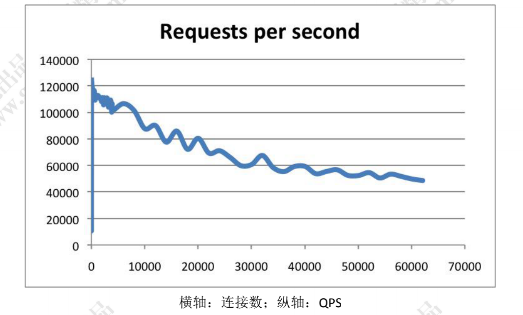

根据官方的数据，Redis 的 QPS 可以达到 10 万左右（每秒请求数）。

## 5.2 Redis 为什么这么快

<font color=red>总结：1）纯内存结构、2）单线程、3）多路复用</font>

### 5.2.1 内存

KV 结构(数据结构简单，Redis中的数据结构是专门进行设计的)的内存数据库，时间复杂度 O(1)。 

第二个，要实现这么高的并发性能，是不是要创建非常多的线程？ 

恰恰相反，Redis 是单线程的。 

### 5.2.2 单线程

单线程有什么好处呢？ 

1. 没有创建线程、销毁线程带来的消耗 

2. 避免了上线文切换导致的 CPU 消耗 

3. 避免了线程之间带来的竞争问题，例如加锁释放锁死锁等等 

### 5.2.3 异步非阻塞

异步非阻塞 I/O，多路复用处理并发连接。 

## 5.3 Redis 为什么是单线程

不是白白浪费了 CPU 的资源吗？ 

https://redis.io/topics/faq#redis-is-single-threaded-how-can-i-exploit-multiple-cpu--cores 

因为单线程已经够用了，CPU 不是 redis 的瓶颈。Redis 的瓶颈最有可能是机器内存或者网络带宽。既然单线程容易实现，而且 CPU 不会成为瓶颈，那就顺理成章地采用单线程的方案了。 

## 5.4 单线程为什么这么快

因为 Redis 是基于内存的操作，我们先从内存开始说起。 

### 5.4.1 虚拟存储器（虚拟内存 Vitual Memory）

名词解释：主存：内存；辅存：磁盘（硬盘） 

计算机主存（内存）可看作一个由 M 个连续的字节大小的单元组成的数组，每个字节有一个唯一的地址，这个地址叫做物理地址（PA）。早期的计算机中，如果 CPU 需要内存，使用物理寻址，直接访问主存储器。

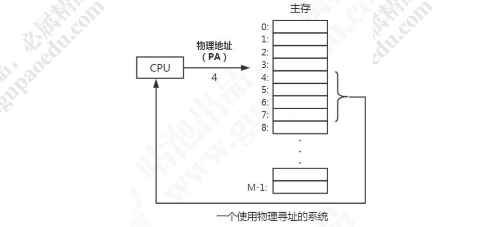

这种方式有几个弊端： 

1. 在多用户多任务操作系统中，所有的进程共享主存，如果每个进程都独占一块物理地址空间，主存很快就会被用完。我们希望在不同的时刻，不同的进程可以共用同一块物理地址空间。 

2. 如果所有进程都是直接访问物理内存，那么一个进程就可以修改其他进程的内存数据，导致物理地址空间被破坏，程序运行就会出现异常。 

为了解决这些问题，我们就想了一个办法，在 CPU 和主存之间增加一个中间层。CPU 不再使用物理地址访问，而是访问一个虚拟地址，由这个中间层把地址转换成物理地址，最终获得数据。这个中间层就叫做`虚拟存储器（Virtual Memory）`。 

具体的操作如下所示： 

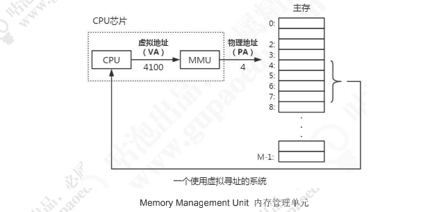

在每一个进程开始创建的时候，都会分配一段虚拟地址，然后通过虚拟地址和物理地址的映射来获取真实数据，这样进程就不会直接接触到物理地址，甚至不知道自己调用的哪块物理地址的数据。 

目前，大多数操作系统都使用了虚拟内存，如 Windows 系统的虚拟内存、Linux 系统的交换空间等等。Windows 的虚拟内存（pagefile.sys）是磁盘空间的一部分。 

在 32 位的系统上，虚拟地址空间大小是 2^32bit=4G。

在 64 位系统上，最大虚拟地址空间大小是多少？是不是 2^64bit=1024*1014TB=1024PB=16EB？

实际上没有用到 64 位，因为用不到这么大的空间，而且会造成很大的系统开销。Linux 一般用低 48 位来表示虚拟地址空间，也就是 2^48bit=256T。 

实际的物理内存可能远远小于虚拟内存的大小。 

总结：引入虚拟内存，可以提供更大的地址空间，并且地址空间是连续的，使得程序编写、链接更加简单。并且可以对物理内存进行隔离，不同的进程操作互不影响。还可以通过把同一块物理内存映射到不同的虚拟地址空间实现内存共享。 

### 5.4.2 用户空间和内核空间

为了避免用户进程直接操作内核，保证内核安全，操作系统将虚拟内存划分为两部分，一部分是`内核空间(Kernel-space)(/ˈkɜːnl/)`，一部分是`用户空间（User-space）`。 

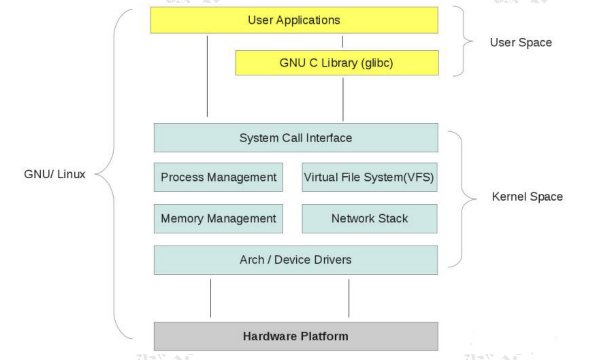

内核是操作系统的核心，独立于普通的应用程序，可以访问受保护的内存空间，也有访问底层硬件设备的权限。 

内核空间中存放的是内核代码和数据，而进程的用户空间中存放的是用户程序的代 码和数据。不管是内核空间还是用户空间，它们都处于虚拟空间中，都是对物理地址的 映射。

在 Linux 系统中, 内核进程和用户进程所占的虚拟内存比例是 1:3。 

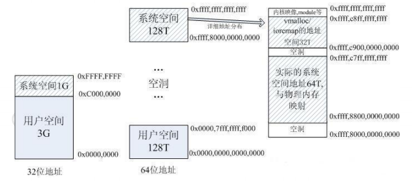

当进程运行在内核空间时就处于`内核态`，而进程运行在用户空间时则处于`用户态`。 

进程在内核空间以执行任意命令，调用系统的一切资源；在用户空间只能执行简单 的运算，不能直接调用系统资源，必须通过系统接口（又称 system call），才能向内核发出指令。 

Top 命令：

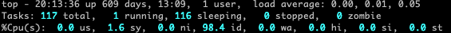

us 代表 CPU 消耗在 User space 的时间百分比

sy 代表 CPU 消耗在 Kernel space 的时间百分比

### 5.4.3 进程切换（上下文切换）

多任务操作系统是怎么实现运行远大于 CPU 数量的任务个数的？

当然，这些任务实际上并不是真的在同时运行，而是因为系统通过时间片分片算法，在很短的时间内，将 CPU 轮流分配给它们，造成多任务同时运行的错觉。 

为了控制进程的执行，内核必须有能力挂起正在 CPU 上运行的进程，并恢复以前挂 起的某个进程的执行。这种行为被称为进程切换。

什么叫上下文？ 

在每个任务运行前，CPU 都需要知道任务从哪里加载、又从哪里开始运行，也就是说，需要系统事先帮它设置好 CPU 寄存器和程序计数器(Program Counter)，这个叫做 `CPU 的上下文`。 

而这些保存下来的上下文，会存储在系统内核中，并在任务重新调度执行时再次加载进来。这样就能保证任务原来的状态不受影响，让任务看起来还是连续运行。 

在切换上下文的时候，需要完成一系列的工作，这是一个很消耗资源的操作。 

### 5.4.5 文件描述符 FD

Linux 系统将所有设备都当作文件来处理，而 Linux 用`文件描述符`来标识每个文件对象。

文件描述符（File Descriptor）是内核为了高效管理已被打开的文件所创建的索引，用于指向被打开的文件，所有执行 I/O 操作的系统调用都通过文件描述符；文件描述符是一个简单的非负整数，用以表明每个被进程打开的文件。 

Linux 系统里面有三个标准文件描述符。 

0：标准输入（键盘）；1：标准输出（显示器）；2：标准错误输出（显示器）。 

### 5.4.6 传统 I/O 数据拷贝

以读操作为例： 

当应用程序执行 read 系统调用读取文件描述符（FD）的时候，如果这块数据已经存在于用户进程的页内存中，就直接从内存中读取数据。如果数据不存在，则先将数据从磁盘加载数据到内核缓冲区中，再从内核缓冲区拷贝到用户进程的页内存中。（两次 拷贝，两次 user 和 kernel 的上下文切换）。 

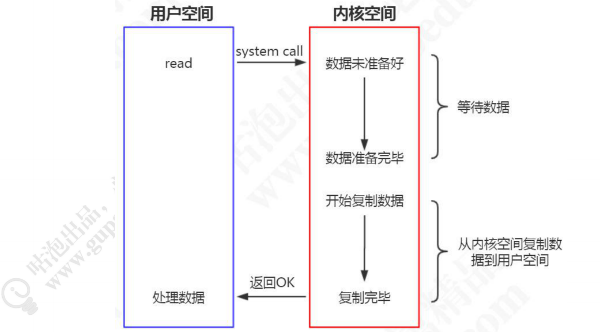

### 5.4.7 Blocking I/O

当使用 read 或 write 对某个文件描述符进行过读写时，如果当前 FD 不可读，系统就不会对其他的操作做出响应。从设备复制数据到内核缓冲区是阻塞的，从内核缓冲区拷贝到用户空间，也是阻塞的，直到 copy complete，内核返回结果，用户进程才解除 block 的状态。 

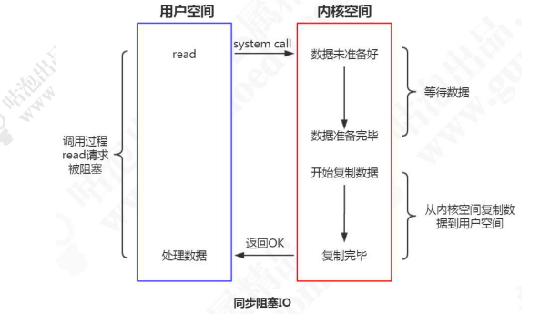

为了解决阻塞的问题，我们有几个思路： 

1. 在服务端创建多个线程或者使用线程池，但是在高并发的情况下需要的线程会很多，系统无法承受，而且创建和释放线程都需要消耗资源。 

2. 由请求方定期轮询，在数据准备完毕后再从内核缓存缓冲区复制数据到用户空间（非阻塞式 I/O），这种方式会存在一定的延迟。 

能不能用一个线程处理多个客户端请求？ 

### 5.4.8 I/O 多路复用（I/O Multiplexing）

`I/O` 指的是网络 I/O

`多路`指的是多个 TCP 连接（Socket 或 Channel）

`复用`指的是复用一个或多个线程

它的基本原理就是不再由应用程序自己监视连接，而是由内核替应用程序监视文件描述符。 

> Redis 是单线程，其实是说 Redis 的核心组件——`文件事件处理器是单线程的`，文件事件处理器包括轮询程序，队列，文件事件分派器，应答器，执行器和返回器，这一系列流程是单线程完成的，但 Redis 本身不是单线程的。

Redis 客户端对服务端的每次调用都经历了发送命令，执行命令，返回结果三个过程。其中执行命令阶段，由于 Redis 是单线程来处理命令的，所有到达服务端的命令都不会立刻执行，所有的命令都会进入一个队列中，然后逐个执行，并且多个客户端发送的命令的执行顺序是不确定的，但是可以确定的是不会有两条命令被同时执行，不会产生并发问题，这就是`Redis的单线程基本模型`。

Redis 服务器通过 socket（套接字）与客户端或其他 Redis 服务器进行连接(产生具有不同事件类型的 socket)，而文件事件就是服务器对 socket 操作的抽象。服务器与客户端或其他服务器的通信会产生相应的文件事件，而服务器通过监听并处理这些事件来完成一系列网络通信操作。

Redis 基于 Reactor 模式开发了自己的网络事件处理器——`文件事件处理器`，文件事件处理器使用`I/O多路复用程序（I/O Multiplexing Module）`来同时监听多个 socket，并根据 socket 目前执行的任务来为 socket 关联不同的事件处理器。当被监听的 socket 准备好执行连接应答、读取、写入、关闭等操作时，与操作相对应的文件事件就会产生，这时文件事件处理器就会把消息放入队列中，然后通过`文件事件分派器（File event Dispatcher）`，转发到 socket 之前已关联好的事件处理器来处理这些事件。

文件事件处理器的构成：

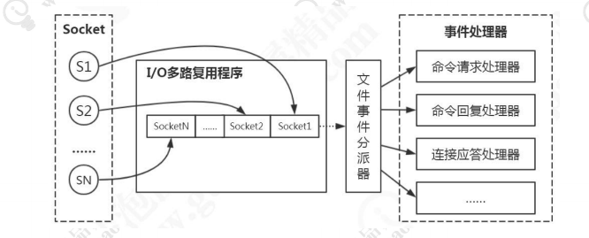

> 其中 I/O 多路复用程序通过`队列`向文件事件分派器传送 socket

多路复用有很多的实现，以 select 为例，当用户进程调用了多路复用器，进程会被阻塞。内核会监视多路复用器负责的所有 socket，当任何一个 socket 的数据准备好了， 多路复用器就会返回。这时候用户进程再调用 read 操作，把数据从内核缓冲区拷贝到用户空间。 

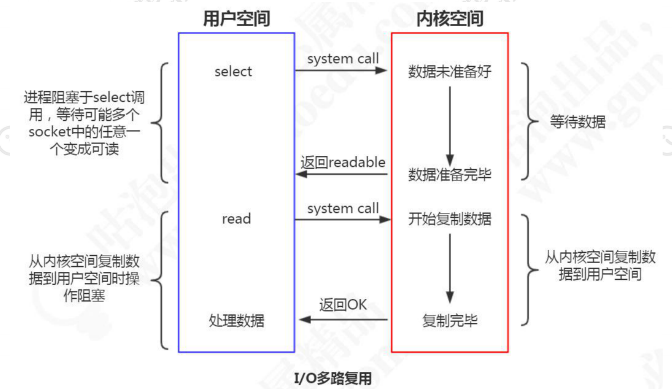

所以，I/O 多路复用的特点是通过一种机制一个进程能同时等待多个文件描述符，而这些文件描述符（套接字描述符）其中的任意一个进入读就绪（readable）状态，select()函数就可以返回。 

`Redis 的多路复用`， 提供了 select, epoll, evport, kqueue 几种选择，在编译的时候来选择一种。

源码 ae.c 

```c
#ifdef HAVE_EVPORT 
#include "ae_evport.c" 
#else 
	#ifdef HAVE_EPOLL 
	#include "ae_epoll.c" 
	#else
		#ifdef HAVE_KQUEUE 
		#include "ae_kqueue.c" 
		#else 
		#include "ae_select.c" 
		#endif 
	#endif 
#endif
```

evport 是 Solaris 系统内核提供支持的； 

epoll 是 LINUX 系统内核提供支持的； 

kqueue 是 Mac 系统提供支持的； 

select 是 POSIX 提供的，一般的操作系统都有支撑（保底方案）； 

源码 ae_epoll.c、ae_select.c、ae_kqueue.c、ae_evport.c 

# 6 内存回收

Reids 所有的数据都是存储在内存中的，在某些情况下需要对占用的内存空间进行回收。内存回收主要分为两类，一类是 key 过期，一类是内存使用达到上限（max_memory）触发内存淘汰。 

## 6.1 过期策略

Redis 通过一个叫做`过期字典`（可以看作是hash表）来保存数据过期的时间。过期字典的键指向 Redis 数据库中的某个key(键)，过期字典的值是一个long long类型的整数，这个整数保存了key所指向的数据库键的过期时间（毫秒精度的UNIX时间戳）。

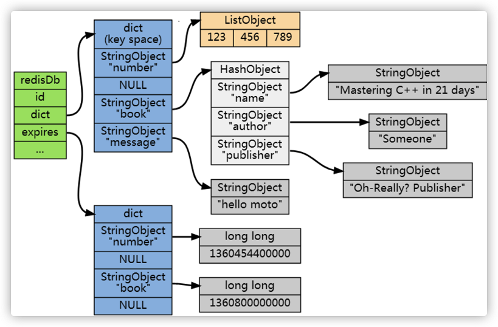

过期字典是存储在redisDb这个结构里的：

```c
// server.h 
typedef struct redisDb { 
	dict *dict; /* 所有的键值对 */ 
	dict *expires; /* 设置了过期时间的键值对 */ 
	dict *blocking_keys; /* Keys with clients waiting for data (BLPOP)*/ 
	dict *ready_keys; /* Blocked keys that received a PUSH */ 
	dict *watched_keys; /* WATCHED keys for MULTI/EXEC CAS */ 
	int id; /* Database ID */ 
	long long avg_ttl; /* Average TTL, just for stats */ 
	list *defrag_later; /* List of key names to attempt to defrag one by one, gradually. */ 
} redisDb; 
```

要实现 key 过期，我们有几种思路。 

### 6.1.1 定时过期（主动淘汰）

每个设置过期时间的 key 都需要创建一个定时器，到过期时间就会立即清除。该策略可以立即清除过期的数据，对内存很友好；但是会占用大量的 CPU 资源去处理过期的数据，从而影响缓存的响应时间和吞吐量。 

### 6.1.2 惰性过期（被动淘汰）

只有当访问一个 key 时，才会判断该 key 是否已过期，过期则清除。该策略可以最大化地节省 CPU 资源，却对内存非常不友好。极端情况可能出现大量的过期 key 没有再次被访问，从而不会被清除，占用大量内存。 

例如 String，在 getCommand 里面会调用 expireIfNeeded 

server.c expireIfNeeded(redisDb *db, robj *key)

第二种情况，每次写入 key 时，发现内存不够，调用 activeExpireCycle 释放一部分内存。

expire.c activeExpireCycle(int type) 

### 6.1.3 定期过期

每隔一定的时间，会扫描一定数量的数据库的 `expires 字典`中一定数量的 key，并清除其中已过期的 key。该策略是前两者的一个折中方案。通过调整定时扫描的时间间隔和每次扫描的限定耗时，可以在不同情况下使得 CPU 和内存资源达到最优的平衡效果。 

<font color=red>Redis 中同时使用了惰性过期和定期过期两种过期策略。 </font>

问题：如果都不过期，Redis 内存满了怎么办？ 

## 6.2 淘汰策略

Redis 的内存淘汰策略，是指当内存使用达到最大内存极限时，需要使用淘汰算法来决定清理掉哪些数据，以保证新数据的存入。

### 6.2.1 最大内存设置

```yml
# redis.conf 参数配置
maxmemory <bytes> 
```

如果不设置 maxmemory 或者设置为 0，64 位系统不限制内存，32 位系统最多使用 3GB 内存。

动态修改： 

```shell
redis> config set maxmemory 2GB
```

到达最大内存以后怎么办？ 

### 6.2.2 淘汰策略

https://redis.io/topics/lru-cache 

```yml
redis.conf 
# maxmemory-policy noeviction 
# volatile-lru -> Evict using approximated LRU among the keys with an expire set. 
# allkeys-lru -> Evict any key using approximated LRU. 
# volatile-lfu -> Evict using approximated LFU among the keys with an expire set. 
# allkeys-lfu -> Evict any key using approximated LFU. 
# volatile-random -> Remove a random key among the ones with an expire set. 
# allkeys-random -> Remove a random key, any key. 
# volatile-ttl -> Remove the key with the nearest expire time (minor TTL) 
# noeviction -> Don't evict anything, just return an error on write operations. 
```

先从算法来看： 

LRU，Least Recently Used：最近最少使用。判断最近被使用的时间，目前最远的数据优先被淘汰。 

LFU，Least Frequently Used，最不常用，4.0 版本新增。 

random，随机删除。 

| 策略            | 含义                                                         |
| --------------- | ------------------------------------------------------------ |
| volatile-lru    | 根据 LRU 算法删除设置了超时属性（expire）的键，直到腾出足够内存为止。如果没有可删除的键对象，回退到 noeviction 策略。 |
| allkeys-lru     | 根据 LRU 算法删除键，不管数据有没有设置超时属性，直到腾出足够内存为止。 |
| volatile-lfu    | 在带有过期时间的键中选择最不常用的。                         |
| allkeys-lfu     | 在所有的键中选择最不常用的，不管数据有没有设置超时属性。     |
| volatile-random | 在带有过期时间的键中随机选择。                               |
| allkeys-random  | 随机删除所有键，直到腾出足够内存为止。                       |
| volatile-ttl    | 根据键值对象的 ttl 属性，删除最近将要过期数据。如果没有，回退到 noeviction 策略。 |
| noeviction      | 默认策略，不会删除任何数据，拒绝所有写入操作并返回客户端错误信息（error）OOM command not allowed when used memory，此时 Redis 只响应读操作。 |

如果没有符合前提条件的 key 被淘汰，那么 volatile-lru、volatile-random 、volatile-ttl 相当于 noeviction（不做内存回收）。 

动态修改淘汰策略： 

```shell
redis> config set maxmemory-policy volatile-lru
```

 建议使用 volatile-lru，在保证正常服务的情况下，优先删除最近最少使用的 key。 

### 6.2.3 LRU 淘汰原理

**问题：如果基于传统 LRU 算法实现 Redis LRU 会有什么问题？**

需要额外的数据结构存储，消耗内存。 

Redis LRU 对传统的 LRU 算法进行了改良，通过随机采样来调整算法的精度。 

如果淘汰策略是 LRU，则根据配置的采样值 `maxmemory_samples`（默认是 5 个），随机从数据库中选择 m 个 key，淘汰其中热度最低的 key 对应的缓存数据。所以采样数m配置的数值越大，就越能精确的查找到待淘汰的缓存数据，但是也消耗更多的CPU计算，执行效率降低。 

**问题：如何找出热度最低的数据？**

Redis 中所有对象结构都有一个 lru 字段, 且使用了 unsigned 的低 24 位，这个字段用来记录对象的热度。对象被创建时会记录 lru 值。在被访问的时候也会更新 lru 的值。 

但不是获取系统当前的时间戳，而是设置为`全局变量 server.lruclock` 的值。 

```c
// server.h
typedef struct redisObject { 
	unsigned type:4; 
	unsigned encoding:4; 
	unsigned lru:LRU_BITS; /* LRU time (relative to global lru_clock) or 
					      * LFU data (least significant 8 bits frequency 
					      * and most significant 16 bits access time). */ 
	int refcount; 
	void *ptr; 
} robj;
```

server.lruclock 的值怎么来的？ 

Redis 中有个定时处理的函数 serverCron ， 默认每 100 毫秒调用函数 getLRUClock 更新一次全局变量的 server.lruclock 的值，它记录的是当前 unix 时间戳。

```c
// server.h
int serverCron(struct aeEventLoop *eventLoop, long long id, void *clientData) {
	...
    unsigned int lruclock = getLRUClock();
    atomicSet(server.lruclock,lruclock);
    ...
}
// evict.c
unsigned int getLRUClock(void) {
    // LRU_CLOCK_RESOLUTION 代表LRU算法的精度，即一个LRU的单位是多长时间
    // LRU_CLOCK_MAX 代表逻辑时钟的最大位数，类似现实中的表盘，划分了最大的刻度，一个刻度是一个LRU大小
    // 所以整个方法表示的含义为：当前时间是LRU的单位的多少倍，即已经过了多少个LRU，然后对最大刻度LRU_CLOCK_MAX取模
    return (mstime()/LRU_CLOCK_RESOLUTION) & LRU_CLOCK_MAX;
}
```

**问题：为什么不获取精确的时间而是放在全局变量中？不会有延迟的问题吗？**

这样函数 lookupKey 中更新数据的 lru 热度值时,就不用每次调用系统函数 mstime()，可以提高执行效率。 

OK，当对象里面已经有了 LRU 字段的值，就可以评估对象的热度了。 

函数 estimateObjectIdleTime 评估指定对象的 lru 热度，思想就是对象的 lru 值和全局的 server.lruclock 的差值越大（越久没有得到更新）， 该对象热度越低。 

```c
// evict.c 
unsigned long long estimateObjectIdleTime(robj *o) { 
	unsigned long long lruclock = LRU_CLOCK(); 
	if (lruclock >= o->lru) { 
		return (lruclock - o->lru) * LRU_CLOCK_RESOLUTION; 
	} else { 
		return (lruclock + (LRU_CLOCK_MAX - o->lru)) * 
				LRU_CLOCK_RESOLUTION; 
	} 
} 
// server.hz代表服务器刷新的频率，意思是如果服务器的时间更新精度值比LRU的精度值要小（精度值表示一次刷新的间隔时间，越小精度越高），说明服务器的精度更高，直接用服务器的时间
// 举例如果服务器精度是10ms， LRU精度是100ms，则在100ms内服务器进行10次刷新，得到的server.lrulock都是一样，既然如此，不必调用getLRUCLOCK()函数增加额外的开销
unsigned int LRU_CLOCK(void) {
    unsigned int lruclock;
    if (1000/server.hz <= LRU_CLOCK_RESOLUTION) {
        atomicGet(server.lruclock,lruclock);
    } else {
        lruclock = getLRUClock();
    }
    return lruclock;
}
```

server.lruclock 只有 24 位，按秒为单位来表示才能存储 97 天。当超过 24bit 能表示的最大时间的时候，它会从头开始计算。 

在这种情况下，可能会出现对象的 lru 大于 server.lruclock 的情况，如果这种情况出现那么就 lruclock + (MAX - lru) 来求最久的 key。 

为什么不用常规的哈希表+双向链表的方式实现？需要额外的数据结构，消耗资源。而 Redis LRU 算法在 sample 为 10 的情况下，已经能接近传统 LRU 算法了。 

https://redis.io/topics/lru-cache

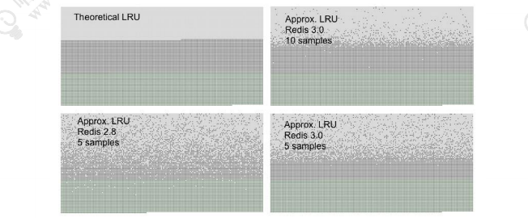

**问题：除了消耗资源之外，传统 LRU 还有什么问题？**

如图，假设 A 在 10 秒内被访问了 5 次，而 B 在 10 秒内被访问了 3 次。因为 B 最后一次被访问的时间比 A 要晚，在同等的情况下，A 反而先被回收。 


问题：要实现基于访问频率的淘汰机制，怎么做？ 

### 6.2.4 LFU

```c
// server.h 
typedef struct redisObject { 
	unsigned type:4; 
	unsigned encoding:4; 
	unsigned lru:LRU_BITS; /* LRU time (relative to global lru_clock) or 
						  * LFU data (least significant 8 bits frequency 
						  * and most significant 16 bits access time). */ 
	int refcount; 
	void *ptr; 
} robj;
```

当这 24 bits 用作 LFU 时，其被分为两部分： 

* 高 16 位用来记录访问时间（单位为分钟，ldt，last decrement time） 

* 低 8 位用来记录访问频率，简称 counter（logc，logistic counter） 

counter 是用基于概率的对数计数器实现的，8 位可以表示百万次的访问频率。对象被读写的时候，lfu 的值会被更新。 

`counter`并不是简单的访问一次就 +1，而是采用了一个 0-1 之间的 p 因子控制增长。

```c
// db.c
robj *lookupKey(redisDb *db, robj *key, int flags) {
    dictEntry *de = dictFind(db->dict,key->ptr);
    if (de) {
        robj *val = dictGetVal(de);

        /* Update the access time for the ageing algorithm.
         * Don't do it if we have a saving child, as this will trigger
         * a copy on write madness. */
        if (server.rdb_child_pid == -1 &&
            server.aof_child_pid == -1 &&
            !(flags & LOOKUP_NOTOUCH))
        {
            if (server.maxmemory_policy & MAXMEMORY_FLAG_LFU) {
                updateLFU(val);
            } else {
                val->lru = LRU_CLOCK();
            }
        }
        return val;
    } else {
        return NULL;
    }
}
void updateLFU(robj *val) { 
	unsigned long counter = LFUDecrAndReturn(val); 
	counter = LFULogIncr(counter); 
	val->lru = (LFUGetTimeInMinutes()<<8) | counter; 
}
uint8_t LFULogIncr(uint8_t counter) {
    // counter 最大值为255
    if (counter == 255) return 255;
    // 取一个 0-1 之间的随机数 r 与 p 比较
    double r = (double)rand()/RAND_MAX;
    // p 取决于当前 counter 值与 lfu_log_factor 因子，counter 值与 lfu_log_factor 因子越大，p越小，r < p的概率也越小，counter 增长的概率也就越小
    double baseval = counter - LFU_INIT_VAL;
    if (baseval < 0) baseval = 0;
    double p = 1.0/(baseval*server.lfu_log_factor+1);
    // 当 r < p 时，才增加 counter 
    if (r < p) counter++;
    return counter;
}
```

增长情况如下：

| factor | 100 hits | 1000 hits | 100K hits | 1M hits | 10M hits |
| ------ | -------- | --------- | --------- | ------- | -------- |
| 0      | 104      | 255       | 255       | 255     | 255      |
| 1      | 18       | 49        | 255       | 255     | 255      |
| 10     | 10       | 18        | 142       | 255     | 255      |
| 100    | 8        | 11        | 49        | 143     | 255      |

可见`counter`增长与访问次数呈现对数增长的趋势，随着访问次数越来越大，`counter`增长的越来越慢。

```yml
# redis.conf 配置文件 
# lfu-log-factor 10 
```

**如果计数器只会递增不会递减，也不能体现对象的热度。没有被访问的时候，计数器怎么递减呢？ **

```c
// LFUDecrAndReturn 对 counter 进行减少操作
unsigned long LFUDecrAndReturn(robj *o) {
    unsigned long ldt = o->lru >> 8; // 取得高16 bits的最近降低时间 ldt
    unsigned long counter = o->lru & 255; // 低8 bits的计数器 counter
    // 用差值与配置 lfu_decay_time 相除，已过去 n 个 lfu_decay_time，则将 counter 减少 n
    unsigned long num_periods = server.lfu_decay_time ? LFUTimeElapsed(ldt) / server.lfu_decay_time : 0;
    if (num_periods)
        counter = (num_periods > counter) ? 0 : counter - num_periods;
    return counter;
}
// 当前时间转化成分钟数后取低16 bits，然后计算与ldt的差值 now - ldt
// 当ldt > now时，默认为过了一个周期(16 bits，最大65535)，取值65535 - ldt + now。
unsigned long LFUTimeElapsed(unsigned long ldt) {
    unsigned long now = LFUGetTimeInMinutes();
    if (now >= ldt) return now-ldt;
    return 65535-ldt+now;
}
unsigned long LFUGetTimeInMinutes(void) {
    return (server.unixtime/60) & 65535;
}
```

减少的值由衰减因子 lfu-decay-time（分钟）来控制，如果值是 1 的话，N 分钟没有访问就要减少 N。 

```yml
# redis.conf 配置文件
# lfu-decay-time 1
```

# 7 持久化机制

https://redis.io/topics/persistence 

Redis 速度快，很大一部分原因是因为它所有的数据都存储在内存中。如果断电或者宕机，都会导致内存中的数据丢失。为了实现重启后数据不丢失，Redis 提供了两种持久化的方案，一种是 `RDB 快照（Redis DataBase）`，一种是 `AOF（Append Only File）`。

## 7.1 RDB

RDB 是 Redis 默认的持久化方案。当满足一定条件的时候，会把当前内存中的数据写入磁盘，生成一个快照文件 `dump.rdb`。Redis 重启会通过加载 dump.rdb 文件恢复数据。

### 7.1.1 RDB 触发

**自动触发**

redis.conf， SNAPSHOTTING，其中定义了触发把数据保存到磁盘的触发频率。 

如果不需要 RDB 方案，注释 save 或者配置成空字符串""。 

```yml
# 默认配置
# 当在900秒内被更改的key的数量大于1的时候，就执行快照
save 900 1 # 900 秒内至少有一个 key 被修改（包括添加） 
save 300 10 # 400 秒内至少有 10 个 key 被修改 
save 60 10000 # 60 秒内至少有 10000 个 key 被修改
```

注意上面的配置是不冲突的，只要满足任意一个都会触发。 

RDB 文件位置和目录： 

```yml
# 文件路径， 
dir ./ 
# 文件名称 
dbfilename dump.rdb 
# 是否是 LZF 压缩 rdb 文件,开启压缩可以节省存储空间，但是会消耗一些 CPU 的计算时间，默认开启
rdbcompression yes 
# 开启数据校验,使用 CRC64 算法来进行数据校验，但是这样做会增加大约 10%的性能消耗，如果希望获取到最大的性能提升，可以关闭此功能。
rdbchecksum yes
```

**问题：为什么停止 Redis 服务的时候没有 save，重启数据还在？**

RDB 还有两种触发方式： 

1. shutdown 触发，保证服务器正常关闭。 

2. flushall，RDB 文件是空的，没什么意义（删掉 dump.rdb 演示一下）。 

**手动触发** 

如果我们需要重启服务或者迁移数据，这个时候就需要手动触发 RDB 快照保存。Redis 提供了两条命令： 

a）save 

save 在生成快照的时候会阻塞当前 Redis 服务器， Redis 不能处理其他命令。如果内存中的数据比较多，会造成 Redis 长时间的阻塞。生产环境不建议使用这个命令。 

为了解决这个问题，Redis 提供了第二种方式。

b）bgsave 

执行 bgsave 时，Redis 会在后台异步进行快照操作，快照同时还可以响应客户端请求。

具体操作是 Redis 进程执行 `fork` 操作创建子进程（copy-on-write），RDB 持久化过程由子进程负责，完成后自动结束。它不会记录 fork 之后后续的命令。阻塞只发生在 fork 阶段，一般时间很短。 

用 lastsave 命令可以查看最近一次成功生成快照的时间。 

### 7.1.2 RDB 数据的恢复（演示）

```markdown
# 1、shutdown 持久化 
# 添加键值 
	redis> set k1 1 
	redis> set k2 2 
	redis> set k3 3 
	redis> set k4 4 
	redis> set k5 5 
# 停服务器，触发 save
	redis> shutdown 
# 备份 dump.rdb 文件
	cp dump.rdb dump.rdb.bak 
# 启动服务器 
	/usr/local/redis-5.0.5/src/redis-server /usr/local/redis-5.0.5/redis.conf 
# 数据都在
	redis> keys * 

# 2、模拟数据丢失
# 模拟数据丢失，触发 save 
	redis> flushall 
# 停服务器 
	redis> shutdown
# 启动服务器 
	/usr/local/redis-5.0.5/src/redis-server /usr/local/redis-5.0.5/redis.conf 
# 啥都没有
	redis> keys * 

# 3、通过备份文件恢复数据 
# 停服务器 
	redis> shutdown 
# 重命名备份文件 
	mv dump.rdb.bak dump.rdb 
# 启动服务器
	/usr/local/redis-5.0.5/src/redis-server /usr/local/redis-5.0.5/redis.conf 
# 查看数据 
	redis> keys *
```

### 7.1.3 RDB的优缺点

#### RDB的优点

1. RDB 是一个非常紧凑（compact）的文件，它保存了 Redis 在某个时间点上的数据集。这种文件非常适合用于进行备份：比如说，你可以在最近的 24 小时内，每小时备份一次 RDB 文件，并且在每个月的每一天，也备份一个 RDB 文件。这样的话，即使遇上问题，也可以随时将数据集还原到不同的版本。
2. RDB 非常适用于灾难恢复（disaster recovery）：它只有一个文件，并且内容都非常紧凑，可以（在加密后）将它传送到别的数据中心，或者亚马逊 S3 中。
3. RDB 可以最大化 Redis 的性能：父进程在保存 RDB 文件时唯一要做的就是 fork 出一个子进程，然后这个子进程就会处理接下来的所有保存工作，父进程无须执行任何磁盘 I/O 操作。
4. RDB 在恢复大数据集时的速度比 AOF 的恢复速度要快

#### RDB的缺点

1. 如果你需要尽量避免在服务器故障时丢失数据，那么 RDB 不适合你。虽然 Redis 允许你设置不同的保存点（save point）来控制保存 RDB 文件的频率， 但是， 因为RDB 文件需要保存整个数据集的状态， 所以它并不是一个轻松的操作。因此你可能会至少 5 分钟才保存一次 RDB 文件。在这种情况下， 一旦发生故障停机， 你就可能会丢失好几分钟的数据。
2. 每次保存 RDB 的时候，Redis 都要 fork() 出一个子进程，并由子进程来进行实际的持久化工作。在数据集比较庞大时， fork()可能会非常耗时，造成服务器在几毫秒甚至可能会长达整整一秒内停止处理客户端；虽然 AOF 重写也需要进行 fork() ，但可以调整重写日志的频率，而不需要在持久性上进行任何权衡。

## 7.2 AOF

Append Only File 

AOF：Redis 默认不开启。AOF 采用日志的形式来记录每个写操作，并`追加`到文件中。开启后，执行更改 Redis 数据的命令时，就会把命令写入到 AOF 文件中。 

Redis 重启时会根据日志文件的内容把写指令从前到后执行一次以完成数据的恢复工作。

### 7.2.1 AOF 配置

```yml
# 开关,Redis 默认只开启 RDB 持久化，开启 AOF 需要修改为 yes
appendonly no 
# 文件名,路径也是通过 dir 参数配置 config get dir
appendfilename "appendonly.aof"
```

**问题：数据都是实时持久化到磁盘吗？**

由于操作系统的缓存机制，AOF 数据并没有真正地写入硬盘，而是进入了系统的硬盘缓存。什么时候把缓冲区的内容写入到 AOF 文件？ 

`appendfsync everysec`

AOF 持久化策略（硬盘缓存到磁盘），默认 everysec 

* no 表示不执行 fsync，由操作系统保证数据同步到磁盘，速度最快，但是不太安全； 

* always 表示每次写入都执行 fsync，以保证数据同步到磁盘，效率很低； 

* everysec 表示每秒执行一次 fsync，可能会导致丢失这 1s 数据。通常选择 everysec ，兼顾安全性和效率。

**问题：文件越来越大，怎么办？**

由于 AOF 持久化是 Redis 不断将写命令记录到 AOF 文件中，随着 Redis 不断的进行，AOF 的文件会越来越大，文件越大，占用服务器内存越大以及 AOF 恢复要求时间越长。

例如 set spring 666，执行 1000 次，结果都是 spring=666。 

为了解决这个问题，Redis 新增了重写机制，当 AOF 文件的大小超过所设定的阈值时，Redis 就会启动 AOF 文件的内容压缩，只保留可以恢复数据的最小指令集。

可以使用命令 `bgrewriteaof` 来重写。 

AOF 文件重写并不是对原文件进行重新整理，而是直接读取服务器现有的键值对，然后用一条命令去代替之前记录这个键值对的多条命令，生成一个新的文件后去替换原来的 AOF 文件。

 ``auto-aof-rewrite-percentage 100`` 默认值为 100。aof 自动重写配置，当目前 aof 文件大小超过上一次重写的 aof 文件大小的百分之多少进行重写，即当 aof 文件增长到一定大小的时候，Redis 能够调用 bgrewriteaof 对日志文件进行重写。当前 AOF 文件大小是上次日志重写得到 AOF 文件大小的二倍（设置为 100）时，自动启动新的日志重写过程。

``auto-aof-rewrite-min-size 64mb`` 默认 64M。设置允许重写的最小 aof 文件大小，避免了达到约定百分比但尺寸仍然很小的情况还要重写。

**问题：重写过程中，AOF 文件被更改了怎么办？**

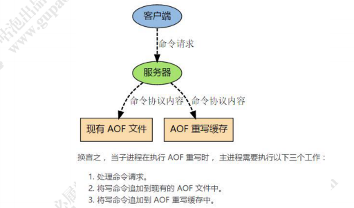

整个重写操作是绝对安全的，因为 Redis 在创建新 AOF 文件的过程中，会继续将命令追加到现有的 AOF 文件里面，即使重写过程中发生停机，现有的 AOF 文件也不会丢失。 而一旦新 AOF 文件创建完毕，Redis 就会从旧 AOF 文件切换到新 AOF 文件，并开始对新 AOF 文件进行追加操作。

另外有两个与 AOF 相关的参数： 

`no-appendfsync-on-rewrite` 在 aof 重写或者写入 rdb 文件的时候，会执行大量 IO，此时对于 everysec 和 always 的 aof 模式来说，执行 fsync 会造成阻塞过长时间，no-appendfsync-on-rewrite 字段设置为默认设置为 no (这样对持久化特性来说这是更安全的选择)。如果对延迟要求很高的应用，这个字段可以设置为 yes。设置为 yes 表示重写期间对新写操作不 fsync，暂时存在内存中，等重写完成后再写入。Linux 的默认 fsync 策略是 30 秒，可能丢失 30 秒数据。 

`aof-load-truncated` aof 文件可能在尾部是不完整的(可能发生在 redis 所在的主机操作系统宕机后，尤其在 ext4 文件系统没有加上 data=ordered 选项，出现这种现象)，当 redis 启动的时候，aof 文件的数据被载入内存。如果选择的是 yes，当截断的 aof 文件被导入的时候， 会自动发布一个 log 给客户端然后继续加载。如果是 no，用户必须手动 redis-check-aof 修复 AOF 文件才可以，默认值为 yes。 

### 7.2.2 AOF 文件损坏以后如何修复

服务器可能在程序正在对 AOF 文件进行写入时停机， 如果停机造成了 AOF 文件出错（corrupt）， 那么 Redis 在重启时会拒绝载入这个 AOF 文件， 从而确保数据的一致性不会被破坏。 当发生这种情况时， 可以用以下方法来修复出错的 AOF 文件：

1. 为现有的 AOF 文件创建一个备份。 
2. 使用 Redis 附带的 redis-check-aof 程序，对原来的 AOF 文件进行修复。

``redis-check-aof --fix`` 重启 Redis 服务器，等待服务器载入修复后的 AOF 文件，并进行数据恢复。

### 7.2.3 AOF 优缺点

#### AOF 的优点

1. 使用 AOF 持久化会让 Redis 变得非常耐久（much more durable）：你可以设置不同的 fsync 策略，比如无 fsync ，每秒钟一次 fsync ，或者每次执行写入命令时 fsync 。AOF 的默认策略为每秒钟 fsync 一次，在这种配置下，Redis 仍然可以保持良好的性能，并且就算发生故障停机，也最多只会丢失一秒钟的数据（ fsync 会在后台线程执行，所以主线程可以继续努力地处理命令请求）。
2. AOF 文件是一个只进行追加操作的日志文件（append only log）， 因此对 AOF 文件的写入不需要进行查找， 即使日志因为某些原因而包含了未写入完整的命令（比如写入时磁盘已满，写入中途停机，等等）， redis-check-aof 工具也可以轻易地修复这种问题。
3. Redis 太大时，Redis 能够在后台自动重写 AOF。重写是完全安全的，因为 Redis 继续追加到旧文件时，会生成一个全新的文件，其中包含创建当前数据集所需的最少操作集，一旦准备好第二个文件，Redis 会切换这两个文件并开始追加到新的那一个。
4. AOF 以易于理解和解析的格式包含所有操作的日志。您甚至可以轻松导出 AOF 文件。例如，即使错误使用 FLUSHALL 命令删除了所有内容，但是如果在此期间未执行日志重写，仍然可以保存数据集，只需停止服务器，删除最新命令并再次重新启动 Redis。

#### AOF 的缺点

1. 对于相同的数据集来说，AOF 文件的体积通常要大于 RDB 文件的体积。
2. AOF 的速度可能会慢于 RDB，具体取决于 fsync 策略。在一般情况下， 每秒 fsync 的性能依然非常高， 而关闭 fsync 可以让 AOF 的速度和 RDB 一样快， 即使在高负荷之下也是如此。不过在处理巨大的写入载入时，RDB 可以提供更有保证的最大延迟时间（latency）。
3. AOF 在过去曾经发生过这样的 bug ：因为个别命令的原因，导致 AOF 文件在重新载入时，无法将数据集恢复成保存时的原样。（举个例子，阻塞命令 BRPOPLPUSH 就曾经引起过这样的 bug 。） 测试套件里为这种情况添加了测试：它们会自动生成随机的、复杂的数据集， 并通过重新载入这些数据来确保一切正常。虽然这种 bug 在 AOF 文件中并不常见， 但是对比来说， RDB 几乎是不可能出现这种 bug 的

## 7.3 RDB 和 AOF 如何选择

一般来说,如果对数据的安全性要求非常高的话，应该同时使用两种持久化功能。

如果可以承受数分钟以内的数据丢失，那么可以只使用 RDB 持久化。定时生成 RDB 快照（snapshot）非常便于进行数据库备份， 并且 RDB 恢复数据集的速度也要比 AOF 恢复的速度要快 。 

否则就使用 AOF 重写。但是一般情况下建议不要单独使用某一种持久化机制，而是应该两种一起用，在这种情况下当 redis 重启的时候会优先载入 AOF 文件来恢复原始的数据，因为在通常情况下 AOF 文件保存的数据集要比 RDB 文件保存的数据集要完整。

# 8 Redis 与 MongDB


------

