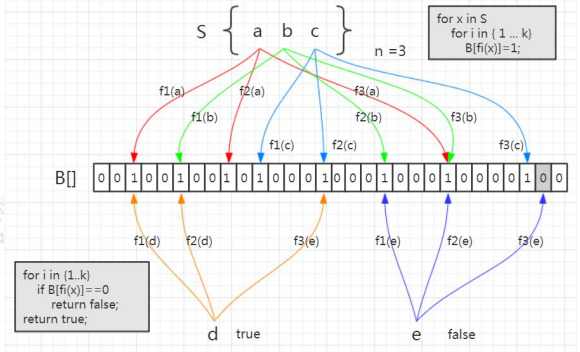

# 1 为什么需要Redis集群

## 1.1 性能

Redis 本身的 QPS 已经很高了，但是如果在一些并发量非常高的情况下，性能还是会受到影响。这个时候我们希望有更多的 Redis 服务来完成工作。 

## 1.2 扩展

第二个是出于存储的考虑。因为 Redis 所有的数据都放在内存中，如果数据量大，很容易受到硬件的限制。升级硬件收效和成本比太低，所以我们需要有一种横向扩展的方法。 

## 1.3 可用性

第三个是可用性和安全的问题。如果只有一个 Redis 服务，一旦服务宕机，那么所有的客户端都无法访问，会对业务造成很大的影响。另一个，如果硬件发生故障，而单机的数据无法恢复的话，带来的影响也是灾难性的。 

可用性、数据安全、性能都可以通过搭建多个 Reids 服务实现。其中有一个是主节点（master），可以有多个从节点(slave)。主从之间通过数据同步，存储完全相同的数据。如果主节点发生故障，则把某个从节点改成主节点，访问新的主节点。

# 2 Redis 主从复制(replication)


## 2.1 主从复制配置

修改192.168.11.140和192.168.11.141 的 redis.conf 文件：

```markdown
	slaveof <master-ip> <master-port>
# 如果 master 有密码需要配置 master 密码
	masterauth <master-password>
```

redis5.0之后弃用了 slave 语法，改用 replica-announce-ip 和 replica-announce-port

```markdown
# 方式一：修改redis.conf
	slaveof 192.168.11.138 6379
	masterauth 1234
	# 在主从切换的时候，这个配置会被重写成
	# Generated by CONFIG REWRITE（slave代表奴隶）
		replicaof 192.168.11.138 6379
# 方式二：在启动服务时通过参数指定 master 节点
	./redis-server --slaveof 192.168.8.203 6379 
# 方式三：在客户端直接执行 slaveof xx xx，使该 Redis 实例成为从节点
```

启动后，可以通过`info replication`查看：

```java
127.0.0.1:6379> info replication
# Replication
role:master
connected_slaves:2
master_replid:e1e1d9ba4ffe4075dbfc5bf92d87a4aa0290b220
master_replid2:0000000000000000000000000000000000000000
master_repl_offset:0
second_repl_offset:-1
repl_backlog_active:0
repl_backlog_size:1048576
repl_backlog_first_byte_offset:0
repl_backlog_histlen:0
```

从节点不能写入数据（只读），只能从 master 节点同步数据。get 成功，set 失败

```shell
127.0.0.1:6379> set gupao 666 
(error) READONLY You can't write against a read only replica.
```

主节点写入后，slave 会自动从 master 同步数据。 

断开复制： `slaveof no one`

此时从节点会变成自己的主节点，不再复制数据。

## 2.2 主从复制原理

### 2.2.1 连接阶段

1. slave node 启动时（执行 slaveof 命令），会在自己本地保存 master node 的信息，包括 master node 的 host 和 ip。 

2. slave node 内部有个定时任务 replicationCron（源码 replication.c），每隔 1 秒钟检查是否有新的 master node 要连接和复制，如果发现，就跟 master node 建立 socket 网络连接(会向master发送一个SYNC的命令)，如果连接成功，从节点为该 socket 建立一个专门处理复制工作的文件事件处理器，负责后续的复制工作，如接收 RDB 文件、接收命令传播等。 

当从节点变成了主节点的一个客户端之后，会给主节点发送 ping 请求。


### 2.2.2 数据同步阶段

3. master node 第一次执行全量复制，通过 bgsave 命令在本地生成一份 RDB 快照，将 RDB 快照文件发给 slave node（如果超时会重连，可以调大 repl-timeout 的值）。slave node 首先清除自己的旧数据，然后用 RDB 文件加载数据。 

**问题：生成 RDB 期间，master 接收到的命令怎么处理？**

开始生成 RDB 文件时，master 会把所有新的写命令缓存在内存中。在 slave node 保存了 RDB 之后，再将新的写命令复制给 slave node。 

### 2.2.3 命令传播阶段

4. master node 持续将写命令，异步复制给 slave node 

延迟是不可避免的，只能通过优化网络。 

`repl-disable-tcp-nodelay no`

当设置为 yes 时，TCP 会对包进行合并从而减少带宽，但是发送的频率会降低，从节点数据延迟增加，一致性变差；具体发送频率与 Linux 内核的配置有关，默认配置为 40ms。当设置为 no 时，TCP 会立马将主节点的数据发送给从节点，带宽增加但延迟变小。

一般来说，只有当应用对 Redis 数据不一致的容忍度较高，且主从节点之间网络状况不好时，才会设置为 yes；多数情况使用默认值 no。 

**问题：如果从节点有一段时间断开了与主节点的连接是不是要重新全量复制一遍？如果可以增量复制，怎么知道上次复制到哪里？**

通过 master_repl_offset 记录的偏移量 

```shell
redis> info replication
master_repl_offset:2345632
```

## 2.3 主从复制的不足

主从模式解决了数据备份和性能（通过读写分离）的问题，但是还是存在一些不足： 

1. RDB 文件过大的情况下，同步非常耗时

2. 在一主一从或者一主多从的情况下，如果主服务器挂了，对外提供的服务就不可用了，单点问题没有得到解决。如果每次都是手动把之前的从服务器切换成主服务器，这个比较费时费力，还会造成一定时间的服务不可用。 

# 3 可用性保证之 Sentinel

## 3.1 Sentinel 原理

如何实现主从的自动切换？我们的思路： 

创建一台监控服务器来监控所有 Redis 服务节点的状态，比如，master 节点超过一定时间没有给监控服务器发送心跳报文，就把 master 标记为下线，然后把某一个 slave 变成 master。应用每一次都是从这个监控服务器拿到 master 的地址。 

问题是：如果监控服务器本身出问题了怎么办？那我们就拿不到 master 的地址了，应用也没有办法访问。 

那我们再创建一个监控服务器，来监控监控服务器……似乎陷入死循环了，这个问题怎么解决？这个问题先放着。 

Redis 的 Sentinel 就是这种思路：通过运行监控服务器来保证服务的可用性。 

官网： https://redis.io/topics/sentinel 

从 Redis2.8 版本起，提供了一个稳定版本的 Sentinel（哨兵），用来解决高可用的问题。它是一个特殊状态的 redis 实例。 

我们会启动一个或者多个 Sentinel 的服务（通过 src/redis-sentinel），它本质上只是一个运行在特殊模式之下的 Redis，Sentinel 通过 info 命令得到被监听 Redis 机器的 master，slave 等信息。 


为了保证监控服务器的可用性，我们会对 Sentinel 做集群的部署。Sentinel 既监控所有的 Redis 服务，<font color=red>Sentinel 之间也相互监控。</font> 

注意：Sentinel 本身没有主从之分，只有 Redis 服务节点有主从之分。 

概念梳理：master，slave（redis group），sentinel，sentinel 集合

### 3.1.1 服务下线

Sentinel 默认以每秒钟 1 次的频率向 Redis 服务节点发送 PING 命令。如果在 down-after-milliseconds 内都没有收到有效回复，Sentinel 会将该服务器标记为下线（`主观下线`）。 

```yml
# sentinel.conf 
sentinel down-after-milliseconds <master-name> <milliseconds> 
```

这个时候 Sentinel 节点会继续询问其他的 Sentinel 节点，确认这个节点是否下线，如果多数 Sentinel 节点都认为 master 下线，master 才真正确认被下线（`客观下线`），这个时候就需要重新选举 master。 

### 3.1.2 故障转移

如果 master 被标记为下线，就会开始故障转移流程。 

既然有这么多的 Sentinel 节点，由谁来做故障转移的事情呢？ 

故障转移流程的第一步就是在 Sentinel 集群选择一个 Leader，由 Leader 完成故障转移流程。Sentinle 通过 Raft 算法，实现 Sentinel 选举。 

#### Raft 算法

在分布式存储系统中，通常通过维护多个副本来提高系统的可用性，那么多个节点 之间必须要面对数据一致性的问题。Raft 的目的就是通过复制的方式，使所有节点达成一致，但是这么多节点，以哪个节点的数据为准呢？所以必须选出一个 Leader。 

大体上有两个步骤：领导选举，数据复制。 

Raft 是一个共识算法（consensus algorithm）。比如比特币之类的加密货币，就需要共识算法。Spring Cloud 的注册中心解决方案 Consul 也用到了 Raft 协议。 

Raft 的核心思想：先到先得，少数服从多数。 

Raft 算法演示：http://thesecretlivesofdata.com/raft/ 

总结： 

Sentinle 的 Raft 算法和 Raft 论文略有不同。 

1. master 客观下线触发选举，而不是过了 election timeout 时间开始选举。 

2. Leader 并不会把自己成为 Leader 的消息发给其他 Sentinel。其他 Sentinel 等待 Leader 从 slave 选出 master 后，检测到新的 master 正常工作后，就会去掉客观下线的标识，从而不需要进入故障转移流程。

#### 故障转移

**问题：怎么让一个原来的 slave 节点成为主节点？**

1. 选出 Sentinel Leader 之后，由 Sentinel Leader 向某个节点发送 slaveof no one 命令，让它成为独立节点。 

2. 然后向其他节点发送 slaveof x.x.x.x xxxx（本机服务），让它们成为这个节点的子节点，故障转移完成。 

**问题：这么多从节点，选谁成为主节点？**

关于从节点选举，一共有四个因素影响选举的结果，分别是断开连接时长、优先级排序、复制数量、进程 id。 

如果与哨兵连接断开的比较久，超过了某个阈值，就直接失去了选举权。如果拥有选举权，那就看谁的优先级高，这个在配置文件里可以设置（replica-priority 100）， 

数值越小优先级越高。 

如果优先级相同，就看谁从 master 中复制的数据最多（复制偏移量最大），选最多的那个，如果复制数量也相同，就选择进程 id 最小的那个。 

## 3.2 Sentinel 的功能总结

> Monitoring. Sentinel constantly checks if your master and slave instances are working as expected. 
>
> Notification. Sentinel can notify the system administrator, another computer programs, via an API, that something is wrong with one of the monitored Redis instances. 
>
> Automatic failover. If a master is not working as expected, Sentinel can start a failover process where a slave is promoted to master, the other additional slaves are reconfigured to use the new master, and the applications using the Redis server informed about the new address to use when connecting. 
>
> Configuration provider. Sentinel acts as a source of authority for clients service discovery: clients connect to Sentinels in order to ask for the address of the current Redis master responsible for a given service. If a failover occurs, Sentinels will report the new address.

`监控` Sentinel 会不断检查主服务器和从服务器是否正常运行。 

`通知` 如果某一个被监控的实例出现问题，Sentinel 可以通过 API 发出通知。 

`自动故障转移（failover）` 如果主服务器发生故障，Sentinel 可以启动故障转移过程。把某台服务器升级为主服务器，并发出通知。 

`配置管理` 客户端连接到 Sentinel，获取当前的 Redis 主服务器的地址。

## 3.3 Sentinel 实战

### 3.3.1 Sentinel 配置

为了保证 Sentinel 的高可用，Sentinel 也需要做集群部署，集群中至少需要三个 Sentinel 实例（推荐奇数个，防止脑裂）。 

| hostname | IP 地址   | 节点角色&端口                   |
| -------- | --------- | ------------------------------- |
| master   | 127.0.0.1 | Master：6379 / Sentinel : 26379 |
| slave1   | 127.0.0.1 | Slave ：6380 / Sentinel : 26380 |
| slave2   | 127.0.0.1 | Slave ：6381 / Sentinel : 26381 |

以 Redis 安装路径/usr/local/redis-5.0.7/为例。 

```markdown
# 新建etc目录
	cd /usr/local/redis-5.0.7/
	mkdir etc
	cd etc/
	mkdir redis_master # 作为master节点配置文件的目录
	mkdir redis_slave1 # 作为第一个slave节点配置文件的目录
	mkdir redis_slave2 # 作为第二个slave节点配置文件的目录
# 回到安装目录将配置文件拷贝对应目录下
	cd ..
	cp redis.conf /usr/local/redis-5.0.7/etc/redis_master
	cp redis.conf /usr/local/redis-5.0.7/etc/redis_slave1
	cp redis.conf /usr/local/redis-5.0.7/etc/redis_slave2
# 主节点配置
	bind：0.0.0.0 #Redis 默认只允许本机访问，把 bind 修改为 0.0.0.0 表示允许所有远程访问
	port：6379   
	protected-mode：no #关闭保护模式，可以外部访问
	daemonize：yes     #设置为后台启动
	pidfile "/var/run/redis_6379.pid" #redi pid存储位置，建议加上端口，便于区分
	logfile "/Users/spring_zhang/logs/redis/redis_6379.log" #日志文件存储位置
	requirepass：1234 #设置 redis 连接密码
	masterauth：1234  #slave 服务连接 master 的密码
# 从节点配置
	bind：0.0.0.0
	port：6380
	protected-mode：no
	daemonize：yes
	pidfile "/var/run/redis_6380.pid"
	logfile "/Users/spring_zhang/logs/redis/redis_6380.log"
	requirepass：1234
	masterauth：1234
	replicaof 127.0.0.1 6379   ##主节点的IP 端口
# 分别启动三个节点
	cd /usr/local/redis-5.0.7/src
	./redis-server ../etc/redis_master/redis.conf
	./redis-server ../etc/redis_slave1/redis.conf
	./redis-server ../etc/redis_slave2/redis.conf
# 连接主从节点查看信息
	./redis-cli -h 127.0.0.1 -p 6379
	// ./redis-cli -h 127.0.0.1 -p 6379 -a 1234
	// Warning: Using a password with '-a' or '-u' option on the command line interface may not be safe.
```


```markdown
# 哨兵模式搭建
# 同样为了方便管理，将sentinel.conf复制至对应的目录下
	cd /usr/local/redis-5.0.7
	cp sentinel.conf etc/redis_master/
	cp sentinel.conf etc/redis_slave1/
	cp sentinel.conf etc/redis_slave2/
# 分别编辑 sentinel.conf
	port:26379  # 默认端口为26379。
	protected-mode:no # 关闭保护模式，可以外部访问
	daemonize:yes     #设置为后台启动
	pidfile "/var/run/redis-sentinel_26379.pid" #redis sentinel pid文件位置
	logfile "/Users/spring_zhang/logs/redis/sentinel_26379.log" #日志文件
	sentinel monitor mymaster 127.0.0.1 6379 2  #指定主机IP地址和端口，并且指定当有2台哨兵认为主机挂了，则对主机进行容灾切换
	sentinel auth-pass mymaster 1234 #当在Redis实例中开启了requirepass，这里就需要提供密码
	sentinel down-after-milliseconds mymaster 3000 #这里设置了主机多少秒无响应，则认为挂了
	sentinel parallel-syncs mymaster 1 #主备切换时，最多有多少个slave同时对新的master进行同步，这里设置为默认的1
	sentinel failover-timeout mymaster 180000 #故障转移的超时时间，这里设置为三分钟
# 启动三个哨兵
	cd /usr/local/redis-5.0.7/src
	redis-sentinel ../etc/redis_master/sentinel.conf
	redis-sentinel ../etc/redis_slave1/sentinel.conf
	redis-sentinel ../etc/redis_slave2/sentinel.conf
```

上面出现了 4 个'mymaster'，这个名称要统一，并且使用客户端（比如 Jedis）连接的时候名称要正确。 

| 属性名                            | 作用                                                         |
| --------------------------------- | ------------------------------------------------------------ |
| protected-mode                    | 是否允许外部网络访问                                         |
| dir                               | sentinel 的工作目录                                          |
| sentinel monitor                  | sentinel 监控的 redis 主节点                                 |
| down-after-milliseconds（毫秒）   | master 宕机多久，才会被 Sentinel 主观认为下线                |
| sentinel failover-timeout（毫秒） | 1 同一个 sentinel 对同一个 master 两次 failover 之间的间隔时间。 <br>2. 当一个 slave 从一个错误的 master 那里同步数据开始计算时间。直到slave 被纠正为向正确的 master 那里同步数据时。 <br>3.当想要取消一个正在进行的 failover 所需要的时间。<br>4.当进行 failover 时，配置所有 slaves 指向新的 master 所需的最大时间。 |
| parallel-syncs                    | 这个配置项指定了在发生 failover 主备切换时最多可以有多少个 slave 同时对新的 master 进行同步，这个数字越小，完成 failover 所需的时间就越长，但是如果这个数字越大，就意味着越 多的 slave 因为 replication 而不可用。可以通过将这个值设为 1 来保证每次只有一个 slave 处于不能处理命令请求的状态。 |

### 3.3.2 Sentinel 验证

模拟6379端口宕机。

6381端口被选为新的Master，只有一个 Slave 节点。


注意看 sentinel.conf 里面的 redis-master 被修改了！ 


模拟原 master 恢复，在 6379 启动 redis-server。它还是 slave，但是 master 又有两个 slave 了。 

### 3.3.3 Sentinel 连接使用

Jedis 连接 Sentinel，master name 来自于 sentinel.conf 的配置。

```java
private static JedisSentinelPool pool;
private static JedisSentinelPool createJedisPool() { 
  // master的名字是sentinel.conf配置文件里面的名称
  String masterName = "redis-master"; 
  Set<String> sentinels = new HashSet<String>(); 
  sentinels.add("192.168.8.203:26379"); 
  sentinels.add("192.168.8.204:26379"); 
  sentinels.add("192.168.8.205:26379"); 
  pool = new JedisSentinelPool(masterName, sentinels, "1234"); 
  return pool; 
}
public static void main(String[] args) {
    JedisSentinelPool pool = createJedisPool();
    System.out.println(pool.getCurrentHostMaster());
    pool.getResource().set("xiaoxiao", "520-"+System.currentTimeMillis());
    System.out.println(pool.getResource().get("xiaoxiao"));
}
```

Spring Boot 连接 Sentinel（springboot-redis：RedisAppTest.java） 

```yml
spring:
	redis:
  	sentinel:
    	master: mymaster
    	nodes: 127.0.0.1:26379,127.0.0.1:26380,127.0.0.1:26381
  password: 1234
```

无论是 Jedis 还是 Spring Boot（2.x 版本默认是 Lettuce），都只需要配置全部哨兵的地址，由哨兵返回当前的 master 节点地址。

## 3.4 哨兵机制的不足

主从切换的过程中会丢失数据，因为只有一个 master。 

只能单点写，没有解决水平扩容的问题。 

如果数据量非常大，这个时候我们需要多个 master-slave 的 group，把数据分布到 不同的 group 中。 

问题来了，数据怎么分片？分片之后，怎么实现路由？ 

# 4 Redis 分布式方案

如果要实现 Redis 数据的分片，我们有三种方案。第一种是在客户端实现相关的逻辑，例如用取模或者一致性哈希对 key 进行分片，查询和修改都先判断 key 的路由。 

第二种是把做分片处理的逻辑抽取出来，运行一个独立的代理服务，客户端连接到 这个代理服务，代理服务做请求的转发。 

第三种就是基于服务端实现。

## 4.1 客户端 Sharding


Jedis 客户端提供了 Redis Sharding 的方案，并且支持连接池。

```java
public class ShardingTest { 
  public static void main(String[] args) { 
    JedisPoolConfig poolConfig = new JedisPoolConfig(); 
    // Redis 服务器 
    JedisShardInfo shardInfo1 = new JedisShardInfo("127.0.0.1", 6379); 
    JedisShardInfo shardInfo2 = new JedisShardInfo("192.168.8.205", 6379); 
    // 连接池 
    List<JedisShardInfo> infoList = Arrays.asList(shardInfo1, shardInfo2); 
    ShardedJedisPool jedisPool = new ShardedJedisPool(poolConfig, infoList); 
    
    ShardedJedis jedis = null; 
    try{
      jedis = jedisPool.getResource(); 
      for(int i=0; i<100; i++){ 
        jedis.set("k"+i, ""+i); 
      }
      for(int i=0; i<100; i++){ 
        System.out.println(jedis.get("k"+i)); 
      } 
    }finally{ 
      if(jedis!=null) { 
        jedis.close(); 
      } 
    } 
  } 
}
```

使用 ShardedJedis 之类的客户端分片代码的优势是配置简单，不依赖于其他中间件，分区的逻辑可以自定义，比较灵活。但是基于客户端的方案，不能实现动态的服务增减，每个客户端需要自行维护分片策略，存在重复代码。 

第二种思路就是把分片的代码抽取出来，做成一个公共服务，所有的客户端都连接到这个代理层。由代理层来实现请求和转发。 

## 4.2 代理 Proxy


典型的代理分区方案有 Twitter 开源的 Twemproxy 和国内的豌豆荚开源的 Codis。

## 4.3 Redis Cluster

Redis Cluster 是在 Redis 3.0 的版本正式推出的，用来解决分布式的需求，同时也可以实现高可用。跟 Codis 不一样，它是去中心化的，客户端可以连接到任意一个可用节点。

数据分片有几个关键的问题需要解决： 

1. 数据怎么相对均匀地分片 

2. 客户端怎么访问到相应的节点和数据 

3. 重新分片的过程，怎么保证正常服务

### 4.3.1 架构

Redis Cluster 可以看成是由多个 Redis 实例组成的数据集合。客户端不需要关注数据的子集到底存储在哪个节点，只需要关注这个集合整体。 

以 3 主 3 从为例，节点之间两两交互，共享数据分片、节点状态等信息。


### 4.3.2 搭建 // TODO

### 4.3.3 数据分布

如果是希望数据分布相对均匀的话，我们首先可以考虑哈希后取模。 

#### 哈希后取模

例如，hash(key)%N，根据余数，决定映射到那一个节点。这种方式比较简单，属于静态的分片规则。但是一旦节点数量变化，新增或者减少，由于取模的 N 发生变化，数据需要重新分布。 

为了解决这个问题，我们又有了一致性哈希算法。 

#### 一致性哈希

一致性哈希的原理： 

把所有的哈希值空间组织成一个虚拟的圆环（哈希环），整个空间按顺时针方向组织。因为是环形空间，0 和 `2^32-1` 是重叠的。 

假设我们有四台机器要哈希环来实现映射（分布数据），我们先根据机器的名称或者 IP 计算哈希值，然后分布到哈希环中（红色圆圈）。


现在有 4 条数据或者 4 个访问请求，对 key 计算后，得到哈希环中的位置（绿色圆圈）。沿哈希环顺时针找到的第一个 Node，就是数据存储的节点。 


在这种情况下，新增了一个 Node5 节点，不影响数据的分布。


删除了一个节点 Node4，只影响相邻的一个节点。


谷歌的 MurmurHash 就是一致性哈希算法。在分布式系统中，负载均衡、分库分表等场景中都有应用。 

一致性哈希解决了动态增减节点时，所有数据都需要重新分布的问题，它只会影响到下一个相邻的节点，对其他节点没有影响。 

但是这样的一致性哈希算法有一个缺点，因为节点不一定是均匀地分布的，特别是在节点数比较少的情况下，所以数据不能得到均匀分布。解决这个问题的办法是引入`虚拟节点（Virtual Node）`。 

比如：2 个节点，5 条数据，只有 1 条分布到 Node2，4 条分布到 Node1，不均匀。


Node1 设置了两个虚拟节点，Node2 也设置了两个虚拟节点（虚线圆圈）。 

这时候有 3 条数据分布到 Node1，1 条数据分布到 Node2。


#### Redis 虚拟槽分区

Redis 既没有用哈希取模，也没有用一致性哈希，而是用虚拟槽来实现的。 

Redis 创建了 16384 个槽（slot），每个节点负责一定区间的 slot。比如 Node1 负责 0-5460，Node2 负责 5461-10922，Node3 负责 10923-16383。 


Redis 的每个 master 节点维护一个 16384 位（2048bytes=2KB）的位序列，比如：序列的第 0 位是 1，就代表第一个 slot 是它负责；序列的第 1 位是 0，代表第二个 slot 不归它负责。 

对象分布到 Redis 节点上时，对 key 用 CRC16 算法计算再%16384，得到一个 slot 的值，数据落到负责这个 slot 的 Redis 节点上。 

查看 key 属于哪个 slot： 

```shell
redis> cluster keyslot qingshan 
```

<font color=red>注意：key 与 slot 的关系是永远不会变的，会变的只有 slot 和 Redis 节点的关系。 </font>

**问题：怎么让相关的数据落到同一个节点上？**

比如有些 multi key 操作是不能跨节点的，如果要让某些数据分布到一个节点上，例如用户 2673 的基本信息和金融信息，怎么办？

在 key 里面加入{hash tag}即可。Redis 在计算槽编号的时候只会获取{}之间的字符串进行槽编号计算，这样由于上面两个不同的键，{}里面的字符串是相同的，因此他们可 

以被计算出相同的槽。 

user{2673}base=… 

user{2673}fin=… 

```shell
127.0.0.1:7293> set a{qs}a 1 
OK 
127.0.0.1:7293> set a{qs}b 1 
OK 
127.0.0.1:7293> set a{qs}c 1 
OK
```

### 4.3.4 客户端重定向

比如在 7291 端口的 Redis 的 redis-cli 客户端操作： 

```shell
127.0.0.1:7291> set qs 1 
(error) MOVED 13724 127.0.0.1:7293 
```

服务端返回 MOVED，也就是根据 key 计算出来的 slot 不归 7191 端口管理，而是归 7293 端口管理，服务端返回 MOVED 告诉客户端去 7293 端口操作。 

这个时候更换端口，用 redis-cli –p 7293 操作，才会返回 OK。或者用`./redis-cli -c -p port`的命令（c 代表 cluster）。这样客户端需要连接两次。 

Jedis 等客户端会在本地维护一份 slot——node 的映射关系，大部分时候不需要重定向，所以叫做` smart jedis（需要客户端支持）`。 

### 4.3.5 数据迁移

因为 key 和 slot 的关系是永远不会变的，当新增了节点的时候，需要把原有的 slot 分配给新的节点负责，并且把相关的数据迁移过来。 

添加新节点（新增一个 7297）： 

```
redis-cli --cluster add-node 127.0.0.1:7291 127.0.0.1:7297 
```

新增的节点没有哈希槽，不能分布数据，在原来的任意一个节点上执行： 

```
redis-cli --cluster reshard 127.0.0.1:7291 
```

输入需要分配的哈希槽的数量（比如 500），和哈希槽的来源节点（可以输入 all 或 者 id）。

### 4.3.6 高可用和主从切换原理

当 slave 发现自己的 master 变为 FAIL 状态时，便尝试进行 Failover，以期成为新的master。由于挂掉的master可能会有多个slave，从而存在多个slave竞争成为master 

节点的过程， 其过程如下： 

1. slave 发现自己的 master 变为 FAIL 

2. 将自己记录的集群 currentEpoch 加 1，并广播 FAILOVER_AUTH_REQUEST 信息 

3. 其他节点收到该信息，只有 master 响应，判断请求者的合法性，并发送 FAILOVER_AUTH_ACK，对每一个 epoch 只发送一次 ack 

4. 尝试 failover 的 slave 收集 FAILOVER_AUTH_ACK 

5. 超过半数后变成新 Master 

6. 广播 Pong 通知其他集群节点

Redis Cluster 既能够实现主从的角色分配，又能够实现主从切换，相当于集成了 Replication 和 Sentinal 的功能。

### 4.3.7 总结

优势

1. 无中心架构。 

2. 数据按照 slot 存储分布在多个节点，节点间数据共享，可动态调整数据分布。 

3. 可扩展性，可线性扩展到 1000 个节点（官方推荐不超过 1000 个），节点可动态添加或删除。 

4. 高可用性，部分节点不可用时，集群仍可用。通过增加 Slave 做 standby 数据副本，能够实现故障自动 failover，节点之间通过 gossip 协议交换状态信息，用投票机制完成 Slave 到 Master 的角色提升。 

5. 降低运维成本，提高系统的扩展性和可用性。 

不足

1. Client 实现复杂，驱动要求实现 Smart Client，缓存 slots mapping 信息并及时更新，提高了开发难度，客户端的不成熟影响业务的稳定性。 

2. 节点会因为某些原因发生阻塞（阻塞时间大于 clutser-node-timeout），被判断下线，这种 failover 是没有必要的。 

3. 数据通过异步复制，不保证数据的强一致性。 

4. 多个业务使用同一套集群时，无法根据统计区分冷热数据，资源隔离性较差，容易出现相互影响的情况。

# 5 Redis 客户端

## 5.1 客户端通信原理

客户端和服务器通过 TCP 来进行数据交互，服务器默认端口为 6379。

客户端和服务器发送的命令或数据一律以 \r\n 结尾。

如果使用 wireshark 对 jedis 抓包： 

环境：Jedis 连接到虚拟机 128，运行 main，对 VMnet8 抓包。 

过滤条件：`ip.dst==192.168.25.128 and tcp.port in {6379}` 

set spring 抓包：


可以看到实际发出的数据包是： 

```
*3\r\n$3\r\nSET\r\n$6\r\nspring\r\n$3\r\n666\r\n
```

get qingshan 抓包：


```
*2\r\n$3\r\nGET\r\n$6\r\nspring\r\n
```

客户端和 Redis 之间使用一种特殊的编码格式（在 AOF 文件里面可以看到），叫做 `Redis Serialization Protocol (Redis 序列化协议)`。

特点：容易实现、解析快、可读 性强。客户端发给服务端的消息需要经过编码，服务端收到之后会按约定进行解码，反之亦然。

基于此，我们可以自己实现一个 Redis 客户端。 

1. 建立 Socket 连接 

2. OutputStream 写入数据（发送到服务端） 

3. InputStream 读取数据（从服务端接口） 

```java
public class MyClient {
    private Socket socket;
    private OutputStream write;
    private InputStream read;

    public MyClient(String host, int port) throws IOException {
        socket = new Socket(host, port);
        write = socket.getOutputStream();
        read = socket.getInputStream();
    }

    public void set(String key, String val) throws IOException {
        StringBuffer sb = new StringBuffer();
        // 代表3个参数
        sb.append("*3").append("\r\n");
        // 第一个参数（get）的长度
        sb.append("$3").append("\r\n");
        // 第一个参数的内容
        sb.append("SET").append("\r\n");

        // 第二个参数key的长度
        sb.append("$").append(key.getBytes().length).append("\r\n");
        // 第二个参数key的内容
        sb.append(key).append("\r\n");
        // 第三个参数value的长度
        sb.append("$").append(val.getBytes().length).append("\r\n");
        // 第三个参数value的内容
        sb.append(val).append("\r\n");

        write.write(sb.toString().getBytes());
        byte[] bytes = new byte[1024];
        read.read(bytes);
        System.out.println("-------------set-------------");
        System.out.println(new String(bytes));
    }

    public void get(String key) throws IOException {
        StringBuffer sb = new StringBuffer();
        // 代表2个参数
        sb.append("*2").append("\r\n");
        // 第一个参数(get)的长度
        sb.append("$3").append("\r\n");
        // 第一个参数的内容
        sb.append("GET").append("\r\n");

        // 第二个参数长度
        sb.append("$").append(key.getBytes().length).append("\r\n");
        // 第二个参数内容
        sb.append(key).append("\r\n");

        write.write(sb.toString().getBytes());
        byte[] bytes = new byte[1024];
        read.read(bytes);
        System.out.println("-------------get-------------");
        System.out.println(new String(bytes));
    }

    public static void main(String[] args) throws IOException {
        MyClient client = new MyClient("192.168.25.128", 6379);
        client.set("spring", "2673");
        client.get("spring");
    }

}
```

基于这种协议，我们可以用 Java 实现所有的 Redis 操作命令。当然，我们不需要这 么做，因为已经有很多比较成熟的 Java 客户端，实现了完整的功能和高级特性，并且提供了良好的性能。

官网推荐的 Java 客户端有 3 个 Jedis，Redisson 和 Luttuce。

Spring 连接 Redis 用的是什么？RedisConnectionFactory 接口支持多种实现，例 如 ： JedisConnectionFactory 、 JredisConnectionFactory 、 LettuceConnectionFactory、SrpConnectionFactory。

## 5.2 Jedis

### 5.2.1 特点

Jedis 是我们最熟悉和最常用的客户端。轻量，简洁，便于集成和改造。

```java
public static void main(String[] args) {
    Jedis jedis = new Jedis("192.168.25.128", 6379);
    jedis.auth("1234");
    jedis.set("spring", "666");
    System.out.println(jedis.get("spring"));
    jedis.close();
}
```

Jedis 多个线程使用一个连接的时候线程不安全。可以使用连接池，为每个请求创建 不同的连接，基于 Apache common pool 实现。跟数据库一样，可以设置最大连接数 等参数。Jedis 中有多种连接池的子类。


```java
public static void main(String[] args) {
	JedisPool pool = new JedisPool(ip, port);
	Jedis jedis = jedisPool.getResource();
	//
}
```

Jedis 有 4 种工作模式：单节点、分片、哨兵、集群。 

3 种请求模式：Client、Pipeline、事务。

`Client 模式`就是客户端发送一个命令，阻塞等待服务端执行，然后读取返回结果。

`Pipeline 模式`是一次性发送多个命令，最后一 次取回所有的返回结果，这种模式通过减少网络的往返时间和 io 读写次数，大幅度提高 通信性能。

`Transaction 模式`即开启 Redis 的事务管理，事务模式开 启后，所有的命令（除了 exec，discard，multi 和 watch）到达服务端以后不会立即执 行，会进入一个等待队列。

### 5.2.2 Sentinel 获取连接原理

**问题：Jedis 连接 Sentinel 的时候，我们配置的是全部哨兵的地址。Sentinel 是如 何返回可用的 master 地址的呢？**

```java
// 构造方法中调用
HostAndPort master = initSentinels(sentinels, masterName);

private HostAndPort initSentinels(Set<String> sentinels, final String masterName) {
  HostAndPort master = null;
  boolean sentinelAvailable = false;
  log.info("Trying to find master from available Sentinels...");
  // 有多个 sentinel,遍历sentinels
  for (String sentinel : sentinels) {
    // host:port 表示的 sentinel 地址转化为一个 HostAndPort 对象
    final HostAndPort hap = HostAndPort.parseString(sentinel);
    log.fine("Connecting to Sentinel " + hap);
    Jedis jedis = null;
    try {
      // 连接到 sentinel
      jedis = new Jedis(hap.getHost(), hap.getPort());
      // 根据 masterName 得到 master 的地址，返回一个list,host=list[0],port=list[1]
      List<String> masterAddr = jedis.sentinelGetMasterAddrByName(masterName);
      sentinelAvailable = true;
      if (masterAddr == null || masterAddr.size() != 2) {
        log.warning("Can not get master addr, master name: " + masterName + ". Sentinel: " + hap
            + ".");
        continue;
      }
      // 如果在任何一个 sentinrl 中找到master，不再遍历 sentinels
      master = toHostAndPort(masterAddr);
      log.fine("Found Redis master at " + master);
      break;
    } catch (JedisException e) {
      log.warning("Cannot get master address from sentinel running @ " + hap + ". Reason: " + e
          + ". Trying next one.");
    } finally {
      if (jedis != null) {
        jedis.close();
      }
    }
  }
  // 到这里，如果 master 为 null，则说明有两种情况，一种是所有的 sentinels 节点都 down 掉了，一种是 master节点没有被存活的 sentinels 监控到
  if (master == null) {
    if (sentinelAvailable) {
      throw new JedisException("Can connect to sentinel, but " + masterName
          + " seems to be not monitored...");
    } else {
      throw new JedisConnectionException("All sentinels down, cannot determine where is "
          + masterName + " master is running...");
    }
  }
  log.info("Redis master running at " + master + ", starting Sentinel listeners...");
  // 启动对每个 sentinels 的监听为每个 sentinel 都启动了一个监听者 MasterListener。MasterListener 本身是一个线程，它会去订阅 sentinel 上关于 master 节点地址改变的消息。 
  for (String sentinel : sentinels) {
    final HostAndPort hap = HostAndPort.parseString(sentinel);
    MasterListener masterListener = new MasterListener(masterName, hap.getHost(), hap.getPort());
    // whether MasterListener threads are alive or not, process can be stopped
    masterListener.setDaemon(true);
    masterListeners.add(masterListener);
    masterListener.start();
  }
  return master;
}
```

### 5.2.3 Cluster 获取连接原理

**问题：使用 Jedis 连接 Cluster 的时候，我们只需要连接到任意一个或者多个 redis group 中的实例地址，那我们是怎么获取到需要操作的 Redis Master 实例的？**

关键问题：在于如何存储 slot 和 Redis 连接池的关系。 

1. 程序启动初始化集群环境，读取配置文件中的节点配置，无论是主从，无论多少 个，只拿第一个，获取 redis 连接实例（后面有个 break）。

```java
private void initializeSlotsCache(Set<HostAndPort> startNodes, GenericObjectPoolConfig poolConfig, String password) {
  for (HostAndPort hostAndPort : startNodes) {
    // 获取一个 Jedis 实例
    Jedis jedis = new Jedis(hostAndPort.getHost(), hostAndPort.getPort());
    if (password != null) {
      jedis.auth(password);
    }
    try {
      // 获取 Redis 节点和 Slot 虚拟槽
      cache.discoverClusterNodesAndSlots(jedis);
      // 直接跳出循环
      break;
    } catch (JedisConnectionException e) {
      // try next nodes
    } finally {
      if (jedis != null) {
        jedis.close();
      }
    }
  }
}
```

2. 用获取的 redis 连接实例执行 clusterSlots ()方法，实际执行 redis 服务端 cluster slots 命令，获取虚拟槽信息。

   该集合的基本信息为[long, long, List, List]，第一二个元素是该节点负责槽点的起始位置，第三个元素是主节点信息，第四个元素为主节点对应的从节点信息。该 list 的 基本信息为[string,int,string]，第一个为 host 信息，第二个为 port 信息，第三个为唯一 id。

3. 获取有关节点的槽点信息后，调用 getAssignedSlotArray(slotinfo)来获取所有 的槽点值。 
4. 再获取主节点的地址信息，调用 generateHostAndPort(hostInfo)方法，生成一 个 ostAndPort 对象。 
5. 再根据节点地址信息来设置节点对应的 JedisPool，即设置 Map nodes 的值。

接下来判断若此时节点信息为主节点信息时，则调用 assignSlotsToNodes 方法，设 置每个槽点值对应的连接池，即设置 Map slots 的值。

```java
public void discoverClusterNodesAndSlots(Jedis jedis) {
  w.lock();
  try {
    reset();
    // 获取节点集合
    List<Object> slots = jedis.clusterSlots();
    // 遍历 3 个 master 节点
    for (Object slotInfoObj : slots) {
      // slotInfo 槽开始，槽结束，主，从
      // {[0,5460,7291,7294],[5461,10922,7292,7295],[10923,16383,7293,7296]}
      List<Object> slotInfo = (List<Object>) slotInfoObj;
      // 如果<=2，代表没有分配 slot
      if (slotInfo.size() <= MASTER_NODE_INDEX) {
        continue;
      }
      // 获取分配到当前 master 节点的数据槽，例如 7291 节点的{0,1,2,3……5460}
      List<Integer> slotNums = getAssignedSlotArray(slotInfo);
      // hostInfos
      // size 是 4，槽最小最大，主，从
      int size = slotInfo.size();
      // 第 3 位和第 4 位是主从端口的信息
      for (int i = MASTER_NODE_INDEX; i < size; i++) {
        List<Object> hostInfos = (List<Object>) slotInfo.get(i);
        if (hostInfos.size() <= 0) {
          continue;
        }
        // 根据 IP 端口生成 HostAndPort 实例
        HostAndPort targetNode = generateHostAndPort(hostInfos);
        // 据 HostAndPort 解析出 ip:port 的 key 值，再根据 key 从缓存中查询对应的 jedisPool 实例。如果没有 jedisPool实例，就创建 JedisPool 实例，最后放入缓存中。nodeKey 和 nodePool 的关系
        setupNodeIfNotExist(targetNode);
        if (i == MASTER_NODE_INDEX) {
          assignSlotsToNode(slotNums, targetNode);
        }
      }
    }
  } finally {
    w.unlock();
  }
}
private HostAndPort generateHostAndPort(List<Object> hostInfos) {
  return new HostAndPort(SafeEncoder.encode((byte[]) hostInfos.get(0)),
      ((Long) hostInfos.get(1)).intValue());
}
private List<Integer> getAssignedSlotArray(List<Object> slotInfo) {
  List<Integer> slotNums = new ArrayList<Integer>();
  // 创建一个起止于槽点起止点的Integer集合
  for (int slot = ((Long) slotInfo.get(0)).intValue(); slot <= ((Long) slotInfo.get(1)).intValue(); slot++) {
    slotNums.add(slot);
  }
  return slotNums;
}
public JedisPool setupNodeIfNotExist(HostAndPort node) {
  w.lock();
  try {
    String nodeKey = getNodeKey(node);
    JedisPool existingPool = nodes.get(nodeKey);
    if (existingPool != null) return existingPool;
    JedisPool nodePool = new JedisPool(poolConfig, node.getHost(), node.getPort(),
        connectionTimeout, soTimeout, password, 0, null, false, null, null, null);
    nodes.put(nodeKey, nodePool);
    return nodePool;
  } finally {
    w.unlock();
  }
}
public void assignSlotsToNode(List<Integer> targetSlots, HostAndPort targetNode) {
  w.lock();
  try {
    JedisPool targetPool = setupNodeIfNotExist(targetNode);
    for (Integer slot : targetSlots) {
      slots.put(slot, targetPool);
    }
  } finally {
    w.unlock();
  }
}
private final Map<String, JedisPool> nodes = new HashMap<String, JedisPool>();
private final Map<Integer, JedisPool> slots = new HashMap<Integer, JedisPool>();
```

从集群环境存取值： 

1. 把 key 作为参数，执行 CRC16 算法，获取 key 对应的 slot 值。 
2. 通过该 slot 值，去 slots 的 map 集合中获取 jedisPool 实例。
3.  通过 jedisPool 实例获取 jedis 实例，最终完成 redis 数据存取工作。

### 5.2.4 Pipeline

set 2 万个 key 用了好几分钟，这个速度太慢了，完全没有把 Redis 10 万的 QPS 利用起来。但是单个命令的执行到底慢在哪里？

Redis 使用的是客户端/服务器（C/S）模型和请求/响应协议的 TCP 服务器。这意味 着通常情况下一个请求会遵循以下步骤： 

* 客户端向服务端发送一个查询请求，并监听 Socket 返回，通常是以阻塞模式，等待服务端响应。 

* 服务端处理命令，并将结果返回给客户端。 Redis 客户端与 Redis 服务器之间使用 TCP 协议进行连接，一个客户端可以通过一 个 socket 连接发起多个请求命令。每个请求命令发出后 client 通常会阻塞并等待 redis 服务器处理，redis 处理完请求命令后会将结果通过响应报文返回给 client，因此当执行多条命令的时候都需要等待上一条命令执行完毕才能执行。执行过程如图：


Redis 本身提供了一些批量操作命令，比如 mget，mset，可以减少通信的时间，但是大部分命令是不支持 multi 操作的，例如 hash 就没有。 

由于通信会有网络延迟，假如 client 和 server 之间的包传输时间需要 10 毫秒，一次交互就是 20 毫秒（RTT：Round Trip Time）。这样的话，client 1 秒钟也只能也只能发送 50 个命令。这显然没有充分利用 Redis 的处理能力。另外一个，Redis 服务端执 行 I/O 的次数过多。

#### Pipeline 管道

那我们能不能像数据库的 batch 操作一样，把一组命令组装在一起发送给 Redis 服务端执行，然后一次性获得返回结果呢？这个就是 Pipeline 的作用。Pipeline 通过一个 队列把所有的命令缓存起来，然后把多个命令在一次连接中发送给服务器。

```java
public class PipelineSet {
    public static void main(String[] args) {
        Jedis jedis = new Jedis("192.168.25.128", 6379);
        jedis.auth("1234");
        Pipeline pipelined = jedis.pipelined();
        long t1 = System.currentTimeMillis();
        for (int i=0; i < 100000; i++) {
            pipelined.set("batch"+i,""+i);
        }
        pipelined.syncAndReturnAll();
        long t2 = System.currentTimeMillis();
        System.out.println("耗时："+(t2-t1)+"ms");
    }
}
public class PipelineGet {
    public static void main(String[] args) {
        new Thread(){
            public void run(){
                Jedis jedis = new Jedis("192.168.25.128", 6379);
                jedis.auth("1234");
                Set<String> keys = jedis.keys("batch*");
                List<String> result = new ArrayList();
                long t1 = System.currentTimeMillis();
                for (String key : keys) {
                    result.add(jedis.get(key));
                }
                for (String src : result) {
                    //System.out.println(src);
                }
                System.out.println("直接get耗时："+(System.currentTimeMillis() - t1));
            }
        }.start();

        new Thread(){
            public void run(){
                Jedis jedis = new Jedis("192.168.25.128", 6379);
                jedis.auth("1234");
                Set<String> keys = jedis.keys("batch*");
                List<Object> result = new ArrayList();
                Pipeline pipelined = jedis.pipelined();
                long t1 = System.currentTimeMillis();
                for (String key : keys) {
                    pipelined.get(key);
                }
                result = pipelined.syncAndReturnAll();
                for (Object src : result) {
                    //System.out.println(src);
                }
                System.out.println("Pipeline get耗时："+(System.currentTimeMillis() - t1));
            }
        }.start();
    }
}
```

要实现 Pipeline，既要服务端的支持，也要客户端的支持。

对于服务端来说，需要能够处理客户端通过一个 TCP 连接发来的多个命令，并且逐个地执行命令一起返回 。

对于客户端来说，要把多个命令缓存起来，达到一定的条件就发送出去，最后才处 理 Redis 的应答（这里也要注意对客户端内存的消耗）。

jedis-pipeline 的 client-buffer 限制：`8192bytes`，客户端堆积的命令超过 8192 bytes 时，会发送给服务端。 

源码：redis.clients.util.RedisOutputStream.java

```java
public RedisOutputStream(final OutputStream out) {
  this(out, 8192);
}
```

pipeline 对于命令条数没有限制，但是命令可能会受限于 TCP 包大小。

如果 Jedis 发送了一组命令，而发送请求还没有结束，Redis 响应的结果会放在接收缓冲区。如果接收缓冲区满了，jedis 会通知 redis win=0，此时 redis 不会再发送结果给 jedis 端，转而把响应结果保存在 Redis 服务端的输出缓冲区中。 

输出缓冲区的配置：redis.conf

```markdown
# class：客户端类型，分为三种。a）normal：普通客户端；b）slave：slave 客户端，用于复制；c）pubsub：发布订阅客户端
# 如果客户端使用的输出缓冲区大于hard limit，客户端会被立即关闭，0 代表不限制
# 如果客户端使用的输出缓冲区超过了soft limit并且持续了soft limit秒，客户端会被立即关闭
# client-output-buffer-limit <class> <hard limit> <soft limit> <soft seconds>
	client-output-buffer-limit normal 0 0 0
	client-output-buffer-limit replica 256mb 64mb 60
	client-output-buffer-limit pubsub 32mb 8mb 60
```

每个客户端使用的输出缓冲区的大小可以用 client list 命令查看：

```shell
127.0.0.1:6379> client list
id=14 addr=127.0.0.1:59904 fd=7 name= age=562 idle=0 flags=N db=0 sub=0 psub=0 multi=-1 qbuf=26 qbuf-free=32742 obl=0 oll=0 omem=0 events=r cmd=client user=default
```

* obl ： 输出缓冲区的长度（字节为单位， 0 表示没有分配输出缓冲区） 
* oll ： 输出列表包含的对象数量（当输出缓冲区没有剩余空间时，命令回复会以字符串对象的形式被入队到这个 队列里） 
* omem ： 输出缓冲区和输出列表占用的内存总量

#### 使用场景

如果某些操作需要马上得到 Redis 操作是否成功的结果，这种场景就不适合。 

有些场景，例如批量写入数据，对于结果的实时性和成功性要求不高，就可以用 Pipeline。

### 5.2.5 Jedis 实现分布式锁

分布式锁的基本特性或者要求： 

1. 互斥性：只有一个客户端能够持有锁。 

2. 不会产生死锁：即使持有锁的客户端崩溃，也能保证后续其他客户端可以获 取锁。 

3. 只有持有这把锁的客户端才能解锁。

```java
public class DistLock {
    private static final String LOCK_SUCCESS = "OK";
    // SET_IF_NOT_EXIST 是我们的命令里面加上 NX（保证第 1 点）
    private static final String SET_IF_NOT_EXIST = "NX";
    // PX 代表以毫秒为单位设置 key 的过期时间（保证第 2 点）。expireTime 是
    private static final String SET_WITH_EXPIRE_TIME = "PX";
    private static final Long RELEASE_SUCCESS = 1L;

    /**
     * 尝试获取分布式锁
     * @param jedis Redis客户端
     * @param lockKey 锁，Redis key 的名称，也就是谁添加成功这个 key 代表谁获取锁成功
     * @param requestId 请求标识，客户端的 ID（设置成 value），如果我们要保证只有加锁的客户端才能释放锁，就必须获得客户端的 ID（保证第 3 点）
     * @param expireTime 超期时间，自动释放锁的时间，比如 5000 代表 5 秒。
     * @return 是否获取成功
     */
    public static boolean tryGetDistributedLock(Jedis jedis, String lockKey, String requestId, int expireTime) {
        // set支持多个参数 NX（not exist） XX（exist） EX（seconds） PX（million seconds）
        String result = jedis.set(lockKey, requestId, SET_IF_NOT_EXIST, SET_WITH_EXPIRE_TIME, expireTime);
        if (LOCK_SUCCESS.equals(result)) {
            return true;
        }
        return false;
    }

    /**
     * 释放分布式锁
     * @param jedis Redis客户端
     * @param lockKey 锁
     * @param requestId 请求标识
     * @return 是否释放成功
     */
    public static boolean releaseDistributedLock(Jedis jedis, String lockKey, String requestId) {
        String script = "if redis.call('get', KEYS[1]) == ARGV[1] then return redis.call('del', KEYS[1]) else return 0 end";
        Object result = jedis.eval(script, Collections.singletonList(lockKey), Collections.singletonList(requestId));

        if (RELEASE_SUCCESS.equals(result)) {
            return true;
        }
        return false;
    }
}
```

释放锁，直接删除 key 来释放锁可以吗？就像这样：

```java
public static void wrongReleaseLock1(Jedis jedis, String lockKey) { 
    jedis.del(lockKey); 
} 
```

没有对客户端 requestId 进行判断，可能会释放其他客户端持有的锁。 先判断后删除呢？ 

```java
public static void wrongReleaseLock2(Jedis jedis, String lockKey, String requestId) { 
    // 判断加锁与解锁是不是同一个客户端 
    if (requestId.equals(jedis.get(lockKey))) { 
        // 若在此时，这把锁突然不是这个客户端的，则会误解锁 
        jedis.del(lockKey); 
    } 
} 
```

如果在释放锁的时候，这把锁已经不属于这个客户端（例如已经过期，并且被别的客户端获取锁成功了），那就会出现释放了其他客户端的锁的情况。 

所以我们把判断客户端是否相等和删除 key 的操作放在 Lua 脚本里面执行。 

#### 分布式锁的其他解决方案

**数据库**

通过唯一约束

```java
lock(
  id  int(11)
  methodName  varchar(100)
  memo varchar(1000) 
  modifyTime timestamp
  unique key mn (methodName)  --唯一约束
)
```

获取锁的伪代码

```java
try{
	exec insert into lock(methodName,memo) values(‘method’,’desc’);
	return true;
}Catch(DuplicateException e){
	return false;
}
```

释放锁

```java
delete from lock where methodName=''
```

存在的需要思考的问题：

1. 锁没有失效时间，一旦解锁操作失败，就会导致锁记录一直在数据库中，其他线程无法再获得到锁 
2. 锁是非阻塞的，数据的insert操作，一旦插入失败就会直接报错。没有获得锁的线程并不会进入排队队列，要想再次获得锁就要再次触发获得锁操作 
3. 锁是非重入的，同一个线程在没有释放锁之前无法再次获得该锁

**zookeeper实现分布式锁**

利用 zookeeper 的唯一节点特性或者有序临时节点特性获得最小节点作为锁. zookeeper 的实现相对简单，通过curator客户端，已经对锁的操作进行了封装，原理如下： 


zookeeper 的优势：

1. 可靠性高、实现简单 
2. zookeeper因为临时节点的特性，如果因为其他客户端因为异常和zookeeper连接中断了，那么节点会被删除，意味着锁会被自动释放 
3. zookeeper本身提供了一套很好的集群方案，比较稳定 
4. 释放锁操作，会有watch通知机制，也就是服务器端会主动发送消息给客户端这个锁已经被释放了

## 5.3 Lettuce

与 Jedis 相比，Lettuce 则完全克服了其线程不安全的缺点：Lettuce 是一个可伸缩的线程安全的 Redis 客户端，支持同步、异步和响应式模式（Reactive）。多个线程可 以共享一个连接实例，而不必担心多线程并发问题。 

```java
public class LettuceSyncTest {
    public static void main(String[] args) {
        // 创建客户端
        RedisClient client = RedisClient.create(RedisURI.Builder.redis("192.168.25.128", 6379).withPassword("1234").build());
        // 线程安全的长连接，连接丢失时会自动重连
        StatefulRedisConnection<String, String> connection = client.connect();
        // 获取同步执行命令，默认超时时间为 60s
        RedisCommands<String, String> sync = connection.sync();
        // 发送get请求，获取值
        sync.set("spring:sync","lettuce-sync-666" );
        String value = sync.get("spring:sync");
        System.out.println("------"+value);
        //关闭连接
        connection.close();
        //关掉客户端
        client.shutdown();
    }
}
```

异步的结果使用 RedisFuture 包装，提供了大量回调的方法。

```java
public class LettuceASyncTest {
    public static void main(String[] args) {
        RedisClient client = RedisClient.create(RedisURI.Builder.redis("192.168.25.128", 6379).withPassword("1234").build());
        // 线程安全的长连接，连接丢失时会自动重连
        StatefulRedisConnection<String, String> connection = client.connect();
        // 获取异步执行命令api
        RedisAsyncCommands<String, String> commands = connection.async();
        // 获取RedisFuture<T>
        commands.set("gupao:async","lettuce-async-666");
        RedisFuture<String> future = commands.get("gupao:async");
        try {
            String value = future.get(60, TimeUnit.SECONDS);
            System.out.println("------"+value);
        } catch (InterruptedException | ExecutionException | TimeoutException e) {
            e.printStackTrace();
        }
    }
}
```

它基于 Netty 框架构建，支持 Redis 的高级功能，如 Pipeline、发布订阅，事务、 Sentinel，集群，支持连接池。

Lettuce 是 Spring Boot 2.x 默认的客户端，替换了 Jedis。集成之后我们不需要单 独使用它，直接调用 Spring 的 RedisTemplate 操作，连接和创建和关闭也不需要我们 操心。

```xml
<dependency>
    <groupId>org.springframework.boot</groupId>
    <artifactId>spring-boot-starter-data-redis</artifactId>
</dependency>
```

## 5.4 Redisson

### 5.4.1 本质

Redisson 是一个在 Redis 的基础上实现的 Java 驻内存数据网格（In-Memory Data Grid），提供了分布式和可扩展的 Java 数据结构。 

### 5.4.2 特点

基于 Netty 实现，采用非阻塞 IO，性能高 

支持异步请求 

支持连接池、pipeline、LUA Scripting、Redis Sentinel、Redis Cluster 

不支持事务，官方建议以 LUA Scripting 代替事务 

主从、哨兵、集群都支持。Spring 也可以配置和注入 RedissonClient

### 5.4.3 实现分布式锁

在 Redisson 里面提供了更加简单的分布式锁的实现。

```java
public class RedissonTest {
    private static RedissonClient redissonClient;

    static {
        Config config=new Config();
        config.useSingleServer().setAddress("redis://192.168.25.128:6379").setPassword("1234");
        redissonClient= Redisson.create(config);
    }

    public static void main(String[] args) throws InterruptedException {
        RLock rLock= redissonClient.getLock("updateAccount");
        // 最多等待 100 秒、上锁 60s 以后自动解锁
        if(rLock.tryLock(100,60, TimeUnit.SECONDS)){
            System.out.println("获取锁成功");
        } else {
            System.out.println("获取锁失败");
        }
        // dosomething
        Thread.sleep(20000);
        rLock.unlock();
        redissonClient.shutdown();
    }
}
```

在获得 RLock 之后，只需要一个 tryLock 方法，里面有 3 个参数： 

1. watiTime：获取锁的最大等待时间，超过这个时间不再尝试获取锁 

2. leaseTime：如果没有调用 unlock，超过了这个时间会自动释放锁 

3. TimeUnit：释放时间的单位 

Redisson 的分布式锁是怎么实现的呢？ 

在加锁的时候，在 Redis 写入了一个 HASH，key 是锁名称，field 是线程名称，value 是 1（表示锁的重入次数）。


源码： tryLock() —> tryAcquire() —> tryAcquireAsync() —> tryLockInnerAsync() 

最终也是调用了一段 Lua 脚本。里面有一个参数，两个参数的值。

```lua
// KEYS[1] 锁名称 updateAccount
// ARGV[1] key 过期时间 10000ms
// ARGV[2] 线程名称
// 锁名称不存在
if (redis.call('exists', KEYS[1]) == 0) then
    // 创建一个 hash，key=锁名称，field=线程名，value=1
    redis.call('hset', KEYS[1], ARGV[2], 1); 
    // 设置 hash 的过期时间
    redis.call('pexpire', KEYS[1], ARGV[1]); 
    return nil; 
end; 
// 锁名称存在，判断是否当前线程持有的锁
if (redis.call('hexists', KEYS[1], ARGV[2]) == 1) then
    // 如果是，value+1，代表重入次数+1
    redis.call('hincrby', KEYS[1], ARGV[2], 1); 
    // 重新获得锁，需要重新设置 Key 的过期时间
    redis.call('pexpire', KEYS[1], ARGV[1]); 
    return nil; 
end;
// 锁存在，但是不是当前线程持有，返回过期时间（毫秒）
return redis.call('pttl', KEYS[1]);
```

释放锁，源码：

unlock —> unlockInnerAsync

```lua
// KEYS[1] 锁的名称 updateAccount
// KEYS[2] 频道名称 redisson_lock__channel:{updateAccount}
// ARGV[1] 释放锁的消息 0
// ARGV[2] 锁释放时间 10000
// ARGV[3] 线程名称
// 锁不存在（过期或者已经释放了）
if (redis.call('exists', KEYS[1]) == 0) then
    // 发布锁已经释放的消息
    redis.call('publish', KEYS[2], ARGV[1]); 
    return 1; 
end;
// 锁存在，但是不是当前线程加的锁
if (redis.call('hexists', KEYS[1], ARGV[3]) == 0) then 
    return nil;
end; 
// 锁存在，是当前线程加的锁
// 重入次数-1
local counter = redis.call('hincrby', KEYS[1], ARGV[3], -1); 
// -1 后大于 0，说明这个线程持有这把锁还有其他的任务需要执行
if (counter > 0) then redis.call('pexpire', KEYS[1], ARGV[2]); 
    return 0; 
else 
    // -1 之后等于 0，现在可以删除锁了
    redis.call('del', KEYS[1]);
    // 删除之后发布释放锁的消息
    redis.call('publish', KEYS[2], ARGV[1]); 
    return 1; 
end;
// 其他情况返回 nil
return nil;
```

这个是 Redisson 里面分布式锁的实现，我们在调用的时候非常简单。 

Redisson 跟 Jedis 定位不同，它不是一个单纯的 Redis 客户端，而是基于 Redis 实 现的分布式的服务，如果有需要用到一些分布式的数据结构，比如我们还可以基于 Redisson 的分布式队列实现分布式事务，就可以引入 Redisson 的依赖实现。

# 6 数据一致性

## 6.1 缓存使用场景

针对读多写少的高并发场景，我们可以使用缓存来提升查询速度。

当我们使用 Redis 作为缓存的时候，一般流程是这样的： 

如果数据在 Redis 存在，应用就可以直接从 Redis 拿到数据，不用访问数据库。


如果 Redis 里面没有，先到数据库查询，然后写入到 Redis，再返回给应用。


## 6.2 一致性问题的定义

因为这些数据是很少修改的，所以在绝大部分的情况下可以命中缓存。但是，一旦被缓存的数据发生变化的时候，我们既要操作数据库的数据，也要操作 Redis 的数据， 所以问题来了。现在我们有两种选择： 

1. 先操作 Redis 的数据再操作数据库的数据

2. 先操作数据库的数据再操作 Redis 的数据

到底选哪一种？

首先需要明确的是，不管选择哪一种方案， 我们肯定是希望两个操作要么都成功，要么都一个都不成功。不然就会发生 Redis 跟数据库的数据不一致的问题。

但是，Redis 的数据和数据库的数据是不可能通过事务达到统一的，我们只能根据相应的场景和所需要付出的代价来采取一些措施降低数据不一致的问题出现的概率，在数据一致性和性能之间取得一个权衡。

对于数据库的实时性一致性要求不是特别高的场合，比如 T+1 的报表，可以采用定时任务查询数据库数据同步到 Redis 的方案。

由于我们是以数据库的数据为准的，所以给缓存设置一个过期时间，是保证最终一 致性的解决方案。

## 6.3 方案选择

### 6.3.1 Redis：删除还是更新？

这里我们先要补充一点，当存储的数据发生变化，Redis 的数据也要更新的时候，我 们有两种方案，一种就是直接更新，调用 set；还有一种是直接删除缓存，让应用在下次 查询的时候重新写入。

这两种方案怎么选择呢？这里我们主要考虑更新缓存的代价。 

更新缓存之前，是不是要经过其他表的查询、接口调用、计算才能得到最新的数据。如果不是直接从数据库拿到值的话，建议直接删除缓存，这种方案更加简单， 而且避免了数据库的数据和缓存不一致的情况。在一般情况下，我们也推荐使用删除的方案。 

这一点明确之后，现在我们就剩一个问题： 

1. 到底是先更新数据库，再删除缓存

2. 还是先删除缓存，再更新数据库 我们先看第一种方案

### 6.3.2 先更新数据库，再删除缓存

正常情况

​	更新数据库，成功

​	删除缓存，成功

异常情况：

1. 更新数据库失败，程序捕获异常，不会走到下一步，所以数据不会出现不一致

2. 更新数据库成功，删除缓存失败。数据库是新数据，缓存是旧数据，发生了不一致的情况

这种问题怎么解决呢？我们可以提供一个`重试的机制`。

比如：如果删除缓存失败，我们捕获这个异常，把需要删除的 key 发送到消息队列。 然后自己创建一个消费者消费，尝试再次删除这个 key。 这种方式有个缺点，会对业务代码造成入侵。 

所以我们又有了第二种方案（异步更新缓存）： 

因为更新数据库时会往 binlog 写入日志，所以我们可以通过一个服务来监听 binlog 的变化（比如阿里的 canal），然后在客户端完成删除 key 的操作。如果删除失败的话， 再发送到消息队列。 

总之，对于后删除缓存失败的情况，我们的做法是不断地重试删除，直到成功。

无论是重试还是异步删除，都是最终一致性的思想。

### 6.3.3 先删除缓存，再更新数据库

正常情况： 

​	删除缓存，成功 

​	更新数据库，成功

异常情况： 

1. 删除缓存，程序捕获异常，不会走到下一步，所以数据不会出现不一致

2. 删除缓存成功，更新数据库失败。 因为以数据库的数据为准，所以不存在数据不一致的情况

看起来好像没问题，但是如果有程序并发操作的情况下：

1. 线程 A 需要更新数据，首先删除了 Redis 缓存 

2. 线程 B 查询数据，发现缓存不存在，到数据库查询旧值，写入 Redis，返回

3. 线程 A 更新了数据库

这个时候，Redis 是旧的值，数据库是新的值，发生了数据不一致的情况。

那问题就变成了：能不能让对同一条数据的访问串行化呢？代码肯定保证不了，因为有多个线程，即使做了任务队列也可能有多个服务实例。数据库也保证不了，因为会有多个数据库的连接。只有一个数据库只提供一个连接的情况下，才能保证读写的操作是串行的，或者我们把所有的读写请求放到同一个内存队列当中，但是这种情况吞吐量太低了。 

所以我们有一种延时双删的策略，在写入数据之后，再删除一次缓存。

A 线程： 

1. 删除缓存

2. 更新数据库 

3. 休眠 500ms（这个时间，依据读取数据的耗时而定）

4. 再次删除缓存 伪代码：

伪代码：

```java
public void write(String key,Object data){ 
    redis.delKey(key);
    db.updateData(data);
    Thread.sleep(500);
    redis.delKey(key);
}
```

# 7 高并发问题

在 Redis 存储的所有数据中，有一部分是被频繁访问的。有两种情况可能会导致热点问题的产生，一个是用户集中访问的数据，比如抢购的商品，明星结婚和明星出轨的 微博。还有一种就是在数据进行分片的情况下，负载不均衡，超过了单个服务器的承受能力。热点问题可能引起缓存服务的不可用，最终造成压力堆积到数据库。 出于存储和流量优化的角度，我们必须要找到这些热点数据。 

## 7.1 热点数据发现

除了自动的缓存淘汰机制之外，怎么找出那些访问频率高的 key 呢？或者说，我们可以在哪里记录 key 被访问的情况呢？ 

### 7.1.1 客户端

第一个当然是在客户端了，比如我们可不可以在所有调用了 get、set 方法的地方，加上 key 的计数。但是这样的话，每一个地方都要修改，重复的代码也多。如果我们用 的是 Jedis 的客户端，我们可以在 Jedis 的 Connection 类的 sendCommand()里面，用 一个 HashMap 进行 key 的计数。 

但是这种方式有几个问题：

1. 不知道要存多少个 key，可能会发生内存泄露的问题

2. 会对客户端的代码造成入侵

3. 只能统计当前客户端的热点 key

### 7.1.2 代理层

第二种方式就是在代理端实现，比如 TwemProxy 或者 Codis，但是不是所有的项目都使用了代理的架构。 

### 7.1.3 服务端

第三种就是在服务端统计，Redis 有一个 monitor 的命令，可以监控到所有 Redis 执行的命令。 代码：

```java
jedis.monitor(new JedisMonitor() {
	@Override
	public void onCommand(String command) {
		System.out.println("#monitor: " + command);
	}
});
```

```
redis 命令操作：
127.0.0.1:6379> set spring 666
OK
127.0.0.1:6379> get spring
"666"
日志打印：
#monitor: 1605239191.316966 [0 127.0.0.1:59906] "set" "spring" "666"
#monitor: 1605239194.459776 [0 127.0.0.1:59906] "get" "spring"
```

Facebook 的开源项目 redis-faina（https://github.com/facebookarchive/redis-faina.git）就是基于这个原理实现的。 

它是一个 python 脚本，可以分析 monitor 的数据。

```shell
redis-cli -p 6379 monitor | head -n 100000 | ./redis-faina.py
```

这种方法也会有两个问题：

1. monitor 命令在高并发的场景下，会影响性能，所以 不适合长时间使用

2. 只能统计一个 Redis 节点的热点 key

### 7.1.4 机器层面

还有一种方法就是机器层面的，通过对 TCP 协议进行抓包，也有一些开源的方案， 比如 ELK 的 packetbeat 插件。

当我们发现了热点 key 之后，我们来看下热点数据在高并发的场景下可能会出现的问题，以及怎么去解决。

## 7.2 缓存雪崩

### 7.2.1 什么是缓存雪崩

缓存雪崩就是 Redis 的大量热点数据同时过期（失效），因为设置了相同的过期时间，刚好这个时候 Redis 请求的并发量又很大，就会导致所有的请求落到数据库，导致数据库CPU和内存负载过高，甚至宕机。（也可能是因为数据未加载到缓存中或缓存宕机）

**缓存失效**

如果缓存集中在一段时间内失效，DB的压力凸显。这个没有完美解决办法，但可以分析用户行为，尽量让失效时间点均匀分布。 

### 7.2.2 缓存雪崩的解决方案

1）加互斥锁或者使用队列，针对同一个 key 只允许一个线程到数据库查询，这种办法虽然能缓解数据库的压力，但是同时又降低了系统的吞吐量

2）缓存定时预先更新，避免同时失效 

3）通过加随机数，尽量让失效时间点均匀分布，使 key 在不同的时间过期 

4）缓存永不过期

如果是因为某台缓存服务器宕机，可以考虑做主备，比如：redis主备，但是双缓存涉及到更新事务的问题，update可能读到脏数据，需要好好解决。

## 7.3 缓存穿透

### 7.3.1 缓存穿透何时发生

我们已经知道了 Redis 使用的场景了。在缓存存在和缓存不存在的情况下的什么情况我们都了解了。


还有一种情况，数据在数据库和 Redis 里面都不存在，可能是一次条件错误的查询。 在这种情况下，因为数据库值不存在，所以肯定不会写入 Redis，那么下一次查询相同的 key 的时候，肯定还是会再到数据库查一次。那么这种循环查询数据库中不存在的值，并且每次使用的是相同的 key 的情况，我们有没有什么办法避免应用到数据库查询呢？ 

我们可以`在 Redis 缓存一个空字符串，或者缓存一个特殊的字符串`，那么在应用里面拿到这个特殊字符串的时候，就知道数据库没有值了，也没有必要再到数据库查询了。

但是这里需要设置一个过期时间，不然的话数据库已经新增了这一条记录，应用也还是拿不到值。 

这个是应用重复查询同一个不存在的值的情况，如果应用每一次查询的不存在的值是不一样的呢？即使你每次都缓存特殊字符串也没用，因为它的值不一样，比如我们的用户系统登录的场景。如果不符合 ID 规则就过滤掉，这样可以过滤一部分查询。如果是恶意的请求，它每次都生成了一个符合 ID 规则的账号，但是这个账号在我们的数据库是不存在的，那 Redis 就完全失去了作用。

<font color=red>这种因为每次查询的值都不存在导致的 Redis 失效的情况，我们就把它叫做缓存穿透。</font>这个问题我们应该怎么去解决呢？

其实它也是一个通用的问题，关键就在于我们怎么知道请求的 key 在我们的数据库里面是否存在，如果数据量特别大的话，我们怎么去快速判断。 

这也是一个非常经典的面试题： 

**如何在海量元素中（例如 10 亿无序、不定长、不重复）快速判断一个元素是否存在？**

如果是缓存穿透的这个问题，我们要避免到数据库查询不存的数据，肯定要把这 10 亿放在别的地方。这些数据在 Redis 里面也是没有的，为了加快检索速度，我们要把数据放到内存里面来判断，问题来了： 

如果我们直接把这些元素的值放到基本的数据结构（List、Map、Tree）里面，比如 一个元素 1 字节的字段，10 亿的数据大概需要 900G 的内存空间，这个对于普通的服务器来说是承受不了的。 

所以，我们存储这几十亿个元素，不能直接存值，我们应该找到一种最简单的最节省空间的数据结构，用来标记这个元素有没有出现。 这个东西我们就把它叫做`位图(BitMap)`，他是一个有序的数组，只有两个值，0 和 1。0 代表 不存在，1 代表存在。


那我们怎么用这个数组里面的有序的位置来标记这10亿个元素是否存在呢？我们是不是必须要有一个映射方法，把元素映射到一个下标位置上？ 

对于这个映射方法，我们有几个基本的要求： 

1. 因为我们的值长度是不固定的，我希望不同长度的输入，可以得到固定长度的输出

2. 转换成下标的时候，我希望他在我的这个有序数组里面是分布均匀的，不然的话全部挤到一对去了，我也没法判断到底哪个元素存了，哪个元素没存

这个就是哈希函数，比如 MD5、SHA-1 等等这些都是常见的哈希算法。


比如，这 6 个元素，我们经过哈希函数和位运算，得到了相应的下标。

### 7.3.3 哈希碰撞

这个时候，Tom 和 Mic 经过计算得到的哈希值是一样的，那么再经过位运算得到的下标肯定是一样的，我们把这种情况叫做`哈希冲突或者哈希碰撞`。 

如果发生了哈希碰撞，这个时候对于我们的容器存值肯定是有影响的，我们可以通 过哪些方式去降低哈希碰撞的概率呢？

第一种就是扩大维数组的长度或者说位图容量。因为我们的函数是分布均匀的，所以，位图容量越大，在同一个位置发生哈希碰撞的概率就越小。 

是不是位图容量越大越好呢？不管存多少个元素，都创建一个几万亿大小的位图， 可以吗？当然不行，因为越大的位图容量，意味着越多的内存消耗，所以我们要创建一 个合适大小的位图容量。 

除了扩大位图容量，我们还有什么降低哈希碰撞概率的方法呢？ 

如果两个元素经过一次哈希计算，得到的相同下标的概率比较高，我可以不可以计算多次呢？ 原来我只用一个哈希函数，现在我对于每一个要存储的元素都用多个哈希函数计算，这样每次计算出来的下标都相同的概率就小得多了。 

同样的，我们能不能引入很多个哈希函数呢？比如都计算 100 次，都可以吗？当然也会有问题，第一个就是它会填满位图的更多空间，第二个是计算是需要消耗时间的。 

所以总的来说，我们既要节省空间，又要很高的计算效率，就必须在位图容量和函数个数之间找到一个最佳的平衡。

比如说：我们存放 100 万个元素，到底需要多大的位图容量，需要多少个哈希函数 呢？

### 7.3.4 布隆过滤器原理

当然，这个事情早就有人研究过了，在 1970 年的时候，有一个叫做布隆的前辈对于判断海量元素中元素是否存在的问题进行了研究，也就是到底需要多大的位图容量和多少个哈希函数，它发表了一篇论文，提出的这个容器就叫做布隆过滤器。 

我们来看一下布隆过滤器的工作原理。 

首先，布隆过滤器的本质就是我们刚才分析的，一个位数组，和若干个哈希函数。



集合里面有 3 个元素，要把它存到布隆过滤器里面去，应该怎么做？首先是 a 元素， 这里我们用 3 次计算。b、c 元素也一样。

元素已经存进去之后，现在我要来判断一个元素在这个容器里面是否存在，就要使用同样的三个函数进行计算。

比如 d 元素，我用第一个函数 f1 计算，发现这个位置上是 1，没问题。第二个位置也是 1，第三个位置也是 1 。 

如果经过三次计算得到的下标位置值都是 1，这种情况下，能不能确定 d 元素一定在这个容器里面呢？ 实际上是不能的。比如这张图里面，这三个位置分别是把 a,b,c 存进去的时候置成 1 的，所以即使 d 元素之前没有存进去，也会得到三个 1，判断返回 true。 

所以，这个是布隆过滤器的一个很重要的特性，因为哈希碰撞不可避免，所以它会 存在一定的误判率。这种把本来不存在布隆过滤器中的元素误判为存在的情况，我们把它叫做`假阳性（False Positive Probability，FPP）`。 

我们再来看另一个元素，e 元素。我们要判断它在容器里面是否存在，一样地要用这三个函数去计算。第一个位置是 1，第二个位置是 1，第三个位置是 0。 

e 元素是不是一定不在这个容器里面呢？ 可以确定一定不存在。如果说当时已经把 e 元素存到布隆过滤器里面去了，那么这三个位置肯定都是 1，不可能出现 0。

总结：布隆过滤器的特点：

从容器的角度来说： 

1. 如果布隆过滤器判断元素在集合中存在，不一定存在 

2. 如果布隆过滤器判断不存在，一定不存在 

从元素的角度来说： 

3. 如果元素实际存在，布隆过滤器一定判断存在 

4. 如果元素实际不存在，布隆过滤器可能判断存在

利用，第二个特性，我们是不是就能解决持续从数据库查询不存在的值的问题？

### 7.3.5 Guava 的实现

谷歌的 Guava 里面就提供了一个现成的布隆过滤器。

```xml
<!-- Guava布隆过滤器-->
<dependency>
    <groupId>com.google.guava</groupId>
    <artifactId>guava</artifactId>
    <version>21.0</version>
</dependency>
```

```java
public class BloomFilterDemo {
    private static final int insertions = 1000000;

    public static void main(String[] args) {

        // 初始化一个存储string数据的布隆过滤器，初始化大小为100W
        // 默认误判率是0.03
        BloomFilter<String> bf = BloomFilter.create(
                Funnels.stringFunnel(Charsets.UTF_8), insertions);

        // 用于存放所有实际存在的key，判断key是否存在
        Set<String> sets = new HashSet<String>(insertions);

        // 用于存放所有实际存在的key，可以取出使用
        List<String> lists = new ArrayList<String>(insertions);

        // 向三个容器初始化100W个随机并且唯一的字符串
        for (int i = 0; i < insertions; i++) {
            String uuid = UUID.randomUUID().toString();
            // 布隆过滤器提供的存放元素的方法是 put()
            bf.put(uuid);
            sets.add(uuid);
            lists.add(uuid);
        }

        int right = 0; // 正确判断的次数
        int wrong = 0; // 错误判断的次数

        for (int i = 0; i < 10000; i++) {
            // 可以被100整除的时候，取一个存在的数。否则随机生成一个UUID
            // 0-10000之间，可以被100整除的数有100个（100的倍数）
            String data = i % 100 == 0 ? lists.get(i / 100) : UUID.randomUUID().toString();
			// 布隆过滤器提供的判断元素是否存在的方法是 mightContain()
            if (bf.mightContain(data)) {
                if (sets.contains(data)) {
                    // 判断存在实际存在的时候，命中
                    right++;
                    continue;
                }
                // 判断存在却不存在的时候，错误
                wrong++;
            }
        }

        NumberFormat percentFormat =NumberFormat.getPercentInstance();
        percentFormat.setMaximumFractionDigits(2); //最大小数位数
        float percent = (float) wrong / 9900;
        float bingo = (float) (9900 - wrong) / 9900;

        System.out.println("在100W个元素中，判断100个实际存在的元素，布隆过滤器认为存在的："+right);
        System.out.println("在100W个元素中，判断9900个实际不存在的元素，误认为存在的："+wrong+"" +
                "，命中率：" + percentFormat.format(bingo) + "，误判率：" + percentFormat.format(percent) );
    }
}
```

布隆过滤器把误判率默认设置为 0.03，也可以在创建的时候指定。

```java
public static <T> BloomFilter<T> create(Funnel<? super T> funnel, long expectedInsertions) {
    return create(funnel, expectedInsertions, 0.03D);
}
```

位图的容量是基于元素个数和误判率计算出来的。 

```java
long numBits = optimalNumOfBits(expectedInsertions, fpp); 
```

根据位数组的大小，我们进一步计算出了哈希函数的个数。

```java
int numHashFunctions = optimalNumOfHashFunctions(expectedInsertions, numBits); 
```

存储 100 万个元素只占用了 0.87M 的内存，生成了 5 个哈希函数。

https://hur.st/bloomfilter/?n=1000000&p=0.03&m=&k=

### 7.3.6 布隆过滤器在项目中的使用

布隆过滤器的工作位置：


因为要判断数据库的值是否存在，所以第一步是加载数据库所有的数据。在去 Redis 查询之前，先在布隆过滤器查询，如果 bf 说没有，那数据库肯定没有，也不用去查了。 如果 bf 说有，才走之前的流程。

```java
@RunWith(SpringJUnit4ClassRunner.class)
@SpringBootTest
@EnableAutoConfiguration
public class BloomTestsConcurrency {
    @Resource
    private RedisTemplate redisTemplate;

    @Autowired
    private UserService userService;

    private static final int THREAD_NUM = 1000; // 并发线程数量，Windows机器不要设置过大

    static BloomFilter<String> bf;

    static List<User> allUsers;

    @PostConstruct
    public void init() {
        // 从数据库获取数据，加载到布隆过滤器
        long start = System.currentTimeMillis();
        allUsers = userService.list();
        if (allUsers == null || allUsers.size() == 0) {
            return;
        }
        // 创建布隆过滤器，默认误判率0.03，即3%
        bf = BloomFilter.create(Funnels.stringFunnel(Charsets.UTF_8), allUsers.size());
        // 误判率越低，数组长度越长，需要的哈希函数越多
        // bf = BloomFilter.create(Funnels.stringFunnel(Charsets.UTF_8), allUsers.size(), 0.0001);
        // 将数据存入布隆过滤器
        for (User user : allUsers) {
            bf.put(user.getAccount());
        }
        long end = System.currentTimeMillis();
        System.out.println("查询并加载"+allUsers.size()+"条数据到布隆过滤器完毕，总耗时："+(end -start ) +"毫秒");
    }

    @Test
    public void cacheBreakDownTest() {
        long start = System.currentTimeMillis();
        CyclicBarrier cyclicBarrier = new CyclicBarrier(THREAD_NUM);
        ExecutorService executorService = Executors.newFixedThreadPool(THREAD_NUM);
        for (int i = 0; i < THREAD_NUM; i++){
            executorService.execute(new BloomTestsConcurrency().new MyThread(cyclicBarrier, redisTemplate, userService));
        }

        executorService.shutdown();
        //判断是否所有的线程已经运行完
        while (!executorService.isTerminated()) {

        }

        long end = System.currentTimeMillis();
        System.out.println("并发数："+THREAD_NUM + "，新建线程以及过滤总耗时："+(end -start ) +"毫秒，演示结束");
    }

    public class MyThread implements Runnable {
        private CyclicBarrier cyclicBarrier;
        private RedisTemplate redisTemplate;
        private UserService userService;

        public MyThread(CyclicBarrier cyclicBarrier, RedisTemplate redisTemplate, UserService userService) {
            this.cyclicBarrier = cyclicBarrier;
            this.redisTemplate = redisTemplate;
            this.userService = userService;
        }

        @Override
        public void run() {
            //所有子线程等待，当子线程全部创建完成再一起并发执行后面的代码
            try {
                cyclicBarrier.await();
            } catch (InterruptedException e) {
                e.printStackTrace();
            } catch (BrokenBarrierException e) {
                e.printStackTrace();
            }

            // 1.1 （测试：布隆过滤器判断不存在，拦截——如果没有布隆过滤器，将造成缓存穿透）
            // 随机产生一个字符串，在布隆过滤器中不存在
            String randomUser = UUID.randomUUID().toString();
            // 1.2 （测试：布隆过滤器判断存在，从Redis缓存取值，如果Redis为空则查询数据库并写入Redis）
            // 从List中获取一个存在的用户
            // String randomUser = allUsers.get(new Random().nextInt(allUsers.size())).getAccount();
            String key = "Key:" + randomUser;

            Date date1 = new Date();
            SimpleDateFormat sdf = new SimpleDateFormat("yyyy-MM-dd HH:mm:ss");

            // 如果布隆过滤器中不存在这个用户直接返回，将流量挡掉
            if (!bf.mightContain(randomUser)) {
                System.out.println(sdf.format(date1)+" 布隆过滤器中不存在，非法请求");
                return;
            }

            // 查询缓存，如果缓存中存在直接返回缓存数据
            ValueOperations<String, String> operation =
                    (ValueOperations<String, String>) redisTemplate.opsForValue();
            Object cacheUser = operation.get(key);
            if (cacheUser != null) {
                Date date2 = new Date();
                System.out.println(sdf.format(date2)+" 命中redis缓存");
                return;
            }

            // TODO 防止并发重复写缓存，加锁
            synchronized (randomUser) {
                // 如果缓存不存在查询数据库
                List<User> user = userService.getUserByAccount(randomUser);
                if (user == null || user.size() == 0) {
                    // 很容易发生连接池不够用的情况 HikariPool-1 - Connection is not available, request timed out after
                    System.out.println(" Redis缓存不存在，查询数据库也不存在，发生缓存穿透！！！");
                    return;
                }
                // 将mysql数据库查询到的数据写入到redis中
                Date date3 = new Date();
                System.out.println(sdf.format(date3)+" 从数据库查询并写入Reids");
                operation.set("Key:" + user.get(0).getAccount(), user.get(0).getAccount());
            }
        }

    }
}
```

### 7.3.7 布隆过滤器的其他应用场景

布隆过滤器解决的问题是什么？如何在海量元素中快速判断一个元素是否存在。所以除了解决缓存穿透的问题之外，我们还有很多其他的用途。 

比如爬数据的爬虫，爬过的 url 我们不需要重复爬，那么在几十亿的 url 里面，怎么 判断一个 url 是不是已经爬过了？

还有我们的邮箱服务器，发送垃圾邮件的账号我们把它们叫做 spamer，在这么多的邮箱账号里面，怎么判断一个账号是不是 spamer 等等一些场景，我们都可以用到布隆过滤器。

## 7.4 缓存击穿

缓存击穿是指缓存中没有但数据库中有的数据（一般是缓存时间到期），这时由于并发用户特别多，同时读缓存没读到数据，又同时去数据库去取数据，引起数据库压力瞬间增大，造成过大压力。

解决思路：

1，设置热点数据永远不过期

2，加互斥锁

------

