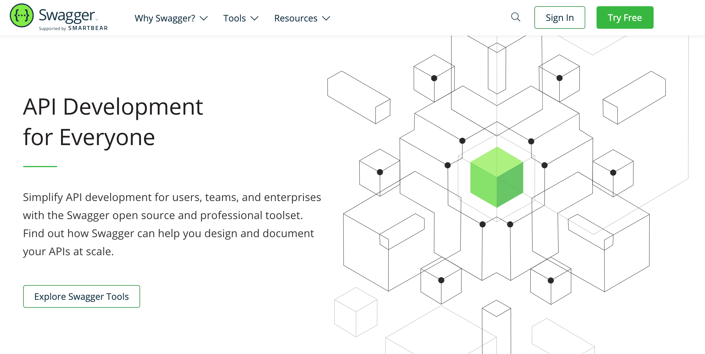
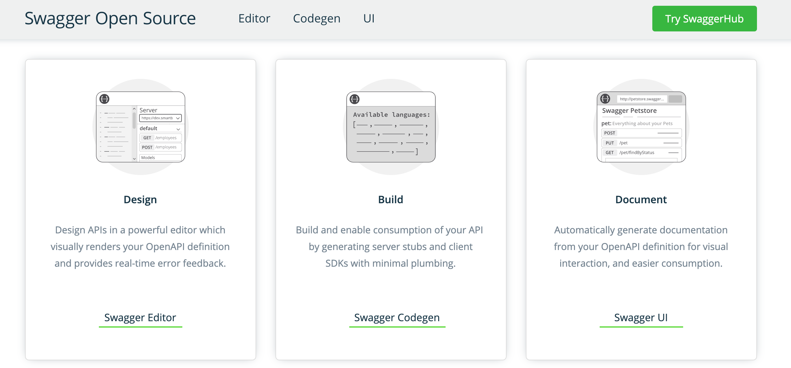
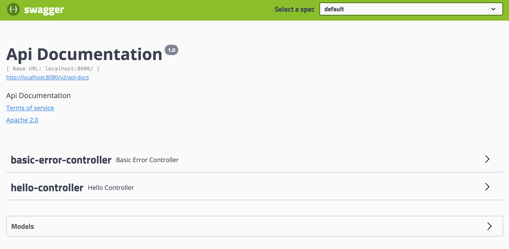
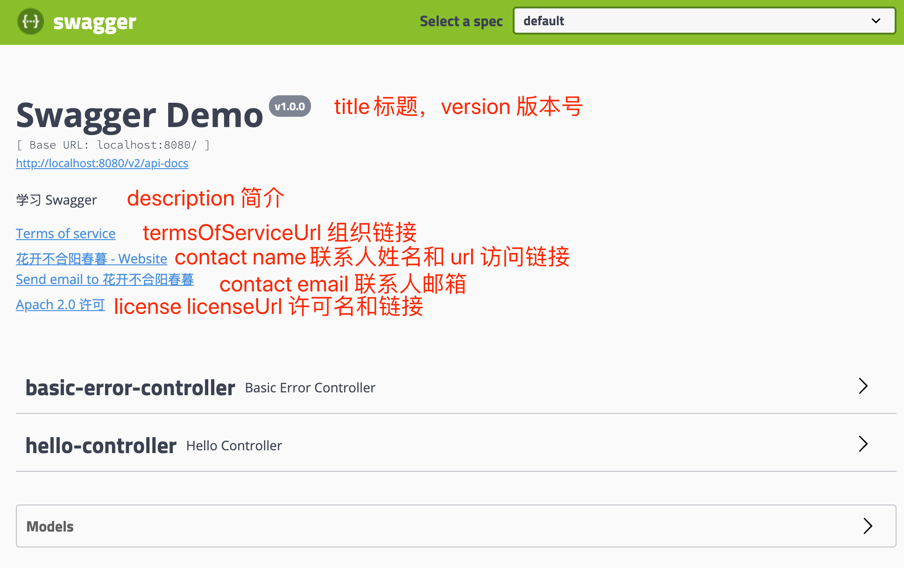
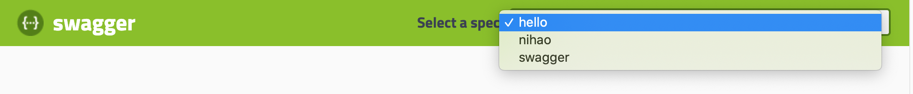
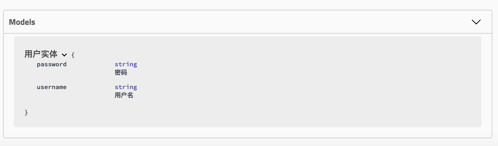
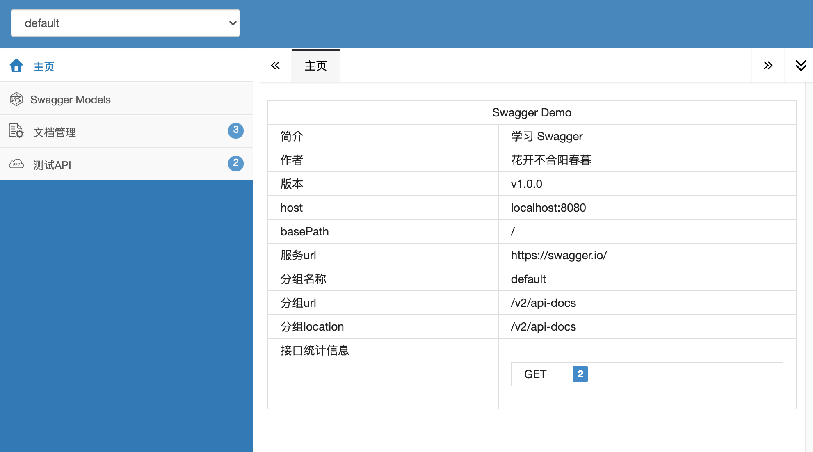
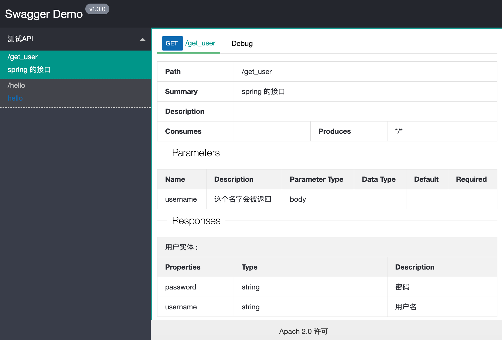
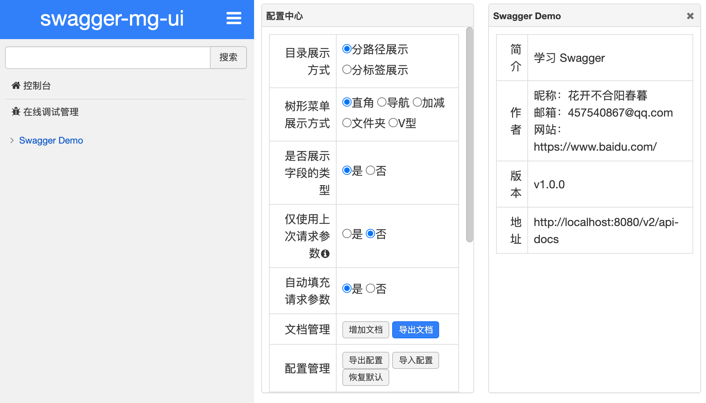
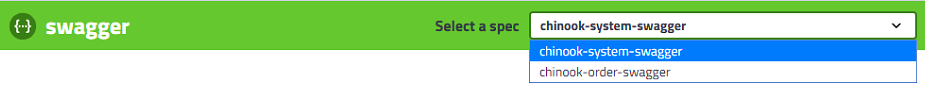

# Swagger



## 1 Swagger 简介

### 1.1 为什么使用 Swagger

**前后端分离**

- 前端 -> 前端控制层、视图层
- 后端 -> 后端控制层、服务层、数据访问层
- 前后端通过API进行交互
- 前后端相对独立且松耦合

**产生的问题**

- 前后端集成，前端或者后端无法做到“及时协商，尽早解决”，最终导致问题集中爆发

**解决方案**

- 首先定义schema [ 计划的提纲 ]，并实时跟踪最新的API，降低集成风险

**Swagger**

- 号称世界上最流行的API框架
- Restful Api 文档在线自动生成器 => **API 文档 与API 定义同步更新**
- 直接运行，在线测试API
- 支持多种语言 （如：Java，PHP等）
- ``官网`` https://swagger.io/

### 1.2 Swagger 几种开源工具

现在SWAGGER官网主要提供了几种开源工具，提供相应的功能。可以通过配置甚至是修改源码以达到你想要的效果。




``Swagger Codegen`` 通过Codegen 可以将描述文件生成html格式和cwiki形式的接口文档，同时也能生成多钟语言的服务端和客户端的代码。支持通过jar包，docker，node等方式在本地化执行生成。也可以在后面的Swagger Editor中在线生成。

``Swagger UI`` 提供了一个可视化的UI页面展示描述文件。接口的调用方、测试、项目经理等都可以在该页面中对相关接口进行查阅和做一些简单的接口请求。该项目支持在线导入描述文件和本地部署UI项目。

``Swagger Editor`` 类似于markendown编辑器的编辑Swagger描述文件的编辑器，该编辑支持实时预览描述文件的更新效果。也提供了在线编辑器和本地部署编辑器两种方式。

``Swagger Inspector`` 感觉和postman差不多，是一个可以对接口进行测试的在线版的postman。比在Swagger UI里面做接口请求，会返回更多的信息，也会保存你请求的实际请求参数等数据。

``Swagger Hub`` 集成了上面所有项目的各个功能，你可以以项目和版本为单位，将你的描述文件上传到Swagger Hub中。在Swagger Hub中可以完成上面项目的所有工作，需要注册账号，分免费版和收费版。

## 2 SpringBoot 集成 Swagger

1. 添加依赖

   ```xml
   <dependency>
       <groupId>io.springfox</groupId>
       <artifactId>springfox-swagger2</artifactId>
       <version>2.9.2</version>
   </dependency>
   <dependency>
       <groupId>io.springfox</groupId>
       <artifactId>springfox-swagger-ui</artifactId>
       <version>2.9.2</version>
   </dependency>
   ```

2. 编写HelloController，测试确保运行成功

   ```java
   @RestController
   @RequestMapping("/")
   public class HelloController {
   
       @GetMapping("/hello")
       public String hello() {
           return "Hello Swagger!";
       }
   
   }
   ```

3. 要使用Swagger，我们需要编写一个配置类-SwaggerConfig来配置 Swagger

   ```java
   @Configuration
   // 开启Swagger2的自动配置
   @EnableSwagger2
   public class SwaggerConfig {
   }
   ```

4. 访问测试 ：http://localhost:8080/swagger-ui.html ，可以看到swagger的界面

   

### 2.1 配置 Swagger

```java
/**
 * Swagger实例Bean是Docket，所以通过配置Docket实例来配置Swaggger
 * 配置docket以配置Swagger具体参数
 * @return
 */
@Bean
public Docket docket() {
    return new Docket(DocumentationType.SWAGGER_2)
            .apiInfo(apiInfo());
}
/**
 * 可以通过apiInfo()属性配置文档信息
 * @return
 */
private ApiInfo apiInfo() {
    return new ApiInfoBuilder()
            .title("Swagger Demo")
            .description("学习 Swagger")
            // 联系人姓名 联系人访问链接 联系人邮箱
            .contact(new Contact("花开不合阳春暮", "https://www.baidu.com/", "457540867@qq.com"))
            .version("v1.0.0")
            // 组织链接
            .termsOfServiceUrl("https://swagger.io/")
            .license("Apach 2.0 许可")
            .licenseUrl("许可链接")
            .build();
}
```



### 2.2 配置扫描接口

构建Docket时通过select()方法配置怎么扫描接口：

```java
@Bean
public Docket docket() {
    return new Docket(DocumentationType.SWAGGER_2)
            .apiInfo(apiInfo())
            // 通过.select()方法，去配置扫描接口,RequestHandlerSelectors配置如何扫描接
            .select()
            .apis(RequestHandlerSelectors.basePackage("com.spring.swagger.controller"))
            .build();
}
```

除了通过包路径配置扫描接口外，还可以通过配置其他方式扫描接口，这里注释一下所有的配置方式：

```java
// 扫描所有，项目中的所有接口都会被扫描到
any()
// 不扫描接口
none()
// 通过方法上的注解扫描，如withMethodAnnotation(GetMapping.class)只扫描get请求
withMethodAnnotation(final Class<? extends Annotation> annotation)
// 通过类上的注解扫描，如.withClassAnnotation(Controller.class)只扫描有controller注解的类中的接口
withClassAnnotation(final Class<? extends Annotation> annotation)
// 根据包路径扫描接口
basePackage(final String basePackage)
```

还可添加过滤路径配置：

```java
@Bean
public Docket docket() {
    return new Docket(DocumentationType.SWAGGER_2)
            .apiInfo(apiInfo())
            // 通过.select()方法，去配置扫描接口,RequestHandlerSelectors配置如何扫描接
            .select()
            .apis(RequestHandlerSelectors.basePackage("com.spring.swagger.controller"))
            .paths(PathSelectors.ant("/hello/**"))
            .build();
}
```

```java
any() // 任何请求都扫描
none() // 任何请求都不扫描
regex(final String pathRegex) // 通过正则表达式控制
ant(final String antPattern) // 通过ant()控制
```

### 2.3 配置 Swagger 开关

```java
@Bean
public Docket docket(Environment environment) {
  	// 动态配置当项目处于test、dev环境时显示swagger，处于prod时不显示
    // 设置要显示swagger的环境
    Profiles of = Profiles.of("dev", "test");
    // 判断当前是否处于该环境
    // 通过 enable() 接收此参数判断是否要显示
    boolean b = environment.acceptsProfiles(of);
    return new Docket(DocumentationType.SWAGGER_2)
            .apiInfo(apiInfo())
            // 配置是否启用Swagger，如果是false，在浏览器将无法访问
            .enable(b)
            // 通过.select()方法，去配置扫描接口,RequestHandlerSelectors配置如何扫描接
            .select()
            .apis(RequestHandlerSelectors.basePackage("com.spring.swagger.controller"))
            //.paths(PathSelectors.ant("/hello/**"))
            .build();
}
```

### 2.4 配置 API 分组

如果没有配置分组，默认是default。通过groupName()方法即可配置分组：

```java
@Bean
public Docket docket(Environment environment) {
   return new Docket(DocumentationType.SWAGGER_2).apiInfo(apiInfo())
      .groupName("hello") // 配置分组
       // 省略配置....
}
```

如何配置多个分组？配置多个分组只需要配置多个docket即可：

```java
@Bean
public Docket docket1(){
   return new Docket(DocumentationType.SWAGGER_2).groupName("hello");
}
@Bean
public Docket docket2(){
   return new Docket(DocumentationType.SWAGGER_2).groupName("nihao");
}
@Bean
public Docket docket3(){
   return new Docket(DocumentationType.SWAGGER_2).groupName("swagger");
}
```



### 2.5 实体配置

```java
// 新建一个实体类
@ApiModel("用户实体")
public class User {

   @ApiModelProperty("用户名")
   public String username;
   
   @ApiModelProperty("密码")
   public String password;
}
```

```java
// 只要这个实体在请求接口的返回值上（即使是泛型），都能映射到实体项中
@RequestMapping("/getUser")
public User getUser(){
   return new User();
}
```



> 注：并不是因为@ApiModel这个注解让实体显示在这里了，而是只要出现在接口方法的返回值上的实体都会显示在这里，而@ApiModel和@ApiModelProperty这两个注解只是为实体添加注释的。
>
> ``@ApiModel`` 为类添加注释
>
> ``@ApiModelProperty`` 为类属性添加注释

### 2.6 常用注解

Swagger 的所有注解定义在 ``io.swagger.annotations`` 包下，下面列一些经常用到的，未列举出来的可以另行查阅说明：

| Swagger注解                                            | 简单说明                                             |
| ------------------------------------------------------ | ---------------------------------------------------- |
| @Api(tags = "xxx模块说明")                             | 作用在模块类上                                       |
| @ApiOperation("xxx接口说明")                           | 作用在接口方法上                                     |
| @ApiModel("xxxPOJO说明")                               | 作用在模型类上：如VO、BO                             |
| @ApiModelProperty(value = "xxx属性说明",hidden = true) | 作用在类方法和属性上，hidden设置为true可以隐藏该属性 |
| @ApiParam("xxx参数说明")                               | 作用在参数、方法和字段上，类似@ApiModelProperty      |

我们也可以给请求的接口配置一些注释

```java
@RestController
@RequestMapping("/")
@Api(value = "HelloController", tags = "测试API")
public class HelloController {

	@ApiOperation("spring 的接口")
	@PostMapping("/spring")
	@ResponseBody
	public String kuang(@ApiParam("这个名字会被返回") String username){
   	return username;
	}
	
}
```

这样的话，可以给一些比较难理解的属性或者接口，增加一些配置信息，让人更容易阅读！

相较于传统的 Postman 或 Curl 方式测试接口，使用 Swagger 简直就是傻瓜式操作，不需要额外说明文档(写得好本身就是文档)而且更不容易出错，只需要录入数据然后点击 ``Execute``，如果再配合自动化框架，可以说基本就不需要人为操作了。

Swagger是个优秀的工具，现在国内已经有很多的中小型互联网公司都在使用它，相较于传统的要先出Word接口文档再测试的方式，显然这样也更符合现在的快速迭代开发行情。当然了，提醒下大家在正式环境要记得关闭Swagger，一来出于安全考虑，二来也可以节省运行时内存。

### 2.7 拓展：其他皮肤

可以导入不同的包实现不同的皮肤定义：

```xml
<!-- 默认的访问 http://localhost:8080/swagger-ui.html -->
<dependency>
   <groupId>io.springfox</groupId>
   <artifactId>springfox-swagger-ui</artifactId>
   <version>2.9.2</version>
</dependency>
```

```xml
<!-- bootstrap-ui  访问 http://localhost:8080/doc.html -->
<!-- 引入swagger-bootstrap-ui包 /doc.html-->
<dependency>
   <groupId>com.github.xiaoymin</groupId>
   <artifactId>swagger-bootstrap-ui</artifactId>
   <version>1.9.1</version>
</dependency>
```



```xml
<!-- Layui-ui 访问 http://localhost:8080/docs.html -->
<!-- 引入swagger-ui-layer包 /docs.html-->
<dependency>
   <groupId>com.github.caspar-chen</groupId>
   <artifactId>swagger-ui-layer</artifactId>
   <version>1.1.3</version>
</dependency>
```



```xml
<!-- mg-ui 访问 http://localhost:8080/document.html -->
<!-- 引入swagger-ui-layer包 /document.html-->
<dependency>
   <groupId>com.zyplayer</groupId>
   <artifactId>swagger-mg-ui</artifactId>
   <version>1.0.6</version>
</dependency>
```



## 3 Swagger 高级应用

### 3.1 Spring Boot 多模块公用 Swagger 配置

```java
/**
 * Swagger自定义配置
 */
@Data
@EqualsAndHashCode(callSuper = false)
@Builder
public class SwaggerProperties {
    /**
     * API文档生成基础路径
     */
    private String apiBasePackage;
    /**
     * 是否要启用登录认证
     */
    private boolean enableSecurity;
    /**
     * 文档标题
     */
    private String title;
    /**
     * 文档描述
     */
    private String description;
    /**
     * 文档版本
     */
    private String version;
    /**
     * 文档联系人姓名
     */
    private String contactName;
    /**
     * 文档联系人网址
     */
    private String contactUrl;
    /**
     * 文档联系人邮箱
     */
    private String contactEmail;
}
```

```java
public abstract class DefaultSwaggerConfig {

    @Bean
    public Docket createRestApi(Environment environment) {
        // 设置要显示的 Swagger 环境
        Profiles profiles = Profiles.of("dev", "test");
        // 通过判断是否处在自己所设定的环境中
        Boolean enable = environment.acceptsProfiles(profiles);

        SwaggerProperties swaggerProperties = swaggerProperties();
        Docket docket = new Docket(DocumentationType.SWAGGER_2)
                .apiInfo(apiInfo(swaggerProperties))
                .enable(enable)
                .select()
                .apis(RequestHandlerSelectors.basePackage(swaggerProperties.getApiBasePackage()))
                .paths(PathSelectors.any())
                .build();
        if (swaggerProperties.isEnableSecurity()) {
            docket.securitySchemes(securitySchemes()).securityContexts(securityContexts());
        }
        return docket;
    }

    private ApiInfo apiInfo(SwaggerProperties swaggerProperties) {
        return new ApiInfoBuilder()
                .title(swaggerProperties.getTitle())
                .description(swaggerProperties.getDescription())
                .contact(new Contact(swaggerProperties.getContactName(), swaggerProperties.getContactUrl(), swaggerProperties.getContactEmail()))
                .version(swaggerProperties.getVersion())
                .build();
    }

    private List<ApiKey> securitySchemes() {
        //设置请求头信息
        List<ApiKey> result = new ArrayList<>();
        ApiKey apiKey = new ApiKey("Authorization", "Authorization", "header");
        result.add(apiKey);
        return result;
    }

    private List<SecurityContext> securityContexts() {
        //设置需要登录认证的路径
        List<SecurityContext> result = new ArrayList<>();
        result.add(getContextByPath("/*/.*"));
        return result;
    }

    private SecurityContext getContextByPath(String pathRegex) {
        return SecurityContext.builder()
                .securityReferences(defaultAuth())
                .forPaths(PathSelectors.regex(pathRegex))
                .build();
    }

    private List<SecurityReference> defaultAuth() {
        List<SecurityReference> result = new ArrayList<>();
        AuthorizationScope authorizationScope = new AuthorizationScope("global", "accessEverything");
        AuthorizationScope[] authorizationScopes = new AuthorizationScope[1];
        authorizationScopes[0] = authorizationScope;
        result.add(new SecurityReference("Authorization", authorizationScopes));
        return result;
    }

    /**
     * 自定义Swagger配置
     */
    public abstract SwaggerProperties swaggerProperties();
}
```

```java
@Configuration
@EnableSwagger2 // 开启 Swagger2
public class SwaggerConfig extends DefaultSwaggerConfig {

    @Override
    public SwaggerProperties swaggerProperties() {
        return SwaggerProperties.builder()
                .apiBasePackage("com.chinook.system.controller")
                .title("System Service")
                .description("系统基础管理服务")
                .contactName("Spring 花开不合阳春暮")
                .version("v1.0.0")
                .enableSecurity(true)
                .build();
    }
}
```

### 3.2 gateway 以服务作为 GroupName

```java
@RestController
@RequestMapping("/swagger-resources")
public class SwaggerHandler {
    @Autowired(required = false)
    private SecurityConfiguration securityConfiguration;
    @Autowired(required = false)
    private UiConfiguration uiConfiguration;

    private final SwaggerResourcesProvider swaggerResources;

    @Autowired
    public SwaggerHandler(SwaggerResourcesProvider swaggerResources) {
        this.swaggerResources = swaggerResources;
    }


    @GetMapping("/configuration/security")
    public Mono<ResponseEntity<SecurityConfiguration>> securityConfiguration() {
        return Mono.just(new ResponseEntity<>(
                Optional.ofNullable(securityConfiguration).orElse(SecurityConfigurationBuilder.builder().build()), HttpStatus.OK));
    }

    @GetMapping("/configuration/ui")
    public Mono<ResponseEntity<UiConfiguration>> uiConfiguration() {
        return Mono.just(new ResponseEntity<>(
                Optional.ofNullable(uiConfiguration).orElse(UiConfigurationBuilder.builder().build()), HttpStatus.OK));
    }

    @GetMapping("")
    public Mono<ResponseEntity> swaggerResources() {
        return Mono.just((new ResponseEntity<>(swaggerResources.get(), HttpStatus.OK)));
    }
}
```

```java
@Component
@Primary
@Slf4j
public class SwaggerProvider implements SwaggerResourcesProvider {

    public static final String API_URI = "/v2/api-docs";

    @Override
    public List<SwaggerResource> get() {
        List<SwaggerResource> resources = new ArrayList<>();
        NacosRouteDefinitionRepository.getNativeRouteDefinitions().stream()
                .forEach(routeDefinition -> routeDefinition.getPredicates().stream()
                        .filter(predicateDefinition -> StringUtils.contains(predicateDefinition.getArgs().get("pattern"), API_URI))
                        .peek(predicateDefinition -> log.debug("路由配置参数：{}", predicateDefinition.getArgs()))
                        .forEach(predicateDefinition -> resources.add(swaggerResource(routeDefinition.getId(),
                                predicateDefinition.getArgs().get("pattern").replace("/**", API_URI)))));
        log.debug("resources:{}", JSON.toJSONString(resources));

        return resources;
    }

    private SwaggerResource swaggerResource(String name, String url) {
        SwaggerResource swaggerResource = new SwaggerResource();
        swaggerResource.setName(name);
        swaggerResource.setUrl(url);
        swaggerResource.setSwaggerVersion("2.0");
        return swaggerResource;
    }
}
```

路由配置：

```json
[
  {
    "id":"chinook-order-swagger",
    "uri": "lb://chinook-order",
    "predicates":[
      {
        "name":"Path",
        "args":{
          "pattern":"/chinook-order/v2/api-docs"
        }
      }
    ],
    "filters": [
      {
        "name":"StripPrefix",
        "args":{
          "parts":1
        }
      }
    ],
    "order":0
  },
  {
    "id":"chinook-system-swagger",
    "uri": "lb://chinook-system",
    "predicates":[
      {
        "name":"Path",
        "args":{
          "pattern":"/chinook-system/v2/api-docs"
        }
      }
    ],
    "filters": [
      {
        "name":"StripPrefix",
        "args":{
          "parts":1
        }
      }
    ],
    "order":0
  }
]
```



------

