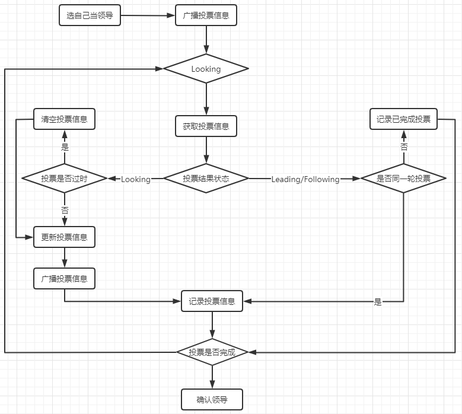
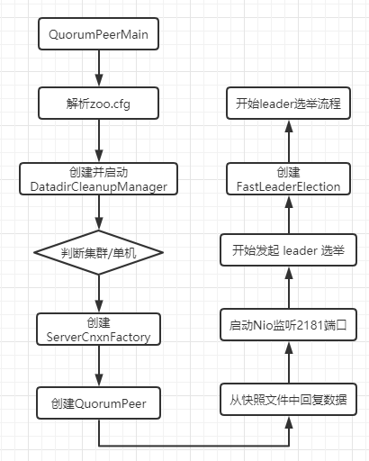

# 1 基于 Curator 实现分布式锁

## 1.1 分布式锁的基本场景

如果在多线程并行情况下去访问某一个共享资源，比如说共享变量，那么势必会造成线程安全问题。那么我们可以用很多种方法来解决，比如 synchronized、 比如 Lock 之类的锁操作来解决线程安全问题，那么在分布式架构下， 涉及到多个进程访问某一个共享资源的情况，比如说在电商平台中商品库存问题，在库存只有 10 个的情况下进来 100 个用户，如何能够避免超卖呢？所以这个时候我们需 要一些互斥手段来防止彼此之间的干扰。 然后在分布式情况下，synchronized 或者 Lock 之类的锁 只能控制单一进程的资源访问，在多进程架构下，这些 api 就没办法解决我们的问题了。怎么办呢？ 

## 1.2 用 zookeeper 来实现分布式锁

结合我们前面对 zookeeper 特性的分析和理解，我们可以利用 zookeeper 节点的特性来实现独占锁，就是同级节点的唯一性，多个进程往 zookeeper 的指定节点下创建一个 相同名称的节点，只有一个能成功，另外一个是创建失败； 创建失败的节点全部通过 zookeeper 的 watcher 机制来监听 zookeeper 这个子节点的变化，一旦监听到子节点的删除事件，则再次触发所有进程去写锁；

这种实现方式很简单，但是会产生“`惊群效应`”，简单来说就是如果存在许多的客户端在等待获取锁，当成功获取到锁的进程释放该节点后，所有处于等待状态的客户端都会被唤醒，这个时候 zookeeper 在短时间内发送大量子节点变更事件给所有待获取锁的客户端，然后实际情况是只会有一个客户端获得锁。如果在集群规模比较大的情况下，会对 zookeeper 服务器的性能产生比较的影响。

## 1.3 利用有序节点来实现分布式锁

我们可以通过有序节点来实现分布式锁，每个客户端都往指定的节点下注册一个临时有序节点，越早创建的节点， 节点的顺序编号就越小，那么我们可以判断子节点中最小的节点设置为获得锁。如果自己的节点不是所有子节点中 最小的，意味着还没有获得锁。这个的实现和前面单节点实现的差异性在于，每个节点只需要监听比自己小的节点， 当比自己小的节点删除以后，客户端会收到 watcher 事件， 此时再次判断自己的节点是不是所有子节点中最小的，如果是则获得锁，否则就不断重复这个过程，这样就不会导致惊群效应，因为每个客户端只需要监控一个节点。

## 1.4 curator 分布式锁的基本使用

curator 对于锁这块做了一些封装，curator 提供了 InterProcessMutex 这样一个 api。除了分布式锁之外， 还提供了 leader 选举、分布式队列等常用的功能。 

`InterProcessMutex`：分布式可重入排它锁

`InterProcessSemaphoreMutex`：分布式排它锁

`InterProcessReadWriteLock`：分布式读写锁

```java
CuratorFramework curatorFramework = CuratorFrameworkFactory.builder().
        connectString(CONNECTION_STR).sessionTimeoutMs(5000).
        retryPolicy(new ExponentialBackoffRetry(1000,10)).build();
curatorFramework.start();
final InterProcessMutex lock = new InterProcessMutex(curatorFramework, "/locks");
for (int i = 0; i < 10; i++) {
    new Thread(()->{
        System.out.println(Thread.currentThread().getName()+"->尝试获取锁");
        try {
            lock.acquire();
            System.out.println(Thread.currentThread().getName()+"->获得锁成功");
        } catch (Exception e) {
            e.printStackTrace();
        }
        try {
            Thread.sleep(4000);
            lock.release();
            System.out.println(Thread.currentThread().getName()+"->释放锁成功");
        } catch (Exception e) {
            e.printStackTrace();
        }
    },"t" + i).start();
}
```

## 1.5 Curator 实现分布式锁的基本原理

### 1.5.1 构造函数

```java
public InterProcessMutex(CuratorFramework client, String path){
    // Zookeeper 利用 path 创建临时顺序节点，实现公平锁的核心
    this(client, path, new StandardLockInternalsDriver());
}
public InterProcessMutex(CuratorFramework client, String path, LockInternalsDriver driver){
    // maxLeases=1，表示可以获得分布式锁的线程数量（跨 JVM）为 1，即为互斥锁
    this(client, path, LOCK_NAME, 1, driver);
}
// protected 构造函数
InterProcessMutex(CuratorFramework client, String path, String lockName, int maxLeases, LockInternalsDriver driver){
    basePath = PathUtils.validatePath(path);
    // internals 的类型为 LockInternals ，InterProcessMutex 将分布式锁的申请和释放操作委托给internals 执行
    internals = new LockInternals(client, driver, path, lockName, maxLeases);
}
```

### 1.5.2 获得锁的逻辑

**InterProcessMutex.acquire**

```java
// 无限等待
public void acquire() throws Exception{
    if ( !internalLock(-1, null) ){
        throw new IOException("Lost connection while trying to acquire lock: " + basePath);
    }
}
// 限时等待
public boolean acquire(long time, TimeUnit unit) throws Exception{
    return internalLock(time, unit);
}
```

**nterProcessMutex.internalLock**

```java
// 映射表
// 记录线程与锁信息的映射关系
private final ConcurrentMap<Thread, LockData> threadData = Maps.newConcurrentMap();

// 锁信息
// Zookeeper 中一个临时顺序节点对应一个“锁”，但让锁生效激活需要排队（公平锁），下面会继续分析
private static class LockData{
    final Thread owningThread;
    final String lockPath;
    // 分布式锁重入次数
    final AtomicInteger lockCount = new AtomicInteger(1);
    private LockData(Thread owningThread, String lockPath){
        this.owningThread = owningThread;
        this.lockPath = lockPath;
    }
}

private boolean internalLock(long time, TimeUnit unit) throws Exception{
    Thread currentThread = Thread.currentThread();
    LockData lockData = threadData.get(currentThread);
    if ( lockData != null ){
        // 实现可重入
 		// 同一线程再次 acquire，首先判断当前的映射表内（threadData）是否有该线程的锁信息，如果有则原子+1，然后返回
        lockData.lockCount.incrementAndGet();
        return true;
    }
    // 映射表内没有对应的锁信息，尝试通过 LockInternals 获取锁
    String lockPath = internals.attemptLock(time, unit, getLockNodeBytes());
    if ( lockPath != null ){
        LockData newLockData = new LockData(currentThread, lockPath);
        threadData.put(currentThread, newLockData);
        return true;
    }
    return false;
}
```

**LockInternals.attemptLock**

```java
// 尝试获取锁，并返回锁对应的 Zookeeper 临时顺序节点的路径
String attemptLock(long time, TimeUnit unit, byte[] lockNodeBytes) throws Exception{
    final long      startMillis = System.currentTimeMillis();
    // 无限等待时，millisToWait 为 null
    final Long      millisToWait = (unit != null) ? unit.toMillis(time) : null;
    // 创建 ZNode 节点时的数据内容，无关紧要，这里为 null，采用默认值（IP 地址）
    final byte[]    localLockNodeBytes = (revocable.get() != null) ? new byte[0] : lockNodeBytes;
    // 当前已经重试次数，与CuratorFramework的重试策略有关
    int             retryCount = 0;
    // 在 Zookeeper 中创建的临时顺序节点的路径，相当于一把待激活的分布式锁
 	// 激活条件：同级目录子节点，名称排序最小（排队，公平锁），后续继续分析
    String          ourPath = null;
    // 是否已经持有分布式锁
    boolean         hasTheLock = false;
    // 是否已经完成尝试获取分布式锁的操作
    boolean         isDone = false;
    while ( !isDone ){
        isDone = true;
        try{
            // 从 InterProcessMutex 的构造函数可知实际 driver 为 StandardLockInternalsDriver 的实例
 			// 在Zookeeper中创建临时顺序节点
            ourPath = driver.createsTheLock(client, path, localLockNodeBytes);
            // 循环等待来激活分布式锁，实现锁的公平性，后续继续分析
            hasTheLock = internalLockLoop(startMillis, millisToWait, ourPath);
        }catch ( KeeperException.NoNodeException e ){
            // 容错处理，不影响主逻辑的理解，可跳过
 			// 因为会话过期等原因 ，StandardLockInternalsDriver 因为无法找到创建的临时顺序节点而抛出 NoNodeException 异常
            if ( client.getZookeeperClient().getRetryPolicy().allowRetry(retryCount++, System.currentTimeMillis() - startMillis, RetryLoop.getDefaultRetrySleeper())){
                // 满足重试策略尝试重新获取锁
                isDone = false;
            } else {
                // 不满足重试策略则继续抛出NoNodeException
                throw e;
            }
        }
    }
    if ( hasTheLock ) {
        // 成功获得分布式锁，返回临时顺序节点的路径，上层将其封装成锁信息记录在映射表，方便锁重入
        return ourPath;
    }
    // 获取分布式锁失败，返回 null
    return null;
}
```

**StandardLockInternalsDriver.createsTheLock**

```java
// 在 Zookeeper 中创建临时顺序节点
public String createsTheLock(CuratorFramework client, String path, byte[] lockNodeBytes) throws Exception{
    String ourPath;
    // lockNodeBytes 不为 null 则作为数据节点内容，否则采用默认内容（IP 地址）
    if ( lockNodeBytes != null ){
        // 下面对 CuratorFramework 的一些细节做解释，不影响对分布式锁主逻辑的解释，可跳过
 		// creatingParentContainersIfNeeded：用于创建父节点，如果不支持 CreateMode.CONTAINER,那么将采用 CreateMode.PERSISTENT(持久)
 		// withProtection：临时子节点会添加GUID前缀
        // CreateMode.EPHEMERAL_SEQUENTIAL：临时顺序节点，Zookeeper 能保证在节点产生的顺序性，依据顺序来激活分布式锁，从而也实现了分布式锁的公平性，后续继续分析
        ourPath = client.create().creatingParentContainersIfNeeded().withProtection().withMode(CreateMode.EPHEMERAL_SEQUENTIAL).forPath(path, lockNodeBytes);
    } else {
        ourPath = client.create().creatingParentContainersIfNeeded().withProtection().withMode(CreateMode.EPHEMERAL_SEQUENTIAL).forPath(path);
    }
    return ourPath;
}
```

**LockInternals.internalLockLoop**

```java
// 循环等待来激活分布式锁，实现锁的公平性
private boolean internalLockLoop(long startMillis, Long millisToWait, String ourPath) throws Exception{
    // 是否已经持有分布式锁
    boolean     haveTheLock = false;
    // 是否需要删除子节点
    boolean     doDelete = false;
    try {
        if ( revocable.get() != null ) {
            client.getData().usingWatcher(revocableWatcher).forPath(ourPath);
        }
        while ( (client.getState() == CuratorFrameworkState.STARTED) && !haveTheLock ) {
            // 获取排序后的子节点列表
            List<String>        children = getSortedChildren();
            // 获取前面自己创建的临时顺序子节点的名称
            String              sequenceNodeName = ourPath.substring(basePath.length() + 1); // +1 to include the slash
            // 实现锁的公平性的核心逻辑，看下面的分析
            PredicateResults    predicateResults = driver.getsTheLock(client, children, sequenceNodeName, maxLeases);
            if ( predicateResults.getsTheLock() ) {
                // 获得了锁，中断循环，继续返回上层
                haveTheLock = true;
            } else {
                // 没有获得到锁，监听上一临时顺序节点
                String  previousSequencePath = basePath + "/" + predicateResults.getPathToWatch();
                synchronized(this) {
                    try {
                        // exists()会导致导致资源泄漏，因为 exists()可以监听不存在的 ZNode，因此采用 getData()
 						// 上一临时顺序节点如果被删除，会唤醒当前线程继续竞争锁，正常情况下能直接获得锁，因为锁是公平的
						client.getData().usingWatcher(watcher).forPath(previousSequencePath);
                        if ( millisToWait != null ) {
                            millisToWait -= (System.currentTimeMillis() - startMillis);
                            startMillis = System.currentTimeMillis();
                            // 获取锁超时，标记删除之前创建的临时顺序节点
                            if ( millisToWait <= 0 ) {
                                doDelete = true;    // timed out - delete our node
                                break;
                            }
                            // 等待被唤醒，限时等待
                            wait(millisToWait);
                        } else {
                            // 等待被唤醒，无限等待
                            wait();
                        }
                    }
                    catch ( KeeperException.NoNodeException e) {
                        // it has been deleted (i.e. lock released). Try to acquire again
                    }
                }
            }
        }
    } catch ( Exception e ) {
        ThreadUtils.checkInterrupted(e);
        doDelete = true;
        throw e;
    } finally {
        if ( doDelete )
        {
            deleteOurPath(ourPath);
        }
    }
    return haveTheLock;
}
```

**StandardLockInternalsDriver.getsTheLock**

```java
public PredicateResults getsTheLock(CuratorFramework client, List<String> children, String sequenceNodeName, int maxLeases) throws Exception {
    // 之前创建的临时顺序节点在排序后的子节点列表中的索引
    int             ourIndex = children.indexOf(sequenceNodeName);
    // 校验之前创建的临时顺序节点是否有效
    validateOurIndex(sequenceNodeName, ourIndex);
    // 锁公平性的核心逻辑
 	// 由 InterProcessMutex 的构造函数可知，maxLeases 为 1，即只有 ourIndex 为 0 时，线程才能持有锁，或者说该线程创建的临时顺序节点激活了锁
 // Zookeeper 的临时顺序节点特性能保证跨多个 JVM 的线程并发创建节点时的顺序性，越早创建临时顺序节点成功的线程会更早地激活锁或获得锁
    boolean         getsTheLock = ourIndex < maxLeases;
    // 如果已经获得了锁，则无需监听任何节点，否则需要监听上一顺序节点（ourIndex-1）
 	// 因为锁是公平的，因此无需监听除了（ourIndex-1）以外的所有节点，这是为了减少惊群效应，非常巧妙的设计！！
    String          pathToWatch = getsTheLock ? null : children.get(ourIndex - maxLeases);
    // 返回获取锁的结果，交由上层继续处理（添加监听等操作）
    return new PredicateResults(pathToWatch, getsTheLock);
}

static void validateOurIndex(String sequenceNodeName, int ourIndex) throws KeeperException {
    if ( ourIndex < 0 ) {
        // 容错处理，可跳过
		// 由于会话过期或连接丢失等原因，该线程创建的临时顺序节点被 Zookeeper 服务端删除，往外抛出 NoNodeException
 		// 如果在重试策略允许范围内，则进行重新尝试获取锁，这会重新重新生成临时顺序节点
 		// 佩服 Curator 的作者将边界条件考虑得如此周到！
        throw new KeeperException.NoNodeException("Sequential path not found: " + sequenceNodeName);
    }
}
```

### 1.5.3 释放锁的逻辑

**InterProcessMutex.release**

```java
public void release() throws Exception {
    Thread currentThread = Thread.currentThread();
    LockData lockData = threadData.get(currentThread);
    if ( lockData == null ) {
        // 无法从映射表中获取锁信息，不持有锁
        throw new IllegalMonitorStateException("You do not own the lock: " + basePath);
    }
    int newLockCount = lockData.lockCount.decrementAndGet();
    if ( newLockCount > 0 ) {
        // 锁是可重入的，初始值为 1，原子-1 到0，锁才释放
        return;
    }
    if ( newLockCount < 0 ) {
        // 理论上无法执行该路径
        throw new IllegalMonitorStateException("Lock count has gone negative for lock: " + basePath);
    }
    try {
        // lockData != null && newLockCount == 0，释放锁资源
        internals.releaseLock(lockData.lockPath);
    } finally {
        // 最后从映射表中移除当前线程的锁信息
        threadData.remove(currentThread);
    }
}
```

**LockInternals.releaseLock**

```java
void releaseLock(String lockPath) throws Exception{
    client.removeWatchers();
    revocable.set(null); 
    // 删除临时顺序节点，只会触发后一顺序节点去 获取锁，理论上不存在竞争，只排队，非抢占，公平锁， 先到先得 
    deleteOurPath(lockPath); 
} 
// Class:LockInternals 
private void deleteOurPath(String ourPath) throws Exception{ 
    try { 
        // 后台不断尝试删除 
        client.delete().guaranteed().forPath(ourPath); 
    } catch ( KeeperException.NoNodeException e ) { 
        // 已经删除(可能会话过期导致)，不做处理 
        // 实际使用 Curator-2.12.0 时，并不会抛 出该异常 
    } 
}
```

# 2 使用 Zookeeper 实现 leader 选举

在分布式计算中，leader election 是很重要的一个功能， 这个选举过程是这样子的：指派一个进程作为组织者，将任务分发给各节点。在任务开始前，哪个节点都不知道谁是 leader 或者 coordinator。当选举算法开始执行后，每 个节点最终会得到一个唯一的节点作为任务 leader。除此之外，选举还经常会发生在 leader 意外宕机的情况下，新的 leader 要被选举出来。 

Curator 有两种选举 recipe（Leader Latch 和 Leader Election） 

**Leader Latch**

参与选举的所有节点，会创建一个顺序节点，其中最小的节点会设置为 master 节点, 没抢到 Leader 的节点都监听前一个节点的删除事件，在前一个节点删除后进行重新抢主，当 master 节点手动调用 close 方法或者 master 节点挂了之后，后续的子节点才会去抢占 master。 其中 spark 使用的就是这种方法。

**LeaderSelector**

LeaderSelector 和 Leader Latch 最大的差别在于，leader 调用 takeLeadership() 方法进行业务逻辑处理，释放领导权以后，还可以继续参与竞争。

autoRequeue() 方法的调用确保此实例在释放领导权后还可能获得领导权，这样保证了每个节点都可以获得领导权。

```java
public class SelectorClient extends LeaderSelectorListenerAdapter implements Closeable {
    private final String name;
    private final LeaderSelector leaderSelector;
    public SelectorClient (CuratorFramework client, String path, String name) {
        this.name = name;
        // 利用一个给定的路径创建一个 leaderselector
        // 执行 leader 选举的所有参与者对应的路径必须一样
        // 本例中 SelectorClient 也是一个LeaderSelectorListener，但这不是必须的。
        leaderSelector = new LeaderSelector(client, path, this);
        // 在大多数情况下，我们会希望一个 selector放弃 leader 后还要重新参与 leader 选举
        leaderSelector.autoRequeue();
    }
    public void start(){
        leaderSelector.start();
    }
    @Override
    public void close() throws IOException {
        leaderSelector.close();
    }
    @Override
    public void takeLeadership(CuratorFramework curatorFramework) throws Exception {
        //选举为 master
        System.out.println(name + " 现在是 leader了，持续成为 leader ");

        //阻塞，让当前获得 leader权限的节点一直持有，直到该进程关闭
        System.in.read();
    }
    private static String CONNECTION_STR="192.168.25.128:2181,192.168.25.129:2181,192.168.25.130:2181";
    public static void main(String[] args) throws IOException {
        CuratorFramework curatorFramework = CuratorFrameworkFactory.builder().
                connectString(CONNECTION_STR).sessionTimeoutMs(5000).
                retryPolicy(new ExponentialBackoffRetry(1000,3)).build();
        curatorFramework.start();
        SelectorClient sc=new SelectorClient(curatorFramework,"/leader","ClientA");
        sc.start();
        System.in.read();
    }
}
```

# 3 Zookeeper 数据的同步流程

在 zookeeper 中，客户端会随机连接到 zookeeper 集群中的一个节点，如果是读请求，就直接从当前节点中读取数据，如果是写请求，那么请求会被转发给 leader 提交事务， 然后 leader 会广播事务，只要有超过半数节点写入成功， 那么写请求就会被提交（类 2PC 事务）。

那么问题来了

1. 集群中的 leader 节点如何选举出来？ 
2. leader 节点崩溃以后，整个集群无法处理写请求，如何快速从其他节点里面选举出新的 leader 呢？ 
3. leader 节点和各个 follower 节点的数据一致性如何保证

## 3.1 ZAB 协议

paxos 协议主要就是如何保证在分布式环网络环境下，各个服务器如何达成一致最终保证数据的一致性问题。 ZAB 协议基于 paxos 协议的一个改进。

`ZAB（Zookeeper Atomic Broadcast）`协议是为分布式协调服务 ZooKeeper 专门设计的一种支持崩溃恢复的原子广播协议。在 ZooKeeper 中，主要依赖 ZAB 协议来实现分布式数据一致性，基于该协议，ZooKeeper 实现了一种主备模式的系统架构来保持集群中各个副本之间的数据一致性。

ZAB 协议包含两种基本模式，分别是 

1. 崩溃恢复 
2. 原子广播 

当整个集群在启动时，或者当 leader 节点出现网络中断、 崩溃等情况时，ZAB 协议就会进入恢复模式并选举产生新的 Leader，当 leader 服务器选举出来后，并且集群中有过半的机器和该 leader 节点完成数据同步后（同步指的是数据同步，用来保证集群中过半的机器能够和 leader 服务器 的数据状态保持一致），ZAB 协议就会退出恢复模式。 

当集群中已经有过半的 Follower 节点完成了和 Leader 状态同步以后，那么整个集群就进入了消息广播模式。这个时候，在 Leader 节点正常工作时，启动一台新的服务器加入到集群，那这个服务器会直接进入数据恢复模式，和 leader 节点进行数据同步。同步完成后即可正常对外提供非事务请求的处理。 需要注意的是：leader 节点可以处理事务请求和非事务请求，follower 节点只能处理非事务请求，如果 follower 节点接收到非事务请求，会把这个请求转发给 Leader 服务器。

## 3.2 消息广播的实现原理

消息广播的过程实际上是一个简化版本的二阶段提交过程：

1. leader 接收到消息请求后，将消息赋予一个全局唯一的 64 位自增 id，叫：zxid，通过 zxid 的大小比较既可以实现因果有序这个特征 
2. leader 为每个 follower 准备了一个 FIFO 队列（通过 TCP 协议来实现，以实现了全局有序这一个特点）将带有 zxid 的消息作为一个提案（proposal）分发给所有的 follower 
3. 当 follower 接收到 proposal，先把 proposal 写到磁盘， 写入成功以后再向 leader 回复一个 ack 
4. 当 leader 接收到合法数量（超过半数节点）的 ACK 后， leader 就会向这些 follower 发送 commit 命令，同时会在本地执行该消息 
5. 当 follower 收到消息的 commit 命令以后，会提交该消息

ps: 和完整的 2pc 事务不一样的地方在于，ZAB 协议不能终止事务，follower 节点要么 ACK 给 leader，要么抛弃 leader，只需要保证过半数的节点响应这个消息并提交了即可，虽然在某一个时刻 follower 节点和 leader 节点的状态会不一致，但是也是这个特性提升了集群的整体性能。 当然这种数据不一致的问题，ZAB 协议提供了一种恢复模式来进行数据恢复。

这里需要注意的是： leader 的投票过程，不需要 Observer 的 ack，也就是 Observer 不需要参与投票过程，但是 Observer 必须要同步 Leader 的数据从而在处理请求的时候保证数据的一致性。

## 3.3 崩溃恢复的实现原理

前面我们已经清楚了 ZAB 协议中的消息广播过程，ZAB 协议的这个基于原子广播协议的消息广播过程，在正常情况下是没有任何问题的，但是一旦 Leader 节点崩溃，或者由于网络问题导致 Leader 服务器失去了过半的 Follower 节点的联系（leader 失去与过半 follower 节点联系，可能是 leader 节点和 follower 节点之间产生了网络分区，那么此时的 leader 不再是合法的 leader 了），那么就会进入到崩溃恢复模式。

崩溃恢复状态下 zab 协议需要做两件事：

1. 选举出新的 leader 
2. 数据同步

 前面在讲解消息广播时，知道 ZAB 协议的消息广播机制是简化版本的 2PC 协议，这种协议只需要集群中过半的节点响应提交即可。但是它无法处理 Leader 服务器崩溃带来的数据不一致问题。因此在 ZAB 协议中添加了一个“崩溃恢复模式”来解决这个问题。 

那么 ZAB 协议中的崩溃恢复需要保证，如果一个事务 Proposal 在一台机器上被处理成功，那么这个事务应该在所有机器上都被处理成功，哪怕是出现故障。为了达到这个目的，我们先来设想一下，在 zookeeper 中会有哪些场景导致数据不一致性，以及针对这个场景，zab 协议中的崩溃恢复应该怎么处理。 

### 3.3.1 已经被处理的消息不能丢

当leader 收到合法数量 follower 的 ACKs 后，就向各个 follower 广播 COMMIT 命令，同时也会在本地执行 COMMIT 并向连接的客户端返回「成功」。

但是如果在各个 follower 在收到 COMMIT 命令前 leader 就挂了，导致剩下的服务器并没有执行都这条消息。

那么针对这种情况， ZAB 协议就需要确保事务最终能够在所有的服务器上都能被提交成功，否则将会出现不一致。

### 3.3.2 被丢弃的消息不能再次出现

当 leader 接收到消息请求生成 proposal 后就挂了，其他 follower 并没有收到此 proposal ，因此经 过恢复模式重新选 了 leader 后，这条消息是被跳过的。 此时，之前挂了的 leader 重新启动并注册成了 follower， 他保留了被跳过消息的 proposal 状态，与 整个系统的状态是不一致的，需要将其删除。

ZAB 协议需要满足上面两种情况，就必须要设计一个 leader 选举算法：

能够确保已经被 leader 提交的事务 Proposal 能够提交、同时丢弃已经被跳过的事务 Proposal。 

针对这个要求：

1. 如果 leader 选举算法能够保证新选举出来的 Leader 服务器拥有集群中所有机器最高编号（ZXID 最大）的事务 Proposal，那么就可以保证这个新选举出来的 Leader 一 定具有已经提交的提案。因为所有提案被 COMMIT 之前必须有超过半数的 follower ACK，即必须有超过半数节点的服务器的事务日志上有该提案的 proposal，因此，只要有合法数量的节点正常工作，就必然有一个节点保存了所有被 COMMIT 消息的 proposal 状态
2.  另外一个，zxid 是 64 位，高 32 位是 epoch 编号，每经过一次 Leader 选举产生一个新的 leader，新的 leader 会将 epoch 号+1，低 32 位是消息计数器，每接收到一 条消息这个值+1，新 leader 选举后低 32 位值重置为 0。这样设计的好处在于老的 leader 挂了以后重启，它不会被选举为 leader，因此此时它的 zxid 肯定小于当前新的 leader。当老的 leader 作为 follower 接入新的 leader 后，新的 leader 会让它将所有的拥有旧的 epoch 号的未被 COMMIT 的 proposal 清除

## 3.4 关于 ZXID

前面一直提到 zxid，也就是事务 id，那么这个 id 具体起什么作用，以及这个 id 是如何生成的，简单给大家解释下为了保证事务的顺序一致性，zookeeper 采用了递增的事 务 id 号（zxid）来标识事务。所有的提议（proposal）都在被提出的时候加上了 zxid。实现中 zxid 是一个 64 位的数字，它高 32 位是 epoch（ZAB 协议通过 epoch 编号来区分 Leader 周期变化的策略）用来标识 leader 关系是否改变，每次一个 leader 被选出来，它都会有一个新的 epoch=（原来的 epoch+1），标识当前属于那个 leader 的 统治时期。低 32 位用于递增计数。 

epoch：可以理解为当前集群所处的年代或者周期，每个 leader 就像皇帝，都有自己的年号，所以每次改朝换 代，leader 变更之后，都会在前一个年代的基础上加 1。这样就算旧的 leader 崩溃恢复之后，也没有人听他的了，因为 follower 只听从当前年代的 leader 的命令。

# 4 Leader 选举的原理

leader 选举存在与两个阶段中，一个是服务器启动时的 leader 选举。 另一个是运行过程中 leader 节点宕机导致的 leader 选举 ； 

在开始分析选举的原理之前，先了解几个重要的参数：

`服务器 ID（myid）` 比如有三台服务器，编号分别是 1,2,3。 编号越大在选择算法中的权重越大

`zxid 事务 id` 值越大说明数据越新，在选举算法中的权重也越大

`逻辑时钟（epoch – logicalclock） 或者叫投票的次数` 同一轮投票过程中的逻辑时钟值是相同的。每投完一次票这个数据就会增加，然后与接收到的其它服务器返回的投票信息中的数值相比，根据不同的值做出不同的判断

选举状态：

LOOKING，竞选状态

FOLLOWING，随从状态，同步 leader 状态，参与投票

OBSERVING，观察状态，同步 leader 状态，不参与投票

LEADING，领导者状态

## 4.1 服务器启动时的 leader 选举

每个节点启动的时候状态都是 LOOKING，处于观望状态，接下来就开始进行选主流程。

若进行 Leader 选举，则至少需要两台机器，这里选取 3 台机器组成的服务器集群为例。在集群初始化阶段，当有一台服务器 Server1 启动时，其单独无法进行和完成 Leader 选举，当第二台服务器 Server2 启动时，此时两台机器可以相互通信，每台机器都试图找到 Leader，于是进入 Leader 选举过程。选举过程如下：

(1) 每个 Server 发出一个投票。由于是初始情况，Server1 和 Server2 都会将自己作为 Leader 服务器来进行投票，每次投票会包含所推举的服务器的 myid 和 ZXID、epoch，使用(myid,ZXID,epoch)来表示， 此时 Server1 的投票为(1, 0)，Server2 的投票为(2, 0)，然后各自将这个投票发给集群中其他机器

 (2) 接受来自各个服务器的投票。集群的每个服务器收到投票后，首先判断该投票的有效性，如检查是否是本轮投票（epoch）、是否来自 LOOKING 状态的服务器

(3) 处理投票。针对每一个投票，服务器都需要将别人的投票和自己的投票进行 PK，PK 规则如下：

i. 优先比较 epoch

ii. 其次检查 ZXID。ZXID 比较大的服务器优先作为 Leader

iii. 如果 ZXID 相同，那么就比较 myid。myid 较大的服务器作为 Leader 服务器。 

对于 Server1 而言，它的投票是(1, 0)，接收 Server2 的投票为(2, 0)， 首先会比较两者的 ZXID，均为 0，再比较 myid，此时 Server2 的 myid 最大，于是更新自己的投票为(2, 0)，然后重新投票，对于 Server2 而言，其无须更新自己的投票，只是再次向集群中所有机器发出上一次投票信息即可

(4) 统计投票。每次投票后，服务器都会统计投票信息，判断是否已经有过半机器接受到相同的投票信息，对于 Server1、Server2 而言，都统计出集群中已经有两台机器接受了(2, 0)的投票信息，此时便认为已经选出了 Leader

(5) 改变服务器状态。一旦确定了 Leader，每个服务器就会更新自己的状态，如果是 Follower，那么就变更为 FOLLOWING，如果是 Leader， 就变更为 LEADING

## 4.2 运行过程中的 leader 选举

当集群中的 leader 服务器出现宕机或者不可用的情况时，那么整个集群将无法对外提供服务，而是进入新一轮的 Leader 选举，服务器运行期间的 Leader 选举和启动时期的 Leader 选举基本过程是一致的。 

(1) 变更状态。Leader 挂后，余下的非 Observer 服务器都会将自己的服务器状态变更为 LOOKING，然后开始进入 Leader 选举过程

(2) 每个 Server 会发出一个投票。在运行期间，每个服务器上的 ZXID 可能不同，此时假定 Server1 的 ZXID 为 123，Server3 的 ZXID 为 122； 在第一轮投票中，Server1 和 Server3 都会投自己，产生投票(1, 123)， (3, 122)，然后各自将投票发送给集群中所有机器。接收来自各个服务器的投票。与启动时过程相同

(3) 处理投票。与启动时过程相同，此时，Server1 将会成为 Leader

(4) 统计投票。与启动时过程相同

(5) 改变服务器的状态。与启动时过程相同



## 4.3 leader 选举的源码分析

源码分析，最关键的是要找到一个入口，对于 zk 的 leader 选举，并不是由客户端来触发，而是在启动的时候会触发一次选举。因此我们可以直接去看启动脚本 zkServer.sh 中的运行命令 ZOOMAIN 就是 QuorumPeerMain。那么我们基于这个入口来看：

```shell
ZOOMAIN="org.apache.zookeeper.server.quorum.QuorumPeerMain"
...
-XX:+HeapDumpOnOutOfMemoryError -XX:OnOutOfMemoryError='kill -9 %p' \
-cp "$CLASSPATH" $JVMFLAGS $ZOOMAIN "$ZOOCFG" > "$_ZOO_DAEMON_OUT" 2>&1 < /dev/null &
```

**QuorumPeerMain.main**

main 方法中，调用了 initializeAndRun 进行初始化并且运行：

```java
protected void initializeAndRun(String[] args) throws ConfigException, IOException, AdminServerException {
    // 设置配置参数，如果 args 不为空，可以基于外部的配置路径来进行解析
    QuorumPeerConfig config = new QuorumPeerConfig();
    if (args.length == 1) {
        config.parse(args[0]);
    }
    // 这里启动了一个线程，来定时对日志进行清理，从命名来看也很容易理解
    DatadirCleanupManager purgeMgr = new DatadirCleanupManager(
        config.getDataDir(),
        config.getDataLogDir(),
        config.getSnapRetainCount(),
        config.getPurgeInterval());
    purgeMgr.start();
    // 如果是集群模式，会调用 runFromConfig.servers 实际就是我们在 zoo.cfg 里面配置的集群节点
    if (args.length == 1 && config.isDistributed()) {
        runFromConfig(config);
    } else {
       //否则直接运行单机模式
        LOG.warn("Either no config or no quorum defined in config, running in standalone mode");
        // there is only server in the quorum -- run as standalone
        ZooKeeperServerMain.main(args);
    }
}
```

**runFromConfig**

从名字可以看出来，是基于配置文件来进行启动。所以整个方法都是对参数进行解析和设置 ，因为这些参数暂时还没用到，所以没必要去看。直接看核心的代码。

quorumPeer.start()， 启动一个线程，那么从这句代码可以看出来 QuorumPeer 实际是继承了线程。那么它里面一定有一个 run 方法。

**QuorumPeer.start**

QuorumPeer.start 方法，重写了 Thread 的 start。也就是在线程启动之前，会做以下操作：

1. 通过 loadDataBase 恢复快照数据 
2. startServerCnxnFactory() 方法中调用 cnxnFactory.start() 启动 zkServer，相当于用户可以通过 2181 这个端口进行通信了，这块后续在讲。我们还是以 leader 选举为主线

```java
public synchronized void start() {
    loadDataBase();
		cnxnFactory.start();     
		startLeaderElection();
		super.start();
}
```

**startLeaderElection**

终于进入 leader 选举的方法了

```java
synchronized public void startLeaderElection() {
	try {
    //构建一个票据，用于投票
		currentVote = new Vote(myid, getLastLoggedZxid(), getCurrentEpoch());
	} catch(IOException e) {
		RuntimeException re = new RuntimeException(e.getMessage());
		re.setStackTrace(e.getStackTrace());
		throw re;
	}
  //这个 getView 返回的就是在配置文件中配置的 server.myid=ip:port:port。view 在哪里解析的呢？
    for (QuorumServer p : getView().values()) {
      //获得当前 zkserver myid 对应的 ip 地址
        if (p.id == myid) {
            myQuorumAddr = p.addr;
            break;
        }
    }
    if (myQuorumAddr == null) {
        throw new RuntimeException("My id " + myid + " not in the peer list");
    }
    //根据 electionType 匹配对应的选举算法,electionType 默认值为 3.可以在配置文件中动态配置
    if (electionType == 0) {
        try {
            udpSocket = new DatagramSocket(myQuorumAddr.getPort());
            responder = new ResponderThread();
            responder.start();
        } catch (SocketException e) {
            throw new RuntimeException(e);
        }
    }
    this.electionAlg = createElectionAlgorithm(electionType);
}
```

**quorumPeer. createElectionAlgorithm**

根据对应的标识创建选举算法

```java
protected Election createElectionAlgorithm(int electionAlgorithm) {
    Election le = null;
    //TODO: use a factory rather than a switch
    switch (electionAlgorithm) {
    // 新版本中移除0，1，2
    //case 1:
        //throw new UnsupportedOperationException("Election Algorithm 1 is not supported.");
    //case 2:
        //throw new UnsupportedOperationException("Election Algorithm 2 is not supported.");
    case 0:
    		le = new LeaderElection(this);
    		break;
		case 1:
    		le = new AuthFastLeaderElection(this);
    		break;
		case 2:
    		le = new AuthFastLeaderElection(this, true);
    		break;
    case 3:
        qcm = createCnxnManager();
        QuorumCnxManager.Listener listener = qcm.listener;
        if (listener != null) {
            //启动监听器，这个监听具体做什么的暂时不管，后面遇到需要了解的地方再回过头来看
            listener.start();
            // 初始化 FastLeaderElection
            le = new FastLeaderElection(this, qcm);
        } else {
            LOG.error("Null listener when initializing cnx manager");
        }
        break;
    default:
        assert false;
    }
    return le;
}
```

**FastLeaderElection**

初始化 FastLeaderElection，QuorumCnxManager 是一个很核心的对象， 用来实现领导选举中的网络连接管理功能，这个后面会用到。

```java
public FastLeaderElection(QuorumPeer self, QuorumCnxManager manager) {
    this.stop = false;
    this.manager = manager;
    starter(self, manager);
}
```

**FastLeaderElection. starter**

starter 方法里面，设置了一些成员属性，并且构建了两个阻塞队列，分别是 sendQueue 和 recvqueue。并且实例化了一个 Messager：

```java
private void starter(QuorumPeer self, QuorumCnxManager manager) {
    this.self = self;
    proposedLeader = -1;
    proposedZxid = -1;
    sendqueue = new LinkedBlockingQueue<ToSend>();
    recvqueue = new LinkedBlockingQueue<Notification>();
    this.messenger = new Messenger(manager);
}
```

**Messenger**

在 Messenger 里面构建了两个线程，一个是 WorkerSender，一个是 WorkerReceiver。 这两个线程是分别用来发送和接收消息的线程。具体做什么，暂时先不分析。

```java
Messenger(QuorumCnxManager manager) {
    this.ws = new WorkerSender(manager);
    Thread t = new Thread(this.ws,
            "WorkerSender[myid=" + self.getId() + "]");
    t.setDaemon(true);
    t.start();
    this.wr = new WorkerReceiver(manager);
    t = new Thread(this.wr,
            "WorkerReceiver[myid=" + self.getId() + "]");
    t.setDaemon(true);
    t.start();
}
```



## 4.4 getView 的解析流程

```java
public Map<Long, QuorumPeer.QuorumServer> getView() {
    return Collections.unmodifiableMap(getQuorumVerifier().getAllMembers());
}
```

getView 里面实际上调用的是一个 QuorumVerifier.getAllMembers() 方法，就是参与本次投票的成员有哪些。这个属性在哪里赋值的呢？ 我们又得回到 runFromConfig 方法中。

```java
...
quorumPeer.setQuorumPeers(config.getServers());
...
```

config 这个配置信息又是通过在 QuorumPeerMain.initializeAndRun 方法中初始化的：

```java
QuorumPeerConfig config = new QuorumPeerConfig();
if (args.length == 1) {
    config.parse(args[0]);
}
```

**QuorumPeerConfig.parse**

这里会根据一个外部的文件去进行解析，然后其中有一段是这样，解析对应的集群配置数据放到 servers 这个集合中：

```java
public void parse(String path) throws ConfigException {
	...
	parseProperties(cfg);
	...
}
// parseProperties()方法的部分代码
else if (key.startsWith("server.")) {
  int dot = key.indexOf('.');
  long sid = Long.parseLong(key.substring(dot + 1));
  String parts[] = splitWithLeadingHostname(value);
  if ((parts.length != 2) && (parts.length != 3) && (parts.length !=4)) {
      LOG.error(value
         + " does not have the form host:port or host:port:port " +
         " or host:port:port:type");
  }
  ...
  if (type == LearnerType.OBSERVER){
     observers.put(Long.valueOf(sid), new QuorumServer(sid, hostname, port, electionPort, type));
  } else {
      servers.put(Long.valueOf(sid), new QuorumServer(sid, hostname, port, electionPort, type));
  }
```

## 4.5 ZkServer 服务启动的逻辑

在讲 leader 选举的时候，有一个 cnxnFactory.start()方法来启动 zk 服务， 这块具体做了什么呢？

我们来分析看看 QuorumPeerMain.runFromConfig 在 runFromConfig 中，有构建了一个 ServerCnxnFactory：

```java
public void runFromConfig(QuorumPeerConfig config) throws IOException {
  ...
  LOG.info("Starting quorum peer");
  try {
      ServerCnxnFactory cnxnFactory = ServerCnxnFactory.createFactory();
      cnxnFactory.configure(config.getClientPortAddress(),
                            config.getMaxClientCnxns());
      ...
        //并且将这个 factory 设置给了 quorumPeer 的成员属性
      quorumPeer.setCnxnFactory(cnxnFactory);
    	...
```

这个很明显是一个工厂模式，基于这个工厂类创建什么呢？ 打开 createFactory 方法看看就知道了。

**ServerCnxnFactory.createFactory**

这个方法里面是根据 `ZOOKEEPER_SERVER_CNXN_FACTORY` 来决定创 建 NIO server 还是 Netty Server 而默认情况下，应该是创建一个 NIOServerCnxnFactory。

```java
public static final String ZOOKEEPER_SERVER_CNXN_FACTORY = "zookeeper.serverCnxnFactory";
public static ServerCnxnFactory createFactory() throws IOException {
    String serverCnxnFactoryName = System.getProperty(ZOOKEEPER_SERVER_CNXN_FACTORY);
    if (serverCnxnFactoryName == null) {
        serverCnxnFactoryName = NIOServerCnxnFactory.class.getName();
    }
    try {
        ServerCnxnFactory serverCnxnFactory = (ServerCnxnFactory) Class.forName(serverCnxnFactoryName)
                                                                       .getDeclaredConstructor()
                                                                       .newInstance();
        LOG.info("Using {} as server connection factory", serverCnxnFactoryName);
        return serverCnxnFactory;
    } catch (Exception e) {
        IOException ioe = new IOException("Couldn't instantiate " + serverCnxnFactoryName, e);
        throw ioe;
    }
}
```

因此，我们再回到 QuorumPeer.start()方法中，startServerCnxnFactory()，应该会调用 NIOServerCnxnFactory 这个类去启动一个线程。

**NIOServerCnxnFactory.start**

这里通过 thread.start 启动一个线程，那 thread 是一个什么对象呢？

```java
public void start() {
    // ensure thread is started once and only once
    if (thread.getState() == Thread.State.NEW) {
        thread.start();
    }
}
```

**NIOServerCnxnFactory.configure**

thread 其实构建的是一个 SelectorThread(最终继承自ZookeeperThread) 线程，因此定位到 SelectorThread.run。

到此，NIOServer 的初始化以及启动过程就完成了。并且对 2181 的这个端口进行监听。一旦发现有请求进来，就执行相应的处理即可。这块后续在分析数据同步的时候再做详细了解：

```java
public void configure(InetSocketAddress addr, int maxcc) throws IOException {
    configureSaslLogin();
    thread = new ZooKeeperThread(this, "NIOServerCxn.Factory:" + addr);
    thread.setDaemon(true);
    maxClientCnxns = maxcc;
    this.ss = ServerSocketChannel.open();
    ss.socket().setReuseAddress(true);
    LOG.info("binding to port " + addr);
    ss.socket().bind(addr);
    ss.configureBlocking(false);
    ss.register(selector, SelectionKey.OP_ACCEPT);
}
```

## 4.6 选举流程分析

前面分析这么多，还没有正式分析到 leader 选举的核心流程，前期准备工作做好了以后，接下来就开始正式分析 leader 选举的过程：

```java
// QuorumPeer.java
public synchronized void start() {
    ...
    super.start();
}
```

很明显，super.start() 表示当前类 QuorumPeer 继承了线程，线程必须要重写 run 方法，所以我们可以在 QuorumPeer 中找到一个 run 方法。

**QuorumPeer.run**

getPeerState 表示获取选举状态。对于选举来说，默认都是 LOOKING 状态， 只有 LOOKING 状态才会去执行选举算法。每个服务器在启动时都会选择自己做为领导，然后将投票信息发送出去，循环一直到选举出领导为止。

```java
public void run() {
    setName("QuorumPeer" + "[myid=" + getId() + "]" +
            cnxnFactory.getLocalAddress());
    //… 根据选举状态，选择不同的处理方式
        while (running) {
            switch (getPeerState()) {
            case LOOKING:
                LOG.info("LOOKING");
                //判断是否为只读模式,通过”readonlymode.enabled”开启
                if (Boolean.getBoolean("readonlymode.enabled")) {
                    //只读模式的启动流程
                } else {
                    try {
                        setBCVote(null);
                      //设置当前的投票，通过策略模式来决定当前用哪个选举算法来进行领导选举
                        setCurrentVote(makeLEStrategy().lookForLeader());
                    } catch (Exception e) {
                        LOG.warn("Unexpected exception", e);
                        setPeerState(ServerState.LOOKING);
                    }
                }
                break;
            	...
            }
        }
    } finally {
        ...
    }
}
```

**FastLeaderElection.lookForLeader**

开始发起投票流程

```java
public Vote lookForLeader() throws InterruptedException {
    ...
    try {
        Map<Long, Vote> recvset = new HashMap<Long, Vote>();
        Map<Long, Vote> outofelection = new HashMap<Long, Vote>();
        int notTimeout = minNotificationInterval;
        synchronized (this) {
            logicalclock.incrementAndGet();
            //更新逻辑时钟，用来判断是否在同一轮选举周期
			//初始化选票数据：这里其实就是把当前节点的 myid，zxid，epoch 更新到本地的成员属性
            updateProposal(getInitId(), getInitLastLoggedZxid(), getPeerEpoch());
        }
        LOG.info(
            "New election. My id = {}, proposed zxid=0x{}",
            self.getId(),
            Long.toHexString(proposedZxid));
        //异步发送选举信息
        sendNotifications();
        SyncedLearnerTracker voteSet;
        // 这里就是不断循环，根据投票信息进行进行 leader 选举
        while ((self.getPeerState() == ServerState.LOOKING) && (!stop)) {
            // 从 recvqueue 中获取消息
            Notification n = recvqueue.poll(notTimeout, TimeUnit.MILLISECONDS);
            // 如果没有获取到外部的投票，有可能是集群之间的节点没有真正连接上
            if (n == null) {
                //判断发送队列是否有数据，如果发送队列为空，再发一次自己的选票
                if (manager.haveDelivered()) {
                    sendNotifications();
                } else {
                    //在此发起集群节点之间的连接
                    manager.connectAll();
                }
                /*
                 * Exponential backoff
                 */
                int tmpTimeOut = notTimeout * 2;
                notTimeout = Math.min(tmpTimeOut, maxNotificationInterval);
                LOG.info("Notification time out: {}", notTimeout);
            } else if (validVoter(n.sid) && validVoter(n.leader)) {
                // 选票的判断逻辑
            }
            ...
        }
    }
}
```

**选票的判断逻辑（核心代码） **

```java
// 判断收到的选票中的 sid 和选举的 leader 的 sid 是否存在于我们集群所配置的 myid 范围
else if (validVoter(n.sid) && validVoter(n.leader)) {
	//判断接收到的投票者的状态，默认是 LOOKING 状态,说明当前发起投票的服务器也是在找 leader
    switch (n.state) {
    case LOOKING:
        // 如果收到的投票的逻辑时钟大于当前的节点的逻辑时钟
        if (n.electionEpoch > logicalclock.get()) {
            //更新成新一轮的逻辑时钟
            logicalclock.set(n.electionEpoch);
            recvset.clear();
            //比较接收到的投票和当前节点的信息进行比较，比较的顺序epoch、zxid、myid,如果返回 true，则更新当前节点的票据（sid,zxid,epoch）,那么下次再发起投票的时候，就不再是选自己了
            if (totalOrderPredicate(n.leader, n.zxid, n.peerEpoch, getInitId(), getInitLastLoggedZxid(), getPeerEpoch())) {
                updateProposal(n.leader, n.zxid, n.peerEpoch);
            } else {
                //否则，说明当前节点的票据优先级更高，再次更新自己的票据
                updateProposal(getInitId(), getInitLastLoggedZxid(), getPeerEpoch());
            }
            //再次发送消息把当前的票据发出去
            sendNotifications();
        } 
            //如果小于，说明收到的票据已经过期了，直接把这张票丢掉
            else if (n.electionEpoch < logicalclock.get()) {
                LOG.debug(
                    "Notification election epoch is smaller than logicalclock. n.electionEpoch = 0x{}, logicalclock=0x{}",
                    Long.toHexString(n.electionEpoch),
                    Long.toHexString(logicalclock.get()));
            break;
        } 
            //这个判断表示收到的票据的 epoch 是相同的，那么按照 epoch、zxid、myid 顺序进行比较比较成功以后，把对方的票据信息更新到自己的节点
            else if (totalOrderPredicate(n.leader, n.zxid, n.peerEpoch, proposedLeader, proposedZxid, proposedEpoch)) {
            updateProposal(n.leader, n.zxid, n.peerEpoch);
            //把收到的票据再发出去，告诉大家我要选 n.leader 为 leader
            sendNotifications();
        }
        LOG.debug(
            "Adding vote: from={}, proposed leader={}, proposed zxid=0x{}, proposed election epoch=0x{}",
            n.sid,
            n.leader,
            Long.toHexString(n.zxid),
            Long.toHexString(n.electionEpoch));
        //将收到的投票信息放入投票的集合 recvset 中, 用来作为最终的 "过半原则" 判断
        recvset.put(n.sid, new Vote(n.leader, n.zxid, n.electionEpoch, n.peerEpoch));
        //判断选举是否结束
        if (termPredicate(recvset,
        new Vote(proposedLeader, proposedZxid,
                logicalclock.get(), proposedEpoch))) {
    				//进入这个判断，说明选票达到了 leader 选举的要求
//在更新状态之前，服务器会等待 finalizeWait 毫秒时间来接收新的选票，以防止漏下关键选票。如果收到可能改变 Leader 的新选票，则重新进行计票
   				 while((n = recvqueue.poll(finalizeWait,
            TimeUnit.MILLISECONDS)) != null){
        		if(totalOrderPredicate(n.leader, n.zxid, n.peerEpoch,
                proposedLeader, proposedZxid, proposedEpoch)){
            			recvqueue.put(n);
            			break;
        		}
    		}		
          //如果 notifaction 为空，说明 Leader 节点是可以确定好了
    		if (n == null) {
          //设置当前当前节点的状态（判断 leader 节点是不是我自己，如果是，直接更新当前节点的 state 为 LEADING）否则，根据当前节点的特性进行判断，决定是FOLLOWING 还是 OBSERVING
        		self.setPeerState((proposedLeader == self.getId()) ?
                ServerState.LEADING: learningState());
        	// 组装生成这次 Leader 选举最终的投票的结果	
          Vote endVote = new Vote(proposedLeader,
                                proposedZxid,
                                logicalclock.get(),
                                proposedEpoch);
          // 清空recvqueue
        		leaveInstance(endVote);
          //返回最终的票据
        		return endVote;
    		}
        break;
   	...
    }
}
```

**投票处理的流程图**

??????????????

**termPredicate**

这个方法是使用过半原则来判断选举是否结束，如果返回 true，说明能够选出 leader 服务器。

votes 表示收到的外部选票的集合

vote 表示当前服务器的选票

```java
protected boolean termPredicate(
        HashMap<Long, Vote> votes,
        Vote vote) {
    HashSet<Long> set = new HashSet<Long>();
    //遍历接收到的所有选票数据
    for (Map.Entry<Long,Vote> entry : votes.entrySet()) {
      //对选票进行归纳，就是把所有选票数据中和当前节点的票据相同的票据进行统计
        if (vote.equals(entry.getValue())){
            set.add(entry.getKey());
        }
    }
  //对选票进行判断
    return self.getQuorumVerifier().containsQuorum(set);
}
```

**QuorumMaj. containsQuorum**

判断当前节点的票数是否是大于一半，默认采用 QuorumMaj 来实现。

```java
public boolean containsQuorum(Set<Long> set) {
    return (set.size() > half);
}
```

这个 half 的值是多少呢？ 

可以在 QuorumPeerConfig.parseProperties 这个方法中，找到如下代码。

```java
LOG.info("Defaulting to majority quorums");
quorumVerifier = new QuorumMaj(servers.size());
```

也就是说，在构建 QuorumMaj 的时候，传递了当前集群节点的数量，这里是 3 那么，hafl=3/2=1。

```java
public QuorumMaj(int n){
    this.half = n/2;
}
```

那么 set.size() > 1，意味着至少要有两个节点的票据是选择你当 leader，否则，还得继续投。

## 4.7 投票的网络通信流程

### 4.7.1 通信流程图


**接收数据 Notification 和发送 ToSend**

| ToSender                                                     | Notification                                                 |
| ------------------------------------------------------------ | ------------------------------------------------------------ |
| leader 被推荐的服务器 sid<br>zxid 被推荐服务器当前最新的事物id<br/>peerEpoch 被推荐的服务器当前所处的epoch<br/>electionepoch 当前服务器所处的epoch<br/>stat 当前服务器状态<br>sid 接收消息的服务器 sid（myid） | leader 被推荐的服务器 sid<br>zxid 被推荐的服务器最新事务 id<br>peerEpoch 被推荐的服务器当前所处的epoch<br/>electionepoch 选举服务器所处的epoch<br/>stat 选举服务器当前的状态<br/>sid 选举服务器的 sid |

### 4.7.2 通信过程源码分析 

**每个 zk 服务启动后创建 socket 监听**

```java
protected Election createElectionAlgorithm(int electionAlgorithm) {
    ...
    case 3:
        qcm = createCnxnManager();
        QuorumCnxManager.Listener listener = qcm.listener;
        if (listener != null) {
            //启动监听
            listener.start();
            ...
        }
    ...
}
```

listener 实现了线程，所以在 run 方法中可以看到构建 ServerSocket 的请求，这里专门用来接收其他 zkServer 的投票请求。

```java
public void run() {
    int numRetries = 0;
    InetSocketAddress addr;
    while((!shutdown) && (numRetries < 3)){
        try {
            ss = new ServerSocket();
          ...
```

**FastLeaderElection.lookForLeader**

这个方法在前面分析过，里面会调用 sendNotifications 来发送投票请求，sendNotifications  会把当前 zk 服务器的信息添加到 sendqueue。

**FastLeaderElection.sendqueue**

sendQueue 这个队列的数据，是通过 WorkerSender 来进行获取并发送的。而这个 WorkerSender 线程，在构建 fastLeaderElection 时，会启动：

```java
class WorkerSender extends ZooKeeperThread {
    public void run() {
        while (!stop) {
            try {
                //从队列中获取 ToSend 对象
                ToSend m = sendqueue.poll(3000, TimeUnit.MILLISECONDS);
                if (m == null) {
                    continue;
                }
                process(m);
            } catch (InterruptedException e) {
                break;
            }
        }
        LOG.info("WorkerSender is down");
    }
}
void process(ToSend m) {
    ByteBuffer requestBuffer = buildMsg(m.state.ordinal(), m.leader, m.zxid, m.electionEpoch, m.peerEpoch, m.configData);
    // 这里就是调用 QuorumCnxManager 进行消息发送
    manager.toSend(m.sid, requestBuffer);
}
```

**QuorumCnxManager.toSend**

```java
public void toSend(Long sid, ByteBuffer b) {
    if (this.mySid == sid) {
        //如果接受者是自己，直接放置到接收队列
        b.position(0);
        addToRecvQueue(new Message(b.duplicate(), sid));
    } else {
        //否则发送到对应的发送队列上
        ArrayBlockingQueue<ByteBuffer> bq = new ArrayBlockingQueue<ByteBuffer>(SEND_CAPACITY);
      	//判断当前的 sid 是否已经存在于发送队列，如果是，则直接把已经存在的数据发送出去
				ArrayBlockingQueue<ByteBuffer> bqExisting = queueSendMap.putIfAbsent(sid, bq);
				if (bqExisting != null) {
				    addToSendQueue(bqExisting, b);
				} else {
 				   addToSendQueue(bq, b);
				}
      //连接申请,调用链 connectOne --> initiateConnection --> startConnection ， startConnection 就是发送方启动入口
				connectOne(sid);
    }
}
```

**startConnection**

```java
private boolean startConnection(Socket sock, Long sid) throws IOException {
    ...
    if (sid > self.getId()) {
        //为了防止重复建立连接，只允许 sid 大的主动连接 sid 小的
        closeSocket(sock);
        // Otherwise proceed with the connection
    } else {
        //构建一个发送线程和接收线程,负责针对当前连接的数据传递,后续的逻辑比较简单，就不做分析
        SendWorker sw = new SendWorker(sock, sid);
        RecvWorker rw = new RecvWorker(sock, din, sid, sw);
        sw.setRecv(rw);
       ...
    }
    return false;
}
```

SendWorker 会监听对应 sid 的阻塞队列，启动的时候回如果队列为空时会重新发送一次最前最后的消息，以防上一次处理是服务器异常退出，造成上一条消息未处理成功；然后就是不停监听队里，发现有消息时调用 send 方法。

RecvWorker 不停监听 socket 的 inputstream，读取消息放到消息接收队列中，消息放入队列中，qcm 的流程就完毕了。

**QuorumCnxManager.Listener**

listener 监听到客户端请求之后，开始处理消息：

```java
public void run() {
//省略部分代码
while (!shutdown) {
    Socket client = ss.accept();
    setSockOpts(client);
    LOG.info("Received connection request "
            + client.getRemoteSocketAddress());
    // Receive and handle the connection request
    // asynchronously if the quorum sasl authentication is
    // enabled. This is required because sasl server
    // authentication process may take few seconds to finish,
    // this may delay next peer connection requests.
    if (quorumSaslAuthEnabled) {
        receiveConnectionAsync(client);
    } else {
      //接收客户端请求
        receiveConnection(client);
    }
    numRetries = 0;
}
```

**QuorumCnxManager.receiveConnection**

```java
public void receiveConnection(final Socket sock) {
    DataInputStream din = null;
    try {
        //获取客户端的数据包
        din = new DataInputStream(new BufferedInputStream(sock.getInputStream()));
        LOG.debug("Sync handling of connection request received from: {}", sock.getRemoteSocketAddress());
        //调用 handle 进行处理
        handleConnection(sock, din);
    } catch (IOException e) {
        LOG.error("Exception handling connection, addr: {}, closing server connection", sock.getRemoteSocketAddress());
        LOG.debug("Exception details: ", e);
        closeSocket(sock);
    }
}
```

**handleConnection**

```java
private void handleConnection(Socket sock, DataInputStream din)
        throws IOException {
    Long sid = null;
    try {
        //获取客户端的 sid，也就是 myid
        sid = din.readLong();
        if (sid < 0) { // this is not a server id but a protocol version (see ZOOKEEPER-1633)
            sid = din.readLong();
        }
    if (sid < this.mySid) {
        //为了防止重复建立连接，只允许 sid 大的主动连接 sid 小的
        SendWorker sw = senderWorkerMap.get(sid);
        if (sw != null) {
            sw.finish();
        }
        /*
         * Now we start a new connection
         */
        LOG.debug("Create new connection to server: " + sid);
        closeSocket(sock);//关闭连接
        connectOne(sid);//向 sid 发起连接
        // Otherwise start worker threads to receive data.
    } else {
      //同样，构建一个 SendWorker 和 RecvWorker 进行发送和接收数据
        SendWorker sw = new SendWorker(sock, sid);
        RecvWorker rw = new RecvWorker(sock, din, sid, sw);
        sw.setRecv(rw);
        ...
    }
}
```

## 4.8 leader 选举完成之后的处理逻辑

通过 lookForLeader 方法选举完成以后，会设置当前节点的 PeerState， 要么为 Leading、要么就是 FOLLOWING、或者 OBSERVING 到这里，只是表示当前的 leader 选出来了，但是 QuorumPeer.run 方法里面还没执行完，我们再回过头看看后续的处理过程。

**QuorumPeer.run**

分别来看看 case 为 FOLLOWING 和 LEADING，会做什么事情：

```java
@Override
public void run() {
setName("QuorumPeer" + "[myid=" + getId() + "]" + cnxnFactory.getLocalAddress());
while (running) {
    switch (getPeerState()) {
    case LOOKING:
    case OBSERVING:
    case FOLLOWING:
        try {
            LOG.info("FOLLOWING");
            setFollower(makeFollower(logFactory));
            follower.followLeader();
        } catch (Exception e) {
            LOG.warn("Unexpected exception", e);
        } finally {
            follower.shutdown();
            setFollower(null);
            updateServerState();
        }
        break;
    case LEADING:
        LOG.info("LEADING");
        try {
            setLeader(makeLeader(logFactory));
            leader.lead();
            setLeader(null);
        } catch (Exception e) {
            LOG.warn("Unexpected exception", e);
        } finally {
            if (leader != null) {
                leader.shutdown("Forcing shutdown");
                setLeader(null);
            }
            updateServerState();
        }
        break;
    }
}
```

**makeFollower**

初始化一个 Follower 对象 

构建一个 FollowerZookeeperServer，表示 follower 节点的请求处理服务。

```java
protected Follower makeFollower(FileTxnSnapLog logFactory) throws IOException {
    return new Follower(this, new FollowerZooKeeperServer(logFactory, this, this.zkDb));
}
```

**follower.followLeader()**

```java
void followLeader() throws InterruptedException {
    ...
    try {
        self.setZabState(QuorumPeer.ZabState.DISCOVERY);
        //根据 sid 找到对应 leader，拿到 lead 连接信息 
        QuorumServer leaderServer = findLeader();
        try {
            //连接到 Leader
            connectToLeader(leaderServer.addr, leaderServer.hostname);
            connectionTime = System.currentTimeMillis();
            //将 Follower 的 zxid 及 myid 等信息封装好发送到 Leader，同步 epoch。也就是意味着接下来 follower 节点只同步新epoch 的数据信息
            long newEpochZxid = registerWithLeader(Leader.FOLLOWERINFO);
            if (self.isReconfigStateChange()) {
                throw new Exception("learned about role change");
            }
            //如果 leader 的 epoch 比当前 follow 节点的 poch 还小，抛异常
            long newEpoch = ZxidUtils.getEpochFromZxid(newEpochZxid);
            if (newEpoch < self.getAcceptedEpoch()) {
                LOG.error("Proposed leader epoch "
                          + ZxidUtils.zxidToString(newEpochZxid)
                          + " is less than our accepted epoch "
                          + ZxidUtils.zxidToString(self.getAcceptedEpoch()));
                throw new IOException("Error: Epoch of leader is lower");
            }
            long startTime = Time.currentElapsedTime();
            
                self.setLeaderAddressAndId(leaderServer.addr, leaderServer.getId());
                self.setZabState(QuorumPeer.ZabState.SYNCHRONIZATION);
                //和 leader 进行数据同步
                syncWithLeader(newEpochZxid);
                self.setZabState(QuorumPeer.ZabState.BROADCAST);
                completedSync = true;
            ...
            // create a reusable packet to reduce gc impact
            QuorumPacket qp = new QuorumPacket();
          //接受 Leader消息，执行并反馈给 leader，线程在此自旋
            while (this.isRunning()) {
              //从 leader 读取数据包
                readPacket(qp);
              //处理 packets
                processPacket(qp);
            }
        ...
}
```

**makeLeader**

初始化一个 Leader 对象，构建一个 LeaderZookeeperServer，用于表示 leader 节点的请求处理服务。

```java
protected Leader makeLeader(FileTxnSnapLog logFactory) throws IOException, X509Exception {
    return new Leader(this, new LeaderZooKeeperServer(logFactory, this, this.zkDb));
}
```

**leader.lead()**

在 Leader 端, 则通过 lead() 来处理与 Follower 的交互 leader 和 follower 的处理逻辑。

------

