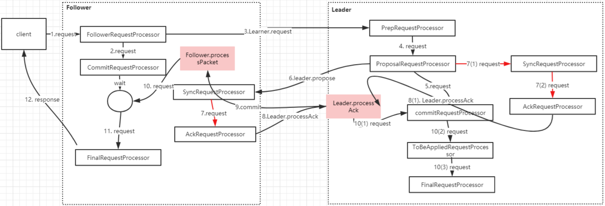

# 1 微服务通信带来的问题

有了远程通信以后，我们势必会考虑几个问题：

1. 目标服务肯定会做扩容，扩容以后，客户端会带来一些变化 
2. 客户端对于目标服务如何进行负载均衡 
3. 客户端如何维护目标服务的地址信息 
4. 服务端的服务状态变化，如何让客户端尽心感知

## 1.1 引入注册中心

服务注册中心主要用于实现服务的注册和服务的发现功能，在微服务架构中，它起到了非常大的作用。 

## 1.2 注册中心的实现

Dubbo 体系中的 Zookeeper、Spring Cloud 中的 Eureka 和 Consul

# 2 认识 Zookeeper

## 2.1 Zookeeper 的前世今生

Apache ZooKeeper 是一个高可靠的分布式协调中间件。它是 Google Chubby 的一个开源实现，那么它主要是解决什么问题的呢？那就得先了解 Google Chubby。

Google Chubby 是谷歌的一个用来`解决分布式一致性问题`的组件，同时，也是粗粒度的分布式锁服务。 

## 2.2 分布式一致性问题

什么是分布式一致性问题呢？

简单来说，就是在一个分布式系统中，有多个节点，每个节点都会提出一个请求，但是在所有节点中只能确定一个请求被通过。而这个通过是需要所有节点达成一致的结果，所以所谓的一致性就是在提出的所有请求中能够选出最终一个确定请求。 并且这个请求选出来以后，所有的节点都要知道。 

这个就是典型的拜占庭将军问题：

拜占庭帝国军队的将军们必须通过投票达成一致来决定是否对某一个国家发起进攻。但是这些将军在地理位置上是分开的，并且在将军中存在叛徒。叛徒可以通过任意行动来达到自己的目标： 

1. 欺骗某些将军采取进攻行动 
2. 促使一个不是所有将军都统一的决定，比如将军们本意是不希望进攻，但是叛徒可以促成进攻行动 
3. 迷惑将军使得他们无法做出决定

如果叛徒达到了任意一个目标，那么这次行动必然失败。只有完全达成一致那么这次进攻才可能胜利。

拜占庭问题的本质是，由于`网络通信存在不可靠`的问题，也就是可能存在消息丢失，或者网络延迟。如何在这样的背景下对某一个请求达成一致。

为了解决这个问题，很多人提出了各种协议，比如大名鼎鼎的 Paxos； 也就是说在不可信的网络环境中，按照 paxos 这个协议就能够针对某个提议达成一致。 

所以分布式一致性的本质，就是<font color=red>在分布式系统中，多个节点就某一个提议如何达成一致。</font>

这个和 Google Chubby 有什么关系呢？

在 Google 有一个 GFS(google file system)，他们有一个需求就是要从多个 gfs server 中选出 一个 master server。这个就是典型的一致性问题，5 个分布在不同节点的 server，需要确定一个 master server，而他们要达成的一致性目标是：确定某一个节点为 master，并且所有节点要同意。 而 GFS 就是使用 chubby 来解决这个问题的。 

实现原理是：所有的 server 通过 Chubby 提供的通信协议到 Chubby server 上创建同一个文件，当然，最终只有一个 server 能够获准创建这个文件，这个 server 就成为了 master，它会在这个文件中写入自己的地址，这样其它的 server 通过读取这个文件就能知道被选出的 master 的地址。

## 2.3 分布式锁服务

从另外一个层面来看，Chubby 提供了一种粗粒度的分布式锁服务，chubby 是通过创建文件 的形式来提供锁的功能，server 向 chubby 中创建文件其实就表示加锁操作，创建文件成功表示抢占到了锁。

由于 Chubby 没有开源，所以雅虎公司基于 chubby 的思想，开发了一个类似的分布式协调组件 Zookeeper，后来捐赠给了 Apache。 

所以，大家一定要了解，zookeeper 并不是作为注册中心而设计，他是作为分布式锁的一种设计。而注册中心只是他能够实现的一种功能而已。

## 2.4 Zookeeper 能做什么

**数据的发布/订阅**

配置中心：disconf

实现配置信息的集中式管理和数据的动态更新，实现配置中心有两种模式：push、pull

zookeeoer 采用的是推拉相结合的方式。客户端想服务器注册自己需要关注的节点。一旦节点数据发生变化，那么服务器端会向客户端发送 watcher 事件通知。客户端发送通知后，主动到服务器端获取更新后的数据。

1. 数据量比较小 
2. 数据内容在运行时会发生动态变更 
3. 集群中的各个机器共享配置


**负载均衡**

dubbo利用了zookeeper机制实现负载均衡

**master选举**

kafka、hadoop、hbase

7*24小时可用， 99.999%可用 master-slave 模式，使用 zookeeper 解决

zkClient.MasterSelector.java，curator LeaderSelector实现了选举功能

**分布式锁**

curator 分布式锁、ZookeeperAPI.DistributeLock.java

**分布式队列**

**命名服务**

## 2.5 Zookeeper 的特性

`顺序一致性` 从同一个客户端发起的事务请求，最终会严格按照顺序被应用到 Zookeeper 中 

`原子性` 所有的事务请求的处理结果在整个集群中的所有机器上的应用情况是一致的，也就是说，要么整个集群中的所有机器都成功应用了某一事务、要么全都不应用 

`可靠性` 一旦服务器成功应用了某一个事务数据，并且对客户端做了响应，那么这个数据在整个集群中一定是同步并且保留下来的 

`实时性` 一旦一个事务被成功应用，客户端就能够立即从服务器端读取到事务变更后的最新数据状态；（Zookeeper 仅仅保证在一定时间内，近实时）

# 3 Zookeeper 的设计

## 3.1 防止单点故障

首先，在分布式架构中，任何的节点都不能以单点的方式存在，因此我们需要解决单点的问题。常见的解决单点问题的方式就是集群。

集群需要满足那些功能？

1. 集群中要有主节点和从节点（也就是集群要有角色） 
2. 集群要能做到数据同步，当主节点出现故障时，从节点能够顶替主节点继续工作，但是继 续工作的前提是数据必须要主节点保持一直 
3. 主节点挂了以后，从节点如何接替成为主节点？ 是人工干预？还是自动选举 

**Leader 角色**

Leader 服务器是整个 zookeeper 集群的核心，主要的工作任务有两项

1. 事物请求的唯一调度和处理者，保证集群事物处理的顺序性
2.  集群内部各服务器的调度者 

**Follower 角色**

Follower 角色的主要职责是 

1. 处理客户端非事物请求、转发事物请求给 leader 服务器 
2. 参与事物请求 Proposal 的投票（需要半数以上服务器通过才能通知 leader commit 数据; Leader 发起的提案，要求 Follower 投票） 
3. 参与 Leader 选举的投票

## 3.2 数据同步

接着上面那个结论再来思考，如果要满足这样的一个高性能集群，我们最直观的想法应该是， 每个节点都能接收到请求，并且每个节点的数据都必须要保持一致。要实现各个节点的数据一致性，就势必要一个 leader 节点负责协调和数据同步操作。这个我想大家都知道，如果在这样一个集群中没有 leader 节点，每个节点都可以接收所有请求，那么这个集群的数据同步的复杂度是非常大。

所以，当客户端请求过来时，需要满足，事务型数据和非事务型数据的分开处理方式，就是 leader 节点可以处理事务和非事务型数据。而 follower 节点只能处理非事务型数据。原因是， 对于数据变更的操作，应该由一个节点来维护，使得集群数据处理的简化。同时数据需要能够通过 leader 进行分发使得数据在集群中各个节点的一致性。

leader 节点如何和其他节点保证数据一致性，并且要求是强一致的。在分布式系统中，每一个机器节点虽然都能够明确知道自己进行的事务操作过程是成功和失败，但是却无法直接获取其他分布式节点的操作结果。所以当一个事务操作涉及到跨节点的时候，就需要用到分布式事务，分布式事务的数据一致性协议有 2PC 协议和 3PC 协议。


1. 查询和维护管理命令只包括1和6，即不会和 leader 打交道，响应是即刻响应
2. create，setData，setAcl，delete，createSession，closeSession等命令需要经过上图的6个处理过程
3. client 与 follower 之间的通信采用 NIO，leader 与 Follower 之间是采用 TCP/IP 模式 

### 3.2.1 关于 2PC 提交

`Two Phase Commitment Protocol`

当一个事务操作需要跨越多个分布式节点的时候，为 了保持事务处理的 ACID 特性，就需要引入一个“协调者”（TM）来统一调度所有分布式节点的执行逻辑，这些被调度的分布式节点被称为 AP。TM 负责调度 AP 的行为，并最终决定这些 AP 是否要把事务真正进行提交；因为整个事务是分为两个阶段提交，所以叫 2PC。

阶段一：提交事务请求（投票） 

1. 事务询问

   协调者向所有的参与者发送事务内容，询问是否可以执行事务提交操作，并开始等待各参与者的响应 

2. 执行事务 

   各个参与者节点执行事务操作，并将 Undo 和 Redo 信息记录到事务日志中，尽量把提交过程中所有消耗时间的操作和准备都提前完成确保后面 100%成功提交事务 

3. 各个参与者向协调者反馈事务询问的响应

   如果各个参与者成功执行了事务操作，那么就反馈给参与者 yes 的响应，表示事务可以执行； 如果参与者没有成功执行事务，就反馈给协调者 no 的响应，表示事务不可以执行，上面这个阶段有点类似协调者组织各个参与者对一次事务操作的投票表态过程，因此 2pc 协议的第一个阶段称为“投票阶段”，即各参与者投票表名是否需要继续执行接下去的事务提交操作

阶段二：执行事务提交

在这个阶段，协调者会根据各参与者的反馈情况来决定最终是否可以进行事务提交操作，正常情况下包含两种可能:执行事务、中断事务

### 3.2.2 Observer 角色

Observer 是 zookeeper3.3 开始引入的一个全新的服务器角色，从字面来理解，该角色充当了观察者的角色。 观察 zookeeper 集群中的最新状态变化并将这些状态变化同步到 observer 服务器上。 Observer 的工作原理与 follower 角色基本一致，而它和 follower 角色唯一的不同在于 observer 不参与任何形式的投票，包括事物请求 Proposal 的投票和 leader 选举的投票。简单来说，observer 服务器只提供非事物请求服务，通常在于不影响集群事物处理能力的前提下提升集群非事物处理的能力。

## 3.3 leader 选举

当 leader 挂了，需要从其他 follower 节点中选择一个新的节点进行处理，这个时候就需要涉及到 leader 选举。

从这个过程中，我们推导处了 zookeeper 的一些设计思想。

### 3.3.1 集群组成 

通常 zookeeper 是由 2n+1 台 server 组成，每个 server 都知道彼此的存在。每个 server 都维护的内存状态镜像以及持久化存储的事务日志和快照。对于 2n+1 台 server，只要有 n+1 台（大多数）server 可用，整个系统保持可用。我们已经了解到，一个 zookeeper 集群如果要对外提供可用的服务，那么集群中必须要有过半的机器正常工作并且彼此之间能够正常通信，基于这个特性，如果向搭建一个能够允许 F 台机器 down 掉的集群，那么就要部署 2*F+1 台服务器构成的 zookeeper 集群。因此 3 台机器构成的 zookeeper 集群，能够在挂掉一台机器后依然正常工作。一个 5 台机器集群的服务，能够对 2 台机器怪调的情况下进行容灾。 如果一台由 6 台服务构成的集群，同样只能挂掉 2 台机器。因此，5 台和 6 台在容灾能力上并没有明显优势，反而增加了网络通信负担。系统启动时，集群中的 server 会选举出一台 server 为 Leader，其它的就作为 follower（这里先不考虑 observer 角色）。 

之所以要满足这样一个等式，是因为一个节点要成为集群中的 leader，需要有超过及群众过半数的节点支持，这个涉及到 leader 选举算法。同时也涉及到事务请求的提交投票。


## 3.4 数据模型

zookeeper 的视图结构和标准的文件系统非常类似，每一个节点称之为 `ZNode`，是 zookeeper 的最小单元。每个 znode 上都可以保存数据以及挂载子节点。构成一个层次化的树形结构。

**持久节点（PERSISTENT）**

创建后会一直存在 zookeeper 服务器上，直到主动删除

**持久有序节点（PERSISTENT_SEQUENTIAL）**

每个节点都会为它的一级子节点维护一个顺序

**临时节点(EPHEMERAL) **

临时节点的生命周期和客户端的会话绑定在一起，当客户端会话 失效该节点自动清理 

**临时有序节点(EPHEMERAL) **

在临时节点的基础上多了一个顺序性

**CONTAINER **

当子节点都被删除后，Container 也随即删除 

**PERSISTENT_WITH_TTL **

超过 TTL 未被修改，且没有子节点 

**PERSISTENT_SEQUENTIAL_WITH_TTL **

客户端断开连接后不会自动删除 Znode，如果该 Znode 没有子 Znode 且在给定 TTL 时间内无修改，该 Znode 将会被删除；TTL 单位是毫秒，必须大于 0 且小于或等于 EphemeralType.MAX_TTL

## 3.5 会话


1. Client 初始化连接，状态转为 CONNECTING(①) 

2. Client 与 Server 成功建立连接，状态转为 CONNECTED(②) 
3. Client 丢失了与 Server 的连接或者没有接受到 Server 的响应，状态转为 CONNECTING(③) 
4. Client 连上另外的 Server 或连接上了之前的 Server，状态 转为 CONNECTED(②) 
5. 若会话过期(是 Server 负责声明会话过期，而不是 Client )， 状态转为 CLOSED(⑤)
6. Client 也可以主动关闭会话(④)，状态转为 CLOSED

## 3.6 stat 状态信息

每个节点除了存储数据内容以外，还存储了数据节点本身的 一些状态信息。

```markdown
# stat path
	# 节点被创建时的事务ID
	cZxid = 0x4
	ctime = Sat Apr 11 16:57:57 CST 2020
	# 节点最后一次被更新的事务ID
	mZxid = 0x5
	mtime = Sat Apr 11 17:04:47 CST 2020
	# 当前节点下的子节点最后一次被修改时的事务ID(只有子节点列表变更才会变更pzxid，子节点内容变更不会影响)
	pZxid = 0x4
	# 子节点的版本号
	cversion = 0
	# 表示的是当前节点数据的版本号
	dataVersion = 1
	# 表示acl的版本号，修改节点权限
	aclVersion = 0
	# 创建临时节点的时候，会有一个sessionId 。 该值存储的就是这个sessionid
	ephemeralOwner = 0x0
	# 数据内容的长度
	dataLength = 6
	# 子节点数
	numChildren = 0
```

### 3.6.1 版本-保证分布式数据原子性

zookeeper 为数据节点引入了版本的概念，每个数据节点都有三类版本信息，对数据节点任何更新操作都会引起版本号的变化。

版本有点和我们经常使用的乐观锁类似。这里有两个概念说 一下，一个是乐观锁，一个是悲观锁。

悲观锁：是数据库中一种非常典型且非常严格的并发控制策略。假如一个事务 A 正在对数据进行处理，那么在整个处理过程中，都会将数据处于锁定状态，在这期间其他事务无法 对数据进行更新操作。 

乐观锁：乐观锁和悲观锁正好相反，它假定多个事务在处理过程中不会彼此影响，因此在事务处理过程中不需要进行加锁处理，如果多个事务对同一数据做更改，那么在更新请求提交之前，每个事务都会首先检查当前事务读取数据后，是否有其他事务对数据进行了修改。如果有修改，则回滚事务再回到 zookeeper，version 属性就是用来实现乐观锁机制的 “写入校验”。

# 4 Zookeeper 的安装部署

## 4.1 单机环境安装

```markdown
# 下载zookeeper的安装包（3.5.5后带有bin的版本才是编译后的版本）
	https://zookeeper.apache.org/releases.html#download

# 解压zookeeper
	tar -zxvf apache-zookeeper-3.6.2-bin.tar.gz

# cd 到 ZK_HOME/conf , copy一份zoo.cfg 
	cp zoo_sample.cfg zoo.cfg
	# 修改 dataDir 目录，dataDir 表示日志文件存放的路径（关于zoo.cfg的其他配置信息在后面）

# 启动|关闭|重启|查看状态
	sh zkServer.sh xxx {start|start-foreground|stop|restart|status|upgrade|print-cmd}

# 连接 zookeeper
	sh zkCli.sh -server ip:port

# create [-s] [-e] path data acl 
	-s 表示节点是否有序 -e 表示是否为临时节点 默认情况下，是持久化节点 

# get path [watch] 
	获得指定 path的信息 

# set path data [version] 
	修改节点 path对应的data version 表示乐观锁的概念，数据库里面有一个 version 字段去控制数据行的版本号 

# delete path [version] 
	删除节点
```

## 4.2 集群环境安装

在 zookeeper 集群中，各个节点总共有三种角色，分别是：leader，follower，observer。

集群模式我们采用模拟 3 台机器来搭建 zookeeper 集群。分别复制安装包到三台机器上并解压，同时 copy 一份 zoo.cfg。

```markdown
# 修改配置文件
	server.1=192.168.25.128:2888:3888
	server.2=192.168.25.129:2888:3888
	server.3=192.168.25.130:2888:3888
		server.id=host:port:port
		id的取值范围：1~255，用id来标识该机器在集群中的机器序号 
		2888表示follower节点与leader节点交换信息的端口号 
		3888表示leader选举的端口，如果leader节点挂掉了, 需要一个端口来重新选举

# 创建myid
	在每一个服务器的zookeeper配置文件zoo.cfg中配置的dataDir目录下创建一个myid的文件，文件就一行数据，数据内容是每台机器对应的server ID的数字

# 分别启动 zookeeper

# 创建Observer服务器
	peerType=observer
	server.1=192.168.25.128:2888:3888
	server.2=192.168.25.129:2888:3888
	server.3=192.168.25.130:2888:3888
	server.3=192.168.25.131:2888:3888:observer
```

## 4.3 zoo.cfg 配置文件分析

```markdown
# zookeeper中最小的时间单位长度 （ms）
	tickTime=2000
# follower节点启动后与leader节点完成数据同步的时间(10个tickTime时间)
	initLimit=10
# leader节点和follower节点进行心跳检测的最大延时时间(5个tickTime时间)
	syncLimit=5
# 表示zookeeper服务器存储快照文件的目录
	dataDir=/tmp/zookeeper
# 表示配置 zookeeper事务日志的存储路径，默认指定在dataDir目录下
	dataLogDir
# 表示客户端和服务端建立连接的端口号： 2181
	clientPort=2181
```

# 5 Zookeeper 基于 Java 访问

针对 zookeeper，比较常用的 Java 客户端有 zkclient、curator。 由于 Curator 对于 zookeeper 的抽象层次比较高，简化了 zookeeper 客户端的开发量。使得 curator 逐步被广泛应用。 

1. 封装 zookeeper client 与 zookeeper server 之间的连接处理 
2. 提供了一套 fluent 风格的操作 api 
3. 提供 zookeeper 各种应用场景（共享锁、leader 选举）的抽象封装

## 5.1 节点的增删改查 

**依赖 jar 包**

```xml
<dependency>
	<groupId>org.apache.curator</groupId>
    <artifactId>curator-framework</artifactId>
    <version>4.0.0</version>
</dependency>
```

**建立连接**

```java
CuratorFramework curatorFramework=CuratorFrameworkFactory.builder().
        connectString(CONNECTION_STR).sessionTimeoutMs(5000).
        retryPolicy(new ExponentialBackoffRetry(1000,3)).
        namespace("curator").build();
//curatorFramework.create();
//curatorFramework.setData(); //修改
//curatorFramework.delete() ;// 删除
//curatorFramework.getData(); //查询
```

Curator 内部实现的几种`重试策略`：

* `ponentialBackoffRetry` 重试指定的次数, 且每一次重试之 间停顿的时间逐渐增加. 

* `RetryNTimes` 指定最大重试次数的重试策略

* `RetryOneTime` 仅重试一次 

* `RetryUntilElapsed` 一直重试直到达到规定的时间

`namespace` 值得注意的是 session2 会话含有隔离命名空间，即客户端对 Zookeeper 上数据节点的任何操作都是相对/curator 目录进行的，这有利于实现不同的 Zookeeper 的业务之间的隔离。

## 5.2 节点权限设置

Zookeeper 作为一个分布式协调框架，内部存储了一些分布式系统运行时的状态的数据，比如 master 选举、比如分布式锁。对这些数据的操作会直接影响到分布式系统的运行状态。 因此，为了保证 zookeeper 中的数据的安全性，避免误操作而导致系统出现重大事故。Zookeeper 提供了一套 `ACL (Access Control List 访问控制列表) `权限控制机制来保证数据的安全。

```markdown
# 设置访问控制：
# 方式一
# 添加认证用户
	addauth <scheme> <auth>
	addauth digest admin:admin
# 设置ACL权限
	setAcl <path> <acl>(auth:用户名:密码明文:权限)
	setAcl /auth auth:digest:admin:admin:cdrwa
# 读取ACL权限
	getAcl <path>

# 方式二：(不提前addauth，就必须使用密文)
	setAcl /auth digest:用户名:密码密文:权限
# 注：这里的加密规则是SHA1加密，然后base64编码
```

```java
/**
* ➢ 给节点赋权
*/
List<ACL> acls = new ArrayList<>();
Id id1 = new Id("digest", DigestAuthenticationProvider.generateDigest("u1:us"));
Id id2 = new Id("digest", DigestAuthenticationProvider.generateDigest("u2:us"));
//针对ul，有 read 权限， 针对 u2 有读和删除权限
acls.add(new ACL(ZooDefs.Perms.READ,id1));
acls.add(new ACL(ZooDefs.Perms.DELETE | ZooDefs.Perms.READ,id2));
curatorFramework.create().creatingParentsIfNeeded().withMode(CreateMode.PERSISTENT).withACL(acls,false).forPath("/auth","sc".getBytes());

/**
* ➢ 访问授权的节点
*/
AuthInfo authInfo=new AuthInfo("digest","u1:us".getBytes());
List<AuthInfo> authInfos=new ArrayList<>();
authInfos.add(authInfo);
CuratorFramework curatorFramework = CuratorFrameworkFactory.builder().
        connectString(CONNECTION_STR).sessionTimeoutMs(5000).
        retryPolicy(new ExponentialBackoffRetry(1000,3)).
        authorization(authInfos).build();
curatorFramework.start();
curatorFramework.setData().forPath("/auth","up".getBytes());
// u1:us 没有修改权限
// Exception in thread "main" org.apache.zookeeper.KeeperException$NoAuthException: KeeperErrorCode = NoAuth for /auth

/**
* ➢ 修改已经存在节点的权限
*/
curatorFramework.setACL().withACL().forPath();
```

### 5.2.1 权限模式 scheme

`Ip` 通过 ip 地址粒度来进行权限控制，例如配置 [ip:192.168.0.1]，或者按照网段 ip:192.168.0.1/24 

`Digest` 最常用的控制模式，类似于 username:password；设置的时候需要 DigestAuthenticationProvider.generateDigest() SHA1 加密和 base64 编码 

`World`  最开放的控制模式，这种权限控制几乎没有任何作 用，数据的访问权限对所有用户开放。 world:anyone 

`Super` 超级用户，可以对节点做任何操作 授权对象指权限赋予的用户或一个指定的实体，不同的权限模式下，授权对象不同

### 5.2.2 授权对象 

指权限赋予的用户或一个指定的实体，不同的权限模式下，授权对象不同


```java
Id ipId1 = new Id("ip", "192.168.190.1"); 
Id ANYONE_ID_UNSAFE = new Id("world", "anyone");
```

### 5.2.3 权限

指通过权限检查后可以被允许的操作，create /delete /read/write/admin(cdrwa)

`Create` 允许对子节点 Create 操作 

`Read` 允许对本节点 GetChildren 和 GetData 操作 

`Write` 允许对本节点 SetData 操作 

`Delete` 允许对子节点 Delete 操作 

`Admin` 允许对本节点 setAcl 操作

## 5.3 节点事件监听

基于 zookeeper 上创建的节点，可以对这些节点绑定监听事件，比如可以监听节点数据变更、节点删除、子节点状态变更等事件，通过这个事件机制，可以基于 zookeeper 实现分布式锁、集群管理等功能。

| zookeeper 事件                | 事件含义                                                     |
| ----------------------------- | ------------------------------------------------------------ |
| EventType.NodeCreated         | 当 node-x 这个节点被创建时，该事件被触发                     |
| EventType.NodeChildrenChanged | 当 node-x 这个节点的直接子节点被创建、被删除、子节点数据发生变更时，该事件被触发 |
| EventType.NodeDataChanged     | 当 node-x 这个节点的数据发生变更时，该事件被触发             |
| EventType.NodeDeleted         | 当 node-x 这个节点被删除时，该事件被触发                     |
| EventType.None                | 当 zookeeper 客户端的连接状态发生变更时，即 KeeperState.Expired、KeeperState.Disconnected、 KeeperState.SyncConnected、KeeperState.AuthFailed 状态切换时，描述的事件类型为EventType.None |

watcher 的通知是一次性，一旦触发一次通知后，该watcher就失效。如果需要永久监听，则需要反复注册。 zkClient 和 curator 都做了永久监听的封装。 java api的话， zk.exists , zk.getData 创建一个watcher监听。zookeeper序列化使用的是Jute。


```xml
<dependency>
    <groupId>org.apache.curator</groupId>
    <artifactId>curator-recipes</artifactId>
    <version>4.0.0</version>
</dependency>
```

Curator 提供了三种 Watcher 来监听节点的变化：

* `PathChildCache` 监视一个路径下孩子结点的创建、删除、更新。 
* `NodeCache` 监视当前结点的创建、更新、删除，并将结点的数据缓存在本地。 
* `TreeCache` PathChildCache 和 NodeCache 的“合体”， 监视路径下的创建、更新、删除事件，并缓存路径下所有子结点的数据。

```java
// PathChildrenCache
PathChildrenCache pathChildrenCache = new PathChildrenCache(curatorFramework, "/event", true);
pathChildrenCache.start(PathChildrenCache.StartMode.POST_INITIALIZED_EVENT);
// NORMAL,BUILD_INITIAL_CACHE,POST_INITIALIZED_EVENT

pathChildrenCache.getListenable().addListener((curatorFramework1, pathChildrenCacheEvent) -> {
	switch (pathChildrenCacheEvent.getType()) {
		case CHILD_ADDED:
            System.out.println("增加子节点");
            break;
        case CHILD_REMOVED:
			System.out.println("删除子节点");
            break;
        case CHILD_UPDATED:
            System.out.println("更新子节点");
            break;
        default:break;
    }
});
// or
private static void addListenerWithChild(CuratorFramework curatorFramework) throws Exception {
    PathChildrenCache nodeCache=new PathChildrenCache(curatorFramework,"/watch",true);
    PathChildrenCacheListener nodeCacheListener= (curatorFramework1, pathChildrenCacheEvent) -> {
        System.out.println(pathChildrenCacheEvent.getType()+"->"+new String(pathChildrenCacheEvent.getData().getData()));
    };
    nodeCache.getListenable().addListener(nodeCacheListener);
    //StartMode：初始化方式
    //POST_INITIALIZED_EVENT：异步初始化。初始化后会触发事件
    //NORMAL：异步初始化
    //BUILD_INITIAL_CACHE：同步初始化
    nodeCache.start(PathChildrenCache.StartMode.POST_INITIALIZED_EVENT);
}
```

# 6 Watcher 原理分析

## 6.1 Watcher 的基本流程

Zookeeper 的 Watcher 机制，总的来说可以分为三个过程：客户端注册 Watcher、服务器处理 Watcher 和客户端回调 Watcher。

客户端注册 watcher 有3种方式，getData、exists、getChildren；以如下代码为例来分析整个触发机制的原理。

## 6.2 基于 zkclietn 客户端发起一个数据操作

```xml
<dependency>
    <groupId>com.101tec</groupId>
    <artifactId>zkclient</artifactId>
    <version>0.10</version>
</dependency>
```

```java
ZooKeeper zooKeeper = new ZooKeeper("127.0.0.1:2181", 4000, new Watcher() {
    @Override
    public void process(WatchedEvent watchedEvent) {
        System.out.println("event.type:" + watchedEvent.getType());
    }
});
// 创建节点
zooKeeper.create("/watch", "0".getBytes(), ZooDefs.Ids.OPEN_ACL_UNSAFE, CreateMode.PERSISTENT);
// 注册监听
zooKeeper.exists("/watch", true);
Thread.sleep(1000);
// 修改节点的值触发监听
zooKeeper.setData("/watch", "1".getBytes(), -1);
System.in.read();
```

## 6.3Watcher 的基本流程

**ZooKeeper API 的初始化过程**

在创建一个 ZooKeeper 客户端对象实例时，我们通过 new Watcher() 向构造方法中传入一个默认的 Watcher，这个 Watcher 将作为整个 ZooKeeper 会话期间的默认 Watcher，会一直被保存在客户端 ZKWatchManager 的 defaultWatcher 中，代码如下：

```java
public ZooKeeper(String connectString, int sessionTimeout, Watcher watcher, boolean canBeReadOnly)
    throws IOException{
  	// 在这里将 watcher 设置到 ZKWatchManager
    watchManager.defaultWatcher = watcher;
    ConnectStringParser connectStringParser = new ConnectStringParser(
            connectString);
    HostProvider hostProvider = new StaticHostProvider(
            connectStringParser.getServerAddresses());
    // 初始化了 ClientCnxn，并且调用 cnxn.start()方法
    cnxn = new ClientCnxn(connectStringParser.getChrootPath(),
            hostProvider, sessionTimeout, this, watchManager,
            getClientCnxnSocket(), canBeReadOnly);
    cnxn.start();
}
```

`ClientCnxn` 是 Zookeeper 客户端和 Zookeeper 服务器端进行通信和事件通知处理的主要类，它内部包含两个类，

1. SendThread：负责客户端和服务器端的数据通信, 也包括事件信息的传输

2. EventThread: 主要在客户端回调注册的 Watchers 进行通知处理

**ClientCnxn 初始化**

```java
public ClientCnxn(String chrootPath, HostProvider hostProvider, int sessionTimeout, ZooKeeper zooKeeper,
        ClientWatchManager watcher, ClientCnxnSocket clientCnxnSocket,
        long sessionId, byte[] sessionPasswd, boolean canBeReadOnly) {
    this.zooKeeper = zooKeeper;
    this.watcher = watcher;
    this.sessionId = sessionId;
    this.sessionPasswd = sessionPasswd;
    this.sessionTimeout = sessionTimeout;
    this.hostProvider = hostProvider;
    this.chrootPath = chrootPath;
    connectTimeout = sessionTimeout / hostProvider.size();
    readTimeout = sessionTimeout * 2 / 3;
    readOnly = canBeReadOnly;
  	// 初始化 sendThread
    sendThread = new SendThread(clientCnxnSocket);
    // 初始化 eventThread
  	eventThread = new EventThread();
}
public void start() {
    sendThread.start();
    eventThread.start();
}
```

## 6.4 服务端接收请求处理流程

服务端有一个 `NIOServerCnxn` 类，用来处理客户端发送过来的请求。
**ZookeeperServer-zks.processPacket(this, bb)**

```java
public void processPacket(ServerCnxn cnxn, ByteBuffer incomingBuffer) throws IOException {
        // We have the request, now process and setup for next
        InputStream bais = new ByteBufferInputStream(incomingBuffer);
        BinaryInputArchive bia = BinaryInputArchive.getArchive(bais);
        RequestHeader h = new RequestHeader();
  			//反序列化客户端 header 头信息
        h.deserialize(bia, "header");

        cnxn.incrOutstandingAndCheckThrottle(h);

        incomingBuffer = incomingBuffer.slice();
  			// 判断当前操作类型，如果是 auth 操作，则执行下面的代码
        if (h.getType() == OpCode.auth) {
            ...
        } 
  			// 如果不是授权操作，再判断是否为 sasl 操作
  			else if (h.getType() == OpCode.sasl) {
            processSasl(incomingBuffer, cnxn, h);
        } 
  			// 最终进入这个代码块进行处理
				// 封装请求对象
  			else {
            if (!authHelper.enforceAuthentication(cnxn, h.getXid())) {
                // Authentication enforcement is failed
                // Already sent response to user about failure and closed the session, lets return
                return;
            } else {
                Request si = new Request(cnxn, cnxn.getSessionId(), h.getXid(), h.getType(), incomingBuffer, cnxn.getAuthInfo());
                int length = incomingBuffer.limit();
                if (isLargeRequest(length)) {
                    // checkRequestSize will throw IOException if request is rejected
                    checkRequestSizeWhenMessageReceived(length);
                    si.setLargeRequestSize(length);
                }
                si.setOwner(ServerCnxn.me);
                // 提交请求
                submitRequest(si);
            }
        }
    }
```

**submitRequest**

负责在服务端提交当前请求。

```java
public void submitRequest(Request si) {
    enqueueRequest(si);
}
public void enqueueRequest(Request si) {
    if (requestThrottler == null) {
        synchronized (this) {
            try {
                while (state == State.INITIAL) {
                    wait(1000);
                }
            } catch (InterruptedException e) {
                LOG.warn("Unexpected interruption", e);
            }
            if (requestThrottler == null) {
                throw new RuntimeException("Not started");
            }
        }
    }
    requestThrottler.submitRequest(si);
}
public void submitRequest(Request request) {
    if (stopping) {
        LOG.debug("Shutdown in progress. Request cannot be processed");
        dropRequest(request);
    } else {
        request.requestThrottleQueueTime = Time.currentElapsedTime();
        submittedRequests.add(request);
    }
}
```

RequestThrottler 是一个线程，会执行 run() 方法，run() 方法中调用 submitRequestNow()：

```java
public void submitRequestNow(Request si) {
  	// processor 处理器，request 过来以后会经历一系列处理器的处理过程
    if (firstProcessor == null) {
        synchronized (this) {
            try {
                while (state == State.INITIAL) {
                    wait(1000);
                }
            } catch (InterruptedException e) {
                LOG.warn("Unexpected interruption", e);
            }
            if (firstProcessor == null || state != State.RUNNING) {
                throw new RuntimeException("Not started");
            }
        }
    }
    try {
        touch(si.cnxn);
        boolean validpacket = Request.isValid(si.type);
        if (validpacket) {
            setLocalSessionFlag(si);
          	// 调用 firstProcessor发起请求，而这个 firstProcess 是一个接口，有多个实现类，具体的调用链是怎么样的？往下看吧
            firstProcessor.processRequest(si);
            if (si.cnxn != null) {
                incInProcess();
            }
        } else {
            LOG.warn("Received packet at server of unknown type {}", si.type);
            // Update request accounting/throttling limits
            requestFinished(si);
            new UnimplementedRequestProcessor().processRequest(si);
        }
    } catch (MissingSessionException e) {
        LOG.debug("Dropping request.", e);
        // Update request accounting/throttling limits
        requestFinished(si);
    } catch (RequestProcessorException e) {
        LOG.error("Unable to process request", e);
        // Update request accounting/throttling limits
        requestFinished(si);
    }
}
```

**firstProcessor 的请求链组成**

1. firstProcessor 的初始化是在 ZookeeperServer 的 setupRequestProcessor 中完成的，代码如下

```java
protected void setupRequestProcessors() {
    RequestProcessor finalProcessor = new FinalRequestProcessor(this);
    RequestProcessor syncProcessor = new SyncRequestProcessor(this, finalProcessor);
    ((SyncRequestProcessor) syncProcessor).start();
    firstProcessor = new PrepRequestProcessor(this, syncProcessor);
  	// 需要注意的是，PrepRequestProcessor 中传递的是一个 syncProcessor
    ((PrepRequestProcessor) firstProcessor).start();
}
```

从上面我们可以看到 firstProcessor 的实例是一个 PrepRequestProcessor，而这个构造方法中又传递了一个 Processor 构成了一个调用链。

RequestProcessor syncProcessor = new SyncRequestProcessor(this, finalProcessor);

而 syncProcessor 的构造方法传递的又是一个 Processor，对应的是 FinalRequestProcessor。

所以整个调用链是 PrepRequestProcessor -> SyncRequestProcessor ->FinalRequestProcessor。

**PredRequestProcessor.processRequest(si);**

通过上面了解到调用链关系以后，我们继续再看 firstProcessor.processRequest(si)；会调用到 PrepRequestProcessor：

```java
public void processRequest(Request request) {
	submittedRequests.add(request);
}
```

唉，很奇怪，processRequest 只是把 request 添加到 submittedRequests 中，根据前面的经验，很自然的想到这里又是一个异步操作。而 subittedRequests 又是一个阻塞队列。

```java
LinkedBlockingQueue submittedRequests = new LinkedBlockingQueue();
```

而 PrepRequestProcessor 这个类又继承了线程类，因此我们直接找到当前类中的 run 方法如下：

```java
public void run() {
    try {
        while (true) {
            ServerMetrics.getMetrics().PREP_PROCESSOR_QUEUE_SIZE.add(submittedRequests.size());
          	//ok，从队列中拿到请求进行处理
            Request request = submittedRequests.take();
            ServerMetrics.getMetrics().PREP_PROCESSOR_QUEUE_TIME
                .add(Time.currentElapsedTime() - request.prepQueueStartTime);
            long traceMask = ZooTrace.CLIENT_REQUEST_TRACE_MASK;
            if (request.type == OpCode.ping) {
                traceMask = ZooTrace.CLIENT_PING_TRACE_MASK;
            }
            if (LOG.isTraceEnabled()) {
                ZooTrace.logRequest(LOG, traceMask, 'P', request, "");
            }
            if (Request.requestOfDeath == request) {
                break;
            }
            request.prepStartTime = Time.currentElapsedTime();
            //调用 pRequest 进行预处理
            pRequest(request);
        }
    } catch (Exception e) {
        handleException(this.getName(), e);
    }
    LOG.info("PrepRequestProcessor exited loop!");
}
```

**pRequest**

预处理这块的代码太长，就不好贴了。前面的 N 行代码都是根据当前的 OP 类型进行判断和做相应的处理，在这个方法中的最后一行中，我们会看到如下代码：

```java
nextProcessor.processRequest(request);
```

这个方法的代码也是一样，基于异步化的操作，把请求添加到 queuedRequets 中，那么我们继续在当前类找到 run 方法。

```java
public void run() {
    try {
        resetSnapshotStats();
        lastFlushTime = Time.currentElapsedTime();
        while (true) {
            ServerMetrics.getMetrics().SYNC_PROCESSOR_QUEUE_SIZE.add(queuedRequests.size());
            long pollTime = Math.min(zks.getMaxWriteQueuePollTime(), getRemainingDelay());
            Request si = queuedRequests.poll(pollTime, TimeUnit.MILLISECONDS);
            // 从阻塞队列中获取请求
          	if (si == null) {
                /* We timed out looking for more writes to batch, go ahead and flush immediately */
                flush();
                si = queuedRequests.take();
            }
            if (si == REQUEST_OF_DEATH) {
                break;
            }
            long startProcessTime = Time.currentElapsedTime();
            ServerMetrics.getMetrics().SYNC_PROCESSOR_QUEUE_TIME.add(startProcessTime - si.syncQueueStartTime);
            // track the number of records written to the log
          	//下面这块代码，粗略看来是触发快照操作，启动一个处理快照的线程
            if (!si.isThrottled() && zks.getZKDatabase().append(si)) {
                if (shouldSnapshot()) {
                    resetSnapshotStats();
                    // roll the log
                    zks.getZKDatabase().rollLog();
                    // take a snapshot
                    if (!snapThreadMutex.tryAcquire()) {
                        LOG.warn("Too busy to snap, skipping");
                    } else {
                        new ZooKeeperThread("Snapshot Thread") {
                            public void run() {
                                try {
                                    zks.takeSnapshot();
                                } catch (Exception e) {
                                    LOG.warn("Unexpected exception", e);
                                } finally {
                                    snapThreadMutex.release();
                                }
                            }
                        }.start();
                    }
                }
            } else if (toFlush.isEmpty()) {
                if (nextProcessor != null) {
                    nextProcessor.processRequest(si);
                    if (nextProcessor instanceof Flushable) {
                        ((Flushable) nextProcessor).flush();
                    }
                }
                continue;
            }
            toFlush.add(si);
            if (shouldFlush()) {
                flush();
            }
            ServerMetrics.getMetrics().SYNC_PROCESS_TIME.add(Time.currentElapsedTime() - startProcessTime);
        }
    } catch (Throwable t) {
        handleException(this.getName(), t);
    }
    LOG.info("SyncRequestProcessor exited!");
}
```

**FinalRequestProcessor. processRequest**

这个方法就是我们在课堂上分析到的方法了，FinalRequestProcessor.processRequest 方法并根据 Request 对象中的操作更新内存中 Session 信息或者 znode 数据。

这块代码有小 300 多行，就不全部贴出来了，我们直接定位到关键代码，根据客户端的 OP 类型找到如下的代码：

```java
case OpCode.exists: {
    lastOp = "EXIS";
    ExistsRequest existsRequest = new ExistsRequest();
  	//反序列化 (将 ByteBuffer 反序列化成为 ExitsRequest.这个就是我们在客户端发起请求的时候传递过来的 Request 对象
    ByteBufferInputStream.byteBuffer2Record(request.request, existsRequest);
    path = existsRequest.getPath();
    if (path.indexOf('\0') != -1) {
        throw new KeeperException.BadArgumentsException();
    }
  	// 终于找到一个很关键的代码，判断请求的 getWatch 是否存在，如果存在，则传递 cnxn（servercnxn）
		// 对于 exists 请求，需要监听 data 变化事件，添加 watcher
    Stat stat = zks.getZKDatabase().statNode(path, existsRequest.getWatch() ? cnxn : null);
    rsp = new ExistsResponse(stat);
    requestPathMetricsCollector.registerRequest(request.type, path);
  	//在服务端内存数据库中根据路径得到结果进行组装，设置为 ExistsResponse
    break;
}
```

## 6.5 客户端接收服务端处理完成的响应

**ClientCnxnSocketNIO.doIO**

服务端处理完成以后，会通过 NIOServerCnxn.sendResponse 发送返回的响应信息，客户端会在 ClientCnxnSocketNIO.doIO 接收服务端的返回，注意一下 SendThread.readResponse,接收服务端的信息进行读取：

```java
void doIO(List<Packet> pendingQueue, LinkedList<Packet> outgoingQueue, ClientCnxn cnxn)
  throws InterruptedException, IOException {
    SocketChannel sock = (SocketChannel) sockKey.channel();
    if (sock == null) {
        throw new IOException("Socket is null!");
    }
    if (sockKey.isReadable()) {
        int rc = sock.read(incomingBuffer);
        if (rc < 0) {
            throw new EndOfStreamException(
                    "Unable to read additional data from server sessionid 0x"
                            + Long.toHexString(sessionId)
                            + ", likely server has closed socket");
        }
        if (!incomingBuffer.hasRemaining()) {
            incomingBuffer.flip();
            if (incomingBuffer == lenBuffer) {
                recvCount++;
                readLength();
            } else if (!initialized) {
                readConnectResult();
                enableRead();
                if (findSendablePacket(outgoingQueue,
                        cnxn.sendThread.clientTunneledAuthenticationInProgress()) != null) {
                    // Since SASL authentication has completed (if client is configured to do so),
                    // outgoing packets waiting in the outgoingQueue can now be sent.
                    enableWrite();
                }
                lenBuffer.clear();
                incomingBuffer = lenBuffer;
                updateLastHeard();
                initialized = true;
            } else {
                sendThread.readResponse(incomingBuffer);
                lenBuffer.clear();
                incomingBuffer = lenBuffer;
                updateLastHeard();
            }
        }
    }
  	...
}
```

**SendThread. readResponse**

这个方法里面主要的流程如下：

首先读取 header，如果其 xid == -2，表明是一个 ping 的 response，return

如果 xid 是 -4 ，表明是一个 AuthPacket 的 response return

如果 xid 是 -1，表明是一个 notification,此时要继续读取并构造一个 enent，通过 EventThread.queueEvent 发送，return

其它情况下：

从 pendingQueue 拿出一个 Packet，校验后更新 packet 信息

```java
void readResponse(ByteBuffer incomingBuffer) throws IOException {
    ByteBufferInputStream bbis = new ByteBufferInputStream(
            incomingBuffer);
    BinaryInputArchive bbia = BinaryInputArchive.getArchive(bbis);
    ReplyHeader replyHdr = new ReplyHeader();
    // 反序列化 header
    replyHdr.deserialize(bbia, "header");
    if (replyHdr.getXid() == -2) {
        // -2 is the xid for pings
        if (LOG.isDebugEnabled()) {
            LOG.debug("Got ping response for sessionid: 0x"
                    + Long.toHexString(sessionId)
                    + " after "
                    + ((System.nanoTime() - lastPingSentNs) / 1000000)
                    + "ms");
        }
        return;
    }
    if (replyHdr.getXid() == -4) {
        // -4 is the xid for AuthPacket               
        if(replyHdr.getErr() == KeeperException.Code.AUTHFAILED.intValue()) {
            state = States.AUTH_FAILED;                    
            eventThread.queueEvent( new WatchedEvent(Watcher.Event.EventType.None, 
                    Watcher.Event.KeeperState.AuthFailed, null) );            		            		
        }
        if (LOG.isDebugEnabled()) {
            LOG.debug("Got auth sessionid:0x"
                    + Long.toHexString(sessionId));
        }
        return;
    }
    // 表示当前的消息类型为一个 notification(意味着是服务端的一个响应事件)
    if (replyHdr.getXid() == -1) {
        // -1 means notification
        if (LOG.isDebugEnabled()) {
            LOG.debug("Got notification sessionid:0x"
                + Long.toHexString(sessionId));
        }
        WatcherEvent event = new WatcherEvent();
        event.deserialize(bbia, "response");
        // convert from a server path to a client path
        if (chrootPath != null) {
            String serverPath = event.getPath();
            if(serverPath.compareTo(chrootPath)==0)
                event.setPath("/");
            else if (serverPath.length() > chrootPath.length())
                event.setPath(serverPath.substring(chrootPath.length()));
            else {
            	LOG.warn("Got server path " + event.getPath()
            			+ " which is too short for chroot path "
            			+ chrootPath);
            }
        }
        WatchedEvent we = new WatchedEvent(event);
        if (LOG.isDebugEnabled()) {
            LOG.debug("Got " + we + " for sessionid 0x"
                    + Long.toHexString(sessionId));
        }
        eventThread.queueEvent( we );
        return;
    }
    // If SASL authentication is currently in progress, construct and
    // send a response packet immediately, rather than queuing a
    // response as with other packets.
    if (clientTunneledAuthenticationInProgress()) {
        GetSASLRequest request = new GetSASLRequest();
        request.deserialize(bbia,"token");
        zooKeeperSaslClient.respondToServer(request.getToken(),
          ClientCnxn.this);
        return;
    }
    Packet packet;
    synchronized (pendingQueue) {
        if (pendingQueue.size() == 0) {
            throw new IOException("Nothing in the queue, but got "
                    + replyHdr.getXid());
        }
         //因为当前这个数据包已经收到了响应，所以将它从 pendingQueued 中移除
        packet = pendingQueue.remove();
    }
    // 校验数据包信息，校验成功后讲数据包信息进行更新（替换为服务端的信息）
    try {
        if (packet.requestHeader.getXid() != replyHdr.getXid()) {
            packet.replyHeader.setErr(
                    KeeperException.Code.CONNECTIONLOSS.intValue());
            throw new IOException("Xid out of order. Got Xid "
                    + replyHdr.getXid() + " with err " +
                    + replyHdr.getErr() +
                    " expected Xid "
                    + packet.requestHeader.getXid()
                    + " for a packet with details: "
                    + packet );
        }
        packet.replyHeader.setXid(replyHdr.getXid());
        packet.replyHeader.setErr(replyHdr.getErr());
        packet.replyHeader.setZxid(replyHdr.getZxid());
        if (replyHdr.getZxid() > 0) {
            lastZxid = replyHdr.getZxid();
        }
        if (packet.response != null && replyHdr.getErr() == 0) {
            //获得服务端的响应，反序列化以后设置到 packet.response 属性中。所以我们可以在 exists 方法的最后一行通过 packet.response 拿到改请求的返回结果
            packet.response.deserialize(bbia, "response");
        }
        if (LOG.isDebugEnabled()) {
            LOG.debug("Reading reply sessionid:0x"
                    + Long.toHexString(sessionId) + ", packet:: " + packet);
        }
    } finally {
         // 最后调用 finishPacket 方法完成处理
        finishPacket(packet);
    }
}
```

**finishPacket** **方法**

主要功能是把从 Packet 中取出对应的 Watcher 并注册到 ZKWatchManager 中去：

```java
private void finishPacket(Packet p) {
    if (p.watchRegistration != null) {
      	//将事件注册到 zkwatchemanager 中
        //watchRegistration，熟悉吗？在组装请求的时候，我们初始化了这个对象把 watchRegistration 子类里面的 Watcher 实例放到 ZKWatchManager 的 existsWatches 中存储起来。
        p.watchRegistration.register(p.replyHeader.getErr());
    }
    // cb 就是 AsnycCallback，如果为 null，表明是同步调用的接口，不需要异步回掉，因此，直接 notifyAll 即可。
    if (p.cb == null) {
        synchronized (p) {
            p.finished = true;
            p.notifyAll();
        }
    } else {
        p.finished = true;
        eventThread.queuePacket(p);
    }
}
```

**watchRegistration**

```java
public void register(int rc) {
    if (shouldAddWatch(rc)) {
        //通过子类的实现取得 ZKWatchManager 中的 existsWatches
        Map<String, Set<Watcher>> watches = getWatches(rc);
        synchronized(watches) {
            Set<Watcher> watchers = watches.get(clientPath);
            if (watchers == null) {
                watchers = new HashSet<Watcher>();
                watches.put(clientPath, watchers);
            }
            //将 Watcher 对象放到 ZKWatchManager 中的 existsWatches 里面
            watchers.add(watcher);
        }
    }
}
```

下面这段代码是客户端存储 watcher 的几个 map 集合，分别对应三种注册监听事件：

```java
private final Map<String, Set<Watcher>> dataWatches =
    new HashMap<String, Set<Watcher>>();
private final Map<String, Set<Watcher>> existWatches =
    new HashMap<String, Set<Watcher>>();
private final Map<String, Set<Watcher>> childWatches =
    new HashMap<String, Set<Watcher>>();
```

总的来说，当使用 ZooKeeper 构造方法或者使用 getData、exists 和 getChildren 三个接口来向 ZooKeeper 服务器注册 Watcher 的时候，首先将此消息传递给服务端，传递成功后，服务端会通知客户端，然后客户端将该路径和 Watcher 对应关系存储起来备用。

**EventThread.queuePacket()**

finishPacket 方法最终会调用 eventThread.queuePacket， 讲当前的数据包添加到等待事件通知的队列中。

```java
public void queuePacket(Packet packet) {
   if (wasKilled) {
      synchronized (waitingEvents) {
         if (isRunning) waitingEvents.add(packet);
         else processEvent(packet);
      }
   } else {
      waitingEvents.add(packet);
   }
}
```

## 6.6 事件触发

前面这么长的说明，只是为了清洗的说明事件的注册流程，最终的触发，还得需要通过事务型操作来完成在我们最开始的案例中，通过如下代码去完成了事件的触发。

```java
zookeeper.setData(“/wathce”, “1”.getByte(),-1) ; // 修改节点的值触发监听
```

前面的客户端和服务端对接的流程就不再重复讲解了，交互流程是一样的，唯一的差别在于事件触发了。

### 6.6.1 服务端的事件响应 DataTree.setData()

```java
public Stat setData(String path, byte[] data, int version, long zxid, long time) throws KeeperException.NoNodeException {
    Stat s = new Stat();
    DataNode n = nodes.get(path);
    if (n == null) {
        throw new KeeperException.NoNodeException();
    }
    byte[] lastdata = null;
    synchronized (n) {
        lastdata = n.data;
        nodes.preChange(path, n);
        n.data = data;
        n.stat.setMtime(time);
        n.stat.setMzxid(zxid);
        n.stat.setVersion(version);
        n.copyStat(s);
        nodes.postChange(path, n);
    }
    // now update if the path is in a quota subtree.
    String lastPrefix = getMaxPrefixWithQuota(path);
    long dataBytes = data == null ? 0 : data.length;
    if (lastPrefix != null) {
        this.updateCountBytes(lastPrefix, dataBytes - (lastdata == null ? 0 : lastdata.length), 0);
    }
    nodeDataSize.addAndGet(getNodeSize(path, data) - getNodeSize(path, lastdata));
    updateWriteStat(path, dataBytes);
  	 //触发对应节点的 NodeDataChanged 事件
    dataWatches.triggerWatch(path, EventType.NodeDataChanged);
    return s;
}
```

**WatcherManager. triggerWatch**

```java
public WatcherOrBitSet triggerWatch(String path, EventType type, WatcherOrBitSet supress) {
  	// 根据事件类型、连接状态、节点路径创建 WatchedEvent
    WatchedEvent e = new WatchedEvent(type, KeeperState.SyncConnected, path);
    Set<Watcher> watchers = new HashSet<>();
    PathParentIterator pathParentIterator = getPathParentIterator(path);
    synchronized (this) {
        for (String localPath : pathParentIterator.asIterable()) {
            Set<Watcher> thisWatchers = watchTable.get(localPath);
            if (thisWatchers == null || thisWatchers.isEmpty()) {
                continue;
            }
            Iterator<Watcher> iterator = thisWatchers.iterator();
            while (iterator.hasNext()) {
                Watcher watcher = iterator.next();
                WatcherMode watcherMode = watcherModeManager.getWatcherMode(watcher, localPath);
                if (watcherMode.isRecursive()) {
                    if (type != EventType.NodeChildrenChanged) {
                        watchers.add(watcher);
                    }
                } else if (!pathParentIterator.atParentPath()) {
                    watchers.add(watcher);
                    if (!watcherMode.isPersistent()) {
                        iterator.remove();
                      	// 遍历 watcher 集合
                        // 根据 watcher 从 watcher 表中取出路径集合
                        Set<String> paths = watch2Paths.get(watcher);
                        if (paths != null) {
                            paths.remove(localPath);
                        }
                    }
                }
            }
             // 从 watcher 表中移除 path，并返回其对应的 watcher 集合
            if (thisWatchers.isEmpty()) {
                watchTable.remove(localPath);
            }
        }
    }
    if (watchers.isEmpty()) {
        if (LOG.isTraceEnabled()) {
            ZooTrace.logTraceMessage(LOG, ZooTrace.EVENT_DELIVERY_TRACE_MASK, "No watchers for " + path);
        }
        return null;
    }
  	 
    for (Watcher w : watchers) {
        if (supress != null && supress.contains(w)) {
            continue;
        }
      	//OK，重点又来了，w.process 是做什么呢？
        w.process(e);
    }
    ...
    return new WatcherOrBitSet(watchers);
}
```

**w.process(e);**

还记得我们在服务端绑定事件的时候，watcher 绑定是是什么？是 ServerCnxn，所以 w.process(e)，其实调用的应该是 ServerCnxn 的 process 方法。而 servercnxn 又是一个抽象方法，有两个实现类，分别是：NIOServerCnxn 和 NIOServerCnxn。那接下来我们扒开 NIOServerCnxn 这个类的 process 方法看看究竟：

```java
public void process(WatchedEvent event) {
    ReplyHeader h = new ReplyHeader(ClientCnxn.NOTIFICATION_XID, -1L, 0);
    if (LOG.isTraceEnabled()) {
        ZooTrace.logTraceMessage(
            LOG,
            ZooTrace.EVENT_DELIVERY_TRACE_MASK,
            "Deliver event " + event + " to 0x" + Long.toHexString(this.sessionId) + " through " + this);
    }
    WatcherEvent e = event.getWrapper();
  	//look， 这个地方发送了一个事件，事件对象为 WatcherEvent。完美
    int responseSize = sendResponse(h, e, "notification", null, null, ZooDefs.OpCode.error);
    ServerMetrics.getMetrics().WATCH_BYTES.add(responseSize);
}
```

那接下里，客户端会收到这个 response，触发 SendThread.readResponse 方法。

### 6.6.2 客户端处理事件响应

**SendThread.readResponse**

这块代码上面已经贴过了，所以我们只挑选当前流程的代码进行讲解，按照前面我们将到过的，notifacation 通知消息的 xid 为-1，意味着~直接找到-1 的判断进行分析。

**eventThread.queueEvent**

SendThread 接收到服务端的通知事件后，会通过调用 EventThread 类的 queueEvent 方法将事件传给 EventThread 线程，queueEvent 方法根据该通知事件，从 ZKWatchManager 中取出所有相关的 Watcher，如果获取到相应的 Watcher，就会让 Watcher 移除失效。

```java
public void queueEvent(WatchedEvent event) {
    // 判断类型
    if (event.getType() == EventType.None
            && sessionState == event.getState()) {
        return;
    }
    sessionState = event.getState();
    // 封装 WatcherSetEventPair 对象，添加到 waitngEvents 队列中
    WatcherSetEventPair pair = new WatcherSetEventPair(
            watcher.materialize(event.getState(), event.getType(),
                    event.getPath()),
                    event);
    waitingEvents.add(pair);
}
```

**meterialize 方法**

通过 dataWatches 或者 existWatches 或者 childWatches 的 remove 取出对应的 watch，表明客户端 watch 也是注册一次就移除。同时需要根据 keeperState、eventType 和 path 返回应该被通知的 Watcher 集合。

```java
public Set<Watcher> materialize(Watcher.Event.KeeperState state,
                                Watcher.Event.EventType type,
                                String clientPath)
{
    Set<Watcher> result = new HashSet<Watcher>();
    switch (type) {
    case None:
        result.add(defaultWatcher);
        boolean clear = ClientCnxn.getDisableAutoResetWatch() &&
                state != Watcher.Event.KeeperState.SyncConnected;
        synchronized(dataWatches) {
            for(Set<Watcher> ws: dataWatches.values()) {
                result.addAll(ws);
            }
            if (clear) {
                dataWatches.clear();
            }
        }
        synchronized(existWatches) {
            for(Set<Watcher> ws: existWatches.values()) {
                result.addAll(ws);
            }
            if (clear) {
                existWatches.clear();
            }
        }
        synchronized(childWatches) {
            for(Set<Watcher> ws: childWatches.values()) {
                result.addAll(ws);
            }
            if (clear) {
                childWatches.clear();
            }
        }
        return result;
    case NodeDataChanged:
    case NodeCreated:
        synchronized (dataWatches) {
            addTo(dataWatches.remove(clientPath), result);
        }
        synchronized (existWatches) {
            addTo(existWatches.remove(clientPath), result);
        }
        break;
    case NodeChildrenChanged:
        synchronized (childWatches) {
            addTo(childWatches.remove(clientPath), result);
        }
        break;
    case NodeDeleted:
        synchronized (dataWatches) {
            addTo(dataWatches.remove(clientPath), result);
        }
        // XXX This shouldn't be needed, but just in case
        synchronized (existWatches) {
            Set<Watcher> list = existWatches.remove(clientPath);
            if (list != null) {
                addTo(existWatches.remove(clientPath), result);
                LOG.warn("We are triggering an exists watch for delete! Shouldn't happen!");
            }
        }
        synchronized (childWatches) {
            addTo(childWatches.remove(clientPath), result);
        }
        break;
    default:
        String msg = "Unhandled watch event type " + type
            + " with state " + state + " on path " + clientPath;
        LOG.error(msg);
        throw new RuntimeException(msg);
    }
    return result;
}
```

**waitingEvents.add**

waitingEvents 是 EventThread 这个线程中的阻塞队列，很明显，又是在我们第一步操作的时候实例化的一个线程。

从名字可以指导，waitingEvents 是一个待处理 Watcher 的队列，EventThread 的 run() 方法会不断从队列中取数据，交由 processEvent 方法处理：

```java
public void run() {
   try {
      isRunning = true;
      //死循环
      while (true) {
         // 从待处理的事件队列中取出事件
         Object event = waitingEvents.take();
         if (event == eventOfDeath) {
            wasKilled = true;
         } else {
            // 执行事件处理
            processEvent(event);
         }
         if (wasKilled)
            synchronized (waitingEvents) {
               if (waitingEvents.isEmpty()) {
                  isRunning = false;
                  break;
               }
            }
      }
   } catch (InterruptedException e) {
      LOG.error("Event thread exiting due to interruption", e);
   }
    LOG.info("EventThread shut down for session: 0x{}",
             Long.toHexString(getSessionId()));
}
```

**ProcessEvent**

由于这块的代码太长，我只把核心的代码贴出来，这里就是处理事件触发的核心代码：

```java
private void processEvent(Object event) {
   try {
       // 判断事件类型
       if (event instanceof WatcherSetEventPair) {
           // each watcher will process the event
           WatcherSetEventPair pair = (WatcherSetEventPair) event;
           //拿到符合触发机制的所有 watcher 列表，循环进行调用
           for (Watcher watcher : pair.watchers) {
               try {
                   //调用客户端的回调 process
                   watcher.process(pair.event);
               } catch (Throwable t) {
                   LOG.error("Error while calling watcher ", t);
               }
           }
       } else {}
       }
		...
}
```

## 6.7 服务端接收数据请求

服务端收到的数据包应该在哪里呢？在上节课分析过了，zookeeper 启动的时候，通过下面的代码构建了一个

```java
ServerCnxnFactory cnxnFactory = ServerCnxnFactory.createFactory();
```

NIOServerCnxnFactory，它实现了 Thread，所以在启动的时候，会在 run 方法中不断循环接收客户端的请求进行分发。

```java
public void run() {
    while (!ss.socket().isClosed()) {
        try {
            selector.select(1000);
            Set<SelectionKey> selected;
            synchronized (this) {
                selected = selector.selectedKeys();
            }
            ArrayList<SelectionKey> selectedList = new ArrayList<SelectionKey>(
                    selected);
            Collections.shuffle(selectedList);
            for (SelectionKey k : selectedList) {
                // 获取 client 的连接请求
                if ((k.readyOps() & SelectionKey.OP_ACCEPT) != 0) {
                    ...
                } else if ((k.readyOps() & (SelectionKey.OP_READ | SelectionKey.OP_WRITE)) != 0) {
                  	//处理客户端的读/写请求
                    NIOServerCnxn c = (NIOServerCnxn) k.attachment();
                    //处理 IO 操作
                    c.doIO(k);
                } else {
                    if (LOG.isDebugEnabled()) {
                        LOG.debug("Unexpected ops in select "
                                  + k.readyOps());
                    }
                }
            }
            selected.clear();
        } catch (RuntimeException e) {
            LOG.warn("Ignoring unexpected runtime exception", e);
        } catch (Exception e) {
            LOG.warn("Ignoring exception", e);
        }
    }
    closeAll();
    LOG.info("NIOServerCnxn factory exited run method");
}
```

**NIOServerCnxn.doIO**

```java
void doIO(SelectionKey k) throws InterruptedException {
    try {
        ...
        if (k.isReadable()) {
            //处理读请求，表示接收中间这部分逻辑用来处理报文以及粘包问题
            	  ...
                if (isPayload) { // not the case for 4letterword
                    // 处理报文
                    readPayload();
                }
                else {
                    return;
                }
            }
        }
        ...
    }
}
private void readPayload() throws IOException, InterruptedException {
    if (incomingBuffer.remaining() != 0) { // have we read length bytes?
        int rc = sock.read(incomingBuffer); // sock is non-blocking, so ok
        if (rc < 0) {
            throw new EndOfStreamException(
                    "Unable to read additional data from client sessionid 0x"
                    + Long.toHexString(sessionId)
                    + ", likely client has closed socket");
        }
    }
    if (incomingBuffer.remaining() == 0) {
        packetReceived();
        incomingBuffer.flip();
        if (!initialized) {
            readConnectRequest();
        } else {
            readRequest();
        }
        lenBuffer.clear();
        incomingBuffer = lenBuffer;
    }
```

**NIOServerCnxn.readRequest**

读取客户端的请求，进行具体的处理：

```java
private void readRequest() throws IOException {
    zkServer.processPacket(this, incomingBuffer);
}
```

**ZookeeperServer.processPacket**

这个方法根据数据包的类型来处理不同的数据包，对于读写请求，我们主要关注下面这块代码即可：

```java
Request si = new Request(cnxn, cnxn.getSessionId(), h.getXid(),
  h.getType(), incomingBuffer, cnxn.getAuthInfo());
si.setOwner(ServerCnxn.me);
submitRequest(si);
```

**集群模式下的处理流程**

集群模式下，涉及到 zab 协议，所以处理流程比较复杂，大家可以基于这个图来定位代码的流程。



------

