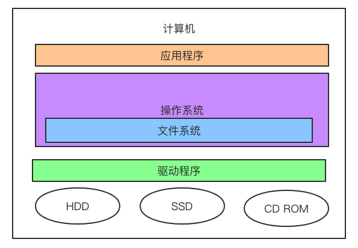
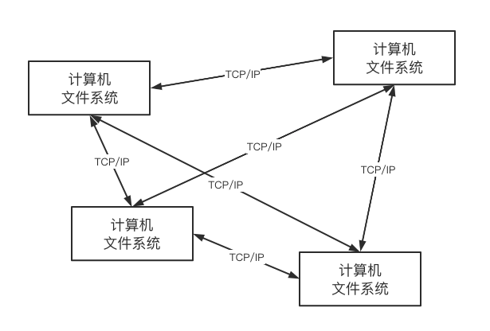
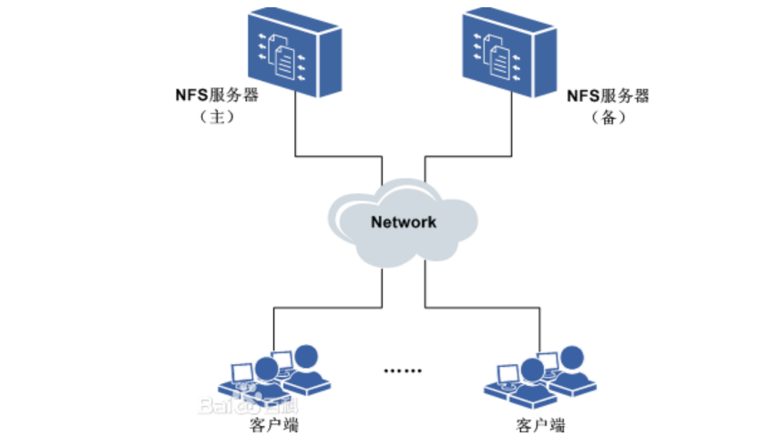
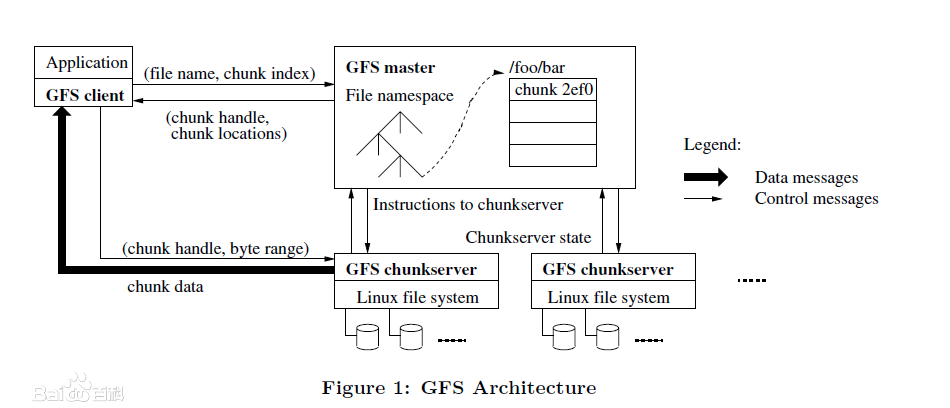
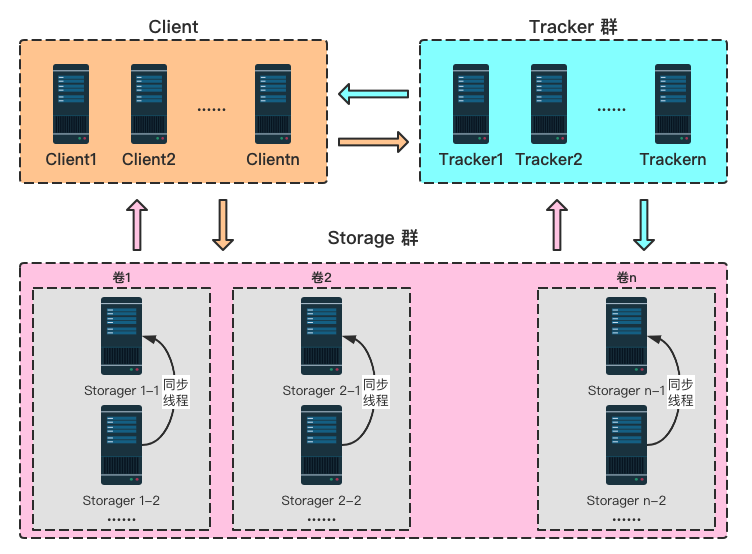
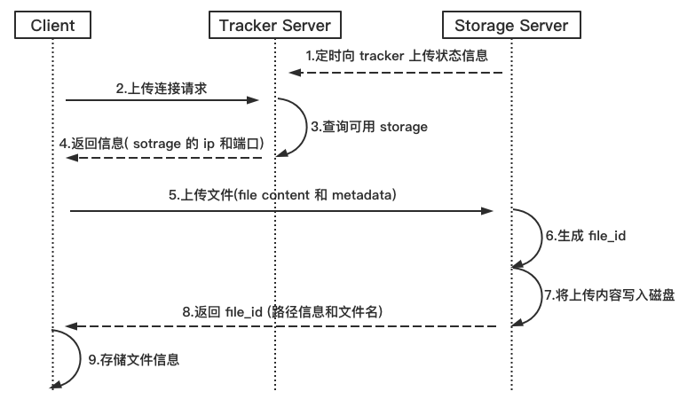
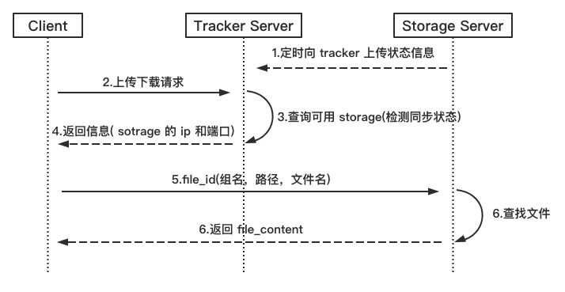
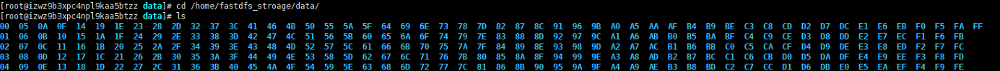
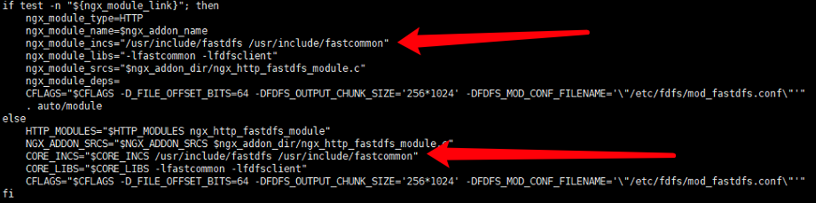

# 分布式文件系统 FastDFS

## 1 什么是分布式文件系统

### 1.1 什么是文件系统

> 文件系统是操作系统用于明确存储设备（常见的是磁盘，也有基于NAND Flash的固态硬盘）或分区上的文件的方法和数据结构；即在存储设备上组织文件的方法。操作系统中负责管理和存储文件信息的软件机构称为文件管理系统，简称文件系统。文件系统由三部分组成：文件系统的接口，对对象操纵和管理的软件集合，对象及属性。从系统角度来看，文件系统是对文件存储设备的空间进行组织和分配，负责文件存储并对存入的文件进行保护和检索的系统。具体地说，它负责为用户建立文件，存入、读出、修改、转储文件，控制文件的存取，当用户不再使用时撤销文件等。                           ------ 百度百科

``文件系统`` 是负责管理和存储文件的系统软件，它是操作系统和硬件驱动之间的桥梁，操作系统通过文件系统提供的接口去存取文件，用户通过操作系统访问磁盘上的文件。如下图： 



常见的文件系统：FAT16/FAT32、NTFS、HFS、UFS、APFS、XFS、Ext4等。

### 1.2 分布文件系统

> 分布式文件系统（Distributed File System，DFS）是指文件系统管理的物理存储资源不一定直接连接在本地节点上，而是通过计算机网络与节点（可简单的理解为一台计算机相连；或是若干不同的逻辑磁盘分区或卷标组合在一起而形成的完整的有层次的文件系统。DFS为分布在网络上任意位置的资源提供一个逻辑上的树形文件系统结构，从而使用户访问分布在网络上的共享文件更加简便。单独的 DFS共享文件夹的作用是相对于通过网络上的其他共享文件夹的访问点。 ------ 百度百科

为什么会有分布文件系统呢？ 

分布式文件系统是面对互联网的需求而产生，互联网时代对海量数据如何存储？靠简单的增加硬盘的个数已经满足不了我们的要求，因为硬盘传输速度有限但是数据在急剧增长，另外我们还要要做好数据备份、数据安全等。

采用分布式文件系统可以将多个地点的文件系统通过网络连接起来，组成一个文件系统网络，结点之间通过网络进行通信，一台文件系统的存储和传输能力有限，我们让文件在多台计算机上存储，通过多台计算共同传输。如下图：



好处： 

* 一台计算机的文件系统处理能力扩充到多台计算机同时处理。 

* 一台计算机挂了还有另外副本计算机提供数据。 

* 每台计算机可以放在不同的地域，这样用户就可以就近访问，提高访问速度。

### 1.3 主流的分布式文件系统

#### 1.3.1 NFS

> 网络文件系统，英文Network File System(NFS)，是由SUN公司研制的``UNIX表示层``协议(presentation layer protocol)，能使使用者访问网络上别处的文件就像在使用自己的计算机一样。		------ 百度百科



1. 在客户端上映射NFS服务器的驱动器。 

2. 客户端通过网络访问NFS服务器的硬盘完全透明。 

#### 1.3.2 GFS（Google 文件系统）

> GFS是一个可扩展的分布式文件系统，用于大型的、分布式的、对大量数据进行访问的应用。它运行于廉价的普通硬件上，并提供容错功能。它可以给大量的用户提供总体性能较高的服务。



1. GFS采用主从结构，一个GFS集群由一个master和大量的chunkserver组成。
2. master存储了数据文件的元数据，一个文件被分成了若干块存储在多个chunkserver中。 
3. 用户从master中获取数据元信息，从chunkserver存储数据

#### 1.3.3 HDSF

> Hadoop分布式文件系统(HDFS)是指被设计成适合运行在通用硬件(commodity hardware)上的分布式文件系统（Distributed File System）。它和现有的分布式文件系统有很多共同点。但同时，它和其他的分布式文件系统的区别也是很明显的。HDFS是一个高度容错性的系统，适合部署在廉价的机器上。HDFS能提供高吞吐量的数据访问，非常适合大规模数据集上的应用。HDFS放宽了一部分POSIX约束，来实现流式读取文件系统数据的目的。HDFS在最开始是作为Apache Nutch搜索引擎项目的基础架构而开发的。HDFS是Apache Hadoop Core项目的一部分。
>
> HDFS有着高容错性（fault-tolerant）的特点，并且设计用来部署在低廉的（low-cost）硬件上。而且它提供高吞吐量（high throughput）来访问应用程序的数据，适合那些有着超大数据集（large data set）的应用程序。HDFS放宽了（relax）POSIX的要求（requirements）这样可以实现流的形式访问（streaming access）文件系统中的数据。
>
> ​																																										------ 百度百科


1. HDFS采用主从结构，一个HDFS集群由一个名称结点和若干数据结点组成。名称结点存储数据的元信息，一个完整的数据文件分成若干块存储在数据结点。 

2. 客户端从名称结点获取数据的元信息及数据分块的信息，得到信息客户端即可从数据块来存取数据。 

### 1.4 分布式文件服务提供商

#### 1.4.1 阿里 OSS

> OSS（Operation Support Systems）系统即操作支持系统，是电信业务开展和运营时所必需的支撑平台。OSS是电信运营商的一体化、信息资源共享的支持系统，它主要由``网络管理``、``系统管理``、计费、营业、账务和客户服务等部分组成，系统间通过统一的信息总线有机整合在一起。操作与支持系统包括操作维护中心和网络管理中心。它负责全网的通信质量及运行的检验和管理，记录和收集全网运行中的各种数据的情况。它对全网内各设备之间都有连接线，并对各设备执行监视和控制的职能。		------ 百度百科

## 2 什么是 FastDFS

FastDFS 是用c语言编写的一款开源的分布式文件系统，它是由淘宝资深架构师余庆编写并开源。FastDFS专为互联网量身定制，充分考虑了冗余备份、负载均衡、线性扩容等机制，并注重高可用、高性能等指标，使用FastDFS很容易搭建一套高性能的文件服务器集群提供文件上传、下载等服务。 

为什么要使用FastDFS呢？ 

上边介绍的NFS、GFS都是通用的分布式文件系统，通用的分布式文件系统的优点的是开发体验好，但是系统复杂性高、性能一般，而专用的分布式文件系统虽然开发体验性差，但是系统复杂性低并且性能高。FastDFS非常适合 存储图片等那些小文件，FastDFS不对文件进行分块，所以它就没有分块合并的开销，FastDFS网络通信采用 socket，通信速度很快。 

### 2.1 FastDFS 工作原理

#### 2.1.1 FastDFS 架构

FastDFS架构包括 Tracker server和Storageserver。客户端请求Tracker server进行文件上传、下载，通过Tracker server调度最终由Storage server完成文件上传和下载。 



**Tracker** 

Tracker Server 作用是负载均衡和调度，通过 Tracker server 在文件上传时可以根据一些策略找到 Storage server 提供文件上传服务。可以将 tracker 称为``追踪服务器或调度服务器``。 

FastDFS 集群中的 Tracker server 可以有多台，Tracker server 之间是相互平等关系同时提供服务，Tracker server 不存在单点故障。客户端请求 Tracker server 采用轮询方式，如果请求的 tracker 无法提供服务则换另一个 tracker。 

**Storage** 

Storage Server 作用是文件存储，客户端上传的文件最终存储在 Storage 服务器上，Storage server 没有实现自己的文件系统而是使用操作系统的文件系统来管理文件。可以将 storage 称为``存储服务器``。

Storage 集群采用了分组存储方式。storage 集群由一个或多个组构成，集群存储总容量为集群中所有组的存储容量之和。一个组由一台或多台存储服务器组成，组内的 Storage server 之间是平等关系，不同组的 Storage server 之间不会相互通信，同组内的Storage server之间会相互连接进行文件同步，从而保证同组内每个 storage 上的文件完全一致的。一个组的存储容量为该组内存储服务器容量最小的那个，由此可见组内存储服务器的软硬件配置最好是一致的。 

采用分组存储方式的好处是灵活、可控性较强。比如上传文件时，可以由客户端直接指定上传到的组也可以由 tracker 进行调度选择。一个分组的存储服务器访问压力较大时，可以在该组增加存储服务器来扩充服务能力（纵向扩容）。当系统容量不足时，可以增加组来扩充存储容量（横向扩容）。 

**Storage 状态收集** 

Storage server 会连接集群中所有的 Tracker server，定时向他们报告自己的状态，包括磁盘剩余空间、文件同步状况、文件上传下载次数等统计信息。 

#### 2.1.2 文件上传流程



客户端上传文件后存储服务器将文件ID返回给客户端，此文件ID用于以后访问该文件的索引信息。文件索引信息包括：组名，虚拟磁盘路径，数据两级目录，文件名。 

```markdown
group1/M00/00/00/eE-av19I0dKAJ1g6AAKUX2LC5I8444.png
```

``组名`` 文件上传后所在的storage组名称，在文件上传成功后有storage服务器返回，需要客户端自行保存。

``虚拟磁盘路径`` storage配置的虚拟路径，与磁盘选项store_path*对应。如果配置了store_path0则是M00，如果配置了store_path1则是M01，以此类推。 

``数据两级目录`` storage服务器在每个虚拟磁盘路径下创建的两级目录，用于存储数据文件。 

``文件名`` 与文件上传时不同。是由存储服务器根据特定信息生成，文件名包含：源存储服务器IP地址、文件创建时间戳、文件大小、随机数和文件拓展名等信息。 

#### 2.1.3 文件下载流程



tracker 根据请求的文件路径即 文件ID 来快速定义文件。 

比如请求下边的文件： 

```markdown
group1/M00/00/00/eE-av19I0dKAJ1g6AAKUX2LC5I8444.png
```

1. 通过组名tracker能够很快的定位到客户端需要访问的存储服务器组是 group1，并选择合适的存储服务器提供客户端访问。 

2. 存储服务器根据 “文件存储虚拟磁盘路径” 和 “数据文件两级目录” 可以很快定位到文件所在目录，并根据文件名找到客户端需要访问的文件。 

## 3 FastDFS 入门

### 3.1 FastDFS 安装

#### 3.1.1 安装gcc（编译时需要）

FastDFS是C语言开发，安装FastDFS需要先将官网下载的源码进行编译，编译依赖gcc环境，如果没有gcc环境，需要安装gcc。

```markdown
yum install -y gcc gcc-c++
```

#### 3.1.2 安装 libevent（运行时需求）

若安装了桌面图形界面，就不需要安装 FastDFS依赖libevent库。

```markdown
yum -y install libevent
```

#### 3.1.3 安装 libfastcommon

FastDFS 安装需要保持各个组件保持版本兼容，这里使用 FastDFS6.0.0版本，对应的 libfastcommon 和 fastdfs-nginx-module 如下：

* libfastcommon-1.0.43.tar.gz，libfastcommon 包含了 FastDFS 运行所需要的一些基础库

* fastdfs-6.00.tar.gz

* fastdfs-nginx-module-1.21.tar.gz

``下载地址`` https://github.com/happyfish100 

```markdown
# 上传 libfastcommon-1.0.43.tar.gz 到Centos机器上；

# 将 libfastcommon-1.0.43.tar.gz 解压至/usr/local/下：
	tar -zxvf libfastcommon-1.0.43.tar.gz -C /usr/local/

# 切换目录到：/usr/local/libfastcommon-1.0.43/ 下，接着进行编译和安装
	cd /usr/local/libfastcommon-1.0.43/
	# 编译
	./make.sh
	# 安装
	./make.sh install

# libfastcommon安装好后会在/usr/lib64 目录下生成  libfastcommon.so 库文件
	cd /usr/lib64
	# 查询有无该库文件
	ls | grep libfastcommon.so

# 由于FastDFS程序引用usr/lib目录所以需要将/usr/lib64下的库文件拷贝至/usr/lib下
	cp libfastcommon.so /usr/lib
```

#### 3.1.4 安装 Tracker

```markdown
# 将fastdfs-6.00.tar.gz 解压至/usr/local/下
	tar -zxvf fastdfs-6.00.tar.gz -C /usr/local

# 切换目录到： /usr/local/fastdfs-6.00/ 下，编译和安装
	cd /usr/local/fastdfs-6.00/
	 # 编译之后接着进行安装
	./make.sh && ./make.sh install

# 安装成功将安装目录下的conf下的文件拷贝到/etc/fdfs/下；
	cp /usr/local/fastdfs-6.00/conf/* /etc/fdfs/
```

#### 3.1.5 配置和启动 tracker

```markdown
# 切换目录到： /etc/fdfs/ 目录下,拷贝一份新的tracker配置文件
	cd /etc/fdfs/
	cp tracker.conf tracker.conf.sample

# 修改tracker.conf
	vim tracker.conf

	base_path=/home/fastdfs
	http.server_port=22122

# 创建 /home/fastdfs 目录
	mkdir /home/fastdfs

# 启动tracker，运行如下命令
	/usr/bin/fdfs_trackerd /etc/fdfs/tracker.conf restart
```

 注意：在/home/fastdfs/ 目录下生成两个目录， 一个是数据 data，一个是日志 logs

#### 3.1.6 配置和启动 sotrage

```markdown
# 切换目录到： /etc/fdfs/ 目录下,拷贝一份新的storage配置文件
	cd /etc/fdfs/
	cp storage.conf storage.conf.sample

# 修改storage.conf
	vim storage.conf

	group_name=group1 #配置组名
	base_path=/home/fastdfs
	#store存放文件的位置(store_path)
	store_path0=/home/fastdfs_storage 
	#如果有多个挂载磁盘则定义多个store_path，如下
	#store_path1=.....
	#store_path2=......

	#配置tracker服务器:IP
	tracker_server=192.168.1.28:22122
	#如果有多个则配置多个tracker
	#tracker_server=192.168.1.29:22122
	# the storage server port
	port=23000
	#配置http端口
	http.server_port=8888

# 创建 /home/fastdfs_storage 目录
	mkdir /home/fastdfs_storage

# 启动storage， 运行命令如下
	/usr/bin/fdfs_storaged /etc/fdfs/storage.conf restart
```

启动完成后进入 /home/fastdfs_storage/data 目录下，显示目录如下：



#### 3.1.7 FastDFS 和 nginx 整合

**在 tracker 上安装 nginx**
 在每个 tracker 上安装 nginx 的主要目的是做负载均衡及实现高可用。如果只有一台 tracker 可以不配置 nginx。一个 tracker 对应多个 storage，通过 nginx 对 storage 负载均衡。

**在 storage 上安装 nginx**

```markdown
# 解压 fastdfs-nginx-module-1.21.tar.gz 到 /usr/local目录下
	tar -zxvf fastdfs-nginx-module-1.21.tar.gz -C /usr/local
	
# 切换目录到： /usr/local/fastdfs-nginx-module-1.21/src/ 目录下
	cd /usr/local/fastdfs-nginx-module-1.21/src/

# 修改config文件，将文件中的所有 /usr/local/ 路径改为 /usr/
```



```markdown
# 将fastdfs-nginx-module-1.21/src下的 mod_fastdfs.conf 拷贝至/etc/fdfs/下
	cp mod_fastdfs.conf /etc/fdfs/

# 修改 /etc/fdfs/mod_fastdfs.conf 的内容
	vi /etc/fdfs/mod_fastdfs.conf

 	base_path=/home/fastdfs
	tracker_server=192.168.1.28:22122 
	#tracker_server=192.168.1.29:22122 #(多个tracker配置多行)
	url_have_group_name=true        #url中包含group名称
	store_path0=/home/fastdfs_storage  #指定文件存储路径（上面配置的store路径）

# 将 libfdfsclient.so 拷贝至/usr/lib下
	cp /usr/lib64/libfdfsclient.so /usr/lib/

# 解压nginx-1.14.2.tar.gz
	tar -zxvf nginx-1.14.2.tar.gz -C /usr/local
	cd .usr/local/nginx-1.14.2

# 加入模块命令配置
	./configure --prefix=/usr/local/nginx --add-module=/usr/local/fastdfs-nginx-module-1.21/src

# 编译并安装 nginx
	make && make install
	# 检查安装情况
	cd /usr/local/nginc/sbin
	./nginx -V
	#输出 configure arguments: --prefix=/usr/local/nginx --add-module=/usr/local/fastdfs-nginx-module-1.21/src 表示安装完成

# 拷贝配置文件到 /etc/fdfs 下；
	cd /usr/local/fastdfs-6.00/conf/
	cp http.conf mime.types /etc/fdfs/

# 修改nginx配置文件
	cd /usr/local/nginx/conf/
	vim nginx.conf

	location /group1/M00 {
		root /home/fastdfs_stroage/data;
		ngx_fastdfs_module;
	}

# 检查并启动 nginx
	cd /usr/local/nginx/sbin
	./nginx -t
	./nginx -c /usr/local/nginx/conf/nginx.conf
```

### 3.2 文件上传测试

1. 添加依赖

```xml
<dependency>
	<groupId>net.oschina.zcx7878</groupId>
	<artifactId>fastdfs-client-java</artifactId>
	<version>1.27.0.0</version>
</dependency>
```

2. spring boot 配置文件

```yaml
server:
  port: 9020
spring:
  application:
    name: filesystem
  # SpringMVC上传文件配置
  servlet:
    multipart:
      # 默认支持文件上传.
      enabled: true
      # 支持文件写入磁盘.
      file-size-threshold: 0
      # 上传文件的临时目录
      location:
      # 最大支持文件大小
      max-file-size: 10MB
      # 最大支持请求大小
      max-request-size: 30MB

chinook:
  fastdfs:
    connect_timeout_in_seconds: 5
    network_timeout_in_seconds: 30
    charset: UTF-8
    # 多个 trackerServer 中间以逗号分隔
    tracker_servers: 192.168.1.28:22122
```

3. spring boot 实现

   ```java
   @Service
   @Slf4j
   public class FileSystemService {
   
       @Value("${chinook.fastdfs.tracker_servers}")
       String tracker_servers;
       @Value("${chinook.fastdfs.connect_timeout_in_seconds}")
       int connect_timeout_in_seconds;
       @Value("${chinook.fastdfs.network_timeout_in_seconds}")
       int network_timeout_in_seconds;
       @Value("${chinook.fastdfs.charset}")
       String charset;
   
       @Override
       public String upload(MultipartFile multipartFile) {
           Assert.isNull(multipartFile, "上传文件为空！");
   
           // 将文件上传到fastDFS中，得到一个文件id
           return fdfsUpload(multipartFile);
       }
   
       /**
        * 上传文件到fastDFS
        * @param multipartFile 文件
        * @return 文件id
        */
       public String fdfsUpload(MultipartFile multipartFile){
           // 初始化fastDFS的环境
           initFdfsConfig();
           // 创建trackerClient
           TrackerClient trackerClient = new TrackerClient();
           try {
               TrackerServer trackerServer = trackerClient.getConnection();
               // 得到storage服务器
               StorageServer storeStorage = trackerClient.getStoreStorage(trackerServer);
               // 创建storageClient来上传文件
               StorageClient1 storageClient1 = new StorageClient1(trackerServer, storeStorage);
               // 上传文件
               // 得到文件字节
               byte[] bytes = multipartFile.getBytes();
               // 得到文件的原始名称
               String originalFilename = multipartFile.getOriginalFilename();
               // 得到文件扩展名
               String ext = originalFilename.substring(originalFilename.lastIndexOf(".") + 1);
               String fileId = storageClient1.upload_file1(bytes, ext, null);
               Assert.isNull(fileId, "上传文件服务器失败！");
               log.info("==============文件上传成功：" + fileId + "==============");
   
               return fileId;
           } catch (Exception e) {
               e.printStackTrace();
               throw new ChinookException("连接FastDFS环境出错！");
           }
       }
   
       /**
        * 初始化fastDFS环境
        */
       private void initFdfsConfig(){
           try {
               // 初始化tracker服务地址（多个tracker中间以半角逗号分隔）
               ClientGlobal.initByTrackers(tracker_servers);
               ClientGlobal.setG_charset(charset);
             	// ClientGlobal 需要的单位为ms，此处取值为s
               ClientGlobal.setG_network_timeout(network_timeout_in_seconds * 1000);
               ClientGlobal.setG_connect_timeout(connect_timeout_in_seconds * 1000);
           } catch (Exception e) {
               e.printStackTrace();
               throw new ChinookException("初始化FastDFS环境出错！");
           }
       }
   }
   ```

3. 测试配置文件，在classpath:confifig下创建 **fastdfs-client.properties** 文件 

   ```properties
   fastdfs.connect_timeout_in_seconds = 5 
   fastdfs.network_timeout_in_seconds = 30 
   fastdfs.charset = UTF‐8 
   #fastdfs.http_anti_steal_token = false 
   #fastdfs.http_secret_key = FastDFS1234567890 
   #fastdfs.http_tracker_http_port = 80 
   fastdfs.tracker_servers = 192.168.1.28:22122
   ```

4. 测试方法

   ```java
   /**
    * 在此文件中通过fastDSF的client代码访问tracker和storage
    * 通过client的api代码方便 访问 tracker和storage，它们中间走的socket协议
    */
   public class TestFastDFS {
       //测试文件上传
       @Test
       public void testUpload(){
           //通过fastDSF的client代码访问tracker和storage
           try {
               //加载fastDFS客户端的配置 文件
               ClientGlobal.initByProperties("fastdfs-client.properties");
               System.out.println("network_timeout=" + ClientGlobal.g_network_timeout + "ms");
               System.out.println("charset=" + ClientGlobal.g_charset);
   
               //创建tracker的客户端
               TrackerClient tracker = new TrackerClient();
               TrackerServer trackerServer = tracker.getConnection();
               StorageServer storageServer = null;
               //定义storage的客户端
               StorageClient1 client = new StorageClient1(trackerServer, storageServer);
               //文件元信息
               NameValuePair[] metaList = new NameValuePair[1];
               metaList[0] = new NameValuePair("fileName", "1.png");
               //执行上传
               String fileId = client.upload_file1("C:\\Users\\Spring\\Desktop\\8735d389e70e9856387e482d1b01419.png", "png", metaList);
               System.out.println("upload success. file id is: " + fileId);
               //关闭trackerServer的连接
               trackerServer.close();
           } catch (Exception ex) {
               ex.printStackTrace();
           }
   
       }
   
       //查询 文件上传
       @Test
       public void testQuery(){
           try {
               //加载fastDFS客户端的配置 文件
               ClientGlobal.initByProperties("fastdfs-client.properties");
               System.out.println("network_timeout=" + ClientGlobal.g_network_timeout + "ms");
               System.out.println("charset=" + ClientGlobal.g_charset);
   
               //创建tracker的客户端
               TrackerClient tracker = new TrackerClient();
               TrackerServer trackerServer = tracker.getConnection();
               StorageServer storageServer = null;
               //定义storage的客户端
               StorageClient1 client = new StorageClient1(trackerServer, storageServer);
               FileInfo group1 = client.query_file_info("group1", "M00/00/02/wKhlQFrKX0mATW_LAALcAg10vf4198.png");
               FileInfo fileInfo = client.query_file_info1("group1/M00/00/02/wKhlQFrKX0mATW_LAALcAg10vf4198.png");
               System.out.println(group1);
               System.out.println(fileInfo);
               //查询文件元信息
               NameValuePair[] metadata1 = client.get_metadata1("group1/M00/00/02/wKhlQFrKX0mATW_LAALcAg10vf4198.png");
               System.out.println(metadata1);
               //关闭trackerServer的连接
               trackerServer.close();
           } catch (Exception ex) {
               ex.printStackTrace();
           }
       }
   
       //下载 文件上传
       @Test
       public void testDownload(){
           try {
               //加载fastDFS客户端的配置 文件
               ClientGlobal.initByProperties("fastdfs-client.properties");
               System.out.println("network_timeout=" + ClientGlobal.g_network_timeout + "ms");
               System.out.println("charset=" + ClientGlobal.g_charset);
   
               //创建tracker的客户端
               TrackerClient tracker = new TrackerClient();
               TrackerServer trackerServer = tracker.getConnection();
               StorageServer storageServer = null;
               //定义storage的客户端
               StorageClient1 client = new StorageClient1(trackerServer, storageServer);
               byte[] bytes = client.download_file1("group1/M00/00/02/wKhlQFrKX0mATW_LAALcAg10vf4198.png");
               File file = new File("d:/a.png");
               FileOutputStream fileOutputStream = new FileOutputStream(file);
               fileOutputStream.write(bytes);
               fileOutputStream.close();
               //关闭trackerServer的连接
               trackerServer.close();
           } catch (Exception ex) {
               ex.printStackTrace();
           }
       }
   }
   ```

## 4 总结 

通过学习达到以下目标： 

1. 了解分布式文件系统的概念及应用场景

分布式文件系统是通过网络将单机上的文件系统组成一个网络文件系统。 

分布式文件系统主要应用在大型互联网项目中，实现图片存储、音视频存储等服务。 

分布式文件系统的优点：可以快速扩容存储，提高文件访问速度。 

2. 理解 FastDFS 的工作原理 

FastDFS 由 tracker 和 storage 组成，它们都可以部署集群。 

tracker 负责调度，storage 负责存储。 

3. 掌握 FastDFS 存取文件方法 

客户端与 FastDFS 采用 socket 协议通信，可以采用官方提供的 java 版本的 FastDSF-client 快速开发。 

4. 能够动手搭建一个 FastDSF 文件服务器

------

