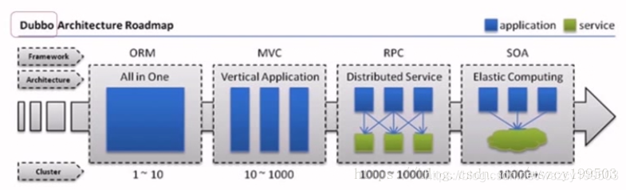
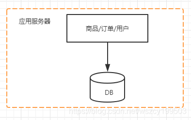
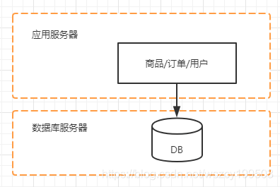
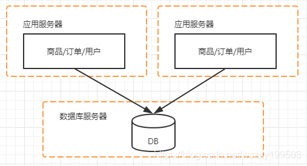
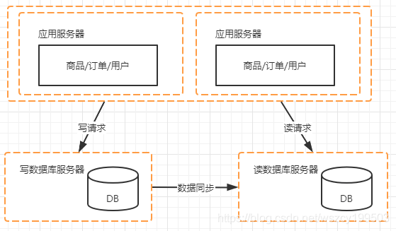
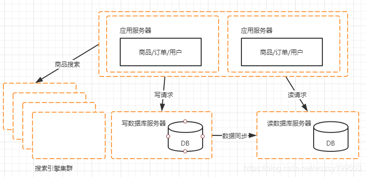
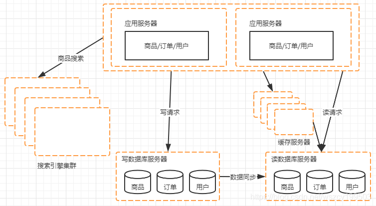
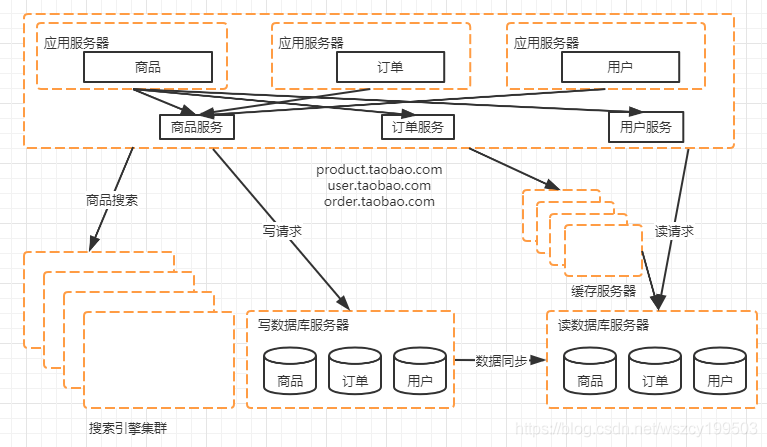

# 1 架构的本质

一个软件系统随着功能越来越多，调用量急剧增长，整个系统逐渐碎片化，越来越无序，最终无法维护和扩展，所以系统在一段时间的野蛮生长后，也需要及时干预，避免越来越无序。

架构的本质就是`对系统进行有序化重构，使系统不断进化`。

那架构是如何实现无序到有序的呢？ 基本的手段就是分和合，先把系统打散，然后重新组合。

分的过程是把系统拆分为各个子系统 / 模块 / 组件，拆的时候，首先要解决每个组件的定位问题，然后才能划分彼此的边界，实现合理的拆分。合就是根据最终要求，把各个分离的组件有机整合在一起，相对来说，第一步的拆分更难。

拆分的结果使开发人员能够做到业务聚焦、技能聚焦，实现开发敏捷，合的结果是系统变得柔性，可以因需而变，实现业务敏捷。

## 1.1 架构的分类

架构一般可分业务架构、应用架构、技术架构

1. 业务架构从概念层面帮助开发人员更好的理解系统，比如业务流程、业务模块、输入输出、业务域

2. 应用架构从逻辑层面帮助开发落地系统，如数据交互关系、应用形式、交互方式，是的整个系统逻辑上更容易理解，步入大家熟知的 SOA 就属于应用架构的范畴

3. 技术架构主要解决技术平台选型、如操作系统、中间件、设备、多机房、水平扩展、高可用等问题

需要注意的是，系统或者架构首先都是为人服务的，系统的有序度高，用用逻辑合理，业务概念清晰是第一位。现在大家讨论更多的是技术架构，如高并发设计，分布式事务处理等，只是因为这个不需要业务上下文背景，比较好相互沟通。具体架构设计时，首先要关注业务架构和应用架构，这个架构新手要特别注意。也是面试时候的痛点！

## 1.2 分布式和集群的关系

`分布式系统（distributed system）` 一个业务拆分成多个子系统，部署在不同的服务器上

`集群（cluster）` 同一个业务，部署在多个服务器上

单一应用架构 --> 垂直应用架构 --> 分布式服务架构 --> 流动计算架构

主要取决于：

- 访问量（tps、qps） 
- 数据量（存储数据量）

# 2 大型网站的架构演进

## 2.1 从一个电商网站开始

为了更好的理解，我们用电商网站来举例，作为一个交易类型的网站，一定会具备用户（用户注册、用户管理）、商品（商品展示、商品管理）、订单（下单、支付）这些功能假如我们只需要支持这几个基本功能，那么我们最开始的架构应该可能是这样的。

各个功能模块之间是通过 JVM 内部的方法调用来进行交互的，而应用和数据库之间是通过 JDBC 进行访问。

## 2.2 单机负载告警，数据库和应用分离

随着网站的开放，访问量不断增大，那么这个时候服务器的负载势必会持续升高，必须要才需一些办法来应付。这里先不考虑更换机器和各种软件层面的优化，先从架构的结构上来做一些调整。我们可以把数据库与应用从一台机器分到两台机器。

网站从一台变成了 2 台，这个变化对我们来说影响非常小。单机的情况下，我们应用采用 JDBC 的方式来和数据库进行连接，现在数据库与应用分开了，我们只需要在配置文件中把数据库的地址从本机改成数据库服务器的 ip 地址就行。

对于开发、测试、部署都没有影响调整以后我们能够缓解当前的系统压力，不过随着时间的退役，访问量继续增大的话，我们的系统还是需要做改造。

为什么这么分呢？从计算机本身的角度来考虑的话，一个请求的访问到处理最终到返回，性能瓶颈只会是：CPU、文件 IO、网络 IO、内存等因素。而一台计算机中这些纬度是有性能瓶颈的，如果某个资源消耗过多，通常会造成系统的响应速度较慢，所以增加一台机器，使得数据库的 IO 和 CPU 资源独占一台机器从而增加性能。

这个地方插入一点题外话，就是简单说一下各个资源的消耗原因。 

CPU/IO/内存：

1. 主要是上下文的切换，因为每个 CPU 核心在同一时刻只能执行一个线程，而 CPU 的调度有几种方式，比如抢占式和轮询等，以抢占式为例，每个线程会分配一定的执行时间，当达到执行时间、线程中有 IO 阻塞或者有高优先级的线程要执行时。CPU 会切换执行其他线程。而在切换的过程中，需要存储当前线程的执行状态并恢复要执行的线程状态，这个过程就是上下文切换。比如 IO、锁等待等场景下也会触发上下文切换，当上下文切换过多时会造成内核占用比较多的 CPU。

2. 文件 IO，比如频繁的日志写入，磁盘本身的处理速度较慢、都会造成 IO 性能问题

3. 网络 IO，带宽不够

4. 内存，包括内存溢出、内存泄漏、内存不足

实际上不管是应用层的调优也好，还是硬件的升级也好。其实无非就是这几个因素的调整。

## 2.3 应用服务器复杂告警，如何让应用服务器走向集群

假如说这个时候应用服务器的压力变大了，根据对应用的检测结果，可以针对性的对性能压力大的地方进行优化。我们这里考虑通过水平扩容来进行优化，把单机变为集群。

应用服务器从一台变为两台，这两个应用服务器之间没有直接的交互，他们都依赖数据库对外提供服务，那么这个时候会抛出两个问题

1. 最终用户对应两个应用服务器访问的选择对于这个问题，可以采用 DNS 解决，也可以通过负载均衡设备来解决

2. session 的问题

### 2.3.1 水平和垂直扩容

对于大型的分布式架构而言，我们一直在追求一种简单、优雅的方式来应对访问量和数据量的增长。而这种方式通常指的是不需要改动软件程序，仅仅通过硬件升级或者增加机器就可以解决。而这种就是分布式架构下的伸缩设计伸缩分为垂直伸缩和水平伸缩两种

`垂直伸缩` 表示通过升级或者增加单台机器的硬件来支撑访问量以及数据量增长的方式，垂直伸缩的好处在于技术难度比较低，运营和改动成本也相对较低。但是缺点是机器性能是有瓶颈的，同时升级高性能的小型机或者大型机，成本是非常大的。这也是阿里去 IOE 的一个原因之一

增加 CPU 核心数：增加 CPU 后系统的服务能力能够得到大的增长，比如响应速度、同时可以处理的线程数。但是引入 CPU 后也会带来一些显著的问题

1. 锁竞争加剧；多个线程同时运行访问某个共享数据，那么就涉及到锁竞争，锁竞争激烈时会导致很多线程都在等待锁，所以即时增加 CPU 也无法让线程得到更快的处理。当然这里是有调优手段的，可以通过调优手段来降低锁竞争

2. 支撑并发请求的线程数是固定的，那么即时增加 CPU，系统的服务能力也不会得到提升

3. 对于单线程任务，多核心 CPU 是没有太大的作用的

增加内存：增加内存可以直接提成系统的响应速度，当然，也有可能达不到效果，就是如果 JVM 堆内存是固定的。

`水平伸缩` 通过增加机器来支撑访问量及数据量增长的方式，成为水平伸缩，水平伸缩理论上来说没有瓶颈，但是缺点是技术要求比较高，同时给运维带来了更大的挑战垂直伸缩和水平伸缩都有各自的有点，我们在实际使用过程中都会对两者做结合，一方面要考虑硬件升级的成本，一方面要考虑软件改造的成本。

### 2.3.2 负载均衡算法

**轮询（Round Robin）法**

将请求按顺序轮流分配到后台服务器上，均衡的对待每一台服务器，而不关心服务器实际的连接数和当前的系统负载

缺点：当集群中服务器硬件配置不同、性能差别大时，无法区别对待

**随机法**

通过系统随机函数，根据后台服务器列表的大小值来随机选取其中一台进行访问。随着调用量的增大，其实际效果越来越接近于平均分配流量到后台的每一台服务器，也就是轮询法的效果

优点：简单使用，不需要额外的配置和算法。

缺点：随机数的特点是在数据量大到一定量时才能保证均衡，所以如果请求量有限的话，可能会达不到均衡负载的要求。

**源地址哈希法**

根据服务消费者请求客户端的 IP 地址，通过哈希函数计算得到一个哈希值，将这个哈希值和服务器列表的大小进行取模运算，得到的结果便是要访问的服务器地址的序号。采用源地址哈希法进行负载均衡，相同的 IP 客户端，如果服务器列表不变，将映射到同一个后台服务器进行访问。

**加权轮询（Weight Round Robin）法**

不同的后台服务器可能机器的配置和当前系统的负载并不相同，因此它们的抗压能力也不一样。跟配置高、负载低的机器分配更高的权重，使其能处理更多的请求，而配置低、负载高的机器，则给其分配较低的权重，降低其系统负载，加权轮询很好的处理了这一问题，并将请求按照顺序且根据权重分配给后端

**最小连接数法**

前面几种方式都是通过对请求次数的合理分配最大可能提高服务器的利用率，但是实际上，请求次数的均衡并不能代表负载的均衡。所以，引入了最小连接数法。它正是根据后端服务器当前的连接情况，动态的选取其中当前积压连接数最少的一台服务器来处理当前请求，尽可能的提高后台服务器利用率，将负载合理的分流到每一台服务器。

### 2.3.3 分布式环境下的 session 问题

Session 共享在当前这个互联网背景下，已经不是一个新鲜的话题了，而且如何解决 session共享其实也有很多非常成熟的方案服务器实现的 session 复制或 session 共享，这类型的共享 session 是和服务器紧密相关的我们在 Web 服务器之间增加了会话数据的同步，通过同步就保证了不同 Web 服务器之间Session 数据的一致。

**Session 复制**

一般应用容器都支持 `Session 复制(Session Replication)`方式

存在问题：

1. 同步 Session 数据造成了网络带宽的开销。只要 Session 数据有变化，就需要将数据同步到所有其他机器上，机器越多，同步带来的网络带宽开销就越大。

2. 每台 Web 服务器都要保存所有 Session 数据，如果整个集群的 Session 数据很多（很多人同时访问网站）的话，每台机器用于保存 Session 数据的内容占用会很严重。

这个方案是靠应用容器来完成 Session 的复制从而解决 Session 的问题的，应用本身并不关心这个事情。这个方案不适合集群机器数多的场景。

**Session 统一存储**

利用成熟的技术做 `session 统一存储`，比如 12306 使用的 gemfire，比如常见的内存数据库如 Redis

Session 数据不保存到本机而且存放到一个集中存储的地方，修改 Session 也是发生在集中存储的地方。Web 服务器使用 Session 从集中存储的地方读取。这样保证了不同 Web 服务器读取到的 Session 数据都是一样的。存储 Session 的具体方式可以是数据库

存在问题：

1. 读写 Session 数据引入了网络操作，这相对于本机的数据读取来说，问题就在于存在时延和不稳定性，不过我们的通讯基本都是发生在内网，问题不大。

2. 如果集中存储 Session 的机器或者集群有问题，就会影响到我们的应用。

相对于 Session Replication，当 Web 服务器数量比较大、Session 数比较多的时候，这个集中存储方案的优势是非常明显的。

**将 session 维护在客户端**

很容易想到就是利用 cookie，但是客户端存在风险，数据不安全，而且可以存放的数据量比较小，所以将 session 维护在客户端还要对 session 中的信息加密。

我们的 Session 数据放到 Cookie 中，然后在 Web 服务器上从 Cookie 中生成对应的 Session数据。这就好比我们每次都把自己的碗筷带在身上，这样去那家饭店就可以随意选择了。相对前面的集中存储方案，不会依赖外部的存储系统，也就不存在从外部系统获取、写入 Session数据的网络时延、不稳定性了。

存在问题：

安全性。Session 数据本来都是服务端数据，而这个方案是让这些服务端数据到了外部网络及客户端，因此存在安全性上的问题。我们可以对写入的 Cookie 的 Session 数据做加密，不过对于安全来说，物理上不能接触才是安全的。

## 2.4 数据库压力变大，读写分离

随着业务的继续增长，数据量和访问量持续增加。对于大型网站来说，有不少业务是读多写少，这个情况也会直接反馈到数据库上。那么对于这种情况来说，我们可以考虑采用读写分离的方式来优化数据库的压力 

这个结构的变化会带来两个问题

1. 数据如何同步

   我们希望通过读库来分担主库上读的压力，那么首先需要解决的是怎么复制到读库的问题。数据库系统一般都提供了数据复制的功能，我们可以直接使用数据库系统自身的机制。不同的数据库系统有不同的支持，比如 Mysql 支持 Master+slave 的结构提供数据复制机制

2. 应用对数据源如何路由

   对于应用来说，增加一个读库对结构变化产生了一定的影响，也就是我们的应用需要根据不同的情况来选择不同的数据库源

   mycat，sharding-jdbc

## 2.5 搜索引擎其实是一个读库

搜索引擎其实可以理解成一个读库，我们的商品存储在数据库中，而网站需要提供用户实时检索的功能，尤其是在商品搜索这块。对于这样的读请求，如果全部走读库，其实性能也会存在一个瓶颈。而使用搜索引擎，不仅仅能大大提高检索速度。还能减轻读数据库的压力而搜索引擎最重要的工作，就是需要根据被搜索的数据来构建索引，而随着被搜索的数据的变化，索引也需要相应变化。

搜索集群的使用方式和读库的使用方式是一样的，只是构建索引的过程基本都是需要我们自己来实现。可

以从两个纬度对搜索引擎构建索引的方式进行规划，一个是按照全量/增量划分。一种是按照实时/非实时划分。

全量方式用于第一次建立索引，可能是新建，也可能是重建。而增量的方式是在全量的基础上持续更新索引。

实时和非实时提现在索引更新的时间上，实时是最好的，非实时主要考虑到对数据源头的保护。

总的来说，搜索引擎技术解决了站内搜索时某些场景下的读的问题，提供了更好的查询效率。

## 2.6 加速数据读取的利器-缓存及分布式存储

在大型网站中，基本上就是在解决存储和计算的问题，所以存储是一个很重要的支撑系统。网站建设初期我们都是从关系型数据库开始的，而且很多时候为了方便，我们会把一些业务逻辑放在数据库里面去做，比如触发器、存储过程。虽然在前期能够很方便的解决问题，但是在未来的发展过程中会带来很多的麻烦，比如数据量大了以后，要做分库分表操作等. 同时，业务发展到一定的体量以后，对存储的需求不能完全通过关系型数据库来满足

**分布式文件系统**

对一些图片、大文本，使用数据库就不合适了，所以我们会采用分布式文件系统来实现文件存储，分布式文件系统有很多产品、比如淘宝的 TFS、google 的 GFS。还有开源的 HDFS

**NoSQL**

NoSQL 我们可以理解成 Not Only SQL、或者是 No SQL。 两种意思都是为了表达在大型网站中，关系型数据库可以解决大部分问题，但是对于不同内容的特征、访问特征、事务特征等对存储的要求是不一样的。NoSQL 是定位于是文件系统和 SQL 关系型数据库之间的范畴。

**数据缓存**

大型网站内部都会用到一些数据缓存，主要用于分担数据库的读的压力，缓存系统一般是用来保存和查询键值对的。应用系统中一般会把热点数据放入到缓存，而缓存的填充也应该是由应用系统完成。如果数据不存在，则从数据库独处数据后放入缓存。随着时间的推移，当缓存容量不够需要清除数据时，最近不被访问的数据就会被清理掉。还有一种方式就是在数据库的数据发生变化后，主动把数据放入到缓存系统中，这样的好处是数据变化时能够及时更新缓存的数据，不会造成读取失效。

**页面缓存**

除了数据缓存外，我们还可以对页面做缓存，数据缓存可以加速应用在响应请求时的数据读取数度，但是最终展示给用户的还是页面，有些动态产生的页面或者访问量特别高的页面，我们会对页面或者内容做一些缓存。

## 2.7 弥补关系型数据库的不足，引入分布式存储

我们应用最多的主要还是关系型数据库，但是在有些场景中，关系型数据库不是很合适。所以我们会引入分布式存储系统，比如 redis、mongoDB、cassandra、HBase 等。

根据不同的场景和数据结构类型，选择合适的分布式存储系统可以极大提高性能。分布式系统通过集群提供一个高容量、高并发访问、数据冗余融债的支持。

## 2.8 读写分离后，数据库又遇到瓶颈

通过读写分离以及在某些场景用分布式存储系统替换关系型数据库的方式，能够降低主库的压力，解决数据存储方面的问题，不过随着业务的发展，我们的主库也会遇到瓶颈。推演到现在，我们的网站各个模块：交易、商品、用户数据都还是存储在一个数据库。尽管增加了缓存、读写分离的方式，但是数据库的压力仍然在持续增加，因此我们可以对数据垂直拆分和水平拆分来解决数据库压力问题

专库专用，数据垂直拆分

垂直拆分的意思是把数据库中不同的业务数据拆分到不同的数据库中，那么根据我们推演的例子，把用户、交易、商品的数据分开

不同业务的数据从原来的一个数据库拆分到了多个数据库中，那么就需要考虑到如何处理原来单机

跨业务的事务

1. 使用分布式事务解决

2. 去掉事务或者不追求强事务的支持

对数据进行垂直拆分后，解决了把所有业务数据放在一个数据库中的压力问题，并且也可以根据不同业务的特点进行更多的优化

**垂直拆分后，遇到瓶颈，数据水平拆分**

与垂直拆分对应的还有数据水平拆分，数据水平拆分就是把同一个表的数据拆分到两个数据库中，产生数据水平拆分的原因是某个业务的数据表的数据量或者更新量达到了单个数据库的瓶颈，这个时候就可以把表拆到两个或者多个数据库中。

数据水平拆分与读写分离的区别是，读写分离解决的是读压力大的问题，对于数据量大或者更新量大的情况并不起作用。

数据水平拆分与数据垂直拆分的区别是，垂直拆分是把不同的表拆分到不同的数据库，而水平拆分是把同一个表拆分到不同的数据库中。

我们可以进一步把用户表拆分到两个数据库中，它们拥有结构一模一样的用户表，而且每个库中的用户表都只涵盖了一部分的用户，两个数据库的用户和在一起就相当于没有拆分之前的用户表

水平拆分带来的影响

1. sql 路由问题，需要根据一个条件来决定当前请求发到那个数据库中

2. 主键的处理，不能采用自增 id，需要全局 id

3. 由于同一个业务的数据被拆分到不同的数据库，因此涉及到一些查询需要跨两个数据库获取，如果数据量太大并且需要分页，就比较难处理了

## 2.9 数据库问题解决后，应用面对的挑战

前面讲的读写分离、分布式存储、数据垂直拆分和水平拆分都是解决数据方面的问题，接下来我们要看看应用方面的变化

随着业务的发展，应用的功能会越来越多，应用也会越来越大，我们需要思考如何不让应用持续变大，这就需要把应用拆开，从一个应用变为两个甚至是多个。

第一种方式

根据业务的特性把应用拆分，在我们的例子中，主要业务功能分三个部分、用户、商品、交易。我们可以把原来的一个应用拆成分别以交易和商品为主的两个应用，对于交易和商品都会有设计使用用户的地方，我们让这两个系统自己完成涉及用户的工作，而类似用户注册、登录等基础的用户工作，可以暂时交给两个系统之一来完成。

我们还可以按照用户注册、用户登录、用户信息维护等再拆分，变成三个系统，不过这样拆分后在不同系统中会有一些相似的代码，比如用户相关的代码，如何能够保障这部分代码的一致以及如何对其他模块提供复用也是需要解决的问题。而且，这样拆分出来的新系统之间没有直接的相互调用

## 2.10 服务化的道路

我们在来看一下服务化的做法，我们把应用分为三层，处于最上端的是 web 系统，用于完成不同的业务功能，处于中间的是一些服务中心，不同的服务中心提供不同的业务服务；处于最下层的则是业务的数据库

与之前相比有几个重要的变化，首先业务功能之间的访问不仅仅是单机内部的方法调用，还引入了远程的服务调用。其次，共享代码不再是散落在不同的应用中，这些实现被放在各个服务中心。最后，数据库的连接也发生了一些变化，我们把数据库的交互工作放到了服务中心，让前端的 web 应用更加注重与浏览器的交互工作，而不必过多关注业务逻辑的事情。链接数据库的任务交给响应的业务服务中心了，这样可以降低数据库的连接数。

而服务中心不仅把一些可以共用的代码集中管理，而且还使得这些代码变得更好维护。

服务化的方式会带来很多好处，首先，从结构上来看，系统架构更加清晰了，比原本的架构更加立体。从稳定性上来看，一些散落在多个应用系统中的代码变成了服务并且由专门的团队进行统一维护，一方面可以提高代码的质量，另一方面由于基础核心模块相对稳定，修改和发布的频次相对于业务系统来说会少很多，这也会提高整个架构的稳定性。最后，更加底层的资源由服务层统一管理，结构更加清晰，对于团队开发效率来说有比较大的提高

服务化的方式，对于研发也会有很大的影响，以前的开发模式是几个大团队负责几个大应用，随着服务化的落地，我们的应用数量会飞速增长，系统内部的依赖关系也会变的错综复杂，同时团队也进行了拆分，每个小团队专注于某个具体的服务或者应用上，迭代效率也会更高

# 3 什么是分布式架构

## 3.1 分布式架构的定义

很多同学无法理解分布式系统，简单来说，分布式系统是指位于网络计算机上的组件仅通过传递消息来通信和协调目标系统。这里面有两个重要因素

1. 组件是分布在网络计算机上

2. 组件之间仅仅通过消息传递来通信并协调行动

分布式系统其实也可以认为是一种去中心化的实现思路，对于用户来说是无感知的

## 3.2 分布式架构的意义

从单机单用户到单机多用户，再到现在的网络时代，应用系统发生了很多的变化，为什么要用分布式系统呢？

1. 升级单机处理处理你能力的性价比越来越低

2. 单机处理能力存在瓶颈

3. 对于稳定性和可用性的要求

我们知道，单台机器的处理能力能力包括 CPU、内存、磁盘和网络。

大家听过摩尔定律吧， 当价格不变时，每隔 18 个月，集成电路上课容纳的晶体管数量会增加一倍，性能也会增加一倍。意味着随着时间的退役，单位成本的支出所能购买的计算能力在提升，但是我们要求处理器的性能越高，所需要付出的成本也就越高。所以通过不断提升单台机器的性能锁带来的产值是不划算的，同时，处理器本身也存在性能瓶颈。

还有一个很重要的因素，稳定性和可用性方面，在单机环境中是提供不了的。所以势必需要分布式系统来解决

------

