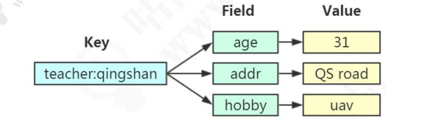
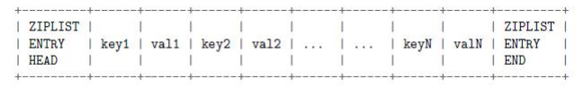
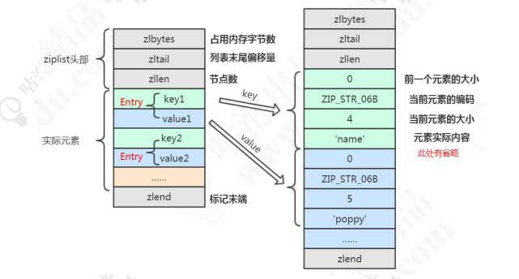
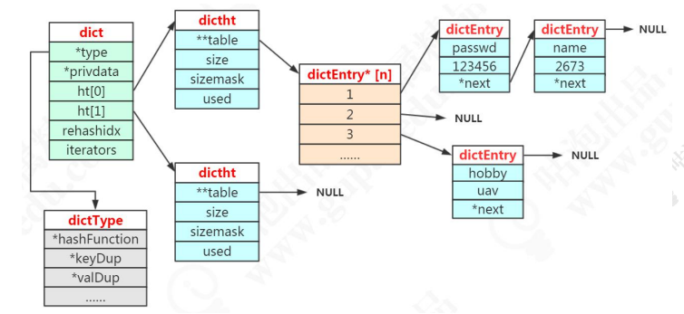
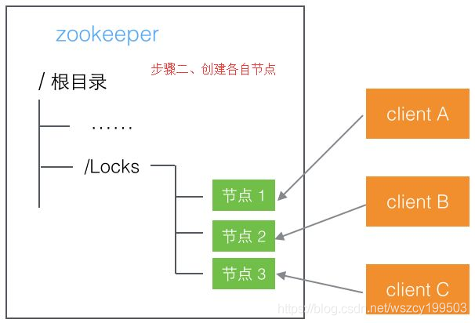
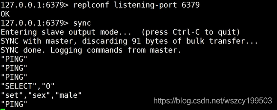
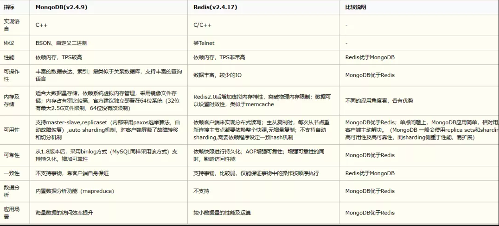

# 1 redis 基础

## 1.1 Redis 定位与特性

### 1.1.1 SQL 与 NoSQL

绝大多数情况下，我们首先考虑使用关系型数据库存储我们的数据。比如Mysql，Oracle，SQLServer等。

#### 关系型数据库

关系型数据库的特点：

1. 以表格形式基于行存储数据，是一个二维模式
2. 存储的是结构化数据，数据存储有固定的模式（schema），数据需要适应表结构
3. 表与表之间存在关联
4. 大部分关系型数据库都支持结构化查询语言SQL的操作，支持复杂的关联查询
5. 通过支持事务（ACID酸）来提供严格的或者实时的数据一致性

使用关系型数据库也存在一定的限制：

1. 需要扩容只能通过向上（垂直）扩展，比如磁盘限制了数据的存储，就要扩大磁盘的容量，通过对硬件的方式，不支持动态扩容。水平扩容需要通过负责的方式来实现（分库分表）
2. 表结构修改困难，因此存储的数据格式也受到限制
3. 在高并发和高数据量的情况下，关系型数据库通常会把数据持久化到磁盘，基于磁盘的读写压力比较大

#### 非关系型数据库

为了规避关系型数据库的一系列问题，我们就有了非关系型的数据库。

`NoSQL（non-relational 或者 Not Only SQL）` 指的是非关系型的数据库，是对不同于传统的关系 型数据库的数据库管理系统的统称。NoSQL 用于超大规模数据的存储。（例如谷歌或 Facebook 每天为他们的用户收集万亿比特的数据）。这些类型的数据存储不需要固定的模式，无需多余操作就可以横向扩展。 

非关系型数据库的特点：

1. 存储非结构化的数据，比如文本、图片、视频、音频等
2. 表与表之间没有关联，可扩展性强
3. 保证数据的最终一致性。遵循 BASE（碱）理论。 
4. 支持海量数据存储和高并发的高效读写
5. 支持分布式，能够对数据进行分片存储，扩缩容简单

#### CAP原理

CAP理论的核心是<font color="red">一个分布式系统不可能同时很好的满足一致性、可用性和分区容错性这三个需求，最多只能同时较好的满足两个。</font>

因此，根据 CAP 原理将 NoSQL 数据库分成了满足CA原则、满足CP原则和满足AP原则三大类：

`CA` 单点集群，满足一致性、可用性的系统，通常在可扩展性上不太强大

`CP` 满足一致性、分区容错性的系统，通常性能不是特别高

`AP` 满足可用性、分区容错性的系统，通常可能对一致性要求低一些

在计算机科学中，`CAP定理(CAP theorem)` 又被称作`布鲁尔定理( Brewer's theorem)`，它指出对于一个分布式计算系统来说，不可能同时满足以下三点：

`一致性(Consistency)` 所有节点在同一时间具有相同的数据，一致性分为三种：

* 强一致性：要么一起成功，要么一起失败
* 弱一致性：最终一致性
* 顺序一致性

`可用性(Avaibility)` 保证每个请求不管成功或者失败都有响应

`分区容错性(Partition tolerance)` 系统中任意信息的丢失或失败不影响系统的继续运行

#### BASE理论

BASS理论是对CAP定理的延伸，核心思想是即使无法做到强一致性(CAP定理中的一致性就是强一致性)，但应用可以采用适合的方式达到最终一致性。BASE是NoSQL数据库通常对可用性及一致性的弱要求原则：

``基本可用(Basicall Available)`` 基本可用是指分布式系统在出现故障的时候，允许损失部分可用性，既保证核心模块可用即可。电商大促时，为了应对访问量激增，部分用户可能会被引导到降级页面，服务层也可能只提供将及服务。这就损失部分可用性的体现。

``软状态(Soft state)`` 软状态是指允许系统有中间状态，而该中间状态不会影响系统整体可用性。分布式存储中一般一份数据至少会有三个副本，允许不同节点间副本同步的延时就是软状态的表现。MySQL Replication的异步复制也是一种体现。

``最终一致性(Eventual Consistency)`` 最终一致性是指系统中的所有数据副本经过一定时间后，最终能达到一致的状态 。弱一致性和强一致性相反,最终一致性是弱一致性的一种特殊状态。

#### NoSQL 数据库分类

| <span style="white-space:nowrap;">硬件&emsp;&emsp;&emsp;&emsp;&emsp;</span> | <span style="white-space:nowrap;">典型代表&emsp;&emsp;&emsp;&emsp;&emsp;&emsp;&emsp;</span> | 特点                                                         |
| ------------------------------------------------------------ | ------------------------------------------------------------ | ------------------------------------------------------------ |
| 列存储                                                       | Hbase <br/>Cassandra<br/>Hypertable                          | 顾名思义，是按照列存储数据的。 最大的特点是方便存储结构化和半结构化的数据，方便做数据压缩，对针对某一列或者某几列的查询有非常大的 IO 优势 |
| 文档存储                                                     | MongoDB <br/>CounchDB                                        | 文档存储一般用类似 json 的格式存储，存储的内容是文档型的。这样也就有机会对某些字段建立索引，实现关系数据库的某些功能 |
| Key-value 存储                                               | Tokyo Cabinet/Tyrant<br/>Berkelery DB<br />Memcache<br />Redis | 可以通过key快速查询到其 value 。 一 般来 说 ， 存储不管 value 的格式，照单全收。(Redis 包含了其他功能) |
| 图存储                                                       | Neo4J<br />FlockDB                                           | 图形关系的最佳存储。使用传统关系数据库来解决的话性能低 下，而且设计使用不方便。 |
| 对象存储                                                     | Db4o<br />Versant                                            | 通过类似面向对象语言的语法操作数据库，通过对象的方式存储数据。 |
| XML 数据库                                                   | Berkeley DB XML<br/>BaseX                                    | 高效的存储 XML 数据，并存储 XML 的内部查询语法， 比如 XQuery、Xpath。 |

### 1.1.2 Redis 特性

硬件层面有 CPU 的缓存，浏览器也有缓存，手机的应用也有缓存。我们把数据缓存起来的原因就是从原始位置取数据的代价太大了，放在一个临时位置存储起来，取回就可以快一些。 

Redis 的特性：

1. 更丰富的数据类型 

2. 进程内与跨进程；单机与分布式 

3. 功能丰富：持久化机制、过期策略 

4. 支持多种编程语言 

5. 高可用，集群

## 1.2 redis 安装启动

### 1.2.1 redis 安装

1. 下载redis安装包 
2. tar -zxvf 安装包 
3. 在redis目录下 执行 make 
4. 可以通过make test测试编译状态 
5. make install [prefix=/path]完成安装

### 1.2.2 启停 redis

```java
./redis-server ../redis.conf
./redis-cli shutdown
```

以后台进程的方式启动，修改redis.conf daemonize =yes

#### 连接到redis的命令

```java
./redis-cli
 ./redis-cli -h 127.0.0.1 -p 6379
```

#### 其他命令说明

Redis-server 启动服务 

Redis-cli 访问到redis的控制台 

redis-benchmark 性能测试的工具 

redis-check-aof aof文件进行检测的工具 

redis-check-dump rdb文件检查工具 

redis-sentinel sentinel 服务器配置

### 1.2.3 基本操作

redis 默认支持16个数据库，可以理解为一个命名空间。 可以在配置文件中修改，默认使用第一个 db0。

```yml
# redis.conf
databases 16
```

因为没有完全隔离，不像数据库的 database，不适合把不同的库分配给不同的业务使用。

```markdown
# 切换数据库
	select 0
# 清空当前数据库
	flushdb
# 清空所有数据库
	flushall
```

Redis 是字典结构的存储方式，采用 key-value 存储。key 和 value 的最大长度限制是 512M（来自官网 https://redis.io/topics/data-types-intro/）。 

键的基本操作。 命令参考：http://redisdoc.com/index.html

```markdown
# 存值
	set name spring
# 取值
	get name
# 查看所有键
	keys *
# 获取键总数
	dbsize
# 查看键是否存在
	exists name
# 删除键
	del name age
# 重命名键
	rename name login
# 查看类型
	type name
```

## 1.3 Redis 基本操作类型

### 1.3.1 String 字符

set 和 get 命令就是 `String（ Binary-safe strings）` 的操作命令。

#### 存储类型

可以用来存储字符串、整数、浮点数。

#### 操作命令

```markdown
# 设置多个值（批量操作，原子性）
	mset spring 2673 jack 666
# 设置值，如果 key 存在，则不成功。基于此可实现分布式锁。用 del key 释放锁。
	setnx spring 2674
# 但如果释放锁的操作失败了，导致其他节点永远获取不到锁，怎么办？
# 加过期时间。单独用 expire 加过期，也失败了，无法保证原子性，怎么办？多参数
	set key value [expiration EX seconds|PX milliseconds][NX|XX]
# 使用参数的方式
	set lock1 1 EX 10 NX
# （整数）值递增
	incr spring
	incrby spring 100
# （整数）值递减
	decr spring
	decrby spring 100
# 浮点数增量
	set f 2.6
	incrbyfloat f 7.3
# 获取多个值
	mget spring jack
# 获取值长度
	strlen spring
# 字符串追加内容
	append spring good
# 获取指定范围的字符
	getrange spring 0 3
```

#### 存储（实现）原理

**数据模型**

因为 Redis 是 KV 的数据库，它是通过 hashtable 实现的（我们把这个叫做外层的哈希）。所以每个键值对都会有一个 dictEntry（源码位置：dict.h）， 里面指向了 key 和 value 的指针。next 指向下一个 dictEntry。

```c
typedef struct dictEntry {
	void *key; /* key 关键字定义 */
	union {
		void *val; uint64_t u64; /* value 定义 */
		int64_t s64; double d;
	} v;
	struct dictEntry *next; /* 指向下一个键值对节点 */
} dictEntry;
```


key 是字符串，但是 Redis 没有直接使用 C 的字符数组，而是存储在自定义的 SDS 中。

value 既不是直接作为字符串存储，也不是直接存储在 SDS 中，而是存储在 redisObject 中。实际上五种常用的数据类型的任何一种，都是通过 redisObject 来存储 的。

**redisObject**

```c
typedef struct redisObject {
	unsigned type:4; /* 对象的类型，包括：OBJ_STRING、OBJ_LIST、OBJ_HASH、OBJ_SET、OBJ_ZSET */
	unsigned encoding:4; /* 具体的数据结构 */
	unsigned lru:LRU_BITS; /* 24 位，对象最后一次被命令程序访问的时间，与内存回收有关 */
	int refcount; /* 引用计数。当 refcount 为 0 的时候，表示该对象已经不被任何对象引用，则可以进行垃圾回收了*/
	void *ptr; /* 指向对象实际的数据结构 */
} robj;
```

**内部编码**

字符串类型的内部编码有三种： 

* int，存储 8 个字节的长整型（long，2^63-1）

* embstr, 代表 embstr 格式的 SDS（Simple Dynamic String 简单动态字符串）， 存储小于 44 个字节的字符串

* raw，存储大于 44 个字节的字符串

```shell
127.0.0.1:6379> set number 1
OK
127.0.0.1:6379> set qs "My name is spring,i'm a java development enginner.I'm 25 years old."
OK
127.0.0.1:6379> set jack bighead
OK
127.0.0.1:6379> object encoding number
"int"
127.0.0.1:6379> object encoding qs
"raw"
127.0.0.1:6379> object encoding jack
"embstr"
```

在 3.2 以后的版本中，SDS 又有多种结构（sds.h）：sdshdr5、sdshdr8、sdshdr16、sdshdr32、sdshdr64，用于存储不同的长度的字符串，分别代表2^5=32byte， 2^8=256byte，2^16=65536byte=64KB，2^32byte=4GB。

```c
/* sds.h */
struct __attribute__ ((__packed__)) sdshdr8 {
	uint8_t len; /* 当前字符数组的长度 */
	uint8_t alloc; /*当前字符数组总共分配的内存大小 */
	unsigned char flags; /* 当前字符数组的属性、用来标识到底是 sdshdr8 还是 sdshdr16 等 */
	char buf[]; /* 字符串真正的值 */
};
```

**为什么 Redis 要用 SDS 实现字符串？ **

我们知道，C 语言本身没有字符串类型（只能用字符数组 char[]实现）。 

1. 使用字符数组必须先给目标变量分配足够的空间，否则可能会溢出。

2. 如果要获取字符长度，必须遍历字符数组，时间复杂度是 O(n)。 

3. C 字符串长度的变更会对字符数组做内存重分配。 

4. 通过从字符串开始到结尾碰到的第一个'\0'来标记字符串的结束，因此不能保 存图片、音频、视频、压缩文件等二进制(bytes)保存的内容，二进制不安全。 

SDS 的特点：

1. 不用担心内存溢出问题，如果需要会对 SDS 进行扩容。 

2. 获取字符串长度时间复杂度为 O(1)，因为定义了 len 属性。 

3. 通过“空间预分配”（ sdsMakeRoomFor）和“惰性空间释放”，防止多次重分配内存。

4. 判断是否结束的标志是 len 属性（它同样以'\0'结尾是因为这样就可以使用 C 语言中函数库操作字符串的函数了），可以包含'\0'。 

| C 字符串                                       | SDS                                            |
| ---------------------------------------------- | ---------------------------------------------- |
| 获取字符串长度的复杂度为 O(N)                  | 获取字符串长度的复杂度为 O(1)                  |
| API 是不安全的，可能会造成缓冲区溢出           | API 是安全的，不会早晨个缓冲区溢出             |
| 修改字符串长度 N 次必然需要执行 N 次内存重分配 | 修改字符串长度 N 次最多需要执行 N 次内存重分配 |
| 只能保存文本数据                               | 可以保存文本或者二进制数据                     |
| 可以使用所有库中的函数                         | 可以使用一部分库中的函数问题                   |

**embstr 和 raw 的区别？ **

embstr 的使用只分配一次内存空间（因为 RedisObject 和 SDS 是连续的），而 raw 需要分配两次内存空间（分别为 RedisObject 和 SDS 分配空间）。 

因此与 raw 相比，embstr 的好处在于创建时少分配一次空间，删除时少释放一次 空间，以及对象的所有数据连在一起，寻找方便。 

而 embstr 的坏处也很明显，如果字符串的长度增加需要重新分配内存时，整个 RedisObject 和 SDS 都需要重新分配空间，因此 Redis 中的 embstr 实现为只读。 

**int 和 embstr 什么时候转化为 raw？ **

当 int 数据不再是整数 ， 或大小超过了 long 的范围 （2^63-1=9223372036854775807）时，自动转化为 embstr。

```shell
127.0.0.1:6379> set k2 9223372036854775808
OK
127.0.0.1:6379> object encoding k2
"embstr"
127.0.0.1:6379> set k1 1
OK
127.0.0.1:6379> append k1 a
(integer) 2
127.0.0.1:6379> object encoding k1
"raw"
```

**明明没有超过阈值，为什么变成 raw 了？ **

```shell
127.0.0.1:6379> set k2 a
OK
127.0.0.1:6379> object encoding k2
"embstr"
127.0.0.1:6379> append k2 b
(integer) 2
127.0.0.1:6379> object encoding k2
"raw"
```

对于 embstr，由于其实现是只读的，因此在对 embstr 对象进行修改时，都会先转化为 raw 再进行修改。 

因此，只要是修改 embstr 对象，修改后的对象一定是 raw 的，无论是否达到了 44 个字节。 

**当长度小于阈值时，会还原吗？ **

关于 Redis 内部编码的转换，都符合以下规律：编码转换在 Redis 写入数据时完成，且转换过程不可逆，只能从小内存编码向大内存编码转换（但是不包括重新set）。 

**为什么要对底层的数据结构进行一层包装呢？ **

通过封装，可以根据对象的类型动态地选择存储结构和可以使用的命令，实现节省空间和优化查询速度

#### 应用场景

**缓存**

STRING 类型

例如：热点数据缓存（例如报表，明星出轨），对象缓存，全页缓存。 

可以提升热点数据的访问速度。

**数据共享分布式**

STRING 类型

因为 Redis 是分布式的独立服务，可以在多个应用之间共享 

例如：分布式 Session

**分布式锁**
STRING 类型 setnx 方法，只有不存在时才能添加成功，返回 true。

```java
public Boolean getLock(Object lockObject){
	jedisUtil = getJedisConnetion();
	boolean flag = jedisUtil.setNX(lockObj, 1);
	if(flag){
		expire(locakObj,10);
	}
	return flag;
}
public void releaseLock(Object lockObject){
	del(lockObj);
}
```

**全局 ID**

INT 类型，INCRBY，利用原子性 

```markdown
# （分库分表的场景，一次性拿一段）
	incrby userid 1000 
```

**计数器**

INT 类型，INCR 方法 

例如：文章的阅读量，微博点赞数，允许一定的延迟，先写入 Redis 再定时同步到 数据库。

**限流**

INT 类型，INCR 方法

以访问者的 IP 和其他信息作为 key，访问一次增加一次计数，超过次数则返回 false。

### 1.3.2 Hash 哈希



#### 存储类型

包含键值对的无序散列表。value 只能是字符串，不能嵌套其他类型。 

同样是存储字符串，Hash 与 String 的主要区别？ 

1. 把所有相关的值聚集到一个 key 中，节省内存空间 

2. 只使用一个 key，减少 key 冲突 

3. 当需要批量获取值的时候，只需要使用一个命令，减少内存/IO/CPU 的消耗 

Hash 不适合的场景： 

1. Field 不能单独设置过期时间 

2. 没有 bit 操作 

3. 需要考虑数据量分布的问题（value 值非常大的时候，无法分布到多个节点）

#### 操作命令

```markdown
	hset h1 f 6
	hset h1 e 5
	hmset h1 a 1 b 2 c 3 d 4
	hget h1 a
	hmget h1 a b c d
	hkeys h1
	hvals h1
	hgetall h1
# key 操作
	hget exists h1
	hdel h1 a
	hlen h1
```

#### 存储（实现）原理

Redis 的 Hash 本身也是一个 KV 的结构，类似于 Java 中的 HashMap。 

外层的哈希（Redis KV 的实现）只用到了 hashtable。当存储 hash 数据类型时， 我们把它叫做内层的哈希。内层的哈希底层可以使用两种数据结构实现： 

ziplist：OBJ_ENCODING_ZIPLIST（压缩列表） 

hashtable：OBJ_ENCODING_HT（哈希表）

```bash
127.0.0.1:6379> hset h2 f aaaaaaaaaaaaaaaaaaaaaaaaaaaaaaaaaaaaaaaaaaaaaaaaaaaaaaaaaaaaaaaa
(integer) 1
127.0.0.1:6379> hset h3 f aaaaaaaaaaaaaaaaaaaaaaaaaaaaaaaaaaaaaaaaaaaaaaaaaaaaaaaaaaaaaaaaa
(integer) 1
127.0.0.1:6379> object encoding h2
"ziplist"
127.0.0.1:6379> object encoding h3
"hashtable"
```

##### ziplist 压缩列表

> /* ziplist.c 源码头部注释 */ 
>
> The ziplist is a specially encoded dually linked list that is designed to be very memory efficient. It stores both strings and integer values, where integers are encoded as actual integers instead of a series of characters. It allows push and pop operations on either side of the list in O(1) time. However, because every operation requires a reallocation of the memory used by the ziplist, the actual complexity is related to the amount of memory used by the ziplist.

ziplist 是一个经过特殊编码的双向链表，它不存储指向上一个链表节点和指向下一 个链表节点的指针，而是存储上一个节点长度和当前节点长度，通过牺牲部分读写性能， 来换取高效的内存空间利用率，是一种时间换空间的思想。只用在字段个数少，字段值小的场景里面。

**ziplist 的内部结构**



```c
typedef struct zlentry {
	unsigned int prevrawlensize; /* 上一个链表节点占用的长度 */
	unsigned int prevrawlen; /* 存储上一个链表节点的长度数值所需要的字节数 */
	unsigned int lensize; /* 存储当前链表节点长度数值所需要的字节数 */
	unsigned int len; /* 当前链表节点占用的长度 */
	unsigned int headersize; /* 当前链表节点的头部大小（prevrawlensize + lensize），即非数据域的大小 */
	unsigned char encoding; /* 编码方式 */
	unsigned char *p; /* 压缩链表以字符串的形式保存，该指针指向当前节点起始位置 */
} zlentry;
```



**什么时候使用 ziplist 存储**

当 hash 对象同时满足以下两个条件的时候，使用 ziplist 编码：

1. 所有的键值对的健和值的字符串长度都小于等于 64byte（一个英文字母 一个字节）

2. 哈希对象保存的键值对数量小于 512 个

```yml
# src/redis.conf 配置
hash-max-ziplist-value 64 # ziplist 中最大能存放的值长度
hash-max-ziplist-entries 512 # ziplist 中最多能存放的 entry 节点数量
```

```c
/* 源码位置：t_hash.c ，当达字段个数超过阈值，使用 HT 作为编码 */
if (hashTypeLength(o) > server.hash_max_ziplist_entries)
	hashTypeConvert(o, OBJ_ENCODING_HT);
}
/*源码位置： t_hash.c，当字段值长度过大，转为 HT */
for (i = start; i <= end; i++) {
	if (sdsEncodedObject(argv[i]) &&
		sdslen(argv[i]->ptr) > server.hash_max_ziplist_value){
		hashTypeConvert(o, OBJ_ENCODING_HT);
		break;
	}
}
```

一个哈希对象超过配置的阈值（键和值的长度有>64byte，键值对个数>512 个）时， 会转换成哈希表（hashtable）。

##### hashtable（dict）

在 Redis 中，hashtable 被称为字典（dictionary），它是一个数组+链表的结构。 

前面我们知道了，Redis 的 KV 结构是通过一个 dictEntry 来实现的。 Redis 又对 dictEntry 进行了多层的封装。

```c
typedef struct dictEntry {
	void *key; /* key 关键字定义 */
	union {
		void *val; uint64_t u64; /* value 定义 */
		int64_t s64; double d;
	} v;
	struct dictEntry *next; /* 指向下一个键值对节点 */
} dictEntry;
```

dictEntry 放到了 dictht（hashtable 里面）：

```c
/* This is our hash table structure. Every dictionary has two of this as we
* implement incremental rehashing, for the old to the new table. */
typedef struct dictht {
	dictEntry **table; /* 哈希表数组 */
	unsigned long size; /* 哈希表大小 */
	unsigned long sizemask; /* 掩码大小，用于计算索引值。总是等于 size-1 */
	unsigned long used; /* 已有节点数 */
} dictht;
```

ht 放到了 dict 里面：

```c
typedef struct dict {
	dictType *type; /* 字典类型 */
	void *privdata; /* 私有数据 */
	dictht ht[2]; /* 一个字典有两个哈希表 */
	long rehashidx; /* rehash 索引 */
	unsigned long iterators; /* 当前正在使用的迭代器数量 */
} dict;
```

从最底层到最高层 dictEntry —> dictht —> dict —> OBJ_ENCODING_HT 

哈希的存储结构：



注意：dictht 后面是 NULL 说明第二个 ht 还没用到。dictEntry*后面是 NULL 说明没有 hash 到这个地址。dictEntry 后面是 NULL 说明没有发生哈希冲突。

**为什么要定义两个哈希表呢？**

redis 的 hash 默认使用的是 ht[0]，ht[1]不会初始化和分配空间。

哈希表 dictht 是用链地址法来解决碰撞问题的。在这种情况下，哈希表的性能取决于它的大小（size 属性）和它所保存的节点的数量（used 属性）之间的比率： 

* 比率在 1:1 时（一个哈希表 ht 只存储一个节点 entry），哈希表的性能最好
* 如果节点数量比哈希表的大小要大很多的话（这个比例用 ratio 表示，5 表示平均一个 ht 存储 5 个 entry），那么哈希表就会退化成多个链表，哈希表本身的性能优势就不再存在

在这种情况下需要扩容。Redis 里面的这种操作叫做 rehash。 

rehash 的步骤： 

1. 为字符 ht[1]哈希表分配空间，这个哈希表的空间大小取决于要执行的操作，以及 ht[0]当前包含的键值对的数量。 扩展：ht[1]的大小为第一个大于等于 ht[0].used*2

2. 将所有的 ht[0]上的节点 rehash 到 ht[1]上，重新计算 hash 值和索引，然后放入指定的位置

3. 当 ht[0]全部迁移到了 ht[1]之后，释放 ht[0]的空间，将 ht[1]设置为 ht[0]表， 并创建新的 ht[1]，为下次 rehash 做准备

**什么时候触发扩容？**

负载因子（源码位置：dict.c）： 

```c
static int dict_can_resize = 1; 
static unsigned int dict_force_resize_ratio = 5; 
```

扩容判断 _dictExpandIfNeeded（源码 dict.c）:

```c
if (d->ht[0].used >= d->ht[0].size && (dict_can_resize || d->ht[0].used/d->ht[0].size > dict_force_resize_ratio)) {
	return dictExpand(d, d->ht[0].used*2);
}
return DICT_OK;
```

当 hash 表中元素的个数等于第一维数组的长度时，就会开始扩容，扩容的新数组是原数组大小的 2 倍。

不过如果 Redis 正在做 bgsave，为了减少内存页的过多分离 (Copy On Write)，Redis 尽量不去扩容 (dict_can_resize)，但是如果 hash 表已经非常满了，元素的个数已经达到了第一维数组长度的 5 倍 (dict_force_resize_ratio)，说明 hash 表已经过于拥挤了，这个时候就会强制扩容。

#### 应用场景

**String**

String 可以做的事情，Hash 都可以做。

**存储对象类型的数据** 

比如对象或者一张表的数据，比 String 节省了更多 key 的空间，也更加便于集中管理。 

**购物车** 

key：用户 id；field：商品 id；value：商品数量。 

+1：hincr。-1：hdecr。删除：hdel。全选：hgetall。商品数：hlen。

### 1.3.3 List 列表


## 功能

1. 可以为每个key设置超时时间 
2. 可以通过列表类型来实现分布式队列的操作 
3. 支持发布订阅的消息模式

## 简单

提供了很多命令与redis进行交互

## redis的应用场景

1. 数据缓存（商品数据、新闻、热点数据） 
2. 单点登录 
3. 秒杀、抢购 
4. 网站访问排名 
5. 应用的模块开发

# redis 使用入门


1. 获得一个符合匹配规则的键名列表

```java
keys pattern ? * []
```

1. 判断一个键是否存在 ， EXISTS key 
2. type key 去获得这个key的数据结构类型

## 各种数据结构的使用

### key 的设计

对象类型:对象id:对象属性:对象子属性，建议对key进行分类，同步在wiki统一管理

### 字符类型

一个字符类型的key默认存储的最大容量是512M

set key value 赋值 

get key 取值 

incr key 递增数字 

incryby key increment 递增指定的整数 

decr key 原子递减 

append key value 向指定的key追加字符串 

strlen key 获得key对应的value的长度 

mget key [key...] 同时获得多个key的value 

mset key value [key value …] 同时设置多个key的value 

setnx 只在键 key 不存在的情况下， 将键 key 的值设置为 value 。若键 key 已经存在， 则 SETNX 命令不做任何动作。SETNX 是『SET if Not eXists』(如果不存在，则 SET)的简写。命令在设置成功时返回 1 ， 设置失败时返回 0 。

应用场景：短信重发机制：sms:limit:mobile 138… expire （incr）

### 列表类型

list, 可以存储一个有序的字符串列表 

lpush/rpush key value [value…] 从左边或者右边push数据 

llen num 获得列表的长度 

lrange key start stop 索引可以是负数， -1表示最右边的第一个元素 

lrem key count value 根据参数 COUNT 的值，移除列表中与参数 VALUE 相等的元素。count 的值可以是以下几种： 

count &gt; 0 : 从表头开始向表尾搜索，移除与 VALUE 相等的元素，数量为 COUNT 。 

count &lt; 0 : 从表尾开始向表头搜索，移除与 VALUE 相等的元素，数量为 COUNT 的绝对值。 

count = 0 : 移除表中所有与 VALUE 相等的值。

lset key index value 设置索引为 index 的值 

lpop/rpop 取数据(并移除)

应用场景：可以用来做分布式消息队列

### 散列类型

不支持数据类型的嵌套，比较适合存储对象 

hset key field value 设置值 

hget key filed 取值 

hmset key filed value [filed value …] 一次性设置多个值 

hmget key field [field …] 一次性获得多个值 

hgetall key 获得hash的所有信息，包括key和value 

hexists key field 判断字段是否存在。 存在返回1. 不存在返回0 

hincryby/hsetnx hdel key field [field…] 删除一个或者多个字段

### 集合类型

set 跟list 不一样的点。 集合类型不能存在重复的数据，而且是无序的。 

sadd key member [member...] 增加数据； 如果value已经存在，则会忽略存在的值，并且返回成功加入的元素的数量 

srem key member 删除元素 

smembers key 获得所有数据 

sdiff key [key…]对多个集合执行差集运算 

sunion key [key…] 对多个集合执行并集操作, 同时存在在两个集合里的所有值

### 有序集合

zadd key score member 

zrange key start stop [withscores] 去获得元素。 withscores是可以获得元素的分数，如果两个元素的score是相同的话，那么根据(0&lt;9&lt;A&lt;Z&lt;a&lt;z) 方式从小到大。 

应用场景：网站访问的前10名

# redis 事务处理

MULTI 去开启事务 

EXEC 去执行事务

运行的错误，只有在执行的过程中才能知道的问题，是不会回滚的。

```java
127.0.0.1:6379> hset person age 18
(integer) 1
127.0.0.1:6379> multi
OK
127.0.0.1:6379> sadd member spring java redis
QUEUED
127.0.0.1:6379> rpush person 22 # 错误的对集合类型的数据使用列表操作
QUEUED
127.0.0.1:6379> sadd password 23 32 322
QUEUED
127.0.0.1:6379> exec
1) (integer) 3
2) (error) WRONGTYPE Operation against a key holding the wrong kind of value
3) (integer) 3
127.0.0.1:6379> smembers member # 设置集合操作未回滚
1) "spring"
2) "java"
3) "redis"
```

## 过期时间

``expire key seconds ``

``ttl key`` 获得key的过期时间

## 发布订阅

publish channel message 

subscribe [channel…]

# redis 分布式锁

## 分布式锁的实现

锁是用来解决什么问题的：

1. 一个进程中的多个线程，多个线程并发访问同一个资源的时候，如何解决线程安全问题。 
2. 一个分布式架构系统中的两个模块同时去访问一个文件对文件进行读写操作 
3. 多个应用对同一条数据做修改的时候，如何保证数据的安全性

在进程中，我们可以用到synchronized、lock之类的同步操作去解决，但是对于分布式架构下多进程的情况下，如何做到跨进程的锁。就需要借助一些第三方手段来完成。

## 分布式锁的解决方案

### 数据库

通过唯一约束

```java
lock(
  id  int(11)
  methodName  varchar(100)
  memo varchar(1000) 
  modifyTime timestamp
  unique key mn (methodName)  --唯一约束
)
```

获取锁的伪代码

```java
try{
	exec insert into lock(methodName,memo) values(‘method’,’desc’);
	return true;
}Catch(DuplicateException e){
	return false;
}
```

释放锁

```java
delete from lock where methodName=''
```

#### 存在的需要思考的问题

1. 锁没有失效时间，一旦解锁操作失败，就会导致锁记录一直在数据库中，其他线程无法再获得到锁 
2. 锁是非阻塞的，数据的insert操作，一旦插入失败就会直接报错。没有获得锁的线程并不会进入排队队列，要想再次获得锁就要再次触发获得锁操作 
3. 锁是非重入的，同一个线程在没有释放锁之前无法再次获得该锁

### zookeeper实现分布式锁

利用 zookeeper 的唯一节点特性或者有序临时节点特性获得最小节点作为锁. zookeeper 的实现相对简单，通过curator客户端，已经对锁的操作进行了封装，原理如下： 



#### zookeeper 的优势

1. 可靠性高、实现简单 
2. zookeeper因为临时节点的特性，如果因为其他客户端因为异常和zookeeper连接中断了，那么节点会被删除，意味着锁会被自动释放 
3. zookeeper本身提供了一套很好的集群方案，比较稳定 
4. 释放锁操作，会有watch通知机制，也就是服务器端会主动发送消息给客户端这个锁已经被释放了

### 基于缓存的分布式锁实现

redis中有一个setNx命令，这个命令只有在key不存在的情况下为key设置值。所以可以利用这个特性来实现分布式锁的操作。

1. 添加依赖

```XML
<dependency>
  <groupId>redis.clients</groupId>
  <artifactId>jedis</artifactId>
  <version>2.9.0</version>
</dependency>
```

1. 编写 redis 连接的代码

```java
public class RedisManager {

    private static JedisPool jedisPool;

    static {
        JedisPoolConfig jedisPoolConfig = new JedisPoolConfig();
        jedisPoolConfig.setMaxTotal(20);
        jedisPoolConfig.setMaxIdle(10);
        jedisPool = new JedisPool(jedisPoolConfig, "127.0.0.1", 6379, 10000, "1234");

    }

    public static Jedis getJedis() throws Exception {
        if (null != jedisPool) {
            return jedisPool.getResource();
        }
        throw new Exception("Jedispool was not init");
    }
}
```

1. 分布式锁的具体实现

```java
public class RedisLock {

    public String getLock(String key, int timeout) {
        try {
            Jedis jedis = RedisManager.getJedis();
            String value = UUID.randomUUID().toString();

            long end = System.currentTimeMillis() + timeout;
            // 阻塞
            while (System.currentTimeMillis() < end) {
                if (jedis.setnx(key, value) == 1) {
                    jedis.expire(key, timeout);
                    // 锁设置成功，redis 操作成功
                    return value;
                }
                if (jedis.ttl(key) == -1) {
                    jedis.expire(key, timeout);
                }
                Thread.sleep(1000);
            }
        } catch (Exception e) {
            e.printStackTrace();
        }
        return null;
    }

    public boolean releaseLock(String key, String value) {
        try {
            Jedis jedis = RedisManager.getJedis();
            while (true) {
                jedis.watch(key);
                // 判断获得锁的线程和当前 redis 中存的锁是同一个
                if (value.equals(jedis.get(key))) {
                    Transaction transaction = jedis.multi();
                    transaction.del(key);

                    List<Object> list = transaction.exec();
                    if (list == null) {
                        continue;
                    }
                    return true;
                }
                jedis.unwatch();
                break;
            }

        } catch (Exception e) {
            e.printStackTrace();
        }
        return false;
    }

    public static void main(String[] args) {
        RedisLock lock = new RedisLock();
        String lockId = lock.getLock("lock:first", 10000);
        if (null != lockId) {
            System.out.println("获得锁成功");
        }

        String lockId1 = lock.getLock("lock:first", 10000);
        System.out.println(lockId1);
    }
}
```

# redis 多路复用机制

linux的内核会把所有外部设备都看作一个文件来操作，对一个文件的读写操作会调用内核提供的系统命令，返回一个 ``file descriptor``（文件描述符）。对于一个socket的读写也会有响应的描述符，称为 socketfd (socket 描述符)。而IO多路复用是指内核一旦发现进程指定的一个或者多个文件描述符IO条件准备好以后就通知该进程。 IO多路复用又称为事件驱动，操作系统提供了一个功能，当某个socket可读或者可写的时候，它会给一个通知。当配合非阻塞socket使用时，只有当系统通知我哪个描述符可读了，我才去执行read操作，可以保证每次read都能读到有效数据。操作系统的功能通过select/pool/epoll/kqueue之类的系统调用函数来使用，这些函数可以同时监视多个描述符的读写就绪情况，这样多个描述符的I/O操作都能在一个线程内并发交替完成，这就叫I/O多路复用，这里的复用指的是同一个线程。 多路复用的优势在于用户可以在一个线程内同时处理多个socket的 io请求。达到同一个线程同时处理多个IO请求的目的。而在同步阻塞模型中，必须通过多线程的方式才能达到目的。

# lua脚本

Lua是一个高效的轻量级脚本语言，用标准C语言编写并以源代码形式开放， 其设计目的是为了嵌入应用程序中，从而为应用程序提供灵活的扩展和定制功能。 使用脚本的好处：

1. 减少网络开销，在Lua脚本中可以把多个命令放在同一个脚本中运行 
2. 原子操作，redis会将整个脚本作为一个整体执行，中间不会被其他命令插入。换句话说，编写脚本的过程中无需担心会出现竞态条件 
3. 复用性，客户端发送的脚本会永远存储在redis中，这意味着其他客户端可以复用这一脚本来完成同样的逻辑

### Lua在linux中的安装

到官网下载lua的tar.gz的源码包

```java
tar -zxvf lua-5.3.0.tar.gz
# 进入解压的目录
cd lua-5.2.0
# linux环境下编译
make linux  
make install
```

如果报错：lua.c:80:10: fatal error: readline/readline.h: 没有那个文件或目录

```java
yum -y install readline-devel ncurses-devel
# 安装完以后
make linux
make install
```

最后，直接输入 lua 命令即可进入lua的控制台

## Redis与Lua

在Lua脚本中调用Redis命令，可以使用redis.call函数调用。比如我们调用string类型的命令：

```java
redis.call(‘set’,’hello’,’world’)
```

redis.call 函数的返回值就是redis命令的执行结果。前面我们介绍过redis的五种类型的数据返回的值的类型也都不一样。redis.call函数会将这五种类型的返回值转化对应的Lua的数据类型。

### 从Lua脚本中获得返回值

在很多情况下我们都需要脚本可以有返回值，在脚本中可以使用return 语句将值返回给redis客户端，通过return语句来执行，如果没有执行return，默认返回为nil。

### 如何在redis中执行lua脚本

Redis提供了EVAL命令可以使开发者像调用其他Redis内置命令一样调用脚本。

```java
[EVAL]  [脚本内容] [key参数的数量]  [key …] [arg …]
```

可以通过key和arg这两个参数向脚本中传递数据，他们的值可以在脚本中分别使用KEYS和ARGV 这两个类型的全局变量访问。比如我们通过脚本实现一个set命令，通过在redis客户端中调用，那么执行的语句是：

```java
# KEYS和ARGV必须大写  
eval "return redis.call('set',KEYS[1],ARGV[1])" 1 hello world
```

lua脚本的内容为： EVAL命令是根据 key参数的数量，也就是上面例子中的 1 来将后面所有参数分别存入脚本中KEYS和ARGV两个表类型的全局变量。当脚本不需要任何参数时也不能省略这个参数。如果没有参数则为0。

```java
eval "return redis.call('get','hello')" 0
```

### EVALSHA命令

考虑到我们通过eval执行lua脚本，脚本比较长的情况下，每次调用脚本都需要把整个脚本传给redis，比较占用带宽。为了解决这个问题，redis提供了EVALSHA命令允许开发者通过脚本内容的SHA1摘要来执行脚本。该命令的用法和EVAL一样，只不过是将脚本内容替换成脚本内容的SHA1摘要。

1. Redis在执行EVAL命令时会计算脚本的SHA1摘要并记录在脚本缓存中 
2. 执行EVALSHA命令时Redis会根据提供的摘要从脚本缓存中查找对应的脚本内容，如果找到了就执行脚本，否则返回NOSCRIPT No matching script,Please use EVAL

通过以下案例来演示EVALSHA命令的效果

```java
# 将脚本加入缓存并生成sha1命令
127.0.0.1:6379> script load "return redis.call('get','hello')"
"fc1c184a3f0f566037349a820acef20fc7ece599"
127.0.0.1:6379> evalsha "fc1c184a3f0f566037349a820acef20fc7ece599" 0
"world"
```

我们在调用eval命令之前，先执行evalsha命令，如果提示脚本不存在，则再调用eval命令。

### lua脚本实战

实现一个针对某个手机号的访问频次， 以下是lua脚本，保存为phone_limit.lua：

```java
local num=redis.call('incr',KEYS[1])
if tonumber(num)==1 then
   redis.call('expire',KEYS[1],ARGV[1])
   return 1
elseif tonumber(num)>tonumber(ARGV[2]) then
   return 0
else
   return 1
end
```

通过如下命令调用

```java
./redis-cli --eval phone_limit.lua rate.limiting:13700000000 , 10 3
```

语法为 ./redis-cli –eval [lua脚本] [key…]空格,空格[args…]

```java
public class LuaDemo {
    public static void main(String[] args) throws Exception {
        Jedis jedis = RedisManager.getJedis();

        String lua = "local num=redis.call('incr',KEYS[1])\n" +
                "if tonumber(num)==1 then\n" +
                " redis.call('expire',KEYS[1],ARGV[1])\n" +
                " return 1\n" +
                "elseif tonumber(num)>tonumber(ARGV[2]) then\n" +
                " return 0\n" +
                "else\n" +
                " return 1\n" +
                "end";
        String luaSha = jedis.scriptLoad(lua);
        System.out.println(luaSha);// e3ecace37b338749e6cfb3b6901013836f396bdc
        List<String> keys = new ArrayList<>();
        keys.add("ip:limit:127.0.0.1");
        List<String> argvs = new ArrayList<>();
        argvs.add("6000");
        argvs.add("10");
        // Object obj = jedis.eval(lua, keys, argvs);
        // 先让 redis 缓存，redis重启后，缓存会消失
        // Object obj = jedis.evalsha("e3ecace37b338749e6cfb3b6901013836f396bdc", keys, argvs);
        Object obj = jedis.evalsha(luaSha, keys, argvs);
        System.out.println(obj);
    }
}
```

### 脚本的原子性

redis的脚本执行是原子的，即脚本执行期间Redis不会执行其他命令。所有的命令必须等待脚本执行完以后才能执行。为了防止某个脚本执行时间过程导致Redis无法提供服务。Redis提供了lua-time-limit参数限制脚本的最长运行时间。默认是5秒钟。 当脚本运行时间超过这个限制后，Redis将开始接受其他命令但不会执行（以确保脚本的原子性），而是返回BUSY的错误实践操作。

打开两个客户端窗口，在第一个窗口中执行lua脚本的死循环eval “while true do end” 0 在第二个窗口中运行get hello

最后第二个窗口的运行结果是Busy, 可以通过script kill命令终止正在执行的脚本。如果当前执行的lua脚本对redis的数据进行了修改，比如（set）操作，那么script kill命令没办法终止脚本的运行，因为要保证lua脚本的原子性。如果执行一部分终止了，就违背了这一个原则。在这种情况下，只能通过 shutdown nosave命令强行终止。

# redis 持久化机制

redis 提供了两种持久化策略

## RDB

``RDB（Redis DataBase）``的持久化策略：  在指定的时间间隔内生成数据集的时间点快照 

``snapshot 快照`` bin/dump.rdb 

redis在指定的情况下会触发快照：

1.自己配置的快照规则``save <seconds> <changes>``

```java
# 默认配置
# 当在900秒内被更改的key的数量大于1的时候，就执行快照
save 900 1  
save 300 10
save 60 10000
```

2.save 或者 bgsave 

save 执行内存的数据同步到磁盘的操作，这个操作会阻塞客户端的请求 

bgsave 在后台异步执行快照操作，这个操作不会阻塞客户端的请求 

3.执行 flushall 的时候 清除内存的所有数据，只要快照的规则不为空，也就是第一个规则存在，那么redis会执行快照

4.执行复制的时候

### 快照的实现原理

1. redis使用fork函数复制一份当前进程的副本(子进程) 
2. 父进程继续接收并处理客户端发来的命令，而子进程开始将内存中的数据写入硬盘中的临时文件 
3. 当子进程写入完所有数据后会用该临时文件替换旧的RDB文件，至此，一次快照操作完成

注意：redis在进行快照的过程中不会修改RDB文件，只有快照结束后才会将旧的文件替换成新的，也就是说任何时候RDB文件都是完整的。 这就使得我们可以通过定时备份RDB文件来实现redis数据库的备份， RDB文件是经过压缩的二进制文件，占用的空间会小于内存中的数据，更加利于传输。

### RDB的优缺点

#### RDB的优点

1. RDB 是一个非常紧凑（compact）的文件，它保存了 Redis 在某个时间点上的数据集。这种文件非常适合用于进行备份：比如说，你可以在最近的 24 小时内，每小时备份一次 RDB 文件，并且在每个月的每一天，也备份一个 RDB 文件。这样的话，即使遇上问题，也可以随时将数据集还原到不同的版本。
2. RDB 非常适用于灾难恢复（disaster recovery）：它只有一个文件，并且内容都非常紧凑，可以（在加密后）将它传送到别的数据中心，或者亚马逊 S3 中。
3. RDB 可以最大化 Redis 的性能：父进程在保存 RDB 文件时唯一要做的就是 fork 出一个子进程，然后这个子进程就会处理接下来的所有保存工作，父进程无须执行任何磁盘 I/O 操作。
4. RDB 在恢复大数据集时的速度比 AOF 的恢复速度要快

#### RDB的缺点

1. 如果你需要尽量避免在服务器故障时丢失数据，那么 RDB 不适合你。虽然 Redis 允许你设置不同的保存点（save point）来控制保存 RDB 文件的频率， 但是， 因为RDB 文件需要保存整个数据集的状态， 所以它并不是一个轻松的操作。因此你可能会至少 5 分钟才保存一次 RDB 文件。在这种情况下， 一旦发生故障停机， 你就可能会丢失好几分钟的数据。
2. 每次保存 RDB 的时候，Redis 都要 fork() 出一个子进程，并由子进程来进行实际的持久化工作。在数据集比较庞大时， fork()可能会非常耗时，造成服务器在某某毫秒内停止处理客户端；如果数据集非常巨大，并且 CPU 时间非常紧张的话，那么这种停止时间甚至可能会长达整整一秒。虽然 AOF 重写也需要进行 fork() ，但无论 AOF 重写的执行间隔有多长，数据的耐久性都不会有任何损失。

## AOF

AOF  记录服务器执行的所有写操作命令 ，可以将Redis执行的每一条写命令追加到硬盘文件中，这一过程显然会降低Redis的性能，但大部分情况下这个影响是能够接受的，另外使用较快的硬盘可以提高AOF的性能。

### 实践

默认情况下Redis没有开启AOF（append only file）方式的持久化，可通过修改redis.conf中的``appendonly yes`` ， 重启后执行对数据的变更命令， 会在bin目录下生成对应的.aof文件， aof文件中会记录所有的操作命令 如下两个参数可以去对aof文件做优化。

 ``auto-aof-rewrite-percentage 100`` 表示当前aof文件大小超过上一次aof文件大小的百分之多少的时候会进行重写。如果之前没有重写过，以启动时aof文件大小为准

``auto-aof-rewrite-min-size 64mb`` 限制允许重写最小aof文件大小，也就是文件大小小于64mb的时候，不需要进行优化

AOF文件的保存位置和RDB文件的位置相同，都是通过dir参数设置的，默认的文件名是apendonly.aof. 可以在redis.conf中的属性 appendfilename appendonlyh.aof修改。

### AOF 重写的原理

Redis 可以在 AOF 文件体积变得过大时，自动地在后台对 AOF 进行重写： 重写后的新 AOF 文件包含了恢复当前数据集所需的最小命令集合。 整个重写操作是绝对安全的，因为 Redis 在创建新 AOF 文件的过程中，会继续将命令追加到现有的 AOF 文件里面，即使重写过程中发生停机，现有的 AOF 文件也不会丢失。 而一旦新 AOF 文件创建完毕，Redis 就会从旧 AOF 文件切换到新 AOF 文件，并开始对新 AOF 文件进行追加操作。

AOF 文件有序地保存了对数据库执行的所有写入操作， 这些写入操作以 Redis 协议的格式保存， 因此 AOF 文件的内容非常容易被人读懂， 对文件进行分析（parse）也很轻松。导出（export） AOF 文件也非常简单：举个例子， 如果你不小心执行了 FLUSHALL 命令， 但只要 AOF 文件未被重写， 那么只要停止服务器， 移除 AOF 文件末尾的 FLUSHALL 命令， 并重启 Redis ， 就可以将数据集恢复到 FLUSHALL 执行之前的状态。

### 同步磁盘数据

redis每次更改数据的时候， aof机制都会将命令记录到aof文件，但是实际上由于操作系统的缓存机制，数据并没有实时写入到硬盘，而是进入硬盘缓存。再通过硬盘缓存机制去刷新到保存到文件：

``appendfsync always`` 每次执行写入都会进行同步 ， 这个是最安全但是是效率比较低的方式

``appendfsync everysec`` 每一秒执行

``appendfsync no`` 不主动进行同步操作，由操作系统去执行，这个是最快但是最不安全的方式

### AOF 文件损坏以后如何修复

服务器可能在程序正在对 AOF 文件进行写入时停机， 如果停机造成了 AOF 文件出错（corrupt）， 那么 Redis 在重启时会拒绝载入这个 AOF 文件， 从而确保数据的一致性不会被破坏。 当发生这种情况时， 可以用以下方法来修复出错的 AOF 文件：

1. 为现有的 AOF 文件创建一个备份。 
2. 使用 Redis 附带的 redis-check-aof 程序，对原来的 AOF 文件进行修复。

``redis-check-aof --fix`` 重启 Redis 服务器，等待服务器载入修复后的 AOF 文件，并进行数据恢复。

### AOF 优缺点

#### AOF 的优点

1. 使用 AOF 持久化会让 Redis 变得非常耐久（much more durable）：你可以设置不同的 fsync 策略，比如无 fsync ，每秒钟一次 fsync ，或者每次执行写入命令时 fsync 。AOF 的默认策略为每秒钟 fsync 一次，在这种配置下，Redis 仍然可以保持良好的性能，并且就算发生故障停机，也最多只会丢失一秒钟的数据（ fsync 会在后台线程执行，所以主线程可以继续努力地处理命令请求）。
2. AOF 文件是一个只进行追加操作的日志文件（append only log）， 因此对 AOF 文件的写入不需要进行 seek ， 即使日志因为某些原因而包含了未写入完整的命令（比如写入时磁盘已满，写入中途停机，等等）， redis-check-aof 工具也可以轻易地修复这种问题。
3. 同  ``AOF 重写的原理``

#### AOF 的缺点

1. 对于相同的数据集来说，AOF 文件的体积通常要大于 RDB 文件的体积。
2. 根据所使用的 fsync 策略，AOF 的速度可能会慢于 RDB 。在一般情况下， 每秒 fsync 的性能依然非常高， 而关闭 fsync 可以让 AOF 的速度和 RDB 一样快， 即使在高负荷之下也是如此。不过在处理巨大的写入载入时，RDB 可以提供更有保证的最大延迟时间（latency）。
3. AOF 在过去曾经发生过这样的 bug ：因为个别命令的原因，导致 AOF 文件在重新载入时，无法将数据集恢复成保存时的原样。（举个例子，阻塞命令 BRPOPLPUSH 就曾经引起过这样的 bug 。） 测试套件里为这种情况添加了测试：它们会自动生成随机的、复杂的数据集， 并通过重新载入这些数据来确保一切正常。虽然这种 bug 在 AOF 文件中并不常见， 但是对比来说， RDB 几乎是不可能出现这种 bug 的

## RDB 和 AOF 如何选择

一般来说,如果对数据的安全性要求非常高的话，应该同时使用两种持久化功能。如果可以承受数分钟以内的数据丢失，那么可以只使用 RDB 持久化。有很多用户都只使用 AOF 持久化， 但并不推荐这种方式： 因为定时生成 RDB 快照（snapshot）非常便于进行数据库备份， 并且 RDB 恢复数据集的速度也要比 AOF 恢复的速度要快 。 两种持久化策略可以同时使用，也可以使用其中一种。如果同时使用的话， 那么Redis重启时，会优先使用AOF文件来还原数据。

# 集群

## 复制（master、slave）


### 配置过程

修改192.168.11.140和192.168.11.141的redis.conf文件：slaveof masterip masterport redis5.0只有弃用了 slave 语法，改用replica-announce-ip 和 replica-announce-port

```java
slaveof 192.168.11.138 6379
```

可以通过info replication查看：

```java
127.0.0.1:6379> info replication
# Replication
role:master
connected_slaves:2
master_replid:e1e1d9ba4ffe4075dbfc5bf92d87a4aa0290b220
master_replid2:0000000000000000000000000000000000000000
master_repl_offset:0
second_repl_offset:-1
repl_backlog_active:0
repl_backlog_size:1048576
repl_backlog_first_byte_offset:0
repl_backlog_histlen:0
```

### 实现原理

slave第一次或者重连到master上以后，会向master发送一个SYNC的命令，master收到SYNC的时候，会做两件事：

1. 执行bgsave（rdb的快照文件） 
2. master 会把新收到的修改命令存入到缓冲区

master通过命令的方式把快照发送给slave，slave收到数据之后，会把自己的数据清空，然后加载这个文件到内存 



当 replica 失去与 master 的连接时，或者当复制仍在进行时，replica 可以以两种不同的方式操作：

1. 如果将replica serve stale data设置为“yes”（默认值），则replica仍将答复客户端请求，可能包含过期数据，或者如果这是第一次同步，则数据集可能只是空的。 
2. 如果replica serve stale data设置为’no’，则replica将对所有类型的命令回复错误“SYNC with master in progress”。

### 缺点

没有办法对master进行动态选举

### 复制的方式

1. 基于rdb文件的复制（第一次连接或者重连的时候） 
2. 无硬盘复制 repl-diskless-sync 
3. 增量复制 PSYNC master run id. offset

## 哨兵机制

sentinel：

1. 监控master和salve是否正常运行 
2. 如果master出现故障，那么会把其中一台salve数据升级为master

redis 目录下有一个sentinel.conf文件： sentinel monitor <master-name> <ip> <redis-port> <quorum> quorum 表示最小投票数

```java
sentinel monitor mymaster 192.168.11.11.138 6379 2
```

通过 ./redis-sentinel ../sentinel.conf 启动哨兵。

master 在挂掉动态恢复之后，会以slave的身份加入到集群（哨兵会重写redis.conf配置文件），但它也有一个问题，就是不能动态扩充。

## 集群（redis3.0以后的功能）

根据 key 的hash值取模服务器的数量 。

### 集群的原理

Redis Cluster中，Sharding采用slot(槽)的概念，一共分成16384个槽，这有点儿类似pre sharding思路。对于每个进入Redis的键值对，根据key进行散列，分配到这16384个slot中的某一个中。使用的hash算法也比较简单，就是CRC16后16384取模。Redis集群中的每个node(节点)负责分摊这16384个slot中的一部分，也就是说，每个slot都对应一个node负责处理。当动态添加或减少node节点时，需要将16384个槽做个再分配，槽中的键值也要迁移。当然，这一过程，在目前实现中，还处于半自动状态，需要人工介入。Redis集群，要保证16384个槽对应的node都正常工作，如果某个node发生故障，那它负责的slots也就失效，整个集群将不能工作。为了增加集群的可访问性，官方推荐的方案是将node配置成主从结构，即一个master主节点，挂n个slave从节点。这时，如果主节点失效，Redis Cluster会根据选举算法从slave节点中选择一个上升为主节点，整个集群继续对外提供服务。这非常类似服务器节点通过Sentinel监控架构成主从结构，只是Redis Cluster本身提供了故障转移容错的能力。

slot（槽）的概念，在redis集群中一共会有16384个槽，根据key 的CRC16算法，得到的结果再对16384进行取模。 假如有3个节点： 

node1 0 5460 

node2 5461 10922 

node3 10923 16383

**节点新增** 

node4 0-1364,5461-6826,10923-12287 

**删除节点** 

先将节点的数据移动到其他节点上，然后才能执行删除

## 市面上提供了集群方案

1.redis shardding 而且jedis客户端就支持shardding操作 SharddingJedis：增加和减少节点的问题； pre shardding，3台虚拟机 redis 。但是我部署了9个节点 。每一台部署3个redis增加cpu的利用率。9台虚拟机单独拆分到9台服务器。 

2.codis基于redis2.8.13分支开发了一个codis-server 

3.twemproxy twitter提供的开源解决方案

## redis 缓存的更新


1. 先删除缓存， 再更新数据库 
2. 先更新数据库，更新成功后，让缓存失效 
3. 更新数据的时候， 只更新缓存，不更新数据库，然后同步异步调度去批量更新数据库

# 缓存击穿

## 缓存穿透

缓存穿透是指用户查询数据，在数据库没有，自然在缓存中也不会有。这样就导致用户查询的时候，在缓存中找不到，每次都要去数据库中查询。 

解决思路：

1，如果查询数据库也为空，直接设置一个默认值存放到缓存，这样第二次到缓冲中获取就有值了，而不会继续访问数据库，这种办法最简单粗暴。

2，根据缓存数据Key的规则。例如我们公司是做机顶盒的，缓存数据以Mac为Key，Mac是有规则，如果不符合规则就过滤掉，这样可以过滤一部分查询。在做缓存规划的时候，Key有一定规则的话，可以采取这种办法。这种办法只能缓解一部分的压力，过滤和系统无关的查询，但是无法根治。

3，采用布隆过滤器，将所有可能存在的数据哈希到一个足够大的BitSet中，不存在的数据将会被拦截掉，从而避免了对底层存储系统的查询压力。

大并发的缓存穿透会导致缓存雪崩。

## 缓存击穿

缓存击穿是指缓存中没有但数据库中有的数据（一般是缓存时间到期），这时由于并发用户特别多，同时读缓存没读到数据，又同时去数据库去取数据，引起数据库压力瞬间增大，造成过大压力。

解决思路：

1，设置热点数据永远不过期

2，加互斥锁

## 缓存雪崩

缓存雪崩可能是因为数据未加载到缓存中，或缓存宕机，或者缓存同一时间大面积的失效，从而导致所有请求都去查数据库，导致数据库CPU和内存负载过高，甚至宕机。

解决思路：

1，采用加锁计数，或者使用合理的队列数量来避免缓存失效时对数据库造成太大的压力。这种办法虽然能缓解数据库的压力，但是同时又降低了系统的吞吐量。

2，分析用户行为，尽量让失效时间点均匀分布。避免缓存雪崩的出现。

3，如果是因为某台缓存服务器宕机，可以考虑做主备，比如：redis主备，但是双缓存涉及到更新事务的问题，update可能读到脏数据，需要好好解决。

## 缓存失效

如果缓存集中在一段时间内失效，DB的压力凸显。这个没有完美解决办法，但可以分析用户行为，尽量让失效时间点均匀分布。 

# Redis 与 MongDB

