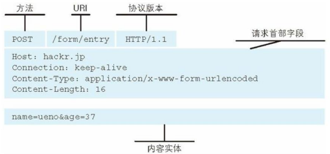
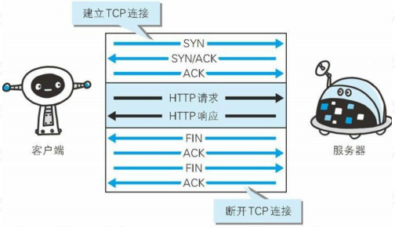

# 1 HTTP 通信协议的基本原理

## 1.1 一次 HTTP 请求的通信流程


# 2 HTTP 通信协议的组成

HTTP 协议是基于应用层的协议，并且在传输层使用的 TCP 的可靠性通信协议。既然是协议，那么就应该符合协议的定义：协议是两个需要通过网络通信的程序达成的一种约定，它规定了报文的交换方式和包含的意义，所以，接下来我们来深入去剖析 HTTP 协议的原理和组成。

## 2.1 请求 URI 定位资源 

我们在浏览器中输入一个地址，浏览器是如何根据地址去找到服务器对应的资源并做返回的？ 以及这个地址包含了哪些有价值的信息呢？ 

> URI 用字符串标识某一互联网资源，而 URL 表示资源的地点（互联网上所处的位置）。可见URL 是 URI 的子集。

这就需要我们了解 `URL (Uniform Resource Locator)`，统一资源定位符 ，用于描述一个网络上的资源，具体格式是：

http://www.xxx.com:80/java/index.html?name=spring#head 

schema://host[:port#]/path[?query-string] [#anchor]

`scheme` 指定应用层使用的协议(例如：http, https, ftp) 

`host` HTTP 服务器的 IP 地址或者域名 

`port#` HTTP 服务器的默认端口是 80，这种情况下端口号可以省略。如果使用了别的端口，必须指明，例如 http://www.xxx.com:8080/ 

`path` 访问资源的路径 

`?query-string` 查询字符串 

`#anchor` 片段标识符（使用片段标识符通常可标记出已获取资源中的子资源（文档内 的某个位置））

通过这个 url 地址，我们就可以读到，当前用户要使用 http 协议访问指定服务器上对应进程 中的资源，并且携带了请求参数。

## 2.2 MIME Type

服务器根据用户请求的资源找到对应的文件以后，会返回一个资源给到客户端浏览器，浏览器会对这个资源解析并且渲染。但是服务器上的资源类型有很多，比如图片类型、视频类型、 Js、Css、文本等。浏览器如何识别当前类型做不同的渲染呢？

MIME Type：是描述消息内容类型的因特网标准，常见的几种类型：

`文本文件` text/html,text/plain,text/css,application/xhtml+xml,application/xml 

`图片文件` image/jpeg,image/gif,image/png

`视频文件` video/mpeg,video/quicktime

我们可以通过两种方式来设置文件的渲染类型，第一种是 Accept，第二种是 Content-Type：

`Accept` 表示客户端希望接受的数据类型，即告诉服务器我需要什么媒体类型的数据，此时服务器应该根据 Accept 请求头生产指定媒体类型的数据

`Content-Type` 表示发送端发送的实体数据类型，比如我们应该写过类似的 `resposne.setContentType(“application/json;charset=utf-8”)` 的代码，表示服务端返回的数据格式是 json

如果 Accept 和 Content-Type 不一致，假如说 Accept 要接收的类型是 image/gif，但是服务端返回的数据是 text/html，那么浏览器将会无法解析。

## 2.3 访问一个不存在的地址

如果用户访问的地址没问题，或者服务器也能正常解析及处理当前用户的请求，那就能够返回正确的信息给到客户端。但是如果用户访问的地址有问题，或者服务端在解析用户请求以及处理请求逻辑时出现问题，怎么办呢？浏览器应该怎么告诉用户当前是处理失败的呢？ 因此这里就涉及到一个状态码的概念。

`状态码`的职责是当客户端向服务端发送请求时，描述服务端返回的请求处理结果，通过状态码，浏览器可以知道服务器是正常处理请求还是出现了错误。

|      | 类别                           | 原因短语                   |
| ---- | ------------------------------ | -------------------------- |
| 1XX  | Informational(信息性状态码)    | 接收的请求正在处理         |
| 2XX  | Success(成功状态码)            | 请求正常处理完毕           |
| 3XX  | Redirection(重定向状态码)      | 需要进行附加操作已完成请求 |
| 4XX  | Client Error(客户端错误状态码) | 服务器无法处理请求         |
| 5XX  | Server Error(服务器错误状态码) | 服务器处理请求出错         |

比较多的错误码： 

200：一切正常 

301：永久重定向 

404：请求资源不存在 

500：服务端内部错误

有了状态码，在用户访问某个网站出现非正常状态时，浏览器就可以很友好的提示用户。

## 2.4 告诉服务器端当前请求的意图 

有了 url，mimetype、状态码， 能够基本满足用户的需求，但是，很多时候一个网站不单纯只是不断从服务端获取资源并做渲染，可能还需要做一些数据的提交、删除等功能。所以浏览器定义了 8 种方法来表示对于不同请求的操作方式，当然最常用的还是 Get 和 Post，要不是 Get 方法不支持大数据的传输，估计很多同学 Post 都不会去使用。 

`GET` 一般是用于客户端发送一个 URI 地址去获取服务端的资源（一般用于查询操作），Get 不支持的传输数据有限制，具体限制由浏览器决定 

`POST` 一般用户客户端传输一个实体给到服务端，让服务端去保存（一般用于创建操作） 

`PUT` 向服务器发送数据，一般用于更新数据的操作 

`DELETE` 客户端发起一个 Delete 请求要求服务端把某个数据删除（一般用于删除操作） 

`HEAD` 获得报文首部

`OPTIONS` 询问支持的方法

`TRACE` 追踪路径

`CONNECT` 用隧道协议连接代理 

在 REST 架构风格中，有严格规定对于不同的请求类型要设置合适的请求方法。也是避免出现因为乱用导致混乱的问题。这里提到了 REST 架构，现在很多同学都在写 REST，有没有人能够明白为什么要定义 REST 这个架构风格？

1. 随着服务化架构的普及，http 协议的使用频率越来越高
2. 很多人在错误的使用 http 协议定义接口，比如各种各样的命名，什么 getUserInfoById， deleteById 之类的、有状态和无状态请求混用
3. 对于 http 协议本身提供的规则并没有很好的利用

所以，为了更好的解决这些问题，干脆就定义一套规则，这套规则并没有引入新的东西，无非就是对 http 协议本身的使用做了一些约束，比如说：

1. REST 是面向资源，每一个 URI 代表一个资源 
2. 强调无状态化，服务器端不能存储来自某个客户的某个请求中的信息，并在该客户的其他请求中使用 

3. 强调 URL 暴露资源时，不要在 URI 中出现动词 
4. 合理的利用 http 状态码、请求方法

## 2.5 HTTP 协议的完整组成

HTTP协议包含两个报文，一个是请求报文，一个是响应报文。

### 2.5.1 请求报文

请求报文格式包含三个部分（起始行、首部字段、主体）




### 2.5.2 响应报文

响应的报文格式也是一样，分为三部分


## 2.6 HTTP 协议中的扩展

### 2.6.1 传输的文件过大

服务器上返回的资源文件比较大，比如有些 js 文件大小可能就有几兆。文件过大就会影响传 输的效率，同时也会带来带宽的消耗。怎么办呢？ 

**对文件进行压缩，减少文件大小**

那压缩和解压缩的流程怎么实现呢？

首先服务端需要能支持文件的压缩功能，其次浏览器能够针对被压缩的文件进行解压缩。浏览器可以指定 Accept-Encoding 来高速服务器我当前支持的编码类型 Accept-Encoding:gzip,deflate 那服务端会根据支持的编码类型，选择合适的类型进行压缩。

常见的编码方式有：gzip/deflate

**分割传输**

在传输大容量数据时，通过把数据分割成多块，能够让浏览器逐步显示页面。这种把实体主体分块的功能称为分块传输编码（Chunked Transfer Coding）。

### 2.6.2 每次请求都要建立连接？

在最早的 http 协议中，每进行一次 http 通信，就需要做一次 tcp 的连接。而一次连接需要进 行 3 次握手，这种通信方式会增加通信量的开销。



所以在 HTTP/1.1 中改用了持久连接，就是在一次连接建立之后，只要客户端或者服务端没有明确提出断开连接，那么这个 tcp 连接会一直保持连接状态。

持久连接的一个最大的好处是：大大减少了连接的建立以及关闭时延。 

HTTP1.1 中有一个 Transport 段，会携带一个 Connection:Keep-Alive，表示希望将此条连接作为持久连接。 

HTTP/1.1 持久连接在默认情况下是激活的，除非特别指明，否则 HTTP/1.1 假定所有的连接都 是持久的，要在事务处理结束之后将连接关闭，HTTP/1.1 应用程序必须向报文中显示地添加 一个 Connection：close 首部。 

HTTP1.1 客户端加载在收到响应后，除非响应中包含了 Connection：close 首部，不然 HTTP/1.1 连接就仍然维持在打开状态。但是，客户端和服务器仍然可以随时关闭空闲的连接。不发送 Connection：close 并不意味这服务器承诺永远将连接保持在打开状态。 

管道化连接: http/1.1 允许在持久连接上使用请求管道。以前发送请求后需等待并收到响应， 才能发送下一个请求。管线化技术出现后，不用等待响应亦可直接发送下一个请求。这样就能够做到同时并行发送多个请求，而不需要一个接一个地等待响应了。


# 3 HTTP 协议的特点

## 3.1 Http 无状态协议

HTTP 协议是无状态的，什么是无状态呢？就是说 HTTP 协议本身不会对请求和响应之间的通信状态做保存。

但是现在的应用都是有状态的，如果是无状态，那这些应用基本没人用，你想想，访问一个电商网站，先登录，然后去选购商品，当点击一个商品加入购物车以后又提示你登录。这种用户体验根本不会有人去使用。那我们是如何实现带状态的协议呢？

## 3.2 客户端支持的 cookie

Http 协议中引入了 cookie 技术，用来解决 http 协议无状态的问题。通过在请求和响应报文中写入 Cookie 信息来控制客户端的状态；Cookie 会根据从服务器端发送的响应报文内的一个叫做 Set-Cookie 的首部字段信息，通知客户端保存 Cookie。当下次客户端再往该服务器发送请求时，客户端会自动在请求报文中加入 Cookie 值后发送出去。 


## 3.3 服务端支持的 session

服务端是通过什么方式来保存状态的呢？

在基于 tomcat 这类的 jsp/servlet 容器中，会提供 session 这样的机制来保存服务端的对象状态，服务器使用一种类似于散列表的结构来保存信息，当程序需要为某个客户端的请求创建一个 session 的时候，服务器首先检查这个客户端的请求是否包含了一个 session 标识 session id； 

如果已包含一个 session id 则说明以前已经为客户端创建过 session，服务器就按照 session id 把这个 session 检索出来使用（如果检索不到，会新建一个）；

如果客户端请求不包含 sessionid，则为此客户端创建一个 session 并且生成一个与此 session 相关联的 session id， session id 的值是一个既不会重复，又不容易被找到规律的仿造字符串，这个 session id 将会返回给客户端保存。

## 3.4 Tomcat 实现 session 的代码逻辑分析

我们以 `HttpServletRequest#getSession()` 作为切入点，对 Session 的创建过程进行分析我们的应用程序拿到的 HttpServletRequest 是 `org.apache.catalina.connector.RequestFacade` (除非某些 Filter 进行了特殊处理)，它是 `org.apache.catalina.connector.Request` 的门面模式 。

```java
// Request 对象中是否存 在 Session，如果存在并且未失效则直接返回
if ((session != null) && !session.isValid()) {
    session = null;
}
if (session != null) {
    return session;
}
......
// 如果不存在 Session，则尝试根据 requestedSessionId 查找 Session，如果存在 Session 的话则直接返回
if (requestedSessionId != null) {
    try {
        session = manager.findSession(requestedSessionId);
    } catch (IOException e) {
        if (log.isDebugEnabled()) {
            log.debug(sm.getString("request.session.failed", requestedSessionId, e.getMessage()), e);
        } else {
            log.info(sm.getString("request.session.failed", requestedSessionId, e.getMessage()));
        }
        session = null;
    }
    if ((session != null) && !session.isValid()) {
        session = null;
    }
    if (session != null) {
        session.access();
        return session;
    }
}
// 如果不存在的话，则创建新的 Session，并且把 sessionId 添加到 Cookie 中，后续的请求便会携带该 Cookie
String sessionId = getRequestedSessionId();
......
session = manager.createSession(sessionId);
// Creating a new session cookie based on that session
if (session != null && trackModesIncludesCookie) {
    Cookie cookie = ApplicationSessionCookieConfig.createSessionCookie(
            context, session.getIdInternal(), isSecure());
    response.addSessionCookieInternal(cookie);
}
```

这样便可以根据 Cookie 中的 sessionId 找到原来创建的 Session 了。

# 4 HTTPS 协议基本分析

由于 HTTP 协议在通信过程中，是基于明文通信，并且底层是基于 TCP/IP 协议进行通信，那 么按照 TCP/IP 协议族的工作机制，通信内容在所有的通信线路上都有可能遭到拦截和窃取。 窃取这个过程其实很简单，通过抓包工具 Wireshark 就可以截获请求和响应的内容。

## 4.1 HTTPS 安全传输协议

由于 HTTP 协议通信的不安全性，所以人们为了防止信息在传输过程中遭到泄漏或者篡改， 就想出来对传输通道进行加密的方式 https。 https 是一种加密的超文本传输协议，它与 HTTP 在协议差异在于对数据传输的过程中，https 对数据做了完全加密。由于 http 协议或者 https 协议都是处于 TCP 传输层之上，同时网络协议又是一个分层的结构，所以在 tcp 协议层之上增加了一层 SSL（Secure Socket Layer，安全层）或者 TLS（Transport Layer Security） 安全层传输协议组合使用用于构造加密通道； Ssl 是 netscape 公司设计的（Secure sockets layer)，后来互联网标准化组织 ISOC 接替了 NETScape 公司，发布了 SSL 的升级版 TLS。接着 TLS 的版本又进行了多次升级； 实际上我们现在的 HTTPS 都是用的 TLS 协议，但是由于 SSL 出现的时间比较早，并且依旧被现在浏览器所支持，因此 SSL 依然是 HTTPS 的代名词。


## 4.2 逆向推导 https 的设计过程

### 4.2.1 从第一个消息开始 

客户端 A 向服务端 B 发送一条消息，这个消息可能会被拦截以及篡改，我们如何做到 A 发送给 B 的数据包，即使被拦截了，也没办法得知消息内容并且也不能查看呢？


### 4.2.2 使用对称加解密

要做到消息不能被第三方查看以及篡改，那么第一想法就是对内容进行加密，同时，该消息还需要能被服务端进行解密。所以我们可以使用对称加密算法来实现，密钥 S 扮演着加密和解密的角色。在密钥 S 不公开的情况下，就可以保证安全性？


会存在多个客户端和服务端产生连接，而这个客户端也许是一个潜伏者，如果他也有对称密钥 S，那相当于上面的方案是不可行的？如果服务端和每个客户端通信的时候使用不同的加密算法呢？


似乎能够完美解决问题，然后？密钥如何分配呢？也就是服务端怎么告诉客户端该使用那种对称加密算法呢？解决办法似乎只能通过建立会话以后进行协商了？

### 4.2.3 协商过程又是不安全的

协商过程，意味着又是基于一个网络传输的情况下去动态分配密钥，可是这个协商过程又是不安全的(可能被拦截，第一次没有密钥一定是明文的)，怎么破？


### 4.2.4 使用非对称加密

非对称加密算法的特点是：私钥加密后的密文，只要有公钥，都能解密，但是公钥加密后的密文，只有私钥可以解密。

私钥只有一个人有，而公钥可以发给所有人。


这样就可以保证 A/B 向服务器端方向发送的消息是安全的。似乎我们通过非对称加密算法解决了密钥的协商的问题？

但是客户端如何拿到公钥？

1. 服务器端把公钥发送给每一个客户端 
2. 服务器端把公钥放到远程服务器，客户端可以请求到 
3. 让浏览器保存所有的公钥（不现实）

方案一似乎不可行，因为，传输过程又是不安全的？公钥可能会被调包


### 4.2.5 使用第三方机构来解决

到上面这一步，最关键的问题是，客户端如何知道给我公钥的是黄蓉还是小龙女？只能找本人去证实？或者有一个第三者来帮你证实，并且第三者是绝对公正的。 所以，引入一个可信任的第三者是一个好的方案。

服务端把需要传递给客户端的公钥，通过第三方机构提供的私钥对公钥内容进行加密后，再传递给客户端？ 通过第三方机构私钥对服务端公钥加密以后的内容，就是一个简陋版本的 “数字证书”。这个帧数中包含【服务器公钥】


客户端拿到这个证书以后，因为证书是第三方机构使用私钥加密的。客户端必须要有第三方机构提供的公钥才能解密证书。这块又涉及到第三方机构的公钥怎么传输？（假设是先内置在系统中）以及还有一个问题，第三方机构颁发的证书是面向所有用户，不会只针对一家发放。如果不法分子也去申请一个证书呢？

### 4.2.6 如果不法分子也拿到证书

如果不法分子也申请了证书，那它可以对证书进行调包。客户端在这种情况下是无法分辨出收到的是你的证书，还是中间人的。因为不论是中间人的、还是你的证书都能使用第三方机构的公钥进行解密。


### 4.2.7 验证证书的有效性 

事情发展到现在，问题演变成了，客户端如何识别证书的真伪？在现实生活中，要验证一个东西的真伪，绝大部分都是基于编号去验证（比如大学毕业证书，比如买的数码产品是否是山寨），我之前讲过，计算机领域的解决方案都是人为去实现的，所以在这里，解决方案也是 一样，如果给这个数字证书添加一个证书编号？是不是就能达到目的呢？

证书上写了如何根据证书的内容生成证书编号。客户端拿到证书后根据证书上的方法自己生成一个证书编号，如果生成的证书编号与证书上的证书编号相同，那么说明这个证书是真实的。这块有点类似于 md5 的验证，我们下载一个软件包，都会提供一个 md5 的值，我们可以拿到这个软件包以后通过一个第三方软件去生成一个 md5 值去做比较，是不是一样如果一样表示这个软件包没被篡改过。


对服务端的数据进行 MD5 算法得到一个 MD5 的值，生成证书编号，使用第三方机构的私钥对这个证书编号进行加密，并且会在证书中添加证书编号的生成算法。

浏览器内置的 CA 公钥可以解密服务端 CA 私钥加密的证书，通过浏览器内置的 CA 证书的证书编号算法对服务端返回的证书编号进行验签。


### 4.2.8 第三方机构的公钥证书存哪里

浏览器和操作系统都会维护一个权威的第三方机构列表（包括他们的公钥）。

因为客户端接收到的证书中会些颁发机构，客户端就根据这个办法机构的值在本地找到响应的公钥说到这里，我想大家一定知道，证书就是 HTTPS 中的数字证书，证书编号就是数字签名，而第三方机构就是数字证书的签发机构（CA）。

# 5 HTTPS 原理分析 

## 5.1 HTTPS 证书的申请过程 

1. 服务器上生成 CSR 文件（证书申请文件，内容包括证书公钥、使用的 Hash 签名算法、申请的域名、公司名称、职位等信息）

2. 把 CSR 文件和其他可能的证件上传到 CA 认证机构，CA 机构收到证书申请之后，进行审核，主要检查网站地址的拥有者是否是证书的申请者 ，<font color=red>然后使用申请中的 Hash 算法，对部分内容进行摘要，然后使用 CA 机构自己的私钥对这段摘要信息进行签名（相当于证书的唯一编号）。</font>
3.  然后 CA 机构把签名过的证书通过邮件形式发送到申请者手中
4. 申请者收到证书之后部署到自己的 web 服务器中

> 如果用「公钥」对数据加密，用「私钥」去解密，这是「加密」；反之用「私钥」对数据加密，用「公钥」去解密，这是「签名」。
>
> 证书里面的内容比较多，挑几个重要的解释一下：
> Issuer (证书的发布机构)
> 指出是什么机构发布的这个证书，也就是指明这个证书是哪个公司创建的(只是创建证书，不是指证书的使用者)。
>
> Valid from , Valid to (证书的有效期)
> 也就是证书的有效时间，或者说证书的使用期限。 过了有效期限，证书就会作废，不能使用了。
>
> Public key (公钥)
>
> Subject (主题)
> 这个证书是发布给谁的，或者说证书的所有者，一般是某个人或者某个公司名称、机构的名称、公司网站的网址等。
>
> Signature algorithm (签名所使用的算法)
> 就是指的这个数字证书的数字签名所使用的加密算法，这样就可以使用证书发布机构的证书里面的公钥，根据这个算法对指纹进行解密，指纹的加密结果就是数字签名。
>
> Thumbprint, Thumbprint algorithm (指纹以及指纹算法)
> 这个是用来保证证书的完整性的，也就是说确保证书没有被修改过。 其原理就是在发布证书时，发布者根据指纹算法(一个hash算法)计算整个证书的hash值(指纹)并和证书放在一起，使用者在打开证书时，自己也根据指纹算法计算一下证书的hash值(指纹)，如果和刚开始的值对得上，就说明证书没有被修改过，因为证书的内容被修改后，根据证书的内容计算的出的hash值(指纹)是会变化的。 注意，这个指纹会使用证书机构的私钥用签名算法(Signature algorithm)加密后和证书放在一起。


## 5.2 客户端请求交互流程 

### 5.2.1 客户端发起请求(Client Hello 包) 

a) 三次握手，建立 TCP 连接 

b) 支持的协议版本(TLS/SSL) 

c) 客户端生成的随机数 client.random，后续用于生成“对话密钥” 

d) 客户端支持的加密算法 

e) sessionid，用于保持同一个会话（如果客户端与服务器费尽周折建立了一个 HTTPS 链接， 刚建完就断了，也太可惜） 

### 5.2.2 服务端收到请求，然后响应（Server Hello） 

a) 确认加密通道协议版本 

b) 服务端生成的随机数 server.random，后续用于生成“对话密钥” 

c) 确认使用的加密算法（用于后续的握手消息进行签名防止篡改） 

d) 服务器证书（CA 机构颁发给服务端的证书） 

### 5.2.3 客户端收到证书进行验证 

a) 验证证书是否是上级 CA 签发的, 在验证证书的时候，浏览器会调用系统的证书管理器接口对证书路径中的所有证书一级一级的进行验证，只有路径中所有的证书都是受信的， 整个验证的结果才是受信 

b) 服务端返回的证书中会包含证书的有效期，可以通过失效日期来验证证书是否过期 

c) 验证证书是否被吊销了 

d) 前面我们知道 CA 机构在签发证书的时候，都会使用自己的私钥对证书进行签名

证书里的签名算法字段 sha256RSA 表示 CA 机构使用 sha256 对证书进行摘要，然后使用 RSA 算法对摘要进行私钥签名，而我们也知道 RSA 算法中，使用私钥签名之后， 只有公钥才能进行验签。 

e) 浏览器使用内置在操作系统上的 CA 机构的公钥对服务器的证书进行验签。确定这个证书是不是由正规的机构颁发。验签之后得知 CA 机构使用 sha256 进行证书摘要，然后客户端再使用 sha256 对证书内容进行一次摘要，如果得到的值和服务端返回的证书验 签之后的摘要相同，表示证书没有被修改过

f) 验证通过后，就会显示绿色的安全字样 

g) 客户端生成随机数，验证通过之后，客户端会生成一个随机数 pre-master secret，客户 端根据之前的：Client.random + sever.random + pre-master 生成对称密钥然后使用 证书中的公钥进行加密，同时利用前面协商好的 HASH 算法,把握手消息取 HASH 值， 然后用 随机数加密 “握手消息+握手消息 HASH 值(签名)” 并一起发送给服务端 (在 这里之所以要取握手消息的 HASH 值，主要是把握手消息做一个签名，用于验证握手 消息在传输过程中没有被篡改过。) 

### 5.2.4 服务端接收随机数 

a) 服务端收到客户端的加密数据以后，用自己的私钥对密文进行解密。然后得到 client.random/server.random/pre-master secret, HASH 值，并与传过来的 HASH 值做 对比确认是否一致。 

b) 然后用随机密码加密一段握手消息(握手消息+握手消息的 HASH 值 )给客户端 

### 5.2.5 客户端接收消息 

a) 客户端用随机数解密并计算握手消息的 HASH，如果与服务端发来的 HASH 一致，此 时握手过程结束

b) 之 后 所 有 的 通 信 数 据 将 由 之 前 交 互 过 程 中 生 成 的 pre master secret / client.random/server.random 通过算法得出 session Key，作为后续交互过程中的对称密钥


------

