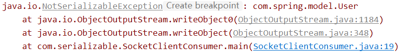
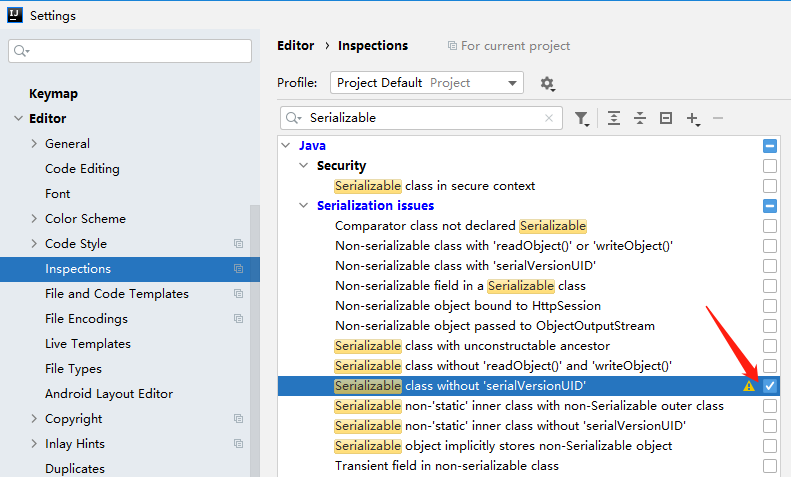
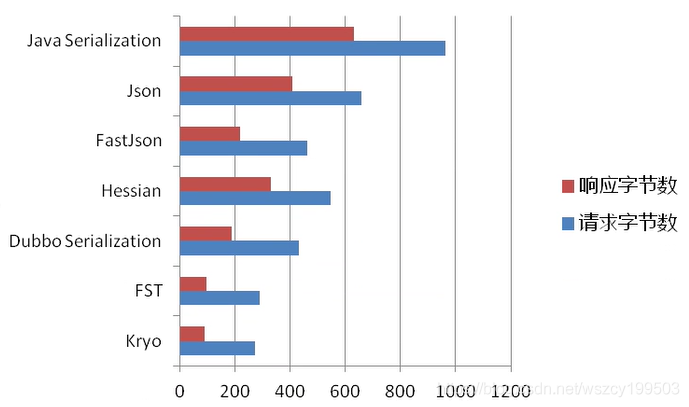

# 1 Java 领域的对象如何传输

## 1.1 基于 socket 进行对象传输

```java
// Server.java
ServerSocket serverSocket = new ServerSocket(8888);
Socket socket = serverSocket.accept();
ObjectInputStream objectInputStream= new ObjectInputStream(socket.getInputStream());
User user=(User)objectInputStream.readObject();
System.out.println(user);

// Client.java
Socket socket = new Socket("127.0.0.1", 8888);
ObjectOutputStream objectOutputStream = new ObjectOutputStream(socket.getOutputStream());
User user = new User();
user.setId(1);
user.setName("晓晓");
objectOutputStream.writeObject(user);
```

➢ 这段代码运行以后，能够实现 Java 对象的正常传输吗？ 

很显然，会报错：



如何解决报错的问题呢？

对 User 这个对象实现一个 Serializable 接口，再次运行就可以看到对象能够正常传输了。

```java
public class User implements Serializable {
	......
}
```

## 1.2 了解序列化的意义

我们发现对 User 这个类增加一个 Serializable，就可以解决 Java 对象的网络传输问题。这就是序列化这块的意义。

Java 平台允许我们在内存中创建可复用的 Java 对象，但一般情况下，只有当 JVM 处于运行时，这些对象才可能存在，即这些对象的生命周期不会比 JVM 的生命周期更长。但在现实应用中，就可能要求在 JVM 停止运行之后能够保存(持久化)指定的对象，并在将来重新读取被保存的对象。Java 对象序列化就能够帮助我们实现该功能。

简单来说，`序列化`是把对象的状态信息转化为可存储或传输的形式过程，也就是把对象转化为字节序列的过程称为对象的序列化。

`反序列化`是序列化的逆向过程，把字节数组反序列化为对象，把字节序列恢复为对象的过程成为对象的反序列化。

# 2 序列化的高阶认识

## 2.1 简单认识一下 Java 原生序列化

前面的代码中演示了，如何通过 JDK 提供了 Java 对象的序列化方式实现对象序列化传输，主要通过输出流 java.io.ObjectOutputStream 和对象输入流java.io.ObjectInputStream来实现。

java.io.ObjectOutputStream：表示对象输出流 , 它的 writeObject(Object obj)方法可以对参数指定的 obj 对象进行序列化，把得到的字节序列写到一个目标输出流中。

java.io.ObjectInputStream：表示对象输入流 ,它的 readObject()方法源输入流中读取字节序 列，再把它们反序列化成为一个对象，并将其返回需要注意的是，被序列化的对象需要实现 java.io.Serializable 接口

## 2.2 序列化的高阶认识

### 2.2.1 serialVersionUID 的作用

在 IDEA 中通过如下设置可以生成 serializeid



字面意思上是序列化的版本号，凡是实现 Serializable 接口的类都有一个表示序列化版本标识符的静态变量。

```java
public class SuperPerson {

    private int superAge;

    public int getSuperAge() {
        return superAge;
    }

    public void setSuperAge(int superAge) {
        this.superAge = superAge;
    }
}
public class Person extends SuperPerson implements Serializable {

    private static final long serialVersionUID = 3670473041324264753L;

    public static int height = 2;

    private String name;

    private transient int age;

    public String getName() {
        return name;
    }

    public void setName(String name) {
        this.name = name;
    }

    public int getAge() {
        return age;
    }

    public void setAge(int age) {
        this.age = age;
    }

    /*private void writeObject(java.io.ObjectOutputStream s) throws IOException {
    	s.defaultWriteObject();
    	s.writeObject(age);
	}
	private void readObject(java.io.ObjectInputStream s) throws IOException, ClassNotFoundException {
    	s.defaultReadObject();
    	age=(Integer) s.readObject();
	}*/
    
    @Override
    public String toString() {
        return "Person{" +
                "name='" + name + '\'' +
                ", age=" + age +
                '}';
    }
}
public class SerializeDemo {
    public static void main(String[] args) {
        // 序列化操作,先将 Person 对象序列化到文件中
        serializePerson();

        Person.height = 5;
        // 反序列化操作,然后通过反序列化来把对象提取出来
        Person person = deSerializePerson();
        System.out.println(person);
        System.out.println("静态变量：" + person.height);
        System.out.println("未实现Serialize的父类变量：" + person.getSuperAge());
    }

    private static  void serializePerson() {
        try {
            ObjectOutputStream oo = new ObjectOutputStream(new FileOutputStream(new File("person")));
            Person person = new Person();
            person.setAge(18);
            person.setName("Spring");
            person.setSuperAge(36);
            oo.writeObject(person);
            oo.flush();
            oo.writeObject(person);
            oo.flush();
            // 写一次大小为 83，写两次为88，不是叠加
            System.out.println("序列化成功:" + new File("person").length());

            oo.close();
        } catch (IOException e) {
            e.printStackTrace();
        }
    }

    private static Person deSerializePerson() {
        try {
            ObjectInputStream ois = new ObjectInputStream(new FileInputStream(new File("person")));
            Person person1 = (Person) ois.readObject();
            Person person2 = (Person) ois.readObject();
            // 存储的对象指向同一个引用
            System.out.println(person1 == person2);
            return person1;
        } catch (Exception e) {
            e.printStackTrace();
        }
        return null;
    }
}
```

如果在 deSerializePerson() 之前，修改掉 Person.serialVersionUID ：

```markdown
java.io.InvalidClassException: com.serializable.SerializablePerson; local class incompatible: stream classdesc serialVersionUID = -3173897838325750149, local class serialVersionUID = -3173897838325750141
	at java.io.ObjectStreamClass.initNonProxy(ObjectStreamClass.java:699)
	at java.io.ObjectInputStream.readNonProxyDesc(ObjectInputStream.java:2001)
	at java.io.ObjectInputStream.readClassDesc(ObjectInputStream.java:1848)
	at java.io.ObjectInputStream.readOrdinaryObject(ObjectInputStream.java:2158)
	at java.io.ObjectInputStream.readObject0(ObjectInputStream.java:1665)
	at java.io.ObjectInputStream.readObject(ObjectInputStream.java:501)
	at java.io.ObjectInputStream.readObject(ObjectInputStream.java:459)
	at com.serializable.SerializeDemo.deSerializePerson(SerializeDemo.java:45)
	at com.serializable.SerializeDemo.main(SerializeDemo.java:16)
Exception in thread "main" java.lang.NullPointerException
	at com.serializable.SerializeDemo.main(SerializeDemo.java:19)
```

Java 的序列化机制是通过判断类的 serialVersionUID 来验证版本一致性的。在进行反序列化时，JVM 会把传来的字节流中的 serialVersionUID 与本地相应实体类的 serialVersionUID 进行比较，如果相同就认为是一致的，可以进行反序列化，否则就会出现序列化版本不一致的异常，即是 InvalidCastException。 

(未显式指定 serialVersionUID，class 修改后不能识别)从结果可以看出，文件流中的 class 和 classpath 中的 class，也就是修改过后的 class，不兼容了，处于安全机制考虑，程序抛出了错误，并且拒绝载入。从错误结果来看，<font color=red>如果没有为指定的 class 配置 serialVersionUID，那么 java 编译器会自动给这个 class 进行一个摘要算法， 类似于指纹算法，只要这个文件有任何改动，得到的 UID 就会截然不同的，可以保证在这么多类中，这个编号是唯一的。</font>所以，由于没有显式指定 serialVersionUID，编译器又为我们生成 了一个 UID，当然和前面保存在文件中的那个不会一样了，于是就出现了 2 个序列化版本号不一致的错误。

因此，只要我们自己指定了 serialVersionUID，就可以在序列化后，去添加一 个字段，或者方法，而不会影响到后期的还原，还原后的对象照样可以使用，而且还多了方法或者属性可以用。

> serialVersionUID 有两种显示的生成方式： 
>
> 一是默认的 1L，比如：private static final long serialVersionUID = 1L; 
>
> 二是根据类名、接口名、成员方法及属性等来生成一个 64 位的哈希字段 

当实现 java.io.Serializable 接口的类没有显式地定义一个 serialVersionUID 变量时候，Java 序列化机制会根据编译的 Class 自动生成一个 serialVersionUID 作序列化版本比较用，这种情况下，如果 Class 文件(类名，方法明等)没有发生变化(增加空格，换行，增加注释等等)，就算再编译多次，serialVersionUID 也不会变化的。

<font color=blue>在序列化过程中，将不会保留静态变量的值。实际上，静态变量也不会序列化，但是因为它们属于该类。反序列化后，它们从类中获取当前值。(示例中，在 person 文件存在的情况下，如果只执行deSerializePerson()方法，得到的静态变量值为2)</font>

<font color=violet>如果父类没有实现序列化，而子类实现列序列化。那么父类中的成员没办法做序列化操作。</font>

### 2.2.2 Transient关键字

Transient 关键字的作用是控制变量的序列化，在变量声明前加上该关键字，可以阻止该变量被序列化到文件中，在被反序列化后，transient 变量的值被设为初始值，如 int 型的是 0，对象型的是 null。

**绕开 transient 机制的办法**

虽然 name 被 transient 修饰，但是通过我们写的 writeObject 和 readObject 这两个方法依然能够使得 age 字段正确 被序列化和反序列化。

**writeObject 和 readObject 原理**

writeObject 和 readObject 是两个私有的方法，他们是什么时候被调用的呢？

从运行结果来 看，它确实被调用。而且他们并不存在于 Java.lang.Object，也没有在 Serializable 中去声明。 我们唯一的猜想应该还是和 ObjectInputStream 和 ObjectOutputStream 有关系，所以基于这个入口去看看在哪个地方有调用：

```java
// ObjectStreamClass.java
void invokeReadObjectNoData(Object obj)
    throws IOException, UnsupportedOperationException
{
    requireInitialized();
    if (readObjectNoDataMethod != null) {
        try {
            readObjectNoDataMethod.invoke(obj, (Object[]) null);
        } catch (InvocationTargetException ex) {
            Throwable th = ex.getTargetException();
            if (th instanceof ObjectStreamException) {
                throw (ObjectStreamException) th;
            } else {
                throwMiscException(th);
            }
        } catch (IllegalAccessException ex) {
            // should not occur, as access checks have been suppress
            throw new InternalError(ex);
        }
    } else {
        throw new UnsupportedOperationException();
    }
}
```

从源码层面来分析可以看到，readObject 是通过反射来调用的。 

其实我们可以在很多地方看到 readObject 和 writeObject 的使用，比如 HashMap。

### 2.2.3 序列化的存储规则

对同一个对象进行多次写入，打印出的第一次存储结果和第二次存储结果，只多了5个字节的引用关系，并不会导致文件累加。

### 2.2.4 序列化实现深度克隆

浅拷贝（浅复制、浅克隆）：被复制对象的所有变量都含有与原来的对象相同的值，而所有的对其他对象的引用仍然指向原来的对象。换言之，浅拷贝仅仅复制所拷贝的对象，而不复制它所引用的对象

深拷贝（深复制、深克隆）：被复制对象的所有变量都含有与原来的对象相同的值，除去那些引用其他对象的变量。那些引用其他对象的变量将指向被复制过的新对象，而不再是原有的那些被引用的对象。换言之，深拷贝把要复制的对象所引用的对象都复制了一遍

## 2.3 总结

1. 在java中，只要一个类实现了java.io.Serializable接口，那么它就可以被序列化 
2. 通过 ObjectOutputStream 和 ObjectInputStream 对对象进行序列化合反序列化操作 
3. 对象是否允许被反序列化，不仅仅是取决于对象的代码是否一致，同时还有一个重要的因素（UID） 
4. 序列化不保存静态变量 
5. 当一个父类实现了序列化，那么子类会自动实现序列化，不需要显示实现序列化接口
6. 当某个字段被申明为 transient 后，默认的序列化机制会忽略这个字段，被申明为 transient 的字段，如果需要序列化，可以添加两个私有方法：writeObject 和 readObject
7. 当一个对象的实例变量引用了其他对象，序列化这个对象的时候会自动把引用的对象也进行序列化（实现深度克隆）
8. Java 序列化只是针对对象的状态进行保存，至于对象中的方法，序列化不关心

# 3 分布式架构下常见序列化技术

## 3.1 序列化的发展

随着分布式架构、微服务架构的普及。服务与服务之间的通信成了最基本的需求。这个时候， 我们不仅需要考虑通信的性能，也需要考虑到语言多元化问题。

所以，对于序列化来说，如何去提升序列化性能以及解决跨语言问题，就成了一个重点考虑的问题。 

由于 Java 本身提供的序列化机制存在两个问题：

1. 序列化的数据比较大，传输效率低
2.  其他语言无法识别和对接 

以至于在后来的很长一段时间，基于XML格式编码的对象序列化机制成为了主流，一方面解决了多语言兼容问题，另一方面比二进制的序列化方式更容易理解。以至于基于XML的SOAP协议及对应的WebService框架在很长一段时间内成为各个主流开发语言的必备的技术。 

再到后来，基于JSON的简单文本格式编码的HTTP REST接口又基本上取代了复杂的Web Service接口，成为分布式架构中远程通信的首要选择。但是JSON序列化存储占用的空间大、性能低等问题，同时移动客户端应用需要更高效的传输数据来提升用户体验。在这种情况下与语言无关并且搞笑的二进制编码协议就成为了大家追求的热点技术之一。首先诞生的一个开源的二进制序列化框架MessagePack。它比google的Protocol Buffers出现得还要早。 恰当的序列化协议不仅可以提高系统的通用性、强壮型、安全性、优化性能。同时还能让系统更加易于调试和扩展。

## 3.2 简单了解各种序列化技术

### 3.2.1 XML 序列化框架介绍

XML 序列化的好处在于可读性好，方便阅读和调试。但是序列化以后的字节码文件比较大， 而且效率不高，适用于对性能不高，而且 QPS 较低的企业级内部系统之间的数据交换的场景， 同时 XML 又具有语言无关性，所以还可以用于异构系统之间的数据交换和协议。比如我们熟 知的 Webservice，就是采用 XML 格式对数据进行序列化的。XML 序列化/反序列化的实现方式有很多，熟知的方式有 XStream 和 Java 自带的 XML 序列化和反序列化两种。

### 3.2.2 JSON 序列化框架

JSON（JavaScript Object Notation）是一种轻量级的数据交换格式，相对于 XML 来说，JSON 的字节流更小，而且可读性也非常好。现在 JSON 数据格式在企业运用是最普遍的 JSON 序列化常用的开源工具有很多：

1. Jackson （https://github.com/FasterXML/jackson） 
2. 阿里开源的 FastJson （https://github.com/alibaba/fastjon） 
3. Google 的 GSON (https://github.com/google/gson) 

这几种 json 序列化工具中，Jackson 与 fastjson 要比 GSON 的性能要好，但是 Jackson、 GSON 的稳定性要比 Fastjson 好。而 fastjson 的优势在于提供的 api 非常容易使用。

### 3.2.3 Hessian 序列化框架

Hessian 是一个支持跨语言传输的二进制序列化协议，相对于 Java 默认的序列化机制来说， Hessian 具有更好的性能和易用性，而且支持多种不同的语言。

> 实际上 Dubbo 采用的就是 Hessian 序列化来实现，只不过 Dubbo 对 Hessian 进行了重构， 性能更高。

### 3.2.4 Avro 序列化

Avro 是一个数据序列化系统，设计用于支持大批量数据交换的应用。它的主要特点有：支持 二进制序列化方式，可以便捷，快速地处理大量数据；动态语言友好，Avro 提供的机制使动 态语言可以方便地处理 Avro 数据。

### 3.2.5 kyro 序列化框架

Kryo 是一种非常成熟的序列化实现，已经在 Hive、Storm 中使用得比较广泛，不过它不能跨语言。<font color=red>目前 dubbo 已经在 2.6 版本支持 kyro 的序列化机制。</font>它的性能要优于之前的 hessian2。

### 3.2.6 Protobuf 序列化框架

Protobuf 是 Google 的一种数据交换格式，它独立于语言、独立于平台。Google 提供了多种语言来实现，比如 Java、C、Go、Python，每一种实现都包含了相应语言的编译器和库文件， Protobuf 是一个纯粹的表示层协议，可以和各种传输层协议一起使用。

Protobuf 使用比较广泛，主要是空间开销小和性能比较好，非常适合用于公司内部对性能要 求高的 RPC 调用。 另外由于解析性能比较高，序列化以后数据量相对较少，所以也可以应 用在对象的持久化场景中。

但是要使用 Protobuf 会相对来说麻烦些，因为他有自己的语法，有自己的编译器，如果需要 用到的话必须要去投入成本在这个技术的学习中。

protobuf 有个缺点就是要传输的每一个类的结构都要生成对应的 proto 文件，如果某个类发生修改，还得重新生成该类对应的 proto 文件。

## 3.3 序列化技术的选型

### 3.3.1 技术层面

1. 序列化空间开销，也就是序列化产生的结果大小，这个影响到传输的性能

2. 序列化过程中消耗的时长，序列化消耗时间过长影响到业务的响应时间

3. 序列化协议是否支持跨平台，跨语言。因为现在的架构更加灵活，如果存在异构系统通信需求，那么这个是必须要考虑的

4. 可扩展性/兼容性，在实际业务开发中，系统往往需要随着需求的快速迭代来实现快速更新，这就要求我们采用的序列化协议基于良好的可扩展性/兼容性，比如在现有的序列化数据结构中新增一个业务字段，不会影响到现有的服务

5. 技术的流行程度，越流行的技术意味着使用的公司多，那么很多坑都已经淌过并且得到了解决，技术解决方案也相对成熟

6. 学习难度和易用性

### 3.3.2 选型建议

1. 对性能要求不高的场景，可以采用基于 XML 的 SOAP 协议

2. 对性能和间接性有比较高要求的场景，那么 Hessian、Protobuf、Thrift、Avro 都可以。

3. 基于前后端分离，或者独立的对外的 api 服务，选用 JSON 是比较好的，对于调试、可读性都很不错

4. Avro 设计理念偏于动态类型语言，那么这类的场景使用 Avro 是可以的

### 3.3.3 各个序列化技术的性能比较

这个地址有针对不同序列化技术进行性能比较： https://github.com/eishay/jvm-serializers/wiki



```xml
<dependency>
    <groupId>org.codehaus.jackson</groupId>
    <artifactId>jackson-mapper-asl</artifactId>
    <version>1.9.12</version>
</dependency>
<dependency>
    <groupId>com.alibaba</groupId>
    <artifactId>fastjson</artifactId>
    <version>1.2.41</version>
</dependency>
<dependency>
    <groupId>com.baidu</groupId>
    <artifactId>jprotobuf</artifactId>
    <version>2.1.2</version>
</dependency>
<dependency>
    <groupId>com.caucho</groupId>
    <artifactId>hessian</artifactId>
    <version>4.0.38</version>
</dependency>
```

```java
public class SerializableContrastDemo {
    public static void main(String[] args) throws Exception {
        executeWithJava();
        executeWithJack();
        executeWithFastJson();
        executeWithProtoBuf();
        executeWithHessian();
    }

    private static Person init() {
        Person person = new Person();
        person.setName("Spring");
        person.setAge(18);
        person.setSuperAge(36);
        return person;
    }

    private static  void executeWithJava() throws Exception {
        Person person = init();
        FileOutputStream fos = new FileOutputStream(new File("person"));
        ObjectOutputStream oo = new ObjectOutputStream(fos);
        Long start = System.currentTimeMillis();
        for (int i = 0; i < 100000; i++) {
            oo.writeObject(person);
        }
        oo.flush();
        oo.close();
        System.out.println("Java序列化：" + (System.currentTimeMillis() - start) + "ms，总大小->" + fos.toString().getBytes().length);

        ObjectInputStream ois = new ObjectInputStream(new FileInputStream(new File("person")));
        Person person1 = (Person) ois.readObject();
        ois.close();
        System.out.println(person1);
    }

    private static void executeWithJack() throws IOException {
        Person person = init();

        ObjectMapper mapper = new ObjectMapper();
        byte[] writeBytes = null;
        Long start = System.currentTimeMillis();
        for (int i = 0; i < 100000; i++) {
            writeBytes = mapper.writeValueAsBytes(person);
        }
        System.out.println("Json序列化：" + (System.currentTimeMillis() - start) + "ms，总大小->" + writeBytes.length);

        Person person1 = mapper.readValue(writeBytes, Person.class);
        System.out.println(person1);
    }

    private static void executeWithFastJson() {
        Person person = init();

        String text = null;
        Long start = System.currentTimeMillis();
        for (int i = 0; i < 100000; i++) {
            text = JSON.toJSONString(person);
        }
        System.out.println("FastJson序列化：" + (System.currentTimeMillis() - start) + "ms，总大小->" + text.getBytes().length);

        Person person1 = JSON.parseObject(text, Person.class);
        System.out.println(person1);
    }

    private static void executeWithProtoBuf() throws IOException {
        Person person = init();
				// Person类上的字段需要加上 @Protobuf 注解
        Codec<Person> personCodec = ProtobufProxy.create(Person.class, false);
        Long start = System.currentTimeMillis();
        byte[] bytes = null;
        for (int i = 0; i < 100000; i++) {
            bytes = personCodec.encode(person);
        }
        System.out.println("ProtoBuf序列化：" + (System.currentTimeMillis() - start) + "ms，总大小->" + bytes.length);

        Person person1 = personCodec.decode(bytes);
        System.out.println(person1);
    }

    private static void executeWithHessian() throws IOException {
        Person person = init();

        ByteArrayOutputStream os = new ByteArrayOutputStream();
        HessianOutput ho = new HessianOutput(os);
        Long start = System.currentTimeMillis();

        for (int i = 0; i < 100000; i++) {
            ho.writeObject(person);
            if (i == 0) {
                System.out.println("Hessian序列化总大小：" + os.toByteArray().length);
            }
        }
        System.out.println("Hessian序列化：" + (System.currentTimeMillis() - start) + "ms");
        HessianInput hi = new HessianInput(new ByteArrayInputStream(os.toByteArray()));
        Person person1 = (Person) hi.readObject();
        System.out.println(person1);
    }
}
//Java序列化：333ms，总大小->33
//Json序列化：159ms，总大小->40
//FastJson序列化：112ms，总大小->31
//ProtoBuf序列化：92ms，总大小->10
//Hessian序列化总大小：62
//Hessian序列化：31ms
```

------

