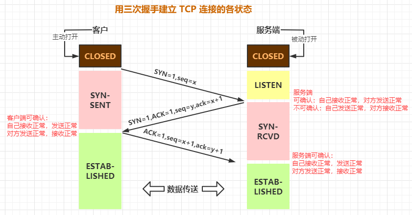
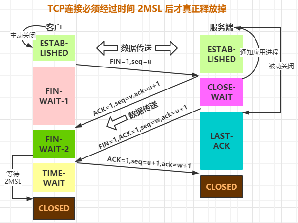

# 1 一个 http 请求的整个流程

## 1.1 负责域名解析的 DNS 服务 

首先，用户访问一个域名，会经过 DNS 解析 `DNS(Domain Name System)`，它和 HTTP 协议一样是位于应用层的协议，主要提供域名到 IP 的解析服务。我们其实不用域名也可以访问目标主机的服务，但是 IP 本身不是那么容易记，所以使用域名进行替换使得用户更容易记住。

### 加速静态内容访问速度的 CDN 

在很多大型网站，会引入 CDN 来加速静态内容的访问， 这里简单给大家解释一下什么是 `CDN（Content Delivery Network）`，表示的是`内容分发网络`。CDN 其实就是一种网络缓存技术，能够把一些相对稳定的资源放到距离最终用户较近的地方，一方面可以节省整个广域网的带宽消耗，另外一方面可以提升用户的访问速度，改进用户体验。我们一般会把静态的文件（图片、脚本、静态页面）放到 CDN 中。 

如果引入了 CDN，那么解析的流程可能会稍微复杂一点。比如阿里云就提供了 cdn 的功能。

## 1.2 HTTP 协议通信原理 

域名被成功解析以后，客户端和服务端之间，是怎么建立连接并且如何通信的呢？ 说到通信，大家一定听过 tcp 和 udp 这两种通信协议，以及建立连接的握手过程。而 http 协议的通信是`基于 tcp/ip 协议之上的一个应用层协议`，应用层协议除了 http 还有哪些呢（FTP、 DNS、SMTP、Telnet 等）。 

涉及到网络协议，我们一定需要知道 `OSI 七层网络模型`和 `TCP/IP 四层概念模型`，OSI 七层网络模型包含（应用层、表示层、会话层、传输层、网络层、数据链路层、物理层）、TCP/IP 四层概念模型包含（应用层、传输层、网络层、数据链路层）。

### 1.2.1 请求发起过程（tcp/ip 四层网络模型）

当应用程序用 TCP 传送数据时，数据被送入协议栈中，然后逐个通过每一层直到被当作一串比特流送入网络。其中每一层对收到的数据都要增加一些首部信息（有时还要增加尾部信息）。

**客户端如何找到目标服务？**

在客户端发起请求的时候，我们会在数据链路层去组装目标机器的 MAC 地址，目标机器的 mac 地址怎么得到呢？ 

这里就涉及到一个 `ARP 协议`，这个协议简单来说就是已知目标机器的 ip，需要获得目标机器的 mac 地址。(发送一个广播消息，这个 ip 是谁的，请来认领。认领 ip 的机器会发送一个 mac 地址的响应)

有了这个目标 MAC 地址，数据包在链路上广播，MAC 的网卡才能发现，这个包是给它的。 MAC 的网卡把包收进来，然后打开 IP 包，发现 IP 地址也是自己的，再打开 TCP 包，发现端口是自己，也就是 80 端口，而这个时候这台机器上有一个 nginx 是监听 80 端口。 于是将请求提交给 nginx，nginx 返回一个网页。然后将网页需要发回请求的机器。然后层层封装，最后到 MAC 层。因为来的时候有源 MAC 地址，返回的时候，源 MAC 就变成了目标 MAC，再返给请求的机器。 

为了避免每次都用 ARP 请求，机器本地也会进行 ARP 缓存。当然机器会不断地上线下线， IP 也可能会变，所以 ARP 的 MAC 地址缓存过一段时间就会过期。

### 1.2.2 接收端收到数据包以后的处理过程

当目的主机收到一个以太网数据帧时，数据就开始从协议栈中由底向上升，同时去掉各层协议加上的报文首部。每层协议都要去检查报文首部中的协议标识，以确定接收数据的上层协议。

**为什么有了 MAC 层还要走 IP 层呢？**

之前我们提到，MAC 地址是唯一的，那理论上，在任何两个设备之间，我应该都可以通过 MAC 地址发送数据，为什么还需要 ip 地址？

MAC 地址就好像个人的身份证号，人的身份证号和人户口所在的城市，出生的日期有关， 但是和人所在的位置没有关系，人是会移动的，知道一个人的身份证号，并不能找到它这个人，MAC 地址类似，它是和设备的生产者，批次，日期之类的关联起来，知道一个设备的 MAC，并不能在网络中将数据发送给它，除非它和发送方的在同一个网络内。

所以要实现机器之间的通信，我们还需要有 ip 地址的概念，ip 地址表达的是当前机器在网络中的位置，类似于城市名+道路号+门牌号的概念。通过 ip 层的寻址，我们能知道按何种路径在全世界任意两台 Internet 上的的机器间传输数据。

## 1.3 TCP/IP 的分层管理

复杂的程序都需要分层，这个是软件设计的要求，每一层专注于当前领域的事情。如果某些地方需要修改，我们只需要把变动的层替换掉就行，一方面改动影响较少，另一方面整个架构的灵活性也更高。 最后，在分层之后， 整个架构的设计也变得相对简单了。

### 分层负载

了解了分层的概念以后，我们再去理解所谓的二层负载、三层负载、四层负载、七层负载就容易多了。 一次 http 请求过来，一定会从应用层到传输层，完成整个交互。只要是在网络上跑的数据包， 都是完整的。可以有下层没上层，绝对不可能有上层没下层。

### 二层负载

二层负载是针对 MAC，负载均衡服务器对外依然提供一个 VIP（虚 IP），集群中不同的机器 采用相同 IP 地址，但是机器的 MAC 地址不一样。当负载均衡服务器接受到请求之后，通过改写报文的目标 MAC 地址的方式将请求转发到目标机器实现负载均衡。

二层负载均衡会通过一个虚拟 MAC 地址接收请求，然后再分配到真实的 MAC 地址。

### 三层负载均衡

三层负载是针对 IP，和二层负载均衡类似，负载均衡服务器对外依然提供一个 VIP（虚 IP）， 但是集群中不同的机器采用不同的 IP 地址。当负载均衡服务器接受到请求之后，根据不同的负载均衡算法，通过 IP 将请求转发至不同的真实服务器。

三层负载均衡会通过一个虚拟 IP 地址接收请求，然后再分配到真实的 IP 地址。

### 四层负载均衡

四层负载均衡工作在 OSI 模型的传输层，由于在传输层，只有 TCP/UDP 协议，这两种协议中除了包含源 IP、目标 IP 以外，还包含源端口号及目的端口号。四层负载均衡服务器在接受到客户端请求后，以后通过修改数据包的地址信息（IP+端口号）将流量转发到应用服务器。 

四层通过虚拟 IP + 端口接收请求，然后再分配到真实的服务器。

### 七层负载均衡

七层负载均衡工作在 OSI 模型的应用层，应用层协议较多，常用 http、radius、dns 等。七层负载就可以基于这些协议来负载。这些应用层协议中会包含很多有意义的内容。比如同一个 Web 服务器的负载均衡，除了根据 IP 加端口进行负载外，还可根据七层的 URL、浏览器类别来决定是否要进行负载均衡。

七层通过虚拟的 URL 或主机名接收请求，然后再分配到真实的服务器。

# 2 TCP/IP 协议的深入分析

TCP 协议在两台电脑建立网络连接之前要先发数据包进行沟通，沟通后再建立连接，然后才是信息的传输。而 UDP 协议就类似于我们的校园广播，广播内容已经通过广播站播放出去了，你能不能听到，那就 与广播站无关了，正常情况下，不可能你说没注意听然后再让广播站再播放一次广播内容。 基于这些思路，我们先去了解下 TCP 里面关注比较多的握手协议。

## 2.1 TCP 握手协议

所以 TCP 消息的可靠性首先来自于有效的连接建立，所以在数据进行传输前，需要通过三次握手建立一个连接，所谓的三次握手，就是在建立 TCP 链接时，需要客户端和服务端总共发送 3 个包来确认连接的建立，在 socket 编程中，这个过程由客户端执行 connect 来触发。

第一次握手(SYN=1, seq=x)客户端发送一个 TCP 的`同步序号 SYN` 标志位置 1 的包，指明客户端打算连接的服务器的端口，以及随机产生初始序号 X，保存在包头的序列号 (Sequence Number)字段里。 发送完毕后，客户端进入 SYN_SEND 状态。

第二次握手(SYN=1, ACK=1, seq=y, ACK=x+1)服务器发回确认包 (ACK) 应答 。 即 SYN 标志位和 ACK 标志位均为 1。服务器端选择自己 ISN 序列号，放到 Seq 域里，同时将确认序号 (Acknowledgement Number)设置为客户的 ISN 加 1， 即 X+1。 发送完毕后，服务器端进入 SYN_RCVD 状态。

第三次握手 (ACK=1，ACK=y+1) 客户端再次发送确认包(ACK)，SYN 标志位为 0，ACK 标志位为 1，并且把服务器发来 ACK 的 序号字段+1，放在确定字段中发送给对方，并且在数据段放写 ISN 发完毕后 ， 客户端进入 ESTABLISHED 状 态，当服务器端接收到这个包时，也进入 ESTABLISHED 状态，TCP 握手结束。

那 TCP 在三次握手的时候，IP 层和 MAC 层在做什么呢？

当然是 TCP 发送每一个消息， 都会带着 IP 层和 MAC 层了。因为，TCP 每发送一个消息，IP 层和 MAC 层的所有机制都要运行一遍。而你只看到 TCP 三次握手了，其实，IP 层和 MAC 层为此也忙活好久了。

**为什么TCP是三次握手而不是两次？**

三次握手完成了两个重要的功能：
①确认双方都知道彼此已经做好了发送数据的准备工作。
②允许双方就初始序列号seq进行协商，这个序列号在握手过程中被发送和确认。

如果不是三次握手而是两次，死锁是可能发生的。假设客户端给服务端发送一个连接请求报文，服务端成功接收并给客户端发送了确认应答报文，**此时服务端并不能确认该应答报文是否成功到达了客户端**，但因为两次握手的协定，服务端此时已经处于成功建立连接的状态（ESTABLISHED），并给客户端发送数据报文。但如果客户端并未收到服务端的应答报文，则不知道服务器是否准备好建立连接，也不知道服务器建立什么样的序列号，甚至不知道自己发送给服务端的报文是否成功抵达，此时客户端会认为连接并未成功建立，会忽略服务端发送过来的任何数据报文，只进行等待服务端的确认应答报文。而服务端在发出的数据报文未得到响应超时后，会重复发送同样的数据报文，这样就形成了死锁。

### SYN 攻击 

## 2.2 TCP 四次挥手协议

四次挥手表示 TCP 断开连接的时候,需要客户端和服务端总共发送 4 个包以确认连接的断开； 客户端或服务器均可主动发起挥手动作(因为 TCP 是一个全双工协议)，在 socket 编程中， 任何一方执行 close() 操作即可产生挥手操作。

单工：数据传输只支持数据在一个方 向上传输 

半双工：数据传输允许数据在两个方 向上传输，但是在某一时刻，只允许 在一个方向上传输，实际上有点像切 换方向的单工通信 

全双工：数据通信允许数据同时在两 个方向上传输，因此全双工是两个单 工通信方式的结合，它要求发送设备 和接收设备都有独立的接收和发送 能力

第一次挥手(FIN=1，seq=x) 

假设客户端想要关闭连接，客户端发送一个 FIN 标志位置为 1 的包，表示自己已经没有数据可以发送了，但是仍然可以接受数据。发送完毕后，客户端进入 FIN_WAIT_1 状态。 

第二次挥手(ACK=1，ACKnum=x+1) 

服务器端确认客户端的 FIN 包，发送一个确认包，表明自己接受到了客户端关闭连接的请求， 但还没有准备好关闭连接。发送完毕后，服务器端进入 CLOSE_WAIT 状态，客户端接收到这 个确认包之后，进入 FIN_WAIT_2 状态，等待服务器端关闭连接。 

第三次挥手(FIN=1，seq=w) 

服务器端准备好关闭连接时，向客户端发送结束连接请求，FIN 置为 1。发送完毕后，服务器端进入 LAST_ACK 状态，等待来自客户端的最后一个 ACK。 

第四次挥手(ACK=1，ACKnum=w+1) 

客户端接收到来自服务器端的关闭请求，发送一个确认包，并进入 TIME_WAIT 状态，等待可能出现的要求重传的 ACK 包。 服务器端接收到这个确认包之后，关闭连接，进入 CLOSED 状态。 客户端等待了某个固定时间（两个最大段生命周期，2MSL，2 Maximum Segment Lifetime） 之后，没有收到服务器端的 ACK，认为服务器端已经正常关闭连接，于是自己也关闭连接， 进入 CLOSED 状态。

假设 Client 端发起中断连接请求，也就是发送 FIN 报文。

Server 端接到 FIN 报文后，意思是说 "我 Client 端没有数据要发给你了，但是如果你还有数据没有发送完成，则不必急着关闭 Socket，可以继续发送数据。"

所以你先发送 ACK，告诉 Client 端 "你的请求我收到了，但是我还没准备好，请继续你等我的消息。"

这个时候 Client 端就进入 FIN_WAIT 状态，继续等待 Server 端的 FIN 报文。

当 Server 端确定数据已发送完成，则向 Client 端发送 FIN 报文，告诉 Client 端 "好了，我这边数据发完了，准备好关闭连接了。"

Client 端收到 FIN 报文后，就知道可以关闭连接了，但是他还是不相信网络，怕 Server 端不知道要关闭，所以发送 ACK 后进入 TIME_WAIT 状态，如果 Server 端没有收到 ACK 则可以重传。Server 端收到 ACK 后， 就知道可以断开连接了。Client 端等待了 2MSL 后依然没有收到回复，则证明 Server 端已正常关闭，那好，我 Client 端也可以关闭连接了。Ok，TCP 连接就这样关闭了！

【问题 1】为什么连接的时候是三次握手，关闭的时候却是四次握手？ 

三次握手是因为因为当 Server 端收到 Client 端的 SYN 连接请求报文后，可以直接发送 SYN+ACK 报文。其中 ACK 报文是用来应答的，SYN 报文是用来同步的。但是关闭连接时， 当 Server 端收到 FIN 报文时，很可能并不会立即关闭 SOCKET（因为可能还有消息没处理 完），所以只能先回复一个 ACK 报文，告诉 Client 端 "你发的 FIN 报文我收到了。"只有等到我 Server 端所有的报文都发送完了，我才能发送 FIN 报文，因此不能一起发送。故需要四步挥手。 

【问题 2】为什么 TIME_WAIT 状态需要经过 2MSL(最大报文段生存时间)才能返回到 CLOSE 状态？ 

虽然按道理，四个报文都发送完毕，我们可以直接进入 CLOSE 状态了，但是我们必须假想网络是不可靠的，有可能最后一个 ACK 丢失。所以 TIME_WAIT 状态就是用来重发可能丢失的 ACK 报文。

# 分布式通信协议HTTP

## HTTP协议的概述

### 客户端和服务器端

### 资源

html/文本、word、视频、其他资源

### 媒体类型

MIME类型，text/html，image/jpeg

### URI 和 URL

URI:web服务器资源的名字。（index.html） URL:http://www.baidu.com:80/java/index.html[?query-string]#location

- schema: http/https/ftp 
- host: web服务器的ip地址或者域名 
- port: 服务端端口， http默认访问的端口是80 
- path: 资源访问路径 
- query-string: 查询参数

### 方法

GET、PUT、DELETE、POST、HEAD

## 报文

### request 参数

request 消息结构包含是三部分： 起始行：METHOD / path / http/version-number 首部字段：Header-Name:value 空行 主体：optional request body 

### response 参数

http/version-number status code message header-name:value

body 

## 状态码

http/1.1版本的协议里面定义了五种类型的状态码：

- 1XX 提示信息 
- 2XX 成功 
- 3XX 重定向 
- 4XX 客户端错误 
- 5XX 服务器端的错误

## HTTP协议的特点

1. 无状态 cookie+session 
2. 多次请求 
3. 基于TCP协议

## HTTPS

在HTTP协议上，多了一个SSL/TLS的加密。ISOC 在SSL的基础上发布了升级版本 TLS1.2。

### HTTPS 工作原理

#### 1.使用对称加解密

#### 2.密钥是公开的，所有的客户端都可以拿到

#### 3.针对不同的客户端使用不同的密钥

 协商过程是没有加密的，所以还会出现被截断的问题

#### 4.使用非对称加密

非对称：公钥和私钥的概念  客户端如何拿到公钥？

1. 服务器端把公钥发送给每一个客户端 
2. 服务器端把公钥放到远程服务器，客户端可以请求到 
3. 让浏览器保存所有的公钥（不现实）

#### 5.公钥被调包的问题按照上面的方案，永远存在

选择方案1： 

#### 6.使用第三方机构来解决

通过第三方机构，使用第三方机构的私钥对我们【需要传输的公钥】进行加密

#### 7.数字证里面包含的内容

公司信息、网站信息、数字证书的算法、公钥  https申请证书并部署到网站流程：

1. 生成一对秘钥，设公钥为pubk1，私钥为prik1 
2. 假设发布的网站地址为https://www.example.com 
3. 生成一个CSR文件（Cerificate Signing Request），该文件内容包括: pubk1，网站地址，以及营业执照等信息，然后将该文件发给CA机构 
4. CA机构收到CSR文件后，进行审核，主要检查网站地址的拥有者是否是证书的申请者 
5. 审核通过后，CA机构生成一对秘钥，假设采用ECDSA签名算法，公钥为pubk2，私钥为prik2。用prik2对CSR文件进行签名得到签名值sigVal，将sigVal附在CSR文件后面形成证书文件caFile，caFile中还要添加CA机构的信息，如: 签名算法，CA机构名称等 
6. 将证书文件caFile放到网站服务器对应目录下

浏览器验证证书流程：

1. 客户端发起一个https请求 a)客户端支持的加密方式 b)客户端生成的随机数（第一个随机数） 
   <li>服务端收到请求后，拿到随机数，返回 a)证书（颁发机构（CA）、证书内容本身的数字签名（使用第三方机构的私钥加密）、证书持有者的公钥、证书签名用到的hash算法） b)生成一个随机数，返回给客户端（第二个随机数）</li> 
   <li>客户端拿到证书以后做验证 a)根据颁发机构找到本地的跟证书 b)根据CA得到根证书的公钥，通过公钥对数字签名解密，得到证书的内容摘要 A c)用证书提供的算法对证书内容进行摘要，得到摘要 B d)通过A和B的对比，也就是验证数字签名</li> 
2. 验证通过以后，生成一个随机数（第三个随机数），通过证书内的公钥对这个随机数加密，发送给服务器端 
3. （随机数1+2+3）通过对称加密得到一个密钥。（会话密钥） 
4. 通过会话密钥对内容进行对称加密传输