# 1 一个 http 请求的整个流程

## 1.1 负责域名解析的 DNS 服务 

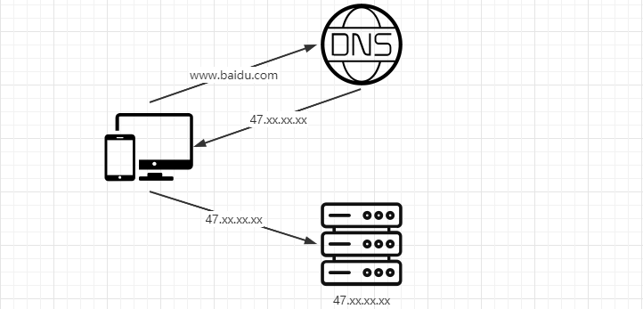

首先，用户访问一个域名，会经过 DNS 解析 `DNS(Domain Name System)`，它和 HTTP 协议一样是位于应用层的协议，主要提供域名到 IP 的解析服务。我们其实不用域名也可以访问目标主机的服务，但是 IP 本身不是那么容易记，所以使用域名进行替换使得用户更容易记住。

### 加速静态内容访问速度的 CDN 

在很多大型网站，会引入 CDN 来加速静态内容的访问， 这里简单给大家解释一下什么是 `CDN（Content Delivery Network）`，表示的是`内容分发网络`。CDN 其实就是一种网络缓存技术，能够把一些相对稳定的资源放到距离最终用户较近的地方，一方面可以节省整个广域网的带宽消耗，另外一方面可以提升用户的访问速度，改进用户体验。我们一般会把静态的文件（图片、脚本、静态页面）放到 CDN 中。 

如果引入了 CDN，那么解析的流程可能会稍微复杂一点。比如阿里云就提供了 cdn 的功能。

## 1.2 HTTP 协议通信原理 

域名被成功解析以后，客户端和服务端之间，是怎么建立连接并且如何通信的呢？ 说到通信，大家一定听过 tcp 和 udp 这两种通信协议，以及建立连接的握手过程。而 http 协议的通信是`基于 tcp/ip 协议之上的一个应用层协议`，应用层协议除了 http 还有哪些呢（FTP、 DNS、SMTP、Telnet 等）。 

涉及到网络协议，我们一定需要知道 `OSI 七层网络模型`和 `TCP/IP 四层概念模型`，OSI 七层网络模型包含（应用层、表示层、会话层、传输层、网络层、数据链路层、物理层）、TCP/IP 四层概念模型包含（应用层、传输层、网络层、数据链路层）。

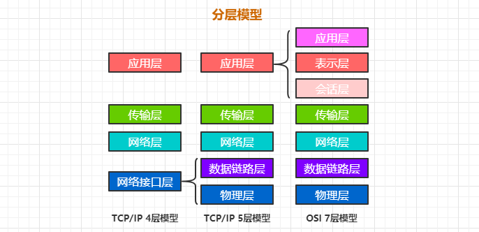

### 1.2.1 请求发起过程（tcp/ip 四层网络模型）

当应用程序用 TCP 传送数据时，数据被送入协议栈中，然后逐个通过每一层直到被当作一串比特流送入网络。其中每一层对收到的数据都要增加一些首部信息（有时还要增加尾部信息）。

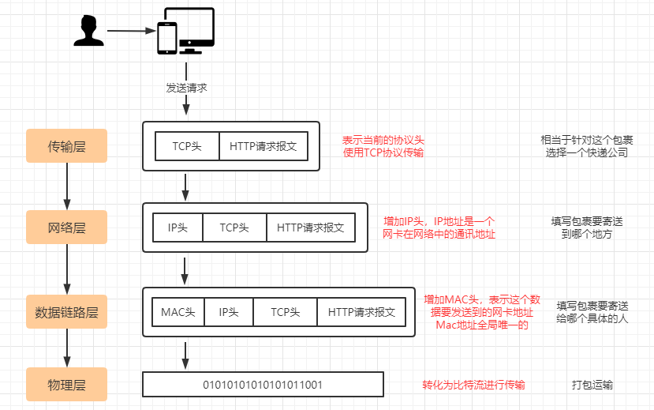

**客户端如何找到目标服务？**

在客户端发起请求的时候，我们会在数据链路层去组装目标机器的 MAC 地址，目标机器的 mac 地址怎么得到呢？ 

这里就涉及到一个 `ARP 协议`，这个协议简单来说就是已知目标机器的 ip，需要获得目标机器的 mac 地址。(发送一个广播消息，这个 ip 是谁的，请来认领。认领 ip 的机器会发送一个 mac 地址的响应)

有了这个目标 MAC 地址，数据包在链路上广播，MAC 的网卡才能发现，这个包是给它的。 MAC 的网卡把包收进来，然后打开 IP 包，发现 IP 地址也是自己的，再打开 TCP 包，发现端口是自己，也就是 80 端口，而这个时候这台机器上有一个 nginx 是监听 80 端口。 于是将请求提交给 nginx，nginx 返回一个网页。然后将网页需要发回请求的机器。然后层层封装，最后到 MAC 层。因为来的时候有源 MAC 地址，返回的时候，源 MAC 就变成了目标 MAC，再返给请求的机器。 

<font color=red>为了避免每次都用 ARP 请求，机器本地也会进行 ARP 缓存。当然机器会不断地上线下线， IP 也可能会变，所以 ARP 的 MAC 地址缓存过一段时间就会过期。</font>

### 1.2.2 接收端收到数据包以后的处理过程

<font color=red>当目的主机收到一个以太网数据帧时，数据就开始从协议栈中由底向上升，同时去掉各层协议加上的报文首部。每层协议都要去检查报文首部中的协议标识，以确定接收数据的上层协议。</font>

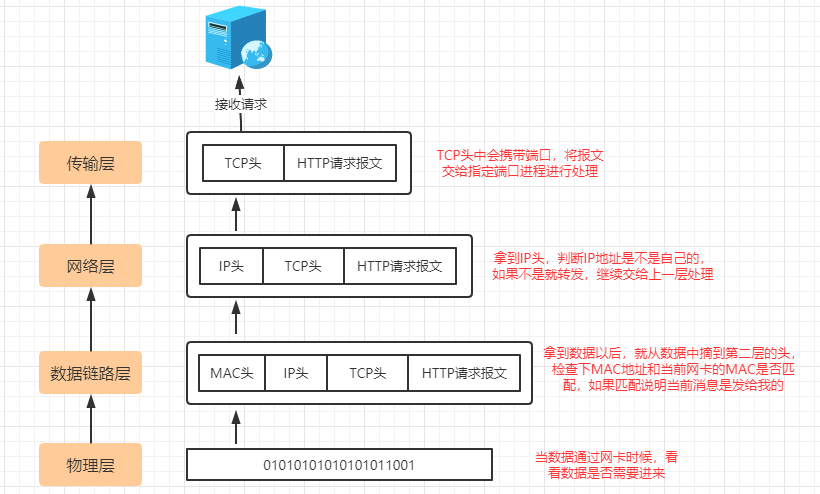

**为什么有了 MAC 层还要走 IP 层呢？**

之前我们提到，MAC 地址是唯一的，那理论上，在任何两个设备之间，我应该都可以通过 MAC 地址发送数据，为什么还需要 ip 地址？

MAC 地址就好像个人的身份证号，人的身份证号和人户口所在的城市，出生的日期有关， 但是和人所在的位置没有关系，人是会移动的，知道一个人的身份证号，并不能找到它这个人，MAC 地址类似，它是和设备的生产者，批次，日期之类的关联起来，知道一个设备的 MAC，并不能在网络中将数据发送给它，除非它和发送方的在同一个网络内。

所以要实现机器之间的通信，我们还需要有 ip 地址的概念，ip 地址表达的是当前机器在网络中的位置，类似于城市名+道路号+门牌号的概念。通过 ip 层的寻址，我们能知道按何种路径在全世界任意两台 Internet 上的的机器间传输数据。

## 1.3 TCP/IP 的分层管理

复杂的程序都需要分层，这个是软件设计的要求，每一层专注于当前领域的事情。如果某些地方需要修改，我们只需要把变动的层替换掉就行，一方面改动影响较少，另一方面整个架构的灵活性也更高。 最后，在分层之后， 整个架构的设计也变得相对简单了。

### 分层负载

了解了分层的概念以后，我们再去理解所谓的二层负载、三层负载、四层负载、七层负载就容易多了。 一次 http 请求过来，一定会从应用层到传输层，完成整个交互。只要是在网络上跑的数据包， 都是完整的。可以有下层没上层，绝对不可能有上层没下层。

### 二层负载

二层负载是针对 MAC，负载均衡服务器对外依然提供一个 VIP（虚 IP），集群中不同的机器 采用相同 IP 地址，但是机器的 MAC 地址不一样。当负载均衡服务器接受到请求之后，通过改写报文的目标 MAC 地址的方式将请求转发到目标机器实现负载均衡。

二层负载均衡会通过一个虚拟 MAC 地址接收请求，然后再分配到真实的 MAC 地址。

### 三层负载均衡

三层负载是针对 IP，和二层负载均衡类似，负载均衡服务器对外依然提供一个 VIP（虚 IP）， 但是集群中不同的机器采用不同的 IP 地址。当负载均衡服务器接受到请求之后，根据不同的负载均衡算法，通过 IP 将请求转发至不同的真实服务器。

三层负载均衡会通过一个虚拟 IP 地址接收请求，然后再分配到真实的 IP 地址。

### 四层负载均衡

四层负载均衡工作在 OSI 模型的传输层，由于在传输层，只有 TCP/UDP 协议，这两种协议中除了包含源 IP、目标 IP 以外，还包含源端口号及目的端口号。四层负载均衡服务器在接受到客户端请求后，以后通过修改数据包的地址信息（IP+端口号）将流量转发到应用服务器。 

四层通过虚拟 IP + 端口接收请求，然后再分配到真实的服务器。

### 七层负载均衡

七层负载均衡工作在 OSI 模型的应用层，应用层协议较多，常用 http、radius、dns 等。七层负载就可以基于这些协议来负载。这些应用层协议中会包含很多有意义的内容。比如同一个 Web 服务器的负载均衡，除了根据 IP 加端口进行负载外，还可根据七层的 URL、浏览器类别来决定是否要进行负载均衡。

七层通过虚拟的 URL 或主机名接收请求，然后再分配到真实的服务器。

# 2 TCP/IP 协议的深入分析

TCP 协议在两台电脑建立网络连接之前要先发数据包进行沟通，沟通后再建立连接，然后才是信息的传输。而 UDP 协议就类似于我们的校园广播，广播内容已经通过广播站播放出去了，你能不能听到，那就 与广播站无关了，正常情况下，不可能你说没注意听然后再让广播站再播放一次广播内容。 基于这些思路，我们先去了解下 TCP 里面关注比较多的握手协议。

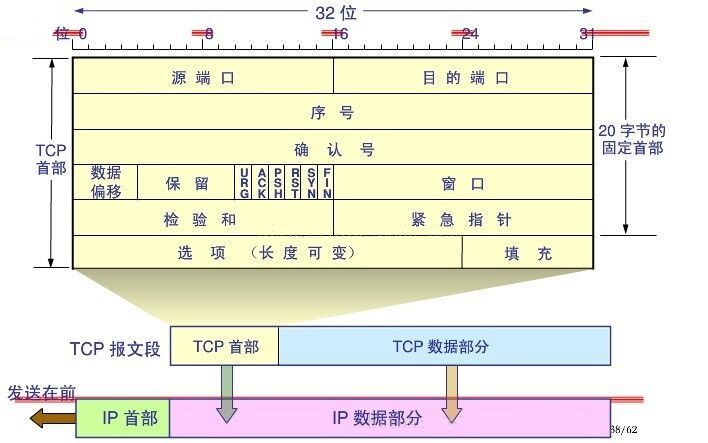


`序号seq` 占4个字节，用来标记数据段的顺序，TCP把连接中发送的所有数据字节都编上一个序号，第一个字节的编号由本地随机产生；给字节编上序号后，就给每一个报文段指派一个序号；序列号seq就是这个报文段中的第一个字节的数据编号。

`确认号ack` 占4个字节，期待收到对方下一个报文段的第一个数据字节的序号；序列号表示报文段携带数据的第一个字节的编号；而确认号指的是期望接收到下一个字节的编号；因此当前报文段最后一个字节的编号+1即为确认号。

`确认ACK` 占1位，仅当ACK=1时，确认号字段才有效。ACK=0时，确认号无效

`同步SYN` 连接建立时用于同步序号。当SYN=1，ACK=0时表示：这是一个连接请求报文段。若同意连接，则在响应报文段中使得SYN=1，ACK=1。因此，SYN=1表示这是一个连接请求，或连接接受报文。SYN这个标志位只有在TCP建产连接时才会被置1，握手完成后SYN标志位被置0。

`终止FIN` 用来释放一个连接。FIN=1表示：此报文段的发送方的数据已经发送完毕，并要求释放运输连接

> ACK、SYN 和 FIN 这些大写的单词表示标志位，其值要么是1，要么是0；
>
> ack、seq 小写的单词表示序号。

| 字段 | 含义                                                         |
| :--- | :----------------------------------------------------------- |
| URG  | 紧急指针是否有效。为1，表示某一位需要被优先处理              |
| ACK  | 确认号是否有效，一般置为1。                                  |
| PSH  | 提示接收端应用程序立即从TCP缓冲区把数据读走。                |
| RST  | 对方要求重新建立连接，复位。                                 |
| SYN  | 请求建立连接，并在其序列号的字段进行序列号的初始值设定。建立连接，设置为1 |
| FIN  | 希望断开连接。                                               |

## 2.1 TCP 握手协议

所以 TCP 消息的可靠性首先来自于有效的连接建立，所以在数据进行传输前，需要通过三次握手建立一个连接，所谓的三次握手，就是在建立 TCP 链接时，需要客户端和服务端总共发送 3 个包来确认连接的建立，在 socket 编程中，这个过程由客户端执行 connect 来触发。

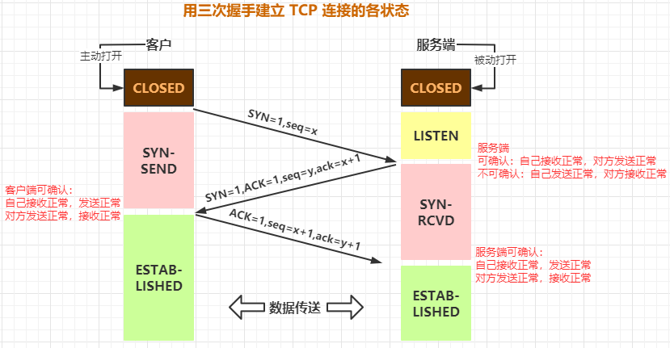

第一次握手(SYN=1, seq=x)客户端发送一个 TCP 的`同步序号 SYN` 标志位置 1 的包，指明客户端打算连接的服务器的端口，以及随机产生`初始化序号(Initialization sequence number) ISN` X，保存在包头的序列号 (Sequence Number)字段里。 发送完毕后，客户端进入 SYN_SEND 状态。

第二次握手(SYN=1, ACK=1, seq=y, Ack number=x+1)服务器发回确认包 (ACK) 应答 。 即 SYN 标志位和 ACK 标志位均为 1。服务器端选择自己 ISN 序列号，放到 Seq 域里，同时将确认序号 (Acknowledgement Number)设置为客户的 ISN 加 1， 即 X+1。 发送完毕后，服务器端进入 SYN_RCVD 状态。

第三次握手 (ACK=1，Ack number=y+1) 客户端再次发送确认包(ACK)，SYN 标志位为 0，ACK 标志位为 1，并且把服务器发来 Ack 的序号字段+1，放在确定字段中发送给对方，并且在数据段放写 ISN 发完毕后 ， 客户端进入 ESTABLISHED 状 态，当服务器端接收到这个包时，也进入 ESTABLISHED 状态，TCP 握手结束。

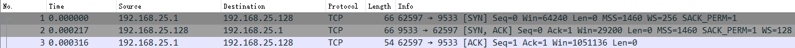

那 TCP 在三次握手的时候，IP 层和 MAC 层在做什么呢？

当然是 TCP 发送每一个消息， 都会带着 IP 层和 MAC 层了。因为，TCP 每发送一个消息，IP 层和 MAC 层的所有机制都要运行一遍。而你只看到 TCP 三次握手了，其实，IP 层和 MAC 层为此也忙活好久了。

**为什么TCP是三次握手而不是两次？**

三次握手完成了两个重要的功能：
①确认双方都知道彼此已经做好了发送数据的准备工作。
②允许双方就初始序列号seq进行协商，这个序列号在握手过程中被发送和确认。

如果不是三次握手而是两次，死锁是可能发生的。假设客户端给服务端发送一个连接请求报文，服务端成功接收并给客户端发送了确认应答报文，**此时服务端并不能确认该应答报文是否成功到达了客户端**，但因为两次握手的协定，服务端此时已经处于成功建立连接的状态（ESTABLISHED），并给客户端发送数据报文。但如果客户端并未收到服务端的应答报文，则不知道服务器是否准备好建立连接，也不知道服务器建立什么样的序列号，甚至不知道自己发送给服务端的报文是否成功抵达，此时客户端会认为连接并未成功建立，会忽略服务端发送过来的任何数据报文，只进行等待服务端的确认应答报文。而服务端在发出的数据报文未得到响应超时后，会重复发送同样的数据报文，这样就形成了死锁。

### SYN 攻击 

## 2.2 TCP 四次挥手协议

四次挥手表示 TCP 断开连接的时候,需要客户端和服务端总共发送 4 个包以确认连接的断开； 客户端或服务器均可主动发起挥手动作(因为 TCP 是一个全双工协议)，在 socket 编程中， 任何一方执行 close() 操作即可产生挥手操作。

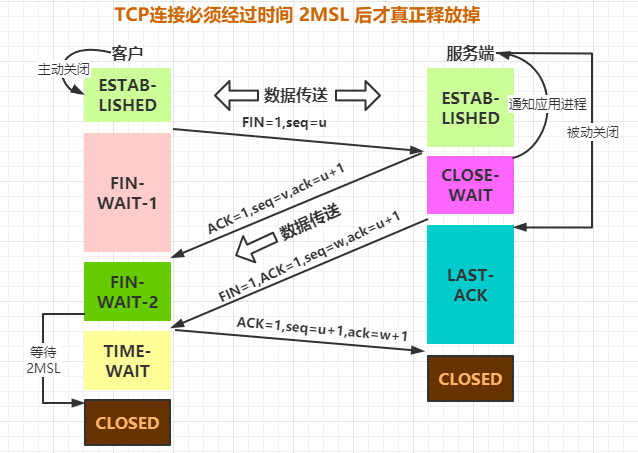

单工：数据传输只支持数据在一个方 向上传输 

半双工：数据传输允许数据在两个方 向上传输，但是在某一时刻，只允许 在一个方向上传输，实际上有点像切 换方向的单工通信 

全双工：数据通信允许数据同时在两 个方向上传输，因此全双工是两个单 工通信方式的结合，它要求发送设备 和接收设备都有独立的接收和发送 能力

第一次挥手(FIN=1，seq=x) 

假设客户端想要关闭连接，客户端发送一个 FIN 标志位置为 1 的包，表示自己已经没有数据可以发送了，但是仍然可以接受数据。发送完毕后，客户端进入 FIN_WAIT_1 状态。 

第二次挥手(ACK=1，Ack number=x+1) 

服务器端确认客户端的 FIN 包，发送一个确认包，表明自己接受到了客户端关闭连接的请求， 但还没有准备好关闭连接。发送完毕后，服务器端进入 CLOSE_WAIT 状态，客户端接收到这 个确认包之后，进入 FIN_WAIT_2 状态，等待服务器端关闭连接。 

第三次挥手(FIN=1，seq=w) 

服务器端准备好关闭连接时，向客户端发送结束连接请求，FIN 置为 1。发送完毕后，服务器端进入 LAST_ACK 状态，等待来自客户端的最后一个 ACK。 

第四次挥手(ACK=1，Ack number=w+1) 

客户端接收到来自服务器端的关闭请求，发送一个确认包，并进入 TIME_WAIT 状态，等待可能出现的要求重传的 ACK 包。 服务器端接收到这个确认包之后，关闭连接，进入 CLOSED 状态。 客户端等待了某个固定时间（两个最大段生命周期，2MSL，2 Maximum Segment Lifetime） 之后，没有收到服务器端的 ACK，认为服务器端已经正常关闭连接，于是自己也关闭连接， 进入 CLOSED 状态。


假设 Client 端发起中断连接请求，也就是发送 FIN 报文。

Server 端接到 FIN 报文后，意思是说 "<font color=blue>我 Client 端没有数据要发给你了，但是如果你还有数据没有发送完成，则不必急着关闭 Socket，可以继续发送数据。</font>"

所以你先发送 ACK，告诉 Client 端 "<font color=blue>你的请求我收到了，但是我还没准备好，请继续你等我的消息。</font>"

这个时候 Client 端就进入 FIN_WAIT 状态，继续等待 Server 端的 FIN 报文。

当 Server 端确定数据已发送完成，则向 Client 端发送 FIN 报文，告诉 Client 端 "<font color=blue>好了，我这边数据发完了，准备好关闭连接了。</font>"

Client 端收到 FIN 报文后，就知道可以关闭连接了，但是他还是不相信网络，怕 Server 端不知道要关闭，所以发送 ACK 后进入 TIME_WAIT 状态，如果 Server 端没有收到 ACK 则可以重传。Server 端收到 ACK 后， 就知道可以断开连接了。Client 端等待了 2MSL 后依然没有收到回复，则证明 Server 端已正常关闭，那好，我 Client 端也可以关闭连接了。Ok，TCP 连接就这样关闭了！

【问题 1】为什么连接的时候是三次握手，关闭的时候却是四次握手？ 

三次握手是因为因为当 Server 端收到 Client 端的 SYN 连接请求报文后，可以直接发送 SYN+ACK 报文。其中 ACK 报文是用来应答的，SYN 报文是用来同步的。但是关闭连接时， 当 Server 端收到 FIN 报文时，很可能并不会立即关闭 SOCKET（因为可能还有消息没处理 完），所以只能先回复一个 ACK 报文，告诉 Client 端 "<font color=blue>你发的 FIN 报文我收到了。</font>"只有等到我 Server 端所有的报文都发送完了，我才能发送 FIN 报文，因此不能一起发送。故需要四步挥手。 

【问题 2】为什么 TIME_WAIT 状态需要经过 2MSL(最大报文段生存时间)才能返回到 CLOSE 状态？ 

虽然按道理，四个报文都发送完毕，我们可以直接进入 CLOSE 状态了，但是我们必须假想网络是不可靠的，有可能最后一个 ACK 丢失。所以 TIME_WAIT 状态就是用来重发可能丢失的 ACK 报文。

【问题3】如果已经建立了连接，但是客户端突然出现故障了怎么办？

TCP还设有一个保活计时器，显然，客户端如果出现故障，服务器不能一直等下去，白白浪费资源。服务器每收到一次客户端的请求后都会重新复位这个计时器，时间通常是设置为2小时，若两小时还没有收到客户端的任何数据，服务器就会发送一个探测报文段，以后每隔75秒钟发送一次。若一连发送10个探测报文仍然没反应，服务器就认为客户端出了故障，接着就关闭连接。

# 3 使用协议进行通信

TCP、UDP 都是在基于 Socket 概念上为某类应用场景而扩展出的传输协议，那么什么是 socket 呢？

socket 是一种抽象层，应用程序通过它来发送和接收数据，就像应用程序打开一个文件句柄，把数据读写到磁盘上一样。使用 socket 可以把应用程序添加到网络中，并与处于同一个网络中的其他应用程序进行通信。不同类型的 Socket 与不同类型的底层协议簇有关联。主要的 socket 类型为流套接字（stream socket）和数据报文套接字（datagram socket）。 stream socket 把 TCP 作为端对端协议（底层使用 IP 协议），提供一个可信赖的字节流服务。数据报文套接字 （datagram socket）使用 UDP 协议（底层同样使用 IP 协议）提供了一种“尽力而为”的数据报文服务。

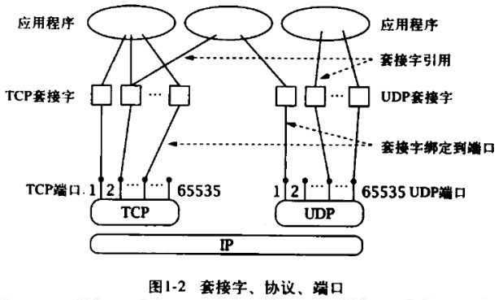

## 3.1 基于 TCP 协议实现通信

```java
ServerSocket serverSocket = null;
BufferedReader in = null;
try {
    // TCP 的服务端要先监听一个端口，一般是先调用 bind 函数，给这个 Socket 赋予一个 IP 地址和端口。
    // 为什么需要端口呢？
    // 要知道，你写的是一个应用程序，当一个网络包来的时候，内核要通过 TCP 头里面的这个端口，来找到你这个应用程序，把包给你。
    // 为什么要 IP 地址呢？
    // 有时候，一台机器会有多个网卡，也就会有多个 IP 地址，你可以选择监听所有的网卡，也可以选择监听一个网卡，这样，只有发给这个网卡的包，才会给你。
    serverSocket = new ServerSocket(8888);
    //阻塞等待客户端连接接下来，服务端调用 accept 函数，拿出一个已经完成的连接进行处理。如果还没有完成，就要等着。
    Socket socket = serverSocket.accept();
    // 连接建立成功之后，双方开始通过 read 和 write 函数来读写数据，就像往一个文件流里面写东西一样
    in = new BufferedReader(new InputStreamReader(socket.getInputStream()));
    System.out.println(in.readLine());
} catch (Exception e) {
    e.printStackTrace();
} finally {
    //close
	......
}
```

```java
Socket socket = null;
PrintWriter out = null;
try {
    socket = new Socket("127.0.0.1", 8888);
    out = new PrintWriter(socket.getOutputStream(), true);
    out.println("Hello, 晓晓");
} catch (Exception e) {
    e.printStackTrace();
} finally {
    //close
	......
}
```

## 3.2 基于 TCP 实现双向通信对话功能

TCP 是一个全双工协议，数据通信允许数据同时在两个方向上传输，因此全双工是两个单工通信方式的结合，它要求发送设备和接收设备都有独立的接收和发送能力。

```java
try {
    // 创建一个 ServerSocket 监听客户请求
    ServerSocket server = new ServerSocket(8888);
    Socket socket = null;
    try {
        // 使用 accept()阻塞等待客户请求
        socket = server.accept();
    } catch (Exception e) {
        System.out.println("Error. " + e);
    }
    // 由Socket对象得到输入流，并构造相应的BufferedReader对象
    BufferedReader is = new BufferedReader(new InputStreamReader(socket.getInputStream()));
    new Thread(() -> {
        try {
            // 从标准输入读入一字符串，如果该字符串为 bye，则停止循环
            String line;
            while (!(line = is.readLine()).equals("bye")) {
                System.out.println("Client: " + line);
            }
            System.out.println("Client 断开连接");
        } catch (Exception e) {
            e.printStackTrace();
        }
    }).start();
    // 由Socket对象得到输出流，并构造PrintWriter对象
    PrintWriter os = new PrintWriter(socket.getOutputStream());
    // 由系统标准输入设备构造BufferedReader对象
    BufferedReader sin = new BufferedReader(new InputStreamReader(System.in));
    String outLine;
    while (!(outLine = sin.readLine()).equals("bye")) {
        // 向客户端输出该字符串
        os.println(outLine);
        // 刷新输出流，使Client马上收到该字符串
        os.flush();
    }
    System.out.println("服务断开");
    os.close();
    is.close();
    socket.close();
    server.close();
} catch (Exception e) {
    System.out.println("Error. " + e);
}
```

```java
try {
    Socket socket = new Socket("127.0.0.1", 8888);
    BufferedReader is = new BufferedReader(new InputStreamReader(socket.getInputStream()));
    PrintWriter os = new PrintWriter(socket.getOutputStream());
    new Thread(() -> {
        try {
            String line;
            while (!(line = is.readLine()).equals("bye")) {
                System.out.println("Server: " + line);
            }
        } catch (Exception e) {
            System.out.println("Error. " + e);
        }
    }).start();
    BufferedReader sin = new BufferedReader(new InputStreamReader(System.in));
    String outLine;
    while (!(outLine = sin.readLine()).equals("bye")) {
        os.println(outLine);
        os.flush();
    }
    os.println(outLine);
    os.flush();
    os.close();
    is.close();
    socket.close();
} catch (IOException e) {
    System.out.println("Error. " + e);
}
```

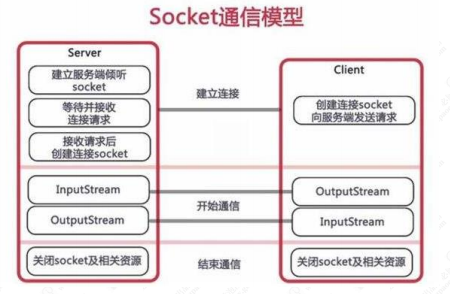

# 4 理解 TCP 的通信原理及 IO 阻塞

通过上面这个简单的案例，基本清楚了在 Java 应用程序中如何使用 socket 套接字来建立一 个基于 tcp 协议的通信流程。接下来，我们在来了解一下 tcp 的底层通信过程是什么样的。

## 4.1 了解 TCP 协议的通信过程

首先，对于 TCP 通信来说，每个 TCP Socket 的内核中都有一个发送缓冲区和一个接收缓冲区，TCP 的全双工的工作模式及 TCP 的滑动窗口就是依赖于这两个独立的 Buffer 和该 Buffer 的填充状态。

接收缓冲区把数据缓存到内核，若应用进程一直没有调用 Socket 的 read 方法进行读取，那么该数据会一直被缓存在接收缓冲区内。不管进程是否读取 Socket，对端发来的数据都会经过内核接收并缓存到 Socket 的内核接收缓冲区。

read 所要做的工作，就是把内核接收缓冲区中的数据复制到应用层用户的 Buffer 里。 进程调用 Socket 的 send 发送数据的时候，一般情况下是将数据从应用层用户的 Buffer 里复制到 Socket 的内核发送缓冲区，然后 send 就会在上层返回。换句话说，send 返回时，数据不一定会被发送到对端。

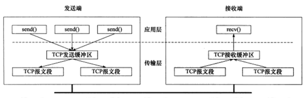

前面我们提到，Socket 的接收缓冲区被 TCP 用来缓存网络上收到的数据，一直保存到应用进程读走为止。如果应用进程一直没有读取，那么 Buffer 满了以后，出现的情况是：通知对端 TCP 协议中的窗口关闭，保证 TCP 接收缓冲区不会移除，保证了 TCP 是可靠传输的。如果对方无视窗口大小发出了超过窗口大小的数据，那么接收方会把这些数据丢弃。

## 4.2 滑动窗口协议

这个过程中涉及到了 TCP 的滑动窗口协议，`滑动窗口（Sliding window）`是一种流量控制技术。早期的网络通信中，通信双方不会考虑网络的拥挤情况直接发送数据。由于大家不知道网络拥塞状况，同时发送数据，导致中间节点阻塞掉包，谁也发不了数据，所以就有了滑动窗口机制来解决此问题；发送和接受方都会维护一个数据帧的序列，这个序列被称作窗口。

**发送窗口**

就是发送端允许连续发送的幀的序号表。

发送端可以不等待应答而连续发送的最大幀数称为发送窗口的尺寸。 

**接收窗口**

接收方允许接收的幀的序号表，凡落在接收窗口内的幀，接收方都必须处理，落在接收窗口外的幀被丢弃。

接收方每次允许接收的幀数称为接收窗口的尺寸。

**在线滑动窗口演示功能**

https://media.pearsoncmg.com/aw/ecs_kurose_compnetwork_7/cw/content/interactiveanimations/selective-repeat-protocol/index.html

## 4.3 理解阻塞到底是什么回事

了解了基本通信原理以后，我们再来思考一个问题，在前面的代码演示中，我们通过 socket.accept() 去接收一个客户端请求，accept 是一个阻塞的方法，意味着 TCP 服务器一次只能处理一个客户端请求，当一个客户端向一个已经被其他客户端占用的服务器发送连接请求时，虽然在连接建立后可以向服务端发送数据，但是在服务端处理完之前的请求之前，却不会对新的客户端做出响应，这种类型的服务器称为“迭代服务器”。迭代服务器是按照顺序处理客户端请求，也就是服务端必须要处理完前一个请求才能对下一个客户端的请求进行响应。 但是在实际应用中，我们不能接收这样的处理方式。所以我们需要一种方法可以独立处理每一个连接，并且他们之间不会相互干扰。而 Java 提供的多线程技术刚好满足这个需求，这个机制使得服务器能够方便处理多个客户端的请求。

### 4.3.1 一个客户端对应一个线程

为每个客户端创建一个线程实际上会存在一些弊端，因为创建一个线程需要占用 CPU 的资源和内存资源。另外，随着线程数增加，系统资源将会成为瓶颈最终达到一个不可控的状态，所以我们还可以通过线程池来实现多个客户端请求的功能，因为线程池是可控的。

PS: 即为阻塞 I/O 通信模型(阻塞只能异步)

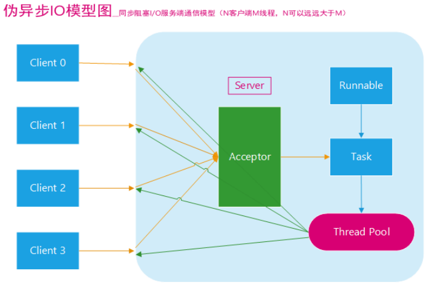

### 4.3.2 非阻塞模型

上面这种模型虽然优化了 IO 的处理方式，但是，不管是线程池还是单个线程，线程本身的处理个数是有限制的，对于操作系统来说，如果线程数太多会造成 CPU 上下文切换的开销。因此这种方式不能解决根本问题。

所以在 Java1.4 以后，引入了 NIO（New IO）的功能，不直接来解释 NIO 的原理，会基于 BIO 到 NIO 的过程来带着思考。

#### 阻塞 IO

前面其实已经简单讲过了阻塞 IO 的原理，就是当客户端的数据从网卡缓冲区复制到内核缓冲区之前，服务端会一直阻塞。以socket接口为例， 进程空间中调用 recvfrom，进程从调用 recvfrom 开始到它返回的整段时间内都是被阻塞的， 因此被成为阻塞 IO 模型。

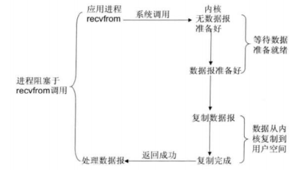

#### 非阻塞 IO

那大家思考一个问题，如果我们希望这台服务器能够处理更多的连接，怎么去优化呢？

我们第一时间想到的应该是如何保证这个阻塞变成非阻塞吧。所以就引入了非阻塞 IO 模型， 非阻塞 IO 模型的原理很简单，就是进程空间调用 recvfrom，如果这个时候内核缓冲区没有数据的话，就直接返回一个 EWOULDBLOCK 错误，然后应用程序通过不断轮询来检查这个状态状态，看内核是不是有数据过来。

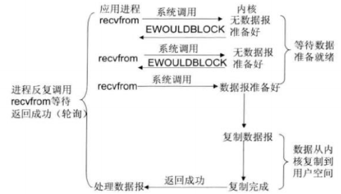

#### I/O 复用模型 

我们前面讲的非阻塞仍然需要进程不断的轮询重试。能不能实现当数据可读了以后给程序一个通知呢？

所以这里引入了一个 IO 多路复用模型，I/O 多路复用的本质是通过一种机制（系统内核缓冲 I/O 数据），让单个进程可以监视多个文件描述符，一旦某个描述符就绪（一般是读就绪或写就绪），能够通知程序进行相应的读写操作。

> 什么是 fd：在 linux 中，内核把所有的外部设备都当成是一个文件来操作，对一个文件的读写会调用内核提供的系统命令，返回一个 fd(文件描述符)。而对于一个 socket 的读写也会有相应的文件描述符，成为 socketfd

常见的 IO 多路复用方式有【select、poll、epoll】，都是 Linux API 提供的 IO 复用方式。

select：进程可以通过把一个或者多个 fd 传递给 select 系统调用，进程会阻塞在 select 操作上，这样 select 可以帮我们检测多个 fd 是否处于就绪状态。 这个模式有两个缺点：

1. 由于他能够同时监听多个文件描述符，假如说有 1000 个，这个时候如果其中一个 fd 处于就绪状态了，那么当前进程需要线性轮询所有的 fd，也就是监听的 fd 越多，性能开销越大。 
2. 同时，select 在单个进程中能打开的 fd 是有限制的，默认是 1024，对于那些需要支持单机上万的 TCP 连接来说确实有点少 

epoll：linux 还提供了 epoll 的系统调用，epoll 是基于事件驱动方式来代替顺序扫描，因此性能相对来说更高，主要原理是，当被监听的 fd 中，有 fd 就绪时，会告知当前进程具体哪一个 fd 就绪，那么当前进程只需要去从指定的 fd 上读取数据即可。

另外，epoll 所能支持的 fd 上线是操作系统的最大文件句柄，这个数字要远远大于 1024。

> 由于 epoll 能够通过事件告知应用进程哪个 fd 是可读的，所以我们也称这种 IO 为异步非阻塞 IO，当然它是伪异步的，因为它还需要去把数据从内核同步复制到用户空间中，真正的异步非阻塞，应该是数据已经完全准备好了，我只需要从用户空间读就行。

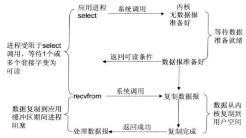

#### 多路复用的好处

I/O 多路复用可以通过把多个 I/O 的阻塞复用到同一个 select 的阻塞上，从而使得系统在单线程的情况下可以同时处理多个客户端请求。它的最大优势是系统开销小，并且不需要创建新的进程或者线程，降低了系统的资源开销。

关于异步 IO 这块，后续在 netty 中还会讲到 IO 的内容。

#### 一台机器理论能支持的连接数

首先，在确定最大连接数之前，大家先跟我来先了解一下系统如何标识一个 tcp 连接。系统用一个四元组来唯一标识一个 TCP 连接： (source_ip, source_port, destination_ip, destination_port)，即(源 IP，源端口，目的 IP，目的端口)四个元素的组合。只要四个元素的组合中有一个元素不一样，那就可以区别不同的连接。

比如： 你的 IP 地址是 11.1.2.3, 在 8080 端口监听

那么当一个来自 22.4.5.6 ，端口为 5555 的连接到达后，那么建立的这条连接的四元组为 : (11.1.2.3, 8080, 22.4.5.6, 5555) 

这时，假设上面的那个客户（22.4.5.6）发来第二条连接请求，端口为 6666，那么，新连接 的四元组为(11.1.2.3, 8080, 22.4.5.6, 5555) 

那么，你主机的 8080 端口建立了两条连接； 

通常来说，服务端是固定一个监听端口，比如 8080，等待客户端的连接请求。在不考虑地址重用的情况下，及时 server 端有多个 ip，但是本地监听的端口是独立的。所以对于 tcp 连接 的4元组中，如果 destination_ip 和 destination_port 不变。那么只有 source_ip 和 source_port 是可变的，因此最大的 tcp 连接数应该为 客户端的 ip 数乘以客户端的端口数。在 IPV4 中， 不考虑 ip 分类等因素，最大的 ip 数为 2 的 32 次方；客户端最大的端口数为 2 的 16 次方， 也就是 65536。

也就是服务端单机最大的 tcp 连接数约为 2 的 48 次方。 

当然，这只是一个理论值，以 linux 服务器为例，实际的连接数还取决于

1. 内存大小（因为每个 TCP 连接都要占用一定的内存）、 

2. 文件句柄限制，每一个 tcp 连接都需要占一个文件描述符，一旦这个文件描述符使用完了， 新来的连接会返回一个“Can’t open so many files”的异常。如果大家知道对于操作系统最 大可以打开的文件数限制，就知道怎么去调整这个限制 

   a) 可以执行【ulimit -n】得到当前一个进程最大能打开 1024 个文件，所以你要采用此默 认配置最多也就可以并发上千个 TCP 连接。 

   b) 可以通过【vim /etc/security/limits.conf】去修改系统最大文件打开数的限制 * soft nofile 2048 * hard nofile 2048 * 表示修改所有用户限制、soft/hard 表示软限制还是硬限制，2048 表示修改以后的值 

   c) 可以通过【cat /proc/sys/fs/file-max】查看 linux 系统级最大打开文件数限制，表示当 前这个服务器最多能同时打开多少个文件 

   当然，这块还有其他很多的优化的点，这里不是这节课的目标

3.  带宽资源的限制

------

