# 1 认识 MySQL

1985年，瑞典的几位志同道合小伙子(以 David Axmark 为首)成立了一 家公司，这就是 MySQL AB 的前身。这个公司最初并不是为了开发数据库产品，而是在实现他们想法的过程中，需要一个数据库。他们希望能够使用开源的产品。但在当时并没一个合适的选择，没办法，那就自己开发吧。

# 2 MySQL 下载安装

下载地址：https://dev.mysql.com/ »  [MySQL Downloads](https://dev.mysql.com/downloads/) » [MySQL Community Server](https://dev.mysql.com/downloads/mysql/)

选择合适的MySQL版本，操作系统以及操作系统版本，下载，这里以 [rpm-bundle](https://cdn.mysql.com/archives/mysql-5.5/MySQL-5.5.62-1.el7.x86_64.rpm-bundle.tar) 为例。

下载得到 MySQL-5.5.62-1.el7.x86_64.rpm-bundle.tar

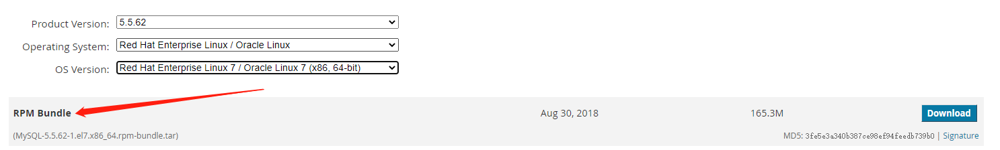

## 2.1 MySQL 安装流程

```markdown
# 1.将 tar 文件上传至 Linux 服务器 /usr/local/mysql 下
# 2.检查是否已经存在mysql，若存在卸载，避免安装时产生一些错误
	rpm -qa | grep -i mysql

# 3.解压缩安装包
	tar -xvf  MySQL-5.5.62-1.el7.x86_64.rpm-bundle.tar 
	得到文件：
		MySQL-devel-5.5.62-1.el7.x86_64.rpm
		MySQL-embedded-5.5.62-1.el7.x86_64.rpm
		MySQL-shared-5.5.62-1.el7.x86_64.rpm
		MySQL-test-5.5.62-1.el7.x86_64.rpm
		MySQL-server-5.5.62-1.el7.x86_64.rpm
		MySQL-shared-compat-5.5.62-1.el7.x86_64.rpm
		MySQL-client-5.5.62-1.el7.x86_64.rpm
# 4.安装mysql
	rpm -ivh MySQL-server-5.5.62-1.el7.x86_64.rpm
	错误1：
		警告：MySQL-server-5.5.62-1.el7.x86_64.rpm: 头V3 DSA/SHA1 Signature, 密钥 ID 5072e1f5: NOKEY
		错误：依赖检测失败：
			net-tools 被 MySQL-server-5.5.62-1.el7.x86_64 需要
			perl(Data::Dumper) 被 MySQL-server-5.5.62-1.el7.x86_64 需要
		解决方法：
		yum -y install net-tools
		yum -y install perl
		yum -y install autoconf
	错误2：
		file /usr/share/mysql/charsets/README from install of MySQL-server-5.5.62-1.el7.x86_64 conflicts with file from package mariadb-libs-1:5.5.64-1.el7.x86_64
		此报错是说mysql安装包与mariadb包冲突，那么那么只要删除mariadb包即可。
		解决方法：
		rpm -qa|grep -i mariadb
			mariadb-libs-5.5.64-1.el7.x86_64
		yum remove mariadb-libs-5.5.64-1.el7.x86_64

# 5.启动 MySQL
	service mysqld start
	# systemctl start mysqld.service

# 6.设置帐号密码
	mysqladmin -u root password root
    mysql
		ERROR 1045 (28000): Access denied for user 'root'@'localhost' (using password: NO)
	# 5.7 版本中需要去日志文件查看初始密码
		grep "password" /var/log/mysqld.log

# 7.连接数据库
	 mysql -u root -p
	 # 输入初始密码后，此时不能做任何事情，因为MySQL默认必须修改密码之后才能操作数据库
		ALTER USER 'root'@'localhost' IDENTIFIED BY 'new password';
	 # 其中‘new password’替换成你要设置的密码，注意:密码设置必须要大小写字母数字和特殊符号（,/';:等）,不然不能配置成功

# 8.授权远程连接
	use mysql;
	# 下面语句可能会报错，不用关心
	update user set host = '%' where user = 'root';
	# 刷新权限
	FLUSH PRIVILEGES;

# 9.设置开机自启动mysql
	# 查看系统centos的开机启动项目，主要针对centos6 chkconfig查看
	chkconfig mysqld on
	chkconfig --list|grep mysql
		mysql          	0:关	1:关	2:开	3:开	4:开	5:开	6:关
	# centos7系统，是systemctl来管理服务。可以通过systemctl enable mysqld来设置 mysql开机启动自动
	systemctl enable mysqld
	systemctl list-unit-files | grep mysqld
```

日志文件中的初始密码：

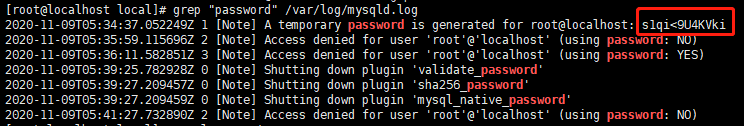

## 2.2 MySQL 安装完成相关命令

```markdown
# 查看Mysql安装时创建的mysql用户和mysql组
	cat /etc/passwd | grep mysql
		mysql:x:996:993:MySQL server:/var/lib/mysql:/bin/bash
	cat /etc/group | grep mysql
		mysql:x:993:

# 查看 MySQL 版本
	mysqladmin --version
		mysqladmin  Ver 8.42 Distrib 5.5.62, for Linux on x86_64

# MySQL 服务启停
	service mysqld start
	service mysqld stop
	
# 查看 MySQL 状态
	service mysqld status

# 连接数据库
	mysql -u root -p

# Mysql的安装位置
	ps -ef | grep mysql
		root       2928      1  0 13:51 ?        00:00:00 /bin/sh /usr/bin/mysqld_safe --datadir=/var/lib/mysql --pid-file=/var/lib/mysql/localhost.localdomain.pid
	mysql      3014   2928  0 13:51 ?        00:00:00 /usr/sbin/mysqld --basedir=/usr --datadir=/var/lib/mysql --plugin-dir=/usr/lib64/mysql/plugin --user=mysql --log-error=localhost.localdomain.err --pid-file=/var/lib/mysql/localhost.localdomain.pid
	
# 导出数据sql
	mysqldump -u root -p '数据库名' >abc.sql

# 导入数据sql
	mysql -u root -p '数据库名' <abc.sql
```

## 2.3 修改字符集和数据存储路径

```mysql
# 查看当前字符集
show variables like '%char%';
```

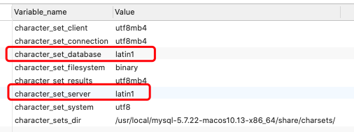

数据库和服务端的字符集默认都是latin1，中文会乱码。

```markdown
# Linux 自定义配置文件 5.5版本 /usr/share/mysql/my-huge.cnf 之后版本 /usr/share/mysql/my-default.cnf
# 复制 配置文件到 /etc/my.cnf
	cp /usr/share/mysql/my-huge.cnf /etc/my.cnf
# 重启mysql
	service mysqld stop
	service mysqld start

[client]
default-character-set=utf8

[mysqld]
character_set_server=utf8
#character_set_client=utf8
collation-server=utf8_general_ci
# (注意linux下mysql安装完默认：表名区分大小写，列名不区分大小写；0:区分大小写，1:不区分大小写)
lower_case_table_names=1
# (设置最大连接数，默认为151，mysql服务器允许最大连接数16384)
max_connections=1000
# 二进制日志配置 log-bin=''
# 错误日志配置 log-err=''

[mysql]
default-character-set=utf8

# 修改之后新建的数据库才会应用新的字符集配置
```

## 2.4 主要配置文件

``二进制日志log-bin`` 主从复制

``错误日志log-error`` 默认是关闭的,记录严重的警告和错误信息,每次启动和关闭的详细信息等

``查询日志log`` 默认关闭,记录查询的sql语句，如果开启会减低mysql的整体性能，因为记录日志也是需要消耗系统资源的

### 数据文件

两系统：

windows C:\ProgramFiles\MySQL\MySQLServer5.5\data

linux /var/lib/mysql

``frm文件`` 存放表结构

``myd文件`` 存放表数据

``myi文件`` 存放表索引

# 3 MySQL 逻辑架构

和其他数据库相比，MySQL架构可以在多种不同场景中应用并发挥良好作用。主要体现在存储引擎的架构上，``插件式的存储引擎架构将查询处理和其他的系统任务以及数据的存储提取相分离``。这种架构可以根据业务的需求和实际需要选择合适的存储引擎。

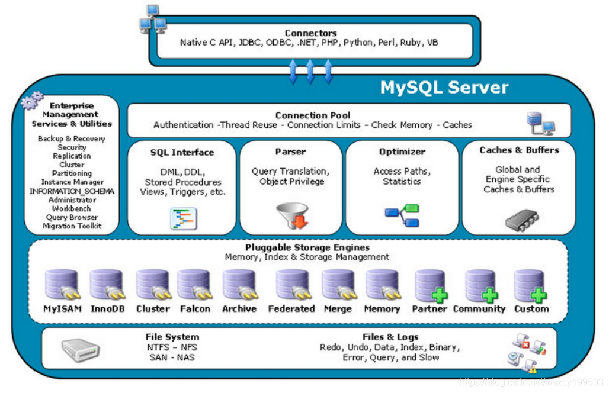  

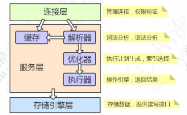

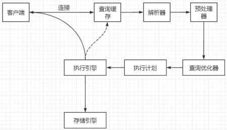

## 3.1 连接层

最上层是一些客户端和连接服务，包含`Unix Socket 通信协议`(在 Linux 服务器上，如果没有指定 `-h 参数`，它就用 socket 方式登录，如果指定 -h 参数，就会用TCP/IP 协议)和大多数基于客户端/服务端实现的类似于 `tcp/ip 的通信协议`。主要完成一些类似于连接处理、授权认证及相关的安全方案。在该层上引入了线程池的概念，为通过认证安全接入的客户端提供线程。同样在该层上可以实现基于SSL的安全链接。服务器也会为安全接入的每个客户端验证它所有的操作权限。

``Connectors`` 指的是不同语言中与SQL的交互

``Management Serveices & Utilities`` 系统管理和控制工具，包括备份恢复、MySQL 复制、集群等等

``Connection Pool 连接池`` 管理缓冲用户连接，线程处理等需要缓存的需求

负责监听对 MySQL Server 的各种请求，接收连接请求，转发所有连接请求到线程管理模块。每一个连接上 MySQL Server 的客户端请求都会被分配（或创建）一个连接线程为其单独服务。而连接线程的主要工作就是负责 MySQL Server 与客户端的通信，接受客户端的命令请求，传递 Server 端的结果信息等。线程管理模块则负责管理维护这些连接线程。包括线程的创建，线程的 cache 等。

> MySQL 是支持多种通信协议的，可以使用`同步`(受限于被调用方的性能，应用操作数据库线程会阻塞)/`异步`(避免数据混乱，一个连接就会创建一个线程，线程间切换会占用大量 CPU 资源，并不能节省服务端执行 SQL 的时间)的`通信类型`，支持`长连接`(连接可以保持打开，减少服务端创建和释放连接的消耗)/`短连接`(操作完毕以后，马上 close 掉)的`连接方式`。
>
> 如果要异步长连接，必须使用连接池，排队从连接池获取连接而不是创建新连接。

```markdown
# 保持长连接会消耗内存。长时间不活动的连接，MySQL 服务器会断开
# 非交互式超时时间，如 JDBC 程序
	show global variables like 'wait_timeout';
# 交互式超时时间，如数据库工具
	show global variables like 'interactive_timeout';
# 默认都是 28800 秒，8 小时

# 查看 MySQL 当前有多少个连接
	show global status like 'Thread%';
		Threads_cached：缓存中的线程连接数
		Threads_connected：当前打开的连接数
		Threads_created：为处理连接创建的线程数
		Threads_running：非睡眠状态的连接数，通常指并发连接数
# 查看当前连接的状态
	SHOW PROCESSLIST;
		一些常见的状态：
		Sleep 线程正在等待客户端，以向它发送一个新语句
		Query 线程正在执行查询或往客户端发送数据
		Locked 该查询被其它查询锁定
		Copying to tmptable on disk 临时结果集合大于 tmp_table_size。线程把临时表从存储器内部格式改变为磁盘模式，以节约存储器
		Sending data 线程正在为 SELECT 语句处理行，同时正在向客户端发送数据
		Sorting for group 线程正在进行分类，以满足 GROUP BY 要求
		Sorting for order 线程正在进行分类，以满足 ORDER BY 要求

# MySQL 服务允许的最大连接数，在 5.7 版本中默认是 151 个，最大可以设置成 16384（2^14）
	show variables like 'max_connections';
```

> show session/global XXX like 'XXX'
>
> `session` 表示会话级别，`global` 表示全局，如果没有指定默认为会话级别。

**MySQL 使用了半双工的`通信方式`？**

要么是客户端向服务端发送数据，要么是服务端向客户端发送数据，这两个动作不能同时发生。所以客户端发送 SQL 语句给服务端的时候，(在一次连接里面) SQL 语句是不能分成小块发送的，不管语句有多大，都是一次性发送(可以调整 MySQL 服务器配置 `max_allowed_packet` 参数的值，`默认是 4M`)。

另一方面，对于服务端来说，也是一次性发送所有的数据，不能因为你已经取到了想要的数据就中断操作，这个时候会对网络和内存产生大量消耗(在程序里面一定要避免不带 limit)。

## 3.2 服务层

第二层架构主要完成大多数的核心服务功能，如SQL接口，并完成`缓存的查询`，SQL的分析和优化及部分内置函数的执行，所有跨存储引擎的功能也在这一层实现，如过程、函数等。在该层，服务器会解析查询并创建相应的内部解析树，并对其完成相应的优化如确定查询表的顺序，是否利用索引等，最后生成相应的执行操作。如果是select语句，服务器还会查询内部的缓存，如果缓存空间足够大，这样在解决大量读操作的环境中能够很好的提升系统性能。

``SQL Interface: SQL 接口`` 接受用户的SQL命令，并且返回用户需要查询的结果。比如select from就是调用SQL Interface

``Cache和Buffer：查询缓存`` 他的主要功能是将客户端提交给MySQL 的 Select 类 query 请求的返回结果集 cache 到内存中，与该 query 的一个 hash 值 做一个对应。该 Query 所取数据的基表发生任何数据的变化之后， MySQL 会自动使该 query 的Cache 失效。在读写比例非常高的应用系统中， Query Cache 对性能的提高是非常显著的。当然它对内存的消耗也是非常大的。

如果查询缓存有命中的查询结果，查询语句就可以直接去查询缓存中取数据。这个缓存机制是由一系列小缓存组成的。比如表缓存，记录缓存，key缓存，权限缓存等。

**MySQL 的缓存默认是关闭的？**

```markdown
# 查看缓存状态
	show variables like 'query_cache%';
```

> 主要是因为 MySQL 自带的缓存的应用场景有限：
>
> * 它要求 SQL 语句必须一 模一样，中间多一个空格，字母大小写不同都被认为是不同的的 SQL
>
> * 表里面任何一条数据发生变化的时候，这张表所有缓存都会失效，所以对于有大量数据更新的应用，也不适合
>
> 所以缓存这一块，我们还是交给 ORM 框架（比如 MyBatis 默认开启了一级缓存）， 或者独立的缓存服务，比如 Redis 来处理更合适。
>
> 在 MySQL 8.0 中，查询缓存已经被移除了。

``Parser 解析器`` SQL命令传递到解析器的时候会被解析器验证和解析。解析器是由Lex和YACC实现的，是一个很长的脚本。

在 MySQL中我们习惯将所有 Client 端发送给 Server 端的命令都称为 query ，在 MySQL Server 里面，连接线程接收到客户端的一个 Query 后，会直接将该 query 传递给专门负责将各种 Query 进行分类然后转发给各个对应的处理模块。

主要功能：

1. 将SQL语句进行`词法`(完整的 SQL 语句打碎成一个个的单词)和`语法`分析，分解成数据结构(`解析树 select_lex`)，然后按照不同的操作类型进行分类，然后做出针对性的转发到后续步骤，以后SQL语句的传递和处理就是基于这个结构的
2. 如果在分解构成中遇到错误，那么就说明这个 sql 语句是不合理的

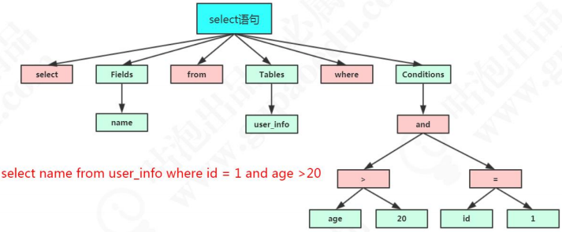

> `Preprocessor 预处理器` 在解析 SQL 的环节里面有个预处理器。它会检查生成的解析树，解决解析器无法解析的语义。比如，它会检查表和列名是否存在，检查名字和别名，保证没有歧义。 预处理之后得到一个新的解析树。

``Optimizer 查询优化器`` SQL语句在查询之前会使用查询优化器对查询进行优化。就是优化客户端请求的 query（sql语句） ，根据客户端请求的 query 语句，和数据库中的一些统计信息，在一系列算法的基础上进行分析，得出一个最优的策略，告诉后面的程序如何取得这个 query 语句的结果。

> 他使用的是“选取-投影-联接”策略进行查询。
>
> 用一个例子就可以理解： select uid,name from user where gender = 1;
>
> 这个 select 查询先根据 where 语句进行选取，而不是先将表全部查询出来以后再进行 gender 过滤
>
> 这个 select 查询先根据 uid 和 name 进行属性投影，而不是将属性全部取出以后再进行过滤
>
> 将这两个查询条件联接起来生成最终查询结果

```markdown
# 可以使用这个命令查看查询的开销
	show status like 'Last_query_cost';
# 要启用优化器的追踪（默认是关闭的），注意开启这开关是会消耗性能的，因为它要把优化分析的结果写到表里面，所以不要轻易开启，或者查看完之后关闭它
	SHOW VARIABLES LIKE 'optimizer_trace';
	set optimizer_trace='enabled=on';

# 执行一条查询语句，这个时候优化器分析的过程已经记录到系统表
	select * from information_schema.optimizer_trace\G
	
	*************************** 1. row ***************************
                            QUERY: select * from blog
                            TRACE: {
	"steps": [
    {
      "join_preparation": {
        "select#": 1,
        "steps": [
          {
            "expanded_query": "/* select#1 */ select `blog`.`bid` AS `bid`,`blog`.`name` AS `name`,`blog`.`aid` AS `aid` from `blog`"
          }
        ]
      }
    },
    {
      "join_optimization": {
        "select#": 1,
        "steps": [
          {
            "table_dependencies": [
              {
                "table": "`blog`",
                "row_may_be_null": false,
                "map_bit": 0,
                "depends_on_map_bits": [
                ]
              }
            ]
          },
          {
            "rows_estimation": [
              {
                "table": "`blog`",
                "table_scan": {
                  "rows": 1,
                  "cost": 1
                }
              }
            ]
          },
          {
            "considered_execution_plans": [
              {
                "plan_prefix": [
                ],
                "table": "`blog`",
                "best_access_path": {
                  "considered_access_paths": [
                    {
                      "rows_to_scan": 1,
                      "access_type": "scan",
                      "resulting_rows": 1,
                      "cost": 1.2,
                      "chosen": true
                    }
                  ]
                },
                "condition_filtering_pct": 100,
                "rows_for_plan": 1,
                "cost_for_plan": 1.2,
                "chosen": true
              }
            ]
          },
          {
            "attaching_conditions_to_tables": {
              "original_condition": null,
              "attached_conditions_computation": [
              ],
              "attached_conditions_summary": [
                {
                  "table": "`blog`",
                  "attached": null
                }
              ]
            }
          },
          {
            "refine_plan": [
              {
                "table": "`blog`"
              }
            ]
          }
        ]
      }
    },
    {
      "join_execution": {
        "select#": 1,
        "steps": [
        ]
      }
    }
	 ]
	}
	MISSING_BYTES_BEYOND_MAX_MEM_SIZE: 0
	INSUFFICIENT_PRIVILEGES: 0
```

> 它是一个 JSON 类型的数据，主要分成三部分，`join_preparation 准备阶段`、`join_optimization 优化阶段`和 `join_execution 执行阶段`。
>
> `expanded_query` 是优化后的 SQL 语句
>
> `considered_execution_plans` 里面列出了所有的执行计划

优化器最终会把解析树变成一个`查询执行计划`，查询执行计划是一个数据结构。

MySQL 提供了一个执行计划的工具，我们在 SQL 语句前面加上 `EXPLAIN`，就可以看到执行计划的信息。

## 3.3 引擎层

存储引擎层，存储引擎真正的负责了MySQL中数据的存储和提取，服务器通过 API 与存储进行通信，不同的存储引擎具有的功能不同，这样可以根据自己的实际需要进行选取。

``存储引擎接口`` 存储引擎接口模块可以说是 MySQL 数据库中最有特色的一点了。目前各种数据库产品中，基本上只有 MySQL 可以实现其底层数据存储引擎的插件式管理。这个模块实际上只是 一个抽象类，但正是因为它成功地将各种数据处理高度抽象化，才成就了今天 MySQL 可插拔存储引擎的特色。

MySQL区别于其他数据库的最重要的特点就是其`插件式的表存储引擎`。MySQL插件式的存储引擎架构提供了一系列标准的管理和服务支持，这些标准与存储引擎本身无关，可能是每个数据库系统本身都必需的，如SQL分析器和优化器等，而存储引擎是底层物理结构的实现，每个存储引擎开发者都可以按照自己的意愿来进行开发。

注意：存储引擎是基于表的，而不是数据库。

> `执行引擎`利用存储引擎提供的相应的 API 来使用执行计划去操作存储引擎。
>
> 为什么我们修改了表的存储引擎，操作方式不需要做任何改变？
>
> 因为不同功能的存储引擎实现的 API 是相同的。

## 3.4 存储层

数据存储层，主要是将数据存储在运行于裸设备的文件系统之上，并完成于存储引擎的交互。

# 4 存储引擎

在 MySQL 里面，我们创建的每一张表都可以指定它的存储引擎，而不是一个数据库只能使用一个存储引擎。存储引擎的使用是以表为单位的，而且创建表之后还可以修改存储引擎。

```mysql
# 查看MySQL现在提供什么存储引擎
show engines;
# 查看当前存储引擎
show variables like '%storage_engine%';
# 查看数据库里面已经存在表的存储引擎
show table status from spring;
# 查看数据库存放数据的路径
show variables like 'datadir';
```

默认情况下，每个数据库有一个自己文件夹，任何一个存储引擎都有一个 frm 文件，这个是`表结构定义文件`。 不同的存储引擎存放数据的方式不一样，产生的文件也不一样，innodb 是 1 个，myisam 是两个。

| 对比项 | MyISAM                                                     | InnoDB                                                       |
| ------ | ---------------------------------------------------------- | ------------------------------------------------------------ |
| 主外键 | 不支持                                                     | 支持                                                         |
| 事务   | 不支持                                                     | 支持                                                         |
| 行表锁 | 表锁，即使操作一条记录也会锁住整个表<br>不适合高并发的操作 | 行锁，操作时只锁某一行，不对其他行有影响<br>适合高并发操作   |
| 表空间 | 小                                                         | 大                                                           |
| 关注点 | 性能                                                       | 事务                                                         |
| 缓存   | 只缓存索引，不缓存缓存真实数据                             | 不仅缓存索引还要缓存真实数据<br>对内存要求较高，而且内存对性能有决定性影响 |
| 总行数 | 存储                                                       | 不存储                                                       |
| 索引   | 非聚集索引<br>支持全文索引，查询效率上MyISAM要高           | 聚集索引(索引的数据域存储数据文件本身)<br>不支持全文索引     |
| 持久化 | 一个表三个文件（索引文件，表结构文件，数据文件）           | 表空间                                                       |

> 如果对数据一致性要求比较高，需要事务支持，可以选择 InnoDB。 
>
> 如果数据查询多更新少，对查询性能要求比较高，可以选择 MyISAM。

# 5 InnoDB 数据更新

更新流程和查询流程有什么不同呢？ 基本流程也是一致的，也就是说，它也要经过解析器、优化器的处理，最后交给执行器。 区别就在于拿到符合条件的数据之后的操作。

## 5.1 缓冲池 Buffer Pool

首先，InnnoDB 的数据都是放在磁盘上的，InnoDB 操作数据有一个`最小的逻辑单位，叫做页`(索引页和数据页)。我们对于数据的操作，不是每次都直接操作磁盘，因为磁盘的速度太慢了。InnoDB 使用了一种缓冲池的技术，也就是把磁盘读到的页放到一 块内存区域里面。这个内存区域就叫 `Buffer Pool`。

下一次读取相同的页，先判断是不是在缓冲池里面，如果是就直接读取，不用再次访问磁盘。 修改数据的时候，先修改缓冲池里面的`页`。内存的数据页和磁盘数据不一致的时候， 我们把它叫做`脏页`。

InnoDB 里面有专门的后台线程把 Buffer Pool 的数据写入到磁盘， 每隔一段时间就一次性地把多个修改写入磁盘，这个动作就叫做`刷脏`。

## 5.2 InnoDB 内存结构和磁盘结构

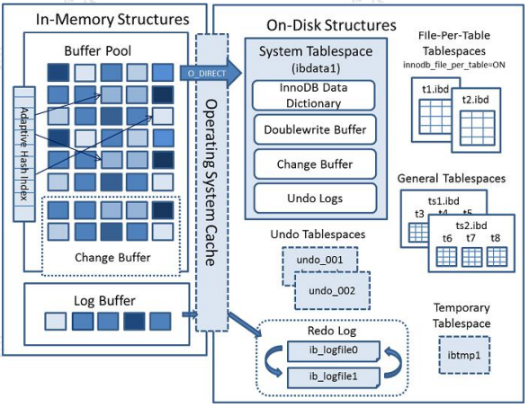

### 5.2.1 内存结构

Buffer Pool 主要分为 3 个部分： Buffer Pool、Change Buffer、Adaptive Hash Index，另外还有一个（redo）log buffer。

#### Buffer Pool

Buffer Pool 缓存的是页面信息，包括数据页、索引页。 

```mysql
# 查看服务器状态，里面有很多跟 Buffer Pool 相关的信息
SHOW STATUS LIKE '%innodb_buffer_pool%';
# https://dev.mysql.com/doc/refman/5.7/en/server-status-variables.html
```

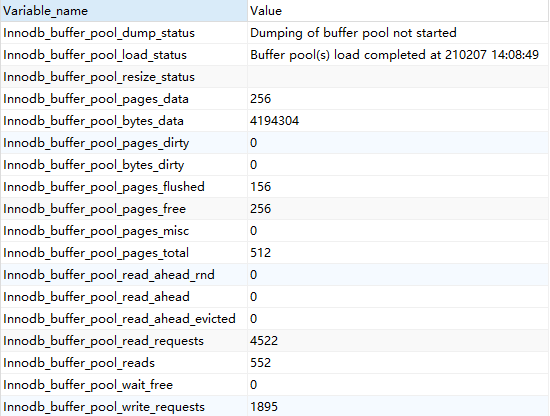

Buffer Pool 默认大小是 `128M(134217728 字节)`，可以调整。 

```mysql
# 查看参数（系统变量）
SHOW VARIABLES like '%innodb_buffer_pool%';
```

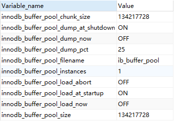

**内存的缓冲池写满了怎么办？**

InnoDB 用 `LRU (最近最少使用)算法`来管理缓冲池(链表实现，不是传统的 LRU，分成了 young 和 old)，经过淘汰的数据就是热点数据。 

内存缓冲区对于提升读写性能有很大的作用。

#### Change Buffer 写缓冲

当需要更新一个数据页时，如果数据页在 Buffer Pool 中存在，那么就直接更新好了。 否则的话就需要从磁盘加载到内存，再对内存的数据页进行操作。也就是说，如果没有命中缓冲池，至少要产生一次磁盘 IO。

非唯一索引不需要从磁盘加载索引页判断数据是不是重复(唯一性检查)。这种情况下可以先把修改记录在内存的缓冲池中，从而提升更新(Insert、Delete、Update)语句的执行速度。这一块区域就是 `Change Buffer`。

最后把 Change Buffer 记录到数据页的操作叫做 `merge`：

* 在访问这个数据页的时候
* 通过后台线程或者数据库 shut down
* redo log 写满时触发

如果数据库大部分索引都是非唯一索引，并且业务是写多读少，不会在写数据后立刻读取，就可以使用 Change Buffer。写多读少的业务，调大这个值：

```mysql
# Change Buffer 占 Buffer Pool 的比例，默认 25%
SHOW VARIABLES LIKE 'innodb_change_buffer_max_size';
```

#### (redo)Log Buffer

如果 Buffer Pool 里面的脏页还没有刷入磁盘时，数据库宕机或者重启，这些数据丢失。如果写操作写到一半，甚至可能会破坏数据文件导致数据库不可用。 

为了避免这个问题，InnoDB 把所有对页面的修改操作专门写入一个日志文件，并且在数据库启动时从这个文件进行恢复操作(`实现 crash-safe`) — — 用它来实现`事务的持久性`。

这个文件就是磁盘的 `redo log(叫做重做日志)`，记录的是物理数据页面的修改的信息，对应于/var/lib/mysql/目录下的 ib_logfile0 和 ib_logfile1，每个 48M。

```mysql
show variables like 'innodb_log%';
# innodb_log_file_size 指定每个文件的大小，默认 48M
# innodb_log_files_in_group 指定文件的数量，默认为 2
# innodb_log_group_home_dir 指定文件所在路径，相对或绝对。如果不指定，则为datadir 路径
```

> 这种日志和磁盘配合的整个过程，其实就是 MySQL 里的 `WAL 技术(Write-Ahead Logging)`，它的关键点就是<font color=red>先写日志，再写磁盘。</font>
>
> 刷盘是`随机 I/O`，而记录日志是`顺序 I/O`，顺序 I/O 效率更高。因此先把修改写入日志，可以延迟刷盘时机，进而提升系统吞吐。

当然 redo log 也不是每一次都直接写入磁盘，在 Buffer Pool 里面有一块内存区域 Log Buffer 专门用来保存即将要写入日志文件的数据，`默认 16M`，它一样可以节省磁盘 IO。

```mysql
SHOW VARIABLES LIKE 'innodb_log_buffer_size';
```

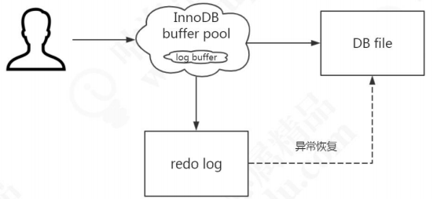

需要注意：redo log 的内容主要是`用于崩溃恢复`。磁盘的数据文件，数据来自 buffer pool。redo log 写入磁盘，不是写入数据文件。

**那么，Log Buffer 什么时候写入 log file？**

```mysql
# log buffer 写入磁盘的时机，由一个参数控制，默认是 1。
SHOW VARIABLES LIKE 'innodb_flush_log_at_trx_commit';
# 0（延迟写） log buffer 将每秒一次地写入 log file 中，并且 log file 的 flush 操作同时进行。该模式下，在事务提交的时候，不会主动触发写入磁盘的操作
# 1（默认，实时写，实时刷） 每次事务提交时 MySQL 都会把 log buffer 的数据写入 log file，并且刷到磁盘中去
# 2（实时写，延迟刷） 每次事务提交时 MySQL 都会把 log buffer 的数据写入 log file。但是 flush 操作并不会同时进行。该模式下，MySQL 会每秒执行一次 flush 操作
```

> 在我们写入数据到磁盘的时候，操作系统本身是有缓存的。flush 就是把操作系统缓冲区写入到磁盘。

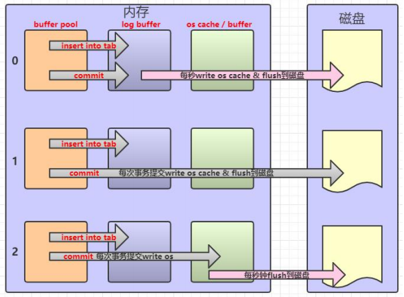

redo log，它又分成内存和磁盘两部分。redo log 有什么特点？ 

* redo log 是 InnoDB 存储引擎实现的，并不是所有存储引擎都有
* 不是记录数据页更新之后的状态，而是记录这个页做了什么改动，属于`物理日志`
* redo log 的大小是固定的，前面的内容会被覆盖

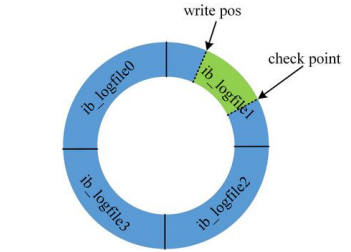

check point 是当前要覆盖的位置。如果 write pos 跟 check point 重叠，说明 redo log 已经写满，这时候需要同步 redo log 到磁盘中。

### 5.2.2 磁盘结构

表空间可以看做是 InnoDB 存储引擎逻辑结构的最高层，所有的数据都存放在表空间中。InnoDB 的表空间分为 5 大类。

#### 系统表空间 system tablespace

在默认情况下 InnoDB 存储引擎有一个共享表空间（对应文件/var/lib/mysql/ibdata1），也叫系统表空间。 

InnoDB 系统表空间包含 InnoDB `数据字典`(由内部系统表组成，存储表和索引的元数据(定义信息))、`双写缓冲区` 和 `Undo Logs`，如果没有指定 file-per-table，也包含用户创建的表和索引数据。 

**双写缓冲**

InnoDB 的页和操作系统的页大小不一致，InnoDB 页大小一般为 16K，操作系统页大小为 4K，InnoDB 的页写入到磁盘时，一个页需要分 4 次写。

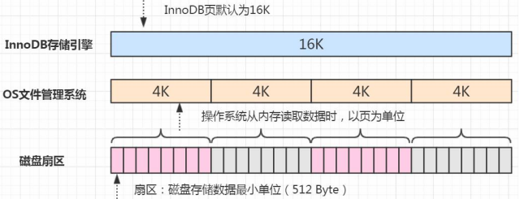

如果存储引擎正在写入页的数据到磁盘时发生了宕机，可能出现页只写了一部分的情况，比如只写了 4K，就宕机了，这种情况叫做`部分写失效 partial page write`，可能会导致数据丢失。 

```mysql
show variables like 'innodb_doublewrite';
# 默认开启
```

我们不是有 redo log 吗？但是有个问题，如果这个页本身已经损坏了，用它来做崩溃恢复是没有意义的。所以在对于应用 redo log 之前，需要一个页的副本。如果出现了写入失效，就用页的副本来还原这个页，然后再应用 redo log。这个页的副本就是 `double write`，InnoDB 的双写技术。通过它实现了数据页的可靠性。

跟 redo log 一样，double write 由两部分组成，一部分是内存的 double write，一个部分是磁盘上的 double write。因为 double write 是顺序写入的，不会带来很大的开销。 

在默认情况下，所有的表共享一个系统表空间，这个文件会越来越大，而且它的空间不会收缩。 

#### 独占表空间 file-per-table tablespaces

我们可以让每张表独占一个表空间。这个开关通过 `innodb_file_per_table` 设置，默认开启。 

```mysql
SHOW VARIABLES LIKE 'innodb_file_per_table'; 
```

开启后，则每张表会开辟一个表空间，这个文件就是数据目录下的 ibd 文件，存放表的索引和数据。 

但是其他类的数据，如回滚（undo）信息，插入缓冲索引页、系统事务信息，二次写缓冲（Double write buffer）等还是存放在原来的共享表空间内。

#### 通用表空间 general tablespaces

通用表空间也是一种共享的表空间，跟 ibdata1 类似。 

不同表空间的数据是可以移动的。

```mysql
# 创建一个通用的表空间，用来存储不同数据库的表，数据路径和文件可以自定义
create tablespace ts2673 add datafile '/var/lib/mysql/ts2673.ibd' file_block_size=16K engine=innodb; 
# 在创建表的时候可以指定表空间，用 ALTER 修改表空间可以转移表空间
create table t2673(id integer) tablespace ts2673; 
# 删除表空间需要先删除里面的所有表
drop table t2673; 
drop tablespace ts2673; 
```

#### 临时表空间 temporary tablespaces

存储临时表的数据，包括用户创建的临时表，和磁盘的内部临时表。对应数据目录下的 ibtmp1 文件。当数据服务器正常关闭时，该表空间被删除，下次重新产生。

#### undo log tablespace

undo log（撤销日志或回滚日志）记录了事务发生之前的数据状态（不包括 select）。如果修改数据时出现异常，可以用 undo log 来实现回滚操作（保持原子性）。

在执行 undo 的时候，仅仅是将数据从逻辑上恢复至事务之前的状态，而不是从物理页面上操作实现的，属于`逻辑日志`。

redo Log 和 undo Log 与事务密切相关，统称为事务日志。

undo Log 的数据默认在系统表空间 ibdata1 文件中，因为共享表空间不会自动收缩，也可以单独创建一个 undo 表空间。

```mysql
show global variables like '%undo%'; 
```

有了这些日志之后，我们来总结一下一个更新操作的流程，这是一个简化的过程。

```mysql
# name 原值是 xiaoxiao
update user set name = 'spring' where id=1;
```

1. 事务开始，从内存或磁盘取到这条数据，返回给 Server 的执行器

2. 执行器修改这一行数据的值为 spring

3. 记录 name=xiaoxiao 到 undo log

4. 记录 name=spring 到 redo log 

5. 调用存储引擎接口，在内存（Buffer Pool）中修改 name=spring

6. 事务提交

## 5.3 Binlog

binlog 以事件的形式记录了所有的 DDL 和 DML 语句(因为它记录的是操作而不是数据值，属于`逻辑日志`)，可以用来做主从复制和数据恢复。

跟 redo log 不一样，它的文件内容是可以追加的，没有固定大小限制。 在开启了 binlog 功能的情况下，我们可以把 binlog 导出成 SQL 语句，把所有的操作重放一遍，来`实现数据的恢复`。

binlog 的另一个功能就是用来`实现主从复制`，它的原理就是从服务器读取主服务器 的 binlog，然后执行一遍。 

有了这两个日志之后，我们来看一下一条更新语句是怎么执行的： 


```mysql
update teacher set name='盆鱼宴' where id=1; 
```

1. 先查询到这条数据，如果有缓存，也会用到缓存
2. 把 name 改成盆鱼宴，然后调用引擎的 API 接口，写入这一行数据到内存，同时记录 redo log。这时 redo log 进入 prepare 状态，然后告诉执行器，执行完成了，可以随时提交
3. 执行器收到通知后记录 binlog，然后调用存储引擎接口，设置 redo log为 commit 状态
4. 更新完成

------

