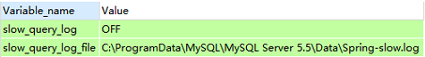
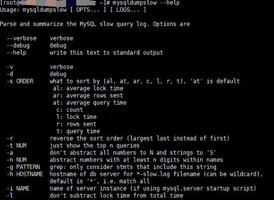
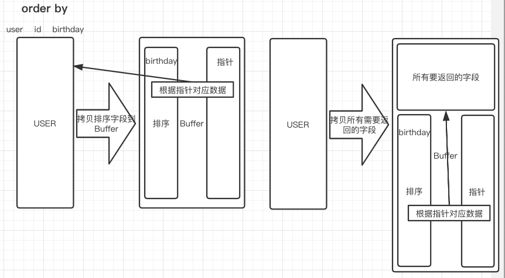
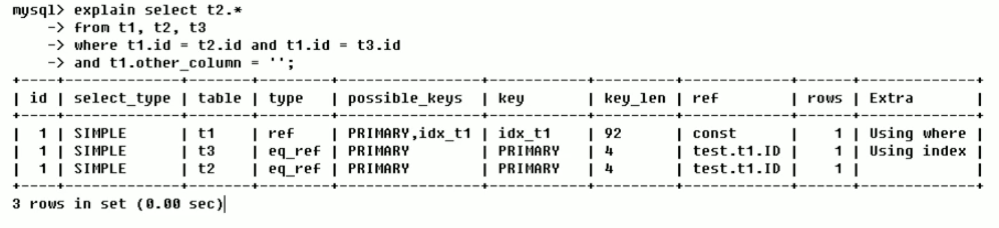
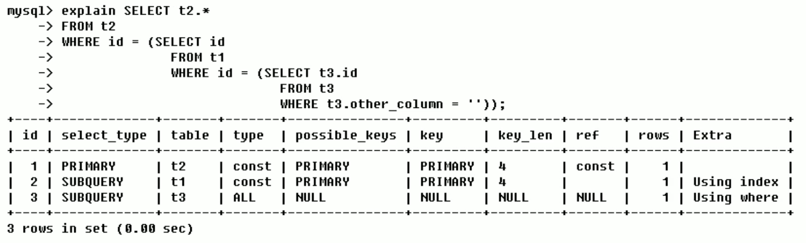
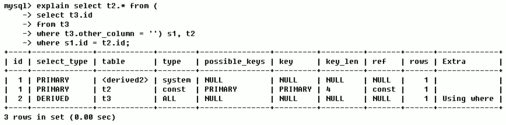
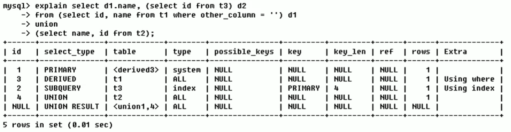

# 1 连接配置优化

服务端连接数不够导致应用程序获取不到连接，比如报了一个 Mysql: error 1040: Too many connections 的错误。

我们可以从两个方面来解决连接数不够的问题： 

* 从服务端来说，我们可以增加服务端的可用连接数

  如果有多个应用或者很多请求同时访问数据库，连接数不够的时候，我们可以： 

  - 修改配置参数增加可用连接数，修改 max_connections 的大小

    ```mysql
    show variables like 'max_connections'; -- 修改最大连接数，当有多个应用连接的时候 
    ```

  - 及时释放不活动的连接。交互式和非交互式的客户端的默认超时时间都是 28800 秒(8 小时)，我们可以把这个值调小

    ```mysql
    show global variables like 'wait_timeout'; -- 及时释放不活动的连接，注意不要释放连接池还在使用的连接
    ```

* 从客户端来说，可以减少从服务端获取的连接数，可以引入连接池，实现连接的重用

> 我们可以在哪些层面使用连接池？
>
> * ORM 层面（MyBatis 自带了一个连接池）
>
> * 或者使用专用的连接池工具（阿里的 Druid、Spring Boot 2.x 版本默认的连接池 Hikari、老牌的 DBCP 和 C3P0）

连接池并不是越大越好，只要维护一定数量大小的连接池，其他的客户端排队等待获取连接就可以了。有的时候连接池越大，效率反而越低。Druid 的默认最大连接池大小是 8，Hikari 的默认最大连接池大小是 10。

> 在 Hikari 的 github 文档中，给出了一个 PostgreSQL 数据库建议的设置连接池大小的公式： https://github.com/brettwooldridge/HikariCP/wiki/About-Pool-Sizing 
>
> `它的建议是机器核数乘以 2 加 1`
>
> 每一个连接，服务端都需要创建一个线程去处理它。连接数越多，服务端创建的线程数就会越多。而 CPU 的核数是有限的，频繁的`上下文切换`会造成比较大的性能开销。

## MySQL 常见性能瓶颈

不管是数据库本身的配置，还是安装这个数据库服务的操作系统的配置，对于配置进行优化，最终的目标都是为了更好地发挥硬件本身的性能，包括 CPU、内存、磁盘、网络。 

``CPU`` CPU在饱和的时候一般发生在数据装入在内存或从磁盘上读取数据时候

``IO`` 磁盘I/O瓶颈发生在装入数据远大于内存容量时

``服务器硬件的性能瓶颈`` top、free、iostat 和 vmstat来查看系统的性能状态 

# 2 缓存架构优化

## 2.1 缓存服务

在应用系统的并发数非常大的情况下，如果没有缓存，会造成两个问题：

* 给数据库带来很大的压力

* 从应用的层面来说，操作数据的速度也会受到影响

架构层面的优化，运行独立的第三方缓存服务，例如 Redis。

## 2.2 主从复制

关于主从复制的简介和配置见《Mysql 高级》

做了主从复制的方案之后，我们只把数据写入 master 节点，而读的请求可以分担到 slave 节点，我们把这种方案叫做`读写分离`。 

读写分离可以一定程度低减轻数据库服务器的访问压力，但是需要特别注意主从数据一致性的问题。如果我们在 master 写入了，马上到 slave 查询，而这个时候 slave 的数据还没有同步过来，怎么办？ 

所以，基于主从复制的原理，我们需要弄明白，主从复制到底慢在哪里？ 

### 2.2.1 单线程

在早期的 MySQL 中，slave 的 SQL 线程是单线程。master 可以支持 SQL 语句的并行执行，配置了多少的最大连接数就是最多同时多少个 SQL 并行执行。 

而 slave 的 SQL 却只能单线程排队执行(多条语句在从库上的执行顺序是不能颠倒的 )，在主库并发量很大的情况下，同步数据肯定会出现延迟。

### 2.2.2 异步与全同步

在主从复制的过程中，MySQL 默认是`异步复制`的。也就是说对于主节点来说，写入 binlog 事务结束，就返回给客户端了。对于 slave 来说，接收到 binlog 就完事儿了，master 不关心 slave 的数据有没有写入成功。

如果要减少延迟，可以等待全部从库的事务执行完毕，才返回给客户端，这样的方式叫做`全同步复制`。从库写完数据，主库才返会给客户端。

这种方式虽然可以保证在读之前，数据已经同步成功了，但是事务执行的时间会变长，它会导致 master 节点性能下降。

### 2.2.3 半同步复制

介于异步复制和全同步复制之间，还有一种`半同步复制`的方式。 

主库在执行完客户端提交的事务后不是立刻返回给客户端，而是等待至少一个从库接收到 binlog 并写到 relay log 中才返回给客户端。master 不会等待很长的时间，但是返回给客户端的时候，数据就即将写入成功了，因为它只剩最后一步了：`就是读取 relay log，写入从库`。 

如果我们要在数据库里面用半同步复制，必须安装一个插件，这个是谷歌的一位工程师贡献的。这个插件在 mysql 的插件目录下已经有提供： 

```shell
cd /usr/local/mysql/lib/plugin/
semisync_master.so
semisync_slave.so
```

主库和从库是不同的插件，安装之后需要启用： 

```mysql
-- 主库执行
INSTALL PLUGIN rpl_semi_sync_master SONAME 'semisync_master.so';
set global rpl_semi_sync_master_enabled=1;
show variables like '%semi_sync%';
-- 从库执行
INSTALL PLUGIN rpl_semi_sync_slave SONAME 'semisync_slave.so';
set global rpl_semi_sync_slave_enabled=1;
show global variables like '%semi%';
```

相对于异步复制，半同步复制提高了数据的安全性，同时它也造成了一定程度的延迟，它需要等待一个 slave 写入中继日志，这里多了一个网络交互的过程，所以，半同步复制最好在低延时的网络中使用。 

这个是从主库和从库连接的角度，来保证 slave 数据的写入。

另一个思路，如果要减少主从同步的延迟，减少 SQL 执行造成的等待的时间，那有没有办法在从库上，让多个 SQL 语句可以并行执行，而不是排队执行呢？ 

### 2.2.4 多库并行复制

如果是操作三个数据库，这三个数据库的从库的 SQL 线程可以并发执行。这是 MySQL 5.6 版本里面支持的`多库并行复制`。 


### 2.2.5 异步复制之 GTID 复制

但是在大部分的情况下，我们都是单库多表的情况，在一个数据库里面怎么实现并行复制呢？

数据库本身就是支持多个事务同时操作的，为什么这些事务在主库上面可以并行执行，却不会出现问题呢？ 

因为他们本身就是互相不干扰的，比如这些事务是操作不同的表，或者操作不同的行，不存在资源的竞争和数据的干扰。那在主库上并行执行的事务，在从库上肯定也是可以并行执行。比如在 master 上有三个事务同时分别操作三张表，这三个事务是不是在 slave 上面也可以并行执行呢？ 

所以，我们可以把那些在主库上并行执行的事务，分为一个组，并且给他们编号，这一个组的事务在从库上面也可以并行执行。这个编号，我们把它叫做 `GTID（Global Transaction Identifiers）`，这种主从复制的方式，我们把它叫做`基于 GTID 的复制`。


如果我们要使用 GTID 复制，我们可以通过修改配置参数打开它，默认是关闭的：

```mysql
show global variables like 'gtid_mode';
```

## 2.3 分库分表

无论是优化 master 和 slave 的连接方式，还是让从库可以并行执行 SQL，都是从数据库的层面去解决主从复制延迟的问题。 

除了数据库本身的层面之外，在应用层面，我们也有一些减少主从同步延迟的方法。 

我们在做了主从复制之后，如果单个 master 节点或者单张表存储的数据过大的时候，比如一张表有上亿的数据，单表的查询性能还是会下降，我们要进一步对单台数据库节点的数据分型拆分，这个就是`分库分表`。 

`垂直分库`，减少并发压力

`水平分表`，解决存储瓶颈

垂直分库的做法，把一个数据库按照业务拆分成不同的数据库： 


水平分库分表的做法，把单张表的数据按照一定的规则分布到多个数据库：


通过主从或者分库分表可以减少单个数据库节点的访问压力和存储压力，达到提升数据库性能的目的，但是如果 master 节点挂了，怎么办？ 

所以，`高可用（High Available）也是高性能的基础`。

## 2.4 高可用方案

* 传统的 HAProxy + keepalived 的方案，基于主从复制

* [基于 NDB 集群存储引擎的 MySQL Cluster](https://dev.mysql.com/doc/mysql-cluster-excerpt/5.7/en/mysql-cluster-overview.html)

* [Galera 一种多主同步复制的集群方案](https://galeracluster.com/)

* MHA/MMM

* MySQL 5.7.17 版本推出的 InnoDB Cluster，也叫 `MySQL Group Replicatioin（MGR）`，这个套件里面包括了 mysql shell 和 mysql-route

# 3 性能优化

## 3.1 性能优化一般流程

1. 开启慢查询日志（设置阙值，如超过5秒就是慢SQL，抓取出来）并捕获
2. explain + 慢SQL分析
3. show profile 查询 SQL 在 MySQL 服务器里面的执行细节和生命周期情况
4. SQL数据库服务器的参数调优

SQL 与索引优化 https://dev.mysql.com/doc/refman/5.7/en/optimization.html 


## 3.2 慢查询日志

MySQL的慢查询日志是MySQL提供的一种日志记录，它用来记录在MySQL中响应时间超过阙值的语句，具体指运行时间超过``long_query_time``值的SQL，则会被记录到慢查询日志中。

long_query_time 默认值为10，意思是运行10秒以上的语句。

由慢查询日志来查看哪些SQL超出了我们最大忍耐时间值，比如一条SQL执行查过5秒，就算慢SQL，希望能收集超过3秒的SQL，结合之前explain进行全面分析。

默认情况下，MySQL数据库没有开启慢查询日志，需要手动来设置这个参数。当然如果不是调优需要的话，一般不建议开启该参数，因为开启慢查询日志或多或少带来一定的性能影响，慢查询日志支持将日志记录写入文件。

### 3.2.1 开启慢查询日志

```mysql
# 查看是否开启
SHOW VARIABLES LIKE '%slow_query_log%';
```



默认情况下``slow_query_log``的值为OFF，表示慢查询日志是禁用的。

```mysql
# 使用下面语句开启慢查询日志只对当前数据库生效，如果MySQL重启后则会失效
set global slow_query_log = 1;
```

如果要永久生效，就必须修改配置文件 my.cnf，在 [mysqld] 下增加或修改参数，然后重启MySQL服务器：

```markdown
slow_query_log=1
slow_query_log_file=/usr/local/mysql/data/spring-slow.log
long_query_time=5
log_output=FILE
```

关于慢查询的参数slow_query_log_file，它指定慢查询日志的存放路径，系统默认会给一个缺省的文件host_name-slow.log(如果没有指定参数slow_query_log_file的话)。

```mysql
# 开启慢查询日志后，什么样的SQL参会记录到慢查询里面？
show global variables like 'long_query_time';

# 设置慢查询SQL的阙值时间，也可以在my.cnf参数里面修改
# 需要重新连接或者新开一个回话才能看到修改值
set global long_query_time=3;
```

假如运行时间正好等于 long_query_time 的情况，并不会被记录下来。也就是说，在MySQL源码里是``判断大于 long_query_time，并非大不等于``。

### 3.2.2 记录慢 SQL

```mysql
SELECT SLEEP(4);
```

查看对应的slow_query_log_file：

```
D:\Mysql5.5\bin\mysqld, Version: 5.5.28 (MySQL Community Server (GPL)). started with:
TCP Port: 3306, Named Pipe: MySQL
Time                 Id Command    Argument
# Time: 200926 15:50:58
# User@Host: root[root] @ localhost [127.0.0.1]
# Query_time: 4.000666  Lock_time: 0.000000 Rows_sent: 1  Rows_examined: 0
use test;
SET timestamp=1601106658;
#SHOW VARIABLES LIKE 'long_query_time%';
#SHOW VARIABLES LIKE '%slow_query_log%';
SELECT SLEEP(4);
```

### 3.2.3 查看当前系统有多少条慢查询记录

```mysql
show global status like '%Slow_queries%';

# Variable_name		Value
# Slow_queries		1
```

### 3.2.4 日志分析工具 mysqldumpshow

在生产环境中，如果要手工分析日志，查找、分析SQL，显然是一个体力活，MySQL提供了日志分析工具 mysqldumpshow。

```shell
mysqldumpslow --help
```



s:是表示按何种方式排序

c:访问次数

l:锁定时间

r:返回记录

t:查询时间

al:平均锁定时间

ar:平均返回记录数

at:平均查询时间

t:即为返回前面多少条的数据

g:后边搭配一个正则匹配模式，大小写不敏感的

```shell
# 得到返回记录集最多的10个SQL
mysqldumpslow -s r -t 10 /var/lib/mysql/spring-slow.log
# 得到访问次数最多的10个SQL
mysqldumpslow -s c -t 10 /var/lib/mysql/spring-slow.log
# 得到按照时间排序的前10条里面含有左连接的查询语句
mysqldumpslow -s t -t 10 -g "left join" /var/lib/mysql/spring-slow.log
# 另外建议在使用这些命令时结合 ｜ 和 more 使用，否则可能出现爆屏情况
mysqldumpslow -s r -t 10 /var/lib/mysql/spring-slow.log ｜ more
```

## 3.3 EXPLAIN

现在我们已经知道哪些 SQL 慢了，为什么慢呢？慢在哪里？

**MySQL Query Optimizer**

MySQL 中有专门负责优化 SELECT 语句的优化器模块，主要功能：通过计算分析系统中收集到的统计信息，为客户端请求的 Query 提供它认为最优的执行计划（它认为最优的数据检索方式，但不见得是DBA认为是最优的，这部分最耗费时间）。

当客户端向 MySQL 请求一条 Query，命令解析器模块完成请求分类，区别出是 SELECT 并转发给 MySQL Query Optimizer 时，MySQL Query Optimizer 首先会对整条 Query 进行优化，处理掉一些常量表达式的预算，直接换算成常量值。并对 Query 中的查询条件进行简化和转换，如去掉一些无用或显而易见的条件、结构调整等。然后分析 Query 中的 Hint 信息（如果有），看显示 Hint 信息是否可以完全确定该 Query 的执行计划。如果没有 Hint 或 Hint 信息还不足以完全确定执行计划，则会读取所涉及对象的统计信息，根据 Query 进行写相应的计算分析，然后再得出最后的执行计划。

``EXPLAIN(执行计划)`` 用 EXPLAIN 关键字可以模拟优化器执行SQL语句，从而知道 MySQL 是如何处理你的 SQL 语句的。

> explain 可以分析 update、delete、insert 么？ 
>
> MySQL 5.6.3 以前只能分析 SELECT，MySQL 5.6.3 以后就可以分析update、delete、insert 了

分析你的查询语句或是表结构的性能瓶颈，主要功能：

* 表的读取顺序
* 数据读取操作的操作类型
* 哪些索引可以使用
* 哪些索引被实际使用
* 表之间的引用
* 每张表有多少行被优化器查询

### 3.3.1 查询优化

#### 永远小数据集驱动大数据集

即小的数据集驱动大的数据集，类似嵌套循环Nested Loop

```mysql
select * from A where id in (select id from B)
# 等价于
for select id from B
for select * from A where A.id = B.id
```

当B表的数据集必须小于A表的数据集时，用in优于exists

```mysql
select * from A where exists (select 1 from B where B.id = A.id)
# 等价于
for select * from A
for select * from B where B.id = A.id
```

当A表的数据集小于B表的数据集时，用exists优于in

##### EXISTS

SELECT ... FROM table WHERE EXISTS(subquery)

该语法可以理解为：将主查询的数据，放到子查询中做条件验证，根据验证结果来决定主查询的数据结果是否得以保留。

1. EXISTS(subquery)只返回TRUE和FALSE，因此子查询中的SELECT * 也可以是SELECT 1 或者其他，官方说法是实际执行时会忽略SELECT清单，因此没有区别
2. EXISTS子查询的实际执行过程可能经过了优化而不是我们理解上的逐条对比，如果担心效率问题，可以进行实际检验已确定是否有效率问题
3. EXISTS子查询往往也可以用条件表达式、其他子查询或者JOIN替代，何种最优需要具体问题具体分析

#### order by 关键字优化

ORDER BY子句，尽量使用Index方式排序，避免使用FileSort方式排序

```mysql
CREATE TABLE `tba` (
  `id` int(11) NOT NULL AUTO_INCREMENT,
  `age` int(11) DEFAULT NULL,
  `birth` timestamp NULL DEFAULT NULL,
  PRIMARY KEY (`id`)
) ENGINE=InnoDB AUTO_INCREMENT=4 DEFAULT CHARSET=utf8;

INSERT INTO tbA(age, birth) VALUES(22, NOW());
INSERT INTO tbA(age, birth) VALUES(23, NOW());
INSERT INTO tbA(age, birth) VALUES(24, NOW());

CREATE INDEX idx_A_ageBirth ON tbA(age, birth);

# Using where; Using index
explain select * from tbA where age > 20 order by age;
explain select * from tbA where age > 20 order by age, birth;
explain select * from tbA WHERE birth > '2020-09-25 00:00:00' order by age;
# Using where; Using index; Using filesort
explain select * from tbA where age > 20 order by birth;
explain select * from tbA where age > 20 order by birth, age;
explain select * from tbA WHERE birth > '2020-09-25 00:00:00' order by birth;
#Using index; Using filesort
explain select * from tbA order by birth;
explain select * from tbA order by age ASC, birth DESC;
```

MySQL支持二种方式的排序，FileSort和Index，Index效率高。它指MySQL扫描索引本身完成排序。FileSort方式效率较低。

ORDER BY满足两情况，会使用Index方式排序：

1. ORDER BY语句使用索引最左前列

2. 使用where子句与OrderBy子句条件列组合满足索引最左前列，尽可能在索引列上完成排序操作，遵照索引建的最佳左前缀

##### filesort



如果sort_buffer能够承载所有的字段的时候，mysql就会自动选择第二种，如果不够就会使用第一种，第一种速度略逊于第一种，因为要两次读取数据，两次IO。

如果不在索引列上，filesort有两种算法，双路排序和单路排序：

``双路排序`` MySQL4.1之前是使用双路排序，字面意思是两次扫描磁盘，最终得到数据。读取行指针和orderby列，对他们进行排序，然后扫描已经排序好的列表，按照列表中的值重新从列表中读取对应的数据传输。

从磁盘取排序字段，在buffer进行排序，再从磁盘取其他字段。

取一批数据，要对磁盘进行两次扫描，众所周知，I\O是很耗时的，所以在mysql4.1之后，出现了第二张改进的算法，就是单路排序。

``单路排序`` 从磁盘读取查询需要的所有列，按照orderby列在buffer对它们进行排序，然后扫描排序后的列表进行输出，它的效率更快一些，避免了第二次读取数据，并且把随机IO变成顺序IO，但是它会使用更多的空间，因为它把每一行都保存在内存中了。

**单路排序引申出的问题**

由于单路是后出来的，总体而言好过双路，但是用单路有问题：

在sort_buffer中，单路排序比双路排序占用空间多，因为单路排序是把所有字段都取出，所有有可能去除的数据的总大小超出了sort_buffer的容量，导致每次只能取sort_buffer容量大小的数据，进行排序（创建tmp文件，多路合并），排再取sort_buffer容量大小，再排......从而多次I/O。

**优化策略**

增大sort_buffer_size参数的设置

增大max_length_for_sort_data参数的设置

##### 提高Order By的速度

1. Order By时select * 是一个大忌，只query需要的字段，这点非常重要：

   当query的字段大小总和小于max_length_for_sort_data而排序字段不是TEXT|BLOB类型时，会用单路排序，否则用多路排序

   两种算法的数据都有可能超出sort_buffer的容量，超出之后，会创建tmp文件进行合并排序，导致多次I/O，但是用单路排序算法风险会更大，所以要提高sort_buffer_size

2. 尝试提高 sort_buffer_size

   不管用哪种算法，提高这个参数都会提高效率，当然，要根据系统的能力去提高，因为这个参数是针对每个进程的

3. 尝试提高 max_length_for_sort_data

   提高这个参数，会增加用改进算法的概率。但是如果设的太高，数据总容量超出sort_buffer_size的概率就增大，明显症状是高的磁盘I/O活动和低的处理器使用率

##### 为排序使用索引

MySQL两种排序方式：文件排序或扫描有序索引排序

MySQL能为排序与查询使用相同的索引

```markdown
KEY a_b_c(a,b,c)
# order by 能使用索引最左前缀
	ORDER BY a
	ORDER BY a, b
	ORDER BY a, b, c
	ORDER BY a DESC, b DESC, c DESC

# 如果where使用索引的最左前缀定义为常量，则order by能使用索引
	WHERE a = const ORDER BY b, c
	WHERE a = const AND b = const ORDER BY c
	WHERE a = const AND b > const ORDER BY b, c

# 不能使用索引进行排序
	ORDER BY a ASC, b DESC, c DESC /*排序不一致*/
	WHERE g = const ORDER BY b, c  /*丢失a索引*/
	WHERE a = const ORDER BY c     /*丢失b索引*/
	WHERE a = const ORDER BY a, d  /*d不是索引的一部分*/
	WHERE a in (...) ORDER BY b, c /*对于排序来说，多个相等条件也是范围查询*/
```

#### group by 关键字优化

groupby实质是先排序后进行分组，遵照索引建的最佳左前缀。

当无法使用索引列，增大max_length_for_sort_data参数的设置 + 增大sort_buffer_size参数的设置。

where高于having,能写在where限定的条件就不要去having限定了。

### 3.3.2 批量数据脚本

往表里插入1000W数据

```mysql
# 建表
CREATE TABLE `dept` (
  `id` int(11) NOT NULL AUTO_INCREMENT,
  `deptno` mediumint(9) DEFAULT NULL,
  `dname` varchar(20) DEFAULT NULL,
  `loc` varchar(13) DEFAULT NULL,
  PRIMARY KEY (`id`)
) ENGINE=InnoDB DEFAULT CHARSET=utf8;

CREATE TABLE `emp` (
  `id` int(11) NOT NULL AUTO_INCREMENT,
  `empno` mediumint(9) DEFAULT NULL COMMENT '编号',
  `ename` varchar(20) DEFAULT NULL COMMENT '名字',
  `job` varchar(9) DEFAULT NULL COMMENT '工作',
  `mgr` mediumint(9) DEFAULT '0' COMMENT '上级编号',
  `hiredate` date DEFAULT NULL COMMENT '入职时间',
  `sal` decimal(7,2) DEFAULT NULL COMMENT '薪水',
  `comn` decimal(7,2) DEFAULT NULL COMMENT '红利',
  `deptno` mediumint(9) DEFAULT NULL COMMENT '部门编号',
  PRIMARY KEY (`id`)
) ENGINE=InnoDB DEFAULT CHARSET=utf8;
```

#### 设置参数log_trust_function_createors

创建函数，假如报错：This function has none of DETERMINISTIC......

由于开启过慢查询日志，因为我们开启了bin-log，就必须为function指定一个参数。

```mysql
SHOW VARIABLES LIKE 'log_bin_trust_function_creators';
set global log_bin_trust_function_creators=1;
```

#### 创建函数

```mysql
# 创建函数保证每条数据都不同
# 随机参数指定长度的字符串
DELIMITER $$
CREATE FUNCTION rand_string(n INT) RETURNS VARCHAR(255)
BEGIN
	DECLARE chars_str VARCHAR(100) DEFAULT 'abcdefghijklmnopqrstuvwxyzABCDEFGHIJKLMNOPQRSTUVWXYZ';
	DECLARE return_str VARCHAR(255) DEFAULT '';
	DECLARE i INT DEFAULT 0;
	WHILE i < n DO
	SET return_str = CONCAT(return_str,SUBSTRING(chars_str, FLOOR(1+RAND()*52), 1));
	SET i = i + 1;
	END WHILE;
	RETURN return_str;
END $$

# 随机产生100~110之间的整数
DELIMITER $$
CREATE FUNCTION rand_num() RETURNS INT(5)
BEGIN
	DECLARE i INT DEFAULT 0;
	SET i = FLOOR(100+RAND()*10);
	RETURN i;
END $$

SELECT rand_string(10);
SELECT rand_num();

# 删除函数
DROP FUNCTION rand_num;
```

#### 创建存储过程

```mysql
# 创建往emp表中插入数据的存储过程
DELIMITER $$
CREATE PROCEDURE insert_emp(IN START INT(10), IN max_num INT(10))
BEGIN
	DECLARE i INT DEFAULT 0;
	# set autocommit = 0 把autocommit设置成0
	SET autocommit = 0;
	REPEAT
	SET i = i + 1;
	INSERT INTO emp(empno, ename, job, mgr, hiredate, sal, comn, deptno) VALUES ((START+i), rand_string(6), 'SALESMAN', 0001, CURDATE(), 2000, 400, rand_num());
	UNTIL i = max_num
	END REPEAT;
	COMMIT;
END $$

# 创建往dept表中插入数据的存储过程
DELIMITER $$
CREATE PROCEDURE insert_dept(IN START INT(10), IN max_num INT(10))
BEGIN
	DECLARE i INT DEFAULT 0;
	SET autocommit = 0;
	REPEAT
	SET i = i + 1;
	INSERT INTO dept(deptno, dname, loc) VALUES ((START+i), rand_string(10), rand_string(8));
	UNTIL i = max_num
	END REPEAT;
	COMMIT;
END $$
```

#### 调用存储过程

```mysql
CALL insert_dept(100, 10);
CALL insert_emp(100001, 500000);
```

### 3.3.3 EXPLAIN 参数详解

``QEP(Query Execution Plan)`` 打印执行计划，加上 explain：

```mysql
EXPLAIN SELECT * FROM user
```


#### id

select 查询的序列号，包含一组数字，表示查询中执行select子句或操作表的顺序。

`id 相同，执行顺序由上至下`：



id不同，如果是子查询，id的序号会递增，`id 值越大优先级越高`，越先被执行：



id相同不同同时存在：



id如果相同，可以认为是一组，从上往下执行；在所有组中，id值越大，优先级越高，越先执行。

> 举例：假如有 a、b、c 三张表，分别有 2、3、4 条数据，如果做三张表的联合查询，当查询顺序是 a→b→c 的时候，它的笛卡尔积是：2 * 3 * 4 = 6 * 4 = 24。如果查询顺序是 c→b→a，它的笛卡尔积是 4 * 3 * 2 = 12 * 2 = 24。 
>
> 因为 MySQL 要把查询的结果，包括中间结果和最终结果都保存到内存，所以 MySQL 会优先选择中间结果数据量比较小的顺序进行查询。所以最终联表查询的顺序是 a→b→c。(小表驱动大表的思想)

``derived 衍生``

#### select_type

查询的类型，主要用于区别普通查询、联合查询、子查询等的复杂查询，主要有以下这几种查询类型：

* ``SIMPLE`` 简单的 select 查询，不包含子查询或 UNION
* ``PRIMARY`` 查询中若包含任何复杂的子查询，最外层查询则被标记为PRIMARY 

 - ``SUBQUERY``  在select 或 where 列表中包含了子查询
 - ``DERIVED`` 在from列表中包含的子查询被标记为DETIVED，MySQL 会递归执行这些子查询，把结果放在临时表里 
  - ``UNION`` 若第二个 select 出现在 UNION 之后，则被标记为 UNION；若UNION包含在FROM子句的子查询中，外层 select 将被标记为：DERIVED
  - ``UNION RESULT`` 从 UNION 表获取结果的 select 

#### table

显示这一行的数据的表的名称 

#### type

访问类型，显示查询使用了何种类型。

从最好到最差依次是：system>const>eq_ref>ref>range>index>ALL 

一般来说，得保证查询至少达到range级别，最好能达到ref。


  - ``system`` 表只有一行记录（等于系统表）这是const类型的特例，平时很少出现 

  - ``const`` 表示通过索引一次就能找到（单表），const用于比较primary key 或者unique索引。因为只匹配一行数据，所以很快。如将逐渐置于where列表中，MySQL 就能将该查询转换为一个常量

    ```mysql
    EXPLAIN SELECT * FROM tb_emp
    WHERE tb_emp.id = 1
    ```

  - ``eq_ ref`` 通常出现在多表的 join 查询，表示对于前表的每一个结果，都只能匹配到后表的一行结果。一般是唯一性索引的查询（UNIQUE 或 PRIMARY KEY）

    ```mysql
    EXPLAIN SELECT * FROM tb_emp,tb_dept
    WHERE tb_emp.deptId = tb_dept.id
    ```

  - ``ref`` 非唯一索引扫描，返回匹配某个单独值的所有行。本质上也是一种索引访问，它返回所有匹配单个单独值的行，然而它可能会找到多个符合条件的行，所以应该属于查找和扫描的混合体

    ```mysql
    # 为 name 列创建普通索引
    EXPLAIN SELECT * FROM tb_emp
    WHERE tb_emp.name = 'z3'
    ```

  - ``range`` 只检索给定范围的行，使用一个索引来选择行。key列显示使用了哪个索引。一般就是在你的where语句中出现了between、<、>、in等的查询，这种范围扫描索引扫描比全表扫描要好，因为他只需要开始索引的某一点，而结束语另一点，不用扫描全部索引（可能和最终得到数的结果有关，数量多为ALL）

    ```mysql
    # 为 deptId 列创建普通索引
    EXPLAIN SELECT * FROM tb_emp
    WHERE deptId > 3
    ```

  - ``index`` Full Index Scan,index与ALL区别为index类型只遍历索引树。这通常比ALL快，因为索引文件通常比数据文件小。

    （也就是说虽然all和index都是读全表，但index是从索引中读取的，而all是从硬盘中读的）

    ```mysql
    EXPLAIN SELECT id FROM tb_emp
    EXPLAIN SELECT deptId FROM tb_emp
    ```

  - ``all`` Full Table Scan，全表扫描 

  - 依次从好到差:system，const，eq_ref，ref，fulltext，ref_or_null， unique_subquery，index_subquery，range，index_merge，index，ALL 

#### possible_ _keys

显示可能应用在这张表中的索引，一个或多个。

查询涉及到的字段上若存在索引，则该索引被列出，但不一定被查询实际使用。如果没有任何索引可以使用，就会显示成null。

#### key

实际使用的索引。如果为null则没有使用索引，查询中若使用了``覆盖索引``，则索引和查询的select字段重叠。

#### key_ len

表示索引中使用的字节数，可通过该列计算查询中使用的索引的长度。在不损失精确性的情况下，长度越短越好。

key_len显示的值为索引最大可能长度，并非实际使用长度，即key_len是根据表定义计算而得，不是通过表内检索出的。

#### ref

显示索引``那一列``被使用了，如果可能的话，是一个常数。那些列或常量被用于查找索引列上的值。

查询中与其他表关联的字段，外键关系建立索引。

#### rows

根据表统计信息及索引选用情况，大致估算出找到所需的记录所需要读取的行数。

#### extra

包含不适合在其他列中显示但十分重要的额外信息：


  - ``using filesort`` 说明 MySQL 会对数据使用一个外部的索引排序，而不是按照表内的索引顺序进行读取。MySQL 中无法利用索引完成的排序操作称为``文件排序``。

  - ``using temporary`` 使用了临时表保存中间结果，MySQL在对查询结果排序时使用临时表。常见于排序order by 和分组查询 group by。

  - ``using index`` 表示相应的select操作中使用了``覆盖索引（Coveing Index）``，避免访问了表的数据行，效率不错！
    
    如果同时出现 using where，表明索引被用来执行索引键值的查找；

    如果没有同时出现 using where，表明索引用来读取数据而非执行查找动作。

    覆盖索引（Coveing Index），一说索引覆盖。就是 select 的数据列只用从索引中就能够得到，不必读取数据行，MySQL 可以利用索引返回 select 列表中的字段，而不必根据索引再次读取数据文件，换句话说查询列要被所建的索引覆盖。

    注意：

    如果要使用覆盖索引，一定要注意 select列表中只取出需要的列，不可 select *，因为如果将所有字段一起做索引会导致索引文件过大，查询性能下降。
    
  - ``using where`` 使用了 where 过滤，表示存储引擎返回的记录并不是所有的都满足查询条件，需要在 server 层进行过滤（跟是否使用索引没有关系）

  - `using index condition` 索引条件下推

  - ``using join buffer`` 使用了连接缓存

  - ``impossible where`` where子句的值总是false，不能用来获取任何元组

  - ``select tables optimized away`` 在没有GROUPBY子句的情况下，基于索引优化MIN/MAX操作或者对于MyISAM存储引擎优化COUNT(*)操作，不必等到执行阶段再进行计算，查询执行计划生成的阶段即完成优化。

  - ``distinct`` 优化distinct，在找到第一匹配的元组后即停止找同样值的工作

### 3.3.4 示例分析



第一行（执行顺序4）：id列为1，表示是union里的第一个select，select_tyep列的primary

第二行（执行顺序2）：id列为3，是整个查询中第三个select的一部分。因查询包含在from中，所以为derived。【select id,name from t1 where other_column=''】

第三行（执行顺序3）：select列表中的子查询select_type为subquery，为整个查询中的第二个select。【select id from t3】

第四行（执行顺序1）：select_type为union，说明第四个select是union里的第二个select，最先执行【select name,id from t2】

第五行（执行顺序5）：代表从union的临时表中读取行的阶段，table列的<union1,4>表示用第一个和第四个select的结果进行union操作。【两个结果union操作】

## 3.4 查询优化方案

### 3.4.1 避免索引失效

充分利用已经存在的索引，对照 MySQL 索引 5.3

### 3.4.2 优化数据访问

**1. 只请求需要的数据**

1. 尽量使用`覆盖索引`，不要返回用不到的任何字段

2. 查询尽可能使用 limit 减少返回的行数，减少数据传输时间和带宽浪费

**2. 避免扫描额外的记录**

理想情况下`扫描的行数(rows)`和返回的行数应该是相同的。实际情况一般在1：1和10：1之间。

如果查询没有找到合适的访问类型，解决办法就是增加一个和合适的索引。索引让 MySQL 以最高效、扫描行数最少的方式找到需要的记录(注意应用 WHERE 条件)。

### 3.4.3 重构查询方式

**1. 拆分复杂的查询**

一个复杂的查询分成多个简单的查询，MySQL 从设计上让连接和断开都很轻量，在返回一个小的查询结果方面很高效。

**2. 切分查询**

有时候对于一个大查询可以切分成小查询，每个查询功能完全一样，只完成一小部分，每次只返回一小部分查询结果。

**3. 分解关联查询**

MySQL 的关联缓存大小可以由 `join_buffer_size` 参数进行设置。多关联（join）一个表，就会多分配一个关联缓存，占用的内存也就越大。

如果程序中大量的使用了多表关联的操作，同时 join_buffer_size 设置的也不合理的情况下，就容易造成服务器内存溢出的情况，就会影响到服务器数据库性能的稳定性。

同时对于关联操作来说，会产生临时表操作，影响查询效率，MySQL 最多允许关联 61 个表，建议不超过 5 个。

**4. 避免使用子查询，可以把子查询优化为 JOIN 操作**

子查询的结果集无法使用索引，通常子查询的结果集会被存储到临时表中，不论是内存临时表还是磁盘临时表都不会存在索引。

> **减少同数据库的交互次数**
>
> 数据库更适合处理批量操作，合并多个相同的操作到一起，可以提高处理效率(包括新增和更新操作)。
>
> **使用表的`别名(Alias)`**
>
> 当在SQL语句中连接多个表时，请使用表的别名并把别名前缀于每个列上。这样一来，就可以减少解析的时间并减少那些由列歧义引起的语法错误。

## 3.5 数据库设计方案

> 数据库三大范式
>
> `第一范式`用来确保每列的原子性，要求每列（或者每个属性值）都是不可再分的最小数据单元（也称为最小的原子单元）。
>
> `第二范式`在第一范式的基础上更进一层，要求表中的每列都和主键相关，即要求实体的唯一性。如果一个表满足第一范式，并且除了主键以外的其他列全部都依赖于该主键，那么该表满足第二范式。
>
> `第三范式`在第二范式的基础上，确保每列都和主键列直接相关，而不是间接相关(传递依赖)，即限制列的冗余性。如果一个关系满足第二范式，并且除了主键以外的其他列都依赖于主键列，列和列之间不存在相互依赖关系，则满足第三范式。

**1. 字段数据类型**

* 优先选择符合存储需要的最小的数据类型

  1. 列的字段越大，建立索引时所需要的空间也就越大，这样一页中所能存储的索引节点的数量也就越少也越少，在遍历时所需要的 IO 次数也就越多，索引的性能也就越差。

  2. 将字符串转换成数字类型存储

  3. 对于非负型的数据(如自增 ID)要优先使用`无符号整型(UNSIGNED)`来存储

* 字段类型使用 TIMESTAMP(4 个字节) 或 DATETIME 类型 (8 个字节) 存储时间

* 金额和重量数据必须使用 decimal 类型

* 避免使用 TEXT 和 BLOB 数据类型

  因为 MySQL 对索引字段长度是有限制的，所以 TEXT 类型只能使用前缀索引，并且 TEXT 列上是不能有默认值的

**2. 尽可能把所有列定义为 NOT NULL**

`空''` 在存储过程中是不会占用空间的，但是 `NULL` 会。

如果要查询表的 NULL 需要使用 `is null` 或 `is not null`，如果直接使用 `= / != / in / not in` 将查询不到值。

Mysql 的索引会为 NULL 值做特殊处理(未设置 NOT NULL 情况下)，导致整个索引的查询效率下降。如果是语句中有 `is null` 会使用索引，如果语句中有`is not null` 则会导致索引失效。

## 3.6 Show profiles

`Show profiles` 是 mysql 提供可以用来分析当前会话中语句执行的资源消耗情况。可以用于SQL的调优测量。

官网：https://dev.mysql.com/doc/refman/8.0/en/show-profile.html

默认情况下，参数处于`关闭状态`的运行结果。

```mysql
# 是否支持，看看当前的SQL版本是否支持
show variables like 'profiling';
# 开启功能，默认是关闭，使用前需要开启，默认保存最近15次
set profiling=on;

# 运行SQL
SELECT * from tb_emp e INNER JOIN tb_dept d on e.deptId = d.id;
select * from emp group by id%10 limit 150000;
select * from emp group by id%20 order by 5;

# 查看结果
show profiles;
# 查看最后一个 SQL 的执行详细信息，从中找出耗时较多的环节（没有 s）
show profile;
# 根据 ID 查看执行详细信息
show profile for query 1;
# 诊断SQL，show profile cpu,block io for query 上一步前面的问题SQL数字号码;
show profile cpu,block io for query 3;
```

`Copying to tmp table on disk` 把内存中临时表复制到磁盘，危险！！！

`Creating tmp table` 创建临时表，拷贝数据到临时表，用完再删除

`converting HEAP to MyISAM` 查询结果太大，内存都不够用了往磁盘上搬了

**日常开发注意点**

`SWAPS` 显示交换次数相关开销信息

`SOURCE` 显示和Source_function，Source_file，Source_line相关的开销信息

`PAGE FAULTS` 显示页面错误相关开销信息

`MEMORY` 显示内存相关开销信息

`IPC` 显示发送和接收相关开销信息

`CPU` 显示CPU相关开销信息

`CONTEXT SWITCHES` 上下文切换相关开销

`BLOCK IO` 显示块IO相关开销

`ALL` 显示所有的开销信息

参数备注：


## 3.7 其他系统命令

### 3.7.1 全局查询日志

**配置启用**

在 MySQL 的 my.cnf中，设置如下：

```
# 开启
general_log=1
# 记录日志文件的路径
general_log_file=/path/logfile
# 输出格式
log_output=FILE
```

**编码启用**

```mysql
set global general_log=1;
set global log_output='TABLE';

# 此后，所编写的 SQL 语句，就会记录到 mysql 库里的 general_log 表，可以用下面的命令查看
select * from mysql.general_log;
```

``永远不要在生产环境开启这个功能。``

### 3.7.2 show processlist 运行线程

```mysql
show processlist; 
select * from information_schema.processlist;
```

这是很重要的一个命令，用于显示用户运行线程，可以根据 id 号 kill 线程。


| 列      | 含义                                                         |
| ------- | ------------------------------------------------------------ |
| Id      | 线程的唯一标志，可以根据它 kill 线程                         |
| User    | 启动这个线程的用户，普通用户只能看到自己的线程               |
| Host    | 哪个 IP 端口发起的连接                                       |
| db      | 操作的数据库                                                 |
| Command | 线程的命令 https://dev.mysql.com/doc/refman/5.7/en/thread-commands.html |
| Time    | 操作持续时间，单位秒                                         |
| State   | 线程状态，比如查询可能有 copying to tmp table，Sorting result，Sending data https://dev.mysql.com/doc/refman/5.7/en/general-thread-states.html |
| Info    | SQL 语句的前 100 个字符，如果要查看完整的 SQL 语句，用 SHOW FULL PROCESSLIST |

### 3.7.3 show status 服务器运行状态

[SHOW STATUS](https://dev.mysql.com/doc/refman/5.7/en/show-status.html) 用于查看 MySQL 服务器运行状态（重启后会清空），有 session 和 global 两种作用域，格式：参数-值。 

可以用 like 带通配符过滤：

```mysql
SHOW GLOBAL STATUS LIKE 'com_select'; -- 查看 select 次数 
```

### 3.7.4 show engine 存储引擎运行信息

[SHOW ENGINE](https://dev.mysql.com/doc/refman/5.7/en/show-engine.html ) 用来显示存储引擎的当前运行信息，包括事务持有的表锁、行锁信息、事务的锁等待情况、线程信号量等待、文件 IO 请求、buffer pool 统计信息。 

```mysql
show engine innodb status; 
# 如果需要将监控信息输出到错误信息 error log 中（15 秒钟一次），可以开启输出。 
show variables like 'innodb_status_output%'; -- 开启输出： 
SET GLOBAL innodb_status_output=ON; 
SET GLOBAL innodb_status_output_locks=ON;  
```

------

