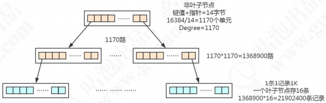
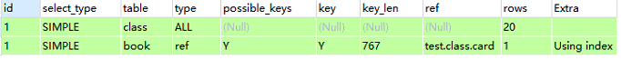
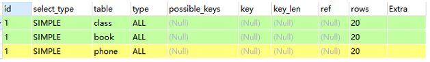
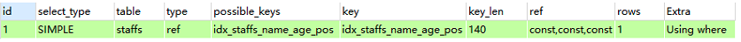
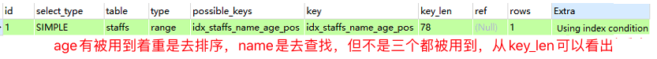
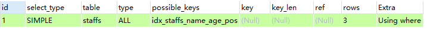

# 1 索引是什么

## 1.1 索引是什么

MySQL 官方对索引的定义为：``索引(Index)`` 是帮助 MySQL 高效获取数据的数据结构。

可以得到索引的本质：``索引是数据结构（排好序的快速查找数据结构）``。

索引的目的在于提高查询效率(where和order by)，可以类比字典。

首先数据是以文件的形式存放在磁盘上面的，每一行数据都有它的磁盘地址。如果没有索引的话，要从 500 万行数据里面检索一条数据，只能依次遍历这张表的全部数据， 直到找到这条数据。 

在数据之外，数据库系统还维护着满足特定查找算法的数据结构，这些数据结构以某种方式引用（指向）数据，这样就可以在这些数据结构上实现高级查找算法。这种数据结构就是索引。

下图索引方式实例，左边是数据表，一共两列七条记录，最左边是数据记录的物理地址：


为了加快 Col2 的查找，可以维护一个右边所示的二叉查找树，每个节点分别包含索引值和一个指向对应数据记录物理地址的指针，这样就可以运用二叉查找在一定的复杂度内获取到相应数据，从而快速的检索出符合条件的记录。

一般来说索引本身也很大，不可能全部存储在内存中，因此``索引往往以文件形式存储在硬盘上``。

## 1.2 索引类型

索引类型有三种，普通索引、唯一索引(主键索引是特殊的唯一 索引)、全文索引。

`普通(Normal)` 也叫非唯一索引，是最普通的索引，没有任何的限制

`唯一(Unique)` 唯一索引要求键值不能重复，但允许有空值。另外需要注意的是，主键索引是一 种特殊的唯一索引，它还多了一个限制条件，要求键值不能为空，主键索引用 primay key 创建。

`全文(Fulltext)`

我们平时所说的索引，如果没有特别指明，都是指B树(``多路搜索树``，并不一定是二叉树)结构组织的索引。其中``单值索引``(即一个索引只包含单个列，一个表可以有多个单列索引)，聚集索引，次要索引，覆盖索引，``复合索引``(即一个索引包含多个列)，前缀索引，唯一索引默认都是使用``B+ 树索引``，统称索引。当然除了B+ 树这种索引方法外，还有哈希索引(hash index)等。

```mysql
# 创建	indexName -> idx_*
CREATE [UNIQUE] INDEX indexName ON tableName(columnName(length));
ALTER TABLE tableName ADD [UNIQUE] INDEX [indexName] (columnName(length));
ALTER TABLE tb_emp ADD INDEX idx_name (name);

# 删除
DROP INDEX [indexName] ON tableName;

# 查看
SHOW INDEX FROM tableName;

# ALTER 有四种方式来添加数据库表的索引
# 该语句添加一个主键，这意味着索引值必须是唯一的，且不能为NULL
ALTER TABLE tableName ADD PRIMARY KEY (column_list);
# 该语句创建索引的值必须是唯一的（除了NULL之外，NULL可能会出现多次）
ALTER TABLE tableName ADD UNIQUE index_name (column_list);
# 该语句添加普通索引，索引值可以出现多次
ALTER TABLE tableName ADD INDEX index_name (column_list);
# 该语句指定了索引为FULLTEXT，用于全文索引
ALTER TABLE tableName ADD FULLTEXT index_name (column_list);
```

# 2 索引存储模型推演

## 2.1 二分查找

二分查找的思想，如果数据已经排过序的话，这种方式效率比较高。

有序数组的等值查询和比较查询效率非常高，但是更新数据的时候可能要挪动大量的数据(只适合存储静态的数据)。 

为了支持频繁的修改需要采用链表 — — `二叉查找树 Binary Search Tree`(单链表的查找效率还是不够高)。

## 2.2 二叉查找树 Binary Search Tree

左子树所有的节点都小于父节点，右子树所有的节点都大于父节点。投影到平面以后，就是一个有序的线性表。


二叉查找树既能够实现快速查找，又能够实现快速插入。

但是二叉查找树有一个问题：就是它的查找耗时是和这棵树的深度相关的，在最坏的情况下时间复杂度会退化成O(n)。

什么情况是最坏的情况呢？

> 我们打开这样一个网站来看一下，这里面有各种各样的数据结构的动态演示，包括 BST 二叉查找树
>
> https://www.cs.usfca.edu/~galles/visualization/Algorithms.html 

还是刚才的这一批数字，如果我们插入的数据刚好是有序的 2、6、11、13、17、 22


它会变成链表（我们把这种树叫做`斜树`），这种情况下不能达到加快检索速度的目的，和顺序查找效率是没有区别的。

**造成它倾斜的原因是什么呢？**

因为左右子树深度差太大，这棵树的左子树根本没有节点 — — 也就是它不够平衡。

所以我们有没有左右子树深度相差不是那么大，更加平衡的树呢？ 这个就是`平衡二叉树 Balanced binary search trees`。

> 或者叫 AVL 树（AVL 是 发明这个数据结构的人的名字）

## 2.3 平衡二叉树 Balanced binary search trees

平衡二叉树的定义：左右子树深度差绝对值不能超过 1。

是什么意思呢？比如左子树的深度是 2，右子树的深度只能是 1、2、3。 这个时候我们再按顺序插入 1、2、3、4、5、6，一定是这样，不会变成一棵“斜树”。

++++++++++++++++++++++++++++动图 TODO+++++++++++++++++++++++++++++++++++++++

平衡二叉树应该存储三块的内容： 

* `索引的键值` 比如我们在 id 上面创建了一个索引，我在用 where id =1 的 条件查询的时候就会找到索引里面的 id 的这个键值

* `数据的磁盘地址` 因为索引的作用就是去查找数据的存放的地址

* `左子节点和右子节点的引用` 这样我们才能找到下一个节点。比如大于 26 的时候，走右边到下一个树的节点继续判断


### 2.3.1 InnoDB 逻辑存储结构

MySQL 的存储结构分为 5 级：表空间、段、簇、页、行。


**表空间 Table Space**

`表空间`可以看做是 InnoDB 存储引擎逻辑结构的 最高层，所有的数据都存放在表空间中。分为：系统表空间、独占表空间、通用表空间、 临时表空间、Undo 表空间。

**段 Segment**

表空间是由各个`段`组成的，常见的段有数据段、索引段、回滚段等，段是一个逻辑的概念。一个 ibd 文件（独立表空间文件）里面会由很多个段组成。 

创建一个索引会创建两个段，一个是`索引段 leaf node segment`，一个是`数据段 non-leaf node segment`。索引段管理非叶子节点的数据，数据段管理叶子节点的数据。也就是说，一个表的段数就是索引的个数乘以 2。

**簇 Extent**

一个段（Segment）又由很多的`簇`（也可以叫区）组成，每个区的大小是 1MB（64 个连续的页）。

每一个段至少会有一个簇，一个段所管理的空间大小是无限的，可以一直扩展下去， 但是扩展的最小单位就是簇。

**页 Page**

簇是由连续的页组成的空间，一个簇中有 64 个连续的页(1MB／16KB=64)，这些页面在物理上和 逻辑上都是连续的。

每个页默认 `16KB`，`页是 InnoDB 存储引擎磁盘管理的最小单位`，通过 `innodb_page_size` 设置。

一个表空间最多拥有 2^32 个页，默认情况下一个页的大小为 16KB，也就是说一个 表空间最多存储 64TB 的数据。

### 2.3.2 平衡二叉树用于存储索引数据

当我们用树的结构来存储索引的时候，访问一个节点就要跟磁盘之间发生一次 IO。 

InnoDB 操作磁盘的最小的单位是`一页`(或者叫一个磁盘块)，大小是 16K(16384 字节)。<font color=red>那么一个树的节点就是 `16K` 的大小。</font>

如果我们一个节点只存一个键值 + 数据 + 引用，例如整形的字段，可能只用了十几个或者几十个字节，它远远达不到 16K 的容量，所以访问一个树节点进行一次 IO 的时候， 浪费了大量的空间。

所以如果每个节点存储的数据太少，从索引中找到我们需要的数据，就要访问更多的节点，意味着跟磁盘交互次数就会过多。 如果是机械硬盘时代，每次从磁盘读取数据需要 10ms 左右的寻址时间，交互次数越多，消耗的时间就越多。

所以我们的解决方案是什么呢？ 

* 让每个节点存储更多的数据

* 节点上的关键字的数量越多，我们的指针数也越多，也就是意味着可以有更多的分叉（我们把它叫做“路数”）

因为分叉数越多，树的深度就会减少(根节点是 0)。 这样我们的树是不是从原来的高瘦高瘦的样子，变成了矮胖矮胖的样子。这个时候，我们的树就不再是二叉了，而是多叉或者叫做多路。

## 2.4 多路平衡查找树 B Tree

`Balanced Tree 多路平衡查找树`叫做 B Tree（B 代表平衡）。 

跟平衡二叉树一样，B 树在枝节点和叶子节点存储键值、数据地址、节点引用。

它有一个特点：分叉数（路数）永远比关键字数多 1。比如我们画的这棵树，每个节点存储两个关键字，那么就会有三个指针指向三个子节点。


那 B Tree 又是怎么实现一个节点存储多个关键字，还保持平衡的呢？跟平衡二叉树有什么区别？

++++++++++++++++++++++++++++动图 TODO+++++++++++++++++++++++++++++++++++++++

从这个里面我们也能看到，在更新索引的时候会有大量的索引的结构的调整，所以解释了为什么我们不要在频繁更新的列上建索引，或者为什么不要更新主键。 

> 节点的分裂和合并，其实就是 InnoDB 页的分裂和合并。

## 2.5 B+ 树

总体上来说，这个 B 树的改良版本解决的问题比 B Tree 更全面。

B+ Tree索引的数据结构如下：


B+Tree 的几个主要特点：

1. ``路数`` 它的关键字的数量跟路数相等的

2. ``数据`` B+Tree 的根节点和枝节点中都不会存储数据，只有叶子节点才存储数据。搜索到关键字不会直接返回，会到最后一层的叶子节点

3. ``双向链表`` B+Tree 的每个叶子节点增加了一个指向相邻叶子节点的指针，它的最后一个数据会指向下一个叶子节点的第一个数据，形成了一个有序链表的结构

4. 它是根据左闭右开的区间 [ )来检索数据

> 假设一条记录是 1K，一个叶子节点(一页)可以存储 16 条记录。非叶子节点可以存储多少个指针？ 
>
> 假设索引字段是 bigint 类型，长度为 8 字节。指针大小在 InnoDB 源码中设置为 6 字节，这样一共 14 字节。非叶子节点(一页)可以存储 16384/14=1170 个这样的单元(键值+指针)，代表有 1170 个指针。
>
> 树深度为 2 的时候，有 1170^2 个叶子节点 ，可以存储的数据为 1170* 1170 * 16 = 21902400。
>
> 在查找数据时一次页的查找代表一次 IO，也就是说一张 2000 万左右的表，查询数据最多需要访问 3 次磁盘。 
>
> 所以在 InnoDB 中 B+ 树深度一般为 1-3 层，它就能满足千万级的数据存储。



了解基本结构后，下图展示定位数值82的过程：


演算如下：

读取root节点，判断82大于在0-120之间，走左边分支。

读取左边branch节点，判断82大于80且小于等于120，走右边分支。

读取右边leaf节点，在该节点中找到数据82及对应的rowid，使用rowid去物理表中读取记录数据块(如果是count或者只select rowid，则最后一次读取不需要)。

在整个索引定位过程中，数据块的读取只有3次，既三次I/O后定位到rowid。

而由于Btree索引对结构的利用率很高，定位高效。当1千万条数据时，Btree索引也是三层结构(依稀记得亿级数据才是3层与4层的分水岭)。定位记录仍只需要三次I/O，这便是开头所说的，100条数据和1千万条数据的定位，在btree索引中的花销是一样的。

### 平衡扩张

除了利用率高、定位高效外，Btree的另一个特点是能够永远保持平衡，这与它的扩张方式有关。(unbalanced和hotspot是两类问题，之前我一直混在一起)，先描述下Btree索引的扩张方式：

 新建一个索引，索引上只会有一个leaf节点，取名为Node A，不断的向这个leaf节点中插入数据后，直到这个节点满，这个过程如下图（绿色表示新建/空闲状态，红色表示节点没有空余空间）：


当Node A满之后，我们再向表中插入一条记录，此时索引就需要做拆分处理：会新分配两个数据块NodeB & C，如果新插入的值，大于当前最大值，则将Node A中的值全部插入Node B中，将新插入的值放到Node C中；否则按照5-5比例，将已有数据分别插入到NodeB与C中。

无论采用哪种分割方式，之前的leaf节点A，将变成一个root节点，保存两个范围条目，指向B与C，结构如下图（按第一种拆分形式）：


当Node C满之后，此时 Node A仍有空余空间存放条目，所以不需要再拆分，而只是新分配一个数据块Node D，将在Node A中创建指定到Node D的条目：


如果当根节点Node A也满了，则需要进一步拆分：新建Node E&F&G，将Node A中范围条目拆分到E&F两个节点中，并建立E&F到BCD节点的关联，向Node G插入索引值。此时E&F为branch节点，G为leaf节点，A为Root节点：


在整个扩张过程中，Btree自身总能保持平衡，Leaf节点的深度能一直保持一致。

### 单一方向扩展引起的索引竞争(Index Contention)

 若索引列使用sequence或者timestamp这类只增不减的数据类型。这种情况下Btree索引的增长方向总是不变的，不断的向右边扩展，因为新插入的值永远是最大的。

当一个最大值插入到leaf block中后，leaf block要向上传播，通知上层节点更新所对应的“值范围”条目中的最大值，因此所有靠右边的block(从leaf 到branch甚至root)都需要做更新操作，并且可能因为块写满后执行块拆分。

 如果并发插入多个最大值，则最右边索引数据块的的更新与拆分都会存在争抢，影响效率。在AWR报告中可以通过检测``enq: TX – index contention``事件的时间来评估争抢的影响。解决此类问题可以使用Reverse Index解决，不过会带来新的问题。

### Index Browning 索引枯萎

``Index Browning 索引枯萎``(不知道该怎么翻译这个名词，就是指leaves节点”死”了，树枯萎了)，其实oracle针对这个问题有优化机制，但优化的不彻底，所以还是要拿出来的说。

我们知道当``表中的数据删除后，索引上对应的索引值是不会删除的``，特别是在一性次删除大批量数据后，会造成大量的dead leaf挂到索引树上。考虑以下示例，如果表100以上的数据会部被删除了，但这些记录仍在索引中存在，此时若对该列取max()：


通过与之前相同演算，找到了索引树上最大的数据块，按照记录最大的值应该在这里，但发现这数据块里的数据已经被清空了，与是利用Btree索引的另一个特点：leaves节点是一个双向列表，若数据没有找到就去临近的一个数据块中看看，在这个数据块中发现了最大值99。

在计算最大值的过程中，这次的定位多加载了一个数据块，再极端的情况下，大批量的数据被删除，就会造成大量访问这些dead leaves。

针对这个问题的一般解决办法是重建索引，但记住! 重建索引并不是最优方案，详细原因可以看看这。使用coalesce语句来整理这些dead leaves到freelist中，就可以避免这些问题。理论上oracle中这步操作是可以自动完成的，但在实际中一次性大量删除数据后，oracle在短时间内是反应不过来的。

> 总结一下，InnoDB 中的 B+Tree 的特点： 
>
> * 它是 B Tree 的变种，B Tree 能解决的问题，它都能解决(每个节点存储更多关键字，路数更多)
>
> * 扫库、扫表能力更强（对表进行全表扫描，只需要遍历叶子节点，不需要遍历整棵树拿到所有的数据） 
>
> * B+Tree 的磁盘读写能力相对于 B Tree 来说更强（根节点和枝节点不保存数据区， 所以一个节点可以保存更多的关键字，一次磁盘加载的关键字更多） 
>
> * 排序能力更强（因为叶子节点上有下一个数据区的指针，数据形成了链表） 
>
> * 效率更加稳定（B+Tree 永远是在叶子节点拿到数据，所以 IO 次数是稳定的）

**为什么不用红黑树？**

1、只有两路；

2、不够平衡。

## 2.6 索引方式：真的是用的 B+Tree 吗 +++++++++++++++++++++++++++++++++

# 3 B+Tree 落地形式

## 3.1 MyISAM

在 MyISAM 里面，另外有两个文件：

`.MYD 文件` D 代表 Data，是 MyISAM 的数据文件，存放数据记录，比如我 们的 user_myisam 表的所有的表数据

`.MYI 文件` I 代表 Index，是 MyISAM 的索引文件，存放索引，比如我们在 id 字段上面创建了一个主键索引，那么主键索引就是在这个索引文件里面

那我们怎么根据索引找到数据呢？ 

MyISAM 的 B+Tree 里面，叶子节点存储的是数据文件对应的磁盘地址。所以从索引文件 MYI 中找到键值后，会到数据文件 MYD 中获取相应的数据记录。

在 MyISAM 里面，辅助索引也在这个 MYI 文件里面。一样是在索引文件 里面找到磁盘地址，然后到数据文件里面获取数据。


## 3.2 InnoDB

InnoDB 只有一个文件(`.ibd` 文件)，那索引放在哪里呢？

在 InnoDB 里面，它是以主键为索引来组织数据的存储的，所以索引文件和数据文件是同一个文件，都在 ibd 文件里面。

在 InnoDB 的主键索引的叶子节点上，它直接存储了我们的数据。

InnoDB 中，主键索引和辅助索引是有一个主次之分的。辅助索引存储的是辅助索引和主键值。如果使用辅助索引查询，查询后得到主键值后，在根据主键值在主键索引中查询，最终取得数据。


> 什么叫做聚集索引(聚簇索引)？
>
> 就是索引键值的逻辑顺序跟表数据行的物理存储顺序是一致的(比如字典的目录是按拼音排序的，内容也是按拼音排序的，按拼音排序的这种目录就叫聚集索引)。 在 InnoDB 里面，它组织数据的方式叫做叫做(聚集)索引组织表(clustered index organize table)，所以主键索引是聚集索引，非主键都是非聚集索引。 

**为什么在辅助索引里面存储的是主键值而不是主键的磁盘地址呢？**

B Tree 保持平衡要有分叉和合并的操作，这个时候键值的地址会发生变化，所以在辅助索引里面不能存储地址。

**另一个问题，如果一张表没有主键怎么办？**

1. 如果我们定义了主键(PRIMARY KEY)，那么 InnoDB 会选择主键作为聚集索引 

2. 如果没有显式定义主键，则 InnoDB 会选择第一个不包含有 NULL 值的唯一索引作为主键索引

3. 如果也没有这样的唯一索引，则 InnoDB 会选择内置 6 字节长的 ROWID 作为隐藏的聚集索引，它会随着行记录的写入而主键递增

```sql
select _rowid name from t_message;
```

# 4 索引优化分析

## 4.1 SQL 性能下降原因

查询语句写的烂

索引失效（单值、复合）

关联查询太多join（设计缺陷或不得已的需求）

服务器调优及各个参数设置（缓冲\线程数等）

## 4.2 常见通用 join 查询

### 4.2.1 SQL 执行顺序

```mysql
# 手写
SELECT DISTINCT
	<select_list>
FROM
	<left_table> <join_type> JOIN <right_table> ON <join_condition>
WHERE
	<where_condition>
GROUP_BY
	<group_by_list>
HAVING
	<having_condition>
ORDER BY
	<order_by_condition>
LIMIT <limit_number>

# 机读
FROM <left_table> 
ON <join_condition>
<join_type> JOIN <right_table> 
WHERE <where_condition>
GROUP_BY <group_by_list>
HAVING <having_condition>
SELECT
DISTINCT <select_list>
ORDER BY <order_by_condition>
LIMIT <limit_number>
```


### 4.2.2 JOIN 图


### 4.2.3 7种 JOIN

```mysql
# 基础数据
DROP TABLE IF EXISTS `tb_dept`;
CREATE TABLE `tb_dept` (
  `id` int(11) NOT NULL AUTO_INCREMENT,
  `deptName` varchar(255) DEFAULT NULL,
  `locADD` varchar(255) DEFAULT NULL,
  PRIMARY KEY (`id`)
) ENGINE=InnoDB AUTO_INCREMENT=6 DEFAULT CHARSET=utf8;

INSERT INTO `tb_dept` VALUES ('1', 'RD', '11');
INSERT INTO `tb_dept` VALUES ('2', 'HR', '12');
INSERT INTO `tb_dept` VALUES ('3', 'MK', '13');
INSERT INTO `tb_dept` VALUES ('4', 'MIS', '14');
INSERT INTO `tb_dept` VALUES ('5', 'FD', '15');

DROP TABLE IF EXISTS `tb_emp`;
CREATE TABLE `tb_emp` (
  `id` int(11) NOT NULL AUTO_INCREMENT,
  `name` varchar(255) DEFAULT NULL,
  `deptId` int(11) DEFAULT NULL,
  PRIMARY KEY (`id`)
) ENGINE=InnoDB AUTO_INCREMENT=9 DEFAULT CHARSET=utf8;

INSERT INTO `tb_emp` VALUES ('1', 'z3', '1');
INSERT INTO `tb_emp` VALUES ('2', 'z4', '2');
INSERT INTO `tb_emp` VALUES ('3', 'z5', '3');
INSERT INTO `tb_emp` VALUES ('4', 'w5', '2');
INSERT INTO `tb_emp` VALUES ('5', 'w6', '2');
INSERT INTO `tb_emp` VALUES ('6', 's7', '3');
INSERT INTO `tb_emp` VALUES ('7', 's8', '4');
INSERT INTO `tb_emp` VALUES ('8', 's9', '51');

# 内连接(两表的共有部分)
SELECT * FROM tb_emp te INNER JOIN tb_dept td ON te.deptId = td.id;

# 左连接（左表的全部，右表不满足补NULL）
SELECT * FROM tb_emp te LEFT JOIN tb_dept td ON te.deptId = td.id;

# 右连接（右表的全部，左表不满足的补NULL）
SELECT * FROM tb_emp te RIGHT JOIN tb_dept td ON te.deptId = td.id;

# 特殊的左连接（显示为左表的独有的数据）
# 说明：查询tb_emp 表中跟tb_dept 表无关联关系的数据，即tb_emp 独占，且tb_dept 表的显示列补NULL
SELECT * FROM tb_emp te LEFT JOIN tb_dept td ON te.deptId = td.id WHERE td.id IS NULL;

# 特殊的右连接（显示为右表的独有的数据 ）
# 说明：查询tb_dept 表中跟tb_emp 表无关联关系的数据，即tb_dept 独占，且tb_emp 表的显示列补NULL
SELECT * FROM tb_emp te RIGHT JOIN tb_dept td ON te.deptId = td.id WHERE te.deptId IS NULL;

# 全连接（显示全部数据）（mysql 不支持 full outer join）
# UNION ：有去重的功能。
SELECT * FROM tb_emp te LEFT JOIN tb_dept td ON te.deptId = td.id
UNION
SELECT * FROM tb_emp te RIGHT JOIN tb_dept td ON te.deptId = td.id;

# 显示两表的独有的数据
SELECT * FROM tb_emp te LEFT JOIN tb_dept td ON te.deptId = td.id WHERE td.id IS NULL
UNION
SELECT * FROM tb_emp te RIGHT JOIN tb_dept td ON te.deptId = td.id WHERE te.deptId IS NULL;
```

# 5 索引使用原则

## 5.1 列的离散（sàn）度

## 5.2 索引分析

### 单表

```mysql
CREATE TABLE `article` (
  `id` int(10) NOT NULL AUTO_INCREMENT,
  `author_id` int(10) NOT NULL,
  `category_id` int(10) NOT NULL,
  `views` int(10) NOT NULL,
  `comments` int(10) NOT NULL,
  `title` varchar(255) NOT NULL,
  `content` text NOT NULL,
  PRIMARY KEY (`id`)
) ENGINE=InnoDB AUTO_INCREMENT=4 DEFAULT CHARSET=utf8;

INSERT INTO `article` VALUES ('1', '1', '1', '1', '1', '1', '1');
INSERT INTO `article` VALUES ('2', '2', '2', '2', '2', '2', '2');
INSERT INTO `article` VALUES ('3', '1', '1', '3', '3', '3', '3');

# 查询 category_id 为1且comments大于1的情况下，views最多的article_id
EXPLAIN SELECT * FROM article WHERE category_id = 1 AND comments > 1 ORDER BY views DESC LIMIT 1;
```


type 是 ALL，最坏的情况。Extra 里还出现了 Using filesort，也是最坏的情况，优化是必须的。

```mysql
# 创建索引
create index idx_article_cv on article(category_id,comments,views);
# 查看索引
SHOW INDEX FROM article;
# 执行 EXPLAIN
```


extra 里仍然使用了 Using filesort，但是建立的索引为什么没用？

这里因为按照BTree 索引的工作原理，先排序 category_id，如果遇到相同的category_id则再排序comments，如果遇到相同的comments则再排序 views。

当 comments 字段在联合索引里处于中间位置时，因 comments > 1条件是一个范围（所谓 range），MySQL无法利用索引在对后面的 views 部分进行索引，即 range类型查询字段后面的索引无效。

```mysql
# 删除索引
DROP INDEX idx_article_cv ON article;
# 重新建立索引
create index idx_article_cv on article(category_id,views);
# 执行 EXPLAIN
```


可以看到，type变为了ref，extra中的using filesort消失了，结果非常理想。

### 双表

```mysql
CREATE TABLE `book` (
  `bookid` int(11) NOT NULL AUTO_INCREMENT,
  `card` varchar(255) NOT NULL,
  PRIMARY KEY (`bookid`)
) ENGINE=InnoDB AUTO_INCREMENT=21 DEFAULT CHARSET=utf8;

DROP TABLE IF EXISTS `class`;
CREATE TABLE `class` (
  `id` int(11) NOT NULL AUTO_INCREMENT,
  `card` varchar(255) NOT NULL,
  PRIMARY KEY (`id`)
) ENGINE=InnoDB AUTO_INCREMENT=41 DEFAULT CHARSET=utf8;

#20次
insert into book(card) values (FLOOR(1 + (RAND() * 20)));
insert into class(card) values (FLOOR(1 + (RAND() * 20)));

explain select * from class left join book on book.card = class.card;
```


```mysql
# 测试 左连接 右边表添加索引
# 即为 book 表的外键 card 创建索引 Y
ALTER TABLE book ADD INDEX Y(card);
```



```mysql
# 测试 左连接 左边表添加索引
# 即为 card 表的外键 card 创建索引 Y
DROP INDEX Y ON book;
ALTER TABLE class ADD INDEX Y (card);
```


可以看出左连接右边表添加索引，type变为ref，rows也变成了优化比较明显。

这是由左连接特性决定的，LEFT JOIN 条件用于确定如何从右表搜索行，左边一定都有，所以右边是我们的关键点，一定需要建立索引。

```mysql
# 由此可知，右连接应该在左表建立索引
DROP INDEX Y ON class;
ALTER TABLE class ADD INDEX Y (card);
explain select * from class right join book on book.card = class.card;
```


优化较明显，这是因为 RIGHT JOIN 条件用于确定如何从左表搜索行，右边一定都有，所以左边是我们的关键点，一定需要建立索引。

### 三表

```mysql
# 删除所有索引，创建新表 phone
CREATE TABLE `phone` (
  `id` int(11) NOT NULL AUTO_INCREMENT,
  `card` int(11) NOT NULL,
  PRIMARY KEY (`id`)
) ENGINE=InnoDB AUTO_INCREMENT=21 DEFAULT CHARSET=utf8;
#20次
insert into phone(card) values (FLOOR(1 + (RAND() * 20)));

explain select * from class inner join book on class.card = book.card inner join phone on book.card = phone.card;
```


```mysql
explain select * from class left join book on class.card = book.card left join phone on book.card = phone.card;
```



```mysql
# 依照左链接准则，建立两个索引
ALTER TABLE book ADD INDEX Y(card);
ALTER TABLE phone ADD INDEX Z(card);
```


后两行的 type 都是 ref 且总 rows 优化很好，效果不错。因此索引最好设置在需要经常查询的字段中。

### 结论

Join 语句的优化：

尽可能减少Join语句中的``NestedLoop(嵌套循环)``的循环总次数：``“永远用小结果集驱动大的结果集”``。

优先优化嵌套循环的内层循环：保证Join语句中被驱动表上Join条件字段已经被索引。

当无法保证被驱动表的Join条件字段被索引且内存资源充足的前提下，不要太吝惜``JoinBuffer``的设置。

## 5.3 索引失效

```mysql
CREATE TABLE `staffs` (
	`id` int(11) NOT NULL AUTO_INCREMENT,
  `name` varchar(24) NOT NULL COMMENT '姓名',
  `age` int(11) NOT NULL DEFAULT '0' COMMENT '年龄',
  `pos` varchar(20) NOT NULL COMMENT '职位',
  `add_time` timestamp NOT NULL DEFAULT CURRENT_TIMESTAMP COMMENT '入职时间',
  PRIMARY KEY (`id`)
) ENGINE=InnoDB AUTO_INCREMENT=4 DEFAULT CHARSET=utf8;

INSERT INTO staffs(name, age, pos, add_time) VALUES('z3', 22, 'manager', NOW());
INSERT INTO staffs(name, age, pos, add_time) VALUES('July', 23, 'dev', NOW());
INSERT INTO staffs(name, age, pos, add_time) VALUES('2000', 23, 'dev', NOW());

ALTER TABLE staffs ADD INDEX idx_staffs_name_age_pos(name, age, pos);
```

### 1.全值匹配

```mysql
EXPLAIN SELECT * FROM staffs WHERE name = 'July';
```


```mysql
EXPLAIN SELECT * FROM staffs WHERE name = 'July' AND age = 23;
```


```mysql
EXPLAIN SELECT * FROM staffs WHERE name = 'July' AND age = 23 AND pos = 'dev';
```



### 2.最佳左前缀法则

① 带头大哥不能死

② 中间兄弟不能断

```mysql
EXPLAIN SELECT * FROM staffs WHERE age = 23 AND pos = 'dev';
```


```mysql
EXPLAIN SELECT * FROM staffs WHERE age = 23;
```


```mysql
EXPLAIN SELECT * FROM staffs WHERE name = 'July' AND pos = 'dev';
```


如果索引了多例，要遵守最左前缀法则。指的是``查询从索引的最左前列开始并且不跳过索引中的列``。

### 3.索引列不要做任何操作

③ 索引列上无计算

不在索引列上做任何操作（计算、函数、（自动or手动）类型转换），会导致索引失效而转向全表扫描。

```mysql
EXPLAIN SELECT * FROM staffs WHERE left(name, 4) = 'July';
```


### 4.存储引擎不能使用索引中范围条件右边的列

④ 范围之后全失效

```mysql
EXPLAIN SELECT * FROM staffs WHERE name = 'July' AND age > 11 AND pos = 'manager';
```



### 5.尽量使用覆盖索引

尽量使用覆盖索引（只访问索引的查询（索引列和查询列一致）），减少select *

```mysql
EXPLAIN SELECT name, age, pos FROM staffs WHERE name = 'July' AND age = 23 AND pos = 'dev';
```


```mysql
EXPLAIN SELECT name, age, pos FROM staffs WHERE name = 'July' AND age > 11 AND pos = 'manager';
```


同时，如果只查询索引列的部分字段，同样可以使用 using index，但是如果查询索引列以外的字段，则不会用到 using index。

### 6.!=和<>

mysql在使用不等于（!=或者<>）的时候无法使用索引会导致全表扫描

```mysql
EXPLAIN SELECT * FROM staffs WHERE name != 'July' AND age = 11 AND pos = 'manager';
```


### 7.is null 和 is not null

is null,is not null 也无法使用索引

```mysql
EXPLAIN SELECT * FROM staffs WHERE name is null;
```


```mysql
EXPLAIN SELECT * FROM staffs WHERE name is not null;
```


### 8.like

⑤ 百分like加右边 

like以通配符开头（'%abc...'）mysql索引失效会变成全表扫描操作

```mysql
explain select * from staffs where name like '%July%';
# '%July' 同
```


```mysql
explain select * from staffs where name like 'July%';
```


问题：解决like '%字符串%' 索引不被使用的方法？？

```mysql
CREATE TABLE `tb_user` (
  `id` int(11) NOT NULL AUTO_INCREMENT,
  `name` varchar(20) DEFAULT NULL,
  `age` int(11) DEFAULT NULL,
  `email` varchar(20) DEFAULT NULL,
  PRIMARY KEY (`id`)
) ENGINE=InnoDB AUTO_INCREMENT=5 DEFAULT CHARSET=utf8;

INSERT INTO tb_user(name,age,email) VALUES('1aa1', 21, 'b@163.com');
INSERT INTO tb_user(name,age,email) VALUES('2aa2', 222, 'a@163.com');
INSERT INTO tb_user(name,age,email) VALUES('3aa3', 265, 'c@163.com');
INSERT INTO tb_user(name,age,email) VALUES('4aa4', 21, 'c@163.com');

CREATE INDEX idx_user_name_age ON tb_user(name, age);

# 索引未失效
explain select name, age from tb_user where name like '%aa%';
explain select id from tb_user where name like '%aa%';
explain select name from tb_user where name like '%aa%';
explain select age from tb_user where name like '%aa%';
explain select id, name from tb_user where name like '%aa%';
explain select id, name, age from tb_user where name like '%aa%';
explain select name, age from tb_user where name like '%aa%';
# 索引失效
explain select * from tb_user where name like '%aa%';
explain select id, name, age, email from tb_user where name like '%aa%';
```

1、可以使用主键索引
2、使用覆盖索引，查询字段必须是建立覆盖索引字段
3、当覆盖索引指向的字段是varchar(380)及380以上的字段时，覆盖索引会失效！

### 9.字符串不加单引号索引失效

⑥ 字符串里有引号

```mysql
explain select * from staffs where name = 2000;
```


```mysql
explain select * from staffs where name = '2000';
```


### 10.少用or

用or连接时会索引失效

```mysql
explain select * from staffs where name = 'July' or name = 'z3';
```



### 小结


【优化总结口诀】
全值匹配我最爱，最左前缀要遵守；
带头大哥不能死，中间兄弟不能断；
索引列上少计算，范围之后全失效；
LIKE百分写最右，覆盖索引不写星；
不等空值还有or，索引失效要少用；
VAR引号不可丢，SQL高级也不难！ 

### 一般性建议

对于单键索引，尽量选择针对当前query过滤性更好的索引；

在选择组合索引的时候，当前Query中过滤性最好的字段在索引字段顺序中，位置越靠前越好；

在选择组合索引的时候，尽量选择可以能包含当前query中的where子句中更多字段的索引，尽可能通过分析统计信息和调整query的写法来达到选择合适索引的目的。

# 6 索引的使用

##  6.1 索引优势

1. 提高数据检索效率，降低数据库的IO成本

2. 通过索引列对数据进行排序，降低数据排序的成本，降低了CPU的消耗

## 6.2 索引劣势

1. 实际上索引也是一张表，该表保存了主键和索引字段，并指向实体表的记录,所以索引列也是要占用空间的

2. 虽然索引大大提高了查询速度，同时却会降低更新表的速度,如果对表INSERT,UPDATE和DELETE。
   因为更新表时，MySQL不仅要不存数据，还要保存一下索引文件每次更新添加了索引列的字段，都会调整因为更新所带来的键值变化后的索引信息

3. 索引只是提高效率的一个因素，如果你的MySQL有大数据量的表，就需要花时间研究建立优秀的索引，或优化查询语句

## 6.3 需要创建索引的情况

1. 主键自动建立唯一索引
2. 频繁作为查询的条件的字段应该创建索引
3. 查询中与其他表关联的字段，外键关系建立索引
4. 频繁更新的字段不适合创建索引，因为每次更新不单单是更新了记录还会更新索引，加重IO负担
5. Where条件里用不到的字段不创建索引
6. 单间/组合索引的选择问题，who？（在高并发下倾向创建组合索引）
7. 查询中排序的字段，排序字段若通过索引去访问将大大提高排序的速度
8. 查询中统计或者分组字段

## 6.4 不要创建索引的情况

1. 表记录太少
2. 经常增删改的表
3. 数据重复且分布平均的表字段，因此应该只为经常查询和经常排序的数据列建立索引。 注意，如果某个数据列包含许多重复的内容，为它建立索引就没有太大的实际效果。

假如一个表有10万条记录，有一个字段A只有T和F两种值，且每个值的分布概率大概为50%，那么对这种表A字段建索引一般不会提高数据库的查询速度。

索引的选择性是指索引列中不同值的数目与表中记录数的比。如果一个表中有2000条记录，表索引列有1980个不同的值，那么这个索引的选择性就是1980/2000=0.99。一个索引的选择性越接近1，这个索引的效率就越高。

------

