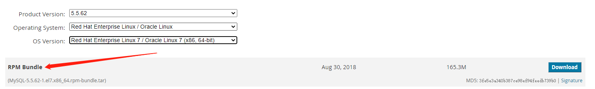
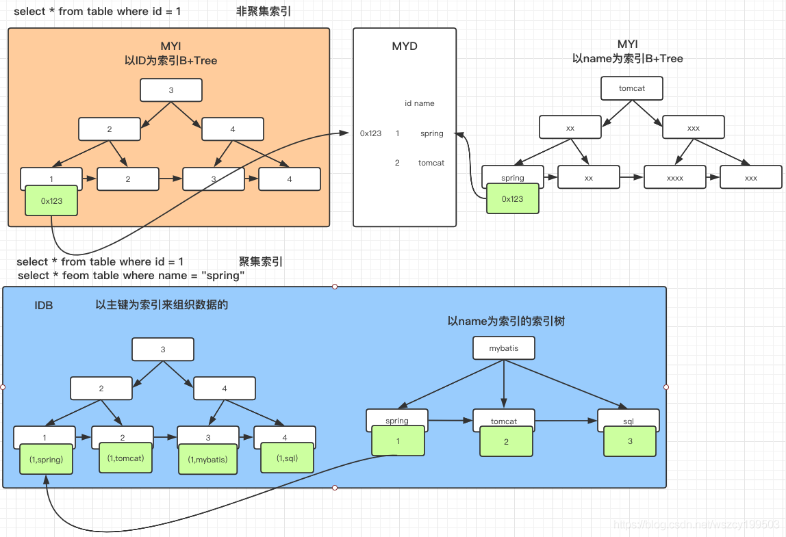
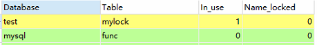
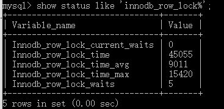

## 1 认识 MySQL

1985年，瑞典的几位志同道合小伙子(以 David Axmark 为首)成立了一 家公司，这就是 MySQL AB 的前身。这个公司最初并不是为了开发数据库产品，而是在实现他们想法的过程中，需要一个数据库。他们希望能够使用开源的产品。但在当时并没一个合适的选择，没办法，那就自己开发吧。

## 2 MySQL 下载安装

下载地址：https://dev.mysql.com/ »  [MySQL Downloads](https://dev.mysql.com/downloads/) » [MySQL Community Server](https://dev.mysql.com/downloads/mysql/)

选择合适的MySQL版本，操作系统以及操作系统版本，下载，这里以 [rpm-bundle](https://cdn.mysql.com/archives/mysql-5.5/MySQL-5.5.62-1.el7.x86_64.rpm-bundle.tar) 为例。

下载得到 MySQL-5.5.62-1.el7.x86_64.rpm-bundle.tar



### 2.1 MySQL 安装流程

```markdown
# 1.将 tar 文件上传至 Linux 服务器 /usr/local/mysql 下
# 2.检查是否已经存在mysql，若存在卸载，避免安装时产生一些错误
	rpm -qa | grep -i mysql

# 3.解压缩安装包
	tar -xvf  MySQL-5.5.62-1.el7.x86_64.rpm-bundle.tar 
	得到文件：
		MySQL-devel-5.5.62-1.el7.x86_64.rpm
		MySQL-embedded-5.5.62-1.el7.x86_64.rpm
		MySQL-shared-5.5.62-1.el7.x86_64.rpm
		MySQL-test-5.5.62-1.el7.x86_64.rpm
		MySQL-server-5.5.62-1.el7.x86_64.rpm
		MySQL-shared-compat-5.5.62-1.el7.x86_64.rpm
		MySQL-client-5.5.62-1.el7.x86_64.rpm
# 4.安装mysql
	rpm -ivh MySQL-server-5.5.62-1.el7.x86_64.rpm
	错误1：
		警告：MySQL-server-5.5.62-1.el7.x86_64.rpm: 头V3 DSA/SHA1 Signature, 密钥 ID 5072e1f5: NOKEY
		错误：依赖检测失败：
			net-tools 被 MySQL-server-5.5.62-1.el7.x86_64 需要
			perl(Data::Dumper) 被 MySQL-server-5.5.62-1.el7.x86_64 需要
		解决方法：
		yum -y install net-tools
		yum -y install perl
		yum -y install autoconf
	错误2：
		file /usr/share/mysql/charsets/README from install of MySQL-server-5.5.62-1.el7.x86_64 conflicts with file from package mariadb-libs-1:5.5.64-1.el7.x86_64
		此报错是说mysql安装包与mariadb包冲突，那么那么只要删除mariadb包即可。
		解决方法：
		rpm -qa|grep -i mariadb
			mariadb-libs-5.5.64-1.el7.x86_64
		yum remove mariadb-libs-5.5.64-1.el7.x86_64

# 5.启动 MySQL
	service mysql start

# 6.设置帐号密码
	mysqladmin -u root password root
    mysql
		ERROR 1045 (28000): Access denied for user 'root'@'localhost' (using password: NO)

# 7.连接数据库
	 mysql -u root -p

# 8.授权远程连接
	use mysql;
	# 下面语句可能会报错，不用关心
	update user set host = '%' where user = 'root';
	# 刷新权限
	FLUSH PRIVILEGES;

# 9.设置开机自启动mysql
	chkconfig mysql on
	chkconfig --list|grep mysql
		mysql          	0:关	1:关	2:开	3:开	4:开	5:开	6:关
```

### 2.2 MySQL 安装完成相关命令

```markdown
# 查看Mysql安装时创建的mysql用户和mysql组
	cat /etc/passwd | grep mysql
		mysql:x:996:993:MySQL server:/var/lib/mysql:/bin/bash
	cat /etc/group | grep mysql
		mysql:x:993:

# 查看 MySQL 版本
	mysqladmin --version
		mysqladmin  Ver 8.42 Distrib 5.5.62, for Linux on x86_64

# MySQL 服务启停
	service mysql start
	service mysql stop

# 连接数据库
	mysql -u root -p

# Mysql的安装位置
	ps -ef | grep mysql
		root       2928      1  0 13:51 ?        00:00:00 /bin/sh /usr/bin/mysqld_safe --datadir=/var/lib/mysql --pid-file=/var/lib/mysql/localhost.localdomain.pid
	mysql      3014   2928  0 13:51 ?        00:00:00 /usr/sbin/mysqld --basedir=/usr --datadir=/var/lib/mysql --plugin-dir=/usr/lib64/mysql/plugin --user=mysql --log-error=localhost.localdomain.err --pid-file=/var/lib/mysql/localhost.localdomain.pid
```

### 2.3 修改字符集和数据存储路径

```mysql
# 查看当前字符集
show variables like '%char%';
```


数据库和服务端的字符集默认都是latin1，中文会乱码。

```markdown
# Linux 自定义配置文件 5.5版本 /usr/share/mysql/my-huge.cnf 之后版本 /usr/share/mysql/my-default.cnf
# 复制 配置文件到 /etc/my.cnf
	cp /usr/share//mysql/my-huge.cnf /etc/my.cnf
# 重启mysql
	service mysql stop
	service mysql start

[client]
default-character-set=utf8

[mysqld]
character_set_server=utf8
character_set_client=utf8
collation-server=utf8_general_ci
# (注意linux下mysql安装完默认：表名区分大小写，列名不区分大小写；0:区分大小写，1:不区分大小写)
lower_case_table_names=1
# (设置最大连接数，默认为151，mysql服务器允许最大连接数16384)
max_connections=1000
# 二进制日志配置 log-bin=''
# 错误日志配置 log-err=''

[mysql]
default-character-set=utf8

# 修改之后新建的数据库才会应用新的字符集配置
```

### 2.4 主要配置文件

``二进制日志log-bin`` 主从复制

``错误日志log-error`` 默认是关闭的,记录严重的警告和错误信息,每次启动和关闭的详细信息等

``查询日志log`` 默认关闭,记录查询的sql语句，如果开启会减低mysql的整体性能，因为记录日志也是需要消耗系统资源的

#### 数据文件

两系统：

windows C:\ProgramFiles\MySQL\MySQLServer5.5\data

linux /var/lib/mysql

``frm文件`` 存放表结构

``myd文件`` 存放表数据

``myi文件`` 存放表索引

## 3 MySQL 逻辑架构

和其他数据库相比，MySQL架构可以在多种不同场景中应用并发挥良好作用。主要体现在存储引擎的架构上，``插件式的存储引擎架构将查询处理和其他的系统任务以及数据的存储提取相分离``。这种架构可以根据业务的需求和实际需要选择合适的存储引擎。

  

 											


### 3.1 连接层

最上层是一些客户端和连接服务，包含本地sock通信和大多数基于客户端/服务端实现的类似于tcp/ip的通信。主要完成一些类似于连接处理、授权认证及相关的安全方案。在该层上引入了线程池的概念，为通过认证安全接入的客户端提供线程。同样在该层上可以实现基于SSL的安全链接。服务器也会为安全接入的每个客户端验证它所有的操作权限。

``Connectors`` 指的是不同语言中与SQL的交互

``Management Serveices & Utilities`` 系统管理和控制工具

``Connection Pool 连接池`` 管理缓冲用户连接，线程处理等需要缓存的需求。

负责监听对 MySQL Server 的各种请求，接收连接请求，转发所有连接请求到线程管理模块。每一个连接上 MySQL Server 的客户端请求都会被分配（或创建）一个连接线程为其单独服务。而连接线程的主要工作就是负责 MySQL Server 与客户端的通信，接受客户端的命令请求，传递 Server 端的结果信息等。线程管理模块则负责管理维护这些连接线程。包括线程的创建，线程的 cache 等。

### 3.2 服务层

第二层架构主要完成大多数的核心服务功能，如SQL接口，并完成缓存的查询，SQL的分析和优化及部分内置函数的执行，所有跨存储引擎的功能也在这一层实现，如过程、函数等。在该层，服务器会解析查询并创建相应的内部解析树，并对其完成相应的优化如确定查询表的顺序，是否利用索引等，最后生成相应的执行操作。如果是select语句，服务器还会查询内部的缓存，如果缓存空间足够大，这样在解决大量读操作的环境中能够很好的提升系统性能。

``SQL Interface: SQL 接口`` 接受用户的SQL命令，并且返回用户需要查询的结果。比如select from就是调用SQL Interface

``Parser: 解析器`` SQL命令传递到解析器的时候会被解析器验证和解析。解析器是由Lex和YACC实现的，是一个很长的脚本。

在 MySQL中我们习惯将所有 Client 端发送给 Server 端的命令都称为 query ，在 MySQL Server 里面，连接线程接收到客户端的一个 Query 后，会直接将该 query 传递给专门负责将各种 Query 进行分类然后转发给各个对应的处理模块。

主要功能：

1. 将SQL语句进行语义和语法的分析，分解成数据结构，然后按照不同的操作类型进行分类，然后做出针对性的转发到后续步骤，以后SQL语句的传递和处理就是基于这个结构的。

2. 如果在分解构成中遇到错误，那么就说明这个sql语句是不合理的

``Optimizer: 查询优化器`` SQL语句在查询之前会使用查询优化器对查询进行优化。就是优化客户端请求的 query（sql语句） ，根据客户端请求的 query 语句，和数据库中的一些统计信息，在一系列算法的基础上进行分析，得出一个最优的策略，告诉后面的程序如何取得这个 query 语句的结果

他使用的是“选取-投影-联接”策略进行查询。

​    用一个例子就可以理解： select uid,name from user where gender = 1;

​    这个select 查询先根据where 语句进行选取，而不是先将表全部查询出来以后再进行gender过滤

​    这个select查询先根据uid和name进行属性投影，而不是将属性全部取出以后再进行过滤

​    将这两个查询条件联接起来生成最终查询结果

``Cache和Buffer：查询缓存`` 他的主要功能是将客户端提交 给MySQL 的 Select 类 query 请求的返回结果集 cache 到内存中，与该 query 的一个 hash 值 做一个对应。该 Query 所取数据的基表发生任何数据的变化之后， MySQL 会自动使该 query 的Cache 失效。在读写比例非常高的应用系统中， Query Cache 对性能的提高是非常显著的。当然它对内存的消耗也是非常大的。

如果查询缓存有命中的查询结果，查询语句就可以直接去查询缓存中取数据。这个缓存机制是由一系列小缓存组成的。比如表缓存，记录缓存，key缓存，权限缓存等

### 3.3 引擎层

存储引擎层，存储引擎真正的负责了MySQL中数据的存储和提取，服务器通过API与存储进行通信，不同的存储引擎具有的功能不同，这样可以根据自己的实际需要进行选取。

``存储引擎接口`` 存储引擎接口模块可以说是 MySQL 数据库中最有特色的一点了。目前各种数据库产品中，基本上只有 MySQL 可以实现其底层数据存储引擎的插件式管理。这个模块实际上只是 一个抽象类，但正是因为它成功地将各种数据处理高度抽象化，才成就了今天 MySQL 可插拔存储引擎的特色。

MySQL区别于其他数据库的最重要的特点就是其插件式的表存储引擎。MySQL插件式的存储引擎架构提供了一系列标准的管理和服务支持，这些标准与存储引擎本身无关，可能是每个数据库系统本身都必需的，如SQL分析器和优化器等，而存储引擎是底层物理结构的实现，每个存储引擎开发者都可以按照自己的意愿来进行开发。

注意：存储引擎是基于表的，而不是数据库。

### 3.4 存储层

数据存储层，主要是将数据存储在运行于裸设备的文件系统之上，并完成于存储引擎的交互。

## 4 存储引擎

```mysql
# 查看MySQL现在提供什么存储引擎
show engines
# 查看当前存储引擎
show variables like '%storage_engine%'
```

#### 4.1 MyISAM 和 InnoDB

| 对比项 | MyISAM                                                     | InnoDB                                                       |
| ------ | ---------------------------------------------------------- | ------------------------------------------------------------ |
| 主外键 | 不支持                                                     | 支持                                                         |
| 事务   | 不支持                                                     | 支持                                                         |
| 行表锁 | 表锁，即使操作一条记录也会锁住整个表<br>不适合高并发的操作 | 行锁，操作时只锁某一行，不对其他行有影响<br>适合高并发操作   |
| 表空间 | 小                                                         | 大                                                           |
| 关注点 | 性能                                                       | 事务                                                         |
| 缓存   | 只缓存索引，不缓存缓存真实数据                             | 不仅缓存索引还要缓存真实数据<br>对内存要求较高，而且内存对性能有决定性影响 |
| 总行数 | 存储                                                       | 不存储                                                       |
| 索引   | 非聚集索引<br>支持全文索引，查询效率上MyISAM要高           | 聚集索引(索引的数据域存储数据文件本身)<br>不支持全文索引     |
| 持久化 | 一个表三个文件（索引文件，表结构文件，数据文件）           | 表空间                                                       |



## 5 性能优化

### 5.1 MySQL Query Optimizer

MySQL 中有专门负责优化SELECT语句的优化器模块，主要功能：通过计算分析系统中收集到的统计信息，为客户端请求的Query提供它认为最优的执行计划（它认为最优的数据检索方式，但不见得是DBA认为是最优的，这部分最耗费时间）。

当客户端向MySQL请求一条Query，命令解析器模块完成请求分类，区别出是SELECT并转发给MySQL Query Optimizer时，MySQL Query Optimizer 首先会对整条Query进行优化，处理掉一些常量表达式的预算，直接换算成常量值。并对 Query 中的查询条件进行简化和转换，如去掉一些无用或显而易见的条件、结构调整等。然后分析 Query 中的 Hint 信息（如果有），看显示Hint信息是否可以完全确定该Query的执行计划。如果没有Hint或Hint信息还不足以完全确定执行计划，则会读取所涉及对象的统计信息，根据Query进行写相应的计算分析，然后再得出最后的执行计划。

### 5.2 MySQL 常见性能瓶颈

``CPU`` CPU在饱和的时候一般发生在数据装入在内存或从磁盘上读取数据时候

``IO`` 磁盘I/O瓶颈发生在装入数据远大于内存容量时

``服务器硬件的性能瓶颈`` top,free,iostat和vmstat来查看系统的性能状态

### 5.3 EXPLAIN

``EXPLAIN(执行计划)`` 用EXPLAIN关键字可以模拟优化器执行SQL语句，从而知道MySQL是如何处理你的SQL语句的。

分析你的查询语句或是结构的性能瓶颈，主要功能：

* 表的读取顺序
* 数据读取操作的操作类型
* 哪些索引可以使用
* 哪些索引被实际使用
* 表之间的引用
* 每张表有多少行被优化器查询

``QEP(Query Execution Plan)`` 打印执行计划，加上 explain：

```mysql
EXPLAIN SELECT * FROM user
```


#### id

select 查询的序列号，包含一组数字，表示查询中执行select子句或操作表的顺序。

id相同，执行顺序由上至下：


id不同，如果是子查询，id的序号会递增，id值越大优先级越高，越先被执行：


id相同不同同时存在：


id如果相同，可以认为是一组，从上往下执行；在所有组中，id值越大，优先级越高，越先执行。

``derived 衍生``

#### select_type

查询的类型，主要用于区别普通查询、联合查询、子查询等的复杂查询，主要有以下这几种查询类型：

* ``SIMPLE`` 简单的 select 查询，不包含子查询或 UNION
* ``PRIMARY`` 查询中若包含任何复杂的子查询，最外层查询则被标记为PRIMARY 

 - ``SUBQUERY``  在select 或 where 列表中包含了子查询
 - ``DERIVED`` 在from列表中包含的子查询被标记为DETIVED，MySQL 会递归执行这些子查询，把结果放在临时表里 
  - ``UNION`` 若第二个 select 出现在 UNION 之后，则被标记为 UNION；若UNION包含在FROM子句的子查询中，外层 select 将被标记为：DERIVED
  - ``UNION RESULT`` 从 UNION 表获取结果的 select 

#### table

显示这一行的数据的表的名称 

#### type

访问类型，显示查询使用了何种类型。

从最好到最差依次是：system>const>eq_ref>ref>range>index>ALL 

一般来说，得保证查询至少达到range级别，最好能达到ref。


  - ``system`` 表只有一行记录（等于系统表）这是const类型的特例，平时很少出现 

  - ``const`` 表示通过索引一次就能找到（单表），const用于比较primary key 或者unique索引。因为只匹配一行数据，所以很快。如将逐渐置于where列表中，MySQL 就能将该查询转换为一个常量

    ```mysql
    EXPLAIN SELECT * FROM tb_emp
    WHERE tb_emp.id = 1
    ```

  - ``eq_ ref`` 唯一性索引扫描，对于每个索引键，表中只会有一条匹配结果(对于前表的每一行，后表只有一行被扫描)，常见于主键或者唯一键索引扫描

    ```mysql
    EXPLAIN SELECT * FROM tb_emp,tb_dept
    WHERE tb_emp.deptId = tb_dept.id
    ```

  - ``ref`` 非唯一索引扫描，返回匹配某个单独值的所有行。本质上也是一种索引访问，它返回所有匹配单个单独值的行，然而，它可能会找到多个符合条件的行，所以应该属于查找和扫描的混合体

    ```mysql
    # 为 name 列创建普通索引
    EXPLAIN SELECT * FROM tb_emp
    WHERE tb_emp.name = 'z3'
    ```

  - ``range`` 只检索给定范围的行，使用一个索引来选择行。key列显示使用了哪个索引。一般就是在你的where语句中出现了between、<、>、in等的查询，这种范围扫描索引扫描比全表扫描要好，因为他只需要开始索引的某一点，而结束语另一点，不用扫描全部索引（可能和最终得到数的结果有关，数量多为ALL）

    ```mysql
    # 为 deptId 列创建普通索引
    EXPLAIN SELECT * FROM tb_emp
    WHERE deptId > 3
    ```

  - ``index`` Full Index Scan,index与ALL区别为index类型只遍历索引树。这通常比ALL快，因为索引文件通常比数据文件小。

    （也就是说虽然all和index都是读全表，但index是从索引中读取的，而all是从硬盘中读的）

    ```mysql
    EXPLAIN SELECT id FROM tb_emp
    EXPLAIN SELECT deptId FROM tb_emp
    ```

  - ``all`` Full Table Scan，全表扫描 

  - 依次从好到差:system，const，eq_ref，ref，fulltext，ref_or_null， unique_subquery，index_subquery，range，index_merge，index，ALL 

#### possible_ _keys

显示可能应用在这张表中的索引，一个或多个。

查询涉及到的字段上若存在索引，则该索引被列出，但不一定被查询实际使用。如果没有任何索引可以使用，就会显示成null。

#### key

实际使用的索引。如果为null则没有使用索引，查询中若使用了``覆盖索引``，则索引和查询的select字段重叠。

#### key_ len

表示索引中使用的字节数，可通过该列计算查询中使用的索引的长度。在不损失精确性的情况下，长度越短越好。

key_len显示的值为索引最大可能长度，并非实际使用长度，即key_len是根据表定义计算而得，不是通过表内检索出的。

#### ref

显示索引``那一列``被使用了，如果可能的话，是一个常数。那些列或常量被用于查找索引列上的值。

查询中与其他表关联的字段，外键关系建立索引。

#### rows

根据表统计信息及索引选用情况，大致估算出找到所需的记录所需要读取的行数。

#### extra

包含不适合在其他列中显示但十分重要的额外信息：


  - ``using filesort`` 说明 MySQL 会对数据使用一个外部的索引排序，而不是按照表内的索引顺序进行读取。MySQL 中无法利用索引完成的排序操作称为``文件排序``。

  - ``using temporary`` 使用了临时表保存中间结果，MySQL在对查询结果排序时使用临时表。常见于排序order by 和分组查询 group by。

  - ``using index`` 表示相应的select操作中使用了``覆盖索引（Coveing Index）``，避免访问了表的数据行，效率不错！
    如果同时出现 using where，表明索引被用来执行索引键值的查找；
    如果没有同时出现 using where，表面索引用来读取数据而非执行查找动作。

    覆盖索引（Coveing Index），一说索引覆盖。就是 select 的数据列只用从索引中就能够得到，不必读取数据行，MySQL 可以利用索引返回 select 列表中的字段，而不必根据索引再次读取数据文件，换句话说查询列要被所建的索引覆盖。

    注意：

    如果要使用覆盖索引，一定要注意 select列表中只取出需要的列，不可 select *，因为如果将所有字段一起做索引会导致索引文件过大，查询性能下降。

  - ``using where`` 表面使用了where过滤

  - ``using join buffer`` 使用了连接缓存

  - ``impossible where`` where子句的值总是false，不能用来获取任何元组

  - ``select tables optimized away`` 在没有GROUPBY子句的情况下，基于索引优化MIN/MAX操作或者对于MyISAM存储引擎优化COUNT(*)操作，不必等到执行阶段再进行计算，查询执行计划生成的阶段即完成优化。

  - ``distinct`` 优化distinct，在找到第一匹配的元组后即停止找同样值的工作

### 5.4 示例分析


第一行（执行顺序4）：id列为1，表示是union里的第一个select，select_tyep列的primary

第二行（执行顺序2）：id列为3，是整个查询中第三个select的一部分。因查询包含在from中，所以为derived。【select id,name from t1 where other_column=''】

第三行（执行顺序3）：select列表中的子查询select_type为subquery，为整个查询中的第二个select。【select id from t3】

第四行（执行顺序1）：select_type为union，说明第四个select是union里的第二个select，最先执行【select name,id from t2】

第五行（执行顺序5）：代表从union的临时表中读取行的阶段，table列的<union1,4>表示用第一个和第四个select的结果进行union操作。【两个结果union操作】

### 5.5 性能优化一般流程

1. 开启慢查询日志（设置阙值，如超过5秒就是慢SQL，抓取出来）并捕获
2. explain + 慢SQL分析
3. show profile 查询SQL在MySQL服务器里面的执行细节和生命周期情况
4. SQL数据库服务器的参数调优

## 6 MySQL 锁机制

### 6.1 概述

锁是计算机协调多个进程或线程并发访问某一资源的机制。

在数据库中，除传统的计算资源(如CPU、RAM、I/O等)的争用以外，数据也是一种供许多用户共享的资源，如何保证数据并发访问的一致性、有效性是所有数据库必须解决的一个问题，锁冲突也是影响数据库并发访问性能的一个重要因素。从这个角度来说，锁对数据库而言显得尤其重要，也更加复杂。

#### 锁的分类

从数据操作的类型（读、写）分：

读锁（共享锁）：针对同一份数据，多个读操作可以同时进行而不互相影响。

写锁（排它锁）：当前写操作没有完成前，它会阻断其他写锁和读锁。

从对数据操作的颗粒度分：

行锁、表锁

```mysql
# 表级锁争用状态变量
show status like 'table%'
# 行级锁争用状态变量
show status like 'innodb_row_lock%'
```

### 6.2 表锁（偏读）

偏向MyISAM存储引擎，开销小，获取释放锁快，避免死锁，锁定粒度大，发生锁冲突的概率最高，并发最低。

```mysql
CREATE TABLE `mylock` (
  `id` int(11) NOT NULL AUTO_INCREMENT,
  `name` varchar(20) DEFAULT NULL,
  PRIMARY KEY (`id`)
) ENGINE=MyISAM DEFAULT CHARSET=utf8;

insert into mylock(name) values('a');
insert into mylock(name) values('b');
insert into mylock(name) values('c');
insert into mylock(name) values('d');
insert into mylock(name) values('e');

# 手动增加表锁
# 为mylock表添加读锁，为book添加写锁
lock table mylock read, book write;

# 查看表上加过的锁
show open tables;

# 释放表锁
unlock tables;
```



#### 6.2.1 加读锁

为mylock表加read锁（读阻塞写例子）

| session_1                                                    | session_2                                                    |
| ------------------------------------------------------------ | ------------------------------------------------------------ |
| 获得表mylock的READ锁定<br>lock table mylock read;            | 连接终端                                                     |
| 当前session可以查询该表记录<br>select * from mylock;         | 其他session也可以查询该表记录<br>select * from mylock;       |
| 当前session不能查询其他没有锁定的表<br>select * from book;<br/>ERROR 1100 (HY000): Table 'book' was not locked with LOCK TABLES | 其他session可以查询或更新未锁定的表<br>select * from book;<br>update book set card=20 where bookid = 25; |
| 当前session中插入或更新锁定的表都会提示错误<br>update mylock set name='a2' where id = 1;<br/>ERROR 1099 (HY000): Table 'mylock' was locked with a READ lock and can't be updated | 其他session插入或更新锁定表会一直等待获得锁<br>update mylock set name='a2' where id = 1; |
| 释放锁<br>unlock tables;                                     | session2 获得锁，插入操作完成<br>Query OK, 0 rows affected (40.17 sec) |

#### 6.2.2 加写锁

为mylock表加write锁（MyISAM存储引擎的写阻塞读例子）

| session_1                                                    | session_2                                                    |
| ------------------------------------------------------------ | ------------------------------------------------------------ |
| 获得锁mylock的write锁定                                      | session2再连接终端                                           |
| 当前session对锁定表的查询更新插入操作都可以执行<br>select * from mylock;<br>update mylock set name='a2' where id = 1; | 其他session对锁定表的查询被阻塞，需要等待锁被释放<br>select * from mylock where id=1; |
| 释放锁<br/>unlock tables;                                    | session2获得锁，查询返回<br>5 rows in set (29.73 sec)        |

MySQL的表级锁有两种模式：

表共享读锁（Table Read Lock）

表独占写锁（Table Write Lock）

1. 对MyISAM表的读操作（加读锁），不会阻塞其他进程对同一表的读请求，但会阻塞对同一表的写请求。只有当前读锁释放后，才会执行其他进程的写操作。
2. 对MyISAM表的写操作（加写锁），会阻塞其他线程对同一表的读和写操作，只有当写锁释放后，才会执行其他进程的读写操作。

简而言之，就是读锁会阻塞写，但不会阻塞读。而写锁则会把读和写都阻塞。

#### 6.2.3 分析表锁定

```mysql
show status like 'table%';
```


可以通过检查table_locks_waited和table_locks_immediate状态变量来分析系统上的表锁定：

``table_locks_immediate`` 产生表级锁的次数，表示可以立即获取锁的查询次数，每立即获取锁值加1；

``table_locks_waited`` 出现表级锁争用而产生等待的次数（不能立即获取锁的次数，每等待一次锁值加1），此值高则说明存在着较严重的表级锁争用情况；

此外，MyISAM的读写锁调度是写优先，这也是MyISAM不适合做写为主表的引擎。因为写锁后，其他线程不能做任何操作，大量的更新会是查询很难得到锁，从而造成阻塞。

### 6.3 行锁（偏写）

偏向InnoDB存储引擎，开销大，获取释放锁慢；会出现死锁；锁定粒度最小，发生锁冲突的概率最低，并发度也最高。

InnoDB与MyISAM的最大不同有两点：一是支持事务（TRANSACTION）;二是采用了行级锁

#### 6.3.1事务（Transation）及其ACID属性

参考 Spring 事务原理详解

#### 6.3.2 并发事务处理带来的问题

``更新丢失(Lost Update)`` 当两个或多个事务选择同一行，然后基于最初选定的值更新该行时，由于每个事务都不知道其他事务的存在，就会发生丢失更新问题，最后的更新覆盖了由其他事务所做的更新。

``脏读(Dirty Reads)`` 一个事务对数据进行了增删改，但未提交，这条记录就处于不一致状态，另一个事务可以读取到未提交的数据。如果第一个事务这时候回滚，那么第二个事务读到了脏数据，不符合一致性要求。

事务A读取到了事务B已修改但尚未提交的数据。 

``不可重复读(Non-Reoeatable Reads)`` 一个事务中发生了两次读操作，第一次读操作和第二次读操作之间，另一个事务对数据进行了修改，这时候两次读取的数据是不一致的。 

事务A读取到了事务B已经提交的修改数据，不符合隔离性。

``幻读(Phantom Reads)`` 一个事物按相同的查询条件重新读取检索过的数据，却发现其他事务插入了满足其查询条件的新数据。

事务A读取到了事务B已提交的新增数据，不符合隔离性。

幻读和不可重复读有点类似，不可重复读是事务B修改了数据，幻读是事务B新增了数据。

#### 6.3.3 数据库事务隔离级别

| 隔离级别                  | 隔离级别的值                     | 导致的问题                                                   |
| ------------------------- | -------------------------------- | ------------------------------------------------------------ |
| 未提交读 Read-Uncommitted | 0 只能保证不读取物理上损坏的数据 | 允许读取还未提交的改变了的数据，导致脏读，幻，不可重复读     |
| 已提交读 Read-Committed   | 1 语句级                         | 允许在并发事务已经提交后读取，避免脏读，允许不可重复读和幻读（默认） |
| 可重复读Repeatable-Read   | 2 事务级                         | 对相同字段的多次读取是一致的，除非数据被事务本身改变，避免脏读，不可重复读，允许幻读（有增删改操作，不允许读取） |
| 可串行化 Serializable     | 3 最高级别，事务级               | 串行化读，事务只能一个一个执行，避免了脏读，不可重复读，幻读。执行效率慢，使用时谨慎 |

总结： 隔离级别越高，越能保证数据的完整性和一致性，但是对并发性能的影响也越大。 

大多数的数据库默认隔离级别为Read Commited,比如SqlServer、 Oracle 

少数数据库默认隔离级别为: Repeatable Read比如: MySQL InnoDB

```mysql
# 查看当前数据库的事务隔离级别
show variables like 'tx_isolation';
```

#### 6.3.4 行锁演示

```mysql
create table innodb_lock(a int(11), b varchar(16)) engine=innodb;

insert into innodb_lock values(1, 'b2');
insert into innodb_lock values(3, '3');
insert into innodb_lock values(4, '4000');
insert into innodb_lock values(5, '5000');
insert into innodb_lock values(6, '6000');
insert into innodb_lock values(7, '7000');

create index innodb_a_ind on innodb_lock(a);
create index innodb_b_ind on innodb_lock(b);
```

| session1                                                     | session2                                                     |
| ------------------------------------------------------------ | ------------------------------------------------------------ |
| set autocommit=0;                                            | set autocommit=0;                                            |
| 更新但不提交，没有手动commit<br>update innodb_lock set b='4001' where a=4; | session更新同一行数据，只能阻塞等待<br>update innodb_lock set b='4002' where a=4; |
| 提交更新<br>commit;                                          | 解除阻塞，更新正常进行<br>Query OK, 1 row affected (15.42 sec) |
|                                                              | commit执行提交                                               |
| 更新但不提交，没有手动commit<br/>update innodb_lock set b='4002' where a=4;<br>session1自己可以查询到更新 | session2查询不到session1的更改<br>select  * from innodb_lock; |
| 提交更新<br/>commit;                                         | 依然查询不到，需要session2也执行commit;<br>才能查询到session1的更新，保证可重复读 |
| session1更新a=4;                                             | session更新a=5;<br>不会阻塞                                  |

##### 无索引行锁升级为表锁

varchar  不用 ' '  导致系统自动转换类型, 行锁变表锁

```mysql
# session1做如下更新（b使用int类型变表锁），session2会阻塞(有索引未加‘’)
update innodb_lock set a=8 where b=4001;

# 删除 b 字段的索引后，session1使用 b 字段做更新（无索引变表锁），session2会阻塞
update innodb_lock set a=8 where b='4001';
```

##### 如何锁定一行

```mysql
# select ... for update;锁定某一行后，其他操作会被阻塞，直到锁定行的会话commit
begin;
select * from innodb_lock where a=8 for update;
...
commit;
```

##### 行锁总结

Innodb存储引擎由于实现了行级锁定，虽然在锁定机制的实现方面所带来的性能损耗可能比表级锁定会更高一些，但是在整体并发处理能力方面要远远优于MyISAM的表级锁定的。当系统并发量较高的时候，Innodb的整体性能和MyISAM相比就会有比较明显的优势了。

但是Innodb的行级锁定同样也有脆弱的一面，当我们使用不当的时候，可能会让InnoDB的整体性能表现不仅不能比MyISAM高甚至会更差。

##### 行锁分析

```mysql
show status like 'innodb_row_lock%';
```



各个状态量的说明如下：

``Innodb_row_lock_current_waits`` 当前正在等待锁定的数量

``Innodb_row_lock_time`` 从系统启动到现在锁定总时间长度

``Innodb_row_lock_time_avg `` 每次等待所花平均时间

``Innodb_row_lock_time_max`` 从系统启动到现在等待最长的一次所花的时间

``Innodb_row_lock_waits`` 系统启动后到现在总共能带的次数

比较重要的主要是：

``Innodb_row_lock_time_avg `` 等待平均时长

``Innodb_row_lock_waits`` 等待总次数

``Innodb_row_lock_time`` 等待总时长

尤其等等待次数很高，而且每次等待时长也不小的时候，我们就需要分析系统中为什么如此多的等待，然后根据分析结果着手指定优化计划（show profile）。

#### 6.3.5 优化建议

尽可能让所有数据检索都通过索引来完成，避免无索引行锁升级为表锁

合理设计索引，尽量缩小锁的范围

尽可能较少检索条件，避免间隙锁

尽量控制事务大小，减少锁定资源量和时间长度

尽可能低级别事务隔离

### 6.4 间隙锁

当我们用范围条件而不是相等条件检索数据，并请求共享或排它锁时，InnoDB会给符合条件的已有数据记录的索引项加锁；对于键值在条件范围但不存在的记录，叫做“间隙（GAP）”；

InnoDB也会对这个“间隙”加锁，这种锁机制就是所谓的``间隙锁（Next-Key锁）``。

**危害**

因为Query执行过程中通过范围查找的话，它会锁定整个范围内所有的索引键值，即使这个键值并不存在。

间隙锁有一个比较致命的弱点，就是当锁定一个范围键值之后，即使某些不存在的键值也会被无辜的锁定，而造成在锁定的时候无法插入锁定范围的任何数据。在某些场景下这可能会对性能造成很大的危害。

| session1                                           | session2                                                     |
| -------------------------------------------------- | ------------------------------------------------------------ |
| update innodb_lock set b='0928' where a>1 and a<6; | 阻塞产生，暂时不能插入<br>insert into innodb_lock values(2, '2000'); |
| commit;                                            | 阻塞解除，完成插入<br>Query OK, 1 row affected (4.47 sec)    |

### 6.5 页锁

开销和加锁时间界于表锁和行锁之间：会出现死锁；锁定粒度界于表锁和行锁之间，并发度一般。

------


