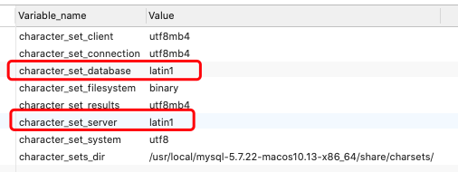
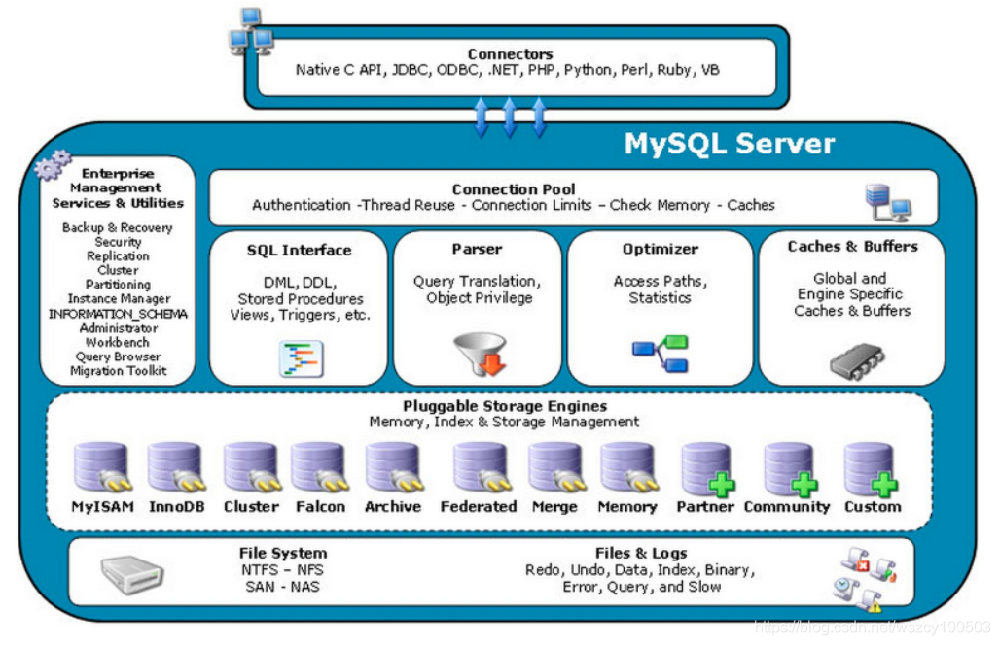
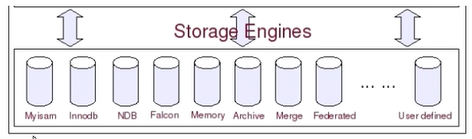
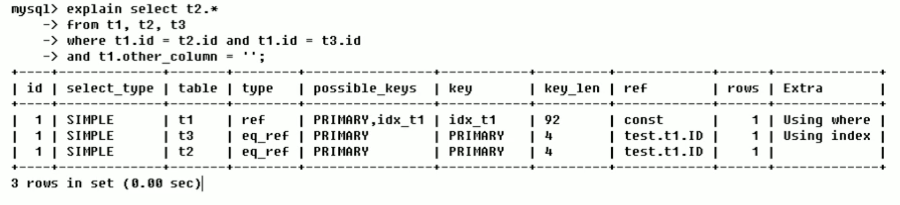
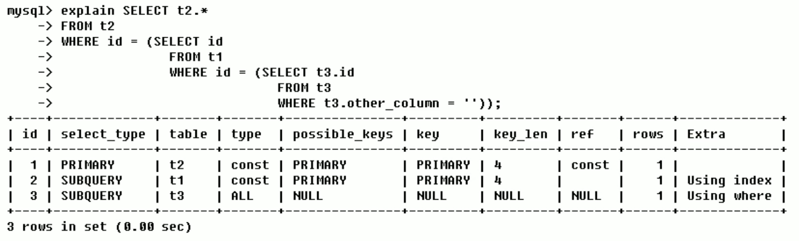
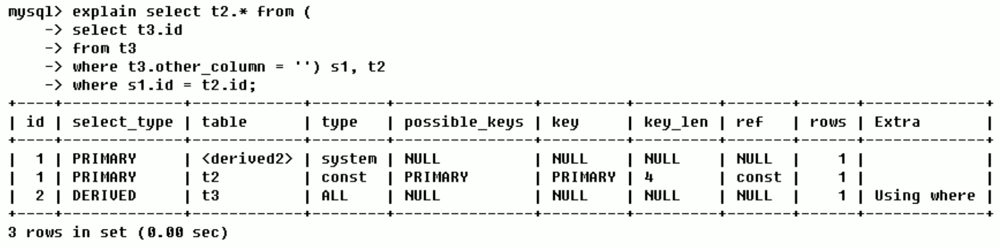
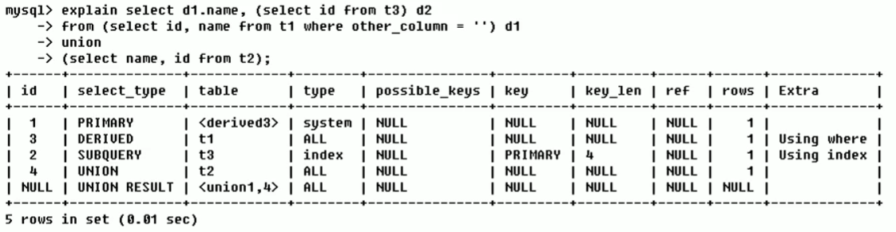

## 1 认识 MySQL

1985年，瑞典的几位志同道合小伙子(以 David Axmark 为首)成立了一 家公司，这就是 MySQL AB 的前身。这个公司最初并不是为了开发数据库产品，而是在实现他们想法的过程中，需要一个数据库。他们希望能够使用开源的产品。但在当时并没-一个合适的选择，没办法，那就自己开发吧。

## 2 MySQL 下载安装

下载地址：https://dev.mysql.com/ »  [MySQL Downloads](https://dev.mysql.com/downloads/) » [MySQL Community Server](https://dev.mysql.com/downloads/mysql/)

### 2.1 MySQL 安装完成相关命令

```markdown
# 查看Mysql安装时创建的mysql用户和mysql组
	cat /etc/passwd | grep mysql
		_mysql:*:74:74:MySQL Server:/var/empty:/usr/bin/false
	cat /etc/group | grep mysql
		_mysql:*:74:

# 查看 MySQL 版本
	mysqladmin --version
		mysqladmin  Ver 8.42 Distrib 5.7.22, for macos10.13 on x86_64

# MySQL 服务启停
	service mysql start
	service mysql stop

# 连接数据库
	mysql -u root -p

# Mysql的安装位置
	ps -ef | grep mysql
		74   141     1   0  7:00下午 ??         0:01.75 /usr/local/mysql/bin/mysqld --user=_mysql --basedir=/usr/local/mysql --datadir=/usr/local/mysql/data --plugin-dir=/usr/local/mysql/lib/plugin --log-error=/usr/local/mysql/data/mysqld.local.err --pid-file=/usr/local/mysql/data/mysqld.local.pid --keyring-file-data=/usr/local/mysql/keyring/keyring --early-plugin-load=keyring_file=keyring_file.so
```

### 2.2 修改字符集和数据存储路径

```mysql
# 查看当前字符集
show variables like '%char%'
```



数据库和服务端的字符集默认都是latin1，中文会乱码。

```markdown
# Linux 自定义配置文件/etc/my.cnf
[client]
default-character-set = utf8

[mysqld]
character_set_server=utf8
character_set_client=utf8
collation-server=utf8_general_ci
# (注意linux下mysql安装完默认：表名区分大小写，列名不区分大小写；0:区分大小写，1:不区分大小写)
lower_case_table_names=1
# (设置最大连接数，默认为151，mysql服务器允许最大连接数16384)
max_connections=1000
# 二进制日志配置 log-bin=''
# 错误日志配置 log-err=''

[mysql]
default-character-set = utf8
```

### 2.3 主要配置文件

``二进制日志log-bin`` 主重复制

``错误日志log-error`` 默认是关闭的,记录严重的警告和错误信息,每次启动和关闭的详细信息等

``查询日志log`` 默认关闭,记录查询的sql语句，如果开启会减低mysql的整体性能，因为记录日志也是需要消耗系统资源的

#### 数据文件

``frm文件`` 存放表结构

``myd文件`` 存放表数据

``myi文件`` 存放表索引

## 3 MySQL 逻辑架构

和其他数据库相比，MySQL架构可以在多种不同场景中应用并发挥良好作用。主要体现在存储引擎的架构上，``插件式的存储引擎架构将查询处理和其他的系统任务以及数据的存储提取相分离``。这种架构可以根据业务的需求和实际需要选择合适的存储引擎。

  

 											




### 3.1 连接层

最上层是一些客户端和连接服务，包含本地sock通信和大多数基于客户端/服务端实现的类似于tcp/ip的通信。主要完成一些类似于连接处理、授权认证及相关的安全方案。在该层上引入了线程池的概念，为通过认证安全接入的客户端提供线程。同样在该层上可以实现基于SSL的安全链接。服务器也会为安全接入的每个客户端验证它所有的操作权限。

``Connectors`` 指的是不同语言中与SQL的交互

``Management Serveices & Utilities`` 系统管理和控制工具

``Connection Pool 连接池`` 管理缓冲用户连接，线程处理等需要缓存的需求。

负责监听对 MySQL Server 的各种请求，接收连接请求，转发所有连接请求到线程管理模块。每一个连接上 MySQL Server 的客户端请求都会被分配（或创建）一个连接线程为其单独服务。而连接线程的主要工作就是负责 MySQL Server 与客户端的通信，接受客户端的命令请求，传递 Server 端的结果信息等。线程管理模块则负责管理维护这些连接线程。包括线程的创建，线程的 cache 等。

### 3.2 服务层

第二层架构主要完成大多数的核心服务功能，如SQL接口，并完成缓存的查询，SQL的分析和优化及部分内置函数的执行，所有跨存储引擎的功能也在这一层实现，如过程、函数等。在该层，服务器会解析查询并创建相应的内部解析树，并对其完成相应的优化如确定查询表的顺序，是否利用索引等，最后生成相应的执行操作。如果是select语句，服务器还会查询内部的缓存，如果缓存空间足够大，这样在解决大量读操作的环境中能够很好的提升系统性能。

``SQL Interface: SQL 接口`` 接受用户的SQL命令，并且返回用户需要查询的结果。比如select from就是调用SQL Interface

``Parser: 解析器`` SQL命令传递到解析器的时候会被解析器验证和解析。解析器是由Lex和YACC实现的，是一个很长的脚本。

在 MySQL中我们习惯将所有 Client 端发送给 Server 端的命令都称为 query ，在 MySQL Server 里面，连接线程接收到客户端的一个 Query 后，会直接将该 query 传递给专门负责将各种 Query 进行分类然后转发给各个对应的处理模块。

主要功能：

1. 将SQL语句进行语义和语法的分析，分解成数据结构，然后按照不同的操作类型进行分类，然后做出针对性的转发到后续步骤，以后SQL语句的传递和处理就是基于这个结构的。

2. 如果在分解构成中遇到错误，那么就说明这个sql语句是不合理的

``Optimizer: 查询优化器`` SQL语句在查询之前会使用查询优化器对查询进行优化。就是优化客户端请求的 query（sql语句） ，根据客户端请求的 query 语句，和数据库中的一些统计信息，在一系列算法的基础上进行分析，得出一个最优的策略，告诉后面的程序如何取得这个 query 语句的结果

他使用的是“选取-投影-联接”策略进行查询。

​    用一个例子就可以理解： select uid,name from user where gender = 1;

​    这个select 查询先根据where 语句进行选取，而不是先将表全部查询出来以后再进行gender过滤

​    这个select查询先根据uid和name进行属性投影，而不是将属性全部取出以后再进行过滤

​    将这两个查询条件联接起来生成最终查询结果

``Cache和Buffer：查询缓存`` 他的主要功能是将客户端提交 给MySQL 的 Select 类 query 请求的返回结果集 cache 到内存中，与该 query 的一个 hash 值 做一个对应。该 Query 所取数据的基表发生任何数据的变化之后， MySQL 会自动使该 query 的Cache 失效。在读写比例非常高的应用系统中， Query Cache 对性能的提高是非常显著的。当然它对内存的消耗也是非常大的。

如果查询缓存有命中的查询结果，查询语句就可以直接去查询缓存中取数据。这个缓存机制是由一系列小缓存组成的。比如表缓存，记录缓存，key缓存，权限缓存等

### 3.3 引擎层

存储引擎层，存储引擎真正的负责了MySQL中数据的存储和提取，服务器通过API与存储进行通信，不同的存储引擎具有的功能不同，这样可以根据自己的实际需要进行选取。

``存储引擎接口`` 存储引擎接口模块可以说是 MySQL 数据库中最有特色的一点了。目前各种数据库产品中，基本上只有 MySQL 可以实现其底层数据存储引擎的插件式管理。这个模块实际上只是 一个抽象类，但正是因为它成功地将各种数据处理高度抽象化，才成就了今天 MySQL 可插拔存储引擎的特色。

MySQL区别于其他数据库的最重要的特点就是其插件式的表存储引擎。MySQL插件式的存储引擎架构提供了一系列标准的管理和服务支持，这些标准与存储引擎本身无关，可能是每个数据库系统本身都必需的，如SQL分析器和优化器等，而存储引擎是底层物理结构的实现，每个存储引擎开发者都可以按照自己的意愿来进行开发。

注意：存储引擎是基于表的，而不是数据库。

### 3.4 存储层

数据存储层，主要是将数据存储在运行于裸设备的文件系统之上，并完成于存储引擎的交互。

## 4 存储引擎

```mysql
# 查看MySQL现在提供什么存储引擎
show engines
# 查看当前存储引擎
show variables like '%storage_engine%'
```

#### 4.1 MyISAM 和 InnoDB

| 对比项 | MyISAM                                                     | InnoDB                                                       |
| ------ | ---------------------------------------------------------- | ------------------------------------------------------------ |
| 主外键 | 不支持                                                     | 支持                                                         |
| 事务   | 不支持                                                     | 支持                                                         |
| 行表锁 | 表锁，即使操作一条记录也会锁住整个表<br>不适合高并发的操作 | 行锁，操作时只锁某一行，不对其他行有影响<br>适合高并发操作   |
| 表空间 | 小                                                         | 大                                                           |
| 关注点 | 性能                                                       | 事务                                                         |
| 缓存   | 只缓存索引，不缓存缓存真实数据                             | 不仅缓存索引还要缓存真实数据<br>对内存要求较高，而且内存对性能有决定性影响 |
| 总行数 | 存储                                                       | 不存储                                                       |
| 索引   | 非聚集索引<br>支持全文索引，查询效率上MyISAM要高           | 聚集索引(索引的数据域存储数据文件本身)<br>不支持全文索引     |
| 持久化 | 一个表三个文件（索引文件，表结构文件，数据文件）           | 表空间                                                       |

## 5 性能优化

### 5.1 MySQL Query Optimizer

MySQL 中有专门负责优化SELECT语句的优化器模块，主要功能：通过计算分析系统中收集到的统计信息，为客户端请求的Query提供它认为最优的执行计划（它认为最优的数据检索方式，但不见得是DBA认为是最优的，这部分最耗费时间）。

当客户端向MySQL请求一条Query，命令解析器模块完成请求分类，区别出是SELECT并转发给MySQL Query Optimizer时，MySQL Query Optimizer 首先会对整条Query进行优化，处理掉一些常量表达式的预算，直接换算成常量值。并对 Query 中的查询条件进行简化和转换，如去掉一些无用或显而易见的条件、结构调整等。然后分析 Query 中的 Hint 信息（如果有），看显示Hint信息是否可以完全确定该Query的执行计划。如果没有Hint或Hint信息还不足以完全确定执行计划，则会读取所涉及对象的统计信息，根据Query进行写相应的计算分析，然后再得出最后的执行计划。

### 5.2 MySQL 常见性能瓶颈

``CPU`` CPU在饱和的时候一般发生在数据装入在内存或从磁盘上读取数据时候

``IO`` 磁盘I/O瓶颈发生在装入数据远大于内存容量时

``服务器硬件的性能瓶颈`` top,free,iostat和vmstat来查看系统的性能状态

### 5.3 EXPLAIN

``EXPLAIN(执行计划)`` 用EXPLAIN关键字可以模拟优化器执行SQL语句，从而知道MySQL是如何处理你的SQL语句的。

分析你的查询语句或是结构的性能瓶颈，主要功能：

* 表的读取顺序
* 数据读取操作的操作类型
* 哪些索引可以使用
* 哪些索引被实际使用
* 表之间的引用
* 每张表有多少行被优化器查询

``QEP(Query Execution Plan)`` 打印执行计划，加上 explain：

```mysql
EXPLAIN SELECT * FROM user
```


#### id

select 查询的序列号，包含一组数字，表示查询中执行select子句或操作表的顺序。

id相同，执行顺序由上至下：



id不同，如果是子查询，id的序号会递增，id值越大优先级越高，越先被执行：



id相同不同同时存在：



id如果相同，可以认为是一组，从上往下执行；在所有组中，id值越大，优先级越高，越先执行。

``derived 衍生``

#### select_type

查询的类型，主要用于区别普通查询、联合查询、子查询等的复杂查询，主要有以下这几种查询类型：

* ``SIMPLE`` 简单的 select 查询，不包含子查询或 UNION
* ``PRIMARY`` 查询中若包含任何复杂的子查询，最外层查询则被标记为PRIMARY 

 - ``SUBQUERY``  在select 或 where 列表中包含了子查询
 - ``DERIVED`` 在from列表中包含的子查询被标记为DETIVED，MySQL 会递归执行这些子查询，把结果放在临时表里 
  - ``UNION`` 若第二个 select 出现在 UNION 之后，则被标记为 UNION；若UNION包含在FROM子句的子查询中，外层 select 将被标记为：DERIVED
  - ``UNION RESULT`` 从 UNION 表获取结果的 select 

#### table

显示这一行的数据的表的名称 

#### type

访问类型，显示查询使用了何种类型。

从最好到最差依次是：system>const>eq_ref>ref>range>index>ALL 

一般来说，得保证查询至少达到range级别，最好能达到ref。


  - ``system`` 表只有一行记录（等于系统表）这是const类型的特例，平时很少出现 

  - ``const`` 表示通过索引一次就能找到（单表），const用于比较primary key 或者unique索引。因为只匹配一行数据，所以很快。如将逐渐置于where列表中，MySQL 就能将该查询转换为一个常量

    ```mysql
    EXPLAIN SELECT * FROM tb_emp
    WHERE tb_emp.id = 1
    ```

  - ``eq_ ref`` 唯一性索引扫描，对于每个索引键，表中只会有一条匹配结果(对于前表的每一行，后表只有一行被扫描)，常见于主键或者唯一键索引扫描

    ```mysql
    EXPLAIN SELECT * FROM tb_emp,tb_dept
    WHERE tb_emp.deptId = tb_dept.id
    ```

  - ``ref`` 非唯一索引扫描，返回匹配某个单独值的所有行。本质上也是一种索引访问，它返回所有匹配单个单独值的行，然而，它可能会找到多个符合条件的行，所以应该属于查找和扫描的混合体

    ```mysql
    # 为 name 列创建普通索引
    EXPLAIN SELECT * FROM tb_emp
    WHERE tb_emp.name = 'z3'
    ```

  - ``range`` 只检索给定范围的行，使用一个索引来选择行。key列显示使用了哪个索引。一般就是在你的where语句中出现了between、<、>、in等的查询，这种范围扫描索引扫描比全表扫描要好，因为他只需要开始索引的某一点，而结束语另一点，不用扫描全部索引（可能和最终得到数的结果有关，数量多为ALL）

    ```mysql
    # 为 deptId 列创建普通索引
    EXPLAIN SELECT * FROM tb_emp
    WHERE deptId > 3
    ```

  - ``index`` Full Index Scan,index与ALL区别为index类型只遍历索引树。这通常比ALL快，因为索引文件通常比数据文件小。

    （也就是说虽然all和index都是读全表，但index是从索引中读取的，而all是从硬盘中读的）

    ```mysql
    EXPLAIN SELECT id FROM tb_emp
    EXPLAIN SELECT deptId FROM tb_emp
    ```

  - ``all`` Full Table Scan，全表扫描 

  - 依次从好到差:system，const，eq_ref，ref，fulltext，ref_or_null， unique_subquery，index_subquery，range，index_merge，index，ALL 

#### possible_ _keys

显示可能应用在这张表中的索引，一个或多个。

查询涉及到的字段上若存在索引，则该索引被列出，但不一定被查询实际使用。如果没有任何索引可以使用，就会显示成null。

#### key

实际使用的索引。如果为null则没有使用索引，查询中若使用了``覆盖索引``，则索引和查询的select字段重叠。

#### key_ len

表示索引中使用的字节数，可通过该列计算查询中使用的索引的长度。在不损失精确性的情况下，长度越短越好。

key_len显示的值为索引最大可能长度，并非实际使用长度，即key_len是根据表定义计算而得，不是通过表内检索出的。

#### ref

显示索引``那一列``被使用了，如果可能的话，是一个常数。那些列或常量被用于查找索引列上的值。

查询中与其他表关联的字段，外键关系建立索引。

#### rows

根据表统计信息及索引选用情况，大致估算出找到所需的记录所需要读取的行数。

#### extra

包含不适合在其他列中显示但十分重要的额外信息：


  - ``using filesort`` 说明 MySQL 会对数据使用一个外部的索引排序，而不是按照表内的索引顺序进行读取。MySQL 中无法利用索引完成的排序操作称为``文件排序``。

  - ``using temporary`` 使用了临时表保存中间结果，MySQL在对查询结果排序时使用临时表。常见于排序order by 和分组查询 group by。

  - ``using index`` 表示相应的select操作中使用了``覆盖索引（Coveing Index）``，避免访问了表的数据行，效率不错！
    如果同时出现 using where，表明索引被用来执行索引键值的查找；
    如果没有同时出现 using where，表面索引用来读取数据而非执行查找动作。

    覆盖索引（Coveing Index），一说索引覆盖。就是 select 的数据列只用从索引中就能够得到，不必读取数据行，MySQL 可以利用索引返回 select 列表中的字段，而不必根据索引再次读取数据文件，换句话说查询列要被所建的索引覆盖。

    注意：

    如果要使用覆盖索引，一定要注意 select列表中只取出需要的列，不可 select *，因为如果将所有字段一起做索引会导致索引文件过大，查询性能下降。

  - ``using where`` 表面使用了where过滤

  - ``using join buffer`` 使用了连接缓存

  - ``impossible where`` where子句的值总是false，不能用来获取任何元组

  - ``select tables optimized away`` 在没有GROUPBY子句的情况下，基于索引优化MIN/MAX操作或者对于MyISAM存储引擎优化COUNT(*)操作，不必等到执行阶段再进行计算，查询执行计划生成的阶段即完成优化。

  - ``distinct`` 优化distinct，在找到第一匹配的元组后即停止找同样值的工作

### 5.4 示例分析



第一行（执行顺序4）：id列为1，表示是union里的第一个select，select_tyep列的primary

第二行（执行顺序2）：id列为3，是整个查询中第三个select的一部分。因查询包含在from中，所以为derived。【select id,name from t1 where other_column=''】

第三行（执行顺序3）：select列表中的子查询select_type为subquery，为整个查询中的第二个select。【select id from t3】

第四行（执行顺序1）：select_type为union，说明第四个select是union里的第二个select，最先执行【select name,id from t2】

第五行（执行顺序5）：代表从union的临时表中读取行的阶段，table列的<union1,4>表示用第一个和第四个select的结果进行union操作。【两个结果union操作】

### 5.5 性能优化一般流程

1. 开启慢查询日志（设置阙值，如超过5秒就是慢SQL，抓取出来）并捕获
2. explain + 慢SQL分析
3. show profile 查询SQL在MySQL服务器里面的执行细节和生命周期情况
4. SQL数据库服务器的参数调优


### 索引

#### 索引结构

MySql 支持的数据结构：

1. Hash，针对某个字段做索引，会对这个字段做Hash MySQL大面积不用Hash，首先有冲突，第二个无法做范围查询：

```java
select * from table where id > 1
```

1.  FullText 全文搜索  
2.  R-Tree 

### 锁

#### 行锁


#### 表锁


```java
# 表级锁争用状态变量
show status like 'table%'
# 行级锁争用状态变量
show status like 'innodb_row_lock%'
```


 

### 优化

#### 原则


#### profiling(有个概念)

```java
set profiling=1;
select nick_name ,count(*) from user group by nick_name;
show profiles;
show profile cpu,block io for query 75;
```

### join \ order by \ group by 解释

#### join


 

```java
# join
show variables like "join_%"
```

#### order by


  如果sort_buffer能够承载所有的字段的时候，mysql就会自动选择第二种，如果不够就会使用第一种，第一种速度略逊于第一种，因为要两次读取数据，两次IO。

```java
# sort_buffer_size
show variables like "sort_buffer_%"
```

#### group by

前提是先排序

DISTINCT 基于group by LIMIT

```java
SELECT * FROM user limit 10000,10;
# limit慢的原因是，它要取 10010 条数据
SELECT * FROM user where id> 10000 limit 10;
```

#### Slow Sql 配置


#### 建索引的几大原则

1.最左前缀匹配原则，非常重要的原则，mysql会一直向右匹配直到遇到范围查询(&gt;、&lt;、between、like)就停止匹配，比如a = 1 and b = 2 and c &gt; 3 and d = 4 如果建立(a,b,c,d)顺序的索引，d是用不到索引的，如果建立(a,b,d,c)的索引则都可以用到，a,b,d的顺序可以任意调整。

2.=和in可以乱序，比如a = 1 and b = 2 and c = 3 建立(a,b,c)索引可以任意顺序，mysql的查询优化器会帮你优化成索引可以识别的形式。

3.尽量选择区分度高的列作为索引，区分度的公式是count(distinct col)/count(*)，表示字段不重复的比例，比例越大我们扫描的记录数越少，唯一键的区分度是1，而一些状态、性别字段可能在大数据面前区分度就是0，那可能有人会问，这个比例有什么经验值吗？使用场景不同，这个值也很难确定，一般需要join的字段我们都要求是0.1以上，即平均1条扫描10条记录。

4.索引列不能参与计算，保持列“干净”，比如from_unixtime(create_time) = ’2014-05-29’就不能使用到索引，原因很简单，b+树中存的都是数据表中的字段值，但进行检索时，需要把所有元素都应用函数才能比较，显然成本太大。所以语句应该写成create_time = unix_timestamp(’2014-05-29’)。

5.尽量的扩展索引，不要新建索引。比如表中已经有a的索引，现在要加(a,b)的索引，那么只需要修改原来的索引即可。

