## 1 索引优化分析

### 1.1 SQL 性能下降原因

查询语句写的烂

索引失效（单值、复合）

关联查询太多join（设计缺陷或不得已的需求）

服务器调优及各个参数设置（缓冲\线程数等）

### 1.2 常见通用 join 查询

#### 1.2.1 SQL 执行顺序

```mysql
# 手写
SELECT DISTINCT
	<select_list>
FROM
	<left_table> <join_type> JOIN <right_table> ON <join_condition>
WHERE
	<where_condition>
GROUP_BY
	<group_by_list>
HAVING
	<having_condition>
ORDER BY
	<order_by_condition>
LIMIT <limit_number>

# 机读
FROM <left_table> 
ON <join_condition>
<join_type> JOIN <right_table> 
WHERE <where_condition>
GROUP_BY <group_by_list>
HAVING <having_condition>
SELECT
DISTINCT <select_list>
ORDER BY <order_by_condition>
LIMIT <limit_number>
```


#### 1.2.2 JOIN 图


#### 1.2.3 7种 JOIN

```mysql
# 基础数据
DROP TABLE IF EXISTS `tb_dept`;
CREATE TABLE `tb_dept` (
  `id` int(11) NOT NULL AUTO_INCREMENT,
  `deptName` varchar(255) DEFAULT NULL,
  `locADD` varchar(255) DEFAULT NULL,
  PRIMARY KEY (`id`)
) ENGINE=InnoDB AUTO_INCREMENT=6 DEFAULT CHARSET=utf8;

INSERT INTO `tb_dept` VALUES ('1', 'RD', '11');
INSERT INTO `tb_dept` VALUES ('2', 'HR', '12');
INSERT INTO `tb_dept` VALUES ('3', 'MK', '13');
INSERT INTO `tb_dept` VALUES ('4', 'MIS', '14');
INSERT INTO `tb_dept` VALUES ('5', 'FD', '15');

DROP TABLE IF EXISTS `tb_emp`;
CREATE TABLE `tb_emp` (
  `id` int(11) NOT NULL AUTO_INCREMENT,
  `name` varchar(255) DEFAULT NULL,
  `deptId` int(11) DEFAULT NULL,
  PRIMARY KEY (`id`)
) ENGINE=InnoDB AUTO_INCREMENT=9 DEFAULT CHARSET=utf8;

INSERT INTO `tb_emp` VALUES ('1', 'z3', '1');
INSERT INTO `tb_emp` VALUES ('2', 'z4', '2');
INSERT INTO `tb_emp` VALUES ('3', 'z5', '3');
INSERT INTO `tb_emp` VALUES ('4', 'w5', '2');
INSERT INTO `tb_emp` VALUES ('5', 'w6', '2');
INSERT INTO `tb_emp` VALUES ('6', 's7', '3');
INSERT INTO `tb_emp` VALUES ('7', 's8', '4');
INSERT INTO `tb_emp` VALUES ('8', 's9', '51');

# 内连接(两表的共有部分)
SELECT * FROM tb_emp te INNER JOIN tb_dept td ON te.deptId = td.id;

# 左连接（左表的全部，右表不满足补NULL）
SELECT * FROM tb_emp te LEFT JOIN tb_dept td ON te.deptId = td.id;

# 右连接（右表的全部，左表不满足的补NULL）
SELECT * FROM tb_emp te RIGHT JOIN tb_dept td ON te.deptId = td.id;

# 特殊的左连接（显示为左表的独有的数据）
# 说明：查询tb_emp 表中跟tb_dept 表无关联关系的数据，即tb_emp 独占，且tb_dept 表的显示列补NULL
SELECT * FROM tb_emp te LEFT JOIN tb_dept td ON te.deptId = td.id WHERE td.id IS NULL;

# 特殊的右连接（显示为右表的独有的数据 ）
# 说明：查询tb_dept 表中跟tb_emp 表无关联关系的数据，即tb_dept 独占，且tb_emp 表的显示列补NULL
SELECT * FROM tb_emp te RIGHT JOIN tb_dept td ON te.deptId = td.id WHERE te.deptId IS NULL;

# 全连接（显示全部数据）（mysql 不支持 full outer join）
# UNION ：有去重的功能。
SELECT * FROM tb_emp te LEFT JOIN tb_dept td ON te.deptId = td.id
UNION
SELECT * FROM tb_emp te RIGHT JOIN tb_dept td ON te.deptId = td.id;

# 显示两表的独有的数据
SELECT * FROM tb_emp te LEFT JOIN tb_dept td ON te.deptId = td.id WHERE td.id IS NULL
UNION
SELECT * FROM tb_emp te RIGHT JOIN tb_dept td ON te.deptId = td.id WHERE te.deptId IS NULL;
```

### 1.3 索引简介

#### 1.3.1 索引是什么

MySQL 官方对索引的定义为：``索引(Index)`` 是帮助 MySQL 高效获取数据的数据结构。

可以得到索引的本质：``索引是数据结构（排好序的快速查找数据结构）``。

索引的目的在于提高查询效率(where和order by)，可以类比字典。

在数据之外，数据库系统还维护着满足特定查找算法的数据结构，这些数据结构以某种方式引用（指向）数据，这样就可以在这些数据结构上实现高级查找算法。这种数据结构，就是索引。

下图索引方式实例，左边是数据表，一共两列七条记录，最左边是数据记录的物理地址：


为了加快Col2的查找，可以维护一个右边所示的二叉查找树，每个节点分别包含索引值和一个指向对应数据记录物理地址的指针，这样就可以运用二叉查找在一定的复杂度内获取到相应数据，从而快速的检索出符合条件的记录。

一般来说索引本身也很大，不可能全部存储在内存中，因此``索引往往以文件形式存储在硬盘上``。

我们平时所说的索引，如果没有特别指明，都是指B树(``多路搜索树``，并不一定是二叉树)结构组织的索引。其中聚集索引，次要索引，覆盖索引，复合索引，前缀索引，唯一索引默认都是使用``B+树索引``，统称索引。当然,除了B+树这种类型的索引之外，还有哈希索引(hash index)等。

#####  索引优势

1. 提高数据检索效率，降低数据库的IO成本

2. 通过索引列对数据进行排序，降低数据排序的成本，降低了CPU的消耗

##### 索引劣势

1. 实际上索引也是一张表，该表保存了主键和索引字段，并指向实体表的记录,所以索引列也是要占用空间的

2. 虽然索引大大提高了查询速度，同时却会降低更新表的速度,如果对表INSERT,UPDATE和DELETE。
   因为更新表时，MySQL不仅要不存数据，还要保存一下索引文件每次更新添加了索引列的字段，都会调整因为更新所带来的键值变化后的索引信息

3. 索引只是提高效率的一个因素，如果你的MySQL有大数据量的表，就需要花时间研究建立优秀的索引，或优化查询语句

### 1.4 索引分类

``单值索引`` 即一个索引只包含单个列，一个表可以有多个单列索引

``唯一索引`` 索引列的值必须唯一，但允许有空值

``复合索引`` 即一个索引包含多个列

```mysql
# 创建	indexName -> idx_*
CREATE [UNIQUE] INDEX indexName ON tableName(columnName(length));
ALTER TABLE tableName ADD [UNIQUE] INDEX [indexName] (columnName(length));
ALTER TABLE tb_emp ADD INDEX idx_name (name);

# 删除
DROP INDEX [indexName] ON tableName;

# 查看
SHOW INDEX FROM tableName;

# ALTER 有四种方式来添加数据库表的索引
# 该语句添加一个主键，这意味着索引值必须是唯一的，且不能为NULL
ALTER TABLE tableName ADD PRIMARY KEY (column_list);
# 该语句创建索引的值必须是唯一的（除了NULL之外，NULL可能会出现多次）
ALTER TABLE tableName ADD UNIQUE index_name (column_list);
# 该语句添加普通索引，索引值可以出现多次
ALTER TABLE tableName ADD INDEX index_name (column_list);
# 该语句指定了索引为FULLTEXT，用于全文索引
ALTER TABLE tableName ADD FULLTEXT index_name (column_list);
```

### 1.5 索引结构

BTree索引，Hash索引，full-text全文索引，R-Tree索引

#### 1.5.1 BTree 索引检索原理


BTree索引(Balanced Tree)，是一种很普遍的数据库索引结构，oracle默认的索引类型。其特点是定位高效、利用率高、自我平衡，特别适用于高基数字段，定位单条或小范围数据非常高效。理论上，使用BTree在亿条数据与100条数据中定位记录的花销相同。

BTree索引的数据结构如下：

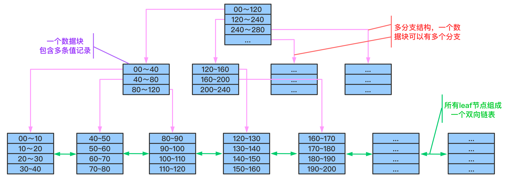

结构看起来BTree索引与Binary Tree相似，但在细节上有所不同，上图中用不同颜色的标示出了BTree索引的几个主要特点：

``树形结构`` 由根节root、分支branches、叶leaves三级节点组成，其中分支节点可以有多层

``多分支结构`` 与binary tree不相同的是，BTree索引中单root/branch可以有多个子节点（超过2个）

``双向链表`` 整个叶子节点部分是一个双向链表

单个数据块中包括多条索引记录，结构上BTree与Binary Tree的区别，在于binary中每节点代表一个数值，而balanced中root和BTree节点中记录了多条值范围条目，这些值范围条目分别指向在其范围内的叶子节点。既root与branch可以有多个分支，而不一定是两个，对数据块的利用率高。

在leaf节点中，同样也是存放了多条索引记录，这些记录就是具体的索引列值，和与其对应的rowid。另外，在叶节点层上，所有的节点在组成了一个双向链表。

了解基本结构后，下图展示定位数值82的过程：

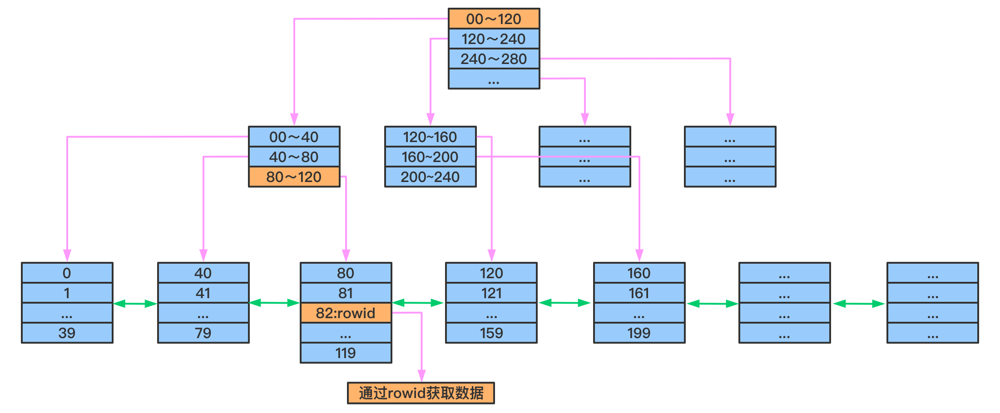

演算如下：

读取root节点，判断82大于在0-120之间，走左边分支。

读取左边branch节点，判断82大于80且小于等于120，走右边分支。

读取右边leaf节点，在该节点中找到数据82及对应的rowid，使用rowid去物理表中读取记录数据块(如果是count或者只select rowid，则最后一次读取不需要)。

在整个索引定位过程中，数据块的读取只有3次，既三次I/O后定位到rowid。

而由于Btree索引对结构的利用率很高，定位高效。当1千万条数据时，Btree索引也是三层结构(依稀记得亿级数据才是3层与4层的分水岭)。定位记录仍只需要三次I/O，这便是开头所说的，100条数据和1千万条数据的定位，在btree索引中的花销是一样的。

##### 平衡扩张

除了利用率高、定位高效外，Btree的另一个特点是能够永远保持平衡，这与它的扩张方式有关。(unbalanced和hotspot是两类问题，之前我一直混在一起)，先描述下Btree索引的扩张方式：

 新建一个索引，索引上只会有一个leaf节点，取名为Node A，不断的向这个leaf节点中插入数据后，直到这个节点满，这个过程如下图（绿色表示新建/空闲状态，红色表示节点没有空余空间）：


当Node A满之后，我们再向表中插入一条记录，此时索引就需要做拆分处理：会新分配两个数据块NodeB & C，如果新插入的值，大于当前最大值，则将Node A中的值全部插入Node B中，将新插入的值放到Node C中；否则按照5-5比例，将已有数据分别插入到NodeB与C中。

无论采用哪种分割方式，之前的leaf节点A，将变成一个root节点，保存两个范围条目，指向B与C，结构如下图（按第一种拆分形式）：


当Node C满之后，此时 Node A仍有空余空间存放条目，所以不需要再拆分，而只是新分配一个数据块Node D，将在Node A中创建指定到Node D的条目：


如果当根节点Node A也满了，则需要进一步拆分：新建Node E&F&G，将Node A中范围条目拆分到E&F两个节点中，并建立E&F到BCD节点的关联，向Node G插入索引值。此时E&F为branch节点，G为leaf节点，A为Root节点：

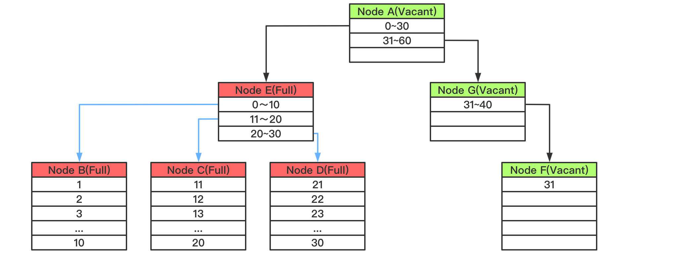

在整个扩张过程中，Btree自身总能保持平衡，Leaf节点的深度能一直保持一致。

##### 单一方向扩展引起的索引竞争(Index Contention)

 若索引列使用sequence或者timestamp这类只增不减的数据类型。这种情况下Btree索引的增长方向总是不变的，不断的向右边扩展，因为新插入的值永远是最大的。

当一个最大值插入到leaf block中后，leaf block要向上传播，通知上层节点更新所对应的“值范围”条目中的最大值，因此所有靠右边的block(从leaf 到branch甚至root)都需要做更新操作，并且可能因为块写满后执行块拆分。

 如果并发插入多个最大值，则最右边索引数据块的的更新与拆分都会存在争抢，影响效率。在AWR报告中可以通过检测``enq: TX – index contention``事件的时间来评估争抢的影响。解决此类问题可以使用Reverse Index解决，不过会带来新的问题。

##### Index Browning 索引枯萎

``Index Browning 索引枯萎``(不知道该怎么翻译这个名词，就是指leaves节点”死”了，树枯萎了)，其实oracle针对这个问题有优化机制，但优化的不彻底，所以还是要拿出来的说。

我们知道当``表中的数据删除后，索引上对应的索引值是不会删除的``，特别是在一性次删除大批量数据后，会造成大量的dead leaf挂到索引树上。考虑以下示例，如果表100以上的数据会部被删除了，但这些记录仍在索引中存在，此时若对该列取max()：


通过与之前相同演算，找到了索引树上最大的数据块，按照记录最大的值应该在这里，但发现这数据块里的数据已经被清空了，与是利用Btree索引的另一个特点：leaves节点是一个双向列表，若数据没有找到就去临近的一个数据块中看看，在这个数据块中发现了最大值99。

在计算最大值的过程中，这次的定位多加载了一个数据块，再极端的情况下，大批量的数据被删除，就会造成大量访问这些dead leaves。

针对这个问题的一般解决办法是重建索引，但记住! 重建索引并不是最优方案，详细原因可以看看这。使用coalesce语句来整理这些dead leaves到freelist中，就可以避免这些问题。理论上oracle中这步操作是可以自动完成的，但在实际中一次性大量删除数据后，oracle在短时间内是反应不过来的。

#### 1.5.2 需要创建索引的情况

1. 主键自动建立唯一索引
2. 频繁作为查询的条件的字段应该创建索引
3. 查询中与其他表关联的字段，外键关系建立索引
4. 频繁更新的字段不适合创建索引，因为每次更新不单单是更新了记录还会更新索引，加重IO负担
5. Where条件里用不到的字段不创建索引
6. 单间/组合索引的选择问题，who？（在高并发下倾向创建组合索引）
7. 查询中排序的字段，排序字段若通过索引去访问将大大提高排序的速度
8. 查询中统计或者分组字段

#### 1.5.3 不要创建索引的情况

1. 表记录太少
2. 经常增删改的表
3. 数据重复且分布平均的表字段，因此应该只为经常查询和经常排序的数据列建立索引。 注意，如果某个数据列包含许多重复的内容，为它建立索引就没有太大的实际效果。

假如一个表有10万条记录，有一个字段A只有T和F两种值，且每个值的分布概率大概为50%，那么对这种表A字段建索引一般不会提高数据库的查询速度。

索引的选择性是指索引列中不同值的数目与表中记录数的比。如果一个表中有2000条记录，表索引列有1980个不同的值，那么这个索引的选择性就是1980/2000=0.99。一个索引的选择性越接近1，这个索引的效率就越高。

### 1.6 索引优化

#### 1.6.1 索引分析

##### 单表

```mysql
CREATE TABLE `article` (
  `id` int(10) NOT NULL AUTO_INCREMENT,
  `author_id` int(10) NOT NULL,
  `category_id` int(10) NOT NULL,
  `views` int(10) NOT NULL,
  `comments` int(10) NOT NULL,
  `title` varchar(255) NOT NULL,
  `content` text NOT NULL,
  PRIMARY KEY (`id`)
) ENGINE=InnoDB AUTO_INCREMENT=4 DEFAULT CHARSET=utf8;

INSERT INTO `article` VALUES ('1', '1', '1', '1', '1', '1', '1');
INSERT INTO `article` VALUES ('2', '2', '2', '2', '2', '2', '2');
INSERT INTO `article` VALUES ('3', '1', '1', '3', '3', '3', '3');

# 查询 category_id 为1且comments大于1的情况下，views最多的article_id
EXPLAIN SELECT * FROM article WHERE category_id = 1 AND comments > 1 ORDER BY views DESC LIMIT 1;
```


type 是 ALL，最坏的情况。Extra 里还出现了 Using filesort，也是最坏的情况，优化是必须的。

```mysql
# 创建索引
create index idx_article_cv on article(category_id,comments,views);
# 查看索引
SHOW INDEX FROM article;
# 执行 EXPLAIN
```


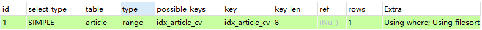

extra 里仍然使用了 Using filesort，但是建立的索引为什么没用？

这里因为按照BTree 索引的工作原理，先排序 category_id，如果遇到相同的category_id则再排序comments，如果遇到相同的comments则再排序 views。

当 comments 字段在联合索引里处于中间位置时，因 comments > 1条件是一个范围（所谓 range），MySQL无法利用索引在对后面的 views 部分进行索引，即 range类型查询字段后面的索引无效。

```mysql
# 删除索引
DROP INDEX idx_article_cv ON article;
# 重新建立索引
create index idx_article_cv on article(category_id,views);
# 执行 EXPLAIN
```


可以看到，type变为了ref，extra中的using filesort消失了，结果非常理想。

##### 双表

```mysql
CREATE TABLE `book` (
  `bookid` int(11) NOT NULL AUTO_INCREMENT,
  `card` varchar(255) NOT NULL,
  PRIMARY KEY (`bookid`)
) ENGINE=InnoDB AUTO_INCREMENT=21 DEFAULT CHARSET=utf8;

DROP TABLE IF EXISTS `class`;
CREATE TABLE `class` (
  `id` int(11) NOT NULL AUTO_INCREMENT,
  `card` varchar(255) NOT NULL,
  PRIMARY KEY (`id`)
) ENGINE=InnoDB AUTO_INCREMENT=41 DEFAULT CHARSET=utf8;

#20次
insert into book(card) values (FLOOR(1 + (RAND() * 20)));
insert into class(card) values (FLOOR(1 + (RAND() * 20)));

explain select * from class left join book on book.card = class.card;
```


```mysql
# 测试 左连接 右边表添加索引
# 即为 book 表的外键 card 创建索引 Y
ALTER TABLE book ADD INDEX Y(card);
```

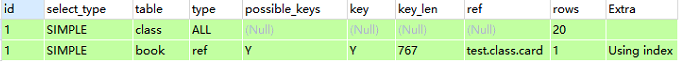

```mysql
# 测试 左连接 左边表添加索引
# 即为 card 表的外键 card 创建索引 Y
DROP INDEX Y ON book;
ALTER TABLE class ADD INDEX Y (card);
```

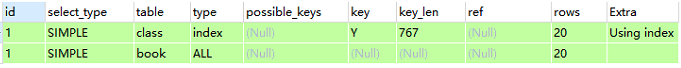

可以看出左连接右边表添加索引，type变为ref，rows也变成了优化比较明显。

这是由左连接特性决定的，LEFT JOIN 条件用于确定如何从右表搜索行，左边一定都有，所以右边是我们的关键点，一定需要建立索引。

```mysql
# 由此可知，右连接应该在左表建立索引
DROP INDEX Y ON class;
ALTER TABLE class ADD INDEX Y (card);
explain select * from class right join book on book.card = class.card;
```

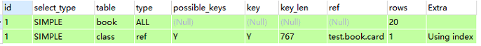

优化较明显，这是因为 RIGHT JOIN 条件用于确定如何从左表搜索行，右边一定都有，所以左边是我们的关键点，一定需要建立索引。

##### 三表

```mysql
# 删除所有索引，创建新表 phone
CREATE TABLE `phone` (
  `id` int(11) NOT NULL AUTO_INCREMENT,
  `card` int(11) NOT NULL,
  PRIMARY KEY (`id`)
) ENGINE=InnoDB AUTO_INCREMENT=21 DEFAULT CHARSET=utf8;
#20次
insert into phone(card) values (FLOOR(1 + (RAND() * 20)));

explain select * from class inner join book on class.card = book.card inner join phone on book.card = phone.card;
```


```mysql
explain select * from class left join book on class.card = book.card left join phone on book.card = phone.card;
```

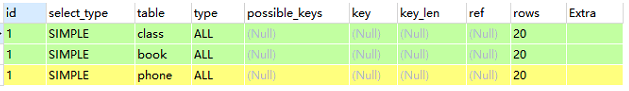

```mysql
# 依照左链接准则，建立两个索引
ALTER TABLE book ADD INDEX Y(card);
ALTER TABLE phone ADD INDEX Z(card);
```


后两行的 type 都是 ref 且总 rows 优化很好，效果不错。因此索引最好设置在需要经常查询的字段中。

##### 结论

Join 语句的优化：

尽可能减少Join语句中的``NestedLoop(嵌套循环)``的循环总次数：``“永远用小结果集驱动大的结果集”``。

优先优化嵌套循环的内层循环：保证Join语句中被驱动表上Join条件字段已经被索引。

当无法保证被驱动表的Join条件字段被索引且内存资源充足的前提下，不要太吝惜``JoinBuffer``的设置。

#### 1.6.2 索引失效

```mysql
CREATE TABLE `staffs` (
	`id` int(11) NOT NULL AUTO_INCREMENT,
  `name` varchar(24) NOT NULL COMMENT '姓名',
  `age` int(11) NOT NULL DEFAULT '0' COMMENT '年龄',
  `pos` varchar(20) NOT NULL COMMENT '职位',
  `add_time` timestamp NOT NULL DEFAULT CURRENT_TIMESTAMP COMMENT '入职时间',
  PRIMARY KEY (`id`)
) ENGINE=InnoDB AUTO_INCREMENT=4 DEFAULT CHARSET=utf8;

INSERT INTO staffs(name, age, pos, add_time) VALUES('z3', 22, 'manager', NOW());
INSERT INTO staffs(name, age, pos, add_time) VALUES('July', 23, 'dev', NOW());
INSERT INTO staffs(name, age, pos, add_time) VALUES('2000', 23, 'dev', NOW());

ALTER TABLE staffs ADD INDEX idx_staffs_name_age_pos(name, age, pos);
```

##### 1.全值匹配

```mysql
EXPLAIN SELECT * FROM staffs WHERE name = 'July';
```


```mysql
EXPLAIN SELECT * FROM staffs WHERE name = 'July' AND age = 23;
```


```mysql
EXPLAIN SELECT * FROM staffs WHERE name = 'July' AND age = 23 AND pos = 'dev';
```


##### 2.最佳左前缀法则

① 带头大哥不能死

② 中间兄弟不能断

```mysql
EXPLAIN SELECT * FROM staffs WHERE age = 23 AND pos = 'dev';
```


```mysql
EXPLAIN SELECT * FROM staffs WHERE age = 23;
```


```mysql
EXPLAIN SELECT * FROM staffs WHERE name = 'July' AND pos = 'dev';
```

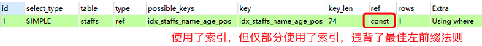

如果索引了多例，要遵守最左前缀法则。指的是``查询从索引的最左前列开始并且不跳过索引中的列``。

##### 3.索引列不要做任何操作

③ 索引列上无计算

不在索引列上做任何操作（计算、函数、（自动or手动）类型转换），会导致索引失效而转向全表扫描。

```mysql
EXPLAIN SELECT * FROM staffs WHERE left(name, 4) = 'July';
```

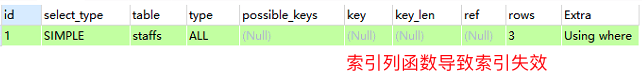

##### 4.存储引擎不能使用索引中范围条件右边的列

④ 范围之后全失效

```mysql
EXPLAIN SELECT * FROM staffs WHERE name = 'July' AND age > 11 AND pos = 'manager';
```


##### 5.尽量使用覆盖索引

尽量使用覆盖索引（只访问索引的查询（索引列和查询列一致）），减少select *

```mysql
EXPLAIN SELECT name, age, pos FROM staffs WHERE name = 'July' AND age = 23 AND pos = 'dev';
```

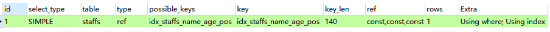

```mysql
EXPLAIN SELECT name, age, pos FROM staffs WHERE name = 'July' AND age > 11 AND pos = 'manager';
```


同时，如果只查询索引列的部分字段，同样可以使用 using index，但是如果查询索引列以外的字段，则不会用到 using index。

##### 6.!=和<>

mysql在使用不等于（!=或者<>）的时候无法使用索引会导致全表扫描

```mysql
EXPLAIN SELECT * FROM staffs WHERE name != 'July' AND age = 11 AND pos = 'manager';
```


##### 7.is null 和 is not null

is null,is not null 也无法使用索引

```mysql
EXPLAIN SELECT * FROM staffs WHERE name is null;
```


```mysql
EXPLAIN SELECT * FROM staffs WHERE name is not null;
```


##### 8.like

⑤ 百分like加右边 

like以通配符开头（'%abc...'）mysql索引失效会变成全表扫描操作

```mysql
explain select * from staffs where name like '%July%';
# '%July' 同
```


```mysql
explain select * from staffs where name like 'July%';
```


问题：解决like '%字符串%' 索引不被使用的方法？？

```mysql
CREATE TABLE `tb_user` (
  `id` int(11) NOT NULL AUTO_INCREMENT,
  `name` varchar(20) DEFAULT NULL,
  `age` int(11) DEFAULT NULL,
  `email` varchar(20) DEFAULT NULL,
  PRIMARY KEY (`id`)
) ENGINE=InnoDB AUTO_INCREMENT=5 DEFAULT CHARSET=utf8;

INSERT INTO tb_user(name,age,email) VALUES('1aa1', 21, 'b@163.com');
INSERT INTO tb_user(name,age,email) VALUES('2aa2', 222, 'a@163.com');
INSERT INTO tb_user(name,age,email) VALUES('3aa3', 265, 'c@163.com');
INSERT INTO tb_user(name,age,email) VALUES('4aa4', 21, 'c@163.com');

CREATE INDEX idx_user_name_age ON tb_user(name, age);

# 索引未失效
explain select name, age from tb_user where name like '%aa%';
explain select id from tb_user where name like '%aa%';
explain select name from tb_user where name like '%aa%';
explain select age from tb_user where name like '%aa%';
explain select id, name from tb_user where name like '%aa%';
explain select id, name, age from tb_user where name like '%aa%';
explain select name, age from tb_user where name like '%aa%';
# 索引失效
explain select * from tb_user where name like '%aa%';
explain select id, name, age, email from tb_user where name like '%aa%';
```

1、可以使用主键索引
2、使用覆盖索引，查询字段必须是建立覆盖索引字段
3、当覆盖索引指向的字段是varchar(380)及380以上的字段时，覆盖索引会失效！

##### 9.字符串不加单引号索引失效

⑥ 字符串里有引号

```mysql
explain select * from staffs where name = 2000;
```

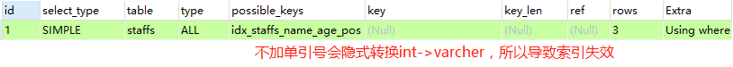

```mysql
explain select * from staffs where name = '2000';
```


##### 10.少用or

用or连接时会索引失效

```mysql
explain select * from staffs where name = 'July' or name = 'z3';
```


##### 小结

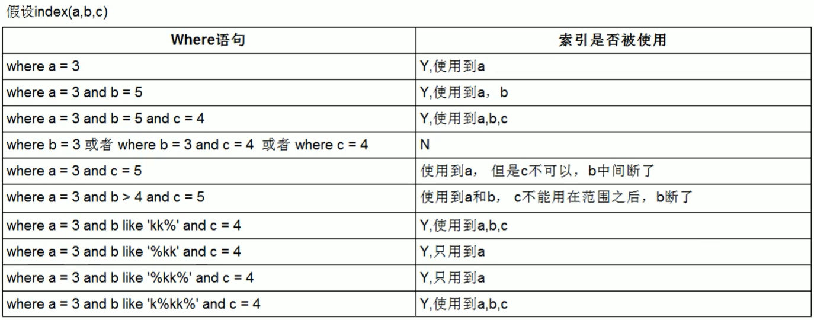

【优化总结口诀】
全值匹配我最爱，最左前缀要遵守；
带头大哥不能死，中间兄弟不能断；
索引列上少计算，范围之后全失效；
LIKE百分写最右，覆盖索引不写星；
不等空值还有or，索引失效要少用；
VAR引号不可丢，SQL高级也不难！ 

##### 一般性建议

对于单键索引，尽量选择针对当前query过滤性更好的索引；

在选择组合索引的时候，当前Query中过滤性最好的字段在索引字段顺序中，位置越靠前越好；

在选择组合索引的时候，尽量选择可以能包含当前query中的where子句中更多字段的索引，尽可能通过分析统计信息和调整query的写法来达到选择合适索引的目的。

## 2 查询截取优化

### 2.1 查询优化

#### 2.1.1 永远小表驱动大表
即小的数据集驱动大的数据集，类似嵌套循环Nested Loop

```mysql
select * from A where id in (select id from B)
# 等价于
for select id from B
for select * from A where A.id = B.id
```

当B表的数据集必须小于A表的数据集时，用in优于exists

```mysql
select * from A where exists (select 1 from B where B.id = A.id)
# 等价于
for select * from A
for select * from B where B.id = A.id
```

当A表的数据集小于B表的数据集时，用exists优于in

##### EXISTS

SELECT ... FROM table WHERE EXISTS(subquery)

该语法可以理解为：将主查询的数据，放到子查询中做条件验证，根据验证结果来决定主查询的数据结果是否得以保留。

1. EXISTS(subquery)只返回TRUE和FALSE，因此子查询中的SELECT * 也可以是SELECT 1 或者其他，官方说法是实际执行时会忽略SELECT清单，因此没有区别
2. EXISTS子查询的实际执行过程可能经过了优化而不是我们理解上的逐条对比，如果担心效率问题，可以进行实际检验已确定是否有效率问题
3. EXISTS子查询往往也可以用条件表达式、其他子查询或者JOIN替代，何种最优需要具体问题具体分析

#### 2.1.2 order by 关键字优化

ORDER BY子句，尽量使用Index方式排序，避免使用FileSort方式排序

```mysql
CREATE TABLE `tba` (
  `id` int(11) NOT NULL AUTO_INCREMENT,
  `age` int(11) DEFAULT NULL,
  `birth` timestamp NULL DEFAULT NULL,
  PRIMARY KEY (`id`)
) ENGINE=InnoDB AUTO_INCREMENT=4 DEFAULT CHARSET=utf8;

INSERT INTO tbA(age, birth) VALUES(22, NOW());
INSERT INTO tbA(age, birth) VALUES(23, NOW());
INSERT INTO tbA(age, birth) VALUES(24, NOW());

CREATE INDEX idx_A_ageBirth ON tbA(age, birth);

# Using where; Using index
explain select * from tbA where age > 20 order by age;
explain select * from tbA where age > 20 order by age, birth;
explain select * from tbA WHERE birth > '2020-09-25 00:00:00' order by age;
# Using where; Using index; Using filesort
explain select * from tbA where age > 20 order by birth;
explain select * from tbA where age > 20 order by birth, age;
explain select * from tbA WHERE birth > '2020-09-25 00:00:00' order by birth;
#Using index; Using filesort
explain select * from tbA order by birth;
explain select * from tbA order by age ASC, birth DESC;
```

MySQL支持二种方式的排序，FileSort和Index，Index效率高。它指MySQL扫描索引本身完成排序。FileSort方式效率较低。

ORDER BY满足两情况，会使用Index方式排序：

1. ORDER BY语句使用索引最左前列

2. 使用where子句与OrderBy子句条件列组合满足索引最左前列，尽可能在索引列上完成排序操作，遵照索引建的最佳左前缀

##### filesort

如果不在索引列上，filesort有两种算法，双路排序和单路排序：

``双路排序`` MySQL4.1之前是使用双路排序，字面意思是两次扫描磁盘，最终得到数据。读取行指针和orderby列，对他们进行排序，然后扫描已经排序好的列表，按照列表中的值重新从列表中读取对应的数据传输。

从磁盘取排序字段，在buffer进行排序，再从磁盘取其他字段。

取一批数据，要对磁盘进行两次扫描，众所周知，I\O是很耗时的，所以在mysql4.1之后，出现了第二张改进的算法，就是单路排序。

``单路排序`` 从磁盘读取查询需要的所有列，按照orderby列在buffer对它们进行排序，然后扫描排序后的列表进行输出，它的效率更快一些，避免了第二次读取数据，并且把随机IO变成顺序IO，但是它会使用更多的空间，因为它把每一行都保存在内存中了。

**单路排序引申出的问题**

由于单路是后出来的，总体而言好过双路，但是用单路有问题：

在sort_buffer中，单路排序比双路排序占用空间多，因为单路排序是把所有字段都取出，所有有可能去除的数据的总大小超出了sort_buffer的容量，导致每次只能取sort_buffer容量大小的数据，进行排序（创建tmp文件，多路合并），排再取sort_buffer容量大小，再排......从而多次I/O。

**优化策略**

增大sort_buffer_size参数的设置

增大max_length_for_sort_data参数的设置

##### 提高Order By的速度

1. Order By时select * 是一个大忌，只query需要的字段，这点非常重要：

   当query的字段大小总和小于max_length_for_sort_data而排序字段不是TEXT|BLOB类型时，会用单路排序，否则用多路排序

   两种算法的数据都有可能超出sort_buffer的容量，超出之后，会创建tmp文件进行合并排序，导致多次I/O，但是用单路排序算法风险会更大，所以要提高sort_buffer_size

2. 尝试提高 sort_buffer_size

   不管用哪种算法，提高这个参数都会提高效率，当然，要根据系统的能力去提高，因为这个参数是针对每个进程的

3. 尝试提高 max_length_for_sort_data

   提高这个参数，会增加用改进算法的概率。但是如果设的太高，数据总容量超出sort_buffer_size的概率就增大，明显症状是高的磁盘I/O活动和低的处理器使用率

##### 为排序使用索引

MySQL两种排序方式：文件排序或扫描有序索引排序

MySQL能为排序与查询使用相同的索引

```markdown
KEY a_b_c(a,b,c)
# order by 能使用索引最左前缀
	ORDER BY a
	ORDER BY a, b
	ORDER BY a, b, c
	ORDER BY a DESC, b DESC, c DESC

# 如果where使用索引的最左前缀定义为常量，则order by能使用索引
	WHERE a = const ORDER BY b, c
	WHERE a = const AND b = const ORDER BY c
	WHERE a = const AND b > const ORDER BY b, c

# 不能使用索引进行排序
	ORDER BY a ASC, b DESC, c DESC /*排序不一致*/
	WHERE g = const ORDER BY b, c  /*丢失a索引*/
	WHERE a = const ORDER BY c     /*丢失b索引*/
	WHERE a = const ORDER BY a, d  /*d不是索引的一部分*/
	WHERE a in (...) ORDER BY b, c /*对于排序来说，多个相等条件也是范围查询*/
```

#### 2.1.3 group by 关键字优化

groupby实质是先排序后进行分组，遵照索引建的最佳左前缀。

当无法使用索引列，增大max_length_for_sort_data参数的设置 + 增大sort_buffer_size参数的设置。

where高于having,能写在where限定的条件就不要去having限定了。

### 2.2 慢查询日志

MySQL的慢查询日志是MySQL提供的一种日志记录，它用来记录在MySQL中响应时间超过阙值的语句，具体指运行时间超过``long_query_time``值的SQL，则会被记录到慢查询日志中。

long_query_time默认值为10，意思是运行10秒以上的语句。

由慢查询日志来查看哪些SQL超出了我们最大忍耐时间值，比如一条SQL执行查过5秒，就算慢SQL，希望能收集超过5秒的SQL，结合之前explain进行全面分析。

默认情况下，MySQL数据库没有开启慢查询日志，需要手动来设置这个参数。当然如果不是调优需要的话，一般不建议开启该参数，因为开启慢查询日志或多或少带来一定的性能影响，慢查询日志支持将日志记录写入文件。

#### 2.2.1 开启慢查询日志

```mysql
# 查看是否开启
SHOW VARIABLES LIKE '%slow_query_log%';
```

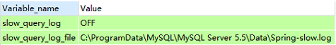

默认情况下``slow_query_log``的值为OFF，表示慢查询日志是禁用的。

```mysql
# 使用下面语句开启慢查询日志只对当前数据库生效，如果MySQL重启后则会失效
set global slow_query_log = 1;
```

如果要永久生效，就必须修改配置文件m y.cnf，在[mysqld]下增加或修改参数，然后重启MySQL服务器：

```markdown
slow_query_log=1
slow_query_log_file=/usr/local/mysql/data/spring-slow.log
long_query_time=3
log_output=FILE
```

关于慢查询的参数slow_query_log_file，它指定慢查询日志的存放路径，系统默认会给一个缺省的文件host_name-slow.log(如果没有指定参数slow_query_log_file的话)。

```mysql
# 开启慢查询日志后，什么样的SQL参会记录到慢查询里面？
SHOW VARIABLES LIKE 'long_query_time%';
show global variables like 'long_query_time';

# 设置慢查询SQL的阙值时间，也可以在my.cnf参数里面修改
# 需要重新连接或者新开一个回话才能看到修改值
set global long_query_time=3;
```

假如运行时间正好等于long_query_time的情况，并不会被记录下来。也就是说，在MySQL源码里是``判断大雨long_query_time，并非大不等于``。

#### 2.2.2 记录慢SQL

```mysql
SELECT SLEEP(4);
```

查看对应的slow_query_log_file：

```
D:\Mysql5.5\bin\mysqld, Version: 5.5.28 (MySQL Community Server (GPL)). started with:
TCP Port: 3306, Named Pipe: MySQL
Time                 Id Command    Argument
# Time: 200926 15:50:58
# User@Host: root[root] @ localhost [127.0.0.1]
# Query_time: 4.000666  Lock_time: 0.000000 Rows_sent: 1  Rows_examined: 0
use test;
SET timestamp=1601106658;
#SHOW VARIABLES LIKE 'long_query_time%';
#SHOW VARIABLES LIKE '%slow_query_log%';
SELECT SLEEP(4);
```

#### 2.2.3 查看当前系统有多少条慢查询记录

```mysql
show global status like '%Slow_queries%';

# Variable_name		Value
# Slow_queries		1
```

#### 2.2.4 日志分析工具mysqldumpshow

在生产环境中，如果要手工分析日志，查找、分析SQL，显然是一个体力活，MySQL提供了日志分析工具mysqldumpshow。

```shell
mysqldumpslow --help
```

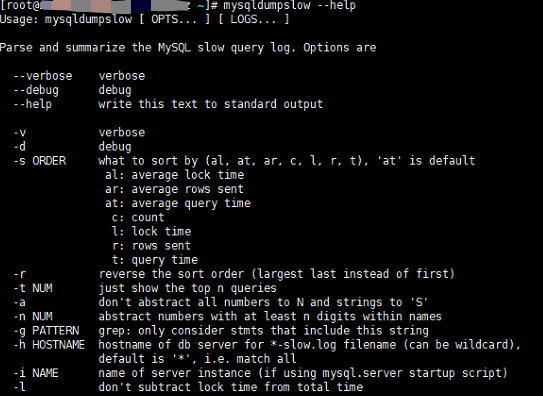

s:是表示按何种方式排序

c:访问次数

l:锁定时间

r:返回记录

t:查询时间

al:平均锁定时间

ar:平均返回记录数

at:平均查询时间

t:即为返回前面多少条的数据

g:后边搭配一个正则匹配模式，大小写不敏感的

```shell
# 得到返回记录集最多的10个SQL
mysqldumpslow -s r -t 10 /var/lib/mysql/spring-slow.log
# 得到访问次数最多的10个SQL
mysqldumpslow -s c -t 10 /var/lib/mysql/spring-slow.log
# 得到按照时间排序的前10条里面含有左连接的查询语句
mysqldumpslow -s t -t 10 -g "left join" /var/lib/mysql/spring-slow.log
# 另外建议在使用这些命令时结合 ｜ 和 more 使用，否则可能出现爆屏情况
mysqldumpslow -s r -t 10 /var/lib/mysql/spring-slow.log ｜ more
```

### 2.3 批量数据脚本

往表里插入1000W数据

```mysql
# 建表
CREATE TABLE `dept` (
  `id` int(11) NOT NULL AUTO_INCREMENT,
  `deptno` mediumint(9) DEFAULT NULL,
  `dname` varchar(20) DEFAULT NULL,
  `loc` varchar(13) DEFAULT NULL,
  PRIMARY KEY (`id`)
) ENGINE=InnoDB DEFAULT CHARSET=utf8;

CREATE TABLE `emp` (
  `id` int(11) NOT NULL AUTO_INCREMENT,
  `empno` mediumint(9) DEFAULT NULL COMMENT '编号',
  `ename` varchar(20) DEFAULT NULL COMMENT '名字',
  `job` varchar(9) DEFAULT NULL COMMENT '工作',
  `mgr` mediumint(9) DEFAULT '0' COMMENT '上级编号',
  `hiredate` date DEFAULT NULL COMMENT '入职时间',
  `sal` decimal(7,2) DEFAULT NULL COMMENT '薪水',
  `comn` decimal(7,2) DEFAULT NULL COMMENT '红利',
  `deptno` mediumint(9) DEFAULT NULL COMMENT '部门编号',
  PRIMARY KEY (`id`)
) ENGINE=InnoDB DEFAULT CHARSET=utf8;
```

#### 3.3.1 设置参数log_trust_function_createors

创建函数，假如报错：This function has none of DETERMINISTIC......

由于开启过慢查询日志，因为我们开启了bin-log，就必须为function指定一个参数。

```mysql
SHOW VARIABLES LIKE 'log_bin_trust_function_creators';
set global log_bin_trust_function_creators=1;
```

#### 2.3.2 创建函数

```mysql
# 创建函数保证每条数据都不同
# 随机参数指定长度的字符串
DELIMITER $$
CREATE FUNCTION rand_string(n INT) RETURNS VARCHAR(255)
BEGIN
	DECLARE chars_str VARCHAR(100) DEFAULT 'abcdefghijklmnopqrstuvwxyzABCDEFGHIJKLMNOPQRSTUVWXYZ';
	DECLARE return_str VARCHAR(255) DEFAULT '';
	DECLARE i INT DEFAULT 0;
	WHILE i < n DO
	SET return_str = CONCAT(return_str,SUBSTRING(chars_str, FLOOR(1+RAND()*52), 1));
	SET i = i + 1;
	END WHILE;
	RETURN return_str;
END $$

# 随机产生100~110之间的整数
DELIMITER $$
CREATE FUNCTION rand_num() RETURNS INT(5)
BEGIN
	DECLARE i INT DEFAULT 0;
	SET i = FLOOR(100+RAND()*10);
	RETURN i;
END $$

SELECT rand_string(10);
SELECT rand_num();

# 删除函数
DROP FUNCTION rand_num;
```

#### 2.3.3 创建存储过程

```mysql
# 创建往emp表中插入数据的存储过程
DELIMITER $$
CREATE PROCEDURE insert_emp(IN START INT(10), IN max_num INT(10))
BEGIN
	DECLARE i INT DEFAULT 0;
	# set autocommit = 0 把autocommit设置成0
	SET autocommit = 0;
	REPEAT
	SET i = i + 1;
	INSERT INTO emp(empno, ename, job, mgr, hiredate, sal, comn, deptno) VALUES ((START+i), rand_string(6), 'SALESMAN', 0001, CURDATE(), 2000, 400, rand_num());
	UNTIL i = max_num
	END REPEAT;
	COMMIT;
END $$

# 创建往dept表中插入数据的存储过程
DELIMITER $$
CREATE PROCEDURE insert_dept(IN START INT(10), IN max_num INT(10))
BEGIN
	DECLARE i INT DEFAULT 0;
	SET autocommit = 0;
	REPEAT
	SET i = i + 1;
	INSERT INTO dept(deptno, dname, loc) VALUES ((START+i), rand_string(10), rand_string(8));
	UNTIL i = max_num
	END REPEAT;
	COMMIT;
END $$
```

#### 2.3.4 调用存储过程

```mysql
CALL insert_dept(100, 10);
CALL insert_emp(100001, 500000);
```

### 2.4 Show profiles

``Show profiles`` 是mysql提供可以用来分析当前会话中语句执行的资源消耗情况。可以用于SQL的调优测量。

官网：https://dev.mysql.com/doc/refman/8.0/en/show-profile.html

默认情况下，参数处于``关闭状态，并保存最近15次``的运行结果。

```mysql
# 是否支持，看看当前的SQL版本是否支持
show variables like 'profiling';
# 开启功能，默认是关闭，使用前需要开启
set profiling=on;

# 运行SQL
SELECT * from tb_emp e INNER JOIN tb_dept d on e.deptId = d.id;
select * from emp group by id%10 limit 150000;
select * from emp group by id%20 order by 5;

# 查看结果
show profiles;
```

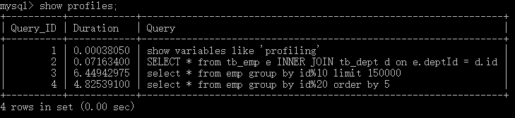

```mysql
# 诊断SQL，show profile cpu,block io for query 上一步前面的问题SQL数字号码;
show profile cpu,block io for query 3;
```


参数备注：

``ALL`` 显示所有的开销信息

``BLOCK IO`` 显示块IO相关开销

``CONTEXT SWITCHES`` 上下文切换相关开销

``CPU`` 显示CPU相关开销信息

``IPC`` 显示发送和接收相关开销信息

``MEMORY`` 显示内存相关开销信息

``PAGE FAULTS`` 显示页面错误相关开销信息

``SOURCE`` 显示和Source_function，Source_file，Source_line相关的开销信息

``SWAPS`` 显示交换次数相关开销信息

**日常开发注意点**

``converting HEAP to MyISAM`` 查询结果太大，内存都不够用了往磁盘上搬了

``Creating tmp table`` 创建临时表，拷贝数据到临时表，用完再删除

``Copying to tmp table on disk`` 把内存中临时表复制到磁盘，危险！！！

``locked``

### 2.5 全局查询日志

**配置启用**

在 MySQL 的 my.cnf中，设置如下：

```
# 开启
general_log=1
# 记录日志文件的路径
general_log_file=/path/logfile
# 输出格式
log_output=FILE
```

**编码启用**

```mysql
set global general_log=1;
set global log_output='TABLE';

# 此后，所编写的SQL语句，就会记录到mysql库里的general_log表，可以用下面的命令查看
select * from mysql.general_log;
```

``永远不要在生产环境开启这个功能。``


