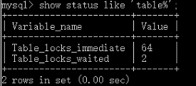
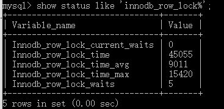
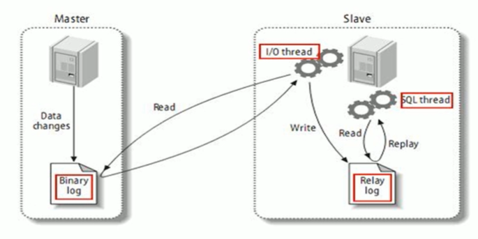
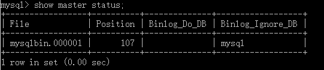
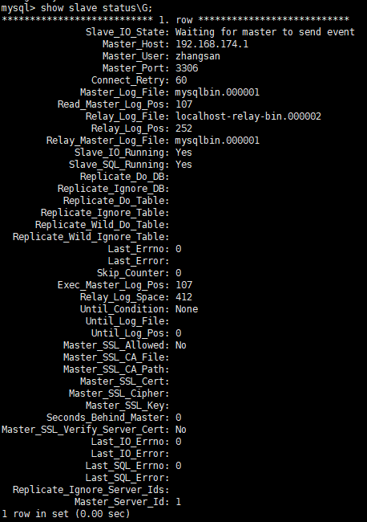

# 1 数据库事务

## 1.1 事务（Transation）及其ACID属性

《参考 Spring 事务原理详解》

> 原子性，在 InnoDB 里面是通过 undo log 来实现的，它记录了数据修改之前的值(逻辑日志)，一旦发生异常就可以用 undo log 来实现回滚操作。
>
> 持久性是通过 redo log 和 double write 双写缓冲来实现的，我们操作数据的时候，会先写到内存的 buffer pool 里面，同时记录 redo log，如果在刷盘之前出现异常，在重启后就可以读取 redo log 的内容，写入到磁盘，保证数据的持久性。 当然，恢复成功的前提是数据页本身没有被破坏，是完整的，这个通过双写缓冲 （double write）保证。 
>
> 原子性，隔离性，持久性，最后都是为了实现一致性。

## 1.2 数据库什么时候会出现事务

执行一条更新语句，实际上，它自动开启了一个事务，并且提交了，所以最终写入了磁盘。这个是开启事务的第一种方式，自动开启和自动提交。

```mysql
# InnoDB 里面有一个 autocommit 的参数（分成两个级别， session 级别和 global级别）
# 它的默认值是 ON,是否自动提交
show variables like 'autocommit';
```

手动开启事务也有几种方式，一种是用 `begin`，一种是用 `start transaction`。 

结束事务也有两种方式，第一种就是提交一个事务 `commit`，还有一种就是 ·rollback·，回滚的时候，事务也会结束。还有一种情况，客户端的连接断开的时候，事务也会结束。

当我们结束一个事务的时候，事务持有的锁就会被释放，无论是提交还是回滚。

## 1.3 并发事务处理带来的问题

``更新丢失(Lost Update)`` 当两个或多个事务选择同一行，然后基于最初选定的值更新该行时，由于每个事务都不知道其他事务的存在，就会发生丢失更新问题，最后的更新覆盖了由其他事务所做的更新。

``脏读(Dirty Reads)`` 一个事务对数据进行了增删改，但未提交，这条记录就处于不一致状态，另一个事务可以读取到未提交的数据。如果第一个事务这时候回滚，那么第二个事务读到了脏数据，不符合一致性要求。

事务A读取到了事务B已修改但尚未提交的数据。 

``不可重复读(Non-Reoeatable Reads)`` 一个事务中发生了两次读操作，第一次读操作和第二次读操作之间，另一个事务对数据进行了修改，这时候两次读取的数据是不一致的。 

事务A读取到了事务B已经提交的修改数据，不符合隔离性。

``幻读(Phantom Reads)`` 一个事物按相同的查询条件重新读取检索过的数据，却发现其他事务插入了满足其查询条件的新数据。

事务A读取到了事务B已提交的新增数据，不符合隔离性。

幻读和不可重复读有点类似，不可重复读是事务B修改了数据，幻读是事务B新增了数据。

## 1.4 数据库事务隔离级别

| 隔离级别                  | 隔离级别的值                     | 导致的问题                                                   |
| ------------------------- | -------------------------------- | ------------------------------------------------------------ |
| 未提交读 Read-Uncommitted | 0 只能保证不读取物理上损坏的数据 | 允许读取还未提交的改变了的数据，导致脏读，幻，不可重复读     |
| 已提交读 Read-Committed   | 1 语句级                         | 允许在并发事务已经提交后读取，避免脏读，允许不可重复读和幻读（默认） |
| 可重复读Repeatable-Read   | 2 事务级                         | 对相同字段的多次读取是一致的，除非数据被事务本身改变，避免脏读，不可重复读，允许幻读（有增删改操作，不允许读取） |
| 可串行化 Serializable     | 3 最高级别，事务级               | 串行化读，事务只能一个一个执行，避免了脏读，不可重复读，幻读。执行效率慢，使用时谨慎 |

InnoDB 支持的四个隔离级别和 [SQL92](http://www.contrib.andrew.cmu.edu/~shadow/sql/sql1992.txt) 定义的基本一致，隔离级别越高，越能保证数据的完整性和一致性，但是对并发性能的影响也越大。 

大多数的数据库默认隔离级别为Read Commited，比如SqlServer、 Oracle 

少数数据库默认隔离级别为: Repeatable Read，比如: MySQL InnoDB

> InnoDB 在 RR 的级别就解决了幻读的问题，这个也是 InnoDB 默认使用 RR 作为事务隔离级别的原因，既保证了数据的一致性，又支持较高的并发度。

```mysql
# 查看当前数据库的事务隔离级别
show variables like 'tx_isolation';
```

## 1.5 MVCC 实现

如果要让一个事务前后两次读取的数据保持一致， 那么我们可以在修改数据的时候给它建立一个备份或者叫快照，后面再来读取这个快照就行了。这种方案我们叫做多版本的并发控制 `Multi Version Concurrency Control (MVCC)`。

问题：这个快照什么时候创建？读取数据的时候，怎么保证能读取到这个快照而不 是最新的数据？

InnoDB 为每行记录都实现了两个隐藏字段： 

* `DB_TRX_ID` 6 字节：插入或更新行的最后一个事务的事务 ID，事务编号是自动递增的(我们把它理解为创建版本号，在数据新增或者修改为新数据的时候，记录当前事务 ID)

* `DB_ROLL_PTR` 7 字节：回滚指针(我们把它理解为删除版本号，数据被删除或记录为旧数据的时候，记录当前事务 ID)

我们把这两个事务 ID 理解为版本号。

++++++++++++++++++++++++++++++++++++Aa++++++++++++++++++++++++++++++++++++++++

在 InnoDB 中，MVCC 是通过 Undo log 实现的。

# 2 MySQL 锁机制

## 2.1 概述

锁是计算机协调多个进程或线程并发访问某一资源的机制。

在数据库中，除传统的计算资源(如CPU、RAM、I/O等)的争用以外，数据也是一种供许多用户共享的资源，如何保证数据并发访问的一致性、有效性是所有数据库必须解决的一个问题，锁冲突也是影响数据库并发访问性能的一个重要因素。从这个角度来说，锁对数据库而言显得尤其重要，也更加复杂。

**锁的分类**

从数据操作的类型（读、写）分：

`读锁(共享锁)` 针对同一份数据，多个读操作可以同时进行而不互相影响。

`写锁(排它锁)` 当前写操作没有完成前，它会阻断其他写锁和读锁。

从对数据操作的颗粒度分：`行锁`、`表锁`

```mysql
# 表级锁争用状态变量
show status like 'table%'
# 行级锁争用状态变量
show status like 'innodb_row_lock%'
```

> 锁定粒度？？？
>
> 加锁效率，表锁大于行锁，表锁只需要 直接锁住这张表就行了，而行锁还需要在表里面去检索这一行数据
>
> 冲突概率，表锁大于行锁，锁表其他任何一个事务都不能操作这张表
>
> 并发性能，表锁的冲突概率更大，所以并发性能更低

## 2.2 表锁（偏读）

偏向 MyISAM 存储引擎，开销小，获取释放锁快，避免死锁，锁定粒度大，发生锁冲突的概率最高，并发最低。

```mysql
CREATE TABLE `mylock` (
  `id` int(11) NOT NULL AUTO_INCREMENT,
  `name` varchar(20) DEFAULT NULL,
  PRIMARY KEY (`id`)
) ENGINE=MyISAM DEFAULT CHARSET=utf8;

insert into mylock(name) values('a');
insert into mylock(name) values('b');
insert into mylock(name) values('c');
insert into mylock(name) values('d');
insert into mylock(name) values('e');

# 手动增加表锁
# 为mylock表添加读锁，为book添加写锁
lock table mylock read, book write;

# 查看表上加过的锁
show open tables;

# 释放表锁
unlock tables;
```


### 2.2.1 加读锁

为mylock表加read锁（读阻塞写例子）

| session_1                                                    | session_2                                                    |
| ------------------------------------------------------------ | ------------------------------------------------------------ |
| 获得表mylock的READ锁定<br>lock table mylock read;            | 连接终端                                                     |
| 当前session可以查询该表记录<br>select * from mylock;         | 其他session也可以查询该表记录<br>select * from mylock;       |
| 当前session不能查询其他没有锁定的表<br>select * from book;<br/>ERROR 1100 (HY000): Table 'book' was not locked with LOCK TABLES | 其他session可以查询或更新未锁定的表<br>select * from book;<br>update book set card=20 where bookid = 25; |
| 当前session中插入或更新锁定的表都会提示错误<br>update mylock set name='a2' where id = 1;<br/>ERROR 1099 (HY000): Table 'mylock' was locked with a READ lock and can't be updated | 其他session插入或更新锁定表会一直等待获得锁<br>update mylock set name='a2' where id = 1; |
| 释放锁<br>unlock tables;                                     | session2 获得锁，插入操作完成<br>Query OK, 0 rows affected (40.17 sec) |

### 2.2.2 加写锁

为mylock表加write锁（MyISAM存储引擎的写阻塞读例子）

| session_1                                                    | session_2                                                    |
| ------------------------------------------------------------ | ------------------------------------------------------------ |
| 获得锁mylock的write锁定                                      | session2再连接终端                                           |
| 当前session对锁定表的查询更新插入操作都可以执行<br>select * from mylock;<br>update mylock set name='a2' where id = 1; | 其他session对锁定表的查询被阻塞，需要等待锁被释放<br>select * from mylock where id=1; |
| 释放锁<br/>unlock tables;                                    | session2获得锁，查询返回<br>5 rows in set (29.73 sec)        |

MySQL的表级锁有两种模式：

表共享读锁（Table Read Lock）

表独占写锁（Table Write Lock）

1. 对MyISAM表的读操作（加读锁），不会阻塞其他进程对同一表的读请求，但会阻塞对同一表的写请求。只有当前读锁释放后，才会执行其他进程的写操作。
2. 对MyISAM表的写操作（加写锁），会阻塞其他线程对同一表的读和写操作，只有当写锁释放后，才会执行其他进程的读写操作。

简而言之，就是读锁会阻塞写，但不会阻塞读。而写锁则会把读和写都阻塞。

### 2.2.3 分析表锁定

```mysql
show status like 'table%';
```



可以通过检查table_locks_waited和table_locks_immediate状态变量来分析系统上的表锁定：

``table_locks_immediate`` 产生表级锁的次数，表示可以立即获取锁的查询次数，每立即获取锁值加1；

``table_locks_waited`` 出现表级锁争用而产生等待的次数（不能立即获取锁的次数，每等待一次锁值加1），此值高则说明存在着较严重的表级锁争用情况；

此外，MyISAM的读写锁调度是写优先，这也是MyISAM不适合做写为主表的引擎。因为写锁后，其他线程不能做任何操作，大量的更新会是查询很难得到锁，从而造成阻塞。

## 2.3 行锁（偏写）

偏向InnoDB存储引擎，开销大，获取释放锁慢；会出现死锁；锁定粒度最小，发生锁冲突的概率最低，并发度也最高。

InnoDB与MyISAM的最大不同有两点：一是支持事务（TRANSACTION）;二是采用了行级锁

### 2.3.1 行锁演示

```mysql
create table innodb_lock(a int(11), b varchar(16)) engine=innodb;

insert into innodb_lock values(1, 'b2');
insert into innodb_lock values(3, '3');
insert into innodb_lock values(4, '4000');
insert into innodb_lock values(5, '5000');
insert into innodb_lock values(6, '6000');
insert into innodb_lock values(7, '7000');

create index innodb_a_ind on innodb_lock(a);
create index innodb_b_ind on innodb_lock(b);
```

| session1                                                     | session2                                                     |
| ------------------------------------------------------------ | ------------------------------------------------------------ |
| set autocommit=0;                                            | set autocommit=0;                                            |
| 更新但不提交，没有手动commit<br>update innodb_lock set b='4001' where a=4; | session更新同一行数据，只能阻塞等待<br>update innodb_lock set b='4002' where a=4; |
| 提交更新<br>commit;                                          | 解除阻塞，更新正常进行<br>Query OK, 1 row affected (15.42 sec) |
|                                                              | commit执行提交                                               |
| 更新但不提交，没有手动commit<br/>update innodb_lock set b='4002' where a=4;<br>session1自己可以查询到更新 | session2查询不到session1的更改<br>select  * from innodb_lock; |
| 提交更新<br/>commit;                                         | 依然查询不到，需要session2也执行commit;<br>才能查询到session1的更新，保证可重复读 |
| session1更新a=4;                                             | session更新a=5;<br>不会阻塞                                  |

#### 无索引行锁升级为表锁

varchar  不用 ' '  导致系统自动转换类型, 行锁变表锁

```mysql
# session1做如下更新（b使用int类型变表锁），session2会阻塞(有索引未加‘’)
update innodb_lock set a=8 where b=4001;

# 删除 b 字段的索引后，session1使用 b 字段做更新（无索引变表锁），session2会阻塞
update innodb_lock set a=8 where b='4001';
```

#### 如何锁定一行

```mysql
# select ... for update;锁定某一行后，其他操作会被阻塞，直到锁定行的会话commit
begin;
select * from innodb_lock where a=8 for update;
...
commit;
```

#### 行锁总结

Innodb存储引擎由于实现了行级锁定，虽然在锁定机制的实现方面所带来的性能损耗可能比表级锁定会更高一些，但是在整体并发处理能力方面要远远优于MyISAM的表级锁定的。当系统并发量较高的时候，Innodb的整体性能和MyISAM相比就会有比较明显的优势了。

但是Innodb的行级锁定同样也有脆弱的一面，当我们使用不当的时候，可能会让InnoDB的整体性能表现不仅不能比MyISAM高甚至会更差。

#### 行锁分析

```mysql
show status like 'innodb_row_lock%';
```



各个状态量的说明如下：

``Innodb_row_lock_current_waits`` 当前正在等待锁定的数量

``Innodb_row_lock_time`` 从系统启动到现在锁定总时间长度

``Innodb_row_lock_time_avg `` 每次等待所花平均时间

``Innodb_row_lock_time_max`` 从系统启动到现在等待最长的一次所花的时间

``Innodb_row_lock_waits`` 系统启动后到现在总共能带的次数

比较重要的主要是：

``Innodb_row_lock_time_avg `` 等待平均时长

``Innodb_row_lock_waits`` 等待总次数

``Innodb_row_lock_time`` 等待总时长

尤其等等待次数很高，而且每次等待时长也不小的时候，我们就需要分析系统中为什么如此多的等待，然后根据分析结果着手指定优化计划（show profile）。

### 2.3.2 优化建议

尽可能让所有数据检索都通过索引来完成，避免无索引行锁升级为表锁

合理设计索引，尽量缩小锁的范围

尽可能较少检索条件，避免间隙锁

尽量控制事务大小，减少锁定资源量和时间长度

尽可能低级别事务隔离

## 2.4 间隙锁

当我们用范围条件而不是相等条件检索数据，并请求共享或排它锁时，InnoDB会给符合条件的已有数据记录的索引项加锁；对于键值在条件范围但不存在的记录，叫做“间隙（GAP）”；

InnoDB也会对这个“间隙”加锁，这种锁机制就是所谓的``间隙锁（Next-Key锁）``。

**危害**

因为Query执行过程中通过范围查找的话，它会锁定整个范围内所有的索引键值，即使这个键值并不存在。

间隙锁有一个比较致命的弱点，就是当锁定一个范围键值之后，即使某些不存在的键值也会被无辜的锁定，而造成在锁定的时候无法插入锁定范围的任何数据。在某些场景下这可能会对性能造成很大的危害。

| session1                                           | session2                                                     |
| -------------------------------------------------- | ------------------------------------------------------------ |
| update innodb_lock set b='0928' where a>1 and a<6; | 阻塞产生，暂时不能插入<br>insert into innodb_lock values(2, '2000'); |
| commit;                                            | 阻塞解除，完成插入<br>Query OK, 1 row affected (4.47 sec)    |

## 2.5 页锁

开销和加锁时间界于表锁和行锁之间：会出现死锁；锁定粒度界于表锁和行锁之间，并发度一般。

## 2.6 死锁 

### 2.6.1 锁的释放与阻塞

事务结束(commit，rollback)或客户端连接断开时，锁会释放。

如果一个事务一直未释放锁，MySQL 有一个参数来控制获取锁的等待时间，默认是 50 秒。

```mysql
#[Err] 1205 - Lock wait timeout exceeded; try restarting transaction
show VARIABLES like 'innodb_lock_wait_timeout';
```

### 2.6.2 死锁的发生和检测

死锁演示：

| session1                                            | session2                                |
| --------------------------------------------------- | --------------------------------------- |
| begin; <br>select * from t2 where id =1 for update; |                                         |
|                                                     | begin;<br/>delete from t2 where id =4 ; |
| update t2 set name= '4d' where id =4 ;              |                                         |
|                                                     | delete from t2 where id =1 ;            |

在第一个事务中，检测到了死锁马上退出了，第二个事务获得了锁，不需要等待 50 秒：

```
ERROR 1213 (40001): Deadlock found when trying to get lock; try restarting transaction
```

**为什么可以直接检测到呢？**

是因为死锁的发生需要满足一定的条件，所以在发生死锁时，InnoDB 一般都能通过`算法 wait-for graph` 自动检测到。 

死锁的产生条件： 

* 同一时刻只能有一个事务持有这把锁

* 其他的事 务需要在这个事务释放锁之后才能获取锁，而不可以强行剥夺

* 当多个事务形成等 待环路的时候，即发生死锁

### 2.6.3 查看锁信息（日志） 

SHOW STATUS 命令中，包括了一些行锁的信息：

```mysql
show status like 'innodb_row_lock_%';
# Innodb_row_lock_current_waits：当前正在等待锁定的数量
# Innodb_row_lock_time ：从系统启动到现在锁定的总时间长度，单位 ms
# Innodb_row_lock_time_avg ：每次等待所花平均时间
# Innodb_row_lock_time_max：从系统启动到现在等待最长的一次所花的时间
# Innodb_row_lock_waits ：从系统启动到现在总共等待的次数

# SHOW 命令是一个概要信息，InnoDB 还提供了三张表来分析事务与锁的情况
# 当前运行的所有事务
select * from information_schema.INNODB_TRX;
# 当前出现的锁
select * from information_schema.INNODB_LOCKS;
# 锁等待的对应关系
select * from information_schema.INNODB_LOCK_WAITS;
```

如果一个事务长时间持有锁不释放，可以 kill 事务对应的线程 ID，也就是 INNODB_TRX 表中的 trx_mysql_thread_id。 

死锁的问题不能每次都靠 kill 线程来解决，应尽量在编码的过程中避免。

### 2.6.4 死锁的避免

1. 在程序中，操作多张表时，尽量以相同的顺序来访问（避免形成等待环路）

2. 批量操作单张表数据的时候，先对数据进行排序（避免形成等待环路）

3. 申请足够级别的锁，如果要操作数据，就申请排它锁

4. 尽量使用索引访问数据，避免没有 where 条件的操作，避免锁表

5. 如果可以，大事务化成小事务

6. 使用等值查询而不是范围查询查询数据，命中记录，避免间隙锁对并发的影响

# 3 主从复制

## 3.1 复制的基本原理

slave会从master读取binlog来进行数据同步。



MySQL复制过程分为三步：

1. master将改变记录到二进制日志（binary log），这些记录过程叫做二进制日志事件，binary log events；
2. slave将master的binary log events拷贝到它的中继日志（relay log）;
3. slave重做中继日志中的事件，将改变应用到自己的数据库中，MySQL复制是异步的且串行化的。

## 3.2 复制的基本原则

每个slave只有一个master

每个slave只能有一个唯一的服务器ID

每个master可以有多个salve

## 3.3 一主一从常见配置

MySQL版本一致且后台以服务运行，主从都配置在【mysqld】结点下，都是小写。

主机从机都关闭防火墙。

### 3.3.1 主机修改my.cnf配置文件

```markdown
[mysqld]
# 1.【必须】主服务器唯一ID
server-id =1
# 2.【必须】启用二进制日志
log-bin=自己本地的路径/mysqlbin
log-bin=D:/Mysql5.5/data/mysqlbin
# 3.【可选】启动错误日志
log-err=自己本地的路径/mysqlerr
# 4.【可选】根目录
basedir="自己本地路径"
# 5.【可选】临时目录
tmpdir="自己的本地路劲"
# 6.【可选】数据目录
datadir="自己本地路径/Data/"
# 7.主机，读写都可以
read-only=0
# 8.【可选】设置不要复制的数据库
binlog-ignore-db=mysql
# 9.【可选】设置需要复制的数据
binlog-do-db=需要复制的主数据库名字
```

### 3.3.2 从机修改my.cnf配置文件

```markdown
# 【必须】从服务器唯一ID
server-id       = 2
# 【可选】启用二进制文件
log-bin=mysql-bin
```

### 3.3.3 在主机上建立账户并授权slave

```mysql
# 给ip为192.168.174.128的从机授权帐号为zhangsan密码为123456的帐号访问
GRANT REPLICATION SLAVE  ON*.* TO '帐号'@'从机器数据库IP' IDENTIFIED BY '密码';
GRANT REPLICATION SLAVE  ON*.* TO 'zhangsan'@'192.168.174.128' IDENTIFIED BY '123456';
# 刷新MySQL的系统权限相关表
flush privileges;
# 查询主机状态，记录下File和Position的值（从File文件的Position行开始复制）
show master status;
```



### 3.3.4 在从机上配置需要复制的主机

```mysql
# 如果之前做过主从复制，要先停止
stop slave;

CHANGE MASTER TO 
MASTER_HOST='主机IP',
MASTER_USER='帐号',
MASTER_PASSWORD='密码',
MASTER_LOG_FILE='File名字',MASTER_LOG_POS=Position数字;
CHANGE MASTER TO 
MASTER_HOST='192.168.174.1',
MASTER_USER='zhangsan',
MASTER_PASSWORD='123456',
MASTER_LOG_FILE='mysqlbin.000001',MASTER_LOG_POS=107;

# 启动从服务器复制功能
start slave;

# 查看slave状态
show slave status;
```

下面两个参数都是YES，则说明主从配置成功！

Slave_IO_Running:Yes

Slave_SQL_Running:Yes



------


