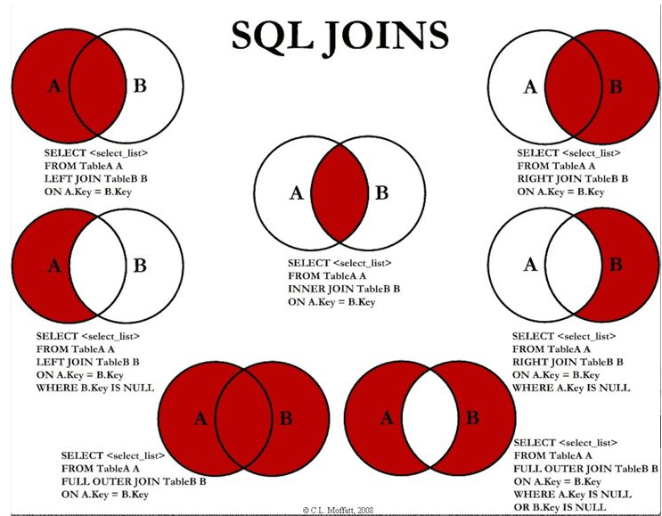
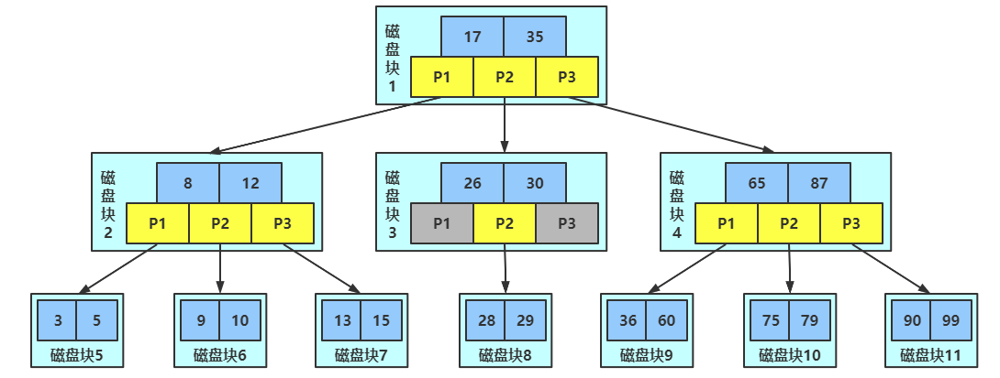

## 1 索引优化分析

### 1.1 SQL 性能下降原因

查询语句写的烂

索引失效（单值、复合）

关联查询太多join（设计缺陷或不得已的需求）

服务器调优及各个参数设置（缓冲\线程数等）

### 1.2 常见通用 join 查询

#### 1.2.1 SQL 执行顺序

```mysql
# 手写
SELECT DISTINCT
	<select_list>
FROM
	<left_table> <join_type> JOIN <right_table> ON <join_condition>
WHERE
	<where_condition>
GROUP_BY
	<group_by_list>
HAVING
	<having_condition>
ORDER BY
	<order_by_condition>
LIMIT <limit_number>

# 机读
FROM <left_table> 
ON <join_condition>
<join_type> JOIN <right_table> 
WHERE <where_condition>
GROUP_BY <group_by_list>
HAVING <having_condition>
SELECT
DISTINCT <select_list>
ORDER BY <order_by_condition>
LIMIT <limit_number>
```


#### 1.2.2 JOIN 图



#### 1.2.3 7种 JOIN

```mysql
# 基础数据
DROP TABLE IF EXISTS `tb_dept`;
CREATE TABLE `tb_dept` (
  `id` int(11) NOT NULL AUTO_INCREMENT,
  `deptName` varchar(255) DEFAULT NULL,
  `locADD` varchar(255) DEFAULT NULL,
  PRIMARY KEY (`id`)
) ENGINE=InnoDB AUTO_INCREMENT=6 DEFAULT CHARSET=utf8;

INSERT INTO `tb_dept` VALUES ('1', 'RD', '11');
INSERT INTO `tb_dept` VALUES ('2', 'HR', '12');
INSERT INTO `tb_dept` VALUES ('3', 'MK', '13');
INSERT INTO `tb_dept` VALUES ('4', 'MIS', '14');
INSERT INTO `tb_dept` VALUES ('5', 'FD', '15');

DROP TABLE IF EXISTS `tb_emp`;
CREATE TABLE `tb_emp` (
  `id` int(11) NOT NULL AUTO_INCREMENT,
  `name` varchar(255) DEFAULT NULL,
  `deptId` int(11) DEFAULT NULL,
  PRIMARY KEY (`id`)
) ENGINE=InnoDB AUTO_INCREMENT=9 DEFAULT CHARSET=utf8;

INSERT INTO `tb_emp` VALUES ('1', 'z3', '1');
INSERT INTO `tb_emp` VALUES ('2', 'z4', '2');
INSERT INTO `tb_emp` VALUES ('3', 'z5', '3');
INSERT INTO `tb_emp` VALUES ('4', 'w5', '2');
INSERT INTO `tb_emp` VALUES ('5', 'w6', '2');
INSERT INTO `tb_emp` VALUES ('6', 's7', '3');
INSERT INTO `tb_emp` VALUES ('7', 's8', '4');
INSERT INTO `tb_emp` VALUES ('8', 's9', '51');

# 内连接(两表的共有部分)
SELECT * FROM tb_emp te INNER JOIN tb_dept td ON te.deptId = td.id;

# 左连接（左表的全部，右表不满足补NULL）
SELECT * FROM tb_emp te LEFT JOIN tb_dept td ON te.deptId = td.id;

# 右连接（右表的全部，左表不满足的补NULL）
SELECT * FROM tb_emp te RIGHT JOIN tb_dept td ON te.deptId = td.id;

# 特殊的左连接（显示为左表的独有的数据）
# 说明：查询tb_emp 表中跟tb_dept 表无关联关系的数据，即tb_emp 独占，且tb_dept 表的显示列补NULL
SELECT * FROM tb_emp te LEFT JOIN tb_dept td ON te.deptId = td.id WHERE td.id IS NULL;

# 特殊的右连接（显示为右表的独有的数据 ）
# 说明：查询tb_dept 表中跟tb_emp 表无关联关系的数据，即tb_dept 独占，且tb_emp 表的显示列补NULL
SELECT * FROM tb_emp te RIGHT JOIN tb_dept td ON te.deptId = td.id WHERE te.deptId IS NULL;

# 全连接（显示全部数据）（mysql 不支持 full outer join）
# UNION ：有去重的功能。
SELECT * FROM tb_emp te LEFT JOIN tb_dept td ON te.deptId = td.id
UNION
SELECT * FROM tb_emp te RIGHT JOIN tb_dept td ON te.deptId = td.id;

# 显示两表的独有的数据
SELECT * FROM tb_emp te LEFT JOIN tb_dept td ON te.deptId = td.id WHERE td.id IS NULL
UNION
SELECT * FROM tb_emp te RIGHT JOIN tb_dept td ON te.deptId = td.id WHERE te.deptId IS NULL;
```

### 1.3 索引简介

#### 1.3.1 索引是什么

MySQL 官方对索引的定义为：``索引(Index)`` 是帮助 MySQL 高效获取数据的数据结构。

可以得到索引的本质：``索引是数据结构（排好序的快速查找数据结构）``。

索引的目的在于提高查询效率(where和order by)，可以类比字典。

在数据之外，数据库系统还维护着满足特定查找算法的数据结构，这些数据结构以某种方式引用（指向）数据，这样就可以在这些数据结构上实现高级查找算法。这种数据结构，就是索引。

下图索引方式实例，左边是数据表，一共两列七条记录，最左边是数据记录的物理地址：


为了加快Col2的查找，可以维护一个右边所示的二叉查找树，每个节点分别包含索引值和一个指向对应数据记录物理地址的指针，这样就可以运用二叉查找在一定的复杂度内获取到相应数据，从而快速的检索出符合条件的记录。

一般来说索引本身也很大，不可能全部存储在内存中，因此``索引往往以文件形式存储在硬盘上``。

我们平时所说的索引，如果没有特别指明，都是指B树(``多路搜索树``，并不一定是二叉树)结构组织的索引。其中聚集索引，次要索引，覆盖索引，复合索引，前缀索引，唯一索引默认都是使用``B+树索引``，统称索引。当然,除了B+树这种类型的索引之外，还有哈希索引(hash index)等。

#####  索引优势

1. 提高数据检索效率，降低数据库的IO成本

2. 通过索引列对数据进行排序，降低数据排序的成本，降低了CPU的消耗

##### 索引劣势

1. 实际上索引也是一张表，该表保存了主键和索引字段，并指向实体表的记录,所以索引列也是要占用空间的

2. 虽然索引大大提高了查询速度，同时却会降低更新表的速度,如果对表INSERT,UPDATE和DELETE。
   因为更新表时，MySQL不仅要不存数据，还要保存一下索引文件每次更新添加了索引列的字段，都会调整因为更新所带来的键值变化后的索引信息

3. 索引只是提高效率的一个因素，如果你的MySQL有大数据量的表，就需要花时间研究建立优秀的索引，或优化查询语句

### 1.4 索引分类

``单值索引`` 即一个索引只包含单个列，一个表可以有多个单列索引

``唯一索引`` 索引列的值必须唯一，但允许有空值

``复合索引`` 即一个索引包含多个列

```mysql
# 创建	indexName -> idx_*
CREATE [UNIQUE] INDEX indexName ON tableName(columnName(length));
ALTER TABLE tableName ADD [UNIQUE] INDEX [indexName] (columnName(length));
ALTER TABLE tb_emp ADD INDEX idx_name (name);

# 删除
DROP INDEX [indexName] ON tableName;

# 查看
SHOW INDEX FROM tableName;

# ALTER 有四种方式来添加数据库表的索引
# 该语句添加一个主键，这意味着索引值必须是唯一的，且不能为NULL
ALTER TABLE tableName ADD PRIMARY KEY (column_list);
# 该语句创建索引的值必须是唯一的（除了NULL之外，NULL可能会出现多次）
ALTER TABLE tableName ADD UNIQUE index_name (column_list);
# 该语句添加普通索引，索引值可以出现多次
ALTER TABLE tableName ADD INDEX index_name (column_list);
# 该语句指定了索引为FULLTEXT，用于全文索引
ALTER TABLE tableName ADD FULLTEXT index_name (column_list);
```

### 1.5 索引结构

BTree索引，Hash索引，full-text全文索引，R-Tree索引

#### BTree 索引检索原理




