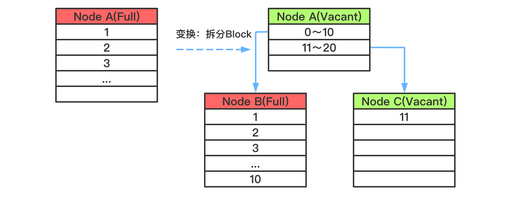
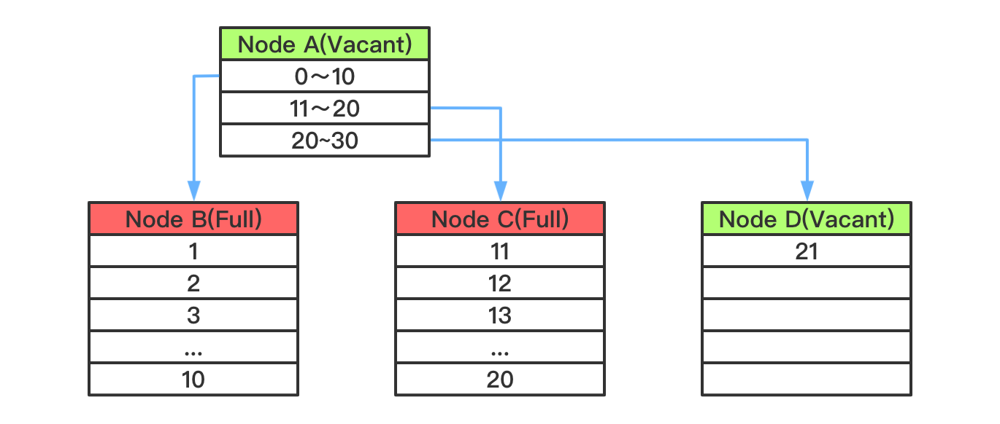

## 1 索引优化分析

### 1.1 SQL 性能下降原因

查询语句写的烂

索引失效（单值、复合）

关联查询太多join（设计缺陷或不得已的需求）

服务器调优及各个参数设置（缓冲\线程数等）

### 1.2 常见通用 join 查询

#### 1.2.1 SQL 执行顺序

```mysql
# 手写
SELECT DISTINCT
	<select_list>
FROM
	<left_table> <join_type> JOIN <right_table> ON <join_condition>
WHERE
	<where_condition>
GROUP_BY
	<group_by_list>
HAVING
	<having_condition>
ORDER BY
	<order_by_condition>
LIMIT <limit_number>

# 机读
FROM <left_table> 
ON <join_condition>
<join_type> JOIN <right_table> 
WHERE <where_condition>
GROUP_BY <group_by_list>
HAVING <having_condition>
SELECT
DISTINCT <select_list>
ORDER BY <order_by_condition>
LIMIT <limit_number>
```


#### 1.2.2 JOIN 图


#### 1.2.3 7种 JOIN

```mysql
# 基础数据
DROP TABLE IF EXISTS `tb_dept`;
CREATE TABLE `tb_dept` (
  `id` int(11) NOT NULL AUTO_INCREMENT,
  `deptName` varchar(255) DEFAULT NULL,
  `locADD` varchar(255) DEFAULT NULL,
  PRIMARY KEY (`id`)
) ENGINE=InnoDB AUTO_INCREMENT=6 DEFAULT CHARSET=utf8;

INSERT INTO `tb_dept` VALUES ('1', 'RD', '11');
INSERT INTO `tb_dept` VALUES ('2', 'HR', '12');
INSERT INTO `tb_dept` VALUES ('3', 'MK', '13');
INSERT INTO `tb_dept` VALUES ('4', 'MIS', '14');
INSERT INTO `tb_dept` VALUES ('5', 'FD', '15');

DROP TABLE IF EXISTS `tb_emp`;
CREATE TABLE `tb_emp` (
  `id` int(11) NOT NULL AUTO_INCREMENT,
  `name` varchar(255) DEFAULT NULL,
  `deptId` int(11) DEFAULT NULL,
  PRIMARY KEY (`id`)
) ENGINE=InnoDB AUTO_INCREMENT=9 DEFAULT CHARSET=utf8;

INSERT INTO `tb_emp` VALUES ('1', 'z3', '1');
INSERT INTO `tb_emp` VALUES ('2', 'z4', '2');
INSERT INTO `tb_emp` VALUES ('3', 'z5', '3');
INSERT INTO `tb_emp` VALUES ('4', 'w5', '2');
INSERT INTO `tb_emp` VALUES ('5', 'w6', '2');
INSERT INTO `tb_emp` VALUES ('6', 's7', '3');
INSERT INTO `tb_emp` VALUES ('7', 's8', '4');
INSERT INTO `tb_emp` VALUES ('8', 's9', '51');

# 内连接(两表的共有部分)
SELECT * FROM tb_emp te INNER JOIN tb_dept td ON te.deptId = td.id;

# 左连接（左表的全部，右表不满足补NULL）
SELECT * FROM tb_emp te LEFT JOIN tb_dept td ON te.deptId = td.id;

# 右连接（右表的全部，左表不满足的补NULL）
SELECT * FROM tb_emp te RIGHT JOIN tb_dept td ON te.deptId = td.id;

# 特殊的左连接（显示为左表的独有的数据）
# 说明：查询tb_emp 表中跟tb_dept 表无关联关系的数据，即tb_emp 独占，且tb_dept 表的显示列补NULL
SELECT * FROM tb_emp te LEFT JOIN tb_dept td ON te.deptId = td.id WHERE td.id IS NULL;

# 特殊的右连接（显示为右表的独有的数据 ）
# 说明：查询tb_dept 表中跟tb_emp 表无关联关系的数据，即tb_dept 独占，且tb_emp 表的显示列补NULL
SELECT * FROM tb_emp te RIGHT JOIN tb_dept td ON te.deptId = td.id WHERE te.deptId IS NULL;

# 全连接（显示全部数据）（mysql 不支持 full outer join）
# UNION ：有去重的功能。
SELECT * FROM tb_emp te LEFT JOIN tb_dept td ON te.deptId = td.id
UNION
SELECT * FROM tb_emp te RIGHT JOIN tb_dept td ON te.deptId = td.id;

# 显示两表的独有的数据
SELECT * FROM tb_emp te LEFT JOIN tb_dept td ON te.deptId = td.id WHERE td.id IS NULL
UNION
SELECT * FROM tb_emp te RIGHT JOIN tb_dept td ON te.deptId = td.id WHERE te.deptId IS NULL;
```

### 1.3 索引简介

#### 1.3.1 索引是什么

MySQL 官方对索引的定义为：``索引(Index)`` 是帮助 MySQL 高效获取数据的数据结构。

可以得到索引的本质：``索引是数据结构（排好序的快速查找数据结构）``。

索引的目的在于提高查询效率(where和order by)，可以类比字典。

在数据之外，数据库系统还维护着满足特定查找算法的数据结构，这些数据结构以某种方式引用（指向）数据，这样就可以在这些数据结构上实现高级查找算法。这种数据结构，就是索引。

下图索引方式实例，左边是数据表，一共两列七条记录，最左边是数据记录的物理地址：


为了加快Col2的查找，可以维护一个右边所示的二叉查找树，每个节点分别包含索引值和一个指向对应数据记录物理地址的指针，这样就可以运用二叉查找在一定的复杂度内获取到相应数据，从而快速的检索出符合条件的记录。

一般来说索引本身也很大，不可能全部存储在内存中，因此``索引往往以文件形式存储在硬盘上``。

我们平时所说的索引，如果没有特别指明，都是指B树(``多路搜索树``，并不一定是二叉树)结构组织的索引。其中聚集索引，次要索引，覆盖索引，复合索引，前缀索引，唯一索引默认都是使用``B+树索引``，统称索引。当然,除了B+树这种类型的索引之外，还有哈希索引(hash index)等。

#####  索引优势

1. 提高数据检索效率，降低数据库的IO成本

2. 通过索引列对数据进行排序，降低数据排序的成本，降低了CPU的消耗

##### 索引劣势

1. 实际上索引也是一张表，该表保存了主键和索引字段，并指向实体表的记录,所以索引列也是要占用空间的

2. 虽然索引大大提高了查询速度，同时却会降低更新表的速度,如果对表INSERT,UPDATE和DELETE。
   因为更新表时，MySQL不仅要不存数据，还要保存一下索引文件每次更新添加了索引列的字段，都会调整因为更新所带来的键值变化后的索引信息

3. 索引只是提高效率的一个因素，如果你的MySQL有大数据量的表，就需要花时间研究建立优秀的索引，或优化查询语句

### 1.4 索引分类

``单值索引`` 即一个索引只包含单个列，一个表可以有多个单列索引

``唯一索引`` 索引列的值必须唯一，但允许有空值

``复合索引`` 即一个索引包含多个列

```mysql
# 创建	indexName -> idx_*
CREATE [UNIQUE] INDEX indexName ON tableName(columnName(length));
ALTER TABLE tableName ADD [UNIQUE] INDEX [indexName] (columnName(length));
ALTER TABLE tb_emp ADD INDEX idx_name (name);

# 删除
DROP INDEX [indexName] ON tableName;

# 查看
SHOW INDEX FROM tableName;

# ALTER 有四种方式来添加数据库表的索引
# 该语句添加一个主键，这意味着索引值必须是唯一的，且不能为NULL
ALTER TABLE tableName ADD PRIMARY KEY (column_list);
# 该语句创建索引的值必须是唯一的（除了NULL之外，NULL可能会出现多次）
ALTER TABLE tableName ADD UNIQUE index_name (column_list);
# 该语句添加普通索引，索引值可以出现多次
ALTER TABLE tableName ADD INDEX index_name (column_list);
# 该语句指定了索引为FULLTEXT，用于全文索引
ALTER TABLE tableName ADD FULLTEXT index_name (column_list);
```

### 1.5 索引结构

BTree索引，Hash索引，full-text全文索引，R-Tree索引

#### 1.5.1 BTree 索引检索原理


BTree索引(Balanced Tree)，是一种很普遍的数据库索引结构，oracle默认的索引类型。其特点是定位高效、利用率高、自我平衡，特别适用于高基数字段，定位单条或小范围数据非常高效。理论上，使用BTree在亿条数据与100条数据中定位记录的花销相同。

BTree索引的数据结构如下：


结构看起来BTree索引与Binary Tree相似，但在细节上有所不同，上图中用不同颜色的标示出了BTree索引的几个主要特点：

``树形结构`` 由根节root、分支branches、叶leaves三级节点组成，其中分支节点可以有多层

``多分支结构`` 与binary tree不相同的是，BTree索引中单root/branch可以有多个子节点（超过2个）

``双向链表`` 整个叶子节点部分是一个双向链表

单个数据块中包括多条索引记录，结构上BTree与Binary Tree的区别，在于binary中每节点代表一个数值，而balanced中root和BTree节点中记录了多条值范围条目，这些值范围条目分别指向在其范围内的叶子节点。既root与branch可以有多个分支，而不一定是两个，对数据块的利用率高。

在leaf节点中，同样也是存放了多条索引记录，这些记录就是具体的索引列值，和与其对应的rowid。另外，在叶节点层上，所有的节点在组成了一个双向链表。

了解基本结构后，下图展示定位数值82的过程：


演算如下：

读取root节点，判断82大于在0-120之间，走左边分支。

读取左边branch节点，判断82大于80且小于等于120，走右边分支。

读取右边leaf节点，在该节点中找到数据82及对应的rowid，使用rowid去物理表中读取记录数据块(如果是count或者只select rowid，则最后一次读取不需要)。

在整个索引定位过程中，数据块的读取只有3次，既三次I/O后定位到rowid。

而由于Btree索引对结构的利用率很高，定位高效。当1千万条数据时，Btree索引也是三层结构(依稀记得亿级数据才是3层与4层的分水岭)。定位记录仍只需要三次I/O，这便是开头所说的，100条数据和1千万条数据的定位，在btree索引中的花销是一样的。

##### 平衡扩张

除了利用率高、定位高效外，Btree的另一个特点是能够永远保持平衡，这与它的扩张方式有关。(unbalanced和hotspot是两类问题，之前我一直混在一起)，先描述下Btree索引的扩张方式：

 新建一个索引，索引上只会有一个leaf节点，取名为Node A，不断的向这个leaf节点中插入数据后，直到这个节点满，这个过程如下图（绿色表示新建/空闲状态，红色表示节点没有空余空间）：


当Node A满之后，我们再向表中插入一条记录，此时索引就需要做拆分处理：会新分配两个数据块NodeB & C，如果新插入的值，大于当前最大值，则将Node A中的值全部插入Node B中，将新插入的值放到Node C中；否则按照5-5比例，将已有数据分别插入到NodeB与C中。

无论采用哪种分割方式，之前的leaf节点A，将变成一个root节点，保存两个范围条目，指向B与C，结构如下图（按第一种拆分形式）：



当Node C满之后，此时 Node A仍有空余空间存放条目，所以不需要再拆分，而只是新分配一个数据块Node D，将在Node A中创建指定到Node D的条目：



如果当根节点Node A也满了，则需要进一步拆分：新建Node E&F&G，将Node A中范围条目拆分到E&F两个节点中，并建立E&F到BCD节点的关联，向Node G插入索引值。此时E&F为branch节点，G为leaf节点，A为Root节点：


在整个扩张过程中，Btree自身总能保持平衡，Leaf节点的深度能一直保持一致。

##### 单一方向扩展引起的索引竞争(Index Contention)

 若索引列使用sequence或者timestamp这类只增不减的数据类型。这种情况下Btree索引的增长方向总是不变的，不断的向右边扩展，因为新插入的值永远是最大的。

当一个最大值插入到leaf block中后，leaf block要向上传播，通知上层节点更新所对应的“值范围”条目中的最大值，因此所有靠右边的block(从leaf 到branch甚至root)都需要做更新操作，并且可能因为块写满后执行块拆分。

 如果并发插入多个最大值，则最右边索引数据块的的更新与拆分都会存在争抢，影响效率。在AWR报告中可以通过检测``enq: TX – index contention``事件的时间来评估争抢的影响。解决此类问题可以使用Reverse Index解决，不过会带来新的问题。

##### Index Browning 索引枯萎

``Index Browning 索引枯萎``(不知道该怎么翻译这个名词，就是指leaves节点”死”了，树枯萎了)，其实oracle针对这个问题有优化机制，但优化的不彻底，所以还是要拿出来的说。

我们知道当``表中的数据删除后，索引上对应的索引值是不会删除的``，特别是在一性次删除大批量数据后，会造成大量的dead leaf挂到索引树上。考虑以下示例，如果表100以上的数据会部被删除了，但这些记录仍在索引中存在，此时若对该列取max()：


通过与之前相同演算，找到了索引树上最大的数据块，按照记录最大的值应该在这里，但发现这数据块里的数据已经被清空了，与是利用Btree索引的另一个特点：leaves节点是一个双向列表，若数据没有找到就去临近的一个数据块中看看，在这个数据块中发现了最大值99。

在计算最大值的过程中，这次的定位多加载了一个数据块，再极端的情况下，大批量的数据被删除，就会造成大量访问这些dead leaves。

针对这个问题的一般解决办法是重建索引，但记住! 重建索引并不是最优方案，详细原因可以看看这。使用coalesce语句来整理这些dead leaves到freelist中，就可以避免这些问题。理论上oracle中这步操作是可以自动完成的，但在实际中一次性大量删除数据后，oracle在短时间内是反应不过来的。

#### 1.5.2 需要创建索引的情况

1. 主键自动建立唯一索引
2. 频繁作为查询的条件的字段应该创建索引
3. 查询中与其他表关联的字段，外键关系建立索引
4. 频繁更新的字段不适合创建索引，因为每次更新不单单是更新了记录还会更新索引，加重IO负担
5. Where条件里用不到的字段不创建索引
6. 单间/组合索引的选择问题，who？（在高并发下倾向创建组合索引）
7. 查询中排序的字段，排序字段若通过索引去访问将大大提高排序的速度
8. 查询中统计或者分组字段

#### 1.5.3 不要创建索引的情况

1. 表记录太少
2. 经常增删改的表
3. 数据重复且分布平均的表字段，因此应该只为经常查询和经常排序的数据列建立索引。 注意，如果某个数据列包含许多重复的内容，为它建立索引就没有太大的实际效果。

假如一个表有10万条记录，有一个字段A只有T和F两种值，且每个值的分布概率大概为50%，那么对这种表A字段建索引一般不会提高数据库的查询速度。

索引的选择性是指索引列中不同值的数目与表中记录数的比。如果一个表中有2000条记录，表索引列有1980个不同的值，那么这个索引的选择性就是1980/2000=0.99。一个索引的选择性越接近1，这个索引的效率就越高。

### 1.6 索引优化

#### 1.6.1 索引分析

##### 单表

```mysql
CREATE TABLE `article` (
  `id` int(10) NOT NULL AUTO_INCREMENT,
  `author_id` int(10) NOT NULL,
  `category_id` int(10) NOT NULL,
  `views` int(10) NOT NULL,
  `comments` int(10) NOT NULL,
  `title` varchar(255) NOT NULL,
  `content` text NOT NULL,
  PRIMARY KEY (`id`)
) ENGINE=InnoDB AUTO_INCREMENT=4 DEFAULT CHARSET=utf8;

INSERT INTO `article` VALUES ('1', '1', '1', '1', '1', '1', '1');
INSERT INTO `article` VALUES ('2', '2', '2', '2', '2', '2', '2');
INSERT INTO `article` VALUES ('3', '1', '1', '3', '3', '3', '3');

# 查询 category_id 为1且comments大于1的情况下，views最多的article_id
EXPLAIN SELECT * FROM article WHERE category_id = 1 AND comments > 1 ORDER BY views DESC LIMIT 1;
```


type 是 ALL，最坏的情况。Extra 里还出现了 Using filesort，也是最坏的情况，优化是必须的。

```mysql
# 创建索引
create index idx_article_cv on article(category_id,comments,views);
# 查看索引
SHOW INDEX FROM article;
# 执行 EXPLAIN
```


extra 里仍然使用了 Using filesort，但是建立的索引为什么没用？

这里因为按照BTree 索引的工作原理，先排序 category_id，如果遇到相同的category_id则再排序comments，如果遇到相同的comments则再排序 views。

当 comments 字段在联合索引里处于中间位置时，因 comments > 1条件是一个范围（所谓 range），MySQL无法利用索引在对后面的 views 部分进行索引，即 range类型查询字段后面的索引无效。

```mysql
# 删除索引
DROP INDEX idx_article_cv ON article;
# 重新建立索引
create index idx_article_cv on article(category_id,views);
# 执行 EXPLAIN
```


可以看到，type变为了ref，extra中的using filesort消失了，结果非常理想。


