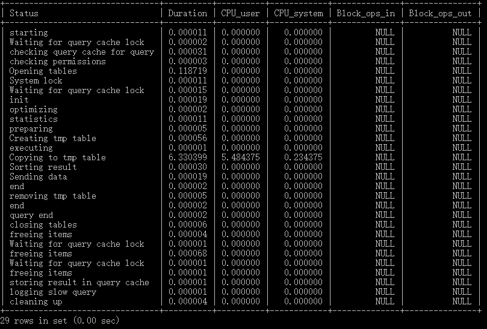

## 2 查询截取优化

### 2.1 查询优化

#### 2.1.1 永远小表驱动大表
即小的数据集驱动大的数据集，类似嵌套循环Nested Loop

```mysql
select * from A where id in (select id from B)
# 等价于
for select id from B
for select * from A where A.id = B.id
```

当B表的数据集必须小于A表的数据集时，用in优于exists

```mysql
select * from A where exists (select 1 from B where B.id = A.id)
# 等价于
for select * from A
for select * from B where B.id = A.id
```

当A表的数据集小于B表的数据集时，用exists优于in

##### EXISTS

SELECT ... FROM table WHERE EXISTS(subquery)

该语法可以理解为：将主查询的数据，放到子查询中做条件验证，根据验证结果来决定主查询的数据结果是否得以保留。

1. EXISTS(subquery)只返回TRUE和FALSE，因此子查询中的SELECT * 也可以是SELECT 1 或者其他，官方说法是实际执行时会忽略SELECT清单，因此没有区别
2. EXISTS子查询的实际执行过程可能经过了优化而不是我们理解上的逐条对比，如果担心效率问题，可以进行实际检验已确定是否有效率问题
3. EXISTS子查询往往也可以用条件表达式、其他子查询或者JOIN替代，何种最优需要具体问题具体分析

#### 2.1.2 order by 关键字优化

ORDER BY子句，尽量使用Index方式排序，避免使用FileSort方式排序

```mysql
CREATE TABLE `tba` (
  `id` int(11) NOT NULL AUTO_INCREMENT,
  `age` int(11) DEFAULT NULL,
  `birth` timestamp NULL DEFAULT NULL,
  PRIMARY KEY (`id`)
) ENGINE=InnoDB AUTO_INCREMENT=4 DEFAULT CHARSET=utf8;

INSERT INTO tbA(age, birth) VALUES(22, NOW());
INSERT INTO tbA(age, birth) VALUES(23, NOW());
INSERT INTO tbA(age, birth) VALUES(24, NOW());

CREATE INDEX idx_A_ageBirth ON tbA(age, birth);

# Using where; Using index
explain select * from tbA where age > 20 order by age;
explain select * from tbA where age > 20 order by age, birth;
explain select * from tbA WHERE birth > '2020-09-25 00:00:00' order by age;
# Using where; Using index; Using filesort
explain select * from tbA where age > 20 order by birth;
explain select * from tbA where age > 20 order by birth, age;
explain select * from tbA WHERE birth > '2020-09-25 00:00:00' order by birth;
#Using index; Using filesort
explain select * from tbA order by birth;
explain select * from tbA order by age ASC, birth DESC;
```

MySQL支持二种方式的排序，FileSort和Index，Index效率高。它指MySQL扫描索引本身完成排序。FileSort方式效率较低。

ORDER BY满足两情况，会使用Index方式排序：

1. ORDER BY语句使用索引最左前列

2. 使用where子句与OrderBy子句条件列组合满足索引最左前列，尽可能在索引列上完成排序操作，遵照索引建的最佳左前缀

##### filesort


如果sort_buffer能够承载所有的字段的时候，mysql就会自动选择第二种，如果不够就会使用第一种，第一种速度略逊于第一种，因为要两次读取数据，两次IO。

如果不在索引列上，filesort有两种算法，双路排序和单路排序：

``双路排序`` MySQL4.1之前是使用双路排序，字面意思是两次扫描磁盘，最终得到数据。读取行指针和orderby列，对他们进行排序，然后扫描已经排序好的列表，按照列表中的值重新从列表中读取对应的数据传输。

从磁盘取排序字段，在buffer进行排序，再从磁盘取其他字段。

取一批数据，要对磁盘进行两次扫描，众所周知，I\O是很耗时的，所以在mysql4.1之后，出现了第二张改进的算法，就是单路排序。

``单路排序`` 从磁盘读取查询需要的所有列，按照orderby列在buffer对它们进行排序，然后扫描排序后的列表进行输出，它的效率更快一些，避免了第二次读取数据，并且把随机IO变成顺序IO，但是它会使用更多的空间，因为它把每一行都保存在内存中了。

**单路排序引申出的问题**

由于单路是后出来的，总体而言好过双路，但是用单路有问题：

在sort_buffer中，单路排序比双路排序占用空间多，因为单路排序是把所有字段都取出，所有有可能去除的数据的总大小超出了sort_buffer的容量，导致每次只能取sort_buffer容量大小的数据，进行排序（创建tmp文件，多路合并），排再取sort_buffer容量大小，再排......从而多次I/O。

**优化策略**

增大sort_buffer_size参数的设置

增大max_length_for_sort_data参数的设置

##### 提高Order By的速度

1. Order By时select * 是一个大忌，只query需要的字段，这点非常重要：

   当query的字段大小总和小于max_length_for_sort_data而排序字段不是TEXT|BLOB类型时，会用单路排序，否则用多路排序

   两种算法的数据都有可能超出sort_buffer的容量，超出之后，会创建tmp文件进行合并排序，导致多次I/O，但是用单路排序算法风险会更大，所以要提高sort_buffer_size

2. 尝试提高 sort_buffer_size

   不管用哪种算法，提高这个参数都会提高效率，当然，要根据系统的能力去提高，因为这个参数是针对每个进程的

3. 尝试提高 max_length_for_sort_data

   提高这个参数，会增加用改进算法的概率。但是如果设的太高，数据总容量超出sort_buffer_size的概率就增大，明显症状是高的磁盘I/O活动和低的处理器使用率

##### 为排序使用索引

MySQL两种排序方式：文件排序或扫描有序索引排序

MySQL能为排序与查询使用相同的索引

```markdown
KEY a_b_c(a,b,c)
# order by 能使用索引最左前缀
	ORDER BY a
	ORDER BY a, b
	ORDER BY a, b, c
	ORDER BY a DESC, b DESC, c DESC

# 如果where使用索引的最左前缀定义为常量，则order by能使用索引
	WHERE a = const ORDER BY b, c
	WHERE a = const AND b = const ORDER BY c
	WHERE a = const AND b > const ORDER BY b, c

# 不能使用索引进行排序
	ORDER BY a ASC, b DESC, c DESC /*排序不一致*/
	WHERE g = const ORDER BY b, c  /*丢失a索引*/
	WHERE a = const ORDER BY c     /*丢失b索引*/
	WHERE a = const ORDER BY a, d  /*d不是索引的一部分*/
	WHERE a in (...) ORDER BY b, c /*对于排序来说，多个相等条件也是范围查询*/
```

#### 2.1.3 group by 关键字优化

groupby实质是先排序后进行分组，遵照索引建的最佳左前缀。

当无法使用索引列，增大max_length_for_sort_data参数的设置 + 增大sort_buffer_size参数的设置。

where高于having,能写在where限定的条件就不要去having限定了。

### 2.2 慢查询日志

MySQL的慢查询日志是MySQL提供的一种日志记录，它用来记录在MySQL中响应时间超过阙值的语句，具体指运行时间超过``long_query_time``值的SQL，则会被记录到慢查询日志中。

long_query_time默认值为10，意思是运行10秒以上的语句。

由慢查询日志来查看哪些SQL超出了我们最大忍耐时间值，比如一条SQL执行查过5秒，就算慢SQL，希望能收集超过5秒的SQL，结合之前explain进行全面分析。

默认情况下，MySQL数据库没有开启慢查询日志，需要手动来设置这个参数。当然如果不是调优需要的话，一般不建议开启该参数，因为开启慢查询日志或多或少带来一定的性能影响，慢查询日志支持将日志记录写入文件。

#### 2.2.1 开启慢查询日志

```mysql
# 查看是否开启
SHOW VARIABLES LIKE '%slow_query_log%';
```


默认情况下``slow_query_log``的值为OFF，表示慢查询日志是禁用的。

```mysql
# 使用下面语句开启慢查询日志只对当前数据库生效，如果MySQL重启后则会失效
set global slow_query_log = 1;
```

如果要永久生效，就必须修改配置文件m y.cnf，在[mysqld]下增加或修改参数，然后重启MySQL服务器：

```markdown
slow_query_log=1
slow_query_log_file=/usr/local/mysql/data/spring-slow.log
long_query_time=3
log_output=FILE
```

关于慢查询的参数slow_query_log_file，它指定慢查询日志的存放路径，系统默认会给一个缺省的文件host_name-slow.log(如果没有指定参数slow_query_log_file的话)。

```mysql
# 开启慢查询日志后，什么样的SQL参会记录到慢查询里面？
SHOW VARIABLES LIKE 'long_query_time%';
show global variables like 'long_query_time';

# 设置慢查询SQL的阙值时间，也可以在my.cnf参数里面修改
# 需要重新连接或者新开一个回话才能看到修改值
set global long_query_time=3;
```

假如运行时间正好等于long_query_time的情况，并不会被记录下来。也就是说，在MySQL源码里是``判断大雨long_query_time，并非大不等于``。

#### 2.2.2 记录慢SQL

```mysql
SELECT SLEEP(4);
```

查看对应的slow_query_log_file：

```
D:\Mysql5.5\bin\mysqld, Version: 5.5.28 (MySQL Community Server (GPL)). started with:
TCP Port: 3306, Named Pipe: MySQL
Time                 Id Command    Argument
# Time: 200926 15:50:58
# User@Host: root[root] @ localhost [127.0.0.1]
# Query_time: 4.000666  Lock_time: 0.000000 Rows_sent: 1  Rows_examined: 0
use test;
SET timestamp=1601106658;
#SHOW VARIABLES LIKE 'long_query_time%';
#SHOW VARIABLES LIKE '%slow_query_log%';
SELECT SLEEP(4);
```

#### 2.2.3 查看当前系统有多少条慢查询记录

```mysql
show global status like '%Slow_queries%';

# Variable_name		Value
# Slow_queries		1
```

#### 2.2.4 日志分析工具mysqldumpshow

在生产环境中，如果要手工分析日志，查找、分析SQL，显然是一个体力活，MySQL提供了日志分析工具mysqldumpshow。

```shell
mysqldumpslow --help
```


s:是表示按何种方式排序

c:访问次数

l:锁定时间

r:返回记录

t:查询时间

al:平均锁定时间

ar:平均返回记录数

at:平均查询时间

t:即为返回前面多少条的数据

g:后边搭配一个正则匹配模式，大小写不敏感的

```shell
# 得到返回记录集最多的10个SQL
mysqldumpslow -s r -t 10 /var/lib/mysql/spring-slow.log
# 得到访问次数最多的10个SQL
mysqldumpslow -s c -t 10 /var/lib/mysql/spring-slow.log
# 得到按照时间排序的前10条里面含有左连接的查询语句
mysqldumpslow -s t -t 10 -g "left join" /var/lib/mysql/spring-slow.log
# 另外建议在使用这些命令时结合 ｜ 和 more 使用，否则可能出现爆屏情况
mysqldumpslow -s r -t 10 /var/lib/mysql/spring-slow.log ｜ more
```

### 2.3 批量数据脚本

往表里插入1000W数据

```mysql
# 建表
CREATE TABLE `dept` (
  `id` int(11) NOT NULL AUTO_INCREMENT,
  `deptno` mediumint(9) DEFAULT NULL,
  `dname` varchar(20) DEFAULT NULL,
  `loc` varchar(13) DEFAULT NULL,
  PRIMARY KEY (`id`)
) ENGINE=InnoDB DEFAULT CHARSET=utf8;

CREATE TABLE `emp` (
  `id` int(11) NOT NULL AUTO_INCREMENT,
  `empno` mediumint(9) DEFAULT NULL COMMENT '编号',
  `ename` varchar(20) DEFAULT NULL COMMENT '名字',
  `job` varchar(9) DEFAULT NULL COMMENT '工作',
  `mgr` mediumint(9) DEFAULT '0' COMMENT '上级编号',
  `hiredate` date DEFAULT NULL COMMENT '入职时间',
  `sal` decimal(7,2) DEFAULT NULL COMMENT '薪水',
  `comn` decimal(7,2) DEFAULT NULL COMMENT '红利',
  `deptno` mediumint(9) DEFAULT NULL COMMENT '部门编号',
  PRIMARY KEY (`id`)
) ENGINE=InnoDB DEFAULT CHARSET=utf8;
```

#### 3.3.1 设置参数log_trust_function_createors

创建函数，假如报错：This function has none of DETERMINISTIC......

由于开启过慢查询日志，因为我们开启了bin-log，就必须为function指定一个参数。

```mysql
SHOW VARIABLES LIKE 'log_bin_trust_function_creators';
set global log_bin_trust_function_creators=1;
```

#### 2.3.2 创建函数

```mysql
# 创建函数保证每条数据都不同
# 随机参数指定长度的字符串
DELIMITER $$
CREATE FUNCTION rand_string(n INT) RETURNS VARCHAR(255)
BEGIN
	DECLARE chars_str VARCHAR(100) DEFAULT 'abcdefghijklmnopqrstuvwxyzABCDEFGHIJKLMNOPQRSTUVWXYZ';
	DECLARE return_str VARCHAR(255) DEFAULT '';
	DECLARE i INT DEFAULT 0;
	WHILE i < n DO
	SET return_str = CONCAT(return_str,SUBSTRING(chars_str, FLOOR(1+RAND()*52), 1));
	SET i = i + 1;
	END WHILE;
	RETURN return_str;
END $$

# 随机产生100~110之间的整数
DELIMITER $$
CREATE FUNCTION rand_num() RETURNS INT(5)
BEGIN
	DECLARE i INT DEFAULT 0;
	SET i = FLOOR(100+RAND()*10);
	RETURN i;
END $$

SELECT rand_string(10);
SELECT rand_num();

# 删除函数
DROP FUNCTION rand_num;
```

#### 2.3.3 创建存储过程

```mysql
# 创建往emp表中插入数据的存储过程
DELIMITER $$
CREATE PROCEDURE insert_emp(IN START INT(10), IN max_num INT(10))
BEGIN
	DECLARE i INT DEFAULT 0;
	# set autocommit = 0 把autocommit设置成0
	SET autocommit = 0;
	REPEAT
	SET i = i + 1;
	INSERT INTO emp(empno, ename, job, mgr, hiredate, sal, comn, deptno) VALUES ((START+i), rand_string(6), 'SALESMAN', 0001, CURDATE(), 2000, 400, rand_num());
	UNTIL i = max_num
	END REPEAT;
	COMMIT;
END $$

# 创建往dept表中插入数据的存储过程
DELIMITER $$
CREATE PROCEDURE insert_dept(IN START INT(10), IN max_num INT(10))
BEGIN
	DECLARE i INT DEFAULT 0;
	SET autocommit = 0;
	REPEAT
	SET i = i + 1;
	INSERT INTO dept(deptno, dname, loc) VALUES ((START+i), rand_string(10), rand_string(8));
	UNTIL i = max_num
	END REPEAT;
	COMMIT;
END $$
```

#### 2.3.4 调用存储过程

```mysql
CALL insert_dept(100, 10);
CALL insert_emp(100001, 500000);
```

### 2.4 Show profiles

``Show profiles`` 是mysql提供可以用来分析当前会话中语句执行的资源消耗情况。可以用于SQL的调优测量。

官网：https://dev.mysql.com/doc/refman/8.0/en/show-profile.html

默认情况下，参数处于``关闭状态，并保存最近15次``的运行结果。

```mysql
# 是否支持，看看当前的SQL版本是否支持
show variables like 'profiling';
# 开启功能，默认是关闭，使用前需要开启
set profiling=on;

# 运行SQL
SELECT * from tb_emp e INNER JOIN tb_dept d on e.deptId = d.id;
select * from emp group by id%10 limit 150000;
select * from emp group by id%20 order by 5;

# 查看结果
show profiles;
```


```mysql
# 诊断SQL，show profile cpu,block io for query 上一步前面的问题SQL数字号码;
show profile cpu,block io for query 3;
```



参数备注：

``ALL`` 显示所有的开销信息

``BLOCK IO`` 显示块IO相关开销

``CONTEXT SWITCHES`` 上下文切换相关开销

``CPU`` 显示CPU相关开销信息

``IPC`` 显示发送和接收相关开销信息

``MEMORY`` 显示内存相关开销信息

``PAGE FAULTS`` 显示页面错误相关开销信息

``SOURCE`` 显示和Source_function，Source_file，Source_line相关的开销信息

``SWAPS`` 显示交换次数相关开销信息

**日常开发注意点**

``converting HEAP to MyISAM`` 查询结果太大，内存都不够用了往磁盘上搬了

``Creating tmp table`` 创建临时表，拷贝数据到临时表，用完再删除

``Copying to tmp table on disk`` 把内存中临时表复制到磁盘，危险！！！

``locked``

### 2.5 全局查询日志

**配置启用**

在 MySQL 的 my.cnf中，设置如下：

```
# 开启
general_log=1
# 记录日志文件的路径
general_log_file=/path/logfile
# 输出格式
log_output=FILE
```

**编码启用**

```mysql
set global general_log=1;
set global log_output='TABLE';

# 此后，所编写的SQL语句，就会记录到mysql库里的general_log表，可以用下面的命令查看
select * from mysql.general_log;
```

``永远不要在生产环境开启这个功能。``

## 3 主从复制

### 3.1 复制的基本原理

slave会从master读取binlog来进行数据同步。


MySQL复制过程分为三步：

1. master将改变记录到二进制日志（binary log），这些记录过程叫做二进制日志事件，binary log events；
2. slave将master的binary log events拷贝到它的中继日志（relay log）;
3. slave重做中继日志中的事件，将改变应用到自己的数据库中，MySQL复制是异步的且串行化的。

### 3.2 复制的基本原则

每个slave只有一个master

每个slave只能有一个唯一的服务器ID

每个master可以有多个salve

### 3.3 一主一从常见配置

MySQL版本一致且后台以服务运行，主从都配置在【mysqld】结点下，都是小写。

主机从机都关闭防火墙。

#### 3.3.1 主机修改my.cnf配置文件

```markdown
[mysqld]
# 1.【必须】主服务器唯一ID
server-id =1
# 2.【必须】启用二进制日志
log-bin=自己本地的路径/mysqlbin
log-bin=D:/Mysql5.5/data/mysqlbin
# 3.【可选】启动错误日志
log-err=自己本地的路径/mysqlerr
# 4.【可选】根目录
basedir="自己本地路径"
# 5.【可选】临时目录
tmpdir="自己的本地路劲"
# 6.【可选】数据目录
datadir="自己本地路径/Data/"
# 7.主机，读写都可以
read-only=0
# 8.【可选】设置不要复制的数据库
binlog-ignore-db=mysql
# 9.【可选】设置需要复制的数据
binlog-do-db=需要复制的主数据库名字
```

#### 3.3.2 从机修改my.cnf配置文件

```markdown
# 【必须】从服务器唯一ID
server-id       = 2
# 【可选】启用二进制文件
log-bin=mysql-bin
```

#### 3.3.3 在主机上建立账户并授权slave

```mysql
# 给ip为192.168.174.128的从机授权帐号为zhangsan密码为123456的帐号访问
GRANT REPLICATION SLAVE  ON*.* TO '帐号'@'从机器数据库IP' IDENTIFIED BY '密码';
GRANT REPLICATION SLAVE  ON*.* TO 'zhangsan'@'192.168.174.128' IDENTIFIED BY '123456';
# 刷新MySQL的系统权限相关表
flush privileges;
# 查询主机状态，记录下File和Position的值（从File文件的Position行开始复制）
show master status;
```


#### 3.3.4 在从机上配置需要复制的主机

```mysql
# 如果之前做过主从复制，要先停止
stop slave;

CHANGE MASTER TO 
MASTER_HOST='主机IP',
MASTER_USER='帐号',
MASTER_PASSWORD='密码',
MASTER_LOG_FILE='File名字',MASTER_LOG_POS=Position数字;
CHANGE MASTER TO 
MASTER_HOST='192.168.174.1',
MASTER_USER='zhangsan',
MASTER_PASSWORD='123456',
MASTER_LOG_FILE='mysqlbin.000001',MASTER_LOG_POS=107;

# 启动从服务器复制功能
start slave;

# 查看slave状态
show slave status;
```

下面两个参数都是YES，则说明主从配置成功！

Slave_IO_Running:Yes

Slave_SQL_Running:Yes


------


