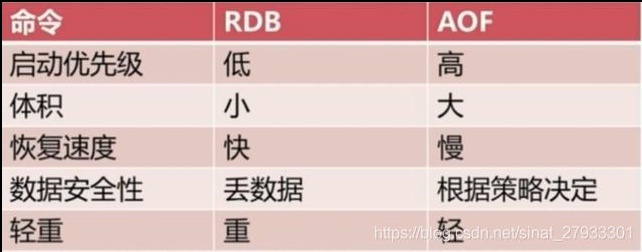

#### Redis两种持久化方式的优缺点

redis的两种持久化方式：

1. RDB（Redis DataBase ） 在指定的时间间隔内生成数据集的时间点快照 
2. AOF（append only file） 记录服务器执行的所有写操作命令 
3. redis还可以同时使用AOF持久化和RDB持久化,在这种情况下,当redis重启时,它会有限使用AOF文件来还原数据集,因为AOF文件保存的数据集通常比RDB文件所保存的数据集更加完整

