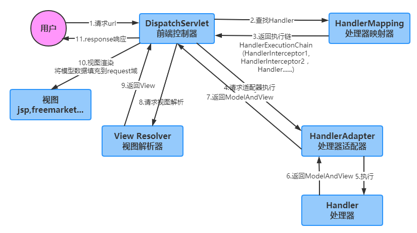

#### Q1 出Springboot项目启动的几种方式吗？

1. main

2. java -jar jar包路径 --参数(--server.port=8081)

3. spring-boot-maven-plugin

   mvn spring-boot:run 

   mvn spring-boot:help -Ddetail 

   mvn spring-boot:run -Drun.arguments="--server.port=8888" 


#### Q2 SpringMVC 工作原理？

1. 用户向服务器发送请求，请求被SpringMVC的前端控制前DispatchServlet捕获
2. DispatchServlet收到请求调用处理器映射器HandlerMapping，根据请求URL找到具体的处理器，生成处理器执行链HandlerExecutionChain(包括处理对象和处理器拦截器)，一并返回给DispatchServlet
3. DispatchServlet根据处理器Handler获得处理器适配器HandlerAdapter，执行HandlerAdapter处理一系列的操作，如：参数封装，数据格式转换，数据验证等
4. 执行处理器Handler(Controller，也叫页面控制器)，Handler执行完成返回ModelAndView
5. HandlerAdapter将Handler执行结果ModelAndView返回到DispatcherServlet
6. DispatcherServlet将ModelAndView传给ViewReslover视图解析器，ViewReslover解析后返回具体View
7. DispatcherServlet对View进行渲染视图（即将模型数据model填充至视图中），DispatcherServlet响应用户



Controller		RequestMapping

RequestBody		PathVariable		RequestParam

ResponseBody


#### Q3 简单介绍一下 Spring bean 的生命周期

`定义` 在配置文件里面用 bean 标签来进行定义

`初始化` 有两种初始化方式：

1. 在配置文件中指定 init-method 属性来完成
2. 实现 org.springframework.beans.factory.InitializingBean 接口

`调用` 有三种方式可以得到 bean 实例，并进行调用

`销毁` 有两种销毁方式：

1. 使用配置文件指定 destory-method 属性
2. 实现 org.springframework.beans.factory.DisposableBean 接口


#### Q4 请描述一下 Spring 的事务

基于 TransactionInterceptor 的编程式事务

基于 TransactionProxyFactoryBean 的声明式事务

基于 @Transactional 的声明式事务


#### Q5 有哪些不同类型的 IOC（依赖注入）方式？

Spring 提供了多种依赖注入的方式。

1.Set 注入

```java
private HelloService helloService;

@Autowired
public void setHelloService(HelloService helloService) {
    this.helloService = helloService;
}
```

2.构造器注入

```java
// 属性注入
//@Autowired
private HelloService helloService;

@Autowired
public HelloController(HelloService helloService) {
    this.helloService = helloService;
}
```

3.静态工厂的方法注入

4.实例工厂的方法注入


#### Q6 Spring 支持的几种 bean 的作用域

> Spring 框架中 bean  默认是单例的，不要使用非静态的成员变量，否则会发生数据逻辑混乱。 正因为单例所以不是线程安全的。

**解决方案**

- 不要在controller中定义成员变量。
- 万一必须要定义一个非静态成员变量时候，则通过注解@Scope(“prototype”)，将其设置为多例模式。
- 在Controller中使用ThreadLocal变量

spring bean作用域有以下5个：

``singleton 单例模式`` 当spring创建applicationContext容器的时候，spring会欲初始化所有的该作用域实例，加上lazy-init就可以避免预处理；

``prototype 原型模式`` 每次通过getBean获取该bean就会新产生一个实例，创建后spring将不再对其管理；

``request`` 搞web的大家都应该明白request的域了吧，就是每次请求都新产生一个实例，和prototype不同就是创建后，接下来的管理，spring依然在监听；

``session`` 每次会话，同上；

``global session`` 全局的web域，类似于servlet中的application。


#### Q7 什么是 bean 的自动装配？

无须在 Spring 配置文件中描述 javaBean 之间的依赖关系（如配置property、constructor-arg）。IOC 容器会自动建立 javabean 之间的关联关系。

有五种自动装配的方式，可以用来指导 Spring 容器用自动装配方式来进行依赖注入。

1）no：默认的方式是不进行自动装配，通过显式设置 ref 属性来进行装配。

2）byName：通过参数名自动装配，Spring 容器在配置文件中发现 bean 的 autowire 属性被设置成 byname，之后容器试图匹配、装配和该 bean 的属性具有相同名字的 bean。

3）byType:：通过参数类型自动装配，Spring 容器在配置文件中发现 bean 的 autowire 属性被设置成 byType，之后容器试图匹配、装配和该 bean 的属性具有相同类型的 bean。如果有多个 bean 符合条件，则抛出错误。

4）constructor：这个方式类似于 byType， 但是要提供给构造器参数，如果没有确定的带参数的构造器参数类型，将会抛出异常。

5）autodetect：首先尝试使用 constructor 来自动装配，如果无法工作，则使用 byType 方式。


