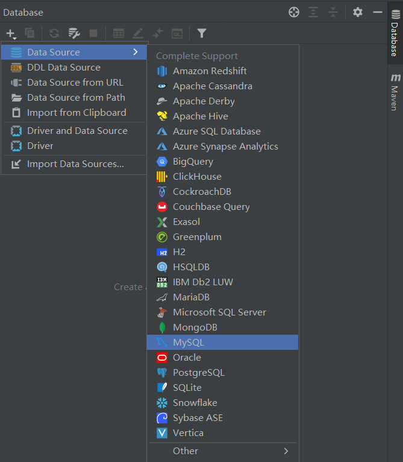

### 解决 Mapper 文件出现黄色提示

1. 配置 Database

2. 配置 SQL 方言

### Mapper 文件 if 数值型不用写 != ''

通过源码了解到，mybatis在预编译sql时，使用OGNL表达式来解析if标签，对于Integer类型属性，在判断`不等于''`时，例如age != ''，OGNL会返回''的长度，源码：(s.length() == 0) ? 0.0 : Double.parseDouble( s )，因此表达式age != ''被当做`age != 0`来判断，所以当age为0时，if条件判断不通过。
